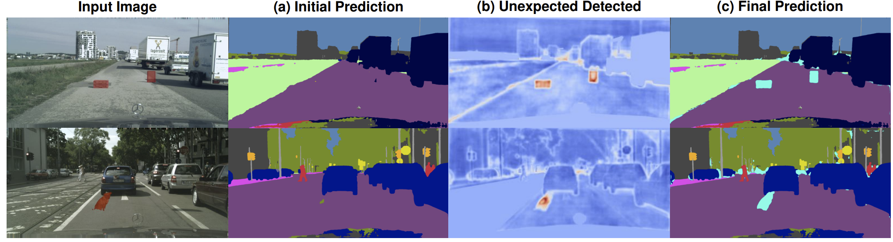
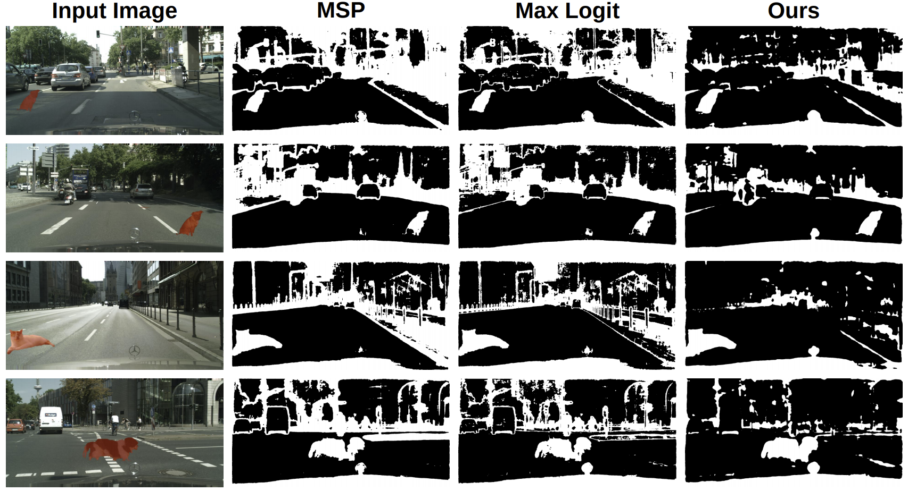

# Standardized Max Logits \[Eng\]

한국어로 쓰인 리뷰를 읽으려면 [**여기**](./iccv-2021-SML-kor.md)를 누르세요.

I would like to introduce one of my recent papers, Standardized Max Logits (SML), which is accepted to ICCV 2021 as an Oral presentation. We tackled Out-of-Distribution (OoD) detection in urban-scene segmentation for autonomous driving. Our method achieved state-of-the-art performance on the public leaderboard ([Fishyscapes](https://fishyscapes.com/results)).

##  1. Problem definition

Recent advances in urban-scene semantic segmentation have achieved significant success on various benchmark datasets. Albeit these efforts, there still remains a huge problem to deploy them in the real world - unexpected obstacles occurring in the real driving scenarios. Handling such obstacles properly is not a trivial problem since the segmentation model always predicts the pixels as one of the pre-defined classes used for the training. Addressing such an issue is crucial for safety-critical applications such as autonomous driving. As shown in the above figure, failing to identify the dog or boxes in the scene can lead to disastrous situation - hitting the dog and boxes. We therefore address such situations by identifying unexpected obstacles and provide the starting point to deal with those regions differently. 

Before going any further, let's first talk about the precise definition of the semantic segmentation task. With given an image $$x\in{\mathbb{X}_{train}}^{H\times{W}}$$ and its pixel-wise class label $$y\in{\mathbb{Y}_{train}}^{H\times{W}}$$ pairs, we train the segmentation model $$G$$ that predicts the $$\hat{y}$$, which is pixel-wise class prediction of $$x$$. The network is trained by using a cross-entropy loss below.
$$
CrossEntropy = -\sum\limits_{x\in\mathbb{X}}{y\log{\hat{y}}},
$$
where $$y$$ denotes the corresponding label of an input image $$x$$. As one can imagine, this model always predicts the pixels into one of the pre-defined classes, even on the anomalous regions that did not appear on the training samples. Therefore, we propose a simple yet effective method that outputs the pixel-wise anomaly score to identify such regions properly without requiring additional training or extra network modules.

## 2. Preliminary

For OoD detection, Maximum Softmax Probability (MSP) [1] has been proposed in the image classification task. It utilizes the max softmax scores as anomaly scores, which does not require additional training. However, due to the fast-growing property of exponential, MSP suffers from over confident problem that anomalous images have high MSP score (i.e., low anomaly score). To address this problem, employing Max Logit [2] score is proposed to identify anomalous regions in semantic segmentation. In this work, we point out the problem of Max Logit score and propose a novel method that is effective on anomaly identification in semantic segmentation.

### Other related work

To tackle OoD detection in semantic segmentation, several studies [3, 4, 5, 6, 7, 8] have been proposed. Some studies [3, 4] overlaid unseen objects from PASCAL VOC dataset on original training images (e.g., Cityscapes) and trained the network over the training images to detect anomalous regions. Other work [5, 6, 7, 8] exploits the image resynthesis for identifying unexpected obstacles. These methods are based on the intuition that image resynthesis models fail to reconstruct the region with unexpected objects. However, both methods requires either extra training data or additional training, which is labor intensive.

## 3. Motivation

### Findings from previous work

Above figure explains the motivation of our work. We plotted the prediction of a pre-trained segmentation network on Fishyscapes Lost&Found OoD dataset. Each bar denotes the distribution of pixels, and red denotes in-distribution (pre-defined classes), and blue indicates unexpected pixels. Gray area stands for the overlapped region between  minimum score of in-distribution pixels and maximum score of unexpected pixels (i.e., amount of false positives and false negatives). As aforementioned in the Preliminary section, MSP suffers from over-confident problem. In the Max Logit case,  the distribution varies a lot for each class. This is problematic since we utilize a single threshold for all the classes to identify anomalous pixels. 

### Idea

From this finding, we propose Standardized Max Logit (SML) score, which is class-wisely standardized score of Max Logit. As shown in the figure, one can notice that the overlapped region significantly decreased compared to the previous methods. In addition to this SML, we further propose subsequent techniques to improve the anomaly detection performance by suppressing boundary regions and removing small irregulars.

## 4. Method

Our proposed method is illustrated in the above figure. We first infer an image and obtain the Max Logit scores. Afterwards, we standardizes the Max Logit values with the statistics obtained from training samples and iteratively replace the values in the boundary with those of surrounding non-boundary pixels. Lastly, we smooth out the whole image so that small irregular values can be removed. 

The following describes how we obtain the Max Logit and prediction from a pre-trained segmentation network. Let $$X \in \mathbb{R}^{3\times{H}\times{W}}$$ and $$C$$ denote an input image and the number of pre-defined classes. The logit output $$F\in\mathbb{R}^{C\times{H}\times{W}}$$ can be obtained from the network output before the softmax layer. Then, the max logit $$L\in\mathbb{R}^{H\times{W}}$$ and prediction $$\hat{Y}\in\mathbb{R}^{H\times{W}}$$ at each location $$h,w$$ are defined as 
$$
\boldsymbol{L}_{h,w} = \max_\limits{c}\boldsymbol{F}_{c,h,w}\\
\boldsymbol{\hat{Y}}_{h,w} = \arg{\max}_\limits{c}\boldsymbol{F}_{c,h,w},
$$
where $$c\in\{1, ..., C\}$$.

### 4-1. Standardized Max Logits (SML)

For the standardization, we should first obtain the statistics of training samples for each class. To be specific, we calculate the mean and variance of each class in training samples. This process can be defined as following 
$$
\mu_c = \frac{\sum_i\sum_{h,w}\mathbb{1}(\boldsymbol{\hat{Y}}^{(i)}_{h,w} = c)\cdot{\boldsymbol{L}^{(i)}_{h,w}}}{\sum_i\sum_{h,w}\mathbb{1}(\boldsymbol{\hat{Y}}^{(i)}_{h,w} = c)}\\

\sigma_c = \frac{\sum_i\sum_{h,w}\mathbb{1}(\boldsymbol{\hat{Y}}^{(i)}_{h,w} = c)\cdot{(\boldsymbol{L}^{(i)}_{h,w} - \mu_c)^2}}{\sum_i\sum_{h,w}\mathbb{1}(\boldsymbol{\hat{Y}}^{(i)}_{h,w}=c)}
$$
where $$i$$ indicates the $$i$$-th training sample and $$\mathbb{1}(\cdot)$$ represents the indicator function.

With these obtained training statistics, we calculate SML $$\boldsymbol{S}\in\mathbb{R}^{H\times{W}}$$ by standardizing the Max logit values of test images as 
$$
\boldsymbol{S}_{h,w}=\frac{\boldsymbol{L_{h,w}}-\mu_{\boldsymbol{\hat{Y}_{h,w}}}}{\sigma_{\hat{Y}_{h,w}}}.
$$
Utilizing SML converts the previous Max Logit values to have the same meaning, which are relative scores in their class. This mapping to the same semantic space enables us to apply subsequent techniques such as Iterative Boundary Suppression and Dilated Smoothing.

### 4-2. Iterative Boundary Suppression

Boundary regions tend to be more uncertain than inner regions of classes because those regions where the transition from one class to another occurs. Therefore, we come up with Iterative Boundary Suppression that propagates more certain values of surrounding pixels into the boundary regions. This process is illustrated in the above figure. We first obtain the boundary mask from the initial prediction. Then, apply Boundary Aware Pooling on those regions so that the surrounding values can replace the boundary values. We iteratively apply this process by reducing the boundary width. 

To be more specific, we set the initial boundary width to $$r_0$$ and reduce it for each iteration by $$\Delta{r}$$. With a given boundary width $$r_i$$ at the $$i$$-th iteration and the prediction $$\hat{Y}$$, we obtain the non-boundary mask $$\boldsymbol{M}^{(i)}\in\mathbb{R}^{H\times{W}}$$ at each pixel $$h, w$$ as 
$$
\boldsymbol{M}^{(i)} = \begin{cases}
0, & \text{if} ^\exists{h^\prime, w^\prime\ \  \text{\textit{s.t.,}}\  \boldsymbol{\hat{Y}}_{h, w} \neq \boldsymbol{\hat{Y}}_{h^\prime, w^\prime}} \\
1, & \text{otherwise}
\end{cases}\quad,
$$
for $$^\forall{h^\prime, w^\prime}$$ that satisfies $$|h - h^\prime| + |w - w^\prime| \leq r_i$$. 

Then, we apply BAP with this mask $$\boldsymbol{M}^{(i)}$$, which is defined as 
$$
BAP(\boldsymbol{S}^{(i)}_\mathcal{R}, \boldsymbol{M}^{(i)}_{\mathcal{R}}) = \frac{\sum_{h,w}{\boldsymbol{S}^{(i)}_{h,w} \times \boldsymbol{M}^{(i)}_{h,w}}}{\sum_{h,w}{\boldsymbol{M}^{(i)}_{h,w}}},
$$
where $$\boldsymbol{S}^{(i)}_\mathcal{R}$$ and $$\boldsymbol{M}^{(i)}_\mathcal{R}$$ denote the patch of receptive field $$\mathcal{R}$$ on $$\boldsymbol{S}^{(i)}$$ and $$\boldsymbol{M}^{(i)}$$, and $$(h, w) \in \mathcal{R}$$ enumerates the pixels in $$\mathcal{R}$$. We iteratively apply this process for $$n$$ times, so that we can completely replace the boundary regions with confident values. We set the initial boundary width $r_0$ as 8, reduce rate $$\Delta{r}$$ as 2, the number of iteration $$n$$ as 4, and the size of receptive field $$\mathcal{R}$$ as $$3\times3$$.  By employing this process, we are able to successfully remove the false positives and false negatives in boundary regions.

### 4-3. Dilated Smoothing

Iterative Boundary Suppression alone, however, cannot remove small false positives and false negatives not reside in the boundary regions. Gaussian smoothing is well-known for its effectiveness in removing small noises.  Therefore, we smooth out the boundary suppressed values with Gaussian smoothing. In addition, to reflect wider regions while smoothing, we broaden the receptive field with dilation. 

## 5. Experiment & Result

### Experimental setup

We measured area under receiver operating characteristics (AUROC) and average precision (AP). In addition, we measured false positive rate at true positive rate of 95% (FPR$$_{95}$$). For the qualitative analysis, we used the threshold at true positive rate at 95% (TPR$$_{95}$$). 

We validated our approach on the following datasets

* Fishyscapes Lost & Found [9] - Real driving scene dataset containing 37 types of small unexpected obstacles such as boxes.
* Fishyscapes Static [9] - Composited images that unexpected obstacles are overlaid on Cityscapes validation images.
* Road Anomaly [5] - Web collected anomaly dataset containing unusual dangers which vehicles confront on roads.

### Implementation Details

We adopted DeepLabv3+ [10] as our segmentation architecture and utilized ResNet101 [11] as our backbone. We set the output stride as 8, batch size as 8, initial learning rate as 1e-2, and momentum of 0.9. We pre-trained our model on Cityscapes dataset for 60K iterations using polynomial learning rate scheduling with the power of 0.9 and using auxiliary loss proposed in PSPNet [12] with loss weight $$\lambda$$ of 0.4. For data augmentation, we applied color and positional augmentations such as color jittering, Gaussian blur, random horizontal flip, and random cropping. We also applied class-uniform sampling [13, 14] with a rate of 0.5. 

For boundary suppression, we calculated the boundary mask by subtracting the eroded prediction map from the dilated prediction map. For the dilation and erosion, we utilized L1 filters. We set the number of boundary iterations $$n$$, the initial boundary width $$r_0$$, and the dilation rate $$d$$ as 4, 8, and 6, respectively. Additionally, we set the sizes of the boundary-aware average pooling kernel and the smoothing kernel size as $$3\times{3}$$ and $$7\times7$$, respectively.

We used the negative of the final SML values as our anomaly scores. Official implementation can be found at https://github.com/shjung13/Standardized-max-logits

### Qualitative Result

Above figures illustrates qualitative results of MSP, Max Logit, and our method on Fishyscapes Lost&Found and Static, respectively. White pixels indicate the pixels predicted as unexpected. As shown, ours successfully removed lots of false positives compared to MSP and Max Logits.

Above figure illustrates the qualitative results of applying SML, Iterative Boundary Suppression, and Dilated Smoothing, respectively on Fishyscapes Lost & Found images. On the yellow boxes, we can see iterative boundary suppression successfully remove the false positive pixels in boundary regions. Moreover, in the green boxes, one can check the small false positives disappear after applying dilated smoothing.

### Quantitative Results

We first show the results on the leaderboard and then show the validation results on various datasets.

Above table is the leaderboard results in Fishyscapes Lost&Found test set and Static test set. As can be shown, our method achieved state-of-the-art performance on Fishyscapes Lost&Found among the ones did not require additional training and OoD data.

This is the validation results on Fishyscapes Lost&Found and Static validation set and Road Anomaly. Our method outperforms other baselines with a large gap. Note that our method does not require additional training or OoD dataset for training.

Furthermore, as shown in the above table, our method involves marginal computational costs, compared to image resynthesis methods.

## 6. Conclusion

Our work proposed a simple yet effective approach to identify unexpected obstacles on urban scenes. Ours require minimal overhead on inference time and memory usage. Moreover, our method can combined with other techniques that requires additional training or OoD dataset, since we proposes post-processing techniques. However, there still remains room for improvement. First, our method depends on how the segmentation network trained since our approach depend on Max Logit distributions. In addition, after dilated smoothing, small OoD obstacles can be remove as well along with false positives. Those are the remaining further work to do in the future.

Thank you.

### Take home message 

> Aligning class-wise distributions of Max Logit is helpful for OoD detection
>
> Post-processing method can be an effective solution since we can use it for any segmentation networks, off-the-shelf
>
> In semantic segmentation or OoD detection in semantic segmentation, boundary regions can be uncertain, and addressing such regions properly can be critical for some cases.

## Author / Reviewer information

### Author

**정상헌 \(Sanghun Jung\)** 

* KAIST AI
* Personal page: https://shjung13.github.io
* Github: https://github.com/shjung13
* LinkedIn: https://www.linkedin.com/in/sanghun-jung-b17a4b1b8/

### Reviewer

1. Korean name \(English name\): Affiliation / Contact information
2. Korean name \(English name\): Affiliation / Contact information
3. ...

## Reference & Additional materials

1. Sanghun Jung, Jungsoo Lee, Daehoon Gwak, Sungha Choi, and Jaegul Choo. Standardized Max Logits: A Simple yet Effective Approach for Identifying Unexpected Road Obstacles in Urban-Scene Segmentation. In Proc. of the IEEE/CVF International Conference on Computer Vision (ICCV), pages 15425-15434, 2021.
2. Github: https://github.com/shjung13/Standardized-max-logits
3. Citation of related work
   1. [1] Dan Hendrycks and Kevin Gimpel. A baseline for detecting misclassified and out-of-distribution examples in neural networks. In Proc. of the International Conference on Learning Representations (ICLR), 2017.
   2. [2] Dan Hendrycks, Steven Basart, Mantas Mazeika, Mohammadreza Mostajabi, Jacob Steinhardt, and Dawn Song. Scaling out-of-distribution detection for real-world settings. arXiv preprint arXiv:1911.11132, 2020.
   3. [3] Petra Bevandic, Ivan Kre ´ so, Marin Or ˇ siˇ c, and Sini ´ saˇ Segvi ˇ c.´ Dense outlier detection and open-set recognition based on training with noisy negative images. arXiv preprint arXiv:2101.09193, 2021.
   4. [4] Robin Chan, Matthias Rottmann, and Hanno Gottschalk. Entropy maximization and meta classification for out-ofdistribution detection in semantic segmentation. arXiv preprint arXiv:2012.06575, 2020.
   5. [5] Krzysztof Lis, Krishna Nakka, Pascal Fua, and Mathieu Salzmann. Detecting the unexpected via image resynthesis. In Proc. of IEEE international conference on computer vision (ICCV), pages 2151–2161, 2019.
   6. [6] Krzysztof Lis, Sina Honari, Pascal Fua, and Mathieu Salzmann. Detecting road obstacles by erasing them. arXiv preprint arXiv:2012.13633, 2020.
   7. [7] Yingda Xia, Yi Zhang, Fengze Liu, Wei Shen, and Alan L. Yuille. Synthesize then compare: Detecting failures and anomalies for semantic segmentation. In Proc. of the European Conference on Computer Vision (ECCV), pages 145– 161, 2020.
   8. [8] Toshiaki Ohgushi, Kenji Horiguchi, and Masao Yamanaka. Road obstacle detection method based on an autoencoder with semantic segmentation. In Proc. of the Asian Conference on Computer Vision (ACCV), pages 223–238, 2020.
   9. [9] Hermann Blum, Paul-Edouard Sarlin, Juan Nieto, Roland Siegwart, and Cesar Cadena. The fishyscapes benchmark: Measuring blind spots in semantic segmentation. arXiv preprint arXiv:1904.03215, 2019.
   10. [10] Liang-Chieh Chen, Yukun Zhu, George Papandreou, Florian Schroff, and Hartwig Adam. Encoder-decoder with atrous separable convolution for semantic image segmentation. In Proc. of the European Conference on Computer Vision (ECCV), pages 801–818, 2018.
   11. [11] Kaiming He, Xiangyu Zhang, Shaoqing Ren, and Jian Sun. Deep residual learning for image recognition. In Proc. of IEEE conference on computer vision and pattern recognition (CVPR), pages 770–778, 2016.
   12. [12] Hanchao Li, Pengfei Xiong, Jie An, and Lingxue Wang. Pyramid attention network for semantic segmentation. In Proc. of the British Machine Vision Conference (BMVC), page 285, 2018.
   13. [13] Samuel Rota Bulo, Lorenzo Porzi, and Peter Kontschieder. In-place activated batchnorm for memory-optimized training of dnns. In Proc. of IEEE conference on computer vision and pattern recognition (CVPR), pages 5639–5647, 2018.
   14. [14] Yi Zhu, Karan Sapra, Fitsum A Reda, Kevin J Shih, Shawn Newsam, Andrew Tao, and Bryan Catanzaro. Improving semantic segmentation via video propagation and label relaxation. In Proc. of IEEE conference on computer vision and pattern recognition (CVPR), pages 8856–8865, 2019.
4. Other useful materials
5. ...

