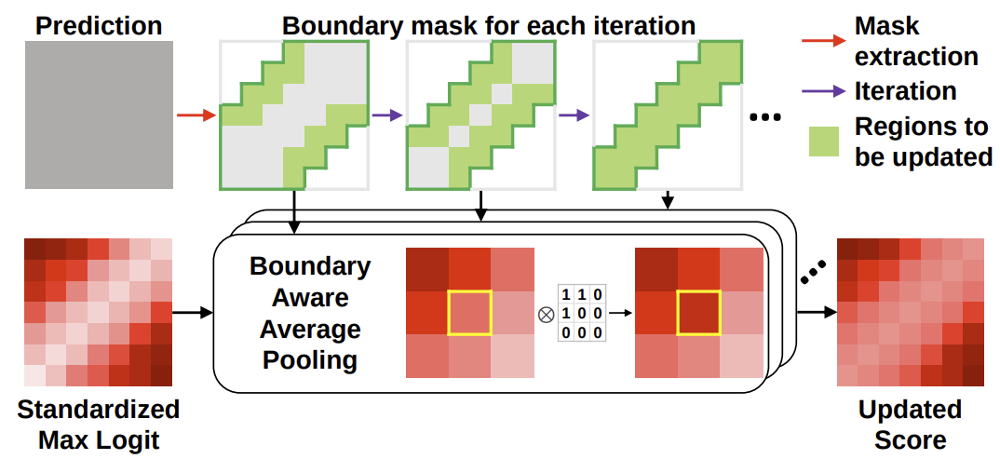

# Standardized Max Logits \[Kor\]

[**English version**](iccv-2021-SML-eng.md) of this article is available.

안녕하세요, 이 포스팅에서 소개드리고자 하는 논문은 이번 ICCV 2021에 Oral presentation으로 등재된 논문인 Standardized Max Logits (SML)에 대해 설명드리고자 합니다. 해당 논문에는 저와 이정수 석사과정생이 공동 1저자로 참여하였으며 도로 주행 semantic segmentation에서의 Out-of-Distribution 탐지 문제를 해결하고자 한 논문입니다. 저희의 방법론은 Fishyscapes라는 public leaderboard에서 state-of-the-art 성능을 보였습니다 ([Fishyscapes](https://fishyscapes.com/results)).

##  1. Problem definition

최근 도로 주행 semantic segmentation의 발전은 다양한 benchmarking dataset에서 큰 성과를 이루었습니다. 하지만 이런 노력에도 불구하고 여전히 이러한 모델들은 실제 주행 환경에 적용되기 힘듭니다. 그 이유는 모델의 학습 시에 저희가 가정한 몇 개의 pre-define된 class만을 이용해서 학습하게 되고, 이렇게 학습한 모델은 input image의 모든 픽셀을 pre-define된 class중 하나로 예측하게 됩니다. 따라서, 실제 주행 시에 pre-define된 class가 아닌 unexpected obstacle이 등장하면 위 그림에서 보이다시피 제대로 대처할 수 없게 됩니다. 따라서, anomalous한 영역은 찾아내는 것이 안전이 중요한 application인 도로 주행에서 큰 문제이며 저희의 방법론은 이러한 영역을 따로 다룰 수 있게 도와주는 시발점 역할을 해줍니다.

자세한 설명에 들어가기 앞서, semantic segmentation task의 정의에 대해 설명해보도록 하겠습니다. 주어진 input image $$x\in{\mathbb{X}_{train}}^{H\times{W}}$$와 그 픽셀별로의 정답을 가지고 있는 $$y\in{\mathbb{Y}_{train}}^{H\times{W}}$$ 에 대하여 우리는 $$x$$에 대한 예측 값 $$\hat{y}$$를 내뱉는 segmentation model $$G$$를 cross-entropy loss를 사용하여 학습하게 됩니다.
$$
CrossEntropy = -\sum\limits_{x\in\mathbb{X}}{y\log{\hat{y}}},
$$
여기에서도 알 수 있다시피, 모델 $G$는 anomalous한 영역에 대해서도 pre-defined class로 예측하게 됩니다. 이러한 점을 해결하고자 저희의 논문에서는 각 픽셀에 대해 anomaly score를 예측하는 간단하고 효과적인 방법론을 제시하며 다른 방법론들과 달리 추가적인 training이나 다른 network module을 사용하지 않습니다.

## 2. Preliminary

Out-of-distribution (OoD) 탐지를 위해 다양한 이전 연구들이 있어왔습니다. 그 중, 저희가 주목한 방법론들은 Maximum Softmax Probability (MSP) [1]과 Max Logit [2] 입니다. 두 가지 방법론은 모두 in-distribution pixel들 대비, OoD 픽셀들의 prediction score가 더 작은 점을 이용한 detection measure입니다. 먼저 MSP [1]는 network prediction에 softmax를 취한 값을 anomaly score로 사용하는 것을 제안한 seminal 연구입니다. 하지만 MSP score의 경우,  exponential함수가 빠르게 증가하는 성질을 가지고 있기 때문에 anomaly image들이 높은 MSP score를 갖는 (낮은 anomaly score) 문제가 있었습니다. 이러한 문제를 해결하기 위해 제안된 방법론이 Max Logit [2] 입니다. Softmax에 들어가기 전의 logit 값을 anomaly score로 사용하는 방법을 제안하였으며 exponential function을 사용하지 않기 때문에 MSP에서의 over-confident 문제를 해결할 수 있었습니다. 저희의 연구에서는 이 Max Logit이 semantic segmentation에서 가질 수 있는 문제를 이야기하고 이를 해결하기 위한 방법을 제시합니다.

### Other related work

Semantic segmentation의 OoD 탐지 문제를 해결하기 위해, 다양한 연구들 [3, 4, 5, 6, 7, 8]이 제안되었습니다. 몇몇의 연구 [3, 4]들은 PASCAL VOC에서 pre-defined class에 해당하지 않는 object들을 찾아서 training dataset인 Cityscapes에 합성하여 segmentation model을 학습시켰고 다른 종류의 연구 [5, 6, 7, 8]들은 image resynthesis 방법을 사용하였습니다. 이 방법론들은 image resynthesis 모델이 unseen object는 맞게 생성해내지 못한다는 직관에서 시작되었습니다. 하지만 이 두 방법론 모두 추가적인 OoD dataset을 필요로 하거나 또는 추가적인 학습이 필요하였습니다. 

## 3. Motivation

### Findings from previous work

저희 연구의 motivation은 위 이미지를 통해 확인하실 수 있습니다. 위의 이미지는 pre-train된 segmentation network를 Fishyscapes Lost&Found dataset에 inference한 결과입니다. 각각의 bar는 pixel 값들의 분포를 의미하고, 주황색 bar는 in-distribution (pre-defined classes) 그리고 파란색은 unexpected (pre-define되지 않은 class) pixel들를 의미합니다. 회색 영역은 in-distribution과 unexpected pixel들이 겹치는 영역 (false positives and false negatives)을 의미합니다. 보여지는 바와 같이 MSP의 경우 over-confident 문제가 발생하는 것을 보실 수가 있고 그 결과 가장 큰 회색 영역을 갖는 것을 확인하실 수 있습니다. Max Logit의 경우, 보시는 바와 같이 각 class별로 분포가 상이한 것을 보실 수가 있습니다. 이러한 현상은 anomaly detection에서 문제가 될 수 있는데, 그 이유는 anomaly를 찾아내기 위해 각 class별로 다른 threshold를 사용하지 않고, 하나의 threshold를 사용하기 때문입니다.

### Idea

이러한 발견으로부터, 저희는 Standardized Max Logit (SML)이라는 새로운 anomaly score를 제안합니다. 이 SML은 Max Logit에서 class별로 다르게 형성되어있던 분포를 standardization을 통해 같은 분포를 맞춰준 anomaly score입니다. 위 이미지에서 보실 수 있다시피 SML을 적용할 경우 overlap된 영역이 크게 줄어드는 것을 확인하실 수 있습니다. 이러한 SML에서 더 나아가, 저희의 연구에서는 class boundary와 작은 irregular들에 집중해서 이 결과를 더 향상시킬 수 있는 추가적인 모듈들을 제안합니다. 

## 4. Method

위 그림에서 확인할 수 있다시피, 저희는 우선 pre-train된 모델을 이용해서 Max Logit값을 구해냅니다. 그 후에, 저희는 이 Max Logit값들을 class별로 training statistics를 이용해서 standardize를 해주게 됩니다. 더 나아가, uncertain한 boundary 영역을 더 certain한 값인 주변의 non-boundary 값들을 이용해서 전파시켜주고 마지막으로 dilated smoothing을 적용하여 작은 irregular들을 제거해줍니다. 

다음의 과정은 저희가 어떻게 Max Logit과 prediction을 얻었는지 수식으로 표현해보겠습니다. 주어진 input image $$X\in\mathbb{R}^{3\times{H}\times{W}}$$와 pre-define된 class의 개수 $$C$$에 대하여 logit output인 $$F\in\mathbb{R}^{C\times{H}\times{W}}$$는 네트워크의 softmax layer 전의 output으로 정의됩니다. 따라서, Max Logit $$L\in\mathbb{R}^{H\times{W}}$$과 prediction $$\hat{Y}\in\mathbb{R}^{H\times{W}}$$은 $$c\in\{1, ..., C\}$$에 대하여 input image의 $$h, w$$ 위치에서 아래와 같이 정의됩니다. 
$$
\boldsymbol{L}_{h,w} = \max_\limits{c}\boldsymbol{F}_{c,h,w}\\
\boldsymbol{\hat{Y}}_{h,w} = \arg{\max}_\limits{c}\boldsymbol{F}_{c,h,w}
$$
### 4-1. Standardized Max Logits (SML)

Standardization을 위해서 저희는 우선 training sample들의 statistics를 구했습니다. 보다 구체적으로, 저희는 train sample들의 각 class별 평균과 분산을 구했습니다. 이 프로세스는 아래와 같이 정의됩니다.
$$
\mu_c = \frac{\sum_i\sum_{h,w}\mathbb{1}(\boldsymbol{\hat{Y}}^{(i)}_{h,w} = c)\cdot{\boldsymbol{L}^{(i)}_{h,w}}}{\sum_i\sum_{h,w}\mathbb{1}(\boldsymbol{\hat{Y}}^{(i)}_{h,w} = c)}\\

\sigma_c = \frac{\sum_i\sum_{h,w}\mathbb{1}(\boldsymbol{\hat{Y}}^{(i)}_{h,w} = c)\cdot{(\boldsymbol{L}^{(i)}_{h,w} - \mu_c)^2}}{\sum_i\sum_{h,w}\mathbb{1}(\boldsymbol{\hat{Y}}^{(i)}_{h,w}=c)}
$$
이 식에서 $$i$$는 $$i$$번째 training sample 그리고 $$\mathbb{1}(\cdot)$$은 indicator function을 의미합니다.

위 처럼 얻어진 평균과 분산을 이용해 저희는 test image에 대해 SML $$\boldsymbol{S}\in\mathbb{R}^{H\times{W}}$$를 Max Logit 값들을 다음과 같이 standardize함으로서 얻어냅니다.
$$
\boldsymbol{S}_{h,w}=\frac{\boldsymbol{L_{h,w}}-\mu_{\boldsymbol{\hat{Y}_{h,w}}}}{\sigma_{\hat{Y}_{h,w}}}
$$
이렇게 SML은 standardization을 통해 Max Logit값들을 같은 의미를 갖도록 바꿔줍니다. 정확히는 각 픽셀에 대한 값들을 그들의 class안에서의 상대적인 크기 점수로 바꿔줍니다. 이러한 mapping은 저희가 추가적으로 제안하는 Boundary Suppression 과 Dilated Smoothing이 동작할 수 있도록 가능하게 해줍니다.

### 4-2. Iterative Boundary Suppression

Boundary영역은 class의 안쪽 영역 대비 더욱 uncertain한 특성을 가지고 있습니다. 그 이유는 이러한 boundary 영역은 하나의 class에서 다른 class로의 변화가 일어나는 곳이기 때문입니다. 따라서, 저희는 Iterative Boundary Suppression이라는 방법을 통해 이러한 uncertain한 영역을 certain한 값으로 바꿔주는 방법론을 제안합니다. 위 그림에 설명된 것처럼 먼저 저희는 prediction map에서 boundary 영역을 구해냈습니다. 그리고 Boundary Average Aware Pooling (BAP)를 적용하여 boundary주변의 non-boundary값들이 boundary 영역을 업데이트하도록 하였습니다. 저희는 이러한 과정을 boundary width인 $$r_{i}$$를 줄여가며 반복적으로 적용하였습니다.

더욱 구체적으로, 저희는 initial boundary width를 $$r_0$$로 정의하였고 매 iteration마다 $$\Delta{r}$$씩 줄여가며 적용하였습니다. $$i$$번째 width인 $$r_{i}$$와 prediction $$\hat{Y}$$에 대하여, 저희는 non-boundary mask $$M^{(i)}\in\mathbb{R}^{H\times{W}}$$를 각 pixel $$h, w$$에 대하여 아래와 같이 정의하였습니다.
$$
\boldsymbol{M}^{(i)} = \begin{cases}
0, & \text{if} ^\exists{h^\prime, w^\prime}\ \  \text{\textit{s.t.,}}\  \boldsymbol{\hat{Y}}_{h, w} \neq \boldsymbol{\hat{Y}}_{h^\prime, w^\prime} \\
1, & \text{otherwise}
\end{cases}\quad
$$
여기서 $$^\forall{h^\prime, w^\prime}$$ 는 $$|h - h^\prime| + |w - w^\prime| \leq r_i$$ 를 만족시키는 모든 $$h^\prime, w^\prime$$을 의미합니다.

그 후, 저희는 BAP를 위에서 구한 마스크 $$M^{(i)}$$을 이용해 아래와 같이 정의합니다.
$$
BAP(\boldsymbol{S}^{(i)}_\mathcal{R}, \boldsymbol{M}^{(i)}_{\mathcal{R}}) = \frac{\sum_{h,w}{\boldsymbol{S}^{(i)}_{h,w} \times \boldsymbol{M}^{(i)}_{h,w}}}{\sum_{h,w}{\boldsymbol{M}^{(i)}_{h,w}}}
$$
$$\boldsymbol{S}^{(i)}_\mathcal{R}$$ 과 $$\boldsymbol{M}^{(i)}_\mathcal{R}$$은  각각 $$\mathcal{R}$$의 $$S^{(i)}$$와 $$\boldsymbol{M}^{(i)}$$에 대한 receptive를 의미하고 $$(h,w)\in\mathcal{R}$$은 $$\mathcal{R}$$ 위의 pixel을 의미합니다. 이후 이 과정을 $$n$$번 반복하며 boundary영역의 값이 confident한 주변의 값들로 채워지도록 하였습니다. 저희는 initial boundary width $$r_0$$를 8, reduce rate $$\Delta{r}$$을 2, iteration 횟수를 $$4$$, 그리고 receptive field $$\mathcal{R}$$의 크기를 $$3\times3$$로 정의하였습니다. 이 방법을 사용함으로써, 저희는 boundary 영역의 false positive와 false negative값들을 효과적으로 제거할 수 있었습니다.

### 4-3. Dilated Smoothing

위의 Iterative Boundary Suppression은 boundary 영역에 대해서만 동작하기 때문에 이미지에 존재하는 다른 false positive와 false negative에 대해서는 제거하지 못합니다. Gaussian smoothing은 이미지 내의 작은 noise들을 효과적으로 제거하는 것으로 알려져있습니다. 그래서 저희는 작은 irregular들 (작은 false positive, false negative들)을 제거하기 위해 Gaussian Smoothing을 적용하였습니다. 더 나아가 dilation을 주어 더 넓은 receptive를 반영할 수 있도록 고안하였습니다.

## 5. Experiment & Result

### Experimental setup

성능 평가를 위해, 저희는 area under receiver operating characteristics (AUROC)와 average precision (AP)를 측정하였습니다. 또한 true positive rate 95%에서의 false positive rate (FPR$$_{95}$$)을 측정하였습니다. Qualitative analysis를 위해 저희는 TPR$$_{95}$$에서의 threshold를 사용하여 시각화하였습니다.

저희는 저희의 방법론을 아래의 데이터셋들에 대하여 검증하였습니다.

* Fishyscapes Lost & Found [9] - 박스, 공 등의 37 종류의 작은 unexpected 장애물이 있는 실제 주행 이미지 데이터셋
* Fishyscapes Static [9] - Unexpected 장애물이 Cityscapes validation 이미지들에 합성된 데이터셋
* Road Anomaly [5] -주행 중에 마주칠 수 있는 흔하지 않은 도로 위 위험 상황 이미지들 (web collected)

### Implementation Details

저희는 DeepLabv3+ [10]을 저희의 segmentation architecture로 선택하였고 ResNet101 [11]을 저희의 backbone으로 사용하였습니다. Output stride는 8 그리고 batch size를 8로 설정하였으며 초기 learning rate를 1e-2 그리고 momentum을 0.9로 설정하였습니다. 저희는 segmentation model을 Cityscapes 데이터셋에 대해 60K iteration동안 pretrain시켰으며 power를 0.9로 설정한 polynomial learning rate scheduling을 사용하였습니다. 또한 PSPNet [12]에서 제안된 auxiliary loss를 loss weight $$\lambda$$ 0.4로 설정하여 학습시켰습니다. Data augmentation을 위해 color 그리고 positional augmentation을 적용하였으며 구체적으로 color jittering, Gaussian blur, random horizontal flip, 그리고 random cropping을 적용하였습니다. 또한 저희는 class-uniform sampling [13, 14]를 rate 0.5의 값으로 적용시켰습니다.

Iterative Boundary Suppression의 경우, boundary mask는 dilated된 prediction map에서 eroded 된 prediction map을 빼서 구하였으며 그 과정에서 filter는 L1 filter를 사용하였습니다. 또한 저희는 initial boundary width $$r_0$$를 8, iteration 횟수 $$n$$을 4, dilation rate $$d$$를 6, 그리고 receptive field $$\mathcal{R}$$과 smoothing kernel의 크기를 $$3\times3$$과 $$7\times7$$로 각각 정의하였습니다. 

최종 anomaly score는 해당 과정이 끝난 마지막 SML값에 $$-1$$을 곱한 값을 사용하였습니다. 공식적인 구현은 다음 링크에서 확인하실 수 있습니다. https://github.com/shjung13/Standardized-max-logits

### Qualitative Result

위의 이미지들은 MSP, Max Logit, 그리고 저희 방법론의 Fishyscapes Lost&Found와 Static 데이터셋에 대한 qualitative 결과를 보여줍니다. 하얀색 pixel들은 unexpected로 예측된 pixel들을 의미합니다. 보여지는 바와 같이, 저희의 방법론은 기존 방법론 대비 false positive를 효과적으로 지워줍니다.

위의 이미지는 저희의 SML, Iterative Boundary Suppression, 그리고 Dilated Smoothing 각각을 적용했을 때의 결과를 나타낸 것입니다. 노란색 박스에서는 Iterative Boundary Suppression이 효과적으로 boundary 영역을 지우는 것을 볼 수 있고 녹색 박스에서는 작은 false positive들이 효과적으로 사라지는 것을 보실 수 있습니다.

### Quantitative Results

첫 번째로, public leaderboard에서의 결과 먼저 보여드리겠습니다. 그 후, 다양한 validation set들에서의 성능을 보여드리겠습니다.

위의 표는 Fishyscapes Lost&Found test set과 Static test set에 대한 결과입니다. 보여지는 것처럼 additional training과 추가적인 OoD data를 요구하지 않는 모델들 중에 저희의 모델이 Fishyscapes Lost&Found 데이터셋에 대해 state-of-the-art성능을 보여주는 것을 보실 수 있습니다.

위 표는 Fishyscapes Lost&Found 와 Static의 validation set 그리고 Road Anomaly 데이터셋에 대해 검증한 표입니다. 저희의 방법론이 다른 baseline들 대비 높은 성능을 보이는 것을 확인하실 수 있습니다. 

더 나아가, 저희의 방법론은 적은 양의 parameter와 computational cost들 동반합니다. Image resynthesis 방법론 기반인 SynthCP와 비교하였을 때,  추가적으로 필요한 계산 량이 아주 적은 것을 보실 수 있습니다.

## 6. Conclusion

저희의 방법론은 도로 주행 중 unexpected obstacle을 찾아내기 위한 간단하면서 효과적인 방법론을 제시합니다. 저희의 방법론은 inference time과 memory에 overhead가 적습니다. 더 나아가, 저희의 방법론은 기존의 다른 방법론들과 상호 보완적으로 동작할 수 있습니다. 그러나 여전히 단점도 존재합니다. 첫번째로, 저희는 모델의 output인 Max Logit의 분포에 의존하게 됩니다. 추가적인 training을 요구하지 않기 때문에 pre-train된 모델에 따라 성능이 달라질 수 있습니다. 또한 Dilated Smoothing을 통하고 난 후, noise처럼 작은 OoD 들은 제거될 수 있습니다. 이러한 단점들은 여전히 further work 으로 남아있습니다. 

감사합니다.

### Take home message 

> Class들 간의 서로 다른 분포를 맞춰 주는 것은 Out-of-Distribution 탐지에 효과적일 수 있다.
>
> Post-processing 방법을 적용하는 것은 임의의 main segmentation network에 적용할 수 있기 때문에 효과적일 수 있다.
>
> Semantic segmentation의 Out-of-Distribution 탐지에서, boundary 영역은 다른 영역 대비 uncertain하고, 이러한 영역을 알맞게 처리하는 것은 몇몇의 경우에 효과적일 수 있다.

## Author / Reviewer information

### Author

**정상헌 \(Sanghun Jung\)** 

* KAIST AI
* Personal page: https://shjung13.github.io
* Github: https://github.com/shjung13
* LinkedIn: https://www.linkedin.com/in/sanghun-jung-b17a4b1b8/

### Reviewer

1. Korean name \(English name\): Affiliation / Contact information
2. Korean name \(English name\): Affiliation / Contact information
3. ...

## Reference & Additional materials

1. Sanghun Jung, Jungsoo Lee, Daehoon Gwak, Sungha Choi, and Jaegul Choo. Standardized Max Logits: A Simple yet Effective Approach for Identifying Unexpected Road Obstacles in Urban-Scene Segmentation. In Proc. of the IEEE/CVF International Conference on Computer Vision (ICCV), pages 15425-15434, 2021.
2. Github: https://github.com/shjung13/Standardized-max-logits
3. Citation of related work
   1. [1] Dan Hendrycks and Kevin Gimpel. A baseline for detecting misclassified and out-of-distribution examples in neural networks. In Proc. of the International Conference on Learning Representations (ICLR), 2017.
   2. [2] Dan Hendrycks, Steven Basart, Mantas Mazeika, Mohammadreza Mostajabi, Jacob Steinhardt, and Dawn Song. Scaling out-of-distribution detection for real-world settings. arXiv preprint arXiv:1911.11132, 2020.
   3. [3] Petra Bevandic, Ivan Kre ´ so, Marin Or ˇ siˇ c, and Sini ´ saˇ Segvi ˇ c.´ Dense outlier detection and open-set recognition based on training with noisy negative images. arXiv preprint arXiv:2101.09193, 2021.
   4. [4] Robin Chan, Matthias Rottmann, and Hanno Gottschalk. Entropy maximization and meta classification for out-ofdistribution detection in semantic segmentation. arXiv preprint arXiv:2012.06575, 2020.
   5. [5] Krzysztof Lis, Krishna Nakka, Pascal Fua, and Mathieu Salzmann. Detecting the unexpected via image resynthesis. In Proc. of IEEE international conference on computer vision (ICCV), pages 2151–2161, 2019.
   6. [6] Krzysztof Lis, Sina Honari, Pascal Fua, and Mathieu Salzmann. Detecting road obstacles by erasing them. arXiv preprint arXiv:2012.13633, 2020.
   7. [7] Yingda Xia, Yi Zhang, Fengze Liu, Wei Shen, and Alan L. Yuille. Synthesize then compare: Detecting failures and anomalies for semantic segmentation. In Proc. of the European Conference on Computer Vision (ECCV), pages 145– 161, 2020.
   8. [8] Toshiaki Ohgushi, Kenji Horiguchi, and Masao Yamanaka. Road obstacle detection method based on an autoencoder with semantic segmentation. In Proc. of the Asian Conference on Computer Vision (ACCV), pages 223–238, 2020.
   9. [9] Hermann Blum, Paul-Edouard Sarlin, Juan Nieto, Roland Siegwart, and Cesar Cadena. The fishyscapes benchmark: Measuring blind spots in semantic segmentation. arXiv preprint arXiv:1904.03215, 2019.
   10. [10] Liang-Chieh Chen, Yukun Zhu, George Papandreou, Florian Schroff, and Hartwig Adam. Encoder-decoder with atrous separable convolution for semantic image segmentation. In Proc. of the European Conference on Computer Vision (ECCV), pages 801–818, 2018.
   11. [11] Kaiming He, Xiangyu Zhang, Shaoqing Ren, and Jian Sun. Deep residual learning for image recognition. In Proc. of IEEE conference on computer vision and pattern recognition (CVPR), pages 770–778, 2016.
   12. [12] Hanchao Li, Pengfei Xiong, Jie An, and Lingxue Wang. Pyramid attention network for semantic segmentation. In Proc. of the British Machine Vision Conference (BMVC), page 285, 2018.
   13. [13] Samuel Rota Bulo, Lorenzo Porzi, and Peter Kontschieder. In-place activated batchnorm for memory-optimized training of dnns. In Proc. of IEEE conference on computer vision and pattern recognition (CVPR), pages 5639–5647, 2018.
   14. [14] Yi Zhu, Karan Sapra, Fitsum A Reda, Kevin J Shih, Shawn Newsam, Andrew Tao, and Bryan Catanzaro. Improving semantic segmentation via video propagation and label relaxation. In Proc. of IEEE conference on computer vision and pattern recognition (CVPR), pages 8856–8865, 2019.
4. Other useful materials
5. ...

