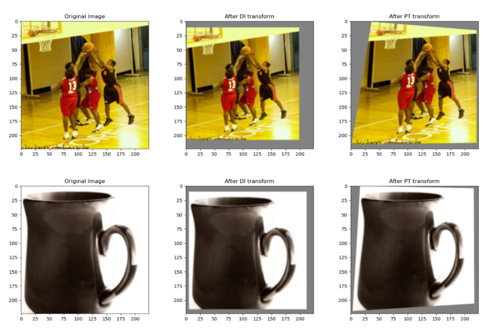

# Diversity Input Method \[Kor\]

**[English version](cvpr-2019-inputdiversity-eng.md)** of this article is available.


## 1. Introduction

### ✔적대적 공격(Adversarial Attack)

​	**적대적 공격**이란, 그림과 같이 이미지에 미세한 _잡음 (noise)_을 의도적으로 추가하여 모델의 **잘못된 예측**을 유도하는 기법입니다. 적대적 공격은 공격자가 타겟 모델의 예측을 특정한 클래스로 유도하는 공격인 표적 공격 (targeted attack)과, 유도하지 않고 단순히 예측을 틀리게 하는 무표적 공격 (non-targeted attack)으로 분류됩니다.


​	공격하고자 하는 모델에 접근이 가능한 _화이트 박스 (white box)_ 공격은 모델의 가중치(weight)에 접근할 수 있으므로, 입력 이미지에 대한 손실 함수 (loss function)의 **경사도(gradient)**를 구할 수 있습니다. 이렇게 구한 경사도는 적대적 이미지를 생성할 때 이용됩니다. 


### ✔전이 기반 적대적 공격(Transfer-Based Adversarial-Attack)

​	공격하고자 하는 모델에 **_접근이 불가능한 경우_**라면, 적대적 이미지의 **전이성**을 이용하여 **전이 기반 적대적 공격**을 시도해야 합니다. 이는 소스 모델에 화이트 박스 공격을 가해 생성한 적대적 이미지를 통해 타겟 모델도 공격하는 것입니다. 따라서 전이 기반 적대적 공격 성공률을 향상시키기 위해서는 적대적 이미지 형성 시, 적대적인 이미지가 소스 모델에 의존하여 소스 모델에서만 높은 성능을 보이게 되는 _**과적합(overfitting)**_ 현상을 방지하는 것이 매우 중요합니다.

​	**Diversity Input Method (DI 기법)** 은 **랜덤 크키 변환**과 **랜덤 패딩**을 거친 이미지를 모델의 입력으로 사용하여 적대적 이미지를 생성합니다. 이는 적대적인 이미지는 크키와 위치가 변화하더라도 적대적으로 작용해야 한다는 가정에서 착안합니다. 이를 통해 적대적 이미지가 소스 모델에 _과적합_ 되는 현상을 방지하여, 여러 모델에서 적대성을 유지합니다. 


## 2. Method

### Diversity Input Method✨

​	DI 기법의 핵심 아이디어는 **랜덤 크키 변환(randomly resizing)**과 **랜덤 패딩(random padding)** 된 이미지의 경사도를 사용함으로써 적대적 이미지가 소스 모델에 의존하는 현상을 방지한 것입니다. 이 변환 과정을 DI 변환 (DI transform) 이라고 하겠습니다. 아래 이미지는 원본 이미지와 DI 변환 후의 이미지를 비교한 것 입니다.

<p align="center"> 	 </p>

본 논문에서 DI 변환을 구현한 방법은 다음과 같습니다 :

* **랜덤 크키 변환** : 이미지를 rnd × rnd × 3 로 크기 변환 (rnd ∈ [299, 330))

* **랜덤 패딩** : 이미지를 330 × 330 × 3 이 되도록 상하좌우에 랜덤하게 패딩


​	본 논문에서는 TensorFlow를 사용하였으며, DI 변환 이후 이미지 사이즈를 330 × 330 × 3으로 고정시켜 구현했습니다. (이후, 모델 입력 사이즈에 맞춰 다시 이미지 크기변환을 진행합니다.) 저는 **PyTorch**를 이용해 논문의 _랜덤 크키 변환_과 _랜덤 패딩_의 과정을 유지하되, DI 변환 이후의 이미지 사이즈를 원본 이미지 사이즈와 동일하도록 코드를 구현하여 후처리 과정을 거치지 않아도 되도록 구현했습니다.

​	DI 변환은 이미 알려진 전이 기반 적대적 공격(I-FGSM, MI-FGSM) 과 함께 이용할 수 있다는 장점이 있습니다. DI 변환에 I-FGSM 공격 기법을 이용하여 공격하는 경우, **DI-FGSM** 이라고 칭하겠습니다. 아래의 Related work 에서 각각의 공격 방법에 대해서도 소개하겠습니다.


### Related work✨

#### 1) Iterative Fast Gradient Sign Method (I-FGSM)

​	Fast gradient sign method(FGSM)은 입력 이미지 X와 실제 클래스 y(true) 에 대해 손실 함수 L(X,y(true))가 증가하는 방향으로 X 의 각 픽셀을 ε만큼 변화시켜 적대적인 이미지 X^{adv}를 생성합니다.
$$
X^{adv}=X+ε·sign(∇_X L(X,y^{true})).
$$
​	각 픽셀을  α 만큼 변화시키는 FGSM 공격을 반복적으로 시행한 것이 Iterative Fast Gradient Sign Method (I-FGSM)입니다. 
$$
X_0^{adv}=X,
$$

$$
X_{n+1}^{adv}=Clip_X^ε(X_n^{adv}+α·sign(∇_X L(X_n^{adv},y^{true})).
$$


#### 2) 모멘텀 이용 기법 (MI-FGSM)

​	소스 모델에 대한 과적합을 방지하는 방법으로 모멘텀(momentum)을 이용하는 방법인 모멘텀 이용 기법 (MI-FGSM)이 있습니다. MI-FGSM은 I-FGSM과 같이 반복적으로 수행되며, 처음부터 현재까지의 경사도(gt) 정보를 축적하여 적대적 이미지 갱신에 사용합니다. 갱신에 손실함수의 부호가 아닌, gt의 부호를 이용한다는 점에서 차이가 있습니다.
$$
g_{n+1}= μg_n + {∇_X L(X_n^{adv},y^{true} )\over ||∇_X L(X_n^{adv},y^{true})||_1 },
$$

$$
X_{n+1}^{adv}=X_{n}^{adv} +α·sign(g_{t+1}).
$$

​	경사도를 축적하여 사용하는 것은 좋지 않은 지역적 최소점(poor local maxima)에 빠지지 않게 도와주며, I-FGSM에 비해 반복적으로 갱신되는 적대적인 변화의 방향이 비슷하여 안정적입니다. 따라서 MI-FGSM은 I-FGSM보다 좋은 전이성을 보입니다.


## 3. Implementation

* Use **Python** language, version >= 3.6 : 3.6 이상 버전의 파이썬 요구

* Use **PyTorch** : 코드 구현과정에 PyTorch 사용

* Use _manual seed_ : 랜덤성을 고정하기 위해 사용 (아래 example code에 포함되어 있습니다.)

  

### 🔨 Environment

​	DI 기법 구현과정에서 필요한 환경 **(env_di-fgsm.yml)**을 yml 파일로 만들었습니다. 아나콘다 가상환경을 이용하며, 아래의 명령어를 입력해 환경설정을 할 수 있습니다.

```bash
# Environment setup using conda
conda env create -f env_di-fgsm.yml
```


### 📋DI-FGSM

​	이 파일에는, DI-FGSM이 구현되어 있습니다.   _**주석**_을 이용해 전반적인 코드 설명을 했습니다. 아래에서 소개될 예시 파일 Transfer Attack.py 에서 이용한 CIFAR-10 이미지 (size : 32, 32) 기준으로 예시를 들어 tensors 의 크기를 나타냈습니다.

​	class DIFGSM 내에 있는 **_diverse_input_** 함수 부분이 DI-FGSM의 핵심 부분인 DI transform 이 일어나는 부분입니다. **랜덤 크키 변환** 과 **랜덤 패딩** 부분이 구현되어 있습니다. _forward_ 함수에서 _diverse_input_ 함수 호출 이후, 역전파(backpropagation) 이 일어납니다.

```python
## DI-FGSM : DIFGSM.py

import torch
import torch.nn as nn
import torchvision.transforms as transforms
from torchvision.transforms import InterpolationMode
import torchgeometry as tgm
from attack import Attack


class DIFGSM(Attack):

    def __init__(self, model, eps=8/255, alpha=2/255, steps=20, di_pad_amount=31, di_prob=0.5):
        super().__init__("DIFGSM", model)
        self.eps = eps # Maximum change in one pixel for total step (range 0-255)
        self.steps = steps # number of di-fgsm steps
        self.alpha = alpha # Maximum change in one pixel for one step (range 0-255)
        self.di_pad_amount = di_pad_amount # Maximum value that can be padded
        self.di_prob = di_prob # Probability of deciding whether to apply DI transform or not
        self._supported_mode = ['default', 'targeted'] # deciding targeted attack or not

    def diverse_input(self, x_adv):
        x_di = x_adv # size : [24,3,32,32]
        h, w = x_di.shape[2], x_di.shape[3] # original image size, h: 32, w: 32
        # random value that be padded
        pad_max = self.di_pad_amount - int(torch.rand(1) * self.di_pad_amount) # pad_max : 2
        # random value that be padded left
        pad_left = int(torch.rand(1) * pad_max) # pad_left : 1
        # random value that be padded right
        pad_right = pad_max - pad_left # pad_right : 1
        # random value that be padded top
        pad_top = int(torch.rand(1) * pad_max) # pad_top : 1
        # random value that be padded bottom
        pad_bottom = pad_max - pad_top  # pad_bottom : 1

        # four vertices of the original image
        # tensor([[[ 0.,  0.], [31.,  0.], [31., 31.], [ 0., 31.]]])
        points_src = torch.FloatTensor([[
            [0, 0], [w - 1, 0], [w - 1 + 0, h - 1 + 0], [0, h - 1 + 0],
        ]]) 

        # four vertices of the image after DI transform
        # tensor([[[ 1.,  1.], [30.,  1.], [30., 30.], [ 1., 30.]]])
        points_dst = torch.FloatTensor([[
            [pad_left, pad_top], [w - pad_right - 1, pad_top],
            [w - pad_right - 1, h - pad_bottom - 1], [pad_left, h - pad_bottom - 1],
        ]]) 

        # Matrix used in the transformation process
        # tensor([[[0.9355, 0.0000, 1.0000], [0.0000, 0.9355, 1.0000], [0.0000, 0.0000, 1.0000]]])
        M = tgm.get_perspective_transform(points_src, points_dst) 
        
        # The image is resized and padded so that the vertices of the original image go to the new vertices.
        x_di = tgm.warp_perspective(x_di, torch.cat(x_di.shape[0] * [M]).cuda(), dsize=(w, h)).cuda()
        x_di = transforms.Resize((w, h), interpolation=InterpolationMode.NEAREST)(x_di)
        
        # If the random value is less than or equal to di_prob, di conversion does not occur.
        cond = torch.rand(x_adv.shape[0]) < self.di_prob
        
        cond = cond.unsqueeze(-1).unsqueeze(-1).unsqueeze(-1)
        x_di = torch.where(cond.cuda(), x_di, x_adv)
        return x_di

    def forward(self, images, labels):
        """
        Overridden.
        """
        images = images.clone().detach().to(self.device)
        labels = labels.clone().detach().to(self.device)

        if self._targeted: # targeted attack case, get target label
            target_labels = self._get_target_label(images, labels)

        loss = nn.CrossEntropyLoss() # use Cross-Entropy loss for classification
        adv_images = images.clone().detach()


        for _ in range(self.steps):
            adv_images.requires_grad = True
            outputs = self.model(self.diverse_input(adv_images)) # after DI transform image

            # Calculate loss
            if self._targeted:
                cost = -loss(outputs, target_labels) # targeted attack case, use -loss function
            else:
                cost = loss(outputs, labels) # else, (untargeted attack case), use +loss function

            # Update adversarial images
            grad = torch.autograd.grad(cost, adv_images,
                                       retain_graph=False, create_graph=False)[0]

            grad = grad / torch.mean(torch.abs(grad), dim=(1,2,3), keepdim=True)

            adv_images = adv_images.detach() + self.alpha*grad.sign() # I-fgsm step
            delta = torch.clamp(adv_images - images, min=-self.eps, max=self.eps) # limiting changes beyond epsilon
            adv_images = torch.clamp(images + delta, min=0, max=1).detach()

        return adv_images
```


### 📋Example code

_**Transfer Attack.py**_ 코드에서, DI-FGSM을 이용한 Transfer Attack의 성능을 실험해보았습니다. 

##3 : Source 모델의 공격 과정 및 결과를 나타냅니다. _atk = DIFGSM(model, eps=16 / 255, alpha=2 / 255, steps=10, di_pad_amount=5)_와 같이 공격을 지정할 수 있습니다.

##5, ##6 : Target 모델에 validation set으로 성능을 시험한 **clean accuracy**와, ##3에서 만들어진 적대적인 이미지로 성능을 시험한 **robust accuracy**를 나타냅니다.

#### example🚀 

```python
##0 Example - Transfer Attack.py

from torch.utils.data import DataLoader, TensorDataset
import torchvision.utils
import torchvision.datasets as dsets
import random
import warnings
warnings.filterwarnings('ignore')
from models import Source, Target
from DIFGSM import *


##1 check version
print("PyTorch", torch.__version__)
print("Torchvision", torchvision.__version__)

my_seed = 7777
random.seed(my_seed)
torch.manual_seed(my_seed)
torch.cuda.manual_seed(my_seed)
torch.cuda.manual_seed_all(my_seed)
torch.backends.cudnn.deterministic = True
torch.backends.cudnn.benchmark = False

##2 Load Data
batch_size = 24

cifar10_train = dsets.CIFAR10(root='./data', train=True,
                              download=True, transform=transforms.ToTensor())
cifar10_test  = dsets.CIFAR10(root='./data', train=False,
                              download=True, transform=transforms.ToTensor())

train_loader = torch.utils.data.DataLoader(cifar10_train,
                                           batch_size=batch_size,
                                           shuffle=True)
test_loader = torch.utils.data.DataLoader(cifar10_test,
                                          batch_size=batch_size,
                                          shuffle=False)


##3 Attack Source Model & Save Adversarial Images
model = Source()
model.load_state_dict(torch.load("./data/source.pth"))
model = model.eval().cuda()

atk = DIFGSM(model, eps=16 / 255, alpha=2 / 255, steps=10, di_pad_amount=5)
atk.set_return_type('int') # Save as integer.
print('\n#################Source Model#################')
atk.save(data_loader=test_loader, save_path="./data/cifar10_DIFGSM.pt", verbose=True)


##4 Load Adversarial Images & Attack Target Model
adv_images, adv_labels = torch.load("./data/cifar10_DIFGSM.pt")
adv_data = TensorDataset(adv_images.float()/255, adv_labels)
adv_loader = DataLoader(adv_data, batch_size=128, shuffle=False)

model = Target().cuda()
model.load_state_dict(torch.load("./data/target.pth"))


##5 Target Model : Clean Accuracy
print('#################Target Model#################')
model.eval()
correct = 0
total = 0

for images, labels in test_loader:
    images = images.cuda()
    outputs = model(images)
    _, predicted = torch.max(outputs.data, 1)
    total += labels.size(0)
    correct += (predicted == labels.cuda()).sum()

print('Standard accuracy: %.2f %%' % (100 * float(correct) / total))


##6 Target Model : Robust Accuracy
model.eval()
correct = 0
total = 0

for images, labels in adv_loader:
    images = images.cuda()
    outputs = model(images)
    _, predicted = torch.max(outputs.data, 1)
    total += labels.size(0)
    correct += (predicted == labels.cuda()).sum()

print('Robust accuracy: %.2f %%' % (100 * float(correct) / total))

```

#### results🚀 

​	Target 모델에 _validation set_으로 성능을 시험한 **clean accuracy**의 성능은 87.26 %  로 비교적 높은 비교 성능을 보입니다. 

​	반면 Source 모델을 통해 DI-FGSM으로 만들어진 적대적인 이미지로 Target 모델 성능을 시험한 robust accuracy는 38.87 %로 낮은 성능을 보이며, 성공적인 전이 기반 적대적 공격임을 알 수 있습니다.

```bash
System :  3.6.13 |Anaconda, Inc.| (default, Mar 16 2021, 11:37:27) [MSC v.1916 64 bit (AMD64)]
Nunpy :  1.19.2
PyTorch :  1.9.0
Files already downloaded and verified
Files already downloaded and verified

#################Source Model#################
- Save progress: 100.00 % / Accuracy: 0.03 % / L2: 2.26292 (0.047 it/s) 	
- Save complete! 

#################Target Model#################
Standard accuracy: 87.26 %
Robust accuracy: 38.87 %

Process finished with exit code 0

```


## Author / Reviewer information

### Author😍

**김희선 \(Hee-Seon Kim\)**

* KAIST EE 
* https://github.com/khslily98
* hskim98@kaist.ac.kr


### Reviewer😍

1. Korean name \(English name\): Affiliation / Contact information
2. Korean name \(English name\): Affiliation / Contact information
3. ...

## Reference & Additional materials

1. Citation of this paper
2. Official \(unofficial\) GitHub repository
3. Citation of related work
4. Other useful materials
5. ...
