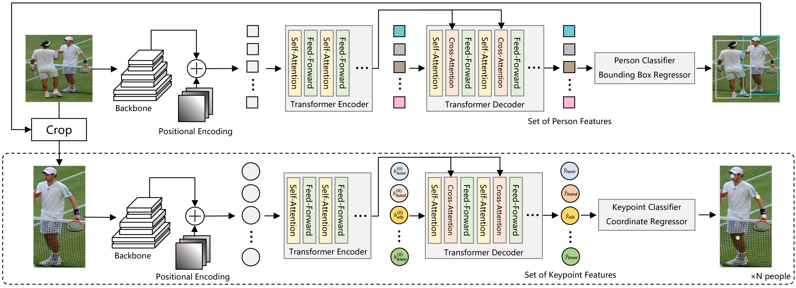
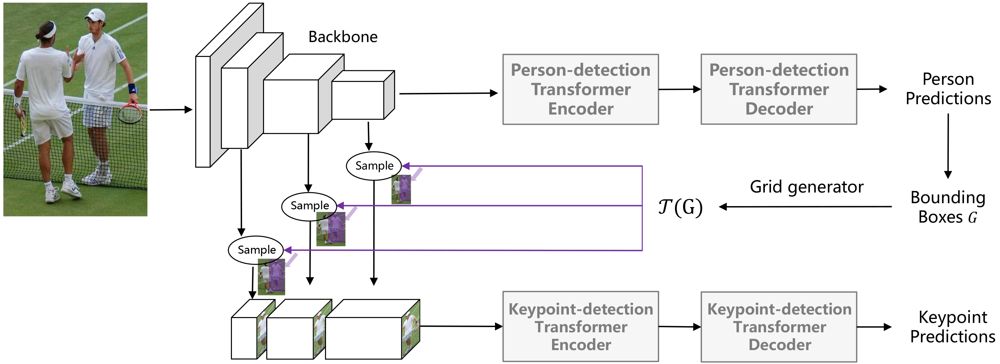

# Pose Recognition with Cascade Transformers \[Eng\]

## 1. Introduction

Contemporary Human Pose Recognition techniques are generally represented by two main approaches:
<ol>
<li>Heatmap-based</li>
<li>Regression-based</li>
</ol>

While the former ones perform better for specific tasks, they utilize heuristic designs and non-differentiable steps.
The aim of this paper is to present **regression-based** architecture, capable of producing competitive results in pose
recognition.
For this, **Encoder-Decoder Transformer** architecture is utilized for both person and key-point detection.

Pose recognition task is composed of two fundamental problems, namely person detection and key-point detection.
The paper proposes two **top-down** alternative approaches: **two-stage** and **end-to-end** ones.
Both methods use Transformers for producing predictions.

The first one uses general-purpose DEtection TRansformer (DETR) to detect people in a scene. A bounding box of detected
person is then cropped and passed to a key-point extractor.

Meanwhile, the second one is utilizes notion of Spatial Transformer Network (STN) to generate a grid and pass sampled
image to output joints' coordinates.
The detailed overview of these alternatives is to be presented below.

Lastly, authors developed a visualization method to represent internal structure of Transformers.

## 2. Method

Although aforementioned approaches may seem completely different, the overall architecture is shared.
Initially, input image is passed to the Backbone model for feature extraction. This model is usually represented with
CNN architecture, which fits the required parameters most. Having extracted image features, they are passed to the
first-stage Transformer person detector. Image patches with identified people in them are passed to the second
Transformer, responsible for key-point identification.

The main difference between alternatives is in the method of extracting and passing image patches between two
Transformer models.

### 2.1. Two-Stage Architecture

<figure id="fig-two-stage-arc">

<figcaption><b>[Figure: 1] Two-stage Architecture</b></figcaption>
</figure>

#### 2.1.1. Person Detector

In this architecture, input image is firstly fed to the backbone model, where with the help of **absolute positional
encoding** produced flattened feature are passed to the object detector. It is important to mention that produced
features are not recurrent, which is why positional encoder is used to prepare them to be fed into Transformer model.
As an object detector **DETR** model was chosen for its performance in general-purpose tasks.

Having obtained contextualized set of person features, they are given to a classificator, which identifies, whether an
object is a person or a background ($$\emptyset$$). Lastly, 4-channel regression model produces a vector with bounding
boxes' coordinates.

#### 2.1.2. Keypoint Detector

With bounding boxes from the first Transformer model, images are cropped and passed to the second block. Another
backbone model takes patches as an input. By combining image features with the **relative positional encoding**, outputs
are fed into Keypoint-detection Transformer.

Having produced larger number of features in comparison with the number of joints, they are mapped with Hungarian
Algorithm. This algorithm aims to find optimal function **optimal bipartite matching** to match inputs with joints
$$\sigma \epsilon = [J] \rightarrow [Q] $$. Therefore, the **matching cost** is
$$C_i = -\hat{p}_{\sigma(i)}(c_i) + ||b_i - \hat{b}_{\sigma(i)}||$$, where $$\hat{p}_{\sigma(i)}(c_i)$$ is the class
probability of the query and $$b_i$$ corresponds to the bounding box coordinates. Since ground-truth values are not
available during inference, the cost gets compressed to $$C_i = -\hat{p}_{\sigma(i)}(c_i)$$. Finally, the loss function
is just a negative log-likelihood of the matching cost.

The algorithm operates as dimensionality reduction algorithm to produce $$J$$ joint inputs to Keypoint Classifier.
This model identifies, whether chosen feature is a background and if it is not, it gets passed to Coordinate Regressor,
which produces final coordinates.

### 2.2. Sequential Architecture

<figure id="fig-two-stage-arc">

<figcaption><b>[Figure: 1] Sequential Architecture</b></figcaption>
</figure>

Similarly to the [Two-Stage Architecture](#21-two-stage-architecture), input image is processed to output image
features. Spatial Transformer Network is used to crop images without losing the end-to-end nature. To generate the
$$ W \times H $$ grid, which will filter out an image, its relative start needs to be found. To find the center,
coordinates of bounding box are used, resulting in:

$$x_i = \frac{w - i}{w} x_{left} + \frac{i}{w} x_{right}$$

$$y_j = \frac{h-j}{h}y_{top} + \frac{j}{h} y_{down}$$

With this data, it is possible to calculate sampled feature map:
$$V_{ij} =\sum_{n,m}U_{nm}max(0,1-|x_i|-m|)max(0,1-|y_j -n|)$$, where $$V_{ij}$$ is the output map and $$U_{ij}$$ is the
source kernel map. This process is put after the end of each stage of the backbone.

As soon as cropped kernel maps are obtained, the data is passed to the second Transformer and the process is identical
to the one mentioned before.

## 3. Implementation

The implementation of Sequential Model can be found below:

The most essential imports are given below:



```python
import torch
import torch.nn as nn
import torch.nn.functional as F
import math, random
from scipy.optimize import linear_sum_assignment
from utils import NestedTensor, nested_tensor_from_tensor_list, MLP
```



The framework used for this work is _PyTorch_.

The main class representing the model is _PrtrSequential_. It provides insights in the way model operates. It takes the
following parameters as inputs:

* backbone - CNN backbone model, which returns a set of feature maps, which are then used in sampling process
* transformer - Object detection transformer model for producing bounding boxes' features
* transformer_kpt - Keypoint detection transformer for outputting the coordinates of the joints
* level - set of layers, which will be used for sampling process
* x_res, y_res - width and height of produced feature maps, fed into the keypoint transformer

_class_embed_ - linear classifier, predicting, whether input object is a person.

_bbox_embed_ - bounding box embedding layer, presented by specified multi-layer perceptron.

_MLP_ layer - feed-forward neural network composed of 3 (the last argument) Linear layers followed by ReLU
activation function.

_query_embed_ - Embedding layer, modifying an input to be fed into the Transformer model

_input_proj_ - input projection layer

_x_interpolate_, _y_interpolate_ - bounding box editing layers. These are used to enlarge bounding box dimensions by 25%

_mask_ - the filter grid, necessary to extract an image patch



```python
class PrtrSequential(nn.Module):
    def __init__(self, backbone, transformer, transformer_kpt, level, x_res=10, y_res=10):
        super().__init__()
        self.backbone = backbone
        self.transformer = transformer
        hidden_dim = transformer.d_model
        self.class_embed = nn.Linear(hidden_dim, 2)
        # MLP(input_dim, hidden_dim, output_dim, num_layers)
        self.bbox_embed = MLP(hidden_dim, hidden_dim, 4, 3)
        self.query_embed = nn.Embedding(100, hidden_dim)
        self.input_proj = nn.Conv2d(backbone.num_channels, hidden_dim, kernel_size=1)
        self.transformer_kpt = transformer_kpt
        # x_interpolate.shape => [1, x_res]
        x_interpolate = torch.linspace(-1.25, 1.25, x_res, requires_grad=False).unsqueeze(0)
        # y_interpolate.shape => [1, y_res]
        y_interpolate = torch.linspace(-1.25, 1.25, y_res, requires_grad=False).unsqueeze(0)
        self.register_buffer("x_interpolate", x_interpolate)
        self.register_buffer("y_interpolate", y_interpolate)
        self.x_res = x_res
        self.y_res = y_res
        self.level = level
        # mask.shape => [1, y_res, x_res]
        mask = torch.zeros(1, y_res, x_res, requires_grad=False)
        self.register_buffer("mask", mask)
        self.build_positional_embedding()
```



In this code, positional embeddings of the kernel maps are learnt. To build this embedding for the keypoint Transformer,
sinusoidal embedding is used. Having them built, it is possible to use both built and learnt embeddings together. The
same positional embedding is used for every bounding box with a person.

Initially, the mask, set in the model is negated. Afterwards, both _x_ and _y_ axis embeddings are produced by applying
cumulative sum over the 1 and the 2 axis. Having them extracted, embeddings get normalized. The dimension temperature is
specified linearly according to number of positional features. Afterwards, embeddings' positions get calculated with
sine function and concatenated to be saved in the buffer. Finally, row and column embeddings uniformly initialized.



```python

def build_positional_embedding(self):
    # fixed sine pe
    not_mask = 1 - self.mask
    y_embed = not_mask.cumsum(1, dtype=torch.float32)
    x_embed = not_mask.cumsum(2, dtype=torch.float32)

    eps = 1e-6
    scale = 2 * math.pi
    y_embed = y_embed / (y_embed[:, -1:, :] + eps) * scale
    x_embed = x_embed / (x_embed[:, :, -1:] + eps) * scale

    num_pos_feats = 128;
    temperature = 10000
    dim_t = torch.arange(num_pos_feats, dtype=torch.float32, device=self.mask.device)
    dim_t = temperature ** (2 * (dim_t // 2) / num_pos_feats)

    pos_x = x_embed[:, :, :, None] / dim_t
    pos_y = y_embed[:, :, :, None] / dim_t
    pos_x = torch.stack((pos_x[:, :, :, 0::2].sin(), pos_x[:, :, :, 1::2].cos()), dim=4).flatten(3)
    pos_y = torch.stack((pos_y[:, :, :, 0::2].sin(), pos_y[:, :, :, 1::2].cos()), dim=4).flatten(3)
    pos = torch.cat((pos_y, pos_x), dim=3).permute(0, 3, 1, 2)
    self.register_buffer("pe", pos)

    self.row_embed = nn.Embedding(num_pos_feats, self.x_res)
    self.col_embed = nn.Embedding(num_pos_feats, self.y_res)
    nn.init.uniform_(self.row_embed.weight)
    nn.init.uniform_(self.col_embed.weight)


PRTR_sequential.build_positional_embedding = build_positional_embedding

```



Learnt positional embeddings are simply reformatted to fit the _x_res_ and _y_res_ values, set initially.



```python
def get_learnt_positional_embedding(self):
    y_embed = self.col_embed.weight.unsqueeze(-1).expand(-1, -1, self.x_res)
    x_embed = self.row_embed.weight.unsqueeze(1).expand(-1, self.y_res, -1)
    embed = torch.cat([y_embed, x_embed], dim=0).unsqueeze(0)
    return embed


PRTR_sequential.get_learnt_positional_embedding = get_learnt_positional_embedding
```



Having all necessary structural components initialized, it is now possible to proceed to the training process.

Initially, the person gets identified. Backbone model outputs image features and the absolute positions. These outputs
get transferred to the first transformer model. The transformer produces person predictions, stored in _hs_. Afterwards,
they are sent to the class embedding layer, which identifies, whether it is a person or a noobject. Simultaneously, _hs_
is passed to the bounding box embedding layer, which produces a bounding box for an object. Lastly, outputs are stored
in a dictionary.

To prepare for STN, number of people per bounding box is identified. Heights, widths are repeated accordingly. Having
prepared feature space, features get extracted from the backbone features on specified layers. Finally, coordinates
corresponding bounding boxes are identified and duplicated for multi-person per box scenes.

STN cropping is produced by matrix multiplication bounding box editing layers and related coordinates. This is made
without masks applied, since all inputs are of the same size. As grids are known, they can be applied for every level as
well as mask, specified in the initialization phase. Finally, keypoint transformer produces coordinates and logits.



```python
def forward(self, samples):
    # The 1st Transformer
    features, pos = self.backbone(samples)
    # hs.shape => [B, person per image, f]
    hs = self.transformer(
        self.input_proj(features[-1].tensors), features[-1].mask, self.query_embed.weight, pos[-1]
    )[0][-1]
    # logits.shape => [B, person per image, 2]
    logits = self.class_embed(hs)
    # bboxes.shape => [B, person per image, 4]
    bboxes = self.bbox_embed(hs).sigmoid()
    outputs = {'pred_logits': logits, 'pred_boxes': bboxes}

    # Preparation for STN feature cropping
    person_per_image = hs.size(1)
    num_person = person_per_image * hs.size(0)
    # heights.shape, width.shape => [B], [B]
    heights, widths = samples.get_shape().unbind(-1)
    # rh.shape => [person per image * B]
    rh = heights.repeat_interleave(person_per_image)
    # rw.shape => [person per image * B]
    rw = widths.repeat_interleave(person_per_image)
    srcs = [features[level].decompose()[0] for level in self.level]
    # cx.shape, cy.shape, w.shape, h.shape = [person per image * B] * 4
    cx, cy, w, h = bboxes.flatten(end_dim=1).unbind(-1)
    cx, cy, w, h = cx * rw, cy * rh, w * rw, h * rh

    # STN cropping
    # y_grid.shape = [person per image * B, y_res, 1, 1] 
    y_grid = (h.unsqueeze(-1) @ self.y_interpolate + cy.unsqueeze(-1) * 2 - 1).unsqueeze(-1).unsqueeze(
        -1)
    # x_grid.shape = [person per image * B, x_res, 1, 1]
    x_grid = (w.unsqueeze(-1) @ self.x_interpolate + cx.unsqueeze(-1) * 2 - 1).unsqueeze(-1).unsqueeze(
        1)
    grid = torch.cat([x_grid.expand(-1, self.y_res, -1, -1), y_grid.expand(-1, -1, self.x_res, -1)], dim=-1)
    cropped_feature = []
    cropped_pos = []
    for j, l in enumerate(self.level):
        # [person per image * B, C, y_res, x_res]
        cropped_feature.append(F.grid_sample(srcs[j].expand(num_person, -1, -1, -1), grid,
                                             padding_mode="border"))
    cropped_feature = torch.cat(cropped_feature, dim=1)
    cropped_pos.append(self.pe.expand(num_person, -1, -1, -1))
    cropped_pos.append(self.get_learnt_positional_embedding().expand(num_person, -1, -1, -1))
    cropped_pos = torch.cat(cropped_pos, dim=1)
    mask = self.mask.bool().expand(num_person, -1, -1)

    # 2nd Transformer
    # coord.shape, logits.shape = [person per image * B, 17] * 2
    coord, logtis = self.transformer_kpt(bboxes, cropped_feature, cropped_pos, mask)

    outputs["pred_kpt_coord"] = coord.reshape(hs.size(0), -1, self.transformer_kpt.num_queries, 2)
    outputs["pred_kpt_logits"] = logtis.reshape(hs.size(0), -1, self.transformer_kpt.num_queries,
                                                self.transformer_kpt.num_kpts + 1)
    return outputs


PRTR_sequential.forward = forward
```



To infer coordinates, output keypoint coordinates are used. Like `forward`, `infer` takes images as input, although it
only selects the 17 keypoints as prediction. To select necessary keypoints, the second Transofrmer creates a node for
each query. Sets of nodes are grouped by keypoint type. Type and node sets are connected with the help of logits.
Connections with the highest logit value are chosen as predictions.



```python
def infer(self, samples):
    self.eval()
    outputs = self(samples)
    out_logits, out_coord = outputs['pred_kpt_logits'], outputs['pred_kpt_coord']

    # C_stacked.shape => [person per image * B, 17, num queries (for keypoint)]
    C_stacked = out_logits[..., 1:].transpose(2, 3).flatten(0, 1).detach().cpu().numpy()
    out_coord = out_coord.flatten(0, 1)
    coord_holder = []
    for b, C in enumerate(C_stacked):
        _, query_ind = linear_sum_assignment(-C)
        coord_holder.append(out_coord[b, query_ind.tolist()])
    matched_coord = torch.stack(coord_holder, dim=0).reshape(out_logits.size(0), out_logits.size(1), 17, -1)
    return matched_coord  # [B, num queries, num kpts, 2]


PRTR_sequential.infer = infer
```



Transformer producing keypoints is defined below. It takes the following parameters as inputs:

* transformer - Transformer model for keypoint detection
* num_kpts - number of keypoints per person (17)
* num_queries - number of queries
* input_dim - the shape of image feature dimension from the first Transformer

It is important to note that all bounding boxes are upscaled by 25% and the coordinates are relative to the whole image. 



```python
class DetrKpts(nn.Module):
    def __init__(self, transformer, num_kpts, num_queries, input_dim):
        super().__init__()
        self.num_kpts = num_kpts
        self.num_queries = num_queries
        hidden_dim = transformer.d_model
        self.query_embed = nn.Embedding(num_queries, hidden_dim)
        self.input_proj = nn.Conv2d(input_dim, hidden_dim, kernel_size=1)
        self.transformer = transformer
        self.coord_predictor = MLP(hidden_dim, hidden_dim, 2, num_layers=3)
        self.class_predictor = nn.Linear(hidden_dim, num_kpts + 1)

    def forward(self, bboxes, features, pos, mask):
        src_proj = self.input_proj(features)
        # j_embed.shape => [B, num queries, hidden dim]
        j_embed = self.transformer(src_proj, mask, self.query_embed.weight, pos)[0][-1]
        j_coord_ = self.coord_predictor(j_embed).sigmoid()
        # x.shape, y.shape => [B, Q] * 2
        x, y = j_coord_.unbind(-1)
        x = (x * 1.25 - 0.625) * bboxes[:, 2].unsqueeze(-1) + bboxes[:, 0].unsqueeze(-1)
        y = (y * 1.25 - 0.625) * bboxes[:, 3].unsqueeze(-1) + bboxes[:, 1].unsqueeze(-1)
        x = x.clamp(0, 1)
        y = y.clamp(0, 1)
        j_coord = torch.stack([x, y], dim=-1)
        # j_class.shape => [B, J, c+1], logits
        j_class = self.class_predictor(j_embed[-1])
        return j_coord, j_class
```



## Author / Reviewer information

### Author

**Enver Menadjiev**

* KAIST AI
* First-year Graduate Student at KAIST University
* B.Sc. in Information and Communication Engineering at Inha University in Tashkent
* enver@kaist.ac.kr
* [LinkedIn](https://www.linkedin.com/in/enver-menadjiev)
* [Github](https://github.com/enver1323)

## Reference & Additional materials

1. Citation of this paper
2. [Official GitHub repository](https://github.com/mlpc-ucsd/PRTR)
