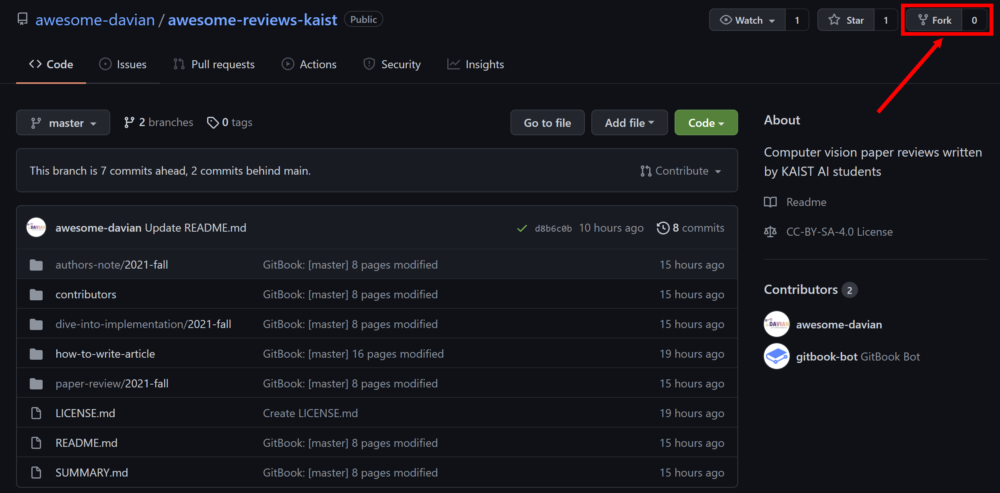
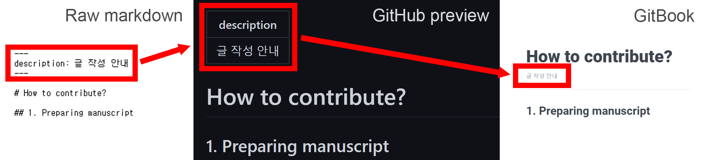
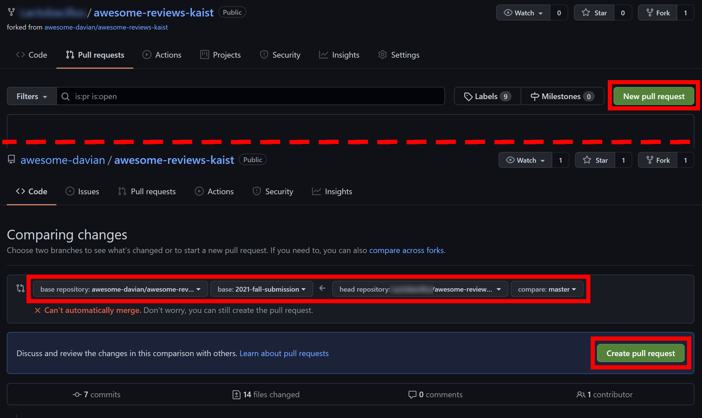
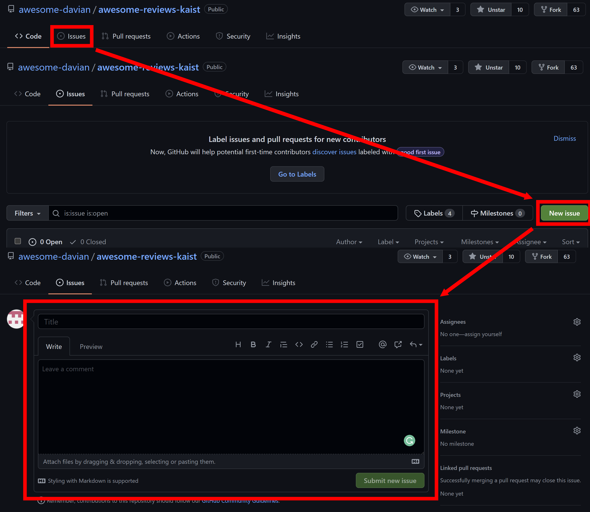

# How to contribute?

## 1. Preparing manuscript

이 장에서는 리뷰를 준비하는 과정을 다룹니다.

This section covers how to prepare your manuscript.

### Fork repository

먼저, [이 프로젝트 GitHub repository](https://github.com/awesome-davian/awesome-reviews-kaist) 를 본인의 계정으로 fork 해야 합니다.  
아래 Figure 1 을 참고해 fork 하세요.

First of all, you should fork [this GitHub repository](https://github.com/awesome-davian/awesome-reviews-kaist) to your account.  
See Figure 1, and fork the repository.



### Write manuscript file

Fork 이후에는 자신의 계정으로 복사된 repository 의 **_master_** 브랜치 \(**_main_** 브랜치가 아닙니다\) 에서 초안을 자유롭게 작성하시면 됩니다.

After you fork the repository to your account, you can freely write and edit your manuscript.  
Here, you should use _master_ branch \(not _main_ branch\).

자세한 작성 방법은 준비된 템플릿 파일을 참고해주세요.

Please refer to the template files for detailed guidance.

* [Paper review / Author's note](paper-review/template-paper-review.md)
* [Dive into implementation](dive-into-implementation/template-implementation.md)

#### Markdown & Typora

여러분의 초안은 _markdown_ 형식 \(\*.md\) 으로 작성되어야 합니다.  
Markdown 을 처음 사용하시는 분은 [링크](https://www.markdowntutorial.com/kr/)에서 사용법을 배워보세요.

Your manuscript should be written in _markdown_ \(\*.md\) format.  
If you are not familiar with markdown, see this [tutorial](https://www.markdowntutorial.com/).

추가로 [Typora](https://typora.io/) 라는 markdown 용 WYSIWYG 편집기를 사용하시면, 편하게 초안을 작성할 수 있습니다.

You can use [Typora](https://typora.io/), which is a WYSIWYG markdown editor for your convenience.

#### File name

작성한 리뷰 파일의 이름은 아래의 규칙을 따라야 합니다.

File name of your manuscript should follow the rules below:

* The file name should be a combination of the venue and the title of the paper.
* 파일의 이름은 논문 출판 정보 \(학회, 출판연도 등\) 와 논문 이름의 조합으로 만들어야 합니다.
* The file name should consist of alphanumeric \(_0_ to _9_, _a_ to _z_, lower case only\) and _hyphen_ \(-\).
* 숫자 / 영어 소문자 / 하이픈 \(-\) 만 파일명에 사용할 수 있습니다.
* Specify the language of the article in the end of the file name.
* 리뷰 작성 언어를 파일명 뒤에 붙여주세요.
* Examples
  * _cvpr-2021-robustnet-kor.md_        \([paper](https://openaccess.thecvf.com/content/CVPR2021/html/Choi_RobustNet_Improving_Domain_Generalization_in_Urban-Scene_Segmentation_via_Instance_Selective_CVPR_2021_paper.html)\)
  * _cvpr-2021-robustnet-eng.md_        \([paper](https://openaccess.thecvf.com/content/CVPR2021/html/Choi_RobustNet_Improving_Domain_Generalization_in_Urban-Scene_Segmentation_via_Instance_Selective_CVPR_2021_paper.html)\)
  * _iccv-2021-biaswap-kor.md_        \([paper](https://openaccess.thecvf.com/content/ICCV2021/html/Kim_BiaSwap_Removing_Dataset_Bias_With_Bias-Tailored_Swapping_Augmentation_ICCV_2021_paper.html)\)
  * _iccv-2021-sml-eng.md_        \([paper](https://openaccess.thecvf.com/content/ICCV2021/html/Jung_Standardized_Max_Logits_A_Simple_yet_Effective_Approach_for_Identifying_ICCV_2021_paper.html)\)

#### Image / file upload

리뷰에 사진이나 파일을 올려야할 경우, 아래의 경로에 저장하여야 합니다.

If you want to upload images or other files, you need to save the files in the below path.

```text
/.gitbook/assets/2022spring/<article_id>/<filename>
```

#### Description

예제 파일 맨 위를 보시면, **_description:_** 으로 시작하는 부분을 보실 수 있습니다.  
Figure 2 를 보시면 이것이 어떻게 쓰이는지를 확인할 수 있습니다.

예제 파일의 description 부분을 지우지 마시고, 예시와 같이 작성해주세요.  
이때, 여기에는 콜론 기호 \(:\) 를 쓸 수 없고, 대신 하이픈 \(-\) 이나 세미콜론 \(;\) 을 사용해주세요.

When you read the top of the template files, you can find a part that starts with **_description:_**.  
See Figure 2, and check how this part works in the GitBook.

Do not remove the description part, and write the paper information as specified in the example.  
Here, you must use hyphen \(-\) or semicolon \(;\), instead of colon \(:\).

```text
---
description: Choi et al. / StarGAN - Unified generative adversarial networks for multi-domain image-to-image translation / CVPR 2018
---
```



#### Equation

수식은 **_$ 기호 두 개 \($$\)_**로 감싸 표현할 수 있습니다.

If you want to insert equations, you should enclose the equation with **_double $ \($$\)_**.

```text
---
Newton's second law is $F=ma$. // bad
Newton's second law is $$F=ma$$. // good
---
```

## 2. Submit manuscript

이 장에서는 작성한 리뷰 초안을 제출하는 방법을 설명합니다.

This section describes how to submit your prepared manuscript.

### File structure

리뷰 파일과 함께, 한 가지 파일을 더 수정해야 합니다.

Along with your manuscript file, you need to edit one more file:

```text
/SUMMARY.md
```

이 파일은 전체 페이지 구조를 담고 있으며, 여기에 작성한 리뷰 파일을 등록해주어야 합니다.  
파일에 써진 템플릿 파일 정보를 여러분이 작성한 초안 파일의 것으로 바꿔주시면 됩니다.

SUMMARY.md 파일을 수정하는 것 이외에, 다른 파일을 수정하거나 삭제하시면 안됩니다.

This file manages the whole page structure, and you need to register your manuscript in this file.  
It can be simply done by replacing information of the template file with that of your manuscript file.

Except for modifying SUMMARY.md, do not modify or remove any other files.

#### Example



```text
# Table of contents

* [Welcome](README.md)

## Paper review

* [\[2022 Spring\] Paper review](paper-review/2021-fall-paper-review/README.md)
  * [Template \(paper review\)](paper-review/2022-spring-paper-review/template-paper-review.md)

...
```



```
# Table of contents

* [Welcome](README.md)

## Paper review

* [\[2022 Spring\] Paper review](paper-review/2021-fall-paper-review/README.md)
  * [RobustNet \[Kor\]](paper-review/2022-spring-paper-review/cvpr-2021-robustnet-kor.md)
  * [RobustNet \[Eng\]](paper-review/2022-spring-paper-review/cvpr-2021-robustnet-eng.md)

...
```



### Pull request

모든 준비가 끝나면, Figure 2 와 같이 pull request 기능을 이용해 초안을 제출합니다.

When your draft is ready, submit your work by using pull request \(see Figure 2\).



Pull request 는 학기별로 정해지는 수업용 브랜치에 보내야 합니다.  
\(e.g., 2022년 봄학기: **2022-submission-submission**\)  
**이때, 절대로** _**master**_ **브랜치에 pull request 를 보내면 안됩니다!!!**

You should create pull request to the class branch \(e.g., **2022-submission-submission** for the 2022 spring semester\).  
**WARNING: Do not send pull request to the** _**master**_ **branch!!!**

## 3. Peer review

정확한 정보를 전달하기 위해, 모든 리뷰는 서로간의 동료 평가를 거칠 예정입니다.  
우리는 **_GitHub issues_** 기능을 활용하여 동료 평가를 진행할 겁니다.

In order to deliver accurate information, all articles will be peer-reviewed by each other.  
Basically, we will use **_GitHub issues_** for peer-review

### Creating GitHub issues

Figure 4 를 보고, 자신이 작성한 초안에 대한 이슈를 생성해주세요.  
리뷰를 여러 언어로 작성하셨더라도 하나의 이슈만 만드시면 됩니다.

See Figure 4, and create an issue for your manuscript!  
You don't need to create multiple issues even if you wrote the manuscript in multiple languages.



#### Title of issues

생성할 이슈의 이름은 아래의 규칙을 따라야 합니다.

Name of your issue should follow the rules below:

* The name should be a combination of the semester, the venue and the title of the paper you reviewed, and your student ID.
* 이슈의 이름은 학기, 리뷰한 논문 출판 정보 및 이름, 그리고 본인의 학번의 조합으로 만들어야 합니다.
* Examples
  * _\[2021 fall\] CVPR 2021 RobustNet (20209999)_
  * _\[2021 fall\] ICCV 2021 BiaSwap (20197777)_
  * _\[2022 spring\] CVPR 2025 BigBigModel (20231234)_
  * ...

#### Initial / first comment

자신의 초안에서 중점적으로 평가받고 싶은 점이 있다면, 생성할 이슈의 첫 커멘트로 적어주세요.  
특별한 사항이 없으면, 커멘트를 비워두셔도 됩니다.

동료 평가자가 외국인 학생일 수 있으므로, 되도록 영어를 사용해주세요.

If there are topics you want to focus on in peer-review, please write them in the first comment of the issue to be created.  
You can leave the comment blank when you have no special concerns.

The peer-reviewer of your manuscript could be an international student, so we recommend you to use the English.

### Writing peer-review

따로 정해진 동료 평가 양식은 없습니다.  
리뷰하는 초안에 대한 의견을 자유롭게 적어주세요.

초안 작성자가 한국인이라면, 한국어로 논의하셔도 상관 없습니다.

There is no specific template for peer-review.  
Feel free to write your opinions about the manuscript.

If the author of the review is Korean, you can communicate in the Korean language.

#### Discussion points

* Typos
* Additional references
* Opinions or questions about the article
* Contents wanted to be added or removed 
* Correcting wrong information
* Correcting omitted parts of the template (e.g., reference, author information, ...)

## 4. Submit final manuscript

최종 제출 전, 아래 사항을 꼭 확인해주세요!

Before you submit the final manuscript, please double check the list below:

#### Checklist

* Did you check that the images and equations in your article are rendered well?
* Did you check that the files (images, manuscript) are located in the proper directories?
* Did you write **_Take home message (오늘의 교훈)_**, **_Author information_**, **_Reference_** sections in your manuscript?
* Did you reflect on the **_Peer reviews_** written by other students?
* **Do not change** Reviewer information section in your manuscript (TA will edit this section).
