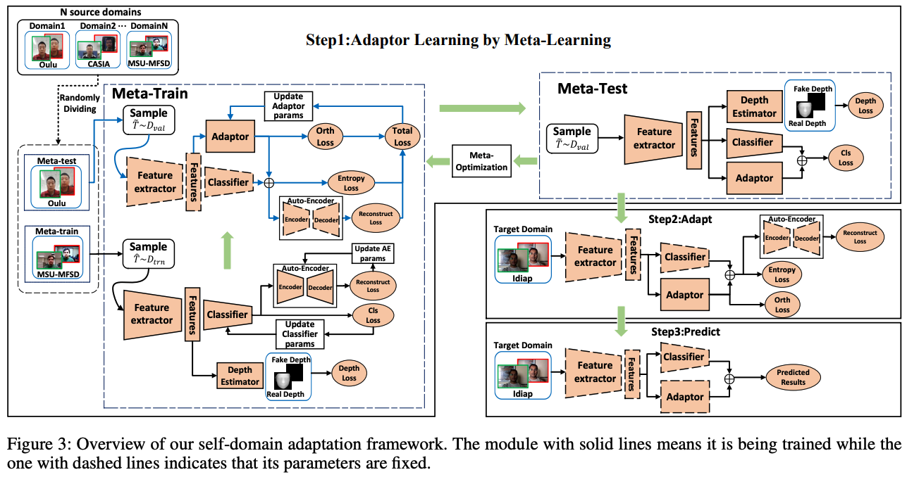
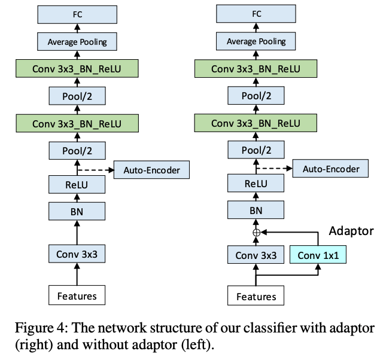
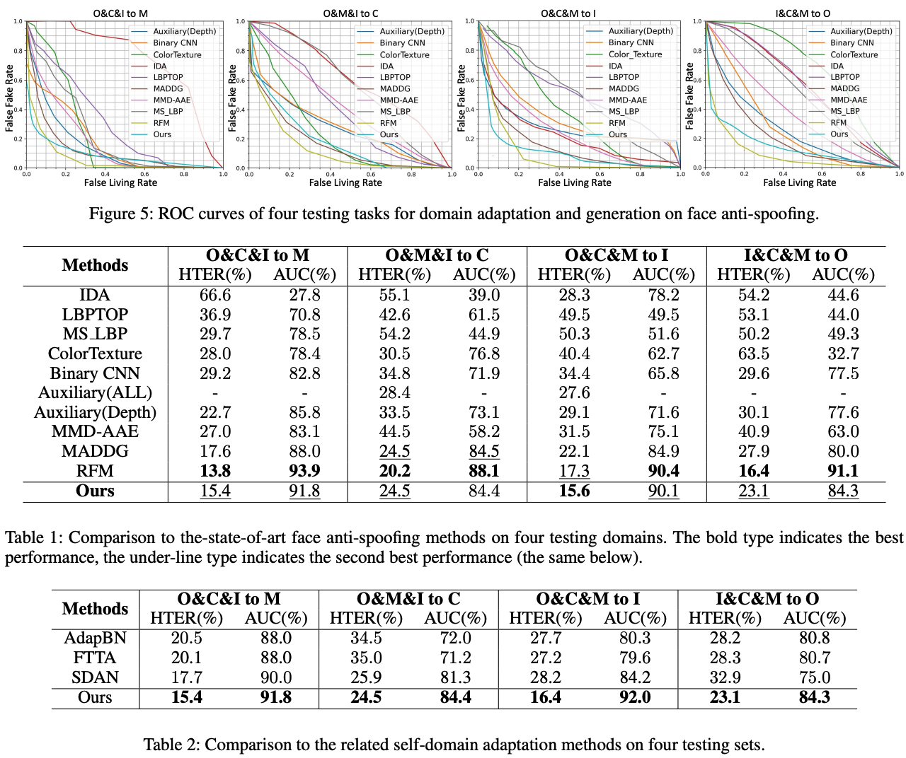

# Self-Domain Adaptation for Face Anti-Spoofing \[English]

##  1. Problem definition

Face anti-spoofing is the task of detecting fake facial verifications such as fake faces on photos, videos or 3d masks. Face anti-spoofing task has become crucial since face recognition have been applied in our daily lives including face recognition payment. 

## 2. Motivation

### Related work

Texture-based methods: Differentiate real and fake faces via different texture cues. LBP, HoG, SIFT and SURF with binary classifier such as SVM and LDA was used. However, in recent works, CNNs are more widely used. 

Temporal-based Methods: Extract temporal cues in consecutive frames for face anti-spoofing. However, comparatively heavy models utilizing CNN-LSTM architectures or rPPG signals show robust results in intra-dataset testing, but not in cross-dataset testing. 

Domain Adaptation or Domain Generalization based methods: Recent face anti-spoofing methods contribute in generalizing models to unseen scenarios and adopt DA and DG. 

- Domain Adatation methods (Zou et al. 2018; Chen, Weinberger, and Blitzer 2011) assume access to the target domain data during training but it is not realistic.
- Domain Generalization methods (Shao et al. 2019; Jia et al. 2020; Shao, Lan, and Yuen 2020) are exploited to extract domain invariant features without target domain data. 
- Self-domain adaptation methods (Qin et al. 2020; Li et al. 2020; Wang et al. 2020; He et al. 2020) trains the model without target domains but to generalize well to various target domains.   

### Idea

This paper proposes a meta-learning based adapter learning algorithm. Self-domain adaptation method is more realistic compared to regular domain adaptation because it doesn't need access to the target domain data during training but still generalize well to the unseen target domain data during inference time. 

## 3. Method

   
   
   
This paper proposes meta-learning based adaptor learning algorithm. The network is composed of a feature extractor, classification header, a depth estimator, an adaptor, and an Autoencoder. In Step 1, the whole network including the adaptor is trained to discriminate real and spoofing features with labeled source domains. In Step 2, they optimize the adaptor only with unsupervised losses according to the real test domain data. Then, fix all the model params and infer in Step 3.

 

Autoencoder is trained to reconstruct the feature maps of classifier. To this end, autoencoder is trained on the source domain data as the similarity measure, and minimize the reconstruction error on the target data. Also, orthogonality is used to prevent the feature mode collapse.

## 4. Experiment & Result

### Experimental setup

This section should contain:

* Dataset: Four public face anti-spoofing datasets: OULU-NPU(denoted as O),  CASIA-MFSD(denoted as C), Idiap Replay-Attack(denoted as I), and MSU-MFSD(denoted as M)
* Baselines: Compare proposed method with state-of-the-art face anti-spoofing methods: Multi-Scale LBP (MS LBP) (Maatta, Hadid, and Pietikainen 2011); Binary CNN (Yang, Lei, and Li 2014); Image Distortion Analysis (IDA)(Wen, Han, and Jain 2015); Color Texture (CT) (Boulkenafet, Komulainen, and Hadid 2017); LBPTOP (Freitas Pereira et al. 2014); Auxiliary (Liu, Jourabloo, and Liu 2018); MMD-AAE (Li et al. 2018c); MADDG (Shao et al. 2019); and RFM (Shao, Lan, and Yuen 2020); Adaptive Batch Normalization (AdapBN) (Li et al. 2018a); Fully Test-Time Adaptation (FTTA) (Wang et al. 2020); and Self Domain Adapted Network (SDAN) (He et al. 2020). 
* Training setup: One dataset is treated as one domain. Randomly select three datasets as source domains and the remaining one as the target domain for testing. Thus, there are four testing tasks in total: O&C&I to M, O&M&I to C, O&C&M to I, and I&C&M to O.
* Evaluation metric: Half Total Error Rate (HTER) and Area Under Curve (AUC).

### Result

Proposed  self-domain adaptation methods can leverage the distribution of target data to learn more discriminative features which are specific for the target domain. Thus, this method outperforms all of the state-of-the-art baseline methods only except RFM, which tilizes meta-learning technique as well. A noticeable point is that this proposed method outperforms all the related self-domain adaptation methods. From that, we can infer that well-initializing adaptor is important and onpy adjusting BN in networks if not sufficient for target domain adaptation. 

 

## 5. Conclusion

This paper proposes a novel self-domain adaptation technique for face ant-spoofing. It proposes three step process to utilize meta-leaning with adaptor architecture and unsupervised losses. This paper shows that extracting discriminative features from domain-specific information of the test domain can boost performance. 

### Take home message \(오늘의 교훈\)

- Best HTER is 15.4%, which is still too high to utilize in the real world security. 

- It is interesting that the simple 1x1 conv adaptor architecture helps generalizing to the target domain.

- According to ablation study, auxiliary losses such as depth estimation and auto-encoder actually helps. It would be useful since those auxiliary architecture can be removed in the actual inference, thus it won't cost any latency.

## Author / Reviewer information


You don't need to provide the reviewer information at the draft submission stage.


### Author

**Korean Name \(English name\)** 

* NAVER
* Developing face anti-spoofing models in Face team
* naeun.ko@navercorp.com

### Reviewer

1. Korean name \(English name\): Affiliation / Contact information
2. Korean name \(English name\): Affiliation / Contact information
3. ...

## Reference & Additional materials

* Citation of this paper

     ``` 
     	@article{wang2021self,
      	 title={Self-Domain Adaptation for Face Anti-Spoofing},
      	 author={Wang, Jingjing and Zhang, Jingyi and Bian, Ying and Cai, Youyi and Wang, Chunmao and Pu, Shiliang},
     	  journal={arXiv preprint arXiv:2102.12129},
     	  year={2021}
     	}
     ```

- Citation of Single-side domain generalization for face anti-spoofing

     ``` 
  @inproceedings{jia2020single,
    title={Single-side domain generalization for face anti-spoofing},
    author={Jia, Yunpei and Zhang, Jie and Shan, Shiguang and Chen, Xilin},
    booktitle={Proceedings of the IEEE/CVF Conference on Computer Vision and Pattern Recognition},
    pages={8484--8493},
    year={2020}
  }
     ```

- Citation of Domain generalization with adversarial feature learning

     ``` 
  @inproceedings{li2018domain,
    title={Domain generalization with adversarial feature learning},
    author={Li, Haoliang and Pan, Sinno Jialin and Wang, Shiqi and Kot, Alex C},
    booktitle={Proceedings of the IEEE Conference on Computer Vision and Pattern Recognition},
    pages={5400--5409},
    year={2018}
  }
     ```

- Citation of Multi-Adversarial Discriminative Deep Domain Generalization for Face Presentation Attack Detection

     ``` 
  @inproceedings{shao2019multi,
    title={Multi-adversarial discriminative deep domain generalization for face presentation attack detection},
    author={Shao, Rui and Lan, Xiangyuan and Li, Jiawei and Yuen, Pong C},
    booktitle={Proceedings of the IEEE/CVF Conference on Computer Vision and Pattern Recognition},
    pages={10023--10031},
    year={2019}
  }
     ```
