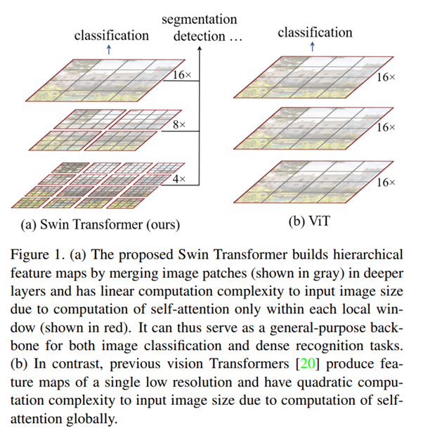
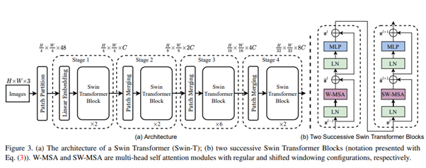

## 1. Problem definition

최근 natural language processing (NLP) 에서 큰 성공을 거둔 self-attention, Transformer 구조를 general vision task에 적용시키는 연구가 많이 진행되고 있습니다. 그중에서도 Vision Transformer (ViT)는 classification에서 sota를 달성하는 등 우수한 성능을 보여주었으며 ViT를 잇는 후속 연구들이 많이 진행되고 있습니다. 이러한 연구들 중 하나인 Swin Transformer는 어떠한 방법으로 general vision task에 transformer 구조를 적용시키려 하였는지 소개해 보도록 하겠습니다.

## 2. Motivation

이 논문에서는 앞서 말씀드린 것과 같이 Transformer구조를 general vision task에 적용시키는 주제의 연구입니다. 관련 연구중 하나인 classification에 적용된 Vision Transformer (ViT)에 이어 보다 일반적인 vision task에 적용될 수 있는 새로운 구조를 제안하였으며 논문의 저자는 이를 통해 Vision과 language feature의 joint modeling을 가능케 하고 두 분야 모두에 도움이 될 수 있을 것이라 언급하였습니다.

### Related work

CNN and variants:

- 기존의 vision task에서 주로 사용되는 방법으로 많이 알고계시는 Convolution neural networks에 관한 내용입니다. AlexNet부터 시작하여 더 deep하고 effective한 구조가 제안되었으며 convolution layer자체를 개선한 방법들에 대해 언급하였습니다. 논문에 저자는 Transformer-like architecture

self-attention based backbone architectures:

- convolution layer의 일부분이나 전부를 self-attention으로 변경하는 연구들에 해당하게 됩니다. 이러한 방법들은 self-attetention이 각각의 pixel의 local window에서 계산되며 기존 vision task의 성능을 향상시킬 수 있음을 보여주었습니다. 하지만 연산량의 증가에 따라 latency가 심각하게 증가하는 단점이 존재합니다. 이 논문에서는 sliding window대신 consecutive layers사이의 shift sindows라는 훨씬 효과적인 방법을 제안하여 이를 해결하려 하였습니다.

self-attention/Transformers to complement CNNs:

- Standard CNN 구조에 self-attention이나 Transformers를 결합한 방법들로 self-attetnion layer가 distant dependencies를 encoding 함으로써 backbone이나 head networks를 보완할 수 있다고 알려져 있습니다. 또한 최근 연구의 경우 encoder-decoder구조의 transformer를 object detection이나 instance segmentation에 적용하고 있습니다. 이 논문에서는 transformer를 biasic visual feature extraction으로 적용하려 하였고 이는 기존 관련 연구들을 보완할 수 있다 언급하였습니다.

Transformer based vision backbones:

- Vision task에 transformer구조를 적용한 방법들로 Vision Transformer (ViT)와 그 후속 논문들에 해당합니다. 이 방법은 이미지를 각각의 고정된 size의 patch로 나누고 이러한 patch를 token으로 사용하는 방법들입니다. CNN 방법들 보다 speed-accuracy trade off를 보였다. 이 논문에서는 Vit의 calssification 성능은 효과적으로 보이나 이러한 구조는 general-purpose backbone으로 사용하기에는 low-resolution feature map과 이미지 크기에 따른 연산량 증가로 인해 적합하지 않다고 언급하며 이를 개선하는 방법을 제안하였습니다.

### Idea

이 논문에서는 low-resolution feature map에 의해 general-purpose backbone으로 사용되기에는 적합하지 않은 기존의 ViT의 방법을 변경하여 layer가 깊어질수록 patch를 merge해 나가는 hyrachical 구조를 제안하였습
기존 Vit의 문제점에는 두가지가 있었습니다.
기존 ViT가 하나의 patch와 그외의 전체 이미지 사이의 self-attention을 계산하는 방식이 이미지의 크기에 따라 연산량이 매우 많아지는 문제가 존재한다 언급하고 이를 각각의 local patch안에서만 self-attention을 계산하는 shifted window based self-attention을 제안함으로써 완화하였습니다.

## 3. Method

  

Figure 1은 swin transformer의 hierarchical feature map을 보여줍니다. 기존의 Vit는 single low resolution feature map을 생성해내는데 반면 swin transformer는 hierarchical feature map으로 deeper layer로 갈수록 patches를 merge해 나가며 window size를 넓혀 갑니다.

### 3.1. Shifted Window based Self-Attention

효율적인 modeling을 위해 본 논문에서는 기존 ViT에서 하나의 token(patch)와 다른 모든 token(patch) 사이의 self-attention을 계산하는 방법을 수정하여 하나의 local windows안에서만 계산하는 방법을 제안하였습니다.
각각의 window가 $M x M$ patches를 가지고 있다 가정했을 때 multi-head self attention (MSA)와 window based multi-head self attention (W-MSA)의 computational complexity는 다음과 같습니다.

$$\Omega(MSA) = 4hwC^2 + 2(hw)^2C $$

$$\Omega(W-MSA) = 4hwC^2 + 2M^2hwC $$

수식에서 보다시피 기존의 MSA의 경우 큰 사이즈의 이미지, 즉 hw가 큰 경우 적합하지 않은 반면 제안된 방법은 scalable한 것을 알 수 있습니다.

하지만 local window 내부에서만 self attention을 계산하게 되면 기존과 달리 window간의 connection이 없어지게 되며 는 model의 성능을 저하시킬 수 있습니다. 본 논문에서는 이를 해결하기 위해 논문에서는 shifted window 방법을 사용하였습니다.

  

Figure 2는 shifted window의 방법을 보여줍니다. 처음에 모듈은 왼쪽 위부터 시작해 8 x 8 feature map을 4 x 4 size를 가진 window를 이용, 2 x 2로 partitioning 하는 regular window partitioning strategy를 사용합니다. 이후 layer에서 기존의 window를 내림(M/2) , 내림(M/2) 만큼 이동시키는 방법으로 window를 이동시키게 됩니다.

### 3.2. Overall Architectures

  

Figure 3은 Swin Transformer tiny version의 architecture를 보여줍니다. Swin Transformer는 image를 입력으로 받아 시작하게 됩니다. patch partitioning에서 ViT와 같이 image를 patch로 나누게 됩니다. 이후 나누어진 patch를 token으로 transformer의 입력으로 사용하는 방식을 가지고 있습니다.

이후 각각의 stage마다 patch merging으로 patch를 결합해 window size를 넓혀주게 됩니다. 이렇게 함으로써 각각의 stage는 서로 다른 scale feature를 가질 수 있게 되며 segmentation이나 detection에는 이러한 계층? feature가 중요하다고 합니다.

Swin Transformer block은 앞서 설명드린 W-MSA와 SW-MSA로 이루어져 있으며 나머지 부분은 기본적인 Transformer와 동일합니다.

## 4. Experiment & Result
### Experimental setup

각각의 vision task에 실험해보기 위해 논문에서는 크게 3가지 classification, object detection, semantic segmentation task 실험을 진행하였으며 비교 대상으로는 각각의 task, classification, object detection, semantic segmentation의 state-of-the-arts 모델들을 사용하였습니다.

#### Dataset

각각의 dataset은 다음과 같습니다.
- Image Classification : ImageNet-1K image classfication
- Object Detection : COCO object detection
- Semantic Segmentation : ADE20K semantic segmentation

#### Training step
- ##### Image Classification on ImaegNet-1K
  - ###### Regular ImageNet-1K training
  
    AdamW optimizer와 cosine decay learning rate schedular를 사용하였으며 cosine decay로 300 epochs, linear warm-up으로 20 epochs 학습하였습니다.
    
    batch size는 1024이며 초기 learning rate는 0.001, weight decay 는 0.05가 사용되었습니다.
  - ###### Pre-trainiong on ImageNet-22K and fine-tunnign on ImageNet-1K

    Pre-train에 AdamW optimizer와 linear decay learning rate scheduler를 사용하였으며 90 epochs, linear warm-up으로 5 epochs 학습하였습니다.
    
    batch size는 4096이며 초기 learning rate는 0.001, weight decay 는 0.01가 사용되었습니다.
    
    fine-tuning에는 batch size 1024, learning rate $10^(-5)$, weight decay $10^(-8)$이 사용되었습니다.
- ##### Object Detection on COCO
  
  multi-scale training 방식으로 이미지의 가로 세로중 짧은 부분은 480 ~ 800, 긴 부분은 최대 1333으로 사용했다고 합니다.
  
  AdamW optimizer와 초기 learning rate 0.00001, weight decay 0.05, batch size 16, epochs 36 을 사용하였으며 27, 33 epoch에 learning rate가 10x 만큼 줄이게끔 했다고 합니다.
- ##### Semantic segmentation on ADE20K
  
  AdamW optimizer와 초기 learning rate $6x10^(-5)$, weight decay 0.01, linear warmup 1,500 iterations을 사용하였으며 model은 160K iterations동안 학습했다고 합니다.

기타 flipping, random re-scaling, random photometric distortion등의 augmentation이 사용됬다고 합니다.

#### Evaluation matrics
- Image Classification : param, FLOPS, throughput, top-1 acc.
- Object Detection : AP, param, FLOPS
- Semantic Segmentation : mIoU param, FLOPS, FPS

#### Result

##### Image Classification, Object Detection, Semantic Segmentation 에 대한 성능을 수치로 비교한 표입니다.
  

    
  

  왼쪽부터 Image Classification, Object Detection, Semantic Segmentation에 해당하며 Image Classification의 경우 기존 state-of-the-art와 classification에 사용된 ViT와의 성능을 비교한 자료로 EfficientNet-B7과 비슷한 성능을 보인다고 합니다. 또한 ViT 모델들의 경우 기존보다 적은 parameter수로 더 높은 성능을 달성했다는 것을 보여줍니다.
  
  Object Detection, Semantic Segmentation의 경우 기존 모델들의 backbone을 변경하여 성능을 비교하였습니다. 기존 방법들에서 backbone을 Swin Transformer로 변경하였을 때 거의 대부분 기존 성능을 능가한 것을 보인다 합니다.

## 5. Conclusion

### Take home message (오늘의 교훈)

## Reference & Additional materials

1. Liu, Z., Lin, Y., Cao, Y., Hu, H., Wei, Y., Zhang, Z., ... & Guo, B. (2021). Swin transformer: Hierarchical vision transformer using shifted windows. arXiv preprint arXiv:2103.14030.
2. [Official GitHub repository](https://github.com/microsoft/Swin-Transformer)
