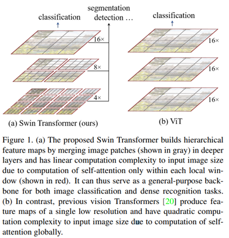
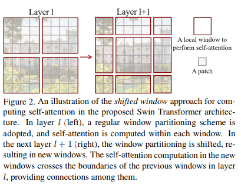
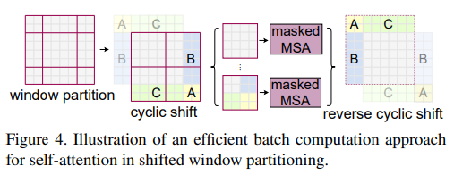
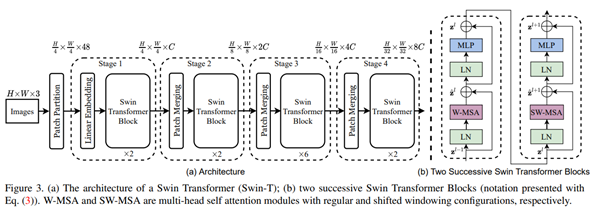
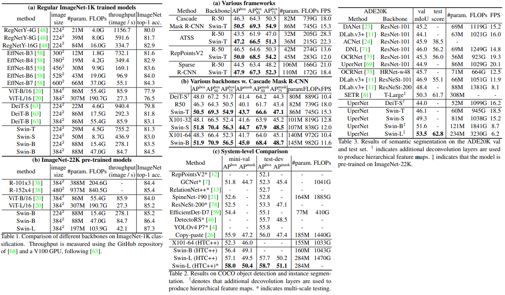

# Swin Transformer \[Kor\]

## 1. Problem definition

최근 natural language processing (NLP) 에서 큰 성공을 거둔 self-attention, Transformer 구조를 general vision task에 적용시키는 연구가 많이 진행되고 있습니다. 그중에서도 Vision Transformer (ViT) [3] 는 classification에서 sota를 달성하는 등 우수한 성능을 보여주었으며 ViT를 잇는 후속 연구들이 많이 진행되고 있습니다. 이러한 연구들 중 하나인 Swin Transformer는 어떠한 방법으로 general vision task에 transformer 구조를 적용시키려 하였는지 소개해 보도록 하겠습니다.

## 2. Motivation

이 논문에서는 앞서 말씀드린 것과 같이 Transformer구조를 general vision task에 적용시키는 주제의 연구입니다. 관련 연구중 하나인 classification에 적용된 Vision Transformer (ViT)에 이어 보다 일반적인 vision task에 적용될 수 있는 새로운 구조를 제안하였으며 논문의 저자는 이를 통해 Vision과 language feature의 joint modeling을 가능케 하고 두 분야 모두에 도움이 될 수 있을 것이라 언급하였습니다.

### Related work

CNN and variants:

- 기존의 vision task에서 주로 사용되는 방법으로 많이 알고계시는 Convolution neural networks에 관한 내용입니다. AlexNet부터 시작하여 더 deep하고 effective한 구조가 제안되었으며 convolution layer자체를 개선한 방법들에 대해 언급하였습니다. 지금까지의 CNN에 이러이러한 모델들이 있다 라는 언급이며 논문에서 중요한 부분이 아니라 자세한 모델 이름은 기재하지 않았습니다. 논문에서의 핵심은 vision과 language 사이의 modeling을 위해  transformer의 잠재력을 강조하고 modeling의 변화에 기여하기를 원한다고 언급하고 있습니다.

self-attention based backbone architectures:

- convolution layer의 일부분이나 전부를 self-attention으로 변경하는 연구들에 해당하며 크게 Stand-alone self-attention model [4], Local Relation Networks [5]가 있습니다. 이 중 Local Relation Networks는 self-attetention이 각각의 pixel의 local window에서 계산되며 기존 vision task의 성능을 향상시킬 수 있음을 보여주었습니다. 하지만 sliding 방식을 사용하여 연산량의 증가에 따라 latency가 심각하게 증가하는 단점이 존재한다고 합니다. 이 논문에서는 sliding window 대신 consecutive layers사이의 shift sindows라는 훨씬 효과적인 방법을 제안하여 이를 해결하려 하였습니다.

self-attention/Transformers to complement CNNs:

- Standard CNN 구조에 self-attention이나 Transformers를 결합한 방법들로 self-attetnion layer가 distant dependencies를 encoding 함으로써 backbone이나 head networks를 보완할 수 있다고 알려져 있습니다. 또한 최근 연구의 경우 encoder-decoder구조의 transformer를 object detection이나 instance segmentation에 적용하고 있습니다. 이 논문에서는 transformer를 basic visual feature extraction으로 적용하려 하였고 이는 기존 관련 연구들을 보완할 수 있다 언급하였습니다.

Transformer based vision backbones:

- Vision task에 transformer구조를 적용한 방법들로 Vision Transformer (ViT)와 그 후속 논문들에 해당합니다. 이 방법은 이미지를 각각의 고정된 size의 patch로 나누고 이러한 patch를 token으로 사용하는 방법들입니다. CNN 방법과 비슷한 성능이지만 보다 빠른 속도를 보였습니다. 이 논문에서는 Vit의 classification 성능은 효과적으로 보이나 이러한 구조는 general-purpose backbone으로 사용하기에는 low-resolution feature map과 이미지 크기에 따른 연산량 증가로 인해 적합하지 않다고 언급하며 이를 개선하는 방법을 제안하였습니다.

### Idea

이 논문에서는 low-resolution feature map에 의해 general-purpose backbone으로 사용되기에는 적합하지 않은 기존의 ViT의 방법을 변경하여 layer가 깊어질수록 patch를 merge해 나가는 hierarchical 구조를 제안하였습니다.
기존 Vit는 이미지가 커질수록 연산량이 매우 증가한다는 단점이 존재하였습니다. 이를 각각의 local patch안에서만 self-attention을 계산하는 shifted window based self-attention을 제안함으로써 완화하였으며 feature pyramid 구조를 제안함으로써 다른 vision task에도 사용가능한 계층적인 정보를 활용할 수 있다고 합니다.

## 3. Method

  

Figure 1은 swin transformer의 hierarchical feature map과 기존 ViT의 feature map을 보여줍니다. 기존의 Vit는 single low resolution feature map을 생성해내는데 반면 swin transformer는 hierarchical feature map으로 deeper layer로 갈수록 patches를 merge해 나가며 window size를 넓혀 갑니다. 

ViT의 경우 고정된 patch size $$(16x16)$$를 사용하며 그 결과 output feature map의 resolution은 기존 input image size의 $$1/16$$이 됩니다. 반면 swin transformer의 경우 patch size를 작은 것부터 점점 키워가며 상대적으로 high resolution feature map부터 low resolution feature map 까지 hiearachical한 feature map을 추출 할 수 있습니다.

이러한 hiearachical한 feature map은 기존 CNN에서 자주 사용되는 feature pyramid networks, U-Net과 같은 기술을 간단하게 적용할 수 있게 합니다. 또한 model이 여러 scale로 부터 유연하게 feature map을 뽑아낼 수 있게 하는 역할을 하게 합니다. (CNN에서 receptive field의 역할과 비슷한 내용인 것 같습니다. Detection으로 예를 들면 patch size가 클 수록 큰 object를 잘 탐지하며 반대일 경우 작은 object를 잘 탐지하는 역할을 하는 내용이라고 생각합니다.)

### 3.1. Shifted Window based Self-Attention

효율적인 modeling을 위해 본 논문에서는 기존 ViT에서 하나의 token(patch)와 다른 모든 token(patch) 사이의 self-attention을 계산하는 방법을 수정하여 하나의 local windows안에서만 계산하는 방법을 제안하였으며 이를 window based multi-head self attention (W-MSA)라 합니다.
각각의 window가 $$M x M$$ patches를 가지고 있다 가정했을 때 multi-head self attention (MSA)와 window based multi-head self attention (W-MSA)의 computational complexity는 다음과 같습니다.

$$\Omega(MSA) = 4hwC^2 + 2(hw)^2C$$

$$\Omega({W\mbox{-}MSA}) = 4hwC^2 + 2M^2hwC$$

수식에서 보다시피 기존의 MSA의 경우 큰 사이즈의 이미지, 즉 hw가 큰 경우 적합하지 않은 반면 제안된 방법은 scalable한 것을 알 수 있습니다. $$(hw >> M)$$

아래의 Result section에서 ViT와 Swin Transformer의 FLOPS(연산량) 비교를 보시면 이해하기 쉬우실 겁니다.

하지만 local window 내부에서만 self attention을 계산하게 되면 기존과 달리 window간의 connection이 없어지게 되며 는 model의 성능을 저하시킬 수 있습니다. 본 논문에서는 이를 해결하기 위해 논문에서는 shifted window 방법을 사용하였습니다.

  

Figure 2는 shifted window의 방법을 보여줍니다. 처음에 모듈은 왼쪽 위부터 시작해 $$8 \mbox{x} 8$$ feature map을 $$4 \mbox{x} 4$$ size를 가진 window를 이용, $$2 \mbox{x} 2$$ 로 partitioning 하는 regular window partitioning strategy를 사용합니다. 이후 layer에서 기존의 window를 $$\lfloor{M\over2}\rfloor,\lfloor{M\over2}\rfloor$$ 만큼 이동시키는 방법으로 window를 이동시키게 됩니다.
 

이때 shifted window 방식을 사용하게 되면 몇몇 window의 size가 $$M \bmox{x} M$$보다 작아질 수 있습니다. 논문의 저자는 이러한 문제를 padding으로 해결할 경우 computational cost가 증가하게 되며 보다 효율적인 방법인 cyclic shift 방법을 제안하였습니다.

  

Figure 4는 cyclic shift 방법을 보여주는 그림입니다. 해당 방법은 batch window는 feature map에서 인접하지 않은 여러개의 sub window로 구성되며 masking 방법을 이용, self-attention을 각각의 sub-window에서 계산되게 제한한다고 합니다. batched window의 수는 regular window partitioning과 동일하여 padding방법보다 효율적이라고 설명하고 있습니다.

### 3.2. Overall Architectures

  

Figure 3은 Swin Transformer tiny version의 architecture를 보여줍니다. Swin Transformer는 image를 입력으로 받아 시작하게 됩니다. patch partitioning에서 ViT와 같이 image를 patch로 나누게 됩니다. 이후 나누어진 patch를 token으로 transformer의 입력으로 사용하는 방식을 가지고 있습니다.

이후 각각의 stage마다 patch merging으로 patch를 결합해 window size를 넓혀주게 됩니다. 이렇게 함으로써 각각의 stage는 서로 다른 scale feature를 가질 수 있게 되며 vision task에 사용가능한 계층적인 정보를 활용할 수 있다고 합니다.

Swin Transformer block은 앞서 설명드린 W-MSA와 SW-MSA로 이루어져 있습니다. hierarchical representation을 제공하기 위해 token의 수는 patch merging layer를 통과함에 따라 줄어들게 되며 매번 token의 수를 4배 줄이고 output dimension을 2배 늘린다고 합니다. 따라서 각 stage의 output resolutions은 그림에서 보다시피 $$H \mbox{x} W$$ 에서 시작하여 $${H \over 32} \mbox{x} {W \over 32}$$로 줄어들게 됩니다. 이러한 feature map의 resolution은 전형적인 convolution networks인 VGG [6]와 ResNet [7]과 같으며 따라서 쉽게 기존 CNN모델을 대체할 수 있다고 저자는 말하고 있습니다.

W-MSA은 위에서 설명한 연산량을 줄인 window based multi-head self attention이며 SW-MSA은 connection소실을 해결하기 위해 patch를 shift 시켜 수행하는 Shifted Window based Self-Attention을 의미합니다. SW-MSA에서 W-MSA에서 사용한 patch를 shift시켜 다시 한번 수행한다고 생각하면 될 것 같습니다.

## 4. Experiment & Result
### Experimental setup

각각의 vision task에 실험해보기 위해 논문에서는 크게 3가지 classification, object detection, semantic segmentation task 실험을 진행하였으며 비교 대상으로는 각각의 task, classification, object detection, semantic segmentation의 state-of-the-arts 모델들을 사용하였습니다.

#### Dataset

각각의 dataset은 다음과 같습니다.
- Image Classification : ImageNet-1K image classfication [8]
- Object Detection : COCO object detection [9]
- Semantic Segmentation : ADE20K semantic segmentation [10]

#### Training step
- ##### Image Classification on ImaegNet-1K
  - ###### Regular ImageNet-1K training
  
    AdamW optimizer와 cosine decay learning rate schedular를 사용하였으며 cosine decay로 300 epochs, linear warm-up으로 20 epochs 학습하였습니다.
    
    batch size는 1024이며 초기 learning rate는 0.001, weight decay 는 0.05가 사용되었습니다.
  - ###### Pre-trainiong on ImageNet-22K and fine-tunnign on ImageNet-1K

    Pre-train에 AdamW optimizer와 linear decay learning rate scheduler를 사용하였으며 90 epochs, linear warm-up으로 5 epochs 학습하였습니다.
    
    batch size는 4096이며 초기 learning rate는 0.001, weight decay 는 0.01가 사용되었습니다.
    
    fine-tuning에는 batch size 1024, learning rate $$10^{-5}$$, weight decay $$10^{-8}$$이 사용되었습니다.
- ##### Object Detection on COCO
  
  multi-scale training 방식으로 이미지의 가로 세로중 짧은 부분은 480 ~ 800, 긴 부분은 최대 1333으로 사용했다고 합니다.
  
  AdamW optimizer와 초기 learning rate 0.00001, weight decay 0.05, batch size 16, epochs 36 을 사용하였으며 27, 33 epoch에 learning rate가 10x 만큼 줄이게끔 했다고 합니다.
- ##### Semantic segmentation on ADE20K
  
  AdamW optimizer와 초기 learning rate $$6x10^{-5}$$, weight decay 0.01, linear warmup 1,500 iterations을 사용하였으며 model은 160K iterations동안 학습했다고 합니다.

기타 flipping, random re-scaling, random photometric distortion등의 augmentation이 사용됬다고 합니다.

#### Evaluation matrics
- Image Classification : param, FLOPS, throughput, top-1 acc.
- Object Detection : AP, param, FLOPS
- Semantic Segmentation : mIoU param, FLOPS, FPS

#### Result

##### Image Classification, Object Detection, Semantic Segmentation 에 대한 성능을 수치로 비교한 표입니다.

  

왼쪽부터 Image Classification, Object Detection, Semantic Segmentation에 해당하며 Image Classification의 경우 기존 state-of-the-art와 classification에 사용된 ViT와의 성능을 비교한 자료로 EfficientNet-B7과 비슷한 성능을 보인다고 합니다. 또한 ViT 모델들의 경우 기존보다 적은 parameter수로 더 높은 성능을 달성했다는 것을 보여줍니다.

Object Detection, Semantic Segmentation의 경우 기존 모델들의 backbone을 변경하여 성능을 비교하였습니다. 기존 방법들에서 backbone을 Swin Transformer로 변경하였을 때 거의 대부분 기존 성능을 능가한 것을 보인다 합니다.

## 5. Conclusion

본 논문에서는 hierarchical feature representation을 수행할 수 있으며 image size에 비해 적은 computational complexity를 가지는 새로운 transformer 구조를 제안하였습니다. 기존 ViT의 multi-head self-attention의 연산량 문제를 window based self-attetnion으로 해결하고 window간의 connection문제를 shifted window 방식으로 해결하였습니다. Calssfication이외의 vision task에 필요한 부분을 분석하고 multi scale을 위해 patch를 merge하는 hierarchical 구조를 제안하였습니다. 제안된 모델은 Object Detection, Semantic Segmentation에서 state-of-the-art를 달성하였습니다. 기존의 Vision transformer의 문제를 잘 분석하고 classification이외의 다른 vision task를 위한 분석 및 모델 설계가 돋보이는 논문이었습니다.

### Take home message (오늘의 교훈)

기존 방법의 단점을 분석하고 개선하는 것과 수행해야할 task에 집중하여 중요한 것이 무엇인지 생각해 보는것이 중요하다고 생각합니다.

## Author / Reviewer information

### Author

**이현수 (Hyeonsu Lee)**

- Affiliation (KAIST AI / NAVER)
- Machine Learning Engineer @ NAVER Papago team

### Reviewer

1. Korean name (English name): Affiliation / Contact information
2. Korean name (English name): Affiliation / Contact information
3. ..

## Reference & Additional materials

1. [Liu, Z., Lin, Y., Cao, Y., Hu, H., Wei, Y., Zhang, Z., ... & Guo, B. (2021). Swin transformer: Hierarchical vision transformer using shifted windows. arXiv preprint arXiv:2103.14030.](https://arxiv.org/abs/2103.14030)
2. [Official GitHub repository](https://github.com/microsoft/Swin-Transformer)
3. [Alexey Dosovitskiy, Lucas Beyer, Alexander Kolesnikov, Dirk Weissenborn, Xiaohua Zhai, Thomas Unterthiner, Mostafa Dehghani, Matthias Minderer, Georg Heigold, Sylvain Gelly, Jakob Uszkoreit, and Neil Houlsby. An image is worth 16x16 words: Transformers for image recognition at scale. In International Conference on Learning Representations, 2021. 1, 2, 3, 4, 5, 6, 9](https://arxiv.org/pdf/2010.11929.pdf)
4. [Prajit Ramachandran, Niki Parmar, Ashish Vaswani, Irwan Bello, Anselm Levskaya, and Jon Shlens. Stand-alone selfattention in vision models. In Advances in Neural Information Processing Systems, volume 32. Curran Associates, Inc., 2019. 2, 3](https://arxiv.org/pdf/1906.05909.pdf)
5. [Hu, H., Zhang, Z., Xie, Z., & Lin, S. (2019). Local relation networks for image recognition. In Proceedings of the IEEE/CVF International Conference on Computer Vision (pp. 3464-3473).](https://openaccess.thecvf.com/content_ICCV_2019/papers/Hu_Local_Relation_Networks_for_Image_Recognition_ICCV_2019_paper.pdf)
6. [K. Simonyan and A. Zisserman. Very deep convolutional networks for large-scale image recognition. In International Conference on Learning Representations, May 2015.](https://arxiv.org/pdf/1409.1556.pdf)
7. [He, K., Zhang, X., Ren, S., & Sun, J. (2016). Deep residual learning for image recognition. In Proceedings of the IEEE conference on computer vision and pattern recognition (pp. 770-778).](https://openaccess.thecvf.com/content_cvpr_2016/papers/He_Deep_Residual_Learning_CVPR_2016_paper.pdf)
8. Jia Deng, Wei Dong, Richard Socher, Li-Jia Li, Kai Li, and Li Fei-Fei. Imagenet: A large-scale hierarchical image database. In 2009 IEEE conference on computer vision and pattern recognition, pages 248–255. Ieee, 2009 9. 
9. Tsung-Yi Lin, Michael Maire, Serge Belongie, James Hays, Pietro Perona, Deva Ramanan, Piotr Dollar, and C Lawrence ´ Zitnick. Microsoft coco: Common objects in context. In European conference on computer vision, pages 740–755. Springer, 2014
10. Bolei Zhou, Hang Zhao, Xavier Puig, Tete Xiao, Sanja Fidler, Adela Barriuso, and Antonio Torralba. Semantic understanding of scenes through the ade20k dataset. International Journal on Computer Vision, 2018. 
