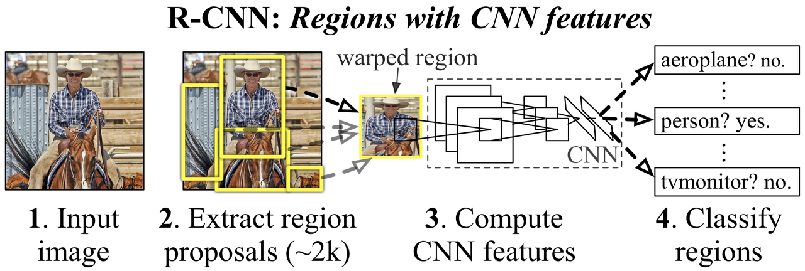
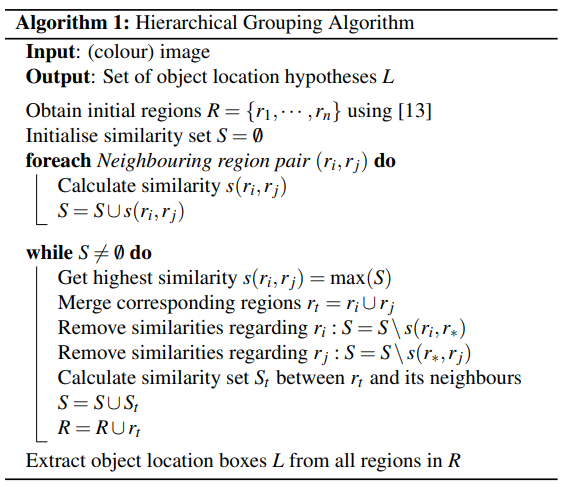
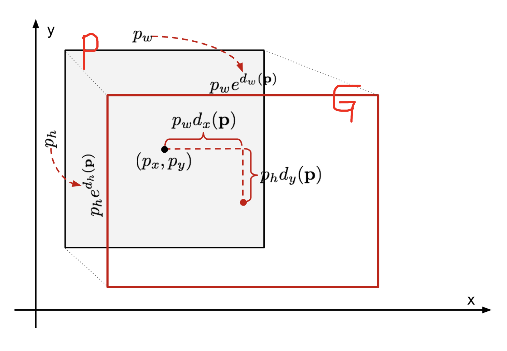

# cvpr-2014-rcnn [Kor\]

##  1. Problem definition

Object Detection 분야는 한동안 정체되었고 2012년 ILSVRC (ImageNet Large Scale Visual Recognition Callenge) 에서 CNN이 알려졌다. 이 논문은 PASCAL VOC Challenge에서 CNN으로 classification 뿐만 아니라 성능 좋은 object detection을 달성할 수 있음을 보여준다. 

## 2. Motivation

Region proposal과 CNN을 통한 clssification을 결합하여 object detection에 관한 문제를 해결. 이후 RCNN을 바탕으로 RCNN 계열 (Fast RCNN, Faster RCNN, Mask RCNN 등) 논문들에서 꾸준히 성능과 속도를 향상

1. 이미지를 집어넣는다.
2. 2000개 이하의 영역을 추출하여 이미지를 잘라낸다.
3. 잘라낸 이미지의 사이즈는 CNN 모델에 맞게 조정한다. (227x227 pixels)
4. 이미지를 ImageNet을 활용한 pre-trained CNN 모델로 연산한다. 
5. 각 영역별로 잘라낸 이미지들의 CNN 결과로 나온 feature map 을 활용하여, SVM으로 Classification 결과를 도출한다.
6. regressor를 통한 bounding box regression을 진행한다.

위의 과정에서 각 물체의 영역을 찾아내는 Region proposal과 잘라낸 이미지들을 분류하는 clssification을 수행하게 된다. 이 2가지의 과정을 연달아 진행함으로써 object detection의 문제를 해결한다.

## 3. Method

object detection 시스템은 3가지의 모듈로 구성되어 있다. 

1. Region proposal

   selective search를 사용하여 각 영역을 분리하여 쪼갠다. [0,1] 사이로 정규화된 4가지 요소 (색상, 재질, 크기, 채움) 등의 가중합으로 유사도를 측정한다. 초기에 선택된 영역들 중에 유사도가 높은 영역들을 선택하여 병합한다. 병합한 영역과 다른 영역의 유사도를 재정의한다. 이 과정을 반복하여 유사도가 높은 영역들을 합쳐 각 영역을 구분한다.

   

   

2. Pre-trained CNN (Convolutional Neural Network)

   region proposal에 의해 쪼개진 이미지들을 227x277 사이즈로 맞춘다. 고정된 사이즈로 맞춰진 이미지를 CNN에 넣어서 Classification을 진행한다. 기존의 AlexNet의 구조를 그대로 사용했다. 단지 object detection을 위해서 1000개의 class로 분류하던 구조대신에 (200,20)의 feature map을 추출하도록 변형을 시켰다.

   

3. SVM (Support Vector Machine)
   CNN을 통해서 feature들이 추출된다. Feature 들을 이용해서 Linear SVM으로 Classifciation을 진행한다. 

4. Bounding Box Regression
   Region proposal을 거치면서 추출된 bounding box인 P와 ground truth bounding box를 맞추도록 학습을 하는 것이 Bounding Box Regression의 목표이다.

   

   

## 4. Experiment & Result

TBD

### Result

Please summarize and interpret the experimental result in this subsection.

## 5. Conclusion

RCNN은 기존 PASCAL VOC 2012의 가장 좋은 기록보다 30%의 성능이 향상됬다. 2가지 관점에서 의의를 가진다. 하나는 region proposal과 CNN을 활용한 Object detection 문제를 해결한 것이고, 나머지는 데이터가 부족한 상태에서 pre-train 된 거대 CNN과 특정 목적으로 fine-tune하여 효율성을 제고했다는 것이다. 

## Author / Reviewer information

### Author

**Korean Name \(English name\)** 

* 권문범 (NAVER\)
* https://github.com/MBKwon

### Reviewer

1. Korean name \(English name\): Affiliation / Contact information
2. Korean name \(English name\): Affiliation / Contact information
3. ...

## Reference & Additional materials

1. Citation of this paper
2. Official \(unofficial\) GitHub repository
3. Citation of related work
4. Other useful materials
5. ...

