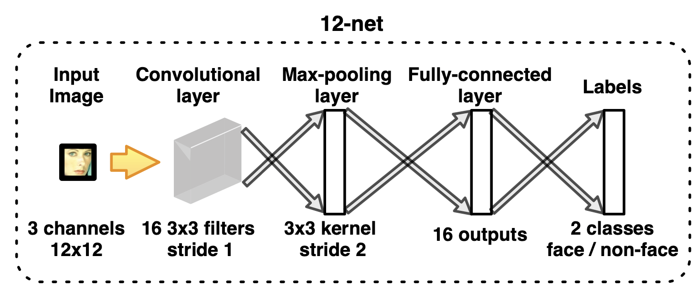
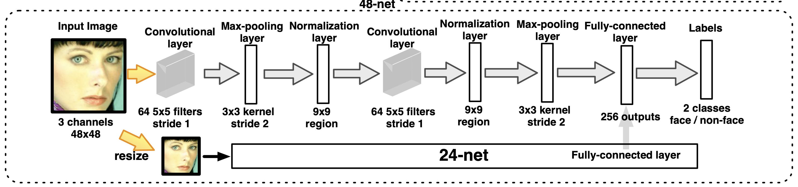

# A Convolutional Neural Network Cascade for Face Detection [Kor]

##  1. Problem definition

얼굴 인식은 일반적인 Object Detection 문제보다 조금 더 어렵다고 알려져 있다. 기본적으로 얼굴 표정, 포즈, 인종, 조명과 같은 주변 환경에 따라 시각적으로 영향받는 요소가 상당히 많다. 또한 전체 이미지에서 찾아야 하는 얼굴이 많고, 크기가 작다면 알고리즘의 인식 성능이 떨어지게 된다.

위의 두 가지 문제점은 정확한 이진 분류 성능과 빠른 연산 성능을 요구한다. 해당 논문에서는 CNN과 Cascade architecture를 사용하여 정확도와 성능을 모두 만족하는 Convolutional Neural Network Cascade를 소개한다.

## 2. Motivation

기존에 알려진 얼굴인식 알고리즘들은 Haar feature와 같은 간단한 특징들을 이용하는 경우가 많았다. 이러한 특징들은 정면에서 찍은 정제된 얼굴들은 잘 표현하지만 정제되지 않은 환경에서의 얼굴을 인식하는 상황에서는 상대적으로 약세를 보였다.

그래서 이러한 문제점들을 보완하기 위해 많은 개선사항들이 제안되었는데 이들 중 많은 수는 간단한 특징 대신에 심화된 특징을 이용하는 것이었다.

저자는 CNN을 이용하여 특징을 추출하면 기존에 손수 얻은 특징을 사용하는 것에 비해 정제되지 않은 상황에서 얼굴을 더 잘 표현할 것이라고 생각했다. 

하지만 CNN을 이용해서 전체 이미지를 스캔하는 것은 상당한 연산량을 요구하기 때문에 저자는 CNN cascade를 도입했다. 

저해상도 이미지를 이용하여 후보들을 걸러내고, 엄선된 후보들을 대상으로 고해상도 이미지를 이용해 신중하게 판단하는 방식이다. 

### Related work

1994년 Vaillan팀은 얼굴인식에 신경망을 적용했다. 그들은 이미지에 얼굴이 있는 지 없는 지를 인식하는 CNN을 학습하는 것을 소개했다.

1996년 Rowley팀은 똑바로 서있는 정면 얼굴에 대한 신경망 구조를 소개했고, "router" 구조를 도입하여 회전에 상관없이 인식하는 구조로 확장시켰다.

2002년 Garcia팀은 복잡한 이미지에서 반만 정면인 얼굴을 인식하는 데 성공했다.

2005년 Osadchy팀은 얼굴인식과 포즈를 동시에 인식하는 CNN을 학습시켰다.

여태까지 소개된 관련 연구들은 정제된 상황에서 정면을 바라보는 얼굴에 대해서는 좋은 성능을 내는 것으로 알려져 있지만 정제되지 않은 상황에서는 좋은 성능을 내는 지 알려진 바가 없다.

최근 CNN 기반의 인식 방법 중 잘 알려진 것 중 하나는 VOC 2021에서 state-of-the-art를 달성한 Girshick 팀의 R-CNN이다. 

하지만 R-CNN 역시 복잡한 시각적 특징을 가진 얼굴을 빠르고 정확하게 인식하기에는 어려움이 따른다.

### Idea

이 논문의 핵심 아이디어는 여러 개의 CNN을 입력 이미지의 사이즈를 키워가면서 순차적으로 배치함으로써 빠르고 정확하게 얼굴 인식을 수행하는 CNN cascade 구조에 있다. detection의 후보가 되는 전체 detection window를 CNN을 통해 연산하게되면 느려질 수 있는데, 낮은 해상도로 resize하여 false positive를 걸러내고 고해상도에서 정밀한 이진 분류를 수행한다. 또한 CNN 사이에서 새로운 입력 이미지를 넘겨주는 과정에서 정확도를 향상시키기 위해 다중 클래스 분류 CNN을 이용한 calibration stage를 도입하였다.

## 3. Method

### Overall framework
전체 테스트 파이프라인은 아래 그림을 통해 볼 수 있다.
주어진 테스트 이미지에 대해 12-net이 전체 이미지를 12x12 사이즈의 윈도우를 이용하여 스캔하고 90%의 후보를 제외시킨다. 남은 후보들은 12-calibration-net를 이용하여 얼굴이 중앙에 오도록 사이즈와 위치가 조정된다. 그리고 중첩된 영역을 제거하기 위해 NMS(Non Maximum Suppression)가 수행된다. 

동일한 과정을 24x24 사이즈의 윈도우를 이용한 24-net, 24-calibration-net에서 수행하며 이 과정에서는 12x12의 입력을 함께 받아 다중 해상도를 기반으로 classification을 수행한다.

마지막으로 48-net은 48x48 이미지를 입력으로 받으며, 최종적으로 Global NMS가 적용되어 IoU threshold를 초과하는 윈도우를 48-calibration-net에 전달하고 크기와 위치가 조정된 윈도우를 출력한다.

### CNN Structures

Cascade에는 6개의 CNN이 존재한다. 얼굴과 얼굴이 아닌 것을 이진 분류하는 3개의 CNN, 그리고 Bounding box를 calibrate하는 3개의 CNN이다. Calibration network는 Bounding box를 효율적으로 조정하기 위해 변형을 미리 정의된 패턴을 이용하며, 이를 위한 multi-class classification을 수행한다.

여러 해상도의 네트워크를 복합적으로 이용하는 구조를 통해 이진 분류의 정확도를 높였고, Calibration을 Multi-class classification 문제로 보고 접근함으로써 성능을 향상시켰다.

#### 12-net

12-net은 테스트 파이프라인의 첫번째 CNN에 해당한다.

3x12x12의 입력 이미지를 받으며, Convolution layer - Max-Pooling layer - Fully-connected layer의 얕은 CNN 구조를 가지고 있다.

#### 12-calibration-net

12-calibration-net은 bounding box 조정을 위해 12-net 다음에 오는 CNN을 말한다. 12-calibration-net도 역시 얕은 CNN이며, N개의 calibration 패턴이 scale 변화와 offset vector의 3가지 조합으로 미리 정의되어있다. 

인식 window가 좌상단 좌표 (x, y)와 크기 (w, h)를 가질 때, calibration pattern은 window를 조정하여 다음과 같은 결과를 만든다.

12-calibration-net의 구조는 아래 이미지와 같다.

calibration net의 결과는 N개 패턴에 각각 해당하는 confidence score vector이다. 이 패턴들은 서로 무관하지 않기 때문에 low confidence threshold를 초과하는 높은 confidence score들을 평균내서 조정을 수행한다.

#### 24-net

24-net은 중간 단계의 이진 분류 CNN이다.

빠른 성능을 위해 12-net과 비슷한 얕은 CNN 구조가 선택되었지만, 24-net에서는 다중 해상도 구조가 적용되었다. 24x24 입력에 더해 12-net과 동일한 서브 구조에 12x12 해상도의 입력을 함께 제공하는 것이다

이러한 다중 해상도 구조를 이용해, 24-net은 작은 얼굴을 인식하는 데 도움이 되는 12x12 해상도의 정보를 포함하여 분류를 수행하게 된다.

#### 24-calibration-net

12-calibration-net과 유사하게, 24-calibration-net은 N개의 calibration 패턴을 가진 또 다른 calibration net이라고 볼 수 있다. 입력 이미지가 24x24라는 것만 빼면 24-calibration-net은 12-calibration-net과 동일하다.

#### 48-net

48-net은 마지막 이진 분류 CNN이다. 이 단계에서는 적은 수의 유력한 후보들이 선정되었기때문에 표현력이 풍부하지만 비교적 느린 CNN을 적용할 만하다고 볼 수 있다.

48-net은 이전의 12-net, 24-net에 비해 상대적으로 더 복잡하다. 24-net과 마찬가지로 다중 해상도 구조를 채택하였다.

#### 48-calibration-net

48-calibration-net은 cascade의 마지막 단계이다. 동일하게 N=45의 패턴을 가진다. 

이 단계에서는 더 정확한 조정을 위해 한 개의 pooling layer만 가지도록 하였다.

### Non Maximum Suppression

반복적으로 가장 높은 confidence score를 갖는 window를 선택하고, 중첩된 window를 살펴보고 미리 정의한 threshold를 초과하는 IoU를 가지는 경우 제거하는 알고리즘이다.

단, 12-net과 24-net의 경우 얕은 CNN 구조를 채택하면서 낮은 표현력을 가질 수 있는데 이로 인해 true positive보다 false positivie가 더 높은 confidence score를 가지게 되는 경우가 있을 수 있다. 

따라서 12-calibration-net과 24-calibration-net 이후에는 보수적으로 NMS을 적용하도록 했고, 48-net 이후에 오는 NMS는 전체적으로 NMS를 적용하도록 했다.

### CNN for calibration

Bounding-box를 정확하게 추정하기 위해서 R-CNN과 같이 Bounding-box regression을 수행할 수도 있지만, 한정적인 양의 학습 데이터를 가지고 쉽게 학습할 수 있게 Calibration을 다중 클래스 분류 문제로 간소화하여 처리하였다.

### Training 

CNN cascade를 학습하면서 negative 샘플을 얻기 위해 5800개의 배경 이미지를 수집했다. 
positive 샘플을 위해 AFLW의 얼굴들을 사용했다.

그리고 이진 분류와 다중 클래스 분류 CNN 모두, 최적화를 위해 multinomial logistic regression 목적 함수를 사용했다.

Calibration net을 학습시키기 위해 face annotation들을 calibration 패턴에 따라 조작하였다.

## 4. Experiment & Result

CNN Cascade는 두 가지 벤치마크에서 검증을 수행했다. 

### AFW

> Annotated Faces in the Wild

Zhu 팀이 만든 205개의 이미지 데이터 셋이다.

AFW 테스트 셋에서 CNN Cascade가 state-of-the-art와 비교할 만한 수준에 이르렀다.

평가 지표는 Precision-Recall curve를 이용하였다.

state-of-the-art를 완전히 넘어서지 못한 이유는 학습한 annotation과 테스트 셋의 annotation 표기 방식의 차이 때문이라고 보고있다.

그래서 해당 논문은 테스트셋의 annotation이 square인 경우로 추려서 평가하여 우위에 있다는 점을 강조했다.

FDDB 데이터 셋에서는 CNN Cascade가 state-of-the-art를 앞질렀으며, 정확도를 조금 낮추고 더 빠른 버젼으로 쉽게 튜닝할 수 있다는 점을 강조했다.

### FDDB

> Face Detection Data Set and Benchmark

5171개의 annotated된 얼굴, 2845개의 이미지를 포함하는 데이터 셋이다. 

FDDB는 타원형의 face annotation을 사용하며, 두 가지 종류의 평가 지표를 정의했다. 첫 번째 discontinuous score 평가에서는 인식된 얼굴의 수와 false 인식의 수를 비교한다. 인식된 bounding box와 ground-truth 얼굴이 0.5 이상의 IoU를 가질 떄 true로 판별된다.

두 번째 continuous score 평가에서는 얼마나 잘 얼굴이 위치되었는 지를 평가한다. 이 때 IoU 비율을 고려하여 판단한다.

CNN Cascade를 FDDB로 평가하기 위해 일괄적으로 정사각형 detection bounding box를 20% 수직으로 늘렸고, discontinuous score 평가에서 최고 성능을 낸 알고리즘을 앞질렀다.

## 5. Conclusion

해당 논문에서는 빠른 얼굴 인식을 위한 CNN cascade를 소개했다. 

CNN cascade는 저해상도의 입력 이미지로부터 face가 아닌 영역들을 빠르게 제외시키고, 도전적인 영역에 대해서는 고해상도에서 신중하게 판단한다. calibration net들은 cascade내에서 빠른 인식과 bounding box 품질을 향상시키기 위해 도입되었다.

CNN의 장점을 그대로 가져와서, CNN cascade은 얼굴 표정, 포즈, 인종, 조명과 같은 시각적인 변수와 상관없이 안정적으로 작동한다.

공개된 얼굴인식 벤치마크 FDDB에서 CNN cascade는 state-of-the-art를 달성했다. 또한 VGA 이미지를 단일 CPU에서 14fps, GPU에서 100fps로 처리할 정도로 아주 빠르다.

### Take home message \(오늘의 교훈\)

* cascade 구조를 통해 성능을 끌어올릴 수 있다는 아이디어를 배울 수 있었다.
* bounding box calibration을 위해 multi-class classification을 사용한 점이 간단하면서 효과적으로 작용한 것 같아 인상적이었다.
* dataset마다 annotation 방식이 달라 평가할 때 고려해야 한다는 것을 알게되었다.
## Author / Reviewer information

### Author

**이재현 \(Jaehyeon Lee\)** 

* NAVER
* https://github.com/johnlee92
* jaehyeon.lee@navercorp.com

### Reviewer

1. Korean name \(English name\): Affiliation / Contact information
2. Korean name \(English name\): Affiliation / Contact information
3. ...

## Reference & Additional materials

1. Citation of this paper
	* https://ieeexplore.ieee.org/document/7299170/citations?tabFilter=papers#citations
2. Unofficial GitHub repository
	* https://github.com/mks0601/A-Convolutional-Neural-Network-Cascade-for-Face-Detection
	* https://github.com/anson0910/CNN_face_detection
