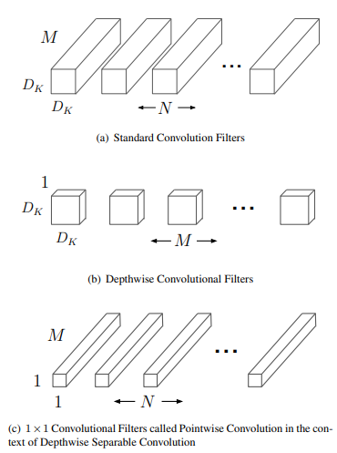
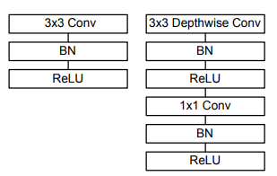
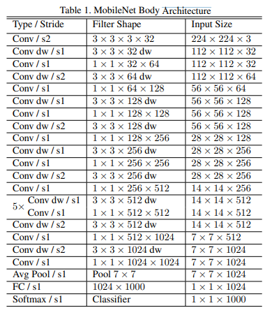

# MobileNet [Eng]

This article will break the idea and the results showed in the paper titled “MobileNets: Efficient Convolutional Neural Networks for Mobile Vision Applications” in a simple and intuitive words.

# I. Problem Definition:

Most of the powerful CNNs that were used for computer vision applications are computationally expensive and large in size; thus, they it's hard to deploy them on mobile phones or other lightweight devices. The authors of this paper handled this issue by introducing their model, named MobileNet. So in the following sections, we will discuss the methods that the authors of this paper used to handle these issues.

# II. Motivation & Idea:

### 2.1 Why MobileNets?

Deploying CNNs on a hand-sized device is heavily used in the mean time. However, back before the publication of this paper, this was not the case. The authors of this paper, had the impression that making deeper and larger models to increase the accuracy slightly, does not necessarily indicate efficiency. As these tiny improvements in the accuracy will lead to large and complex models in terms of size and computational cost. Doing this will hinder these models from being deployed in applications that run on computationally limited platforms. These applications include things like, robotics, self-driving cars, augmented reality applications, and the list goes on and on.

The CNN models' computational cost comes mostly from the convolution blocks (hereinafter referred to as conv block) in these models. Thus, it was time to investigate if there are other alternatives that can replace the standard conv blocks, while keeping the input and output features unchanged.

However, before going into the implementation details, let's dive into the details of the **"computational cost"** term first. 

### 2.2. Computational Cost of a Standard Conv Block:

In neural network models, the operation that is repeated through the whole model extensively is the **Mult-Add** operation (multiplication followed by addition). Therefore, researchers use this operation to figure out if a model is computationally expensive or not, by calculating how many Mult-Adds does a model have. So, let's find out how many Mult-Adds does a standard conv layer has.

![Figure 2. Standard convolution filter [1].](../../.gitbook/assets/66/Untitled_1.png)

The figure above shows one standard conv filter. As shown in the figure, applying that filter on the input, gives a 2D output feature map. However, in a standard conv block, there is usually a stack of **N** different feature maps, coming from **N** different conv filters that were applied on the same input. Thus, the output after these **N** conv filters is a 3D feature map (with depth equal to **N**).

Let's consider a case when we have an input of size $$D_{in}\times D_{in} \times C_{in}$$. And a conv filter with size ..$$D_{k}\times D_{k} \times M$$. Note that in a standard conv filter, the depth size of the filter must be the same as that of the input. And now assume that the output of this conv operation, is a 2D feature map with size $$D_{out}\times D_{out} \times1$$. So the number of Mult-Add operations in this case will be:

$$FLOPs=D_{out}^2\times D_k^2\times M$$

And if we applied the **N** filters as in the standard normal conv layers, then the Mult-Adds (FLOPs) will be:

$$FLOPs=D_{out}^2\times D_k^2\times M\times N$$

So this is the number of Mult-Adds in one conv block.

### 2.3. Related Work:

Prior to MobilNet, many papers tried to solve the problem of large size and high computational cost of CNNs. And these papers can be divided into two main categories:

1. **Training Small Netwroks:**
    
    One of the disadvantages of these methods, is that many of the papers published to train small networks, focused only on the size of the networks, while neglecting the speed. Training small networks can be achieved through many different approaches. One of them is "**Distillation**", which uses a large network (usually referred to as a teacher) to train a smaller network (usually referred to as a student). However, there are many other alternative methods that achieves a similar goal.
    
2. **Compressing Pretrained Networks:**
    
    This is done by shrinking, factorizing or compressing pretrained networks. And there are many techniques used to perform these tasks. Such as, product quantization, hashing, pruning, etc.
    

In addition, MobileNet uses a type of convolutional layers, called "**Depthwise Separable Convolutions**", that were introduced before MobileNet. They were also used in Inception model to reduce the computation in the early layers.

### 2.4. Idea:

The authors in this paper, came with a creative idea that will preserve the output size and use conv operations, while having a smaller number of Mult-Adds. The idea basically was to separate the conv operation into two operations. Therefore, the summation of Mult-Adds in these two operations should be less than that of the normal conv operation, in order for the authors to achieve their desired goal. These two operations are called **"Depthwise Convolution"** and **"Pointwise Convolution"**. In the following section, we will discuss this in more detail.

# III. Method:

### 3.1. Output Size

In their paper, the authors suggested the use of the Depthwise and Pointwise convolutional filters. As they claimed that this can reduce the computational complexity when compared to standard convolutional filters. So let's find out what do these terms actually mean.

1. **Depthwise Convolution:** it is just a fancy name for saying that instead of using a standard conv filter that has a size of $$D_{k}\times D_{k} \times M$$, we will use a conv filter with size $$D_{k}\times D_{k} \times 1$$. Which means that this filter will be applied only on one channel of the input. Thus, we need **M** of this filter, to cover all the channels of the input. And every one of these filters, will be applied only on one channel of the input.
2. **Pointwise Convolution:** This is just a $$1 \times 1$$ standard conv filter, that will be applied **N** times on the output of the Depthwise convolution stage.

So, let's now check the output of the two stages, Depthwise and Pointwise convs. Applying the Depthwise conv will give an output of $$D_{out}\times D_{out} \times M$$. Because every filter in the Depthwise, will be stacked on top of the previous one. And because the Pointwise conv is just a standard conv filter that is applied **N** times, then the output of the Pointwise filter is $$D_{out}\times D_{out} \times N$$. This is the same as applying a normal conv filter instead of these two filters!

### 3.2. Number of Mult-Adds in the Depthwise Separable Convolution:

1. **Mult-Adds in Depthwise Conv:** for one of these filters the Mult-Adds will be:

$$FLOPs=D_{out}^2\times D_k^2\times 1$$

But because it is repeated M times to cover the whole input's channel depth, then the total number will be:

$$FLOPs=D_{out}^2\times D_k^2\times M$$

1. **Mult-Adds in Pointwise Conv:** since it is just a standarad $$1 \times 1$$ conv filter that is applied on the output of the Depthwise conv, which is $$D_{k}\times D_{k} \times M$$. Then the number of FLOPs will be:

$$FLOPs=D_{out}^2\times M$$

However this one is applied N times, not just once, so the FLOPs will become:

$$FLOPs=D_{out}^2\times M \times N$$

So by combining these two stages**,** the total number of FLOPs will be:

$$FLOPs=D_{out}^2\times D_k^2\times M + D_{out}^2\times M \times N$$

$$=D_{out}^2\times M ( D_k^2+N)$$

### 3.3. Compare the Standard Convolution with the Depthwise separable Convolution:

To see if the computational cost of the Depthwise Separable conv is less than that of the standard conv or not, let's find the fraction that will result from dividing them:

$$\frac{FLOPs_{depthwise}}{FLOPs_{standard}}=\frac{D_{out}^2\times M ( D_k^2 + N)}{D_{out}^2\times D_k^2\times M\times N}=\frac{1}{D_k^2}+\frac{1}{N}$$

The previous fraction proves that MoibleNet blocks are indeed capable of reducing the computational cost heavily. To verify this more, we can test with a small example, where we will convert a standard conv block into a MobileNet conv block, and then observe the resultant fraction.

So, let’s consider a filter of size $$D_k=3$$ (as this is the most common size in CNNs) and an output channel size of $$N=512$$  (which is also common when going deep inside the last layers of a model). For this case we get the following:

$$Reduction Ratio = \frac{1}{3^2}+\frac{1}{512}\approx\frac{1}{9}$$

This means that the standard model’s computational cost is 9 times higher than that of MobileNet's!

Also the size of the parameters in the MobileNet is much smaller than that of the standard conv. This of course comes with a tradeoff. And that tradeoff is the accuracy of the predictions. MobileNet has lighter size and faster than the normal conv blocks; however, they are less accurate. Nonetheless, the accuracy drop is so small that it can be neglected for the added advantages of computational and size reductions.

### 3.4. Even Smaller Model!:

The authors have also included two hyperparameters that can reduce the computational cost and the number of trainable parameters in the model even more! However, these hyperparameters will change the size of the output feature map. And these hyperparameters are as follow:

1. **Width Multiplier $$\alpha$$:** In short, this is a number between 0 and 1 that gets multiplied by the number of filter **M** in the Depthwise conv, so that the number of filters become $$\alpha M$$. And it also gets multiplied by the number of filters in the Pointwise conv so that they become $$\alpha N$$.
2. **Resolution Multiplier $$\rho$$:** This is another number that is between 0 and 1, and this one gets multiplied by the input image. In other words, it means that the input image is resized by $$\rho$$.

So now the number of Mult-Adds will be:

$$FLOPs=D_k·D_k·αM·ρD_{out}·ρD_{out}+αM·αN·ρD_{out}·ρD_{out}$$

So roughly, the computational cost is reduced by $$\alpha^2\rho^2$$.

# IV. Experiment & Results:

The authors created a model that they named MobileNet, and it has the following architecture:

Where "Conv dw" stands for a Depthwise conv filter. And "s#" stands for a stride of #. As it can be seen from the architecture, the combination of "Conv dw" and the following "Conv" constitutes one Depthwise Separable conv block. The authors have also implemented the same model by replacing the Depthwise Separable conv blocks with a standard conv block. And then compared the number of parameters, FLOPs and performance of the two models on ImageNet dataset. And the results were as follow:

| Model  | ImageNet Accuracy | Million Mult-Adds  | Million Parameters |
| ------------- | ------------- | ------------- | ------------- |
| Conv MobileNet  | 71.7%  | 4866  | 29.3  |
| MobileNet  | 70.6%  | 569  | 4.2  |

In their paper, the authors showed that by using the hyperparameters that they introduced, namely $$\alpha$$ and $$\rho$$, the accuracy drops smoothly while the number of parameters and Mult-Adds in the model also drops significantly. The following table shows this in more details.

| Model  | ImageNet Accuracy | Million Mult-Adds  | Million Parameters |
| ------------- | ------------- | ------------- | ------------- |
| 1.0 MobileNet-224 |	70.6% |	569	| 4.2 |
| 0.75 MobileNet-224 |	68.4%	| 325 |	2.6 |
| 0.5 MobileNet-224	| 63.7% |	149 |	1.3 |
| 0.25 MobileNet-224 | 50.6% | 41 | 0.5 |
| 1.0 MobileNet-192	| 69.1% | 418 |	4.2 |
| 1.0 MobileNet-160 |	67.2%	| 290 |	4.2 |
| 1.0 MobileNet-128 |	64.4%	| 186	| 4.2 |

And the authors showed some applications working with their model (e.g. Fine Grained Recognition, Large Scale Geolocalizaton, Object Detection and Face Recognition )as shown below.

# V. Conclusion:

Neural networks are just as useful as how we can use them. And with the rising trends of getting larger and deeper networks, this can be a huge issue regarding the compatibility of these models on computationally limited devices. With the tweaks that were presented in MobileNet's paper, we can still use these large and powerful models. However, we need to trade some accuracy in return of thinner and computationally friendly networks. And the authors succeeded to show that the reduction in accuracy is not that much compared to the benefits that we can achieve by trading that small amount of accuracy!

# Take Home Message:

> High accuracies that come with complex and computationally extensive architectures, can usually be achieved with lighter architectures. This can be done by looking at the small details and tweaking them a bit, and this small change will result in a huge difference when applied to the whole architecture elements.
> 

# Author / Reviewer information

## Author

**Ahmed Magd**

- contact: a.magd@kaist.ac.kr
- MS student, Robotics, KAIST
- Research Interest: computer vision with robotics

## reviewer

1. Korean name (English name): Affiliation / Contact information
2. Korean name (English name): Affiliation / Contact information
3. ...

# Reference & Additional materials

Figure 1 taken from: [https://towardsdatascience.com/a-comprehensive-introduction-to-different-types-of-convolutions-in-deep-learning-669281e58215](https://towardsdatascience.com/a-comprehensive-introduction-to-different-types-of-convolutions-in-deep-learning-669281e58215)
