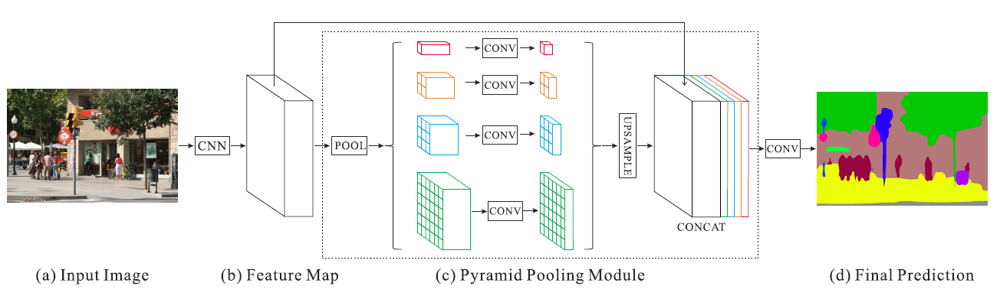
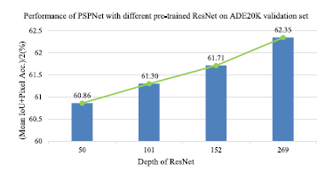
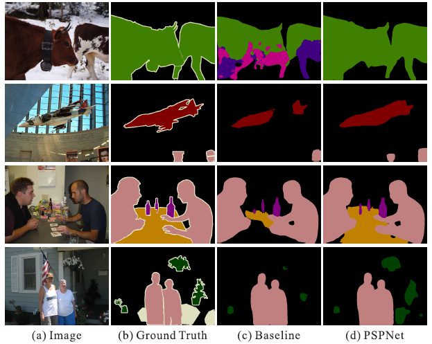

# Pyramid Scene Parsing Network [Korean]

[**English version**](cvpr-2017-pspnet-eng.md) of this article is available.

## 1. Problem definition

Semantic Segmentation은 알려진 객체에 대해서만 각 픽셀의 범주 라벨을 부여하는 것입니다. Semantic Segmentation을 기반으로 하는 Scene Parsing은 이미지 내 모든 픽셀의 카테고리 라벨을 부여하는 것입니다. 이것은 작업에 대한 차이점입니다. Semantic Segmentation이 알려진 개체의 범주 레이블만 제공하는 반면, Scene Parsing은 장면에 대한 완전한 이해를 제공합니다. 나아가 장면 파싱을 통해 각 요소의 위치와 모양을 예측할 수 있습니다. 

수학적으로 설명하면 입력 RGB 이미지 $$I^{\{W\times H\times 3\}}$$에 대해 모델은 확률 맵 $$P^{\{W\times H\times C\}}$를 예측합니다. 여기서 $$C$$는 예측할 클래스의 수를 의미합니다. 각 픽셀 값은 각 클래스에 대한 확률이며 $$I'^{\{W\times H\}}=\argmax(P^{\{W\times H\times C\}})$$는 각 픽셀의 최종 클래스를 부여하는 데 사용됩니다.

## 2. Motivation

PSPNet 이전의 state-of-the-art scene parsing 프레임워크는 대부분 fully convolution network(FCN)을 기반으로 합니다. 그러나 FCN은 여전히 다양한 장면에 대해 성능 저하의 어려움을 겪고 있습니다.

먼저 그림 1을 한번 보겠습니다

*그림 1. Scene parsing 문제점*

**관계 불일치**  그림 1의 첫 번째 행에서 볼 수 있듯이 FCN은 노란색 상자 안의 보트를 외관만 보고 자동차로 예측합니다. 이것은 모양과 외관 때문입니다. 그러나 모든 사람은 자동차가 물에 뜰 수 없다는 것을 잘 알고 있습니다. 장면에 대한 전체적인 맥락이 부족하면 오분류 가능성이 높아집니다. 네트워크가 컨텍스트에 대한 정보, 예를 들어 물체 *보트* 주변의 물이 있다는 정보를 얻을 수 있다면 올바르게 분류할 것입니다.

**범주의 혼동**  두 번째 줄은 빌딩의 범주가 고층 건물(마천루)로 쉽게 혼동되는 혼동 사례를 보여줍니다. 이들은 비슷한 외모를 가지고 있고 사람 또한 헷갈리기 쉬운 범주입니다. 이러한 결과는 전체 개체가 마천루 또는 빌딩 중 하나만의 범주를 가지도록 제외해야 합니다. 

**비가시성 객체**  장면에는 임의의 크기를 가진 개체/물건이 포함되어 있습니다. 신호등 및 간판과 같은 작은 물체는 꼭 인식되어야 하는 중요한 물체이지만 찾기가 어렵습니다. 반면에 큰 물체는 FCN의 receptive field를 넘어서 불연속적인 예측 결과를 낼 가능성이 있습니다. 세 번째 줄에서 보듯이 베개와 이불은 비슷한 모양을 하고 있습니다. 침대에 이불과 베개가 있다와 같은 장면에 대한 전체적인 범주를 간과한다면 베개를 인식하지 못할 수 있습니다.

위의 문제점을 요약하면 semantic segmentation에 있어서 대부분의 오류는 장면에 대한 전체적인 구성의 관계와 다양한 receptive field에 대한 전역 정보와 관련됩니다. 

### Related work

**Fully Convolutional Network for Semantic Segmentation[3]** 을 통해 scene parsing 및 semantic segmentation은 classification 문제에 있어서 fully connected layer를 대체하는 데 영감을 받아 큰 발전을 이뤘습니다. 그러나 FCN 기반 모델의 주요 문제는 그림 1의 첫 번째 행과 같이 장면에 대한 전체적인 정보를 활용하기 위한 적절한 방법이 없다는 것입니다.

신경망의 receptive field를 확장하기 위해 **Multi-Scale Context Aggregation by Dilated Convolutions[4]** 은 receptive field를 증가시키는 데 도움이 되는 dilated convolution을 사용했습니다. 이 확장된 컨볼루션 레이어는 제안된 네트워크 backbone의 마지막 두 블록에 배치됩니다. 그림 2에서 dilated convolution이 일반적인 convolution과 어떻게 다르게 작동하는지 보여줍니다. Dilated convolution에 대한 receptive field가 표준 convolution에 비해 더 크므로 훨씬 더 많은 장면에 대한 정보를 볼 수 있습니다.

*그림 2(a). Dilated convolution*

*그림 2(b). Normal convolution*

**Semantic Image Segmentation with Deep Convolutional Nets and Fully Connected CRFs[5]** 에서는 segmentation 결과를 개선하기 위한 후처리로 conditional random field(CRF)를 사용했습니다. 이것은 예측된 semantic 경계가 객체에 맞는 scene parsing의 localization 능력을 향상시킵니다. 그러나 복잡한 장면에서 필요한 정보를 어떻게 활용할지에 대한 문제는 여전히 남아있습니다.

**ParseNet[6]** 은 FCN을 사용한 global average pooling이 semantic segmentation 결과를 향상시킨다는 것을 입증했습니다. 아이디어는 그림 3과 같이 마지막 계층에서 분류 작업의 각 해당 범주에 대해 하나의 feature 맵을 생성하는 것입니다. 그러나 이 논문의 실험은 이러한 global descriptor가 까다롭고 복잡한 ADE20K 데이터를 충분히 대표하지 않는다는 것을 보여줍니다.

*그림 3. Illustration of global average pooling.*

공간적 정보 분포가 좋은 descriptor를 제공하는 Spatial pyramid pooling이 scene parsing에 위한 널리 사용되었습니다. **Spatial Pyramid Pooling network[7]** 을 통해 그 성능을 향상시킬 수 있습니다. 

### Idea

이 논문은 네트워크가 더 많은 장면에 대한 정보에 대해 더 큰 receptive field를 갖도록 dilated convolution과 함께 FCN을 사용합니다. 이 dilated convolution 레이어는 backbone의 마지막 두 블록에 배치됩니다. 따라서 백본의 끝에서 추출된 feature는 더 다양한 feature 정보를 포함합니다. 

Global average pooling은 전체적인 사전 정보를 제공하는 좋은 baseline 모델입니다. 하지만 이러한 방법은 픽셀이 많은 물건과 개체에 대해 라벨이 달린 복잡한 이미지에서 필요한 정보를 다루기에 충분하지 않습니다. 전체 이미지에 대한 feature를 한번에 합하여 하나의 벡터를 형성하면 공간적 관계가 손실되고 모호성이 발생할 수 있습니다. 이와 관련하여 sub-region 정보와 함께 전체적인 정보는 다양한 객체를 구분하는 데 도움이 됩니다. 이를 위해 본 논문에서는 gloabl pooling과 달리 Pyramid Scene Parsing Network를 통해 여러 분할 기반 정보 추출을 통해 전체 이미지 정보의 기능을 활용합니다.

**Spatial Pyramid Pooling Network[7]** 에서 pyramid pooling에 의해 생성된 다양한 레벨의 feature 맵은 최종적으로 벡터화되어 분류를 위해 fully connected layer에 공급됩니다. 서로 다른 하위 이미지 영역 간의 context 정보를 더욱 향상시키기 위해, 이 논문에서는 서로 다른 규모의 정보를 포함하고 서로 다른 하위 이미지 영역에 따라 다양한 계층적인 전역 정보를 제안합니다.

## 3. Method

*그림 4. Overview of PSPNet.*

제안된 PSPNet의 개요는 그림 4와 같습니다. 먼저 입력 이미지(a)가 주어지면 네트워크는 CNN을 통하여 마지막 컨볼루션 레이어(b)의 특징 맵을 얻게 됩니다. 여기서 PSPNet은 dilated 네트워크 전략과 함께 pre-trained ResNet 모델을 사용하여 feature 맵을 추출합니다. 최종적으로 추출된 feature 맵의 크기는 입력 이미지의 1/8입니다. 이어서 pyramid parsing module을 적용하여 각각의 서로 다른 하위 이미지 영역 표현을 얻은 다음 upsampling 및 결합하여 최종적인 feature representation을 형성합니다. 이 레이어는 (c)에서 로컬 및 글로벌 context 정보를 모두 전달합니다. 마지막으로, 최종 픽셀 단위 예측(d)을 얻기 위해 이 feature map에 컨볼루션이 적용됩니다.

### 3.1. Pyramid Pooling Modul

Pyramid pooling module은 CNN에서 추출한 feature를 4개의 다른 피라미드 스케일을 하나로 결합합니다. 빨간색으로 표시된 가장 대략적인 스케일은 global average pooling과 마찬가지로 단일 bin 출력을 생성하는 global pooling입니다. 다음 스케일에서는 feature 맵을 4개의 하위 영역으로 나누고 노란색으로 표시된 $$2\times2$$ pooling된 정보를 형성합니다. 다음 스케일은 각각 $$3\times3$$, $$6\times6$$ pooling을 형성합니다. 본 논문에서 피라미드 pyramid pooling은 $$1\times1$$, $$2\times2$$, $$3\times3$$ 및 $$6\times6$$의 bin 크기를 갖는 모듈들로 구성되어 있습니다. max와 average 사이의 pooling 연산 유형에 대해서는 섹션 4의 실험에서 차이를 보여줍니다. Global 피처의 가중치를 유지하기 위해 각 피라미드 레벨에 $$1\times1$$ 컨볼루션을 적용하여 차원을 $$1/N$$ 줄입니다. 여기서 $$N$$는 피라미드의 레벨 크기입니다. 그런 다음 차원이 감소된 각각의 pyramid 피처 맵에 bilinear interpolation을 사용한 upsampling을 적용하여 원본 피처 맵과 동일한 크기의 피처 맵을 얻습니다. 마지막으로 다양한 스케일의 피처가 최종 피라미드 풀링 글로벌 피처로 연결됩니다.

### 3.2. Network Architecture

그림 4(a)의 입력 이미지가 주어지면 dilated 네트워크에 더하여 pre-trained ResNet 모델을 사용하여 피처 맵을 추출합니다. 추출된 피처 맵의 크기는 입력 이미지의 $$1/8$$입니다. 그런 다음 섹션 3.1에 설명된 대로 글로벌 context 정보를 수집하기 위해 pyramid pooling module이 뒤에 추가됩니다. 4단계의 피라미드를 사용하여 pooling 커널은 장면 이미지에 대해 전체, 절반 및 일부를 커버할 수 있습니다. 그런 다음 이러한 pooling 커널들은 원본 피처 맵과 연결되어 전역 context 정보가 있는 전체 피처를 형성합니다. 마지막으로 컨볼루션 레이어를 적용하여 최종 예측 맵을 생성합니다.

### 3.3. Deep Supervision for ResNet-Based FCN

*그림 5. Illustration of auxiliary loss in ResNet101.*

최종 classfier를 학습하기 위해 softmax loss를 사용하는 메인 브랜치와는 별도로, 네 번째 단계 이후에 또 다른 classfier가 적용됩니다. 이러한 deeply supervised ResNet101 모델의 예가 그림 5에 나와 있습니다. 이 auxiliary loss는 메인 모델의 성능을 유지하며 학습 프로세스를 최적화하는 데 도움이 됩니다.

## 4. Experiment & Result

### Experimental Setup

### 4.1. Implementation Details

**DeepLab[8]** 에서 영감을 받은 PSPNet은 $$lr=base\_lr(1-{iter\over maxiter})^{power}$$로 설명된 "poly" learning rate scheduler를 사용합니다. 여기에서 기본 학습률은 $$0.01$$로 설정되고 $$power$$는 $$0.9$$로 설정됩니다. 모멘텀 및 weight decay는 각각 $$0.9$$ 및 $$0.0001$$로 설정됩니다. Data augmentation을 위해 랜덤 미러 및 0.5와 2 사이의 랜덤 크기 조정, $$-10$$와 $$10$$ 사이의 랜덤 회전, ImageNet 및 PASCAL VOC 데이터셋에 대한 랜덤 가우시안 필터가 적용됩니다. PSPNet은 **DeepLab[8]** 에서 소개된 대로 dilated 컨볼루션을 포함합니다. $$16$$의 Batchsize를 사용하였으며, auxiliary loss에 대해서는 실험을 통해 가중치를 $$0.4$$로 설정하였습다.

### 4.2. ImageNet Scene Parsing Challenge 2016

The ADE20K dataset is used in ImageNet scene parsing challenge 2016. ADE20K is challenging for the up to 150 classes and diverse scenes with a total of 1,038 image-level labels. For evaluation, both pixel-wise accuracy (Pixel Acc.) and mean of class-wise intersection over union (Mean IoU) are used.

| Method                	| Mean IoU(%) 	| Pixel Acc.(%) 	|
|-----------------------	|:-----------:	|:-------------:	|
| ResNet50-Baseline     	| 37.23       	| 78.01         	|
| ResNet50+B1+MAX       	| 39.94       	| 79.46         	|
| ResNet50+B1+AVE       	| 40.07       	| 79.52         	|
| ResNet50+B1236+MAX    	| 40.18       	| 79.45         	|
| ResNet50+B1236+AVE    	| 41.07       	| 79.97         	|
| ResNet50+B1236+MAX+DR 	| 40.87       	| 79.61         	|
| ResNet50+B1236+AVE+DR 	| 41.68       	| 80.04         	|

*Table 1. Baseline is ResNet50-based FCN with dilated network. 'B1' and 'B1236' denote pooled feature maps of bin sizes $$\{1\times 1\}$$ and $$\{1\times 1,2\times 2,3\times 3,6\times6\}$$ respectively. MAX represent max pooling, AVE average pooling, and DR dimension reduction with $$1\times 1$$ convolution after pooling. The results are tested on the validation set with the single-scale input.*

### Result

**Ablation Study for Pooling**  To evaluate PSPNet, the author conduct experiments with several settings, including pooling types of max and average, pooling with just one global feature or four-level features, with and without dimension reduction after the polling operation and before concatenation. As listed in Table 1, in terms of pooling, average works better. Pooling with four-level features outperforms that with global feature. The best setting is four-level pyramid of average pooling, followed by dimension reduction with $$1\times1$$ convolution. 

| Loss Weight α | Mean IoU(%) | Pixel Acc.(%) |
|:-----------------------------------------	|:-----------:	|:-------------:	|
| ResNet50 (without AL) | 35.82 | 77.07 |
| ResNet50 (with α = 0.3) | 37.01 | 77.87 |
| ResNet50 (with α = 0.4) | **37.23** | **78.01** |
| ResNet50 (with α = 0.6) | 37.09 | 77.84 |
| ResNet50 (with α = 0.9) | 36.99 | 77.87 |

*Table 2. Performance with various auxiliary loss weight.*

**Ablation Study for Auxiliary Loss**  The auxiliary loss helps optimize the learning process while not influencing learning in the master branch. Table 2. shows experiment result with different settings of auxiliary loss weight $$\alpha$$ and $$\alpha=0.4$$ yields the best performance. 

*Figure 6. Performance grows with deeper networks.*

| Method | Mean IoU(%) | Pixel Acc.(%) 	|
|:-----------|------------|-----------	|
| PSPNet(50) | 41.68 | 80.04           	|
| PSPNet(101) | 41.96 | 80.64          	|
| PSPNet(152) | 42.62 | 80.80          	|
| PSPNet(269) | **43.81** | **80.88**          	|
| PSPNet(50)+MS | 42.78 | 80.76        	|
| PSPNet(101)+MS | 43.29 | 81.39       	|
| PSPNet(152)+MS | 43.51 | 81.38       	|
| PSPNet(269)+MS | **44.94** | **81.69**       	|

*Table 3. Deeper pre-trained model gets higher performance.*

**Ablation Study for Pre-trained Model**  To further analyze PSPNet, experiments for different depths of pre-trained ResNet have been conducted. As shown in Fig. 6, deeper pre-trained model get higher performance. The multi-scale testing helps to improve the results as well, listed in Table 3. 

| Method| Mean IoU(%) |Pixel Acc.(%)   	|
|:------|-------------|-----------------	|
| FCN | 29.39| 71.32               	|
| SegNet | 21.64| 71.00             	|
| DilatedNet | 32.31| 73.55        	|
| CascadeNet | 34.90| 74.52        	|
| ResNet50-Baseline | 34.28 | 76.35      	|
| ResNet50+DA | 35.82 | 77.07            	|
| ResNet50+DA+AL | 37.23 | 78.01         	|
| ResNet50+DA+AL+PSP | **41.68** | **80.04**     	|
| ResNet269+DA+AL+PSP | 43.81 | 80.88    	|
| ResNet269+DA+AL+PSP+MS | **44.94** | **81.69** 	|

*Table 4. 'DA' refers to data augmentation, 'AL' denotes the auxiliary loss.*

More Detailed Performance Analysis  Table 4. shows more detailed analysis on the validation set of ADE20K. The baseline is adapted from ResNet50 with dilated network. "ResNet269+DA+AL+PSP+MS" achieves highest performance among them.

| Method | aero | bike| bird| boat| bottle| bus| car| cat| chair| cow |table |dog |horse| mbike| person |plant |sheep |sofa |train |tv |mIoU     	|
|:--------|------|-----|-----|-----|-------|----|----|----|------|-----|------|----|-----|------|--------|------|------|-----|------|---|-------	|
| FCN|  76.8| 34.2| 68.9| 49.4| 60.3| 75.3| 74.7| 77.6| 21.4| 62.5 |46.8| 71.8| 63.9| 76.5| 73.9| 45.2| 72.4| 37.4| 70.9 |55.1| 62.2       	|
| Zoom-out | 85.6| 37.3| 83.2| 62.5 |66.0| 85.1 |80.7| 84.9| 27.2 |73.2 |57.5 |78.1 |79.2 |81.1 |77.1| 53.6 |74.0 |49.2| 71.7 |63.3| 69.6  	|
| DeepLab  |84.4| 54.5| 81.5| 63.6| 65.9| 85.1| 79.1| 83.4| 30.7| 74.1| 59.8| 79.0| 76.1| 83.2| 80.8| 59.7| 82.2| 50.4| 73.1| 63.7| 71.6    	|
| CRF-RNN | 87.5| 39.0| 79.7| 64.2| 68.3| 87.6| 80.8| 84.4| 30.4| 78.2| 60.4| 80.5| 77.8| 83.1| 80.6| 59.5| 82.8| 47.8| 78.3 |67.1 |72.0   	|
| DeconvNet|  89.9| 39.3| 79.7| 63.9| 68.2| 87.4| 81.2| 86.1| 28.5| 77.0| 62.0| 79.0| 80.3| 83.6| 80.2| 58.8| 83.4| 54.3| 80.7| 65.0| 72.5 	|
| GCRF|  85.2| 43.9| 83.3| 65.2| 68.3| 89.0| 82.7| 85.3| 31.1| 79.5| 63.3| 80.5| 79.3| 85.5| 81.0| 60.5| 85.5| 52.0| 77.3| 65.1| 73.2      	|
| DPN | 87.7| 59.4| 78.4| 64.9| 70.3| 89.3| 83.5| 86.1| 31.7| 79.9| 62.6| 81.9| 80.0| 83.5| 82.3| 60.5| 83.2| 53.4| 77.9| 65.0| 74.1       	|
| Piecewise | 90.6 |37.6| 80.0| 67.8| 74.4| 92.0| 85.2| 86.2| 39.1 |81.2| 58.9| 83.8| 83.9| 84.3| 84.8| 62.1| 83.2| 58.2| 80.8| 72.3| 75.3 	|
| PSPNet| **91.8**| **71.9**| **94.7**| **71.2**| **75.8**| **95.2**| **89.9**| **95.9**| **39.3**| **90.7**| **71.7**| **90.5**| **94.5**| **88.8**| **89.6**| **72.8**| **89.6**| **64.0**| **85.1**| **76.3**| **82.6**         	|
| CRF-RNN†  |  90.4| 55.3| 88.7| 68.4| 69.8| 88.3| 82.4| 85.1| 32.6| 78.5| 64.4| 79.6| 81.9| 86.4| 81.8| 58.6| 82.4| 53.5| 77.4| 70.1| 74.7           	|
| BoxSup†|  89.8| 38.0| 89.2| 68.9| 68.0| 89.6| 83.0| 87.7| 34.4| 83.6| 67.1| 81.5| 83.7| 85.2| 83.5| 58.6| 84.9| 55.8| 81.2| 70.7| 75.2            	|
| Dilation8†|  91.7| 39.6| 87.8| 63.1| 71.8| 89.7| 82.9| 89.8| 37.2| 84.0| 63.0| 83.3| 89.0| 83.8| 85.1| 56.8| 87.6| 56.0| 80.2| 64.7| 75.3           	|
| DPN†|  89.0| 61.6| 87.7| 66.8| 74.7| 91.2| 84.3| 87.6| 36.5| 86.3| 66.1| 84.4| 87.8| 85.6| 85.4| 63.6| 87.3| 61.3| 79.4| 66.4| 77.5           	|
| Piecewise†|  94.1| 40.7| 84.1| 67.8| 75.9| 93.4| 84.3| 88.4| 42.5| 86.4| 64.7| 85.4| 89.0| 85.8| 86.0| 67.5| 90.2| 63.8| 80.9| 73.0| 78.0           	|
| FCRNs†|  91.9| 48.1| 93.4| 69.3| 75.5| 94.2| 87.5| 92.8| 36.7| 86.9| 65.2| 89.1| 90.2| 86.5| 87.2| 64.6| 90.1| 59.7| 85.5| 72.7| 79.1           	|
| LRR†|  92.4| 45.1| 94.6| 65.2| 75.8| **95.1**| 89.1| 92.3| 39.0| 85.7| 70.4| 88.6| 89.4| 88.6| 86.6| 65.8| 86.2| 57.4| 85.7| 77.3| 79.3            	|
| DeepLab†|  92.6| 60.4| 91.6| 63.4| 76.3| 95.0| 88.4| 92.6| 32.7| 88.5| 67.6| 89.6| 92.1| 87.0| 87.4| 63.3| 88.3| 60.0| 86.8| 74.5| 79.7            	|
| PSPNet†| **95.8**| **72.7**| **95.0**| **78.9**| **84.4**| 94**| **92.0**| **95.7**| **43.1**| **91.0**| **80.3**| **91.3**| **96.3**| **92.3**| **90.1**| **71.5**| **94.4**| **66.9**| **88.8**| **82.0**| **85.4**        	|

*Table 5. Per-class results on PASCAL VOC 2012 testing set. Methods pre-trained on MS-COCO are marked with '$$\dag$$'.*

Table 5. shows results compared to previous best-performing methods on the PASCAL VOC 2012 dataset, with or without pre-training on MS-COCO dataset. PSPNet outperforms prior methods on both settings, especially getting the highest accuracy on all 20 classes without pre-trained. Several examples are shown in Fig. 7. The baseline model treats "cows" in first row as "horse" and "dog" while PSPNet corrects these errors. For "aeroplane" and "table" in the second and third row, PSPNet finds missing parts. For "person", "bottle" and "plant" in following rows, PSPNet performs well on these small-size object classes in the images compared to the baseline model.

*Figure 7. Visual improvements on PASCAL VOC 2012 data.*

| Method | IoU cla.| iIoU cla.| IoU cat.| iIoU cat. 	|
|---------|---------|---------|---------|----------	|
| CRF-RNN | 62.5| 34.4| 82.7| 66.0             	|
| FCN | 65.3| 41.7| 85.7| 70.1                 	|
| SiCNN | 66.3| 44.9| 85.0| 71.2               	|
| DPN | 66.8| 39.1| 86.0| 69.1                 	|
| Dilation10 | 67.1| 42.0| 86.5| 71.1          	|
| LRR | 69.7| 48.0| 88.2| 74.7                  	|
| DeepLab | 70.4| 42.6| 86.4| 67.7              	|
| Piecewise | 71.6| 51.7| 87.3| 74.1           	|
| PSPNet| **78.4**| **56.7**| **90.6**| **78.6**                   	|
| LRR‡| 71.8| 47.9| 88.4| 73.9                      	|
| PSPNet‡| **80.2**| **58.1**| **90.6**| **78.2**                  	|

*Table 6. Results on Cityscapes testing sets.*

Cityscapes is dataset for semantic urban scene understanding with 19 categories. Also, 20,000 coarsely annotated images are provided for two settings in comparison, that is training with only fine data or with both the fine and coarse data. Methods trained using both fine and coarse data are marked with '$$\ddag$$'. Here the base model is ResNet101 as in DeepLab[4] for fair comparison. Table 6. show that PSPNet outperforms other methods with significant advantage. Several examples are shown in Fig. 8.

*Figure 8. Examples of PSPNet results on Cityscapes dataset.*

## 5. Conclusion

This paper's main contributions are threefold:

- Proposes a pyramid scene parsing network to embed difficult scenery context features in an FCN based pixel prediction framework.
- Develops an effective optimization strategy for deep ResNet based on deeply supervised loss (auxiliary loss).
- Builds a practival system for state-of-the-art scene parsing and semantic segmentation with all crucial implementation details included.

Several experiments on different datasets show that PSPNet achieves the state-of-the-art performance compared to contemporary methods. However, PSPNet itself is just an encoder, which means it is just half of what is required for image segmentation. Future work could include working on decoder that is suitable for pyramid pooling module.

### Take home message (오늘의 교훈)

> This paper emphasizes the importance of global scene context for image segmentation.
> 

## Author / Reviewer information

### Author

**신주엽 (Juyeb Shin)**

- KAIST
- Research interest in computer vision, especially semantic visual SLAM
- [juyebshin.notion.site](http://juyebshin.notion.site)

### Reviewer

1. Korean name (English name): Affiliation / Contact information
2. Korean name (English name): Affiliation / Contact information
3. …

## Reference & Additional materials

1. H. Zhao, J. Shi, X. Qi, X. Wang and J. Jia, "Pyramid Scene Parsing Network," 2017 IEEE Conference on Computer Vision and Pattern Recognition (CVPR), 2017, pp. 6230-6239, doi: 10.1109/CVPR.2017.660.
2. [Official GitHub repository](https://github.com/hszhao/PSPNet)
3. J. Long, E. Shelhamer, and T. Darrell. Fully convolutional networks for semantic segmentation. In CVPR, 2015.
4. F. Yu and V. Koltun. Multi-scale context aggregation by dilated convolutions. arXiv:1511.07122, 2015.
5. L. Chen, G. Papandreou, I. Kokkinos, K. Murphy, and A. L. Yuille. Semantic image segmentation with deep convolutional nets and fully connected crfs. arXiv:1412.7062, 2014.
6. W. Liu, A. Rabinovich, and A. C. Berg. Parsenet: Looking wider to see better. arXiv:1506.04579, 2015.
7. J. Dai, K. He, and J. Sun. Boxsup: Exploiting bounding boxes to supervise convolutional networks for semantic segmentation. In ICCV, 2015.
8. L. Chen, G. Papandreou, I. Kokkinos, K. Murphy, and A. L. Yuille. Deeplab: Semantic image segmentation with deep convolutional nets, atrous convolution, and fully connected crfs. arXiv:1606.00915, 2016
