# SRResNet and SRGAN \[Eng\]

##  1. Problem Definition

Recent convolutional neural networks (CNN) being employed to address super-resolution (SR) problems have become both faster and deeper. These networks usually minimize the pixel-wise mean squared error (MSE) between the SR image and the ground truth, producing high peak signal-to-noise ratio (PSNR) and structural similarity index measure (SSIM) values. Despite this, the models usually face difficulty recovering finer texture details and the resulting SR images are not perceptually appealing (as evident in the figure below). To address this problem, the authors of this paper proposed a new architecture that can super-resolve low resolution (LR) images with $${4\times}$$ upscaling factor and, at the same time, recover high-frequency details.

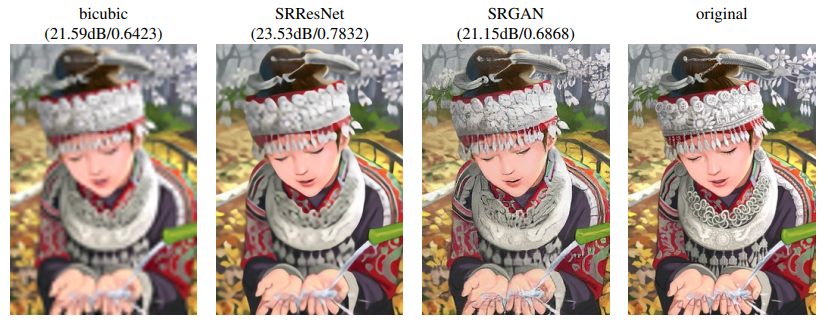

## 2. Motivation

### Related Work

Early approaches in tackling the SR problem involves filtering methods like linear, bicubic, and Lanczos filtering [2]. However, despite being fast, they produce SR images with overly smooth textures.

CNN-based single image super resolution (SISR) recently gained attention because it showed superior performance over the traditional methods of upscaling. One prominent network, described in [3], upscaled images using bicubic interpolation and trained a CNN to produce state-of-the-start SR outputs. Additionally, in [4], better performance is observed when networks are allowed to learn their own upscaling filters. And in order to produce visually convincing results, this paper relied heavily on the loss functions in [5] and [6].

### Idea

This paper proposes a deep network architecture for $${4\times}$$ upscaling of LR images—the SRResNet which used residual blocks and skip-connections. The model learns its own upscaling filters and is trained using the MSE loss.

Further, a novel perceptual loss (combination of the content loss and adversarial loss) is used in this paper in order to train the SRGAN. The MSE-trained SRResNet serves as the generator network for the GAN training.

## 3. Method

This paper exploits the GAN-based approach to tackle the SR task. They train a generator G to produce realistic SR images that can trick a discriminator D. Using this method, the generator learns to create realistic SR images that the discriminator will find difficult to differentiate from real HR images. The architectures of the generator and discriminator are explained below.

### SRResNet / Generator

The proposed SRResNet contains 16 residual blocks. Each residual block has two convolutional layers that used 64 $${3\times3}$$ filters. Batch normalization (BN) followed the two convolutional layers and a Parametric ReLU layer is used after the first BN. Each residual block has a skip-connection. The figure below shows the SRResNet architecture.

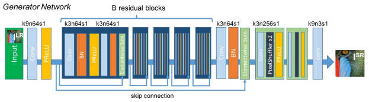

In order to achieve $${4\times}$$ upscaling, two sub-pixel layers, each with an upscaling factor of 2, are added at the end of the network. What this sub-pixel layer does is it rearranges an input with a dimension of $${({*}, C\times{r^{2}}, H, W)}$$ to a tensor with a dimension of $${({*}, C, H\times{r}, W\times{r})}$$. Here, $${r}$$ is the upscaling factor. Refer to [8] for a more detailed explanation of the sub-pixel layer. The figure below shows how the sub-pixel layer performs upsampling.

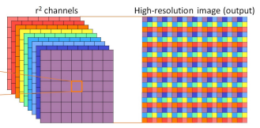

### Discriminator

A discriminator is also trained to solve the maximization problem. Instead of the Parametric ReLU used in the generator, the Leaky ReLU (with $${\alpha=0.2}$$) is chosen as non-linearity in this network. Its convolutional layers used $${3\times3}$$ filters, doubling the number of kernels for every layer of convolution starting from 64 up to 512. Strided convolutions are used to reduce the image size instead of pooling layers. The network is then terminated by two dense layers and a sigmoid function to determine whether the image is the original HR or generated SR. The figure below shows the architecture of the discriminator network used in the paper.

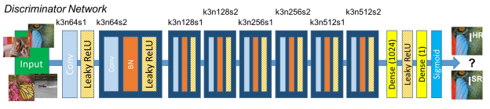

### Loss Functions

A novel perceptual loss function, which is the combination of the content loss and adversarial loss, is defined in this paper. The MSE loss is used as the content loss for the SRResNet while the VGG loss is exploited for the SRGAN. Further, the adversarial loss is introduced only in the GAN training. The expression for the perceptual loss is given by:

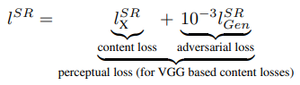

#### Content Loss

##### *MSE Loss*

For the SRResNet architecture, the authors use the MSE loss. However, although it achieved higher PSNR and SSIM values, this loss generated blurry SR images, i.e. the images lack finer details. The MSE loss is shown below.

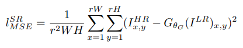

##### *VGG Loss*

The VGG loss puts more importance on the perceptual instead of the pixel space similarity. The VGG loss is shown below where $${\phi_{i,j}}$$ is the *j*-th convolution (after activation) before the *i*-th maxpooling layer of the VGG19 network.

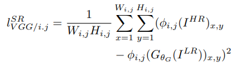

#### Adversarial Loss

Finally, the discriminator network is trained to tell the difference between the generated SR and the HR images using the adversarial loss shown below.

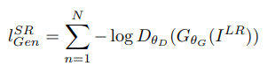

### Evaluation Metrics

In this paper, the PSNR and SSIM metrics are used to quantitatively evaluate the SR images. An explanation of these values is given below.

#### Peak Signal-to-Noise Ratio (PSNR)

The PSNR is used to measure the numerical difference between two images. A higher PSNR value implies better image quality. On the contrary, a small PSNR score means the two images are numerically distant from one another.

Suppose we have an HR image $${f}$$ and a corresponding SR image $${g}$$ with the same dimension $${M\times{N}}$$, the PSNR is given by:

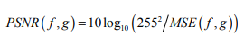

where

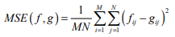

#### Structural Similarity Index Measure (SSIM)

Similar to PSNR, SSIM measures the similarity of two images and its value is between 0 to 1. A score close to 1 means the images are more similar with one another. A score closer to 0 means the images are less correlated. The SSIM is a combination of three factors, namely, the loss of correlation, luminance distortion, and contrast distortion. In [7], SSIM is defined as:

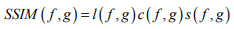

where

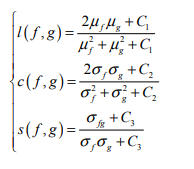

The first term $${l(f,g)}$$ is called the luminance comparison function and it measures how close the mean luminance ($${\mu_{f}}$$ and $${\mu_{g}}$$) of the two images are. The second term $${c(f,g)}$$ is called the contrast comparison function and it measures how close the contrast $${\sigma_{f}}$$ and $${\sigma_{g}}$$ (measured by the standard deviation) of the two images are. Finally, the third term $${s(f,g)}$$ is called the structure comparison function and it measures the correlation coefficient between the two images. $${C_{1}}$$, $${C_{2}}$$, and $${C_{3}}$$ are introduced to avoid division by 0.

## 4. Experiment & Results

### Experimental setup

The authors randomly selected 350 thousand images from the ImageNet dataset and downscaled them with a scale of 4 using bicubic interpolation to obtain LR images. Adam optimizer is used with a learning rate of 10-4 and each mini-batch of training consists of 16 random 96 x 96 patches generated from the training images. The authors employ an NVIDIA Tesla M40 GPU to train their model.

The MSE-based SRResNet is used as a generator for the GAN training after being trained. The learning rate is 10-4 for the first 105 iterations and 10-5 for next 105 iterations.

The performance of the proposed architecture is measured by comparing the PSNR and SSIM values of the SRResNet, SRGAN, nearest neighbor, bicubic, SRCNN, SelfExSR, DRCN, and ESPCN on the Set5, Set14, and BSD100 datasets. Further, by asking 26 people to rate the SR images, mean opinion score (MOS) test is performed to quantify how convincing the outputs are.

### Results

The SRResNet with MSE loss recorded the highest PSNR and SSIM values as shown in the figure below.

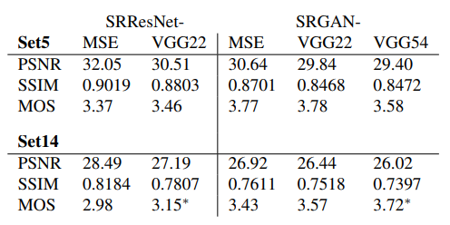

However, the SRGAN obtained higher MOS amongst all the given SR methods. The details are shown in the table below.

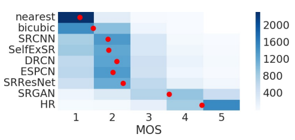

The next table shows the comparison in the PSNR, SSIM, and MOS of the SRResNet and SRGAN with other SR methods. Note that the SRResNet outperformed the other methods in terms of PSNR, SSIM, and MOS that are existing at the time.

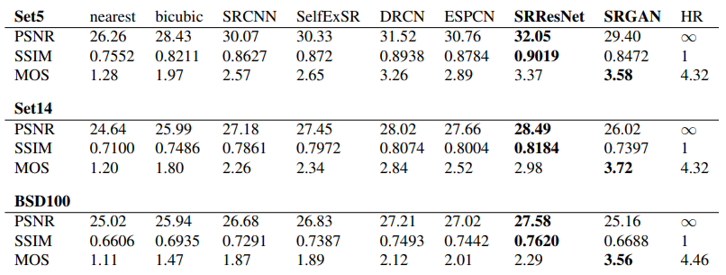

Reconstruction results are provided in the figure below. Notice that the SRGAN-VGG54 managed to retrieve better texture details.

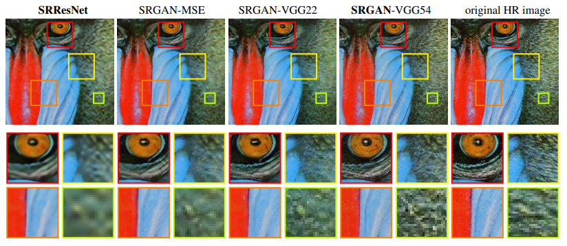

## 5. Conclusion

In conclusion, the authors successfully designed, built, and trained a network that can super-resolve LR images with $${4\times}$$ upscaling factor. The SRResNet obtained state-of-the-art PSNR and SSIM values for the SR images it produced while the SRGAN, although it recorded relatively lower PSNR and SSIM values compared to the former, obtained higher MOS. The SRResNet produced blurry SR images due to its MSE loss while the SRGAN, with its perceptual loss, managed to super-resolve more photo-realistic images.

### Take Home Message

> Despite producing smaller PSNR and SSIM values than the SRResNet, the SRGAN can generate more realistic and perceptually appealing SR images.

## Author / Reviewer Information

### Author

**Samuel Teodoro** 

* KAIST
* Email: sateodoro@kaist.ac.kr

### Reviewer

1. Korean name \(English name\): Affiliation / Contact information
2. Korean name \(English name\): Affiliation / Contact information
3. Korean name \(English name\): Affiliation / Contact information

## Reference & Additional Materials

1. C. Ledig, L. Theis, F. Huszar, J. Caballero, A. Cunningham, A. Acosta, A. Aitken, A. Tejani, J. Totz, Z. Wang, et al. Photorealistic single image super-resolution using a generative adversarial network. In Proceedings of the IEEE Conference on Computer Vision and Pattern Recognition, pages 4681–4690, 2017. ([link](https://arxiv.org/pdf/1609.04802.pdf))
2. C. E. Duchon. Lanczos Filtering in One and Two Dimensions. In Journal of Applied Meteorology, volume 18, pages 1016–1022. 1979. ([link](https://journals.ametsoc.org/view/journals/apme/18/8/1520-0450_1979_018_1016_lfioat_2_0_co_2.xml))
3. C. Dong, C. C. Loy, K. He, and X. Tang. Learning a deep convolutional network for image super-resolution. In European Conference on Computer Vision (ECCV), pages 184–199. Springer, 2014. ([link](https://arxiv.org/pdf/1501.00092.pdf))
4. W. Shi, J. Caballero, F. Huszar, J. Totz, A. P. Aitken, R. Bishop, D. Rueckert, and Z. Wang. Real-Time Single Image and Video Super-Resolution Using an Efficient Sub-Pixel Convolutional Neural Network. In IEEE Conference on Computer Vision and Pattern Recognition (CVPR), pages 1874–1883, 2016. ([link](https://arxiv.org/pdf/1609.05158.pdf))
5. J. Johnson, A. Alahi, and F. Li. Perceptual losses for real-time style transfer and super-resolution. In European Conference on Computer Vision (ECCV), pages 694–711. Springer, 2016. ([link](https://arxiv.org/pdf/1603.08155.pdf))
6. J. Bruna, P. Sprechmann, and Y. LeCun. Super-resolution with deep convolutional sufficient statistics. In International Conference on Learning Representations (ICLR), 2016. ([link](https://arxiv.org/pdf/1511.05666.pdf))
7. A. Horé and D. Ziou, "Image Quality Metrics: PSNR vs. SSIM," 2010 20th International Conference on Pattern Recognition, 2010, pp. 2366-2369, doi: 10.1109/ICPR.2010.579. ([link](https://ieeexplore.ieee.org/document/5596999))
8. W. Shi, J. Caballero, F. Huszar, J. Totz, A. P. Aitken, R. Bishop, D. Rueckert, and Z. Wang. Real-Time Single Image and Video Super-Resolution Using an Efficient Sub Pixel Convolutional Neural Network. In IEEE Conference on Computer Vision and Pattern Recognition (CVPR), pages 1874–1883, 2016. ([link](https://arxiv.org/pdf/1609.05158.pdf))
