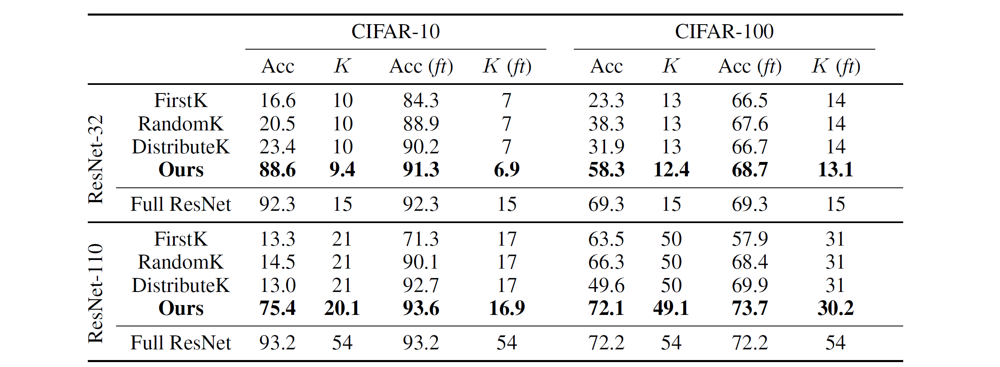

# BlockDrop: Dynamic Inference Paths in Residual Networks [Korean]

## 1. Problem definition

최근 딥러닝 모델들은 정확도가 크게 향상되며 다양한 dataset에서 큰 성과를 이루었습니다. 그러나 이러한 모델들은 자율 주행, 모바일 실시간 상호작용과 같은 실제 환경에서 적용되기가 힘들다는 문제점을 가지고 있었습니다. 그 이유는 높은 정확도를 위해서는 더 깊고 복잡한 네트워크 구조를 유지해야 하는데, 네트워크를 복잡하게 유지하면서 실시간 정도의 빠른 속도를 유지하는 것이 쉽지 않기 때문입니다. 이에 따라 여러 모델 경량화 기법들이 제안되었으나, 해당 논문에서는 이러한 네트워크의 구조가 __*one-size-fits-all*__ 네트워크 구조라는 점을 문제점으로 지적하였습니다. ([One size fits all](https://en.wikipedia.org/wiki/One_size_fits_all))

## 2. Motivation

인간의 인식 시스템은 사물 인식을 하나의 기준대로 하는 것이 아니라, 사물의 종류나 주변의 배경에 따라 시간과 중요도를 다르게 배정합니다. 예를 들어, 복잡한 상황과 물체를 인식해야 할 경우에는 평소보다 많은 시간과 관심을 무의식중에 더 크게 할애하고, 간단한 스캔으로 해결할 수 있는 경우에는 큰 시간과 관심을 두지 않습니다. 이러한 맥락에서, 본 논문은 인풋 이미지의 분류 난이도에 따라 네트워크의 레이어를 선택적으로 제거하는 __*BlockDrop*__ **[[1]](https://arxiv.org/abs/1711.08393)** 기법을 제안합니다.

ResNet은 두 개 이상의 컨볼루션 레이어로 구성된 리사이쥬얼 블록과, 두 블록 사이의 직접 경로를 가능하게 하는 Skip-connection으로 구성되어 있습니다. 이러한 Skip-connection은, ResNet이 동작할 때 상대적으로 얕은 네트워크의 앙상블처럼 작동하도록 하여 ResNet의 특정 리사이쥬얼 블록이 제거되는 경우에도 일반적으로 전체 성능에 약간의 부정적인 영향만 가져올 수 있도록 합니다.

한편, Residual Network의 레이어를 제거 (drop) 하는 것은 일반적으로 __*Dropout*__ **[[2]](https://jmlr.org/papers/v15/srivastava14a.html)** 과 __*DropConnect*__ **[[3]](https://proceedings.mlr.press/v28/wan13.html)** 와 같이 모델을 학습하는 과정에서 이루어집니다. 이러한 방법들은 모두 인퍼런스 과정에서는 레이어를 drop하지 않고 고정시킨 채로 실험을 진행합니다. 만약 인퍼런스 과정에서 레이어를 효율적으로 drop한다면 성능은 거의 유지한 채로 인퍼런스 과정에서 Speed up을 기대할 수 있습니다. 본 논문에서는 속도 개선을 목표로 레이어를 인풋 이미지에 따라 효율적으로 드랍하는 연구를 진행합니다.

### Related work

#### Residual Networks Behave Like Ensembles of Relatively Shallow Networks [[4]](https://arxiv.org/abs/1605.06431)

위 논문에서는 ResNet이 테스트 과정에서 layer dropping에 resilient하다는 것을 보였습니다. 그러나 성능 저하는 최소화하면서 레이어를 제거할 수 있는 dynamic한 방법은 논문에서 구체적으로 제시되지 않았습니다. 반면, **Data-Driven Sparse Structure Selection for Deep Neural Networks [[5]](https://arxiv.org/abs/1707.01213)** 논문에서는 Sparsity constraint를 활용하여 어떤 리사이쥬얼 블록을 제거할 것인지 결정하는 방법을 제안하였습니다. 그러나 주어진 인풋 이미지에 dependent하게, 즉 instance-specific하게 어떤 블록을 제거할 것인지 결정하는 방법을 제안하지는 못하였습니다.

### Idea

최적의 block dropping 구조를 찾기 위해 해당 논문은 reinforcement learning을 활용합니다. 강화학습을 통해 주어진 이미지에 적절한 블록 구성을 찾아내주는 binary vector를 생성하고, 이를 통해 해당 논문은 인퍼런스 과정에서 성능 저하가 거의 없는 상태로 speed up을 이뤄냅니다.

## 3. Method

입력 이미지가 주어졌을 때 최적의 block dropping 전략을 찾기 위해서 해당 논문은 binary policy vector를 출력하는 policy network를 구성합니다. 학습 과정에서 리워드는 block usage와 예측 정확도를 모두 고려하여 결정됩니다.

일반적인 강화학습과는 다르게, 해당 논문은 *all actions at once* 방식으로 정책을 학습합니다. 입력 이미지 x와 K개의 블록을 가지는 ResNet이 있을 때, block dropping 정책은 다음과 같이 K차원의 **베르누이 분포**로 정의됩니다.

위 식에서 f는 policy network에 해당하고, 이에 따른 s는 특정 블록이 drop될 likelihood를 의미합니다. 이 경우에 u는 0 또는 1의 값을 가지는 drop 여부를 따지는 action을 의미합니다. 효율적인 block usage와 동시에 정확도를 높이기 위해서 아래와 같은 reward function을 설정합니다.

리워드 수식의 첫째줄은 전체 블록 중에서 드랍된 블록의 비율을 의미합니다. 이때, 위와 같은 형태로 적은 양의 블록을 사용하는 정책에 큰 리워드를 주어서 block dropping을 권장하는 방향으로 학습이 진행됩니다. 또한, 리워드 수식의 둘째줄은 틀린 예측에 해당하는 경우를 의미하는데, 이때 틀린 예측에 대해 감마의 페널티를 주어서 정확도를 높이는 방향으로 학습이 진행되게 합니다.

## 4. Experiment & Result

### Experimental Setup

CIFAR-10, CIFAR-100의 경우 pretrained resnet은 resnet-32와 resnet-110으로 실험이 진행되었으며, ImageNet의 경우 pretrained resnet은 resnet-101으로 실험이 진행되었습니다. Policy Network의 경우 CIFAR에 대해서는 resnet-8을 사용하였고 ImageNet에 대해서는 resnet-10을 사용하였는데, ImageNet에서는 input image를 112x112로 downsampling하여 policy network에 전달하였습니다.

### Result

해당 논문은 임의로 residual block을 drop시킨 random 방법과 순서상 앞에 있는 residual block을 drop 시킨 first 방법 등을 baseline으로 하고 본 논문에서 제안하는 BlockDrop 방법과의 성능을 비교하였습니다. CIFAR-10에서 ResNet-32를 pretrained backbone으로 하는 경우 Full ResNet의 성능(accuracy)이 92.3이었다면 FirstK는 16.6의 성능을 보였고 RandomK는 20.5의 성능을 보였으며 BlockDrop은 88.6의 성능을 보였습니다.

인퍼런스 과정에서의 속도 개선에 대한 실험 결과는 다음과 같습니다. 모델 경량화 기법 중에서 ACT, SACT, PFEC, LCCL을 baseline 모델로 하여 FLOPs-accuracy 커브를 비교하였으며, SACT와 동일 수준의 정확도를 유지하기 위해서 50%의 FLOPs만을 필요로 하는 것을 확인하였습니다.

## 5. Conclusion

본 논문은 ResNet을 활용할 때 더 빠른 속도로 inference할 수 있도록 Residual Block을 instance specific하게 drop하는 BlockDrop을 제안하였고 CIFAR 및 ImageNet에 대한 광범위한 실험을 수행하여 efficiency-accuracy trade-off에서 상당한 이점이 있음을 관찰하였습니다. 또한 아래의 결과를 통해 BlockDrop의 policy가 이미지의 semantic한 information을 성공적으로 인코딩한다는 것을 확인하였습니다.

### Take home message (오늘의 교훈)

> 이 논문은 inference 속도 향상을 위해 instance specific하게 residual block을 drop하는 방법을 RL 기반으로 활용하였습니다. 

## Author / Reviewer information

### Author

**이현수 (Hyunsu Rhee)**

- KAIST AI
- ryanrhee@kaist.ac.kr

### Reviewer

1. Korean name (English name): Affiliation / Contact information
2. Korean name (English name): Affiliation / Contact information
3. …

## Reference & Additional materials

1. [Z. Wu, T. Nagarajan, A. Kumar, S. Rennie, L. S. Davis, K. Grauman, and R. Feris. Blockdrop: Dynamic inference paths in residual networks. In CVPR, 2018.](https://arxiv.org/abs/1711.08393)

2. [N. Srivastava, G. E. Hinton, A. Krizhevsky, I. Sutskever, and R. Salakhutdinov. Dropout: a simple way to prevent neural networks from overfitting. In JMLR, 2014.](https://jmlr.org/papers/v15/srivastava14a.html)

3. [L. Wan, M. Zeiler, S. Zhang, Y. L. Cun, and R. Fergus. Regularization of neural networks using dropconnect. In ICML, 2013.](https://proceedings.mlr.press/v28/wan13.html)

4. [A. Veit, M. Wilber, and S. Belongie. Residual networks behave like ensembles of relatively shallow network. In NIPS, 2016.](https://arxiv.org/abs/1605.06431)

5. [Z. Huang and N. Wang. Data-driven sparse structure selection for deep neural networks. arXiv preprint arXiv:1707.01213, 2017.](https://arxiv.org/abs/1707.01213)

