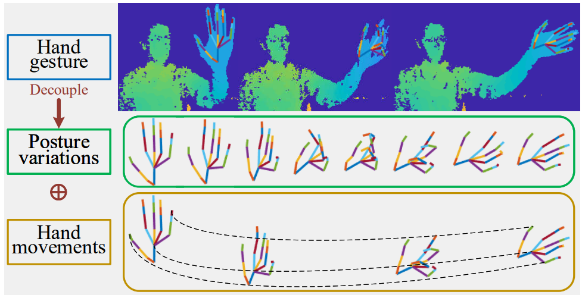
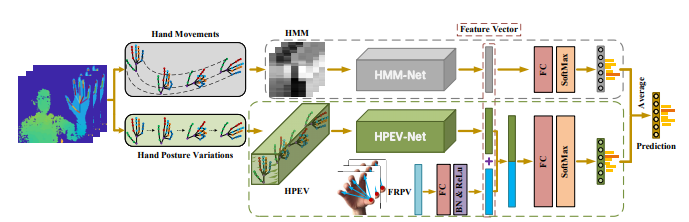
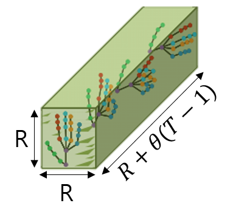
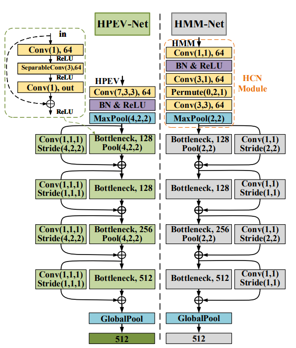
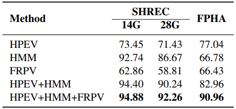
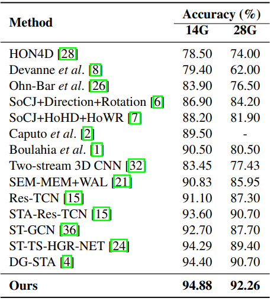
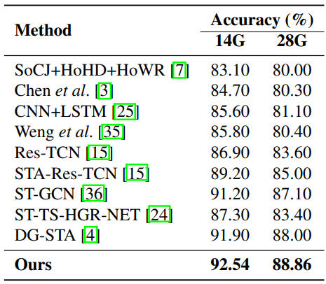
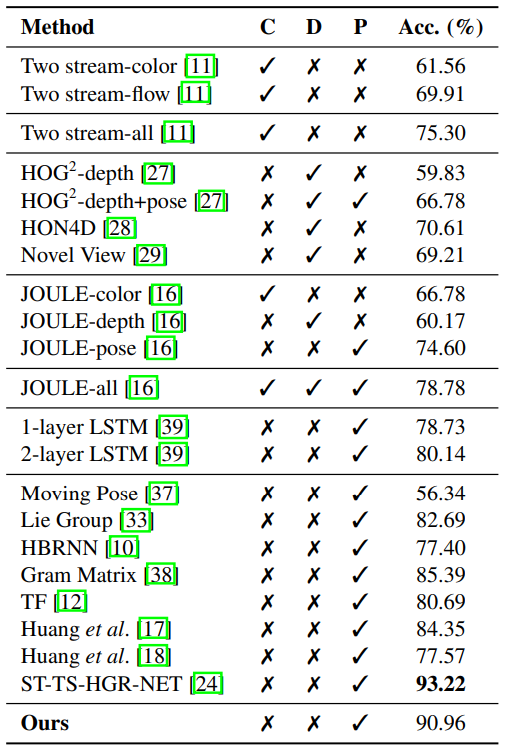

---
Liu et al. / Decoupled Representation Learning for Skeleton-Based Gesture Recognition / CVPR 2020
---

# Separation of hand motion and pose \[kor\]

##  1. Problem definition

유저의 손을 정확하게 인식하려는 연구는 손을 이용한 조작방법이 주는 큰 이점 때문에 이전부터 많은 연구가 이러어져왔다. 그 중에 대표적인 두 가지가 손의 포즈(pose)를 인식하는 hand pose recognition/estimation과 손 모양의 의미를 인식하려 하는 hand gesture recognition이다. 

**hand pose estimation**은 손의 RGB 혹은 RGB-D 이미지를 받아서 그 feature를 분석해 손의 joint이 어떤 모양을 하고 있는지를 알아내고자 하는 task 이고 대부분이 단일한 손 이미지를 인풋으로 받는다. 하지만, **hand gesture recognition** 같은 경우, 그 제스처가 정지해있는 제스처 -숫자를 나타내는 손 모양 등- 이 아닌 이상 연구의 관심사는 제스처가 시작해서 끝나기까지의 일련의 손 동작을 분석하는 것을 목적으로 한다. 그렇기에 이러한 hand gesture recognition 모델은 하나의 이미지가 아닌 복수의 이미지 시퀀스를 인풋으로 받아서 그 시퀀스들이 어떤 의미를 나타내는 제스처인지를 출력해내야만 한다(Fig 1.). 

![Figure 1: Hand gesture recognition[2]](../../.gitbook/assets/15/image10.gif)

이 논문에서도 사용된 SHREC'17 Track 데이터셋을 예로 들자면, 해당 데이터셋은 14가지의 제스처에 대한 손 모양 영상들로 이루어져있다. 그 중 n번째 제스처 $$G_n = \{S^n_t|t=1,2,..., T_n\}$$ ($$S^n_t$$: t 번째 시퀀스의 손 joint들의 위치, $$T_n$$: 시퀀스 길이) 를 모델에 입력했을 때, 데이터셋 내의 제스처의 인덱스인 $$y \in \{1, 2, .., 14\}$$ 가 출력된다. 이렇듯 gesture recognition network는 손에 대한 feature(pose, depth, optical flow 등)들의 시퀀스를 받아 제스처를 특정하는 네트워크다.  

## 2. Motivation

### Related work & Idea

이전에도 딥러닝을 gesture와 action recognition을 위해 사용하는 연구는 많이 있었다. CNN(Convolutional Neural Network), RNN(Recurrent Neural Network), LSTM(Long Shorth-term Memory) 그리고 attention mechanism 이나 mannifold learning, GCN(Graph Convolutional Networks) 또한 제스처 인식 연구를 위해 이용되어왔다. 
하지만, 위의 방법들을 이용한 연구들은 손 joint의 시퀀스들을 **고정된 구조**로 이용했다. 즉, 각 시퀀스의 joint들의 위치를 그저 하나의 통째 이미지로서 훈련을 했고 그렇기에 인접해서 서로 영향을 주는 joint들의 local feature를 포착해내지 못 했다는 것이다. 이 논문에서는 이러한 점을 극복하고자 손의 joint을 spatial and temporal volume modeling를 이용했다. spatial and temporal volume modeling은 method 부분에서도 나오겠지만 단순하게 모든 시퀀스의 각 joint의 위치를 **하나의 3D tensor**로 만든다는 것을 의미한다. 

그리고 이전의 딥러닝을 이용한 제스처 인식같은 경우는 손 모양의 변화와 손의 움직임을 전부 하나의 네트워크에서 학습을 진행을 했다. 하지만, 손 모양의 변화는 손가락 joint의 움직임에 대해 학습이 이루어져야 하는 것이고, 손 자체의 움직임은 손가락과는 크게 관계없이 한 덩어리로서의 손이 어떻게 움직이는지에 대한 학습이 이루어져야한다. 이렇듯 **손 모양의 변화(hand posture variations)**와 **손의 움직임(hand movements)**라는 서로 다른 feature를 한 네트워크에서 훈련하는 것은 비효율적일 수 있기 때문에 이 논문에서는 이러한 두 feature에 대해 따로 학습을 진행한 후에 각각의 prediction 결과를 평균하여 최종 prediction 결과를 얻으려한다(Fig 2.). 

이러한 two-stream 네트워크를 이용한 action recognition은 [3]에서도 이루어졌지만 본 저자는 [3]에서는 shape와 motion evolution maps라는 feature를 이용했고 본인은 hand posture variations와 hand movements를 이용했기에 거기에 차별점이 존재한다고 하고, action recognition과 hand gesture recognition은 그 성질이 다르기에 이러한 차별점이 본 연구의 motivation이었다고 한다. 

## 3. Method

이 모델은 먼저 손의 joint 정보(hand skeleton data)를 각각 hand posture variation과 hand movements로 나누어서 학습을 한다. 

**Hand posture variation**의 경우, 모든 시퀀스의 joint 데이터로 하나의 tensor인 **HPEV(hand posture evolution volume)**를 생성한 후, 이 HPEV를 3D CNN을 베이스로 한 HPEV-Net에서 학습시킨다. 추가로, 섬세한 손가락의 움직임도 인식하기 위해 엄지 손가락을 기준으로 한 각 손가락의 상대적 위치인 FRPV(finger relative position vector) 또한 HPEV-Net에서 출력된 feature vector에 추가해준다. 

**Hand movements**는 **HMM(hand movement map)**으로 맵핑한 후 CNN 기반의 HMM-Net을 통해 학습을 시킨다. 각각의 네트워크를 통해 나온 fature vector는 fully connected layer 와 softmax를 통해 각각 prediction 결과가 나오게된다. 이 두 개의 prediction 결과를 종합하여 최종적 제스처 prediction이 이루어진다. 

### Hand Posture Volume

n 번째 제스처 시퀀스들의 집합을 $$G_n = \{S^n_t | t = 1, 2, ..., T_n \}$$($$T_n: $$시퀀스의 길이)이라고 했을 때, t 번째 프레임의 손의 joint 3D 위치정보 $$S^n_t$$ 는 $$S^n_t =\{ \mathbf{p}^n_{i,t} | \mathbf{p}^n_{i,t} = (x^n_{i,t}, y^n_{i,t}, z^n_{i,t} ), i = 1,2,...,J\}$$ ($$J: $$ joint의 갯수, $$\mathbf{p}^n_{i,t}: $$ t 번째 프레임의 hand joint i의 3D 위치정보) 라고 할 수 있다.  

제스처 마다 시퀀스의 길이인 $$T_n$$이 다르기 때문에 인풋 사이즈를 통일시켜야 한다. 이 때의 인풋 사이즈를 $$T$$로 하고자 한다고 했을 때, $$T_n > T$$일 경우에는 일정하게 시퀀스를 $$T$$만큼만 선택하면 되고, $$T_n < T $$일 경우, 몇 가지의 시퀀스들을 반복해서 시퀀스의 길이가 $$T$$가 되게 하면 된다. 이러한 샘플링 과정을 통하게 되면 제스처 $$G_n$$은 길이가 $$T$$인 $$G^T_n$$이 된다. 
$$
G^T_n = \{S^n_{\tau}|\tau=\lceil \frac{T_n}{T} \times t \rceil , t = 1, 2, ..., T \}.
$$

joint 위치 정보를 volume으로 하기 전에 먼저 joint 위치 정보를 $$[-1, 1]$$에 normalize 해야한다. normalize를 위해선 손의 손의 maximum bounding box를 구해야한다. 한 특정 프레임 t의 특정 joint i의 bounding box는 이하와 같은 방법으로 구할 수 있다. bounding box의 각 변의 길이를 $$\Delta x^n_t, \Delta y^n_t, \Delta z^n_t$$라고 했을 때, 
$$
\begin{cases}
\Delta x^n_t = max(x^n_{i,t}) - min(x^n_{i,t}) \\
\Delta y^n_t = max(y^n_{i,t}) - min(y^n_{i,t}) \quad \quad i = 1,2, ...,J \\
\Delta z^n_t = max(z^n_{i,t}) - min(z^n_{i,t})
\end{cases}
$$
가 된다. 또한, 이러한 bounding box의 최대 길이 $$\Delta x_{max}, \Delta y_{max}, \Delta z_{max}$$는 다음과 같이 구할 수 있다.
$$
\begin{cases}
\Delta x_{max} = max(\Delta x^n_t), \\
\Delta y_{max} = max(\Delta y^n_t), \quad\quad t=1,2,...,T, n=1,2,...,N \\
\Delta z_{max} = max(\Delta z^n_t)
\end{cases}
$$
이러한 값을 이용해서 joint의 위치를 normalize를 하게 되면 이하와 같이 된다. $$x_{norm}$$ 이 normalize한 joint의 x 값, $$x_{min}, x_{max}$$가 각각 해당 joint의 최소/최대 x 값이다. 
$$
x_{norm} = \frac{x - \frac{x_{min} + x_{max}}{2}}{\Delta x_{max}} \times 2.
$$
$$y,z$$에 대해서도 같은 방식으로 $$y_{norm}, z_{norm}$$ 을 구할 수 있다. 위와 같은 과정으로 joint 위치를 normalize 하게 되면 손의 중심을 $$(0,0,0)$$에 맞출 수 있게된다. 

이 다음 손의 관절을 $$R \times R \times R$$의 cube volume으로 하기 위해서 $$x_{norm}$$을 다음과 같은 식을 통해 $$x_v \in \{1,2,...,R\}$$ 로 변환시킬 수 있다. 
$$
x_v = round \left((x_{norm} + 1) \times \frac{R}{2} \right).
$$
이렇게 $$x_v$$를 구하게 되면, $$(R \times R \times R)$$ volume에 해당하는 값이 있다면 1, 없다면 0을 할당하는 것으로 특정 joint 위치정보를 volume으로 할 수 있게된다. 예를 들어, $$x_v=3, y_v=3, z_v=3$$ 이 있다면 volume의 해당하는 voxel에 1을 할당하는 것이다. 이렇게 volume으로 한 joint들을 전부 모으게 되면 특정 제스처를 $$G_v = \{S_{v,t} | t = 1, 2, ..., T\}$$ 라는 volume coordinates로 할 수 있게된다. 이러한 volume을 input으로 사용하기 위해 밑의 식으로 $$(R, R, R)$$ tensor로 변환시킬 수 있다. 
$$
V(i, j, k) = \begin{cases} 1, \quad if(i,j,k) \in S_{v,t} \\ 0, \quad otherwise. \end{cases}
$$

복잡하게 설명을 하였지만 간단하게 말하자면 특정 제스처의 한 시퀀스에 해당하는 손 joint들의 위치정보를 3D tensor로 만드는 과정일뿐이다. 

### Hand Posture Evolution Volume(HPEV)

위치정보를 volume화 하는 것으로 공간정보를 하나의 tensor로 할 수 있었다. 여기서는 모든 시퀀스의 tensor를 일정 간격으로 합치는 것으로 공간정보와 시간정보를 하나의 tensor로 하는 방법을 설명하고 있다. 
$$
V_{HPEV}(i + \theta(t-1), j, k) = \begin{cases}1, \quad if (i,j,k) \in S_{v,t} \\ 0, \quad otherwise. \end{cases}
$$

위 식에서 알 수 있듯이 모든 시퀀스의 손 관절 위치정보를 나타내는$$(R+\theta(T-1), R, R)$$ tensor인 $$V_{HPEV}$$는 위의 섹션에서 구한 V를 x 축을 $$\theta$$만큼 간격을 두고 합치는 것으로 구할 수 있다. 이러한 과정을 거치게 되면 특정 제스처의 모든 시퀀스들은 하나의 tensor로 합쳐지게 되고 다음과 같은 그림 처럼 될 것이다.  

### Fingertip Relative Position Vector(FRPV)

joint 위치정보를 하나의 volume으로 하는 것으로 공간적 정보를 쉽게 나타낼 수 있었지만 그 해상도가 R로 제한되어 있기 때문에 손가락의 섬세한 움직임까지는 나타내지는 못한다. 그 때문에 이 논문에서는 보조적인 인풋으로서 손가락의 상대적 위치들인 FRPV를 이용했다. 특정 프레임 $$t$$의 엄지손가락을 기준으로 한 각 손가락의 상대적 위치 벡터를 다음과 같이 구할 수 있다. 
$$
\mathbf{v_t} = (\mathbf{p}_{I, t}, \mathbf{p}_{M, t}, \mathbf{p}_{R, t}, \mathbf{p}_{L, t}) - (\mathbf{p}_{0, t}, \mathbf{p}_{0, t}, \mathbf{p}_{0, t}, \mathbf{p}_{0, t}) \\
$$

$$\mathbf{p}_{0, t}:$$ t 번째 프레임의 엄지 위치 벡터, $$\mathbf{p}_{I, t}, \mathbf{p}_{M, t}, \mathbf{p}_{R, t}, \,and \;\; \mathbf{p}_{L, t}:$$ 각 $$t$$ 번째 프레임의 검지, 중지, 약지, 소지 위치 벡터

마지막으로, 모든 프레임의 각 벡터들을 합침으로서 $$V_{FRPV}$$을 구할 수 있다. 
$$
\mathbf{V_{FRPV}} = (\mathbf{v}_1, \mathbf{v}_2, ..., \mathbf{v}_t,..., \mathbf{v}_{T})
$$

### Hand Movement Map(HMM)

다음은 손의 움직임을 나타내는 HMM을 생성해내는 방법이다. 손의 움직임은 손 중심의 움직임과 각 손가락 끝의 움직임으로 나타낼 수 있을 것이다. 

특정 제스처를 $$G$$는 $$G = \{ S_t | t = 1,2, .., T \}$$라고 할 수 있고, 손의 joint는 HPEV 때와 마찬가지로 $$S_t = \{ \mathbf{p}_{i,t} | \mathbf{p}_{i,t} = (x_{i,t}, y_{i,t}, z_{i,t}), i = 1,2, ..., J \}$$로 나타낼 수 있다. 이 때, 모든 관절에 대한 중심은
$$
C_t = \frac{1}{J} \sum_{i=1}^J \mathbf{p}_{i,t}
$$

이 될 것이고, 이 중심의 움직임은 맨 처음 시퀀스의 위치와 현재 시퀀스의 위치의 차이로 구할 수 있다. 
$$
M_H = \{C_t - C_1|t=1,2,...,T \}
$$

마찬가지로, 손가락 끝의 움직임 또한 같은 방식으로 구하면 이하의 식이 된다. 
$$
M_{F,j} = \{\mathbf{p}_{j,t} - \mathbf{p}_{j,1}|t=1,2,...,T  \}
$$

j는 5개 손 끝의 인덱스를 나타낸다. 이렇게 구한 $$M_H, M_{F,j}$$ 를 행으로 프레임을 열로 맵핑하게 되면 각 xyz 세 개의 위치 정보를 채널로 하는 Hand Movement Map을 생성할 수 있게 된다. 

### HPEV-Net and HMM-Net

#### HPEV-Net

1. 맨 처음엔 커널 사이즈가 7x3x3인 3D convolution layer를 통해 low-level features를 추출
2. high-level feature를 학습하기 위해 여러개의 bottleneck module을 사용
3. 각 bottleneck modul의 output channel은 128, 128, 256 그리고 512
4. output features의 크기를 줄이기 위한 4x2x2 max pooling layer는 맨 처음 convolution layer 와 중간의 두 개의 bottleneck modul에서만 사용
5. 처음의 3D convolution layer 이후에 Batch Normalization 과 ReLu가 사용
6. 마지막 bottleneck module 이후의 output features는 global average pooling을 이용해 최종 feature vector가 출력

#### FRPV

1. FRPV에 fully connected layer(+Batch Normalization+ReLu)를 적용하면 HPEV-Net의 결과물과 같은 크기의 feature vector를 얻을 수 있다
2. HPEV-Net의 feature vector와 FRPV의 feature vector를 합친후 fully connected layer와 softmax를 통해 제스처를 분류결과가 나온다 

#### HMM-Net

1. HCN(Hierarchical Co-occurrence Network)[4] module을 통해 feature를 추출
2. HPEV-Net와 마찬가지로 4개의 bottleneck module을 통해 high-level features를 학습
3. globa average pooling을 이용해 feature vector 생성
4. fully connected layer와 softmax를 통해 제스처 분류결과가 나온다

마지막으로, HPEV와 FRPV를 이용한 분류결과와 HMM을 이용한 분류결과를 평균하여 최종 제스처 분류결과를 얻을 수 있다. 

## 4. Experiment & Result
### Experimental setup
#### Dateset
- SHREC'17 Track
- DHG - 14/28
- FPHA
#### Training setup
- Optimizer: Adam
- Loss function: Cross-entropy
- batch size for training: 40
- Initial learning rate: 3e-4
- Learning rate dacay: 1/10 once learning stagnates
- Final learnign rate: 3e-8
- hyper parameters: $$T = 60, \theta = 3, R = 32$$ 

### Result
#### Different input combinations

SHREC'17 Track 데이터셋과 FPHA 데이터셋의 결과이다. 손의 움직임에 대한 인풋인 HMM만을 인풋으로 했을때 SHREC'17 데이터셋에서만 HPEV만을 사용했을때보다 성능이 올라가고 FPHA 데이터셋에는 오히려 성능이 줄어들었다. SHREC'17 데이터셋이 FPHA 데이터셋보다 손 움직임이 많은 제스처가 많아서 그런 것으로 보인다고 한다. 그리고 FPHA 데이터셋에서 FRPV 인풋을 사용하자 성능이 8%  나 증가했는데 이것은 FPHA가 섬세한 손가락 움직이 포함된 제스처가 많기 때문이라고 한다. 

#### Comparison with the state-of-the-art

FPHA 데이터셋 결과에서 ST-TS-HGR-NET 의 결과가 이 논문의 결과보다 더 좋은 성능을 나타냈다. 저자는 FPHA 데이터셋의 크기가 작기 때문에 _ST-TS-HGR-NET_의 결과가 더 좋게 나온 것이고, SHREC'17 Track, DHG-14/28 데이터셋과 같은 크기가 큰 데이터셋에서 본 연구의 결과가 더 좋았기에 본 방법은 큰 데이터셋어서 그 성능을 발휘하는 방법이라고 주장한다. 

## 5. Conclusion

이 논문에서는 제스처인식을 할 때에 손의 joint 변화와 손의 전체 움직임 변화를 따로 두 개의 네트워크에서 훈련한 후에 그 결과를 다시 합쳐서 제스처를 인식하는 방식을 제시했다. 확실히 이제까지의 제스처 인식같은 경우는 각 프레임의 손을 하나의 통째 이미지로만 보고, 그 곳에서 추출한 feature의 변화만을 가지고 제스처를 인식해왔기에 이 논문과 같이 손의 모양과 움직임을 따로 분리해서 훈련시킨 다는 아이디어는 굉장히 간단하면서도 효과적인 아이디어로 보인다. 

하지만, 이 논문에서는 손의 joint 포즈 정보를 완전히 알고있다는 전제하에서 그 joint의 변화를 인풋으로 이용했다. 이러한 점 때문에 실제 환경에서 이 방법을 이용할 때에 어떻게 정확한 손의 joint 포즈를 얻어낼 것인가 하는 문제가 일어난다. 일반적인 RGB 혹은 RGB-D 이미지에서 모든 손과 손가락 joint의 공간 위치 정보를 얻어오기 위해서는 hand pose estimation 과정이 필요한데, 이것을 real-time으로 이루어내기 위해선 이 논문과 마찬가지의 혹은 더 큰 모델의 학습을 필요로 하고 계산과정의 걸리는 시간과 자원이 또 들어가게 된다. 그렇다는 것은 이 논문의 제스처 인식 과정을 실제 환경에서 쓰게된다면 joint을 찾는 과정 + 제스처 인식 과정이 더해져서 한 동작의 제스처를 인식하는 데만 시간의 지연이 많이 발생하게 될 것이다. 또, 이 논문에서는 손 joint의 위치 정보를 알고 있기에 손 끝은 늘 포착이 가능한 부분이었고 그렇기에 FRPV 인풋이 그 성능을 발휘할 수 있었다. 하지만, 실제 손 제스처에서는 손가락이 손에 의해서 가려지는 occlusion 상황이 빈번하게 발생하게 되고 occlusion 문제는 제스처 인식 분야에서 굉장히 중요하게 다루고 있다. 하지만 이 논문에 이러한 occlusion 상황에 대한 고찰을 전혀 하고 있지 않다. 이렇듯 손의 joint 정보를 어떻게 얻을 것이가 하는 문제와 occlusion 문제, 이 두 가지의 핵심적인 문제에 대해서 고찰이 없다는 점이 이 논문에 아쉬운 점이라고 할 수 있다. 

### Take home message \(오늘의 교훈\)

> Simple is the best!
>
> 다양한 문제를 고려하자!

## Author / Reviewer information


You don't need to provide the reviewer information at the draft submission stage.


### Author

**하태욱 \(HA TAEWOOK\)** 

* KAIST CT
* hatw95@kaist.ac.kr

### Reviewer

1. Korean name \(English name\): Affiliation / Contact information
2. Korean name \(English name\): Affiliation / Contact information
3. ...

## Reference & Additional materials

1. Liu, Jianbo, et al. "Decoupled representation learning for skeleton-based gesture recognition." *Proceedings of the IEEE/CVF Conference on Computer Vision and Pattern Recognition*. 2020.
2. Google Mediapipe ([Official Github repository](https://github.com/google/mediapipe))
3. Liu, Hong, et al. "Learning explicit shape and motion evolution maps for skeleton-based human action recognition." *2018 IEEE International Conference on Acoustics, Speech and Signal Processing (ICASSP)*. IEEE, 2018.
4. Li, Chao, et al. "Co-occurrence feature learning from skeleton data for action recognition and detection with hierarchical aggregation." *arXiv preprint arXiv:1804.06055* (2018).

