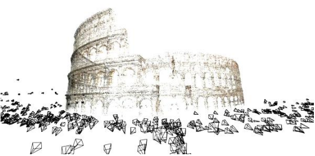
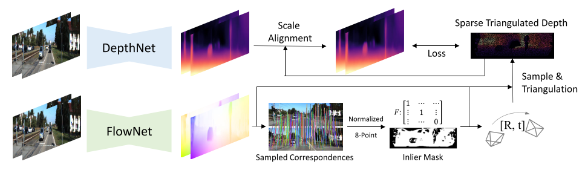
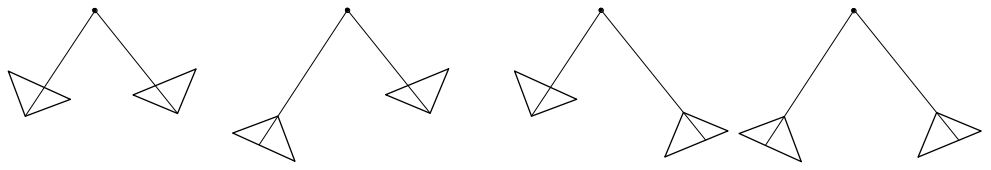
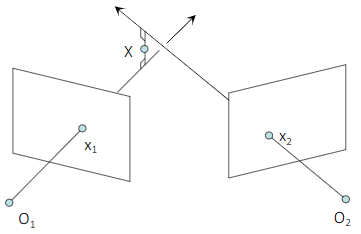
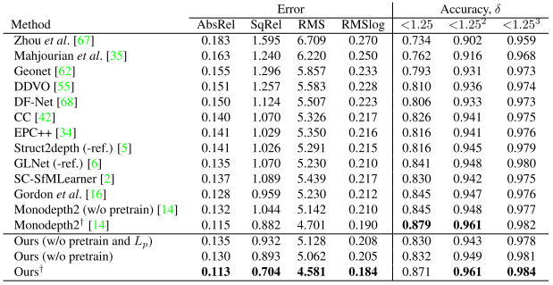
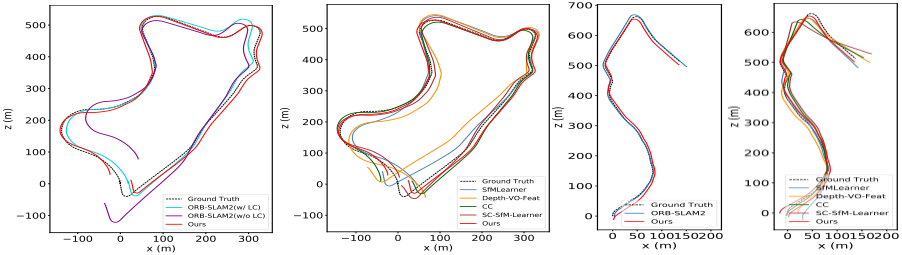
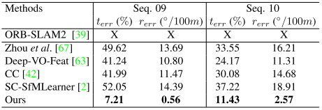
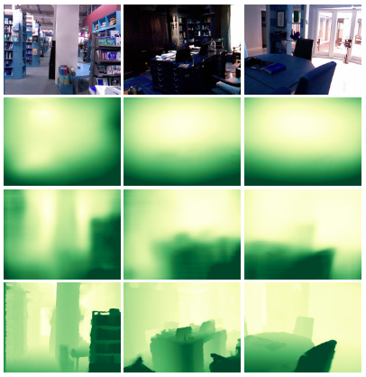

# Joint Depth-Pose Learning without PoseNet \[Kor\]

##  1. Problem definition

오늘날 비디오 혹은 multi-view 이미지를 통해서 카메라의 포지션과 움직임을 추정하고 이미지로부터 3D 환경을 재구성하는 연구가 진행되고 있으며 대표적으로는 **Sturcture-from-Motion(SfM)** 이 있습니다. 이에 대한 전통적인 방법은 이미지로부터 feature point를 추출하고, 서로 다른 이미지에서 추출된 피쳐들을 매칭하여 correspondence를 구성하고, correspondence들로 카메라의 움직임을 추정합니다. 하지만 최근 딥러닝 기법들이 발전함에 따라 앞서 말한 연구들 또한 딥러닝을 기반으로 한 연구가 활발히 진행되고 있습니다.

그 중 depth와 pose를 추정하는 네트워크를 조합(joint)한 연구들이 있습니다. 두 네트워크가 조합되는 이유는, 단안카메라(monocular)의 경우 multi-view 이미지들을 통해서 3D 환경을 재구성한다 하여도 이미지에서는 깊이(depth) 값을 알수가 없기 때문에 scale 문제가 존재하며 이는 large-scale environment일수록 더 큰 오차가 생깁니다. 딥러닝 기반의 monocular pose estimation이라 하여도 scale inconsistency 문제에서 완전히 자유로울 수 없습니다. 이러한 이유로 단안카메라만으로 카메라의 포지션을 추정하고 이미지로부터 3D 환경을 재구성하기 위해서 pose를 추정하는 네트워크와 depth를 추정하는 네트워크를 조합하며, 이를 단순히 병렬처리 하는 것이 아니라 두 네트워크의 output을 결합하여 계산할 수 있는 depth reprojection error와 image reconstruction error를 계산하여 두 네트워크가 서로를 학습시킬 수 있는 _self-supervised joint depth-pose learning_ 을 구성하게 됩니다.

이 논문 또한 depth prediction과 pose prediction을 결합하여 구성된 에러를 통해 self-supervised 환경을 구성합니다. 하지만 기존 방법들과의 차이점은 카메라의 pose estimation을 온전히 네트워크에만 의존하는 것이 아니라 network를 통해 correspondence들을 찾고 전통적인 방법으로 카메라의 pose를 추정합니다.

## 2. Motivation

### Related work

#### Monocular Depth Estimation

이미지를 통해 3D 환경을 재구성하기 위해서는 depth를 아는 것이 필수적이기에 오늘날까지 depth를 예측하는 많은 네트워크들이 개발되었습니다.

딥러닝 기반의 depth 추측하는 연구들 중 데이터 부족 현상에 대해 다룬 연구들도 있습니다. Depth prediction을 실제 환경에 대해 groundtruth를 수집하기에는 매우 제한적입니다. Groundtruth를 수집하는 방법 중 하나는 LiDAR로 데이터를 함께 수집하여 이미지와 맞추는 것인데, 카메라와 LiDAR로 동시에 데이터를 수집하는 것은 가격적인 측면이나 여러 이유로 간단한 일은 아닙니다. 이러한 이유로 Synthetic data를 생성하거나 SfM을 통해 psuedo-groundtruth depth map을 생성합니다.

또한 depth prediction은 기하학적 요소와 결합(joint)하여 photometric reprojection error 등을 통해 self-supervised learning을 구성하는 방법들도 제안되었습니다.

#### Self-Supervised Depth-Pose Learning

최근 SfM 관련 연구에서는 neural network를 접목시켜 카메라의 pose를 추측하는 네트워크들이 많이 개발되었습니다. 이 때 단안카메라의 경우 카메라의 pose를 학습시키더라도 깊이(depth) 정보가 없기 때문에 scale에 대한 문제가 발생하게 됩니다. 즉 100% 정확한 pose가 아니게 됩니다. 이러한 문제를 depth를 추측하는 네트워크와 pose를 추측하는 네트워크를 동시에 학습시키는 연구들이 진행되었습니다. photometric error를 통해 depth와 ego-motion 네트워크를 결합하여 학습시키거나, ICP regularization 혹은 dense online bundle adjustment를 통해 학습 전략을 더 심도 깊게 만드는 연구들이 있었습니다.

#### Two-view Geometry

두 이미지의 relative pose를 구하기 위해서는 여러 방법이 있습니다. 전통적인 방법으로는 correspondence들을 구하고 correspondence를 통해 fundamental matrix 계산 후 relative pose를 구하는 것입니다. Correspondence를 구하는 전통적인 방법은 먼저 corner point와 같은 feature point를 추출한 후 관심있는 feature point의 descriptor를 다른 feature point의 descriptor와 비교하거나, 관심있는 feature point의 주변 픽셀 밝기를 다른 feature point의 주변 픽셀 밝기와 비교하는 것입니다.

최근에는 딥러닝을 기반의 feature point를 추출하는 혹은 매칭하는 연구가 많이 진행되었으며, phtometric consistency를 통해 학습하는 딥러닝 기반의 optical flow 연구도 많이 진행되고 있습니다.

이렇게 수백 혹은 수천개의 correspondence가 구성되면 8-point algorithm 등과 RANSAC 기법들을 결합하여 오차가 가장 적은 pose transformation을 구하게 됩니다. 하지만 위의 모든 과정들을 PoseNet과 같은 하나의 네트워크로 수행될 수 있습니다. 즉 두 개의 이미지를 입력으로 넣어주면 하나의 end-to-end 네트워크를 거쳐 두 이미지를 촬영한 카메라의 relative pose를 구할 수 있습니다. 하지만 앞서 말했듯 단안카메라로는 scale inconsistency 문제가 남아 있습니다.

### Idea

기존의 연구들은 단안카메라의 depth와 relative pose를 두 개의 개별적인 네트워크를 통해 구한 다음, 네트워크로 예측된 relatvie pose로 depth map을 재투영 시킨 다음 photometric consistency를 통해 두 네트워크를 결합시켜줍니다.  

하지만 이러한 경우 pose를 예측하는 네트워크에서 기존에 수행하는 feature matching과 relative pose 계산 외에도, 또 다른 네트워크에서 나온 depth 예측 값을 통해 scale을 추가적으로 학습하여야 합니다. 이는 pose를 예측하는 네트워크에 부담이 커지며, generalization 성능 또한 떨어지게 됩니다.

이 논문에서는 이러한 문제를 완화하기 위해 다음과 같은 방법을 제안합니다. 첫번째로, relative pose를 네트워크를 통해 구하는 것이 아니라, optical flow를 수행하는 network를 통해 correspondece까지 구한 후 전통적인 geometry에 기반한 방법으로 relative pose를 구한 뒤 네트워크에서 예측된 depth를 통해 scale inconsistency 문제를 해결합니다.

## 3. Method

논문에서 제안하는 아키텍쳐는 Figure 2과 같습니다. 먼저 optical flow를 예측하는 FlowNet을 통해 correspondence들을 찾게 되고, 이들을 통해 relative pose를 구할 수 있게 됩니다. 하지만 FlowNet을 통해 추출된 correspondence들은 outlier가 포함되어 있기 때문에 이를 sampling 해줍니다. 샘플링은 FlowNet에서 생성되는 occlusion region의 correspondence들을 제외하는 occlusion mask $$M_o$$와 forward-backward score map $$M_s$$에서 상위 20%의 점을 추출합니다. Forward-backward score map $$M_s$$는 다음과 같이 정의 됩니다.

$$D_{fb}$$: optical flow forward-backward distance map by flow warping

$$M_s=1/(0.1+D_{fb})$$

마지막으로 이들 중 6000개의 점을 무작위로 샘플링합니다.

이렇게 샘플링 된 correspondence들을 통해 relative pose를 구하는 방법은 normalized 8-point algorithm과 RANSAC을 통해 fundamental matrix $$F$$를 계산하며 fundamental matrix를 Singular Value Decomposition(SVD) 등의 기법으로 분해하여 $$[R|t]$$를 구합니다. 여기서 rotation matrix $$R$$의 방향과 translation matrix $$t$$의 부호에 따라 Figure 3와 같이 4가지의 경우의 수가 나오는데 depth 값이 양수가 되는, 즉 모든 점이 카메라 앞에 존재하도록 하는 1가지 경우를 최종 relative pose $$[R|t]$$로 선정합니다. 하지만 주의해야할 점은 위의 과정은 이미지 coordinate 쌍으로 구해진 $$[R|t]$$이기 때문에 scale inconsistency 문제가 남아 있습니다.

$$[u',v',1]=[{u-c_x\over f_x},{u-c_y\over f_y},1]=[X/Z,Y/Z,1]$$

즉 위와 같이 homogeneous 좌표를 통해 3차원 벡터로 계산 되었지만 Z값을 모르기 때문에 scale이 consistent하지 않습니다. 이러한 문제를 해결하기 위해 depth와 pose를 align하는 과정을 거칩니다.

$$x^*=\argmin_x[d(L_1,x)]^2+[d(L_2,x)]^2$$

먼저 two-view에 대한 correspondence와 앞서 구한 두 카메라(이미지)의 relative pose를 통해 triangulation으로 3D 재구성을 수행합니다. 이는 midpoint triangulation으로 문제를 선형적으로 정의합니다. 여기서 $$L_1$$은 $$O_1$$과 $$x_1$$을 지나는 lay이며 $$L_1$$은 $$O_2$$과 $$x_1$$을 지나는 lay입니다. 물론 correspondence를 지나는 두 개의 lay가 완벽히 교차한다면 단순한 triangulation으로 3차원의 점을 구할 수 있겠지만 이미지 좌표가 이산적이라는 것과 노이즈 등으로 인한 오차로 인해 두 개의 lay가 한 점에서 완벽히 교차하는 것은 어렵기 때문에 Figure 4과 같은 과정을 갖게 됩니다.

마지막으로 Triangulation까지 거쳐 계산된 sparse depth와 DepthNet을 통해 예측된 dense depth를 align 함으로써 scale-invariante한 결과를 구하게 됩니다.

네트워크에서는 총 4가지의 loss를 계산합니다. 첫번째 loss는 optical flow에 대한 loss, $$L_f$$입니다. Optical flow를 수행하는 네트워크의 결과에 대해 PWCNet에서 고안한 photometric error를 사용합니다. 두번째는 depth에 대한 loss $$L_d$$입니다. 두 이미지의 relative pose를 알 때 우리는 triangulation을 통해 correspondence의 depth를 추정할 수 있습니다. 이렇게 추정된 triangulation을 통한 depth와 네트워크를 통해 예측된 depth를 비교하여 loss를 구합니다. 세번째 loss는 reprojection error에 대한 loss $$L_p$$입니다. Optical flow를 통해 구한 correspondence로 두 이미지의 relative pose를 구하고 relative pose를 통해 두 이미지의 reprojection error를 계산합니다. 마지막 네번째 loss는 smoothness loss $$L_s$$입니다.

$$L=w_1L_f+w_2 L_d+ w_3 L_p + w_4 L_s$$
 
각각의 loss에 대한 자세한 설명은 다음과 같습니다.

먼저 smoothness loss입니다. Smoothness는 내 관심 픽셀과 이미지의 주변 픽셀과의 변화량을 비교합니다. 변화량을 비교하기 위해 gradient 값이 loss에 들어가며 이는 편미분 기호로 표시 됩니다. 이미지 입력은 $$I_t$$, disparity prediction은 $$d_t$$이며, 이를 통해 depth smooth loss $$L_s$$는 다음과 같이 계산됩니다.
$$L_s=|\partial_xd^n_t|e^{-|\partial_xI_t|}+|\partial_yd^n_t|e^{-|\partial_yI_t|}$$

여기서 $$d^n_t$$는 normalized disparity prediction으로 $$d^n_t=d_t/\overline{d_t}$$입니다.

Flow loss는 photometric error로 픽셀과 SSIM, smoothness를 통해 계산됩니다.

$$L_f=(1-\alpha)||I_a-I_b||+{\alpha\over2}(1-SSIM(I_a,I_b))+\beta L_{fs}$$

$$\alpha$$와 $$\beta$$는 각각 0.85와 0.1로 실험적으로 설정되었습니다.

Depth loss는  triangulation을 통해 구한 depth와 네트워크를 통해 구한 depth의 차이를 loss로 갖습니다.

$$L_d = ({D_{tri} - D_t\over D_{tri}})^2$$

Reprojection loss는 relative pose를 통해 한 이미지를 다른 이미지에 재투영 시켰을 때의 차이를 loss로 갖습니다.

$$L_p=w_{31} L_{pf} + w_{32} L_{pd}$$

$$L_p$$는 두 개의 인자로 구성되어 있습니다. 먼저 주어진 이미지 쌍 $$(I_a,I_b)$$와 depth 추정 $$(D_a,D_b)$$, 카메라 intrinsic matrix $$K$$, optical flow $$F_{ab}$$와 그로부터 계산된 relative transformation $$T_{ab}$$를 통해 $$L_{pf}$$가 계산됩니다.

$$p_{bd}=\phi(K[T_{ab} D_a(p_a)K^{-1}(h(p_a))])$$

$$p_{bf}=p_a+F_{ab}(p_a)$$

$$L_{pf}={1\over |M_r|} \Sigma_{p_a} M_r(p_a)|p_{bd}-p_{bf}|+|D_{epi}|$$

여기서 $$p_a$$는 이미지 $$I_a$$에 속한 픽셀 좌표 $$(u,v)$$를 의미하며, $$h(p_a)$$는 픽셀 좌표를 homogeneous 좌표 $$(u,v,1)$$로 변환해줍니다. $$\phi(\cdot)$$는 3차원 좌표를 이미지로 재투영시킵니다. $$D_{epi}$$는 한 픽셀에 대해 그에 해당하는 epipolar line과의 거리이며, $$M_r = (D_{epi} < 0.5)/(1.0+D_{epi})$$

$$L_{pd}={1 \over |M_o M_r|} \Sigma_{p_a} M_o(p_a) M_r(p_a) |1 - {D^a_b(p_{bd}) / D^s_b(p_{bd})}|$$

$$D^a_b$$는 depth map $$D_a$$가 $$T_{ab}$$를 통해 재투영된 depth map입니다.

해당 논문은 이와 같은 네트워크 구조와 loss function들로 구성된 joint depth-pose learning을 제안하고 있습니다.

## 4. Experiment & Result

### Experimental setup

**Dataset**

실외의 large-scale의 환경에 대해서는 KITTI Odometry dataset에서 수행되었으며, 실내 환경은 NYUv2와 TUM-RGBD에서 수행되었습니다. KITTI dataset의 경우 이미지를 832x256 크기로 resize 하였으며, 00-08 sequence들을 training set으로  09-10 sequence들을 test set으로 사용하였습니다. 실내 데이터의 경우 이미지의 texture가 적고 카메라 모션이 복잡한 상황에 보다 집중했습니다.

**Network architecture**

네트워크는 depth prediction을 위한 DepthNet과 optical flow prediction을 위한 FlowNet이 사용되었습니다. DepthNet의 경우 ResNet18이 encoder로 DispNet이 decoder로 적용되었습니다. FlowNet의 경우 PWCNet을 기본으로 하며, occlusion 또한 고려를 합니다.

**Training**

해당 시스템은 PyTorch 기반입니다. 학습에는 Adam optimizer가 사용되었으며, 1e-4의 learning rate와 8의 batch size로 설정 되었습니다. 학습은 FlowNet과 DepthNet을 개별적으로 20 epochs씩 학습한 후 joint learning은 10 epochs만큼 수행하였습니다.

### Result

Table 1은 state-of-the-art depth pose learning과 논문에서 제안된 방법의 KITTI dataset에서의 결과에 대한 비교표입니다.

KITTI Odometry dataset의 sequence 09와 10의 visual odometry 결과입니다. 첫번째와 세번째는 sequnece 09와 10에 대해서 논문에서 제안된 방법과 ORB-SLAM2를 비교한 결과이며 두번째와 네번째는 state-of-the-art depth-pose learning과 비교한 결과입니다. ORB-SLAM2는 딥러닝이 전혀 들어가지 않은 기법입니다.

 
Figure 5에 대한 정량적인 평가표입니다.

뿐만 아니라 논문에서 제안하는 방법은 generalization 관점에서도 좋은 성능을 보이고 있습니다. Figure 6는 indoor dataset인 NYUv2에서 test위에서부터 입력 이미지, PoseNet을 baseline으로 하는 depth 예측, 제안된 방법에 의한 depth 예측, 그리고 groundtruth 순서입니다.

## 5. Conclusion

논문에서는 새로운 _self-supervised joint depth-pose learning_ 제안했습니다. 그들의 핵심 아이디어는 PoseNet과 같은 네트워크를 통해서 relative pose를 구하는 것이 아니라, optical flow로 correspondence를 구성하고 geometry에 기반하여 relative pose를 구합니다. 이후 triangulation을 통해 추정한 depth와 네트워크를 통해 예측된 depth를 align함으로써 scale inconsistency 문제를 해결했습니다. 이러한 구조를 통해 정확성 뿐만 아니라 네트워크 기반의 방법이 겪을 수 있는 generalization 문제를 보완하였으며, relative pose를 구하는 과정이 geometry에 기반했기 때문에 pose optimization이나 bundle adjustment 같은 back-end optimization

### Take home message \(오늘의 교훈\)

최근 SfM 혹은 SLAM과 같은 분야에서 전통적인 geometry 기반의 방법을 넘어서 learning 기반의 방법의 연구가 활발히 진행되고 있습니다. 하지만 아직까지 learning 기반의 방법이 새로운 정보를 제공하고 새로운 접근을 제공하지만, 수집된 정보(e.g. feature extraction, feature matching)들로 relative pose를 구하는 과정 만큼은 geometry 기반의 pose estimation이 정확하다고 판단되고 있습니다. 뿐만 아니라 이번 논문을 통해서 pose estimation 관점에서의 정확성 뿐만 아니라 generalization 관점에서도 성능을 향상시킬 수 있다는 점이 흥미로웠습니다.

## Author / Reviewer information

### Author

**정현준 \(Hyeonjun Jeong\)**

- M.S. student at KAIST CCS GSGT
- Research interests: Visual SLAM and Deep learning

### Reviewer

1. Korean name \(English name\): Affiliation / Contact information
2. Korean name \(English name\): Affiliation / Contact information
3. ...

## Reference & Additional materials

1. [Wang Zhao, Shaohui Liu, Yezhi Shu, and Yong-Jin Liu. Towards Better Generalization: Joint Depth-Pose Learning without PoseNet. In _CVPR_, 2020.](https://arxiv.org/abs/2004.01314)  
2. https://github.com/B1ueber2y/TrianFlow  
3. [Cl´ement Godard, Oisin Mac Aodha, Michael Firman, and Gabriel J Brostow. Digging Into Self-Supervised Monocular Depth Estimation. In _CVPR_, 2019.](https://arxiv.org/abs/1806.01260)  
   [Deqing Sun, Xiaodong Yang, Ming-Yu Liu, and Jan Kautz. PWC-Net: CNNs for Optical Flow Using Pyramid, Warping, and Cost Volume. In _CVPR_, 2018.](https://arxiv.org/abs/1709.02371)  
   [Alex Kendall, Matthew Grimes, and Roberto Cipolla. PoseNet: A Convolutional Network for Real-Time 6-DOF Camera Relocalization. In _ICCV_, 2015.](https://arxiv.org/abs/1505.07427)  
   [Yang Wang, Yi Yang, Zhenheng Yang, Liang Zhao, Peng Wang, and Wei Xu. Occlusion Aware Unsupervised Learning of Optical Flow
. In _CVPR_, 2018.](https://arxiv.org/abs/1711.05890)  
   [Andreas Geiger, Philip Lenz, and Raquel Urtasun. Are we ready for autonomous driving? the kitti vision benchmark suite. In _CVPR_, 2012.](http://www.cvlibs.net/publications/Geiger2012CVPR.pdf)  
