# Meta-Transfer Learning for Zero-shot Super Resolution \[Korean\]

## Preface

### Transfer Learning이란?

Transfer Learning이란 아주 큰 데이터셋에 훈련된 모델의 가중치를 가지고 와서 우리가 해결하고자 하는 과제에 맞게 재보정해서 사용하는 것을 의미합니다. 결과적으로 비교적 적은 수의 데이터를 가지고도 우리가 원하는 과제를 해결할 수 있는 딥러닝 모델을 훈련시킬 수 있는 것입니다.

### Meta Learning이란?

Meta learning이란 학습에 대한 학습을 말합니다. 첫 번째는 학습을 위해 주어진 데이터로부터 패턴이나 특징을 찾고 새로운 데이터가 주어졌을 때, 그 특징을 찾는 것입니다. 두 번째는 모델을 훈련하는 learning보다 한 단계 위인, Hyper-parameter에 대해서 적합한 값을 찾는 Learning을 진행합니다.

##  1. Problem definition

본 논문의 MZSR(Meta-Transfer Learning for Zero-shot Super Resolution)은 한 장의 사진에서 약간의 업데이트만을 수행하여 우수한 해상도 복원 성능을 보일 수 방법입니다.
특징은 Transfer-learning과 Meta-learning을 이러한 Zero-shot Super Resolution 분야에 사용했다는 점인데요, 우선 Transfer learning을 이용하여 많은 수의 외부
이미지로부터 사전 학습된 모델(pre-trained model)을 이용하여 추가적으로 Fine-tune을 진행할 수 있도록 합니다.
다만, 이 Fine-tune을 진행할 때, Meta-learning을 이용해서 다양한 커널(kernel)에 대해서 빠르게 적응할 수 있게끔 하는 것이 특징입니다.
이 Meta-learning 과정을 마치고 나면, 어떤 이미지가 주어졌을 때, 어떤 internal data repetition 정보를 이용해서 학습을 진행하는 그런 Zero-shot 기반으로 학습이 동작할 때, 이와 같이
약간의 업데이트만을 이용해도 빠르게 의도했던 특정 커널에 맞는 그런 가중치를 찾아서 학습을 진행하는 것을 확인할 수 있습니다.

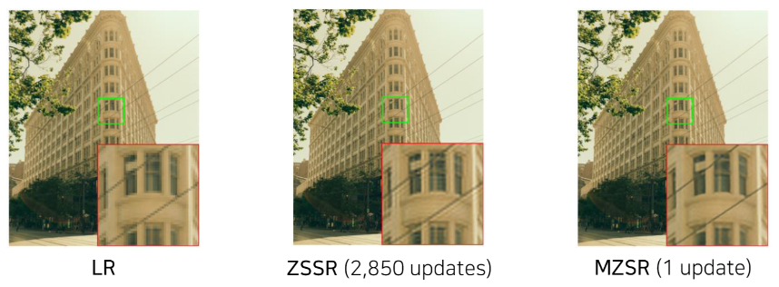

## 2. Motivation

즉 일반적으로 이 ZSSR은 흔히 우리가 알고 있는 Zero-shot Super-resolution 방법인데요, 이런 경우에는 자기 자신 이미지에 대해서 여러번 학습 과정을 거쳐야하기 때문에 이렇게 약 3000번의 업데이트가 필요한데요, 본 논문에서 제안하는 MZSR을 이용하게 되면, Transfer와 Meta-learning을 사전에 미리 이용해놓고 실제로 meta-test 과정에서 단순히 한번, 그리고 많게는 10번 정도의 업데이트만 수행하더라도, 가중치가 이 이미지에 맞게 적절하게 특정 커널에 잘 부합할 수 있도록 학습이 되기 때문에, 적은 업데이트만 가지고도 빠르게 가중치를 찾을 수 있어서 Zero-shot Super-resolution를 위한 모델을 빠르게 만들 수 있다는 것이 장점입니다.

### Related work

#### 1) CNN기반 접근방식
최근에는 CNN기반의 접근방법이 높은 성능을 보이고 있어서 많이 사용되고 있는데요, 이는 저해상도 이미지를 네트워크에 대입하여 높은 해상도로 반환하는 방식으로 이루어집니다.
물론, 이 Neural Network의 종류에 따라서 저해상도의 이미지를 Bicubic 등을 이용하여 크기를 키운 다음에 이 이미지를 Neural Network에 넣어서 고해상도로 반환합니다.
이때, 고해상도 이미지들을 특정 kernal을 이용하여 Blur처리를 하고, Downsampling, Noise 추가 과정을 거쳐 저해상도로 만들어서 Train data로써 사용합니다.
다만, Downsampling 과정에서 bicubic과 같은 잘 알려진 kernal만을 이용하면 non-bicubic 케이스에 대하여 성능이 떨어지는 **domain gap** 문제가 발생하게 됩니다.

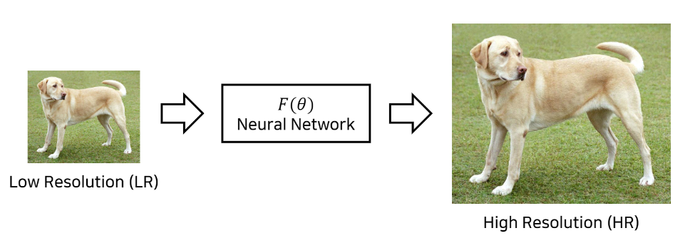
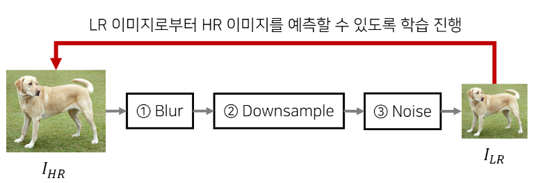

#### 2) SISR(Single Image Super-Resolution)

이 분야에 대해서 기본적인 내용부터 알기 위해서 SISR(Single Image Super-Resolution)에 대해서 말씀드리겠습니다.
이 분야는 한 장의 저해상도 이미지(LR)가 테스트 타임에 주어졌을 때, 이를 고해상도 이미지(HR)로 변환하는 방법을 다룹니다.
픽셀 여러가지 값들이 존재한다고 했을 때, 이 픽셀의 수를 늘린다고 하면, 즉 고해상도의 이미지로 바뀐다고 하면,
다양한 방법(1D nearest-neighbor, Linear, Cubic, 2D nearest-neighbor, Bilinear, Bicubic)을 이용하여 픽셀 값을 생성합니다.
여기서 Cubic은 3차함수를 이용하는 내용이라고 보시면 됩니다. 따라서 기존에 존재하는 각각의 sample 값을 참고하여 이 중간 지점의 픽셀
값을 결정하는 방식이 가장 전통적이며 많이 사용되는 방법입니다.

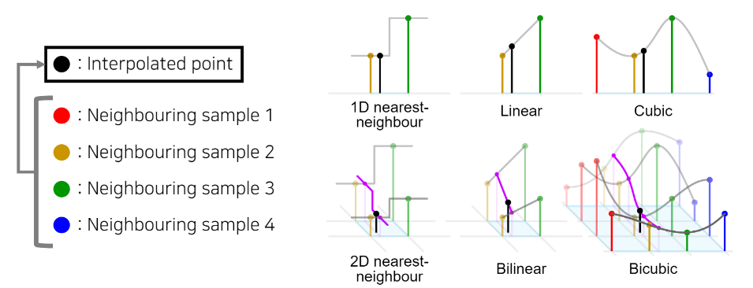

#### 3) ZSSR(Zero Shot Super-Resolution)
MZSR의 Meta-test 단계에서 활용하게될 Zero-Shot Super Resolution에 대해 설명드리도록 하겠습니다. ZSSR 앞서 말씀드린 SISR과 달리 학습 단계에서 자기 자신 즉 internal infromation을 학습합니다. 자기 자신 image로부터 추출된 HR-LR pair를 만들어 학습을 진행하고 이렇게 학습된 정보를 토대로 원본을 LR로 이용하여 확대한 결과 즉 예측을 진행합니다. 그러나 한계점으로는 한 장의 이미지에 대해서만 학습을 하다보니 학습 시간이 많이 필요하고, 다른 이미지엔 사용 어렵다는 점을 본 논문에서 지적하고 있습니다.

### Idea

자기 자신 image로부터 추출된 HR-LR pair를 만들어 학습을 진행하고 이렇게 학습된 정보를 토대로 원본을 LR로 이용하여 확대한 결과를 토대로 예측을 진행합니다.
그러나 한계점으로는 한 장의 이미지에 대해서만 학습을 하다보니 학습시간이 많이 필요하고, 다른 이미지엔 적용이 어렵다는 점을 본 논문에서 지적하고 있습니다.
따라서 이 논문에서는 내용은 MAML(Model-Agnostic Meta-Learning)의 적용을 제안합니다.
MAML은 적절한 초기 가중치(weight)를 찾기 위한 방법입니다.
다양한 작업(task)에 대해서 빠르게 적응할 수 있는 가중치를 찾는데 도움을 주며, Fine-tuning에도 도움을 줄 수 있습니다.

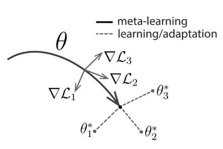
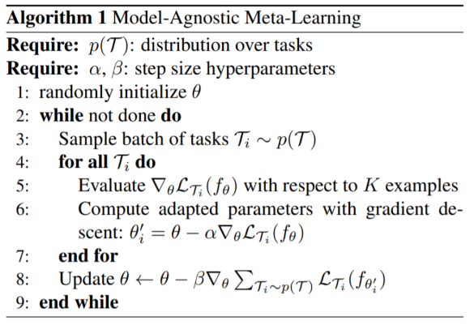

## 3. Method

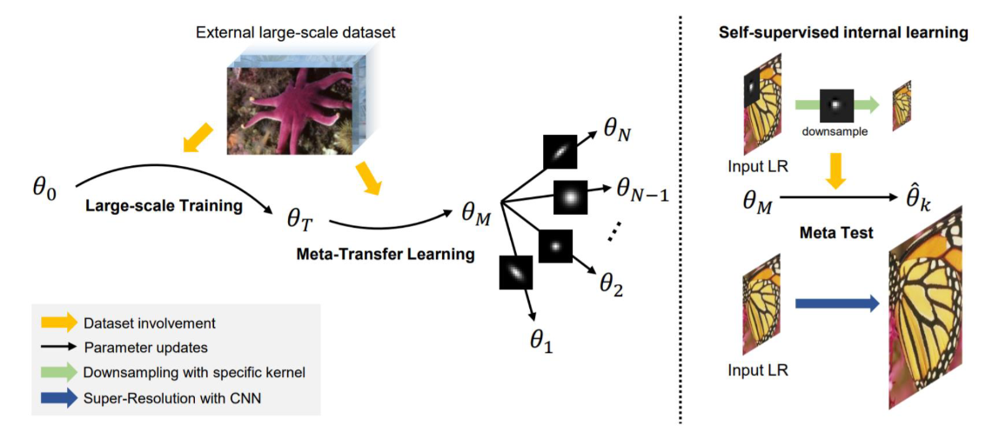

그래서 이러한 CNN 기반의 방법과 ZSSR의 한계점을 극복하고자 본 논문은 MZSR을 제안합니다. 전체적인 흐름을 보시면 externel data로 large scale training과 
meta transfer learning을 진행합니다. 그리고 Meta-Test 단계에서는 zero-shot super-resolution 방법을 사용합니다.

Large-scale Training단계에서는 다양한 이미지로부터 공통적으로 사용되는 representation들을 학습할 수 있도록 합니다. natural image들로 부터 특징값들을 
받아와서 활용함으로써 높은 성능을 보이도록 합니다. 수식을 보시면 바이큐픽으로 low resolution image를 만들어서 HR, LR pair를 만든 뒤 L1를 사용해서 loss를
최소화하는 방향으로 training 진행합니다.

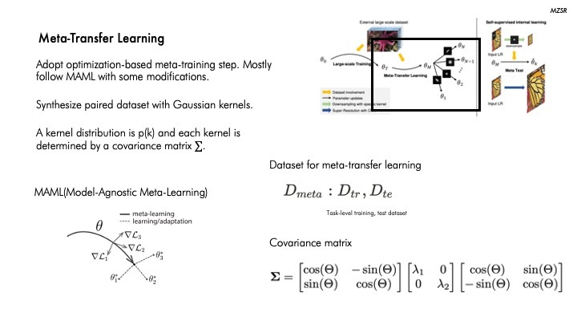

이제 Meta-Transfer Learning 단계입니다. Meta learning은 학습을 위한 학습이라고도 합니다. 나중에 학습이 잘 될 수 있도록 하기 위해서
특정한 각 task로 빠르게 학습될 수 있도록 만드는 것입니다. 다양한 kernel condition에 가장 sensitive한 initial point를 찾기 위해 
transfer-learning과 optimaization 기반의 meta-learning 방법 즉 MAML을사용합니다. 이와 같이 task가 3개가 있다고 할때 각각 task에
맞는 optimal한 weight값은 세타1, 세타2, 세타3이 있고  가 있고, 화살표 끝으로 도달하게 되면 각각의 가중치로 가는 각 task에 대한 loss의 방향성을 구할 수 있습니다.
Kernel distribution을 위해서는 Covariance matrix을 사용하는데요. 처음 괄호는 rotation matrix로 세타만큼 이미지를 회전합니다. 그리고 람다 파라미터를
사용하여 블러처리를 수행합니다. 그리고 다시 세타만큼 반대로 회전을 시켜서 원본이미지로 되돌릴 수 있도록 합니다.

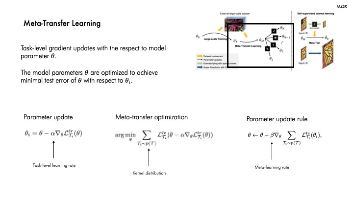

이제 이 meta-learner를 train시킵니다. Task-level Loss를 통해 model parameter 𝜃를 업데이트하고 Test error를 최소화하는 방향으로 optimization을 진행합니다.

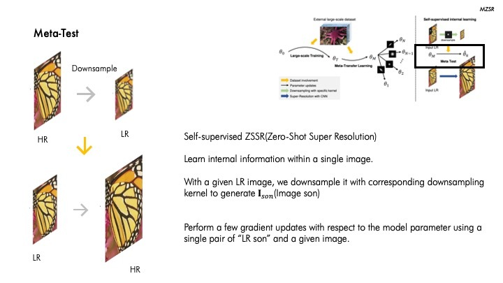

그 다음은 Meta-Test 단계입니다. 이는 앞서 설명드린 Zero-shot super learning 방식과 동일하게 single image 내에서 internal information을 학습하는 걸 위 그림에서 보실 수 있습니다.

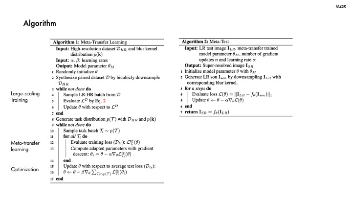

앞서 설명드린 Meta-Transfer Learning과 Meta-Test의 알고리즘입니다. 
Meta-Transfer Learning 알고리즘을 보시면 Data(D)가 있을 때 때 LR과 HR batch를 만든 다음 L1 Loss를 이용해서 Training을 진행합니다. 그리고 task distridution 내 각 task에
대해 나중에 학습을 진행했을 때 학습이 빨리 될 수 있도록 meta-learning을 진행합니다. 마지막으로  meta-learn을 optimization합니다. 
Meta-Test 단계에서는 하나의 이미지가 들어왔을 때 각 kernel에 맞게 meta-learning이 된 가중치 값을 빠르게 update 시킵니다. 이런 과정을 통해 SR이미지를 return 하는 걸 보실 수 있습니다.

## 4. Experiment & Result

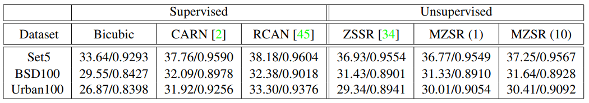

바이큐빅으로 다운샘플링된 데이터셋의 실험 결과입니다. 아무래도 바이큐빅 다운샘플링을 진행했기 때문에 다른 모델과 비교했을 때
MZSR이 비교적 낮은 성능을 보이는 데이터셋이 있지만 1-10번의 업데이트만으로 유사한 성능을 낼 수 있음을 알 수 있습니다.

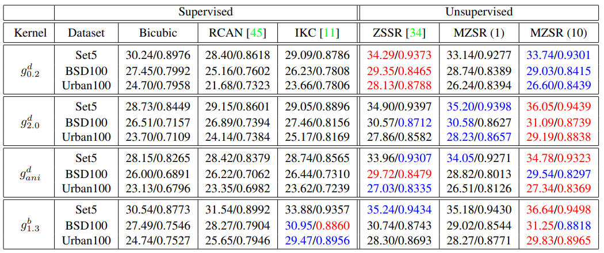

해당 테이블은 다양한 커널을 사용한 실험 결과입니다. 빨간색이 1위, 파란색이 2위 결과인데, 대부분 unsupervised 방법이 
우수한 성능을 보이며 MZSR의 경우 10번만 업데이트한 실험결과에서는 대부분 1, 2위를 차지한 것을 알 수 있습니다.

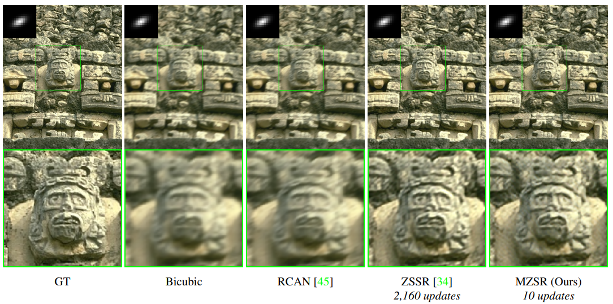

이러한 수치를 시각화한 결과입니다. MZSR을 10번만 업데이트 했음에도 우수한 복원 성능을 보이는 것을 할 수 있습니다. 

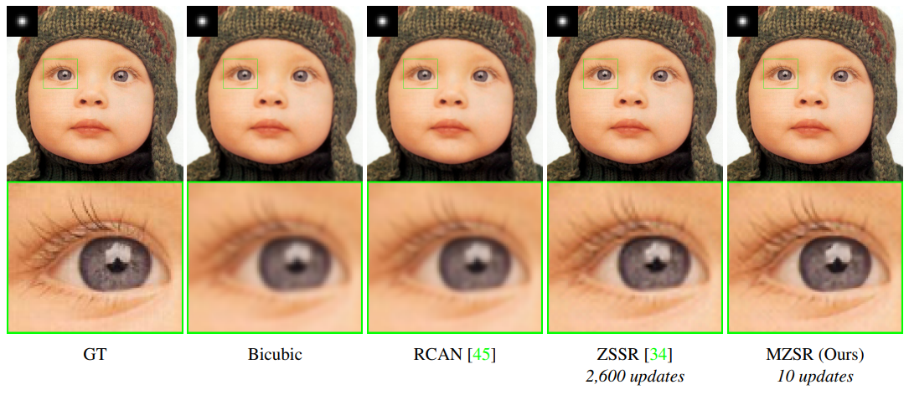

여기도 마찬가지로 해당 커널 condition에서도 MZSR은 10번만 업데이트 했음에도 우수한 복원 성능을 보이고 있음을 알 수 있습니다. 

### Experimental setup

* Dataset으로는 Set5, BSD100, Urban100을 저해상도로 변환한 이미지, 그리고 원본을 이용했습니다.
* 비교대상으로는 Bicubic, CARN, RCAN, ZSSR을 이용하였습니다.
* Training 세팅은 α = 0.01 and β = 0.0001 으로 설정하였습니다.
* 결과는 YCbCr color 공간의 Y channel에서 PSNR(dB)과 SSIM의 평균을 낸 값으로 평가됩니다. 빨간색은 최상의 결과를 나타내고 파란색은 차선을 나타냅니다. 
또한 괄호 안의 숫자는 이 논문에서 제안하는 MZSR방법의 그레이디언트 업데이트의 수를 나타냅니다.

### Result

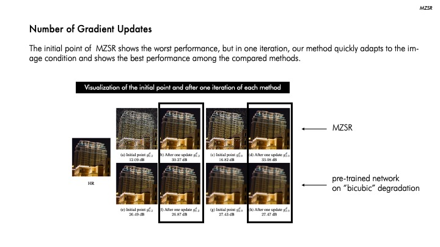

MZSR의 경우 한 번의 gradient update만으로 높은 성능을 보임을 앞서 언급했습니다.
그림을 보시면 initial point에서는 가장 안 좋은 성능을 보이는 것을 알 수 있었습니다.
그러나 이와 같이 1번의 업데이트만으로 다른 pre-trained network으로 복원된 이미지보다 좋은 성능을 낼 수 있음을 확인할 수 있는데요,
이는 얼마나 MZSR이 빠른 적응 능력이 있는지 알 수 있습니다.

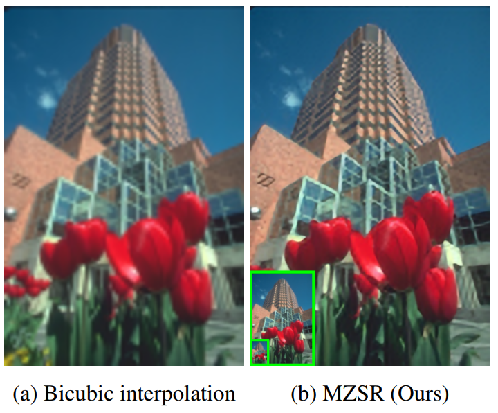

또한, MZSR은 자기 자신으로부터 학습을 진행하기 때문에 오른쪽 그림과 같이 multi-scale recurrent patterns을 가진 이미지에서도 좋은 성능을 보이는 것을 알 수 있습니다 

## 5. Conclusion
본 논문에서는 외부 샘플과 내부 샘플을 모두 활용하여 빠르고 유연하며 가벼운 자체 감독 초해상도 방법을 제시하였습니다.
구체적으로, 본 논문에서는 Blur kernal의 다양한 조건에 민감한 초기 가중치를 찾기 위해 Transfer Learning과 함께 최적화 기반 Meta Learning을 이용합니다.
따라서 본 논문에서의 방법은 몇 가지 그라데이션 업데이트 내에서 특정 이미지 조건에 빠르게 적응할 수 있다는 것이 장점입니다. 광범위한 실험을 통해 MZSR이 수천 번의 
경사 하강 반복이 필요한 ZSSR을 포함한 다른 방법보다 우수하다는 것을 보여줍니다. 다만 네트워크 네트워크 모형, 학습 전략, multi-scale 모델 등 작업에서 개선할 부분이 많은 것으로 보입니다..
결론적으로 MZSR은 internal과 external 샘플을 모두 사용하여 적은 업데이트로만으로 해상도 복원을 수행하게 하는 빠르고 flexible한 방법이라고 말씀드릴 수있습니다.

### Take home message \(오늘의 교훈\)

> 조금 더 창의적인 생각을 할 수 있는 사람이 되자.
>
> Transfer learning과 Meta learning의 조합은 다른 분야로 연결될 수 있을만큼 그 영향력이 막중하다.
>

## Author / Reviewer information

### Author

**백정엽 \(Jeongyeop Baek\)** 

* M.S. student, Civil & Engineering Department, KAIST (Advisor: Seongju Chang)
* Interested in occupant-centric HVAC control based on individual thermal comfort  
* jungyubaik@kaist.ac.kr
* https://baekkkkk96.tistory.com/

### Reviewer

1. Korean name \(English name\): Affiliation / Contact information
2. Korean name \(English name\): Affiliation / Contact information
3. ...

## Reference & Additional materials

1. Jae Woong Soh, Sunwoo Cho, Namik Cho. Meta-Transfer Learning for Zero-shot Super Resolution. In CVPR, 2020.
2. Official GitHub repository :  https://www.github.com/JWSoh/MZSR.
3. Eirikur Agustsson and Radu Timofte. Ntire 2017 challenge on single image super-resolution: Dataset and
study. In Proceedings of the IEEE Conference on Computer Vision and Pattern Recognition Workshops, pages 126–135, 2017.
4. Namhyuk Ahn, Byungkon Kang, and Kyung-Ah Sohn. Fast, accurate, and lightweight super-resolution with cascading residual network. In Proceedings
of the European Conference on Computer Vision(ECCV), pages 252–268, 2018.
5. Antreas Antoniou, Harrison Edwards, and Amos Storkey. How to train your maml. In ICLR, 2019.

