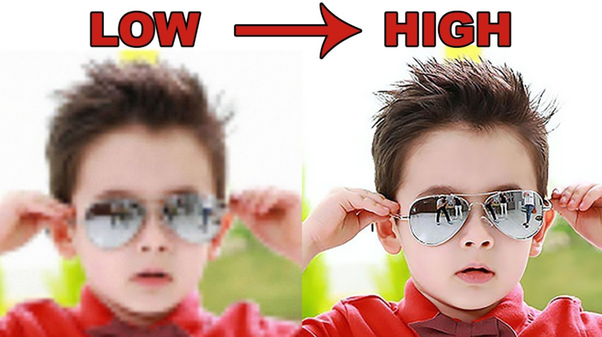
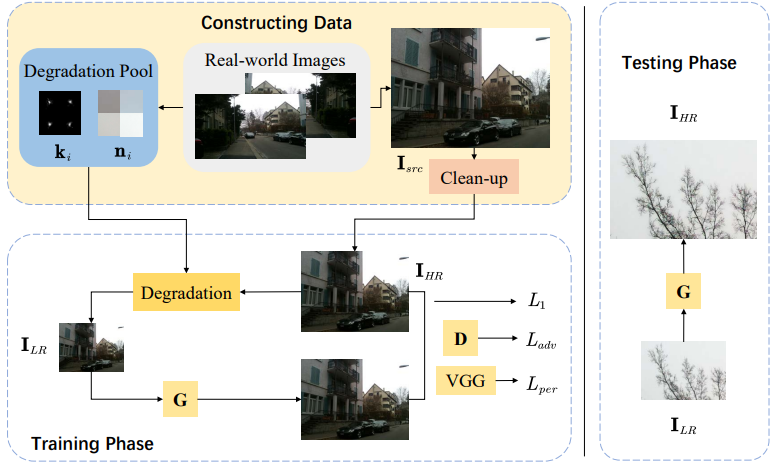
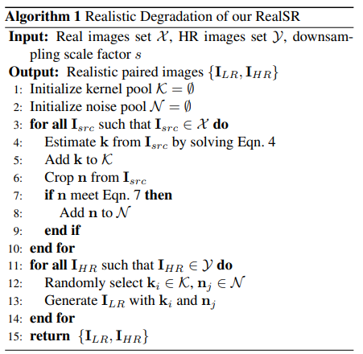
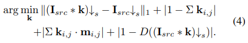
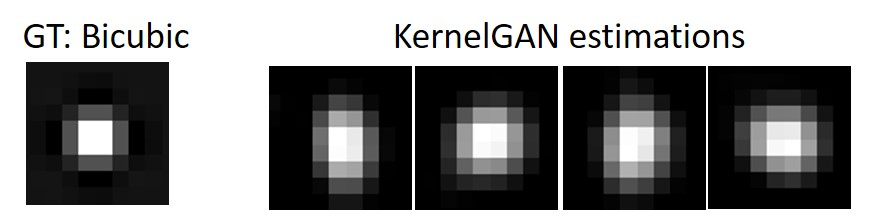
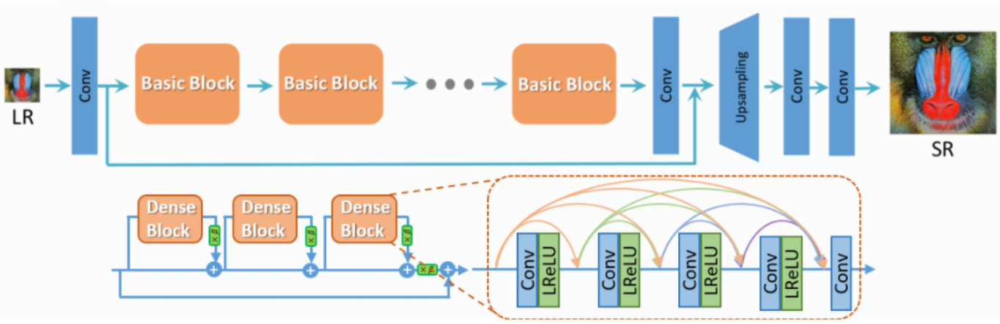
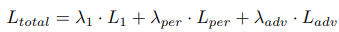
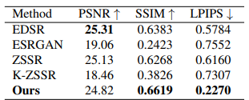
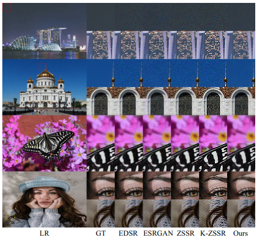
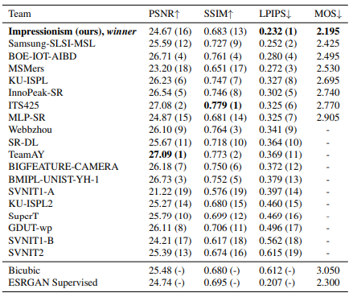

# Real-world Super-resolution via Kernel Estimation and Noise Injection \[Kor\]

##  1. Problem definition

본 논문은 super resolution(SR) 분야 중에 blind super-resolution에 관련된 논문으로 CVPR 2020 workshop - NTIRE 2020 challenge에서 우승한 논문입니다.
SR은 저해상도(low resolution, LR) 이미지를 입력으로 받아 해상도를 높이고 선명도를 향상시키는 기술입니다.




기존 SR 방법에서는 고해상도(high resolution, HR) 이미지에 맞는 LR 이미지을 만들기 위해 HR 이미지를 bicubic kernel을 이용해 생성했습니다. bicubic을 downscale 커널로 사용해 LR 이미지를 만들게 되면, HR 이미지에서 갖고 있던 이미지의 특성이 사라지고 부드러운 이미지가 됩니다. bicubic kernel의 모양을 보면 bicubic kernel이 기존 이미지의 특성을 사라지게 하는 이유는 알 수 있습니다. bicubic kernel을 보면 가운데 픽셀을 최대값으로 두고, 끝으로 갈수록 조금씩 줄어들게 되어 있는데, 이런 모양의 kernel들은 주변 값을 스무딩시키는 효과가 있어서 이는 결국 실제 이미지의 특성(noise)을 제거하는게 됩니다. bicubic kernel을 이용해 데이터셋을 생성하게 되면 LR 이미지와 HR 이미지 간에 이미지 특성이 달라지기 때문에, 학습을 하게 되면 모델의 성능이 떨어집니다. 즉, 생성된 결과 이미지는 실제 이미지와 다른 부자연스러운 아티팩트가 생성됩니다.

## 2. Motivation

### 2.1. Related work

#### 2.1.1. Super resolution
  
많은 CNN(Convolutional Neural Networks) 기반 SR 네트워크들은 bicubic downsampling image에 높은 성능을 달성했습니다. 그 중 대표적인 것이 EDSR[3]로 SR 모델을 학습시키기 위해 Deep Residual Network를 사용했습니다. 또, 일부 GAN(Generative Adversarial Networks) 기반 방법[4,5,6]은 시각적 효과에 더 많은 관심을 기울이며 adversarial loss와 perceptual loss를 도입했습니다.

bicubic kernel로 생성한 데이터셋으로 학습한 SR 모델은 학습 중에 흐릿하거나 noisy한 데이터를 본 적이 없기 때문에 깨끗한 HR 데이터에서만 잘 작동합니다. 실제 LR 이미지에는 종종 noise와 blur가 있습니다. 이 충돌을 해결하기 위해 Xu et al.은 특수하게 만든 카메라를 사용하여 자연에서 직접 원본 사진 쌍을 수집했습니다. 하지만 쌍을 이루는 데이터를 수집하려면 까다로운 조건과 많은 수작업이 필요했습니다.

이 논문에서는 실제 이미지의 degradation(열화)를 분석하여 실제 데이터에 SR 네트워크로 학습하는 것을 중점으로 둡니다.

#### 2.1.2. Real-world Super resolution

현실 세계의 SR 문제를 극복하기 위해 노이즈 제거 또는 디블러링을 결합한 최근 작업[7,8]이 제안되었습니다. 이런 방법은 인위적으로 구성된 흐릿하고 노이즈가 추가된 데이터에 대해 학습되어 SR 모델의 견고성을 더욱 향상시켰습니다. 그러나 이러한 명시적 모델링 방법은 블러에 대해 충분한 사전 지식이 필요합니다.
  
최근에 real-world super resolution challenge[7,10]에 많은 팀이 참여했고, 많은 새로운 방법이 제안되었습니다. 예를 들어, Fritsche et al. [11]은 열화 이미지를 생성하기 위해 DSGAN 모델을 제안합니다. Lugmayr et al. [12]는 실제 초해상도를 위한 비지도 학습 방법을 제안합니다.
하지만 이런 모델들은 동작 시간이 크게 늘어나 실제로 적용하기 어렵습니다. 이러한 방법과 달리 이 논문에서는 실제 이미지에서 kernel degradation을 명시적으로 추정합니다.

### 2.2. Idea

논문에서는 LR과 HR의 unpaired 문제를 해결하고자 LR 이미지를 실제 이미지와 비슷하게 만드는 degradation frame을 제안했습니다. 제안한 방법은 두 가지 단계를 거쳐 Real-world super-resolution을 수행합니다. 첫 번째 단계에서는 degradation function을 estimation합니다. 이 단계에서 blurry kernel과 noise를 추출합니다. 이때 추출된 kernel과 noise를 이용해 HR을 LR로 만들면 실제 LR 영상과 유사한 LR 영상을 얻을 수 있습니다. 두 번째는 앞서 획득한 paired dataset {```HR```, ```LR```} 을 이용해 SR 모델을 학습하는 단계입니다.



## 3. Method

### 3.1. 학습 데이터 생성
degradation kernel k와 노이즈 n을 이용해 다음과 같이 LR 이미지를 만듭니다.

$$
I_{LR}=(I_{HR}∗k)↓s + n
$$

Degradation kernel k는 KernelGAN[9]을 이용해 추출합니다. noise는 HR 이미지를 작게 나눈 패치를 아래 수식을 이용해 noise n으로 저장합니다.
LR 이미지에서 추출한 k와 HR에서 추출한 노이즈 n으로 paired dataset을 위 식을 이용해 만듭니다. 아래는 LR dataset을 생성하는 알고리즘입니다.



입력 ```X```는 real-world ```LR``` 영상이고, ```Y```는 high-resolution 영상이며 두 셋은 unpaired 상태입니다.
s는 scale factor로, ```LR``` -> ```HR```, ```HR``` -> ```LR``` 비율을 의미합니다.

[그림 3]의 3-10 line을 보면 X에서 k와 n을 추출하고 있습니다. 11-14 line에서는 cleanup으로 생성한 Y(HR set)를 하나씩 돌아가면서 random하게  K(degradation kernel set)와 N(noise set)을 꼽아 적용해 ILR을 만들어서 paired dataset{```HR```, ```LR```}을 구성합니다.

##### 3.1.1. Kernel Estimation
Degradation kernel은 KernelGAN을 이용해 추출합니다. 이미지가 generator에 들어가면 임의 위치의 64x64 크기 patch를 선택하고, 이 패치를 임의의 kernel로 downscale해 32x32 이미지로 만든 뒤에 이를 discriminator를 통과해 이미지의 kernel을 업데이트 하게 됩니다. label(real) 이미지로는 입력 이미지를 32x32로 crop한 이미지가 discriminator에 들어가게 됩니다. 이 방식을 여러번(3000 iteration) 수행해 downscale kernel을 업데이트하는 방식입니다.
KernelGAN의 generator를 학습시킬 때 다음을 최적화하도록 합니다. 아래 수식은 [그림 3]의 Eq.4 입니다.



$ (I_{src}∗k)↓s $는 kerenl k로 downsampling된 영상이고 $ I_{src}↓s $는 bicubic으로 downsampling된 영상입니다. 즉, 첫 번째 항은 k로 downsampling된 영상이 low-frequency 정보를 잘 보존하도록 돕습니다. 두 번째 항은 원본 이미지와 degradation 이미지의 색 분포가 일치되도록 k의 합이 1이 되도록하는 것이고, Kernel(K) shape이 3x3인 경우를 생각해보면, 원본 이미지의 3x3 크기만큼 kernel을 적용해 degradation 이미지를 생성하게 됩니다. 세 번째항은 k의 가장자리 값들이 0이 되도록 합니다. m은 마스크로 가장자리에 페널티를 부여합니다. 마지막 항은 discriminator로 계산되는 손실입니다.

아래는 Bicubic kernel과 KernelGAN으로 생성한 Kernel입니다. 위 방법으로 KernelGAN으로 생성한 이미지의 경우 이미지의 특성에 맞는 kernel을 생성한 것을 볼 수 있습니다.




##### 3.1.2. Clean-Up
논문에서는 ```Isrc ∈ X```의 ```Isrc```으로 ```IHR ∈ Y``` 영상을 만드는 방법을 제안합니다. bicubic kernel의 noise smoothing 특성을 이용해 downsampling하면 노이즈가 사라진다는 점을 이용해 ```<IHR=(I_src∗k_bic)↓sc>``` 방법으로 ```IHR``` dataset ```Y```를 생성합니다. ```k_bic : bicubic kernel```

##### 3.1.3. Noise extraction
논문에서 제안하는 노이즈 추출은 매우 간단합니다. 
몇 가지 가정을 기반으로 진행하는데, 콘텐츠 영역의 patch는 분산이 크고, 노이즈 영역의 patch는 그리 크지 않다고 가정합니다. ```Isrc```를 256x256 patch로 split하고, patch가 분산 이내인지에 따라 $ σ(ni)<v $ noise patch를 찾습니다.
```σ : variance function```, ```v : threashold```

noise는 원본 이미지를 256x256 크기의 patch로 자른 뒤에, patch의 분산이 특정 값 이내인 경우에 noise patch로 선정하게 됩니다. 분산이 작다는 것은 patch의 pixel 값이 비슷하다는 것을 의미합니다.

##### 3.1.4. Degradataion with Noise Injection
노이즈 patch ni∈N ID (K로 생성된)를 이용해 ILR을 만들어서 HR, LR paired dataset을 생성합니다.

$ I_{LR} = I_{D} + n_{i}, i∈{1,2,...,l} $

위 수식과 소스 코드를 보면, ```3.1.3``` 에서 추출한 noise patch들을 LR image 생성에 사용(injection)합니다.

1. noise patch를 랜덤하게 고르고
2. noise patch에서 일부분을 32x32 크기로 crop한 뒤에
3. cropped patch의 평균을 cropped patch에 빼준 뒤에
4. 0 ~ 255 boundary로 잘라주고
5. 이렇게 ```4```에서 생성한 noise patch를 downscale된 이미지에 injection해 최종 이미지 하나를 만듭니다.

#### 3.2. Patch Discriminator

  논문에서는 SR model로 ESRGAN을 사용했는데, ESRGAN의 VGG-128 discriminator 대신에 patch discriminator를 사용했습니다. VGG discriminator의 깊은 구조와 마지막의 fully connected layer가 global feature에 집중하고 local feature를 무시하게 합니다. 반면 patch discriminator는 얕은 fully-convolutional network로 local feature에 집중할 수 있도록 합니다. patch discriminator는 3개 레이어를 가지는 fully-convolutional network로 말단 layer로부터 나온 feature map은 70x70의 receptive field를 가집니다.



loss function은 3개 loss의 합이 사용됩니다.



$ L_1 $ loss는 pixel loss로 사용하는데, ```HR```과 생성한 ```SR```이미지 간의 pixel간 차이를 줄여주는 용도로 사용합니다.(default : 0.01) 
$ L_{per} $ loss는 VGG-19의 layer 내부에서 추출하는 inactive features로 이미지의 edge와 같은 low-frequency features를 향상시키는데 사용됩니다. (default : 1)
$ L_{Adv} $ loss는 GAN 학습시에 사용되는 adversarial loss입니다. (default : 0.005)

## 4. Experiment & Result

### 4.1. Experimental setup

#### 4.1.1. Dataset - DF2K
  DF2K dataset은 super resolution에 주로 사용되는 dataset으로 DIV2K와 Flikr2K datasets으로 구성되어 있습니다.
  DIV2K dataset은 깨끗한 이미지이고, Flickr2K dataset은 noisy한 이미지입니다. noisy한 Flickr2K 데이터셋만 위의 clean-up 단계를 수행해 깨끗한게 만듭니다.

#### 4.1.2. Dataset - DPED

  노이즈가 많고, 저퀄리티 카메라로 촬영한 dataset으로 노이즈, 블러 등의 저품질 이미지로 구성된 dataset입니다.
  validation set은 실제 이미지 중에 crop한 이미지라 ground truth가 없어서 정성적 비교만 가능합니다.

#### 4.2. Evaluation metrics

  논문에서는 SR 평가에 주로 사용되는 3가지 metrics를 사용했습니다.

##### 4.2.1. PSNR & SSIM

  PSNR은 두 이미지간의 pixel 차이를 수식으로 표현한 값이고, SSIM은 밝기, 표준편차, 구조 등을 수식으로 이미지간의 유사성을 계산하는 metric입니다

##### 4.2.2. LPIPS

  PSNR과 SSIM은 단순하고 얕은 기능이라 사람이 실제로 인지하는 많은 부분과 다르게 판단하기 때문에, LPIPS metric이 개발되었습니다.
LPIPS metric은 실제 데이터들을 사람에게 평가시켜 더 좋은 이미지를 구분하게 만들고, 이 데이터를 기반으로 더 좋은 이미지를 분류하는 딥러닝을 학습해 사람과 비슷한 지각 능력을 갖는 모델을 만들었습니다. LPIPS가 작으면, 더 좋은 이미지라는 의미입니다.
CVRP workshop에서도 LPIPS를 모델 최종 평가 지표로 이용했습니다. 


### 4.3. Result

NTIRE2020에서는 ranking metric으로 사람이 인지하는 것과 비슷하게 평가하는 LPIPS를 사용했고, 논문에서도 동일한 LPIPS metric을 이용해 평가한 결과입니다.



EDSR과 ESRGAN은 저자가 제공한 pre-trained model을 활용하였고, ZSSR은 사전 학습이 필요없기 때문에, validation images에 대해 수행했습니다.
KernelGAN과 ZSSR를 조합한 K-ZSSR은 ZSSR 학습하는 동안 KernelGAN로 image patches를 축소하는데 활용합니다(ZSSR은 bicubic kernel 사용).

RealSR은 ```NTIRE 2020 Challenge on Real-World Super-Resolution```의 두 개의 모든 Track에서 best performance를 달성했고, 실제 이미지와 비슷한 특성을 갖는 이미지를 생성해 ground truth에 더 근접했습니다.

PSNR은 EDSR보다 낮았는데, RealSR의 perceptual loss가 visual quality에 더 집중 하였기 때문인 것으로 판단됩니다.

일반적으로 PSNR과 LPIPS metric은 tradeoff 관계에 있어, perceptual loss와 pixel loss 사이에 적절한 loss rate를 조절해야 합니다.



결과적으로 생성된 이미지를 보면, 이 논문에서 제안한 방법으로 SR한 이미지가 제일 자연스럽고 noise가 적음을 알 수 있습니다.

## 5. Conclusion
이 연구에서는 kernel estimation과 noise injection에 기반한 degradation framework RealSR을 제안하였습니다. 이 방법으로 LR images들은 실제 이미지와 비슷한 특성을 갖게 됩니다. 생성한 데이터로 SR용 GAN을 학습해 SOTA method 성능을 능가하는 좋은 품질의 이미지를 만드는 모델을 생성했습니다. 또, NTIRE 2020 challenge의 Real-World super-Resolution의 2개 track에서 우승하였습니다.



실제로 이 논문의 코드를 수행해보면, 기존 SR 논문들보다 확실히 좋은 성능을 확인할 수 있었습니다.
하지만, downscale kernel을 kernelGAN을 이용해 추출해보니 수행할 때마다 다른 kernel이 생성되었고 심지어는, kernel의 가중치가 중심에 있지 않은 비정상적인 커널도 만들어졌습니다.
그리고 patch discriminator를 사용한 모델과 기존의 VGG-19 discriminator를 사용한 모델 간의 차이가 미미했습니다.
제가 느낀 이 논문의 실제 contribution은 noise 추출 및 injection 방법인 것 같습니다.


### Take home message \(오늘의 교훈\)
| Model은 많이 변경하지 않고, 데이터셋 수정만으로 challenge에서 1등을 했음을 보면, 최근 앤드류 응 교수님께서 말씀하신 인공지능에서는 데이터셋이 모델보다 훨씬 중요하다고 하신걸 다시 느꼈습니다.
| 논문의 방법이 아주 강력하기 때문에, 이미지의 크기를 확대/축소하는 다양한 dataset에 noise를 추출해 injection한다면, 실제 이미지의 특성을 잘 보존하는 데이터셋을 만들 수 있고, 이 데이터셋으로 학습한다면, 더 좋은 성능의 모델을 얻을 수 있을 것 같습니다.

## Author / Reviewer information

### Author

** 장태영 \(Jang Taeyoung\) ** 

* KAIST
* Samsung electronics.
* jangting@kaist.ac.kr, jangtinge@gmail.com

### Reviewer

1. 박준우 \(English name\): KAIST / Contact information
2. 형준하 \(English name\): KAIST / Contact information
3. 최현진 \(English name\): KAIST / Contact information

## Reference & Additional materials

1. Yuanbo Zhou, Wei Deng, Tong Tong, and Qinquan Gao. Guided frequency separation network for real-world superresolution. In CVPR Workshops, 2020
2. Official source code : https://github.com/Tencent/Real-SR
3. Bee Lim, Sanghyun Son, Heewon Kim, Seungjun Nah, and Kyoung Mu Lee. Enhanced deep residual networks for single image super-resolution. In Proceedings of the IEEE conference on computer vision and pattern recognition workshops, pages 136–144, 2017.
4. Christian Ledig, Lucas Theis, Ferenc Huszar, Jose Caballero, ´Andrew Cunningham, Alejandro Acosta, Andrew Aitken, Alykhan Tejani, Johannes Totz, Zehan Wang, et al. Photorealistic single image super-resolution using a generative adversarial network. In Proceedings of the IEEE conference on computer vision and pattern recognition, pages 4681–4690, 2017.
5. Wenlong Zhang, Yihao Liu, Chao Dong, and Yu Qiao. Ranksrgan: Generative adversarial networks with ranker for image super-resolution. In Proceedings of the IEEE International Conference on Computer Vision, pages 3096–3105, 2019.
6. Xintao Wang, Ke Yu, Shixiang Wu, Jinjin Gu, Yihao Liu, Chao Dong, Yu Qiao, and Chen Change Loy. Esrgan: Enhanced super-resolution generative adversarial networks. In Proceedings of the European Conference on Computer Vision (ECCV), pages 0–0, 2018.
7. Kai Zhang, Wangmeng Zuo, and Lei Zhang. Deep plug-andplay super-resolution for arbitrary blur kernels. In Proceedings of the IEEE Conference on Computer Vision and Pattern Recognition, pages 1671–1681, 2019
8. Ruofan Zhou and Sabine Susstrunk. Kernel modeling superresolution on real low-resolution images. In Proceedings of the IEEE International Conference on Computer Vision, pages 2433–2443, 2019.
9. Sefi Bell-Kligler, Assaf Shocher, and Michal Irani. Blind super-resolution kernel estimation using an internal-gan. In Advances in Neural Information Processing Systems, pages 284–293, 2019.
10. Andreas Lugmayr, Martin Danelljan, Radu Timofte, et al. Ntire 2020 challenge on real-world image super-resolution: Methods and results. CVPR Workshops, 2020.
11. Manuel Fritsche, Shuhang Gu, and Radu Timofte. Frequency separation for real-world super-resolution. arXiv preprint arXiv:1911.07850, 2019.
12. Andreas Lugmayr, Martin Danelljan, and Radu Timofte. Unsupervised learning for real-world super-resolution. In ICCV Workshops, 2019.
