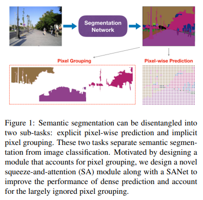
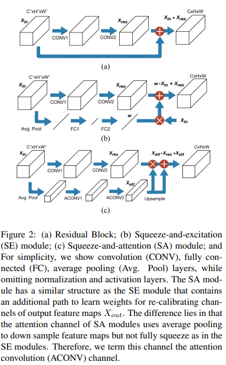
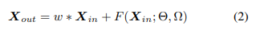
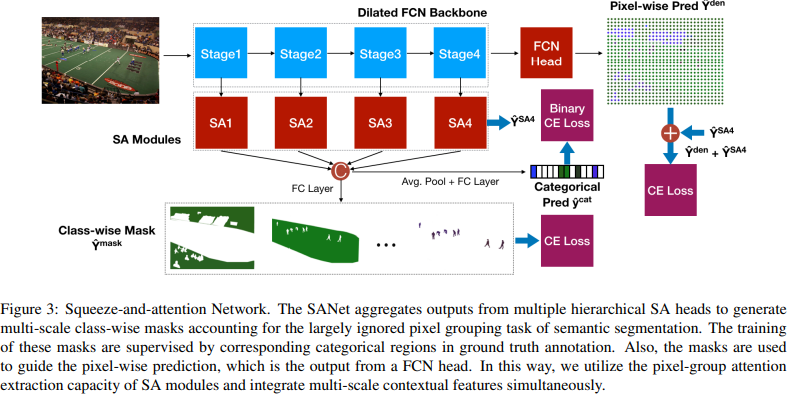
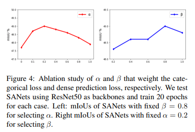
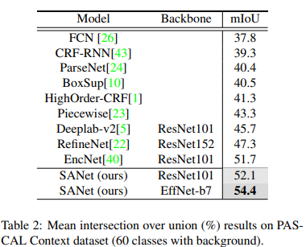
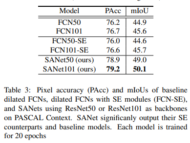
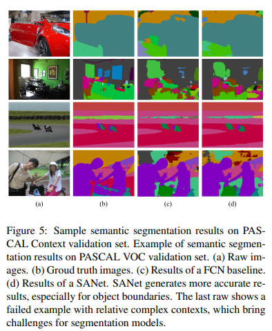
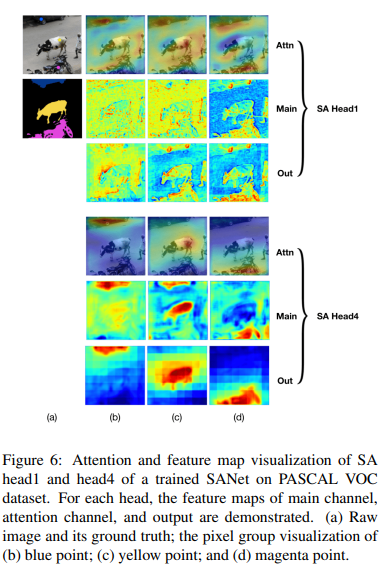

# Zhong et al. / Squeeze-and-Attention Networks for Semantic segmentation/ CVPR 2020

# 1. Problem Definition

RGB 이미지에서 각 픽셀을 특정 라벨로 분류하는 작업 (Semantic Segmentation)을 하는 네트워크를 개발하는 문제를 풉니다. Semantic Segmentation은 이미지 내의 물체들을 의미 있는 단위로 분류하는 작업이며, 이는 자율 주행이나 다양한 비전 소프트웨어에서 사용되고 있습니다. 이번 논문에서 사용한 데이터는 PASCAL Context dataset ( 59 classes, 4998 training images, and 5105 test images)와 PASCAL VOC dataset( 20 classes, 10582 training images, and 1449 validation images, 1456 test images) 두 가지를 사용하였으며, Semantic segmentation 분야에서 네트워크의 성능을 평가하기 위한 benchmark 기준으로 널리 사용되는 dataset입니다.

이를 수식으로 나타내면, RGB color image( height X width X 3 )를 네트워크 인풋으로 입력 받아서 Semantic labels result( height X width X 1 )를 출력하는 문제입니다.

# 2. Motivation

## Related work

Multi-scale context : 

- Laplacian pyramid structure에서 multi scale feature를 결합하는 방식과 multi-path RefineNet에서 multi-scale input에서 feature를 추출해 결합하는 방식을 사용하였는데, 이를 참고하여 이 논문에서는 여러 residual network stage에서 multi-scale의 dense prediction결과를 병합하여 사용함으로서 multi-scale context정보를 활용하였음.
- Laplacian pyramid structure는 이미지 스케일을 점점 줄여나가면서 각 스케일에서 얻은 정보를 모두 합하여 최종 결과물을 만들어내는 구조를 말합니다.
- Multi-path RefineNet에서는 여러 스케일에서 얻은 정보를 작은 스케일부터 큰 스케일로 각 network(path)의 결과를 합쳐가면서 가장 큰 스케일 이미지로 복구하는 방식을 사용하는데, 이때 각 scaled된 이미지가 각 path에 인풋으로 들어가기 때문에 multi-path 방식이라고 합니다.

Channel-wise attention : 

- 피처맵의 채널들에 weight를 부여하여 채널의 가중치를 다르게 함으로서 피처들을 좀 더 자 파악할 수 있다. 대표적인 예시로 Squeeze-and-Excitation(SE) 모듈이 존재하며, 이를 더 발전시켜 Squeeze-and-Attention(SA)모듈을 개발하였다.

Pixel-group attention : 

- 한 채널에서 각 픽셀간의 유사도를 통해 연결성을 강조하여 attention효과를 주는 방법이다. 기존 방법들은 단순히 pixel-level에서의 성능에만 초점을 맞추어 네트워크를 설계한 반면, 이 논문에서는 pixel-grouping을 같이 사용하는 네트워크를 개발하였다.

## Idea

논문의 저자는 Segmentation을 크게 두 개의 독립적인 차원이 얽혀있는 형태로 볼 수 있다고 주장한다. 하나는 pixel-wise prediction이고 하나는 pixel-grouping이다. pixel-wise는 각 픽셀이 무슨 물체인지 판단하는 것이고, pixel grouping은 픽셀 간의 유사도를 통해 연결성을 강조하는 것이다.

기존 논문들은 pixel-level 위주의 아이디어를 사용했다면, 이번 논문에서는 pixel-grouping 기술에도 초점을 맞추어 네트워크를 개발하였다. 

네트워크가 수행하는 업무를 구분하면 크게 두개의 task로 나뉜다.

- Task1 :  image classification을 위해 정확한 pixel-wise annotation과 spatial constraints가 필요하다. 최근 segmentation 모델들은 피라미드 풀링과 dilated convolution layer를 통해 contextual feature를 잘 집합시켜 좋은 결과를 얻어내고 있다. 하지만 커널의 grid 구조 때문에 spatial feature의 shape에 제한이 생기게 되고, 이는 pixel-wise prediction의 결과는 좋게 할 수 있지만 글로벌한 관점에서의 이미지 이해는 부족하다고 할 수 있다.

- Task2 : pixel이 spatial 제한 없이 같은 그룹에 속할 수 있도록 직접적으로 도와주는 작업을 한다. Pixel grouping은 전체 범위에서 샘플링 된 이미지를 semantic spectrum을 통해 정의된 픽셀 그룹으로 변환하는 작업이 포함되어있다. SA모듈을 새로 개발하였으며, 이러한 네트워크를 디자인하게 된 계기는 local constraints of convolution kernel에 의한 제한을 완화하기 위해서였다. SA 모듈은 다운 샘플링하는 과정에서 완전히 하나의 채널로 압축 시키지 않음으로써 local spatial attention을 효율적으로 생성할 수 있게 해줍니다. 또한 기존에 발표된 SE모듈과의 차이점으로는 spatial attention을 통합하는 head unit이 존재하여 multi-stage에서의 정보를 합쳐주기 때문에 성능이 더욱 향상되었습니다.

두 개의 테스크를 요약하자면, 이 논문에서는 4개의 SA모듈을 사용한 SANet을 디자인하였으며, SANet은 앞서 말한 두 개의 task를 모두 수행한다. Multi-scale spatial feature와 non-local spectral feature를 학습함으로서 기존 제한점(거리가 먼 픽셀 간의 spatial한 정보를 잘 학습할 수 없다는 합성 곱 자체의 한계점)을 극복하였고, dilated ResNet과 Efficient nets을 사용하여 효율성을 극대화하였다. 마지막으로 multi-stage의 non-local feature 를 합쳐 성능을 향상 시켰다.

# Method

Figure 2에 나온 모듈은 차례대로 **(a)-Residual, (b)-Squeeze-and-excitation(SE), (c)-Squeeze-and-attention(SA)** 모듈이다. SE모듈은 residual block을 기반으로 설계된 모듈이며, SA 모듈은 SE 모듈의 아이디어를 기반으로 설계되었다. 

먼저, SE 모듈에 대해 설명하자면, Residual block을 re-calibrating feature map channel을 통해 성능을 향상 시킨다. 그림에 나온 것처럼, average pooling으로 인풋 피쳐 맵을 squeeze하여 1x1 벡터를 얻은 다음, fully connected convolution을 통해 W1과 W2를 계산하여  excitation weight를 얻어냅니다. 이렇게 얻은 weight에 X_in에 곱해주어 attention효과를 주고, 이를 X_res 텐서와 합쳐주는 최종 출력을 하는 모듈입니다. 식으로 표현하면 아래와 같다.

SA모듈은 SE모듈에서 완전히 1x1 벡터형태로 Squeeze하는 과정 대신 not-fully squeezed operation을 통해 spatial에 있어서 더 다양한 정보를 가지고 있는 attention map을 생성한다. 또한 X_res에 attention map을 직접 곱해주어 local과 global한 특징을 모두 고려한 attention map을 생성하였다. 식으로 표현하면 아래와 같다.

SA-Network의 전체 모식도는 Fig3에 나와있습니다. SA모듈을 통해 4개의 backbone stage에서 피처를 추출하였으며, Loss는 총 3개의 loss의 비율 합으로 구성이 되어 있습니다. 

각 로스에 대해 정리를 하면 다음과 같습니다.

- Mask loss : 각 클래스에 해당되는 pixel들을 잘 선별했는가를 나타낸다. 그림에서 보이는 것처럼 각 채널은 하나의 클래스에 대해 마스킹이 되어있는데, 이 마스킹의 오차를 loss로 표현한 것이다.
- Categorical loss : 마스킹한 채널을 각 클래스로 잘 분류했는가를 나타낸다.  각 채널들을 특정 클래스로 분류하는 작업을 하며, 정답 라벨과 비교하여 오차를 loss로 표현한 것이다.
- Dense loss : 결과를 합쳐 하나의 Semantic segmentation image로 나타냈을때 pixel-wise loss를 말한다.

**Pixel-group attention에 대한 보충 설명** 

앞서 저자는 segmentation 작업을 두 개의 task로 분리하였고, 그중 pixel-grouping이라는 task가 기존에 많이 알려지지 않았기 때문에 혼란스러울 수 있어서 보충 설명을 하고자 합니다.

단순한 Convolution 곱을 통해서 네트워크가 구성되게 되면, pixel간의 거리가 많이 떨어져 있는 경우 Convolution의 공간적 한계 때문에 두 pixel 간의 정보를 학습하기가 어렵습니다. 자연어 처리를 위한 네트워크들을 보게 되면 단어간 거리가 멀리 떨어져 있어도 서로 간의 연관성을 학습해야 하기 때문에 다양한 attention 모듈을 추가하여 연관성을 네트워크가 학습할 수 있도록 도와주고 있습니다. 이러한 아이디어를 Segmentation에 적용하려는 시도들이 존재했고, 대표적으로 이미지의 픽셀간 correlation을 이용한 self-attention mask를 사용하는 방법이 있습니다.

이 논문에서 pixel grouping은 '같은 class에 속하는 pixel 간의 정보를 spatial한 제한을 받지 않고 연관성을 학습할 수 있도록 해주는 장치' 라고 생각하면 될 것입니다. 저자는 이번 논문에서는 기존에 존재하던 Squeeze-and-excitation(SE) 모듈을 참고하여, 효율적인 방식의 pixel- grouping method인 Squeeze-and-attention(SA)모듈을 적용하였습니다. SA 모듈에 대한 설명은 위에 존재합니다.

# 4. Experiment & Result

## Experimental setup

- Dataset : PASCAL Context , PASCAL VOC
- Baselines : ResNet50, ResNet101
- Training setup :
    - Learning rate : 0.001(PASCAL Context), 0.0001(PASCAL VOC)
    - Optimizer : SGD and poly learning rate annealing schedule adopt
    - Training method :
        - PASCAL Context : 80 epochs
        - PASCAL VOC : COCO pretrained + 50 epochs on the validation set
    - Batch size : 16

## Result

1. 첫번째로 loss에 사용된 알파와 베타의 최적 값을 구한 실험에 대한 결과이다. 알파와 베타는 각 로스들간의 비중을 조절하여 가장 좋은 성능이 나오도록 하는 튜닝이 필요한 Hyper-parameter이다.  알파와 베타 값을 변형시켜가며 성능을 비교해본 결과 알파 = 0.2, 베타 = 0.8일 때 가장 높은 정확도가 나왔다.

    

2. 두번째는 SANet을 다른 최신 모델들과 성능을 비교한 결과이다. table2를 보면 최신 네트워크들에 비해 성능이 뛰어난 것을 확인할 수 있으며 EffNet-b7 네트워크에 SA 모듈을 추가하여 만든 SANet의 경우 mIoU가 54.4로 PASCAL Context dataset의 최고기록을 갱신하였다. 
    
    
    

 

3. SA 모듈이 SE 모듈에 비해 더 좋은 성능을 보여준다는 것을 증명한 결과이다. 앞서 말한것과 같이 SA모듈은 SE 모듈로부터 발전시킨 모듈이기 때문에 성능이 얼마만큼 증가했는지가 이 논문의 노벨티가 될 것이다. table3과 같이 SE모듈에 비해 정확도가 각각 4.1%, 4.5%가 증가한 것을 확인할 수 있다.
    
    
    

4. 다음은 정성적으로 baseline network와 성능을 비교한 결과이다. Fig5에서 (a)는 raw input data, (b)는 ground truth, (c)는Baseline, (d)는 SANet이다. Baseline 으로 사용된 네트워크는 dilated ResNet50 FCN이며, SANet은 Baseline network에 SA모듈을 추가한 네트워크이다. 
    
    fig5의 첫번째 줄은 상대적으로 물체들의 경계와 조합이 단순한 경우이며, 맨 아랫줄은 상대적으로 물체의 구성이 복잡한 경우이다. 두 경우에서 모두 SANet에 baseline에 비해 더 ground truth에 가까운 결과를 보여준다는 것을 알 수 있다. 전체적으로 SANet이 baseline보다는 뛰어나지만, 마지막 이미지와 같이 복잡한 경우에는 아직 더 많은 향상이 필요하다는 것을 알 수 있다.
    

5. 마지막으로 일반적인 convolution의 결과와 SA모듈을 추가하였을때 결과를 global-attention차원에서 비교하기 위한 정성적으로 결과를 비교하였다. (일반적인 convolution 또한 spatial 한 특징을 추출하는 효과가 존재하기 때문에, SA모듈을 추가하였을 때 이러한 성능이 얼마나 더 발전했는지 확인하기 위함이다.) 각 스테이지에서 SA모듈의 attention map의 역할을 보기 위해 head1과 head4의 모듈의 이미지를 추출해 비교하였다. 그림에서 (b), (c), (d)는 각 다른 클래스를 선택한 것이고, 빨간색으로 나타난 부분이 활성화된 곳이다. 각 Head에서의 결과 비교를 통해 Low-level과 high-level에서의 역할이 다른것을 확인할 수 있다.
    - low-level : attn은 시야가 넓은 반면, main은 오브젝트 경계가 보존된 로컬 특징 추출에 중점을 두는 것을 알 수 있다.
    - high-level : attn은 주로 선택된 지점을 둘러싼 영역에 초점이 맞춰져 있으며, main은 low-level 경우보다 더 확실한 semantic meaning을 가진 homogeneous한 결과가 나오는 것을 확인할 수 있다.
    
    즉, Attention map이 main channel의 결과를 보조해주어 더 선명하고 정확한 output을 출력하도록 도와주는 것을 알 수 있다.
    

# Conclusion

- 저자는 semantic segmentation이 두 개의 독립된 차원(pixel-wise prediction and pixel grouping)으로 이루어졌다는 새로운 생각으로부터 이러한 네트워크를 설계하였다. (독립된 차원이라고 저자가 말하였는데, 이 독립의 의미는 두 task를 완전히 분리하여 고려하는 것이 아닌, 두 개의 차원을 모두 고려해야 된다는 의미이다.)
- 개발한 SA 모듈은 pixel-wise dense prediction의 성능도 증가 시켜주며, pixel-grouping의 과정을 잘 적용시킬 수 있도록 해준다.
- 두개의 challenging benchmark dataset에서 좋은 성능을 보여주었다.
- 단순하지만 효과적인 SA모듈이 다른 연구에 유용하게 사용되었으면 좋겠다.

## Take home message

- 많은 논문에서의 딥러닝 네트워크의 아이디어를 설명할 때 다양한 시도를 한 후 결과가 좋게 나오면 그에 맞게 짜맞춰서 설명을 하는 느낌을 많이 받았었는데, 이 논문에서는 네트워크를 이미지를 학습하는 과정에 대해 다른 시선으로 바라보고 그것을 구현하여 적용했다는 점이 인상깊었다.
- 사실 SE 모듈과 크게 다른지 않은 SA모듈을 개발하였지만, 성능은 눈에 띄게 큰 발전을 보여주었다. 아직 네트워크 설계에 있어서 많은 공부가 필요하지만, 이러한 사소한 변화가 큰 결과로 이어지는 것을 보면 기초적인 내용을 완벽하게 학습해야 할 필요성에 대해 느끼게 되었다.

## Author / Reviewer information

### Author

**정구일 \(Guil Jung\)** 

* M.S. student, Electrical Engineering Department, KAIST
* Interested in Biomedical Imaging 
* jgl97123@kaist.ac.kr

### Reviewer

1. Korean name \(English name\): Affiliation / Contact information
2. Korean name \(English name\): Affiliation / Contact information
3. ...
