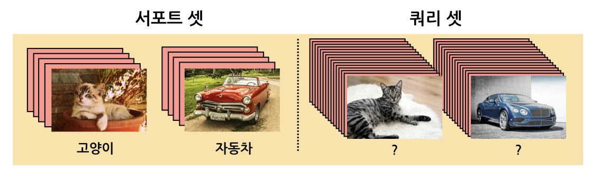
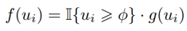

# FSCE: Few-Shot Object Detection via Contrastive Proposal Encoding \[Kor\]

##  1. Problem definition

**Few-Shot Object Detection (FSOD) = Few-shot learning + Object detection**

> recognize previously unseen objects given very few training examples

Few-shot object detection은 퓨샷 러닝과 객체 검출이 합쳐진 문제로, 적은 양의 데이터를 통해 영상에서 객체를 검출한다.

#### Few-shot learning

일반적인 딥러닝 모델은 많은 양의 데이터를 통해 학습한다. 하지만 많은 양의 데이터를 수집하고 labeling하는 데에 많은 시간과 비용이 들며, 실제 상황에서는 충분한 데이터를 확보하기 어려운 경우가 존재한다. 따라서 최근에는 **적은 양의 데이터로 모델을 학습하는 퓨샷 러닝**이 연구되고 있다. 

퓨샷 러닝 문제에서 데이터셋은 훈련에 사용하는 서포트 셋(Support set)과 테스트에 사용하는 쿼리 셋(Query set)으로 구성된다. 서포트 셋의 구성에 따라 해당 문제를 **N-way K-shot 문제**라고 부른다. 이때 N은 class의 수, K는 class별 이미지의 수를 의미한다.  예를 들어 위 그림의 경우는 2개의 class, 각 class별로 5장의 서포트 이미지로 구성되어 있으므로 2-way 5-shot 문제가 된다. N이 클수록, K가 작을수록 어려운 문제가 된다. 쿼리 이미지는 주로 15장이 사용된다.

#### Object detection

위 그림의 세 번째 그림에서 볼 수 있듯이, Object detection은 객체의 위치를 찾는 **Localization 문제**와, 객체를 분류하는 **Multi-labeled classification 문제**가 합쳐진 문제이다. object detector는 이 두 문제를 동시에 혹은 순차적으로 수행하는지에 따라 크게 1-stage 혹은 2-stage object detector로 나뉜다. 본 논문에서는 2-stage object detector의 구조를 따른다.

## 2. Preliminary

**1. Faster R-CNN**

본 논문에서도 사용한, 2-stage object detector의 가장 대표적인 모델인 Faster R-CNN의 구조를 간단히 살펴보면, 영상을 입력받아 feature를 뽑고 RPN(Region Proposal Network)을 통해 객체의 위치를 나타내는 proposal들을 생성한다. 이 proposal들과 feature를 가지고 RoI pooling을 진행한 뒤 classification과 box regression을 진행한다. 즉, 영상 내에 존재하는 여러 객체들을 먼저 찾고, 그 객체가 어떤 객체인지 분류하여 최종적으로 객체의 class label과 위치 정보(Bounding box)를 출력한다. 

**2. Two-stage fine-tune based approach (TFA)**

TFA는 크게 base training과 few-shot fine-tuning 단계로 나뉜다. 먼저 첫번째 base training 단계에서는 base class의 충분한 영상을 이용하여 detector 모델 전체를 학습한다. 그 다음 few-shot fine-tuning 단계에서는 base class와 새로운 class의 소량의 영상만을 이용하여 모델의 다른 부분들은 다 freeze하고 마지막 box classifier와 box regressor만 fine-tuning을 진행한다. 이는 이전의 전체 모델을 fine-tuning하던 jointly fine-tuning보다 성능 향상을 보이며 base class로부터 학습한 feature extractor가 새로운 class에 대해 잘 전이(transfer)될 수 있음을 보였다. 

## 3. Motivation

### Related work

#### Few-shot learning

퓨샷 러닝 모델이 적은 샘플로도 새로운 데이터에서 잘 작동할 수 있도록, 기계 스스로 학습규칙을 도출할 수 있게 하는 메타러닝(Meta-learning)을 적용한다. 에피소딕 훈련(Episodic learning) 방식을 통해 각 에피소드(episode)에 대한 메타 모델을 훈련시키며, 이떄 각 에피소드에 포함되는 class는 서로 겹치지 않는다.

#### Few-shot object detection

많은 연구들은 메타러닝 기반의 접근법을 통해 FSOD 문제를 해결한다. 하지만 이전에 제안되어온 복잡한 알고리즘들은 FSOD에서 쉽게 과적합되고 테스트 성능이 낮아질 수 있다. 본 논문에서는 새로운 class에 대한 AP의 감소는 주로 새로운 instance를 혼동되는 다른 class로 잘못 분류하는 데에서 비롯됨을 이야기하며, 복잡하지 않은 모델을 위해 contrastive learning을 도입한다.

#### Contrastive learning

Self-supervised learning에서 주로 사용하는 Contrastive learning은 positive pair로 정의된 서로 유사한 instance들은 가까워지도록, negative pair로 정의된 서로 다른 instance들은 멀어지도록 학습한다. 최근에는 이를 batch 단위로 접근하여 Supervised learning에도 적용한다. 

### Idea

> We find in fine-tuning based few-shot object detector, classification is more error-prone than localization.

위 그림은 Faster R-CNN을 사용하여 실험한 내용으로, 새, 소파, 소는 새로운 class에 해당한다. 가운데 그림은 새와 소파에 대해 가장 높은 점수를 갖는 20개의 RPN proposal을 나타내며, 오른쪽은 소에 대한 detection 예시를 보여준다.  누군가는 FSOD에서 새로운 object가 background로 여겨져 이에 대한 localization 성능이 떨어짐으로써 성능저하가 일어날 것이라고 추측할 수도 있다. 그러나 그림에서 볼 수 있듯이 fine-tuning 단계에서 RPN은 새로운 instance에 대해 충분한 proposal을 찾아내며 box regressor 또한 localization을 상당히 정확하게 해낸다. 하지만 오른쪽 그림과 같이 검출된 새로운 instance가 종종 혼동되는 다른 class로 잘못 분류되는 것을 볼 수 있다. 따라서 본 논문에서는 서로 다른 class이지만 비슷한 객체 간의 instance 유사도를 감소시키는 것을 목표로 한다.

Supervised contrastive learning에서는 positive pair를 늘리기 위해 동일한 class의 intra-image augmentation을 한다. 저자들은 위 가운데 그림의 box들처럼 서로 다른 IoU 값을 갖는 proposal들이 contrastive 접근에서 intra-image augmentation과 유사하다고 생각하여 supervised contrastive learning을 적용한다. Proposal간의 similarity를 재는 score function을 제시하며, 같은 class에 해당하는 proposal 간의 score가 서로 다른 class에 해당하는 proposal간의 score보다 높은 값을 갖도록 학습이 진행된다. 즉, intra-class의 variance는 작고, inter-class의 variance는 커지게 된다.

본 논문에서는 Supervised contrastive learning을 FSOD에 처음으로 도입한다. 

## 4. Method

**Rethink the two-stage fine-tuning approach**

앞서 설명드린 TFA는 나머지 구조는 freeze한 채로 마지막 두 layer에 대해서만 fine tuning을 진행한다. 하지만 base data로만 학습한 RPN, feature extractor가 어떠한 학습도 없이 바로 새로운 class에 전이될 수 있다는 것은 직관에 어긋난다. Baseline TFA에서는 RPN과 RoI feature extractor가 unfreeze되면 성능이 저하되지만, 저자는 이들이 적절하게 학습이 된다면 성능 향상에 도움이 될 수 있음을 알아냈다. 따라서 제안하는 방법인 FSCE는 TFA와 같이 충분한 base class data로 Faster R-CNN을 학습한 뒤 base class와 새로운 class로 구성한 data로 fine-tuning을 진행하지만, backbone의 feature extractor는 여전히 frozen되어 있는 반면, RPN과 RoI feature extractor는 학습이 이루어진다.

**Strong baseline**

첫번째 그래프를 보면 기존 TFA의 fine-tuning 단계에서의 RPN의 positive anchor 수가 base training에서보다 ¼ 정도인 것을 확인할 수 있다. Fine-tuning 초기에는 새로운 object가 RPN에서 낮은 objectness score를 얻기 때문에 NMS를 통과하여 RoI head로 도달하게 되는 새로운 object에 대한 positive anchor가 더 적어진다. 따라서 이렇게 낮은 objectness score를 갖는 positive anchor를 살리기 위해 RPN과 RoI에 두 가지 수정사항을 적용한다.

1. NMS를 통과하여 남는 proposal의 최대 개수를 두 배로 한다.

   * 새로운 instance에 대한 foreground proposal을 더 많이 남긴다.

2. 손실 함수 계산에 쓰이는 RoI head에서의 proposal 수를 절반으로 한다.

   * fine-tuning 단계에서 삭제되는 절반의 proposal은 background만을 포함하고 있기 때문이다.

### 1. Contrastive object proposal encoding

데이터가 부족한 few-shot 환경에서는 제한된 shot을 통해 robust한 feature를 뽑아내는 것이 어려워 class 수준의 margin을 이용하는 classifier는 잘 작동하지 않는다. 따라서 본 논문에서는 instance 수준의 class내의 유사성과 class간의 구별성을 위해 RoI head에 contrastive branch가 추가하여, 각 proposal들로부터 얻은 RoI feature를 contrastive feature로 표현한다. 이 feature들 간의 similarity score를 계산하여 contrastive objective를 최적화한다.

### 2. Contrastive Proposal Encoding (CPE) Loss

$$N$$ 개의 RoI box features는 $$\{z_i,u_i,y_i\}_{i=1}^N$$ 로 표현된다. $$z$$ 는 contrastive feature, $$u$$ 는 IoU score, $$y$$ 는 ground truth label을 나타낸다. $$N_{y}$$ 는 같은 label $$y$$ 에 해당하는 proposal의 개수이다.  ~는 normalized feature를 나타내며, $$\tilde{z_i}\tilde{z_j}$$ 는 i번째와 j번째 proposal간의 cosine similarity를 의미한다. 따라서 $$L_{z}$$ 는 같은 label이면 가깝게, 다른 label이면 멀게 만듦으로써, 각 class는 더 tight한 cluster를 만들고, cluster간의 거리는 커지게 된다.

**Proposal consistency control** 

IoU 값이 너무 작은 proposal의 경우 object의 center에서 너무 벗어나 관련없는 semantic 정보를 포함하고 있을지도 모른다. 따라서 IoU가 threshold 값 이상인 proposal에 대해서만 계산을 하고 $$g(\cdot)$$ 를 통해 weight를 주어 proposal의 consistency를 조절한다.

**Training objectives**

base training 단계에서는 rpn, cls, reg loss로 학습되고, fine-tuning 단계에서는 CPE loss까지 더해져 학습된다. 이때 loss의 scale을 맞춰주기 위해 Lamda = 0.5로 설정한다.

## 5. Experiment & Result

### Experimental setup

* Dataset : PASCAL VOC, COCO

* Detection model : Faster-RCNN with Resnet-101, Feature Pyramid Network(FPN)

* Training setup

  * batch size : 16
  * standard SGD with momentum 0.9 and weight decay 1e-4

* Evaluation metric : AP, nAP(novel Average Precision)

  

### Result

PASCAL VOC에 대한 실험 결과이다. 총 20개의  class는 15개의 base class, 5개의 novel class로 나뉜다. 아래 표는 K=1,2,3,5,10일때의 nAP50을 나타낸 것으로, 각 novel instance는 novel class에서 random sampling을 통해 설정한다. 제안 기법인 FSCE가 모든 split에 대해, 어느 shot에 대해 가장 좋은 성능을 보임을 확인할 수 있다.

다음은 COCO에 대한 실험 결과이다. 총 80개의  class 중에서  60개는 base class로, PASCAL VOC와 겹치는 20개는 novel class로 나뉜다. 아래 표는 K=10, 30일때 novel class에 대한 COCO-style AP와 AP75를 나타낸다. 마찬가지로 제안기법에서의 성능 향상을 확인할 수 있다.

### Ablation

위 표는 본 논문에서 제안한 각 수정사항 및 추가사항들이 성능 향상에 의미가 있음을 보여준다. 이외에 contrastive feature의 dimension, CPE loss에서의 temperature, Proposal consistency control에서의 IoU threshold 값, 가중치 함수 $$g(\cdot)$$ 등에 따른 ablation도 본 논문에서 확인할 수 있다.

object proposal embedding을 시각화한 (a),(b)는 CPE loss가 class내의 유사도와 class간의 차이를 잘 모델링 했음을 보여준다. (c)를 통해서는 기존의 TFA에서 잘 분류하지 못하던 case들을 FSCE에서는 잘 분류하는 결과를 확인할 수 있다.

## 6. Conclusion

본 논문은 contrastive proposal encoding을 통해 localization은 잘 되지만 다른 class로 잘못 분류되는 문제를 효과적으로 해결함으로써 FSOD를 수행한다. 이는 PASCAL VOC와 COCO에서 SOTA를 달성하였다.  contrastive head는 cost가 적고 적용하기 쉽기 때문에 이를 기반으로 하는 더 많은 연구가 기대된다.

### Take home message \(오늘의 교훈\)

> The degradation of average precision (AP) for rare objects mainly comes from misclassifying novel instances as confusable classes.
>
> With our modified training specification for fine-tune stage, the class-agnostic RPN and RoI head can be directly transferred to novel data and incur huge performance gain, this is because we utilize more low-quality RPN proposals that would normally be suppressed by NMS and provide more foregrounds to learn given the limited optimization opportunity in few-shot setting.
>
> Our CPE loss guides the RoI feature extractor to establish contrastive-aware objects embeddings, intra-class compactness and inter-class variance ease the classification task and rescue misclassifications.

## Author / Reviewer information


You don't need to provide the reviewer information at the draft submission stage.


### Author

**박연주  \(Yeonju Park\)** 

* KAIST EE
* yeonju29@kaist.ac.kr

### Reviewer

1. Korean name \(English name\): Affiliation / Contact information
2. Korean name \(English name\): Affiliation / Contact information
3. ...

## Reference & Additional materials

1. Sun, Bo, et al. "FSCE: Few-shot object detection via contrastive proposal encoding.“ *Proceedings of the IEEE/CVF Conference on Computer Vision and Pattern Recognition*. 2021.
2. https://github.com/MegviiDetection/FSCE
3. S. Ren, K. He, R. Girshick, and J. Sun. Faster r-cnn: Towards real-time object detection with region proposal networks. arXiv preprint arXiv:1506.01497, 2015.
4. Wang, Xin, et al. "Frustratingly simple few-shot object detection." *arXiv* *preprint arXiv:2003.06957* (2020).
5. https://www.kakaobrain.com/blog/106
