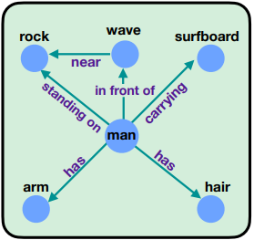
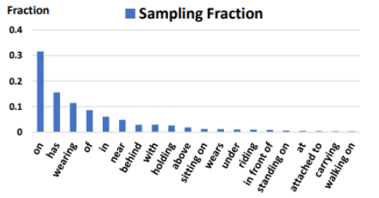
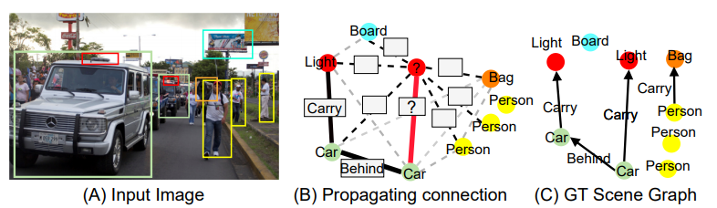
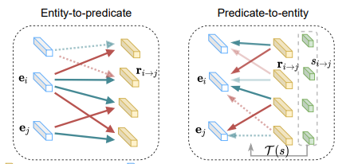
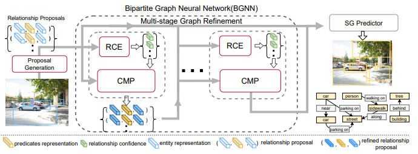
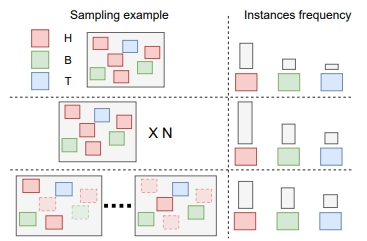
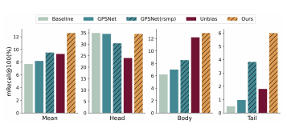
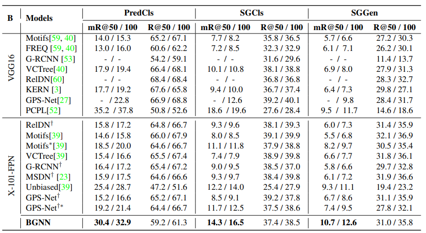

---
description: Li et al. / Bipartite Graph Network With Adaptive Message Passing For Unbiased Scene Graph Generation / CVPR 2021
---    


# \(BGNN\) Bipartite Graph Network With Adaptive Message Passing For Unbiased Scene Graph Generation \[Kor\]   


##  1. Problem definition  

## Paper Topic  
*Scene Graph Generation(SGG) in Computer Vision*  

Scene Graph Generation은 이미지가 주어졌을 때 Scene Graph로 변환하는 Task를 의미한다. 예를 들어, 왼쪽의 이미지가 주어졌을 때 오른쪽 그림과 같은 Graph로 만드는 것이다. Graph의 Node은 Entity(e.g.사람, 돌)을 의미하고 Edge의 경우에는 두 Node 사이의 Edge는 Entity 사이의 Predicate(술어)를 의미한다. "**사람이 돌 위에 있다**"라고 한다면 Node는 "**사람**", "**돌**"이 될 것이고 Edge(Predicate)은 "**standing on(위에 서 있다)**"가 될 것이다.  

<!--    -->

  

  

그림 출처: [CVPR 21]Energy-Based Learning For Scene Graph Generation  


## 2. Motivation

Scene Graph Generation(SGG) 할 때의 Main Challenge 중에 하나가 Predicate(e.g standing on, has)의 Distribution이 Long-Tailed로 되어있다는 점이다. SGG에서의 Benchmark Dataset 중에 하나는 "Visual Genome(VG)"이다. VG의 Image에서 나오는 Predicate를 보면 아래와 같은 Distribution을 갖고 있다.  

  

그림 출처 : [CVPR 20]Unbiased Scene Graph Generation from Biased Training


Long-Tailed Distribution을 고려하지 않고 모델링을 하게 된다면 Training에서 많이 나오는 "On, Has" 등의 Predicate가 많이 학습될 것이고, Test에서 Long Tailed에 해당하는 Predicate가 나오더라도 비슷한 의미인 경우 Head Tailed 부분의 Predicate를 맞출 것이다. 
예를 들면 'Standing On'이 Test에 나오더라도 비슷한 의미인 'On'을 맞추게 될 것이다. 이렇게 되면 정확한 Scene Graph를 만들지 못하게 될 것이다.   

### Related work

#### Scene Graph Generation  

아래의 3개의 논문과 같은 경우에는 Sparse Graph가 아닌 모든 Entity간에 Predicate가 연결되어 있다고 가정하여 Scene Graph를 만들어낸다. 이렇게 되면 모든 Entity Pair의 경우를 고려할 수 있겠지만, 의미 없는 Entity Pair의 Predicate를 만들어내는 것은 Noise를 발생 할 수 있다.  
```text   
Scene graph generation by iterative message passing(CVPR 17)  
Scene Graph Generation from Objects, Phrases and Region Captions(ICCV 17)  
Gps-net: Graph property sensing network for scene graph
generation(CVPR 20)  
```  
#### Long-Tailed  

Long-Tailed 문제로 Biased Prediction 문제를 해결해온 Effort들이 존재한다. Long Tailed Problem을 해결하기 위해 여러가지 Technique을 사용했다. 
아래와 같은 논문의 경우에는 Loss를 새롭게 Design하여 해결하고자 했다.  
``` text  
Graph Density-Aware Losses for Novel Compositions in Scene Graph Generation(ECCV 17)  
Pcpl: Predicate-correlation perception learning for unbiased scene graph generation(MM 20)
```    

### Idea

이 논문에서는 Introduction에서 언급한 것과 같이 Predicate의 Long Tailed Distribution Problem을 다룬다. 일반적인 Scene Graph Generation을 할 때는 모든 Node간에 Predicate가 존재한다고 가정하여 Fully Connected Graph를 만들고 진행한다. 하지만, 논문에서는 두 Node간에 Predicate가 meaningless한 경우에는 Scene Graph에게 Negative Effect를 줄 것이라고 말한다. 따라서, 이 논문에서는 두 Node간에 Meaningless한 Predicate를 골라내는 Confidence Module를 이용하게 된다. 논문에서는 아래의 그림을 보여주며 **네모**칸을 없애면 Accurate Graph를 만든다고 주장한다.  

  

Confidence Module 뿐만 아니라 'Bi-Level Sampling'이라는 Sampling 기법을 이용하여 Long-Tailed Problem을 핵심적으로 다루고 있다고 할 수 있다.  


## 3. Method

> 모델을 설명하기 전에 Scene Graph의 경우에는 'Faster-RCNN'와 같은 Object Detection Module를 사용하여 Bounding Box와 Object Class Distribution이 주어지게 된다. 주어진 Bounding Box를 Graph에서의 하나의 Node라고 생각하면 된다.   

### 1. Bipartite Graph Construction  

Image가 주어졌을 때, Entity를 아래 그림과 같이 Bipartite Graph에서 한 Group은 Entity Group으로 나타내고, 다른 한 Group은 Predicate가 존재한다. **Introduction**에서는 두 Node간에 Meaningless Predicate가 존재하면 Noise가 발생한다고 했지만, Graph Construction할 때는 먼저 두 Node간에 Predicate가 존재한다고 가정하고 시작한다. (이후에, 존재하는지 안하는지를 Modeling한다)  

  

Bipartite Graph에 Direction을 준 이유는 Message Passing 할 때, Entity->Predicate와 Predicate->Entity의 Message Passing을 다르게 해주기 위해서다. 
  
Fully Connected Graph이기 때문에 Pair Node간에는 Predicate Proposal이 존재하여 위의 오른쪽 그림과 같이 한 Predicate Proposal에는 두 Node Pair와 연결되어 있다.  
(Proposal : Ground Truth Predicate는 아니지만 가정하는(?) Predicate)  

---  

### 2. Relation Confidence Estimation(RCE) + Confidence Message Passing(CMP)  

  

* RCE  

위의 그림의 "RCE" Branch를 의미한다. 이 Module은 두 Node 간에 Meaning Predicate인지 확인하기 위한 Branch라고 생각하면 된다.  

$$s_{i->j}^m=g_x(r_{i->j}\oplus p_i \oplus p_j) \in \mathbb{R}^{|C_{p}|} $$  

$$r_{i->j}: Union Feature$$  

$$p_{i} :Bounding Box의 Class Probability$$  

위의 Class Confidence는 Predicate Proposal이 각 Predicate마다 얼마나의 Confidence를 갖고 있는지 나타낸다. 만약 전체적으로 Predicate에 대한 Confidence가 낮아서 **의미없는** 정보를 갖고 있다면 전체적인 Predicate의 Confidence 값은 낮아지게 될 것이다.  

$$s_{i->j}^b = \sigma(w_{b}^Ts_{i->j}^m),w_{b} \in \mathbb{R}^{C_p}$$   

위의 식은 두 Node간에 Meaning Predicate가 존재하는지의 Global Confidence Score(Scalar)라고 생각하면 된다. 만약 Score가 높다는 것은 두 Node간에 Meaning Predicate가 존재하는 것이라고 생각할 수 있고, 낮으면 Meaningless라고 생각하면 된다.  


* CMP  

CMP Branch는 **RCE**의 Branch로 알게 된 Confidence Score를 통해 Message Passing을 한다. **Graph Construction**에서 설명했듯이 Entity->Predicate와 Predicate->Entity의 Message는 다르게 Propagation 되어야 한다.  

$$r_{i->j}^{l} = r_{i->j}^{l} + \phi(d_{s}W_{r}^{T}e_{i}^{l} + d_{o}W_{r}^{T}e_{j}^{l})$$   

$$d_s = \sigma(w_s^T [r_{i->j}^{l}\oplus e_i^l]), d_o = \sigma(w_o^T [r_{i->j}^l \oplus e_j^l])$$    

$$e_i^l : Entity Feature$$  

위의 식은 Entity->Predicate의 Message Passing을 나타낸다. 위의 식을 해석하면 간단하다. Entity에서 Predicate로 Message를 Passing할 때는 Entity와 Relationship Proposal을 보고 Message를 얼마나 Passing할 것인지 결정한다.    

Predicate->Entity일 때는 Predicate에 아직 **가정**이기 때문에 많은 Noise가 존재한다. 아직 의미 있는 Predicate인지 모른다. 따라서 Predicate에서 Entity로 Message Passing이 일어날 때는 **RCE**의 Global Confidence Score를 통해서 Noise를 줄여준다고 생각하면 된다.  

Global Confidence Score는 Gating Function을 통해 Hard Control하게 되는데, 1보다 커지면 1로 Clip하여 더 큰 것을 고려 안하고, 1보다 작아지면 0으로 Clip하여 더 작아지게 하지 않는다.  
  
Entity->Predicate로 Message를 줄 때 한 번 Confidence Score로 거른 다음에, Global Confidence Score를 통해서 한 번더 걸러서 Noise를 제거한다. Predicate->Entity로 Message를 줄 때 위의 식과 유사하지만 Global Confidence Score를 Message에 한 번 더 곱해서 걸러진다고 생각하면 된다.

---  

### 3. Bi-Level Resampling  

Train Data를 학습시킬 때 Random하게 Image를 뽑는 것이 아니라 Predicate의 Distribution에 따라 선택되게 하는 것이다. 2단계에 걸쳐서 Sampling하게 되는데, 첫 번째로 Image-level로 Image를 여러 개로 만들어낸 다음에, 두 번째로 Instance-Level Sampling으로 한 Image에서 Predicate를 일정 확률로 Drop-out시킨다.  

  

* Image-Level Over-Sampling  

위의 그림 두 번째처럼 Image를 한 Image에서 이미지 내의 Predicate가 가장 많은 수만큼 Image를 OverSampling한다.  
 
$$r^c = max(1, \sqrt{t/f^c}$$    

$$f^{c} : 전체 데이터에서 나타나는 Predicate의 Frequency$$   

$$t : Oversampling을 조절하는 Hyperparameter$$  

각 Image당 Predicate의 Frequency가 높은 비율로 Image를 Oversampling하게 된다.

* Instance-level Under-Sampling  

위의 그림 세 번째처럼 Image내에서 Predicate를 Drop시킬지 안 시킬지 결정하게 된다. 만약 전체적으로 Predicate가 Head 부분으로 많이 나오게 된다면 Drop확률을 증가시켜 Drop시킨다.  

$$d_i^c = max((r_i-r^c)/r_i * \gamma_d, 1.0)$$  
 
$$\gamma_d : Drop-out Rate를 조절하는 hyperparameter$$  

Droput-Rate는 위와 같은 식을 통해서 정해진다. 위의 식으로 예시를 들면 아래와 같다.

Image-level로 $r_i$가 0.5로 Image 중에 Max값일 때, $c$가 강아지로 $r_c$가 0.2이고 Hyperparameter가 1이면 0.6($d_i^c$) 값을 갖게 된다. 즉, 강아지를 0.6확률로 Dropout 시킨다는 의미이다.  


Image-level과 Instance-level로 Bi-level Sampling을 하게 된다면 Long-Tailed Distribution을 고려하여 Sampling하게 될 것이다.   

## 4. Experiment & Result

### Experimental Setup  

* Datset  
Scene Graph Generation을 할 경우에는 Benchmark Dataset으로 Visual Genome Dataset을 많이 사용한다. 그리고 Open Images도 사용하여 다양한 Baseline과 비교했다.   
* Baseline  
1. Pcpl:Predicate-correlation perception learning for unbiased scene graph generation(MM 20) -SOTA  
2. Neural motifs: Scene graph parsing with global contex(CVPR 18)  
3. Graph r-cnn for scene graph generation(ECCV 18)
4. Learning to compose dynamic tree structures for visual contexts(CVPR 19)  
5. Graphical Contrastive Losses for Scene Graph Generation(CVPR 19)  
6. Knowledge-embedded routing network for scene graph generation(CVPR 19)  
7. Gps-net: Graph property sensing network for scene graph
generation(CVPR 20)  
8. Unbiased scene graph generation from biased training(CVPR 20)  


* Training Setup  
Convolution Feature를 얻어내기 위해서 ResNet-101을 Backbone으로 사용했고, Faster R-CNN을 통해 Object Dectection을 진행했다. Training할 때는 위의 Parameter를 Frozen상태로 Training을 진행했다. 즉, Backbone쪽과 Detector쪽의 Parameter를 Pretrained된 것을 사용한다. 


* Evaluation Metric : Recall@K, mean recall@K  
PredCls : 한 Image에서 Subject-Predicate-Object가 주어졌을 때, Predicate만을 보고 맞췄는지에 따라 Recall를 준다.  
SGCls : 한 Image에서 Subject-Predicate-Object가 있을 때, 3개의 Triple을 모두 맞췄을 경우에 따라 Recall를 준다.  
SGGen : 위의 SGCls의 조건에다가 Object Detect를 했을 때, Ground Truth Bounding Box와의 IoU가 0.5이상인 경우에 맞췄다고 생각한다.  

### Result  

이 논문은 Long-Tailed Distribution의 문제를 다루었기 때문에 Long-Tailed에 해당하는 결과를 보여준다. 뿐만 아니라 전체적인 Recall 값은 Baseline Model과 비교했을 때 좋은 성능을 보이고 있다.  

  

**GPS-Net**과 **Unbias** 두 Model도 Long-Tailed Distribution을 다룬 논문이다. 그럼에도 불구하고 해당 모델이 Long-Tailed를 더 잘 잡아낸다고 볼 수 있다.  

다른 Baseline과의 실험 비교한 결과(Recall)는 아래와 같다.  

  

SOTA Model의 경우에는 PCPL으로 mean Recall에서는 낮지만, Recall의 경우에는 Proposed Method가 더 높은 것을 볼 수 있었다. 


## 5. Conclusion

SGG에서 Long-Tailed 문제가 더 심각한데 이 논문에서는 Confidence Module를 넣어 두 Node의 Predicate가 Meaning한지를 먼저 잡아내서 Noise를 잡아낸 후, Message Passing을 하게 된다. 그리고 Bi-Level Resampling 방법을 이용하여 Long-Tailed Distribution에 맞게 Sampling한다.  

### Take home message \(오늘의 교훈\)

> Scene Graph Generation할 때 Long-Tailed 문제를 같이 고려하는 것이 이 분야에서 중요하다는 것을 알려준다.  

> 만약 Long-Tailed 문제를 Focusing하는 논문일 경우에 Recent Paper 중에 해당 문제를 다루고 있는 논문과의 비교의 필요성 존재  

> Confidence Module를 통해 Live한 방법으로 Entity Pair를 잘라내는 것이 아니라, Module내에서 의미있는 Predicate가 존재하는지 학습과정에서 나오게 하는 방법론을 다른 곳에 적용 가능성 존재

## Author / Reviewer information

### Author

**김기범(Kibum Kim)** 

* KAIST ISysE(산업및시스템공학과) 석사생
* Research Topic : Recommendation, Graph Neural Network


## Reference & Additional materials

* [Github(Implementation)](https://github.com/SHTUPLUS/PySGG)   
* Reference(Part)  
1. Tang, K., Niu, Y., Huang, J., Shi, J., & Zhang, H. (2020). Unbiased scene graph generation from biased training. In Proceedings of the IEEE/CVF Conference on Computer Vision and Pattern Recognition (pp. 3716-3725)  
2. Yan, S., Shen, C., Jin, Z., Huang, J., Jiang, R., Chen, Y., & Hua, X. S. (2020, October). Pcpl: Predicate-correlation perception learning for unbiased scene graph generation. In Proceedings of the 28th ACM International Conference on Multimedia (pp. 265-273).  
3. Zellers, R., Yatskar, M., Thomson, S., & Choi, Y. (2018). Neural motifs: Scene graph parsing with global context. In Proceedings of the IEEE Conference on Computer Vision and Pattern Recognition (pp. 5831-5840).
vision, pages 2980–2988, 2017    
4. Yang, J., Lu, J., Lee, S., Batra, D., & Parikh, D. (2018). Graph r-cnn for scene graph generation. In Proceedings of the European conference on computer vision (ECCV) (pp. 670-685).  
5. Tang, K., Zhang, H., Wu, B., Luo, W., & Liu, W. (2019). Learning to compose dynamic tree structures for visual contexts. In Proceedings of the IEEE/CVF Conference on Computer Vision and Pattern Recognition (pp. 6619-6628).  
6. Zhang, J., Shih, K. J., Elgammal, A., Tao, A., & Catanzaro, B. (2019). Graphical Contrastive Losses for Scene Graph Generation.  
7. Chen, T., Yu, W., Chen, R., & Lin, L. (2019). Knowledge-embedded routing network for scene graph generation. In Proceedings of the IEEE/CVF Conference on Computer Vision and Pattern Recognition (pp. 6163-6171).  
8. Suhail, M., Mittal, A., Siddiquie, B., Broaddus, C., Eledath, J., Medioni, G., & Sigal, L. (2021). Energy-Based Learning for Scene Graph Generation. In Proceedings of the IEEE/CVF Conference on Computer Vision and Pattern Recognition (pp. 13936-13945).  
9. Lin, X., Ding, C., Zeng, J., & Tao, D. (2020). Gps-net: Graph property sensing network for scene graph generation. In Proceedings of the IEEE/CVF Conference on Computer Vision and Pattern Recognition (pp. 3746-3753).  
.....


