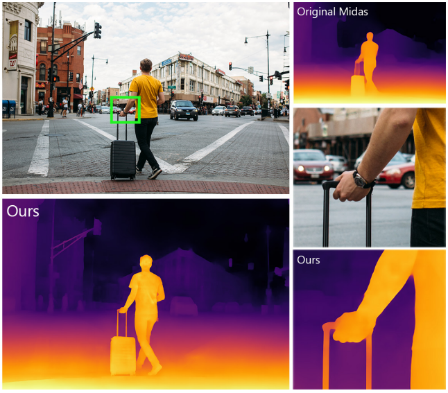
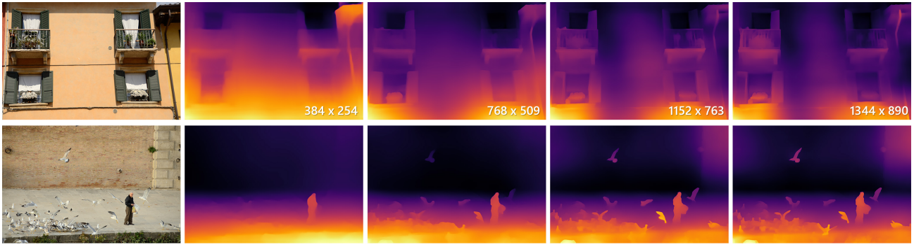
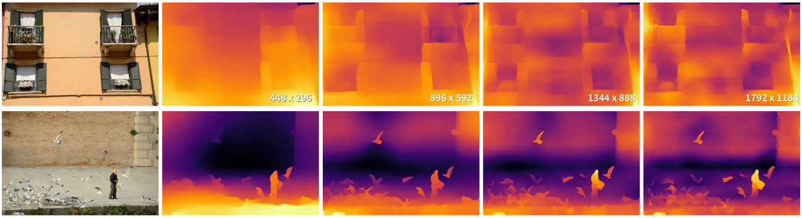
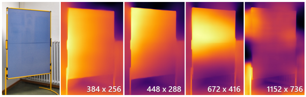
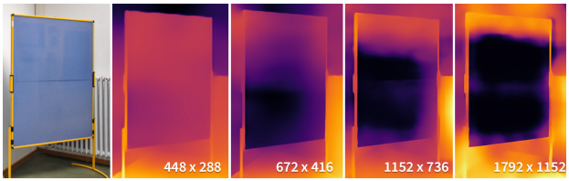
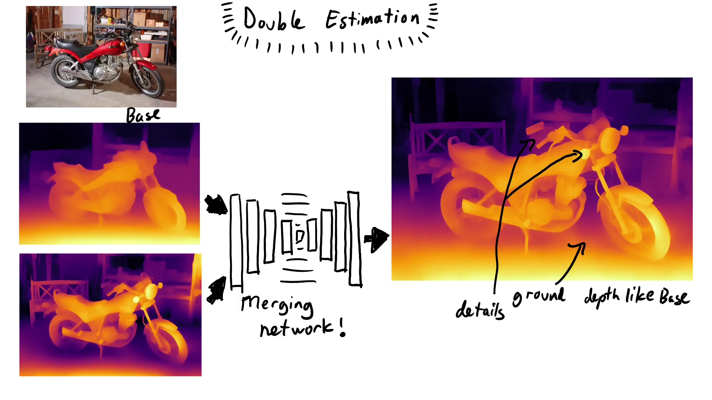
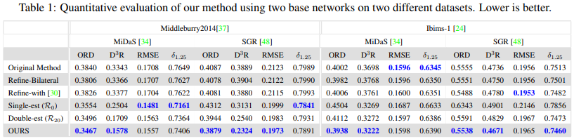
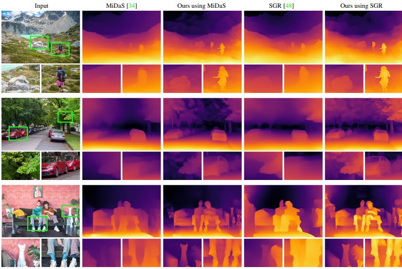
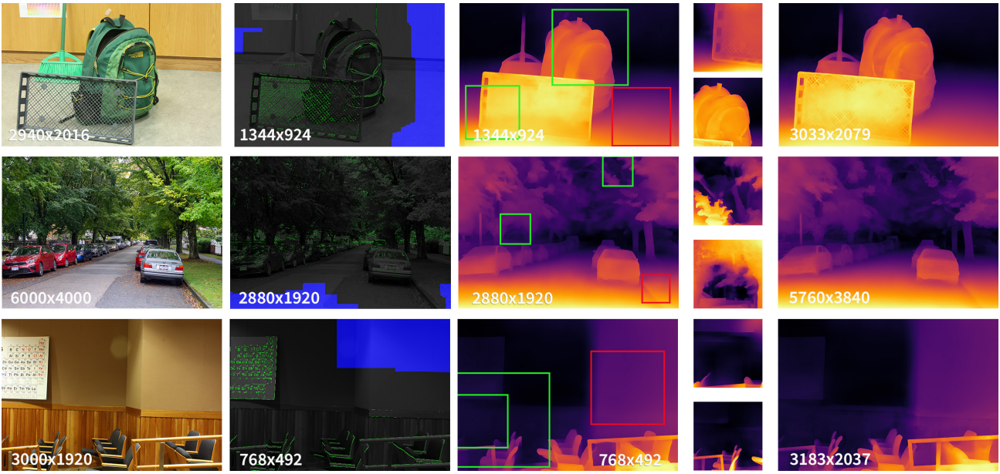
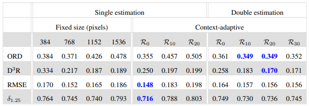

# Boosting Monocular Depth Estimation Models to High-Resolution via Content-Adaptive Multi-Resolution Merging \[Eng\]


Boosting Monocular Depth Estimation Models to High-Resolution via Content-Adaptive Multi-Resolution Merging \[Eng\]




## TLDR; Generate High Resolution Depth Map using Pretrained Monocular Depth Estimation Network

##  1. Problem definition

Performance of monocular depth estimation networks is sub-optimal in dense scenes with current state-of-the-art (SoTA) generating coarse outputs. As the resolution of input image affects the performance of monocular depth estimation networks, this paper presents a two-stage mechanism wherein the first stage corresponds to extracting depth maps at multiple resolutions and the second stage focuses on combining them to generate a fine-grained depth map for and from a single image. 

### Preliminaries - Monocular Depth Estimation (MDE)

MDE is focused on extracting structural information by relying on occlusion boundaries and pose information with current SoTA achieved by convolutional neural network-based algorithms that learn the mapping between an input-output pair of color images and depth map by proposing different architectural mechanisms or supervision strategies. 


## 2. Motivation

When the resolution of the input image is similar to the training image the depth estimation performance of underlying CNN results in the consistent structural estimation of the whole scene while missing on high-frequency details exhibited by small structures within the image. However, when a high-resolution version of the same image is fed to the same network, smaller objects are detected accurately but the overall structure of the scene gets distorted. This occurs since the convolutional layers of the fixed CNN now have a smaller receptive field compared to when a low-resolution image is used as input wherein the network layers have a large receptive field resulting in the preservation of the structure of large objects. 





Secondly, the authors also observed that when the depth cues are far apart from the receptive field of an underlying CNN, the output starts getting structurally inconsistent results. Hence the authors proposed to generate patches from the input image as inputs to a CNN such that it is similar to local depth cue density. These patchwise predictions are subsequently merged to achieve a fine-grained depth estimation result resulting in a newer SoTA without retraining the CNN for depth estimation. 






## 2.a Behaviour of Typical MDE CNNs

The majority of depth estimation approaches train to use a pre-defined low input resolution, and since these models are fully convolutional and can accommodate arbitrary input sizes in theory when the same model is provided a high-resolution input image the finer details are missed during estimation while ensuring consistent global depth.

As the monocular depth estimation network relies on occlusion and perspective-related cues, when these cues in the image get apart from the receptive field, the network is not able to generate a coherent depth estimation around pixels that do not receive enough information. Hence the limited ability of the network to 'see' the information within its receptive field acts as the limiting factor towards consistent high-resolution depth estimation. 


## 2.b Searching the best patch resolution

For any given image, the resolution that will result in an accurate depth estimation is to be found out which is done using a simple edge map. The authors introduce two terminologies namely $$R_0$$ and $$R_{20}$$ where the resolution where every pixel is at most a half receptive field size away from context edges is called $$R_0$$ and when 20% of the pixels do not receive any context this resolution is referred as $$R_{20}$$ with $$R_0$$ and $$R_{20}$$ depending on image content. Estimations with resolutions above R0 will lose structural consistency but they will have richer high-frequency content in the result.


## 2.c Merging Multiple Patches for Consistent Depth

To merge a low-resolution depth map obtained with a smaller-resolution input to the network and a higher-resolution depth map of the same image or patch that has better accuracy around depth discontinuities but suffers from low-frequency artifacts multiple patches for generating a high-resolution depth estimation, the authors proposed a double estimation framework wherein they proposed a standard image-to-image translation approach for this task. Following this, the authors used a pix2pix [3] framework using a 10 layer UNet [4] as a generator to reach a resolution of 1024 x 1024. As this network will be used for merging a wide range of input resolutions, it is trained to reconstruct fine-grained details from the high resolution input to the low-resolution input.





However, the issue is to ensure consistent high-resolution ground truth. Thus, the authors empirically picked 672*672 pixels as input resolution to the network. To ensure that the ground truth and higher-resolution patch estimation have the same amount of fine-grained details, we apply a guided filter on the patch estimation using the ground truth estimation as guidance.


As the maximum resolution at which the network will be able to generate a consistent structure depends on the distribution of the contextual cues in the image. Using an edge map as the proxy for contextual cues, the authors determine this maximum resolution by ensuring that no pixel is further apart from contextual cues than half of the receptive field size. For this purpose, the authors applied binary dilation to the edge map with a receptive-field-sized kernel in different resolutions.
Then, the resolution for which the dilated edge map stops to produce all-one results is the maximum resolution where every pixel will receive context information in a forward pass. 

As the merging network is lightweight, the time it takes to do a forward pass is magnitudes smaller than the monocular depth estimation networks. Furthermore, the running time of our method mainly depends on the number of times the base network is used within the pipeline.

## 2.d Patch Estimates for Local Boosting
As the number of pixels determines the estimation resolution for the image without nearby contextual cues, these regions constrain the maximum resolution. However, regions within the images contain high-frequency details and would thus benefit more from higher resolution estimations. Thus the authors presented a patch-selection mechanism to generate depth at different resolutions for different regions and subsequently merge them to ensure consistent depth.

As this is a data-driven issue, and current datasets do not provide such high-resolution training images, the authors followed a recursive mechanism wherein a base estimate is generated using the double estimation with a fixed resolution of $$R_20$$. Subsequently, patch selection is performed via image tilling at the base resolution with tile size equal to receptive field size and 1/3 overlap. To select tiles with high frequency details, edsge density is computed with tiles with edge density lower than images discarded. Next, the resolution of depth estimation is expanded till the edge density of the tile matches that of the image. Finally, these results are merged with the base estimate generating high-resolution images.

|Step 1: Tile and discard | Step 2: Expand | Step 3: Merge|
|-------------------------|----------------|--------------|
|![Figure 6: Working of the Patch Selection based Local Boosting [1]](../../.gitbook/assets/26/patchselection.gif)|||

## 3. Experimental setup


As this approach is primarily a post-processing approach requiring a pretrained depth estimation method, the authors used Middleburry 2014 and IBMS-1 datasets. Furthermore, the pretrained depth estimation models considered are MiDAS and SGR that represented SoTA in monocular depth estimation. 

To evaluate the performance, this paper uses a set of standard depth evaluation metrics following recent works [6, 8], including root mean 
squared error in disparity space (RMSE), percentage of pixels with δ and ordinal error (ORD) from [6] in depth space. 


## 4. Result

The quantitative and visual results of the mechanism proposed in this paper is summarized in Fig. 5,  and Fig. 6 respectively demonstrating the efficacy of the proposed mechanism in improving the performance of pretrained depth estimation models. 








## 5. Ablation Studies
The authors quantitatively demonstrate the reasons by choosing $$R_20$$ as the high-resolution estimation in the double-estimation framework. They highlight that using higher resolution $$R_30$$ results in performance drop due to high-resolution results having heavy artifacts as the number of pixels in the image without contextual information increases.




## 6. Limitations
Finally the authors highlight that since their work utilizes pretrained monocular depth estimation networks, it suffers from their inherent limitations and generates relative, ordinal depth estimates but not absolute depth values. In addition, they observed the performance of the base models to degrade with noise and the current method is unable to provide meaningful improvement for noisy images.


## 7. Conclusion
This paper demonstrates the feasibility in generating a high resolution depth map from a single image using pre-trained models. While previous work is limited to sub-megapixel resolutions, this paper generates a high-resolution depth map with pretrained depth estimation algorithms.


### Take home message 

> Monocular Depth Estimation Models lack fine-grained predictions. 
>
> Instead of devising a new algorithm, the authors instead focused upon increasing the performance of pretrained models by merging estimations at different resolutions.
>
> To ensure consistent merging of monocular depth information across different resolutions a CNN is used to perform this task.


## Author / Reviewer information

### Author

** Pranjay Shyam ** 
* KAIST-ME (PhD)
* pranjayshyam@kaist.ac.kr

### Reviewer

1. Ngoc Quang Nguyen
2. 박나현
3. MUHAMMAD ADI NUGROHO

## Reference & Additional materials

1. Citation of this paper
```
@INPROCEEDINGS{Miangoleh2021Boosting,
author={S. Mahdi H. Miangoleh and Sebastian Dille and Long Mai and Sylvain Paris and Ya\u{g}{\i}z Aksoy},
title={Boosting Monocular Depth Estimation Models to High-Resolution via Content-Adaptive Multi-Resolution Merging},
journal={Proc. CVPR},
year={2021},
}
```
2. [Official GitHub repository](https://github.com/compphoto/BoostingMonocularDepth)

3. Citation of Pix2Pix [paper](https://arxiv.org/pdf/1703.10593.pdf) / [Code](https://github.com/junyanz/pytorch-CycleGAN-and-pix2pix)
```
@inproceedings{isola2017image,
  title={Image-to-image translation with conditional adversarial networks},
  author={Isola, Phillip and Zhu, Jun-Yan and Zhou, Tinghui and Efros, Alexei A},
  booktitle={Proceedings of the IEEE conference on computer vision and pattern recognition},
  pages={1125--1134},
  year={2017}
}
```
4. Citation of UNet [paper](https://arxiv.org/pdf/1505.04597.pdf)
```
@inproceedings{ronneberger2015u,
  title={U-net: Convolutional networks for biomedical image segmentation},
  author={Ronneberger, Olaf and Fischer, Philipp and Brox, Thomas},
  booktitle={International Conference on Medical image computing and computer-assisted intervention},
  pages={234--241},
  year={2015},
  organization={Springer}
}
```
5. Citation of MiDAS [paper](https://arxiv.org/pdf/1907.01341v3.pdf) / [Code](https://github.com/isl-org/MiDaS) (Towards Robust Monocular Depth Estimation: Mixing Datasets for Zero-shot Cross-dataset Transfer) paper
```
@article{Ranftl2020,
	author    = {Ren\'{e} Ranftl and Katrin Lasinger and David Hafner and Konrad Schindler and Vladlen Koltun},
	title     = {Towards Robust Monocular Depth Estimation: Mixing Datasets for Zero-shot Cross-dataset Transfer},
	journal   = {IEEE Transactions on Pattern Analysis and Machine Intelligence (TPAMI)},
	year      = {2020},
}
```
6. Citation of SGR [paper](http://openaccess.thecvf.com/content_CVPR_2020/papers/Xian_Structure-Guided_Ranking_Loss_for_Single_Image_Depth_Prediction_CVPR_2020_paper.pdf) / [Code](https://github.com/KexianHust/Structure-Guided-Ranking-Loss) (Structure-Guided Ranking Loss for Single Image Depth Prediction) paper
```
@InProceedings{Xian_2020_CVPR,
author = {Xian, Ke and Zhang, Jianming and Wang, Oliver and Mai, Long and Lin, Zhe and Cao, Zhiguo},
title = {Structure-Guided Ranking Loss for Single Image Depth Prediction},
booktitle = {The IEEE/CVF Conference on Computer Vision and Pattern Recognition (CVPR)},
month = {June},
year = {2020}
}
```
7. Citation of Middleburry2014 [dataset](https://vision.middlebury.edu/stereo/data/scenes2014/) 
```
@inproceedings{scharstein2014high,
  title={High-resolution stereo datasets with subpixel-accurate ground truth},
  author={Scharstein, Daniel and Hirschm{\"u}ller, Heiko and Kitajima, York and Krathwohl, Greg and Ne{\v{s}}i{\'c}, Nera and Wang, Xi and Westling, Porter},
  booktitle={German conference on pattern recognition},
  pages={31--42},
  year={2014},
  organization={Springer}
}
```
8. Citation of IBims-1 [paper](https://arxiv.org/pdf/1805.01328.pdf)
```
@inproceedings{koch2018evaluation,
  title={Evaluation of cnn-based single-image depth estimation methods},
  author={Koch, Tobias and Liebel, Lukas and Fraundorfer, Friedrich and Korner, Marco},
  booktitle={Proceedings of the European Conference on Computer Vision (ECCV) Workshops},
  pages={0--0},
  year={2018}
}
```
