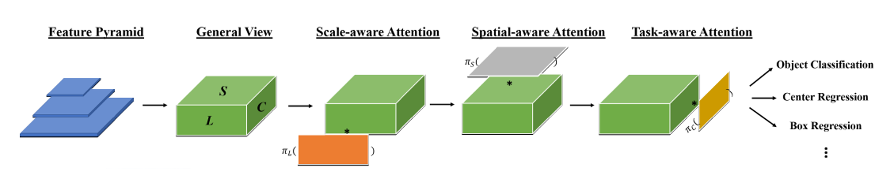

# Dynamic Head: Unifying Ojbect Detection Heads with Attentions \[Kor]

## Guideline


Remove this section when you submit the manuscript


Write the manuscript/draft by editing this file.

### Title & Description

Dyanmic Head: Unifying Object Detection Heads with Attentions [Kor]

#### Example

* Standardized Max Logit \[Kor\]
* VITON-HD: High-Resolution Virtual Try-On \[Eng\]
* Image-to-Image Translation via GDWCT \[Kor\]
* Coloring with Words \[Eng\]
* ...

Description of an article must follow this form: _&lt;1st author&gt; / &lt;paper name&gt; / &lt;venue&gt;_

#### Example

* Jung et al. / Standardized Max Logit: A simple yet Effective Approach for Identifying Unexpected Road Obstacles in Urban-scene Segmentation / ICCV 2021 Oral
* Kim et al. / Deep Edge-Aware Interactive Colorization against Color-Bleeding Effects / ICCV 2021 Oral
* Choi et al. / RobustNet: Improving Domain Generalization in Urban-Scene Segmentation via Instance Selective Whitening / CVPR 2021 Oral
* ...

## \(Start your manuscript from here\)


If you are writing manuscripts in both Korean and English, add one of these lines.

You need to add hyperlink to the manuscript written in the other language.



Remove this part if you are writing manuscript in a single language.


\(In English article\) ---&gt; 한국어로 쓰인 리뷰를 읽으려면 **여기**를 누르세요.

\(한국어 리뷰에서\) ---&gt; **English version** of this article is available.

##  1. Introduction

Object detection은 말 그대로 물체가 어디에 있는지 답을 찾는 딥러닝 알고리즘 방법입니다. Deep Learning의 발전과 더불어 이 분야도 오랜 기간 발전하게 되었는데 그 과정에서 대부분의 detector는 공통적인 framework 내에서 발전하게 되었습니다. 바로 backbone에서 이미지 특성을 추출하고 head 부분에서 객체의 위치와 정체를 파악하는 구조입니다. 본 논문에서는 Head에 집중하였는데 그 이유는 현재까지 detector의 성능은 head를 얼마나 잘 만들었는가에 따라 결정되었기 때문입니다. 본 논문의 저자는 good object detection head가 가져야 할 3가지 조건을 제시하였고 이 모든 조건을 충족시킬 수 있는 새로운 head를 제시하였습니다.

Good Object Detection Head가 가져야 할 1번째 조건은 바로 head는 scale-aware해야 한다는 것입니다. 다시 말해 head는 객체의 크기에 상관없이 모델을 감지해야 합니다.

두 번째로 head는 spatial-aware 해야 합니다. 보이는 위치, 각도, 회전된 정도가 달라도 같은 객체임을 감지할 수 있어야 합니다.

세 번째로, head는 task-aware 해야 합니다. 객체를 표현하는 방법으로는 bounding box를 치는 방법, 객체의 중심을 잡는 방법 등 다양한 방법이 있는데 이런 식으로 객체를 표현할 수 있어야 합니다.

하지만 지금까지 나온 object detection 관련 논문들은 이 3가지 중에서 하나만 해결하는데 치중하였습니다. 하지만 본 논문에서는 이러한 3가지 항목을 모두 만족시키는 head를 만들었는데 그 것이 바로 dynamic head입니다.

## 2. Related Work

In this section, you need to cover the motivation of the paper including _related work_ and _main idea_ of the paper.

### Scale-awareness

Please introduce related work of this paper. Here, you need to list up or summarize strength and weakness of each work.

### Spatial-awareness

After you introduce related work, please illustrate the main idea of the paper. It would be great if you describe the idea by comparing or analyzing the drawbacks of the previous work.

### Task-awareness

## 3. Our Approach

### Motivation

3가지 조건(scale-awareness, spatial-awareness, task-awareness)을 모두 만족하는 head를 만들기 위해서 위해서 **attention mechanism**을 사용하였는데 하나의 full self-attention mechanism을 사용하기에는 계산량이 많고 구현하기 어렵다는 문제로 인해 하나의 항목에 대해 attention mechanism을 하나씩 사용하여 연속적으로 연결하였습니다.

대략적인 구조는 화면에 나온 그림과 같습니다. 먼저 backbone으로부터 feature pyramid를 받습니다. Feature pyramid의 median level에 있는 사이즈에 맞게 나머지 feature map들을 upsampling 혹은 downsampling하여 4차원 텐서를 만듭니다. 이 4차원 텐서를 3차원 텐서로 변환시키게 되는데 이 때 3차원 텐서에서 L은 feature level, S는 height와 width를 곱한 값, C는 channel 수를 의미합니다. Dynamic head는 이러한 3차원 텐서를 input으로 받아들입니다. 그 뒤에 각각 scale-aware attention, spatial-aware attention, task-aware attention을 거쳐 object detection을 하게 됩니다.

실제로 network 학습 과정을 확인해보게 되면 Backbone을 거친 뒤의 multi level feature들은 scale-aware attention을 거친 뒤로 서로 다른 크기의 객체들에 sensitive해졌고 spatial-aware attention을 거친 뒤에는 더 sparse해지고 각각의 객체들의 spatial location에 sensitive해졌습니다. 마지막으로 task-aware attention을 거친 뒤로는 각 task에 요구하는 것에 맞춰 서로 다른 activation으로 재구성되었습니다.

### Dynamic Head: Unifying with Attentions

이제는 앞서 보았던 attention mechanism을 수학적으로 접근해보겠습니다.
우선 self-attention W(F)는 다음과 같이 구현됩니다. 파이는 attention function이며 저자는 단순하게 attention function을 fully connected layer로 구현하였습니다.

앞서 말했듯이 한번에 3가지 측면에 대해 처리하고 싶었지만 계산량 등의 이유로 다음과 같이 하나씩 attention을 적용하였습니다. 

먼저 scale-aware attention입니다.

우선 텐서 F의 Level당 Space, Channel 평균값을 구합니다.
그리고 이 평균값을 1 x 1 convolution layer에 넣어 Fully-connected 연산을 한 뒤 hard-sigmoid function에 넣습니다.
(여기서 은 1x1 convolutional layer로 근사된 linear function을 의미하며 는 다음과 같은 그래프의 hard-sigmoid function을 나타냅니다.)

저자는 서로 다른 scale의 feature들을 유동적으로 합체하기 위해 이와 같은 attention function을 사용하였다고 합니다.

두 번째로 spatial-aware attention입니다.

해당 식을 보면 Deformable convolution과 유사한 형태로 식이 세워진 것을 보면 offset pk에 의해 특성을 추출할 객체의 모양에 맞게 kernel이 변환되어 연산을 진행하는 것을 알 수 있습니다. 
저자는 위치, level에 상관없이 공통적으로 드러나는 객체의 feature을 강조하기 위해 사용하였다고 합니다.


If you are writing **Author's note**, please share your know-how \(e.g., implementation details\)


The proposed method of the paper will be depicted in this section.

Please note that you can attach image files \(see Figure 1\).  
When you upload image files, please read [How to contribute?](../../how-to-contribute.md#image-file-upload) section.

We strongly recommend you to provide us a working example that describes how the proposed method works.  
Watch the professor's [lecture videos](https://www.youtube.com/playlist?list=PLODUp92zx-j8z76RaVka54d3cjTx00q2N) and see how the professor explains.

## 4. Experiment & Result


If you are writing **Author's note**, please share your know-how \(e.g., implementation details\)


This section should cover experimental setup and results.  
Please focus on how the authors of paper demonstrated the superiority / effectiveness of the proposed method.

Note that you can attach tables and images, but you don't need to deliver all materials included in the original paper.

### Experimental setup

This section should contain:

* Dataset
* Baselines
* Training setup
* Evaluation metric
* ...

### Result

Please summarize and interpret the experimental result in this subsection.

## 5. Conclusion

In conclusion, please sum up this article.  
You can summarize the contribution of the paper, list-up strength and limitation, or freely tell your opinion about the paper.

### Take home message \(오늘의 교훈\)

Please provide one-line \(or 2~3 lines\) message, which we can learn from this paper.

> All men are mortal.
>
> Socrates is a man.
>
> Therefore, Socrates is mortal.

## Author / Reviewer information


You don't need to provide the reviewer information at the draft submission stage.


### Author

**Korean Name \(English name\)** 

* Affiliation \(KAIST AI / NAVER\)
* \(optional\) 1~2 line self-introduction
* Contact information \(Personal webpage, GitHub, LinkedIn, ...\)
* **...**

### Reviewer

1. Korean name \(English name\): Affiliation / Contact information
2. Korean name \(English name\): Affiliation / Contact information
3. ...

## Reference & Additional materials

1. Citation of this paper
2. Official \(unofficial\) GitHub repository
3. Citation of related work
4. Other useful materials
5. ...

