# Dynamic Head: Unifying Object Detection Heads with Attentions [Kor]

##  1. Introduction

Object detection은 말 그대로 물체가 어디에 있는지 답을 찾는 딥러닝 알고리즘 방법입니다. Deep Learning의 발전과 더불어 이 분야도 오랜 기간 발전하게 되었는데 그 과정에서 대부분의 detector는 공통적인 framework 내에서 발전하게 되었습니다. 바로 backbone에서 이미지 특성을 추출하고 head 부분에서 객체의 위치와 정체를 파악하는 구조입니다. 본 논문에서는 Head에 집중하였는데 그 이유는 현재까지 detector의 성능은 head를 얼마나 잘 만들었는가에 따라 결정되었기 때문입니다. 본 논문의 저자는 good object detection head가 가져야 할 3가지 조건을 제시하였고 이 모든 조건을 충족시킬 수 있는 새로운 head를 제시하였습니다.

Good Object Detection Head가 가져야 할 1번째 조건은 바로 head는 scale-aware해야 한다는 것입니다. 다시 말해 head는 객체의 크기에 상관없이 모델을 감지해야 합니다.

두 번째로 head는 spatial-aware 해야 합니다. 보이는 위치, 각도, 회전된 정도가 달라도 같은 객체임을 감지할 수 있어야 합니다.

세 번째로, head는 task-aware 해야 합니다. 객체를 표현하는 방법으로는 bounding box를 치는 방법, 객체의 중심을 잡는 방법 등 다양한 방법이 있는데 이런 식으로 객체를 표현할 수 있어야 합니다.

하지만 지금까지 나온 object detection 관련 논문들은 이 3가지 중에서 하나만 해결하는데 치중하였습니다. 하지만 본 논문에서는 이러한 3가지 항목을 모두 만족시키는 head를 만들었는데 그 것이 바로 dynamic head입니다.

## 2. Related Work

### Scale-awareness

대부분의 이미지 안에 존재하는 개체들은 크기가 제각각 다양하기 때문에 많은 연구로부터 object detection을 진행할 때 크기 인식의 중요성이 부각되어 왔습니다. [Feature pyramid network](https://arxiv.org/pdf/1612.03144.pdf)는 down-sampling된 feature의 pyramid를 연결하여 image pyramid에 비해 효율성을 향상시켰으며 현재 object detection에서 일반적으로 사용하는 요소가 되었습니다. 하지만 다른 level에서 추출되는 feature간에는 눈에 띄는 semantic gap이 존재하게 됩니다.  이 때 semantic gap은 neural Network에서 low level에서는 image의 edge와 같은 부분을 보는데 반해 high level에서는 image의 contextual한 부분을 중점적으로 detectinig하는 것처럼 각 level 사이에 존재하는 feature map의 차이를 의미합니다. 이러한 불일치를 해결하기 위해 feature pyramid에서 각각의 feature들을 sampling하여 균형을 맞추어 gap을 줄이고자 하였습니다. 이 논문에서는 detection head에 scale-aware attention을 추가하여 다양한 level의 feature들의 중요성을 판단하여 semantic gap을 줄일 수 있도록 하였습니다.

### Spatial-awareness

이전 Convolution neural network는 이미지에 존재하는 spatial transformation을 학습하는데 한계가 있습니다. 모델 크기를 키우거나 데이터 수를 증가시키는 등의 방법들은 학습 한계 문제를 해결하는데 있어 추론 및 훈련에서 높은 계산 비용을 초래합니다. 이를 해결하기 위해 spatial transformation 학습을 개선하기 위해 filter 내부에 zero padding을 추가하여 강제로 receptive field를 넓히는 Dilated convolution, offset을 통해 spatial location을 sampling하는 deformable convolution 등의 새로운 convolution이 제안되었습니다. 이 논문에서는 detection head에 spatial aware attention을 추가하여 spatial location뿐만 아니라 보다 효과적으로 객체 간의 차이도 학습할 수 있도록 하였습니다.

### Task-awareness

object detection은 Region proposal과 classification이 순차적으로 이루어지는 [R-CNN](https://ieeexplore.ieee.org/stamp/stamp.jsp?tp=&arnumber=7112511)과 같은 2-stage detector, region proposal과 classification이 동시에 일어나는 [YOLO](https://ieeexplore.ieee.org/stamp/stamp.jsp?tp=&arnumber=7780460)와 같은 1-stage detector로 나뉘어지며 객체를 감지하는 방법에 따라서 객체가 존재하는 부분에 bounding box를 치는 방법, 객체의 중심점을 잡는 방법, 객체의 특징점들을 찾아 그 점들을 이어 객체를 감지하는 방법 등 다양합니다. 이 논문에서는 detection head에 task-aware attention을 추가하여 1-stage / 2-stage detector, bounding box/ center point/ key point 등 다양한 task에 적용 가능하도록 하였습니다.

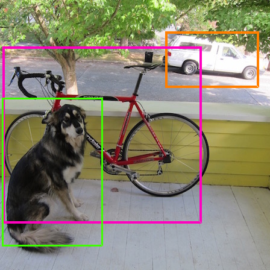

## 3. Our Approach

### Motivation

3가지 조건(scale-awareness, spatial-awareness, task-awareness)을 모두 만족하는 head를 만들기 위해서 위해서 **attention mechanism**을 사용하였는데 하나의 full self-attention mechanism을 사용하기에는 계산량이 많고 구현하기 어렵다는 문제로 인해 하나의 항목에 대해 attention mechanism을 하나씩 사용하여 연속적으로 연결하였습니다.
대략적인 구조는 화면에 나온 그림과 같습니다. 먼저 backbone으로부터 feature pyramid를 받습니다. Feature pyramid의 median level에 있는 사이즈에 맞게 나머지 feature map들을 upsampling 혹은 downsampling하여 4차원 텐서를 만듭니다. 이 4차원 텐서를 3차원 텐서로 변환시키게 되는데 이 때 3차원 텐서에서 L은 feature level, S는 height와 width를 곱한 값, C는 channel 수를 의미합니다. Dynamic head는 이러한 3차원 텐서를 input으로 받아들입니다. 그 뒤에 각각 scale-aware attention, spatial-aware attention, task-aware attention을 거쳐 object detection을 하게 됩니다.

실제로 network 학습 과정을 확인해보게 되면 Backbone을 거친 뒤의 multi level feature들은 scale-aware attention을 거친 뒤로 서로 다른 크기의 객체들에 sensitive해졌고 spatial-aware attention을 거친 뒤에는 더 sparse해지고 각각의 객체들의 spatial location에 sensitive해졌습니다. 마지막으로 task-aware attention을 거친 뒤로는 각 task에 요구하는 것에 맞춰 서로 다른 activation으로 재구성되었습니다.

### Dynamic Head: Unifying with Attentions

이제는 앞서 보았던 attention mechanism을 수학적으로 접근해보겠습니다.
우선 self-attention W(F)는 다음과 같이 구현됩니다. 파이는 attention function이며 저자는 단순하게 attention function을 fully connected layer로 구현하였습니다.

$$W(F) = \pi (F) \cdot F$$

앞서 말했듯이 한번에 3가지 측면에 대해 처리하고 싶었지만 계산량 등의 이유로 다음과 같이 하나씩 attention을 적용하였습니다. 

$$W(F) = \pi_C (\pi _S (\pi _L (F) \cdot F) \cdot F) \cdot F$$

먼저 scale-aware attention입니다.

$$\pi_L (F) \cdot F = \sigma (f (\frac{1}{SC} \sum_{S,C} F)) \cdot F$$

우선 텐서 F의 Level당 Space, Channel 평균값을 구합니다.
그리고 이 평균값을 1 x 1 convolution layer에 넣어 Fully-connected 연산을 한 뒤 hard-sigmoid function에 넣습니다.
(여기서  $$f(\cdot)$$은 1x1 convolutional layer로 근사된 linear function을 의미하며 $$\sigma (x) = max(0,min(1,\frac{x+1}{2})$$는 다음과 같은 그래프의 hard-sigmoid function을 나타냅니다.)

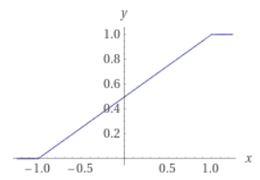

저자는 서로 다른 scale의 feature들을 유동적으로 합체하기 위해 이와 같은 attention function을 사용하였다고 합니다.

두 번째로 spatial-aware attention입니다.

$$\pi_S (F) \cdot F = \frac{1}{L} \sum_{l=1}^L \sum_{k=1}^K w_{l,k} \cdot F(l; p_k + \varDelta p_k; c) \cdot \varDelta m_k$$

해당 식을 보면 Deformable convolution과 유사한 형태로 식이 세워진 것을 보면 offset pk에 의해 특성을 추출할 객체의 모양에 맞게 kernel이 변환되어 연산을 진행하는 것을 알 수 있습니다. 
저자는 위치, level에 상관없이 공통적으로 드러나는 객체의 feature을 강조하기 위해 사용하였다고 합니다.

마지막으로 task-aware attention입니다.

$$\pi_C (F) \cdot F = max(\alpha^1 (F) \cdot F_C + \beta^1 (F), \alpha^2 (F) \cdot F_C + \beta^2 (F))$$

($$F_c$$는 c-th channel의 feature slice를 의미하고 $$[\alpha^1, \alpha^2, \beta^1, \beta^2]^T = \theta ( \cdot )$$은 activation thresholds를 조절하는 hyper function입니다.)

해당 식은 적절한 channels of features를 on, off 스위칭합니다. activation threshold를 제어하는 hyper function 세타는 L x S 차원에 대한 global average pooling을 하여 dimensionality를 낮추고 2번의 fully connected를 진행한 뒤에 normalize를 시키고 shifted sigmoid function을 통하여 $$[-1, 1]$$ 사이의 출력값이 나오게 합니다. 이러한 출력값은 bounding box, center point, corner point 등 각 task에 대한 값이 담겨져 있습니다.

다음은 Dynamic Head Block의 자세한 구조입니다. 앞서 수학적으로 설명하였기에 넘어가도록 하겠습니다.

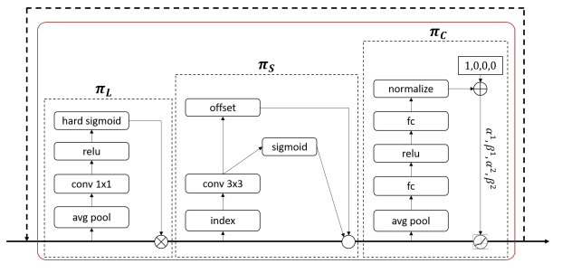

다음은 기존에 존재하는 detector에 dynamic head를 적용하는 방법에 대해 설명하도록 하겠습니다. one-stage, two-stage detector에 따라 적용 방법에 약간의 차이가 있습니다.

먼저 one-stage detector의 경우 기존의 head를 제거하고 dynamic head block을 연결하면 됩니다. 여러 개의 block를 연결하고 싶으면 연속적으로 쌓기만 하면 되는데 저자는 기존에 있던 one-stage detector와 비교하였을 때 매우 간단하면서도 성능이 향상되었다고 말합니다. 또한 객체 표현 방식에 flexible하여 다양한 model에서 사용할 수 있다고 합니다.

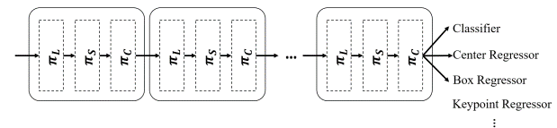

다음으로 two-stage detector의 경우 one-stage detector와 사용 방법이 약간 다릅니다. Two-stage detector의 경우 객체 표현 방식이 다양한 one-stage detector와는 다르게 box regressor만 사용 가능합니다. Two-stage detector에 dynamic head를 적용할 때 scale-awareness, spatial-awareness attention을 거친 뒤에 ROI pooling을 적용하고 task-aware attention을 거치게 됩니다. 

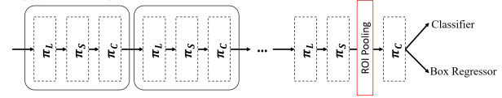

## 4. Experiment & Result

### Experimental Setup

- Dataset: MS-COCO dataest (training, validation, test에 사용한 이미지 데이터는 각각 118k, 5k, 41k개입니다.)
- Baseline: Mask R-CNN benchmark
- Training:
     - backbone: ResNet-50
     - learning rate: 0.02 with weight decay = 0.0001 and momentum = 0.9 (training epoch가 67%와 89%사이일 때 learning rate = 0.01)
     - 32GB의 memory가 있는 8개의 V100 GPU로 구성된 하나의 compute node를 사용하여 학습

### Ablation Study

다음은 성능 비교표입니다. $$AP_{50}$$, $$AP_{75}$$은 각각 정답으로 인정되는 IOU가 0.5 이상, 0.75 이상인 경우에 대한 예측의 평균 정확도를 의미합니다. 또한, AP는 IOU가 0.5 이상, 0.95 이하인 경우에 대한 예측의 평균 정확도입니다. 추가적으로 $$AP_S$$, $$AP_M$$, $$AP_L$$은 각각 크기가 322보다 작은 물체, 크기가 322와 962 사이인 물체, 크기가 962보다 큰 물체를 detecting할 수 있는지에 대한 예측의 평균 정확도를 나타냅니다. 3개의 attention 중에 하나만 추가되어도 average precision이 향상되는 것을 확인할 수 있습니다. 그 중에서 spatial aware attention을 사용할 때 가장 높은 성능 상승을 이끌어 내었는데 저자는 3개의 attention function 중 spatial attention function의 dominant dimensionality 때문이라고 하였습니다. (Level, Space, Channel 중에서 Space의 dimensionality가 가장 높기 때문입니다.)

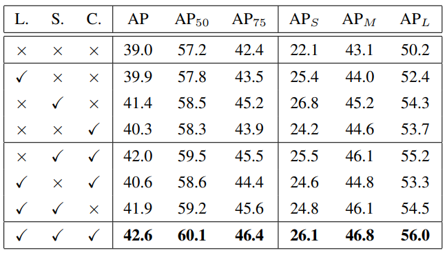

성능 향상과 관련하여 scale-aware attention과 spatial-aware attention에 대해 좀 더 알아보도록 하겠습니다. 우선 scale-aware attention의 성능을 보여주기 위해 저자는 다음과 같이 trend of the learned scale ratio를 보여주었습니다. 

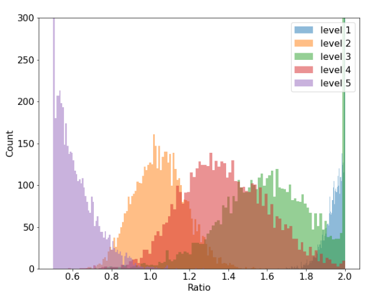

Scale ratio는 학습된 고해상도 가중치를 저해상도 가중치로 나눈 값을 의미하며 해당 ratio에 대한 그래프는 위와 같습니다. 집중적으로 봐야 할 부분은 가장 고해상도 feature map에 있는 level 5의 scale ratio의 분포가 저해상도 feature map에 가도록 되어 있고 가장 저해상도 feature map에 있는 level 1의 scale ratio의 분포는 고해상도 feature map에 가도록 되어 있습니다. 즉 해상도가 높으면 저해상도에 가중치를 두고 해상도가 낮으면 고해상도에 가중치를 두어 서로 다른 level에서의 feature map들간의 gap을 줄일 수 있습니다.

다음으로 서로 다른 개수의 attention module을 적용했을 때의 결과를 시각화한 것입니다. Block의 개수가 많아질수록 정확하게 객체들의 공간 위치를 구별하는 것을 확인할 수 있습니다. 이러한 visualization으로 spatial-aware attention learning의 효과를 설명할 수 있다고 합니다.

다음은 Head의 depth에 따른 성능을 표로 나타낸 것입니다. Block의 개수가 6개일 때 가장 효과가 좋으나 계산량의 경우 Baseline보다 21.5GFLOPs만큼 증가하였습니다. (여기서 FLOPS는 컴퓨터의 성능을 수치로 나타낼 수 사용하는 단위로 컴퓨터가 1초동안 수행할 수 있는 부동소수점 연산의 횟수를 기준으로 삼습니다.) 하지만 해당 계산량의 경우 backbone에서 이루어지는 계산량에 비하면 무시할 만한 수준이라고 합니다.

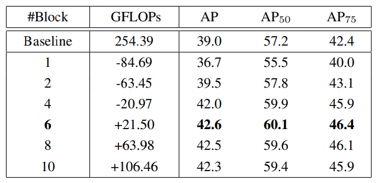

다음 표는 존재하는 object detector에 대해 dynamic head를 적용해본 결과입니다. Dynamic head를 적용한 경우 1.2 ~ 3.2 AP정도 성능이 향상된 것을 확인할 수 있습니다.

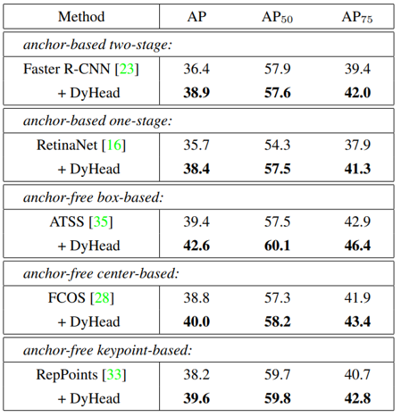

### Comparison with the State of the Art

State of the Art에 등록된 네트워크들과 성능을 비교한 결과입니다. 다양한 backbone과 dynamic head를 합친 detector와 다른 detector들을 비교해 보았을 때 모든 부분에서 RESNexXt-64x4d-101을 backbone으로 사용한 dynamic head detector가 가장 좋은 성능을 보여주었습니다.

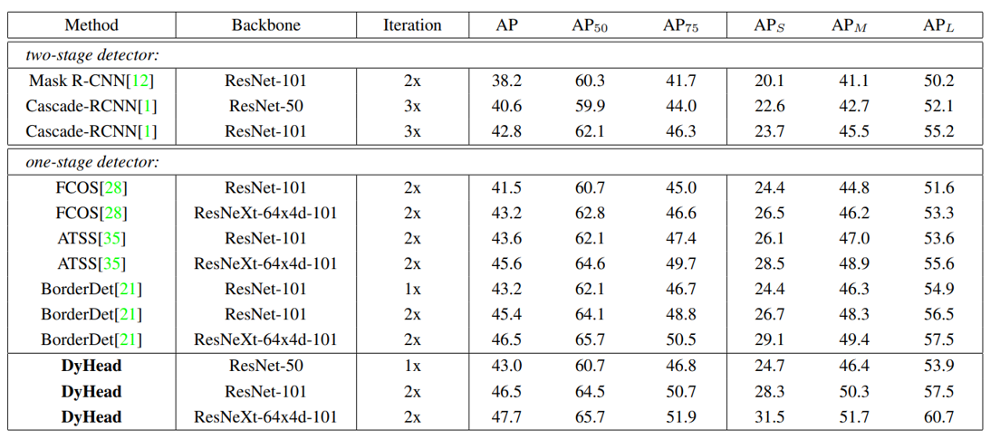

앞에서 가장 성능이 좋은 ResNeXt-64x4d-101를 backbone으로 사용한 dynamic head detector를 다른 SOTA detector들과 비교해보았을 때에도 다음과 같이 가장 높은 성능을 보여주는 걸 확인할 수 있습니다.

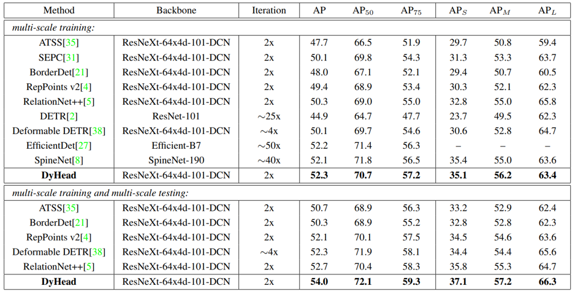

## 5. Conclusion

결론적으로 해당 dynamic head는 scale-aware, spatial-aware, task-aware attention을 하나의 framework에 담았습니다. 다른 object detector에 추가하여 성능 향상을 이끌어 낸 것도 확인했습니다. 저자는 모든 측면을 한번에 attention하는 model을 개발하는 것, 더 다양한 측면의 attention을 head에 넣는 것을 통해 성능을 향상시킬 방법을 찾는 것이 앞으로의 task라고 하였습니다.

### Take home message \(오늘의 교훈\)

> 그 동안 다른 object detection 논문들을 읽어보았지만 head만 바꿔도 성능이 달라진다는 것을 인지하지 못하고 있었습니다. Head의 성능이 Object Detector의 성능을 결정한다는 점이 상당히 인상깊었습니다. 

## Author/Reviewer Information

### Author

**임경록 (Gyeongrok Lim)**

- KAIST EE
- E-mail: gr87@kaist.ac.kr

### Reviewer

1. Korean name (English name): Affiliation / Contact information
2. Korean name (English name): Affiliation / Contact information
3. …

## Reference & Additional materials

1. Dai, Xiyang, et al. "Dynamic Head: Unifying Object Detection Heads with Attentions." Proceedings of the IEEE/CVF Conference on Computer Vision and Pattern Recognition. 2021.
2. Lin, Tsung-Yi, et al. "Feature pyramid networks for object detection." Proceedings of the IEEE conference on computer vision and pattern recognition. 2017.
3. R. Girshick, J. Donahue, T. Darrell and J. Malik, "Region-Based Convolutional Networks for Accurate Object Detection and Segmentation," in IEEE Transactions on Pattern Analysis and Machine Intelligence, vol. 38, no. 1, pp. 142-158, 1 Jan. 2016, doi: 10.1109/TPAMI.2015.2437384.
4. J. Redmon, S. Divvala, R. Girshick and A. Farhadi, "You Only Look Once: Unified, Real-Time Object Detection," 2016 IEEE Conference on Computer Vision and Pattern Recognition (CVPR), 2016, pp. 779-788, doi: 10.1109/CVPR.2016.91.

