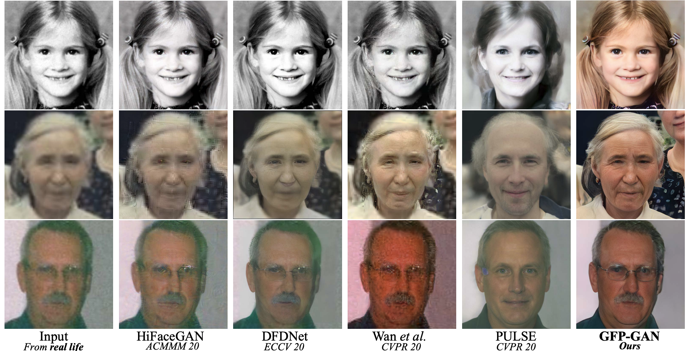
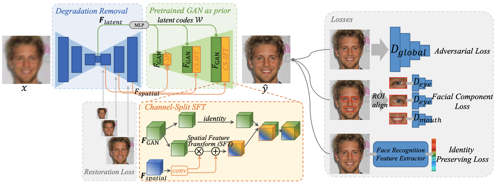
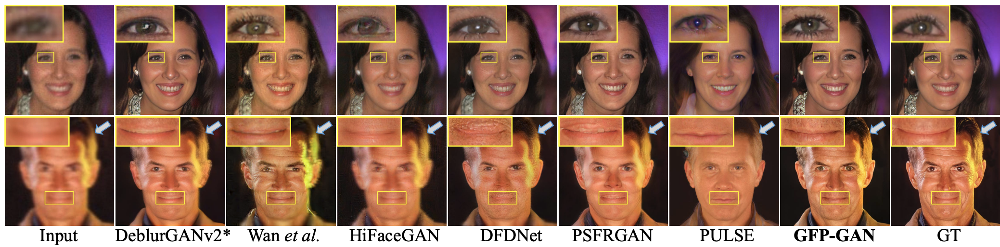
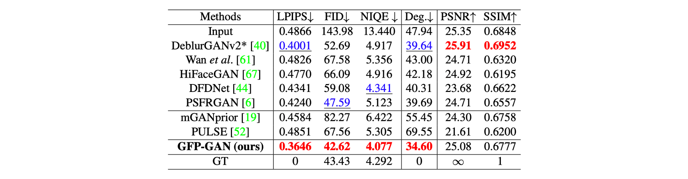

# GFP-GAN [Korean]

## 1. Problem definition

Face Restoration은 저화질의 얼굴 이미지을 고화질의 얼굴 이미지로 복원하는 것 입니다. 저화질 이미지의 원인으로서는 low-resolution noise, blur, compression artifacts 등이 있습니다. 또한 실제 어플리케이션에서는 화질 문제 뿐만 아니라 많은 identity, 다양한 포즈 및 표정, 이미지의 텍스처 등등 더 많은 원인들이 있습니다. 

이전의 Face Restoration 연구들은 얼굴에 특화된 prior을 이용했습니다. 얼굴 특화 prior 로는 예를 들어 facial randmark, parsing map, facial component heating map 등이 있습니다. 이러한 geomety facial prior들은 얼굴의 디테일과 모양을 복원하는데 중요한 역활을 하였습니다. 하지만 해당 prior들 저화질의 이미지에서 추출될 수 밖에 없고 따라서 어쩔수 없는 질의 저하가 있을 수 밖에 없습니다. 또한 해당 prior들은 이미지의 텍스처와 같은 부분에 대해서는 정보 제한이 있습니다. 

이러한 문제점을 해결하기 위해 최근 DFDNet [2] 은 얼굴의 각 부분 (눈, 코, ..) 에 대한 feature들을 저장해둔 dictionary를 제안 했습니다. 따라서 저화질의 이미지를 복원시 해당 부분에 대한 feature들을 바탕을 더 좋은 복원을 가능케 했습니다. 하지만 이 방법 또한 문제점이 있습니다. 첫번째로, dictionary에 포함되어 있지 않은 얼굴 부분에 대한 정보는 없다는 것 입니다. 또한 두번째로, dictionary에 사이즈에 따라 다양성이 제한됩니다. 

따라서 이 논문에서는 이러한 문제점들을 해결하고 더 좋은 품질의 복원을 타겟 합니다. 

## 2. Motivation

최근 StyleGAN [3] 과 같은 생성모델의 엄청난 발전이 있었습니다. 이러한 생성모델들은 높은 품질의 다양한 얼굴 이미지들을 생성할 수 있게 되었고 따라서 geometry, facial texture, colors와 같은 얼굴 복원에 필요한 많은 prior을 제공 할 수 있습니다. 따라서 몇몇 연구에서는 Face Restoration 에 미리학습된 생성모델을 가져와 이용하였습니다. 특히, 주로 GAN inversion 기법을 사용하였는데 우선 저화질의 얼굴 이미지을 미리 학습된 생성모델을 사용하여 latent code로 맵핑 시키고 다시 별도의 이미지 optimization을 이용하여 고화질의 얼굴 이미지를 생성하였습니다. 하지만 저화질에서 추출된 latent code 만으로는 고화질의 이미지를 생성하는데 충분하지 않았습니다. 

따라서 이 논문에서는 미리 학습된 생성모델을 Face Restoration 에 더 좋게 적용하는 것을 목표합니다. 특히 한번의 forward pass 만으로 고품질의 얼굴 이미지를 복원 합니다. 

### Related work

#### Image Restoration

Image restoration 에는 super-resolution [4], denosing [5], deburring [6] 등의 연구들이 있습니다. 이런 연구들에서는 주로 좋은 이미지 결과를 얻기 위해 미리 학습된 generative model을 loss supervion 으로 사용하였습니다. 이와 다르게 GFP-GAN 은 미리 학습된 generative model 을 generative facial priors 로 사용했다는 차이점이 있습니다.

#### Face Restoration

기존의 face restoration 연구들은 크게 다음 두가지 타입의 얼굴 prior 들을 사용합니다 : geometry priors 와 reference priors. 1) Geometry prior 에는 facial landmark [7], facial parsing map [8] 등이 있습니다. 하지만 이런 pior 들은 저화질의 이미지에서 추출하는 순간 정확도가 많이 떨어지고 또한 얼굴을 복원하기에 충분한 정보를 가지고 있지 않다는 단점들이 있습니다. 2) Reference prior 는 같은 사람의 다른 이미지들을 활용합니다. 하지만 매번 같은 사람의 다른 이미지들이 있을 수 없기 때문에 DFDNet [2] 은 얼굴의 각 부분 (눈, 코, ..) 에 대한 feature들을 저장해둔 dictionary를 제안 했습니다. 하지만 이 방법 또한 dictionary 의 사이즈에 따라 정보량과 다양성이 제한된다는 단점이 있습니다. GFP-GAN 은 다양한 얼굴이 미리 학습된 generative model 을 사용해 매우 풍부하고 다양한 facial prior을 활용할 수 있습니다.  

## 3. Method

GPF-GAN 의 개요는 위의 그림과 같습니다. 크게는 Degradation Removal module과 미리 학습된 face GAN (StyleGAN2) 로 구성되어 있습니다. 그리고 두 묘듈은 Channel-Split Spatial Feature Transform (CS-SFT) 를 통해 연결되어 있습니다. 또한 학습시에는 기존의 global discriminator loss 뿐만 아니라 facial component loss 와 identity preserving loss 가 제안 되었습니다.

### 3.1. Degradation Removal Module

Degradation removal module 은 저화질의 이미지로 부터 degradation 을 제거하고 **깨끗한** features, $$F_{latent}$$ 와 $$F_{spatial}$$ 을 추출 합니다. 네트워크 구조는 다음 2가지 이유에 의해 U-Net 구조를 따릅니다. 1) Receptive field 가 점차 커지는 것이 large blur elimianation에 유용하다. 2) Multi-resolution의 features 들을 생성한다.

$$ F_{latent}, F_{spatial} = U-Net(x) $$

여기서 $$F_{latent}$$ 는 input image에 해당되는 StyleGAN2의 가장 가까운 latent code로 맵핑 되는 feature 입니다. 그리고 $$F_{spatial}$$ 은 다양한 resolution으로 추출되며 후에 StylGAN2의 feature을 수정하는데 사용 됩니다. 

추가로, 각각의 feauture가 degradation 제거에 도움이 되기 위해서 학습 초반에는 U-net decoder의 각 resolution output에 ground truth image 와의 $$L_1$$ restoration loss 을 줍니다. 

### 3.2. Generative Facial Prior and Latent Code Mapping

미리 학습된 생성모델은 배워진 weights에 다양한 얼굴에 대한 정보들, 즉 generative prior 을 가지고 있습니다. 따라서 이 논문에서는 해당 prior을 얼굴 복원 이용합니다. 

미리 학습된 생성모델을 이용하는 가장 알려진 방법은 input image을 가장 가까운 latent code로 맵핑 시킨 후 생성 모델을 통해 다시 ouput image 생성하는 것 입니다. 하지만 이러한 방법들은 품질을 보존하기 위해 여러번의 optimization 과정이 필요합니다. 따라서 이 논문에서는 output image을 바로 생성하는 것이 아닌 중간 feature들을 이용합니다. 다시 말하면 해당 중간 feature들은 목표 이미지에 가장 가까운 얼굴의 feature들이라고 볼 수 있습니다. 그리고 더 좋은 품질의 output image을 위하여 중간 feature들을 살짝 수정하게 됩니다. 

자세하게는 위에서 얻은 $$F_{latent}$$ 을 StyleGAN2의 latent space $$W$$ 에 맵핑합니다. 그리고 맵핑된 latent code $$w \in W$$ 를 미리학습된 StyleGAN2에 통과시켜 중간 feature들을 구합니다.

$$ w = MLP(F_{latent}) $$
$$ F_{GAN} = StyleGAN(w) $$

### 3.3. Channel-Split Spatial Feature Transform

이 모듈에서는 더 좋은 품질을 위해서 위에서 구해진 $$F_{spatial}$$ 을 이용해서 $$F_{GAN}$$ 을 수정합니다. Face restoration에서는 input image의 spatial 정보를 유지하는 것이 중요하기 때문에, 각 spatial location에 따라 adaptive하게 수정을 해야합니다. 따라서 이 논문에서는 spatial-wise feature modulation 을 위해 affine transformation parameter을 구하는 Spatial Feature
Transform (SFT) [9] 을 이용합니다. 수식적으로 다음과 같습니다.

$$ \alpha, \beta = Conv(F_{spatial}) $$
$$ F_{output} = SFT(F_{GAN} |\alpha, \beta ) = \alpha \odot F_{GAN} + \beta  $$

추가로 더 좋은 품질을 위하여 이 논문에서는 Channel-Split Spatial Feature Transform (CS-SFT) 을 제안했습니다. 간단하게 생성모델의 중간 feature들의 일부 만 수정하는 방법 입니다. 수식적으로 다음과 같습니다.

$$
\begin{aligned}
 F_{output} &= CS-SFT(F_{GAN} |\alpha, \beta ) \\
            &= Concat[ Indentity(F_{GAN}^{split_0}), \alpha \odot F_{GAN}^{split_1} + \beta  ]
\end{aligned}        
$$

이와 같이 channel-wise로 feature을 분리한 후 한쪽만 수정을 합니다. 이를 통해 미리 학습된 generative prior을 좀 더 직접적으로 이용하면서도 품질을 향상 시킬 수 있었다고 합니다.

### 3.4. Model objectives

GFP-GAN 을 학습하기 위해 크게 4가지의 loss 을 적용하였습니다.

1. Reconstruction loss : 복원된 이미지와 ground-truth 이미지 사이에 L1 loss 와 perceptual loss (pretrained VGG-19) 을 적용하였습니다. 
<!-- 
$$
L_{rec} = \lambda_{l1}|| \hat{y} −y ||_1 + \lambda_{per}||\phi(\hat{y})−\phi(y)||_1
$$ -->

2. Adversarial loss : 복원된 이미지가 좀 더 고품질의 사실적인 텍스쳐를 가지도록 하기 위해서 adversarial loss 을 적용하였습니다.
<!-- 
$$
L_{adv} = -\lambda_{adv} softplus(D(\hat{y}))
$$ -->

3. Facial component loss : 얼굴의 각 부분 (눈, 입) 의 질을 더 높이기 위해 각 부분에만 적용하는 local discriminator을 줌으로써 facial component loss 을 제안했습니다. 각 부분의 영역을 추출하기 위해서는 [10] 을 사용합니다. 또한 local discriminator 의 중간중간 feature들을 뽑아 Gram statistic을 이용한 style loss 을 추가했습니다.
   
4. Indentity preserving loss : 미리 학습된 face recognition 모델 [11] 을 활용하여 복원된 얼굴과 ground-truth 얼굴 과의 id feature embedding 사이의 거리가 가깝도록 유도합니다. 

## 4. Experiment & Result

### 4.1. Experimental Setup

이 논문에서의 StyleGAN2 는 고화질 얼굴 이미지 70,000 장으로 이루어진 FFHQ 데이터셋에 미리 학습 되었습니다. 저화질의 이미지는 고화질로 부터 생성되었는데 다음과 같습니다.

$$ x = [(y \otimes k_\sigma )\downarrow_r + n_\delta]_{JPEG_q} $$

우선 고화질의 이미지 y에 가우시안 블러를 하고 랜덤 스케일로 다운셈플링 합니다. 그 후 white gaussian noise을 더하고 jpeg compression을 진행 합니다. 또한 색깔에 대한 향상을 위해 color jitter 도 적용해 줍니다.

### 4.2. Result

결과에서 보면 기존의 베이스라인들 보다 GFP-GAN 의 복원 능력이 훨씬 뛰어난 것을 볼 수 있습니다. 또한 facial component loss 의 덕분으로 눈과 입부분도 훨씬 깔끔한 결과를 생성한 것을 볼 수 있습니다. 

## 5. Conclusion

이 논문에서는 미리 학습된 생성모델을 사용하여 face restoration을 하였습니다. 특히 Degradation Removal Module 과 Channel-Split Spatial Feature Transform 을 제안하여 미리 학습된 생성모델의 generative prior을 적절히 이용하면서 높은 품질의 얼굴 복원을 성공적으로 하였습니다. 

### Take home message (오늘의 교훈)

> Generative model is powerful.

## Author / Reviewer information

### Author

**민동찬 (Dongchan Min))**

- KAIST
- Research interest in Multi-Modal Generative model 
- [website](https://kevinmin95.github.io/)

### Reviewer

1. Korean name (English name): Affiliation / Contact information
2. Korean name (English name): Affiliation / Contact information
3. …

## Reference & Additional materials

1. [Official GitHub repository](https://github.com/TencentARC/GFPGAN)

2. Xiaoming Li, Chaofeng Chen, Shangchen Zhou, Xianhui
Lin, Wangmeng Zuo, and Lei Zhang. Blind face restoration via deep multi-scale component dictionaries. In ECCV,2020.

3. Tero Karras, Samuli Laine, Miika Aittala, Janne Hellsten,
Jaakko Lehtinen, and Timo Aila. Analyzing and improving
the image quality of stylegan. In CVPR, 2020.

4. Chao Dong, Chen Change Loy, Kaiming He, and Xiaoou Tang. Learning a deep convolutional network for image super-resolution. In ECCV, 2014.

5. Stamatios Lefkimmiatis. Non-local color image denoising with convolutional neural networks. In CVPR, 2017.
   
6. Ziyi Shen, Wei-Sheng Lai, Tingfa Xu, Jan Kautz, and MingHsuan Yang. Deep semantic face deblurring. In CVPR, 2018.

7. Yu Chen, Ying Tai, Xiaoming Liu, Chunhua Shen, and Jian Yang. Fsrnet: End-to-end learning face super-resolution with facial priors. In CVPR, 2018.

8. Ziyi Shen, Wei-Sheng Lai, Tingfa Xu, Jan Kautz, and MingHsuan Yang. Deep semantic face deblurring. In CVPR, 2018.
   
9.  Xintao Wang, Ke Yu, Chao Dong, and Chen Change Loy.
Recovering realistic texture in image super-resolution by
deep spatial feature transform. In CVPR, 2018.

10. Kaiming He, Georgia Gkioxari, Piotr Doll ́ar, and Ross Gir-shick. Mask r-cnn. In ICCV, 2017.
    
11. Jiankang Deng, Jia Guo, Niannan Xue, and Stefanos Zafeiriou. Arcface: Additive angular margin loss for deep face recognition. In CVPR, 2019.

