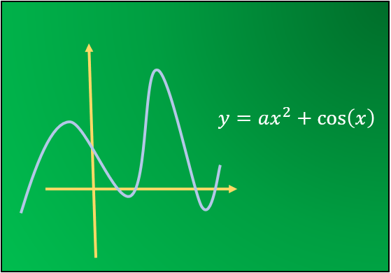
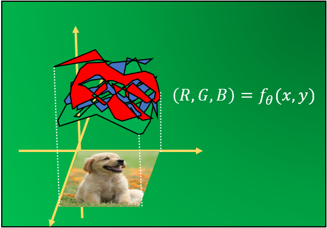
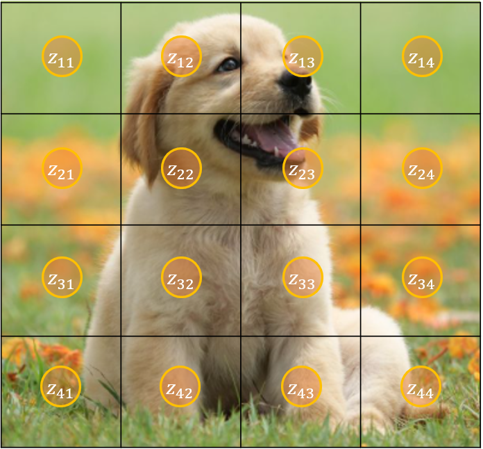
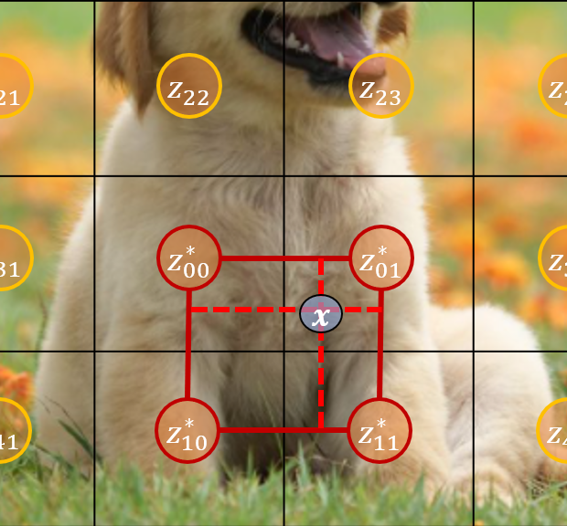
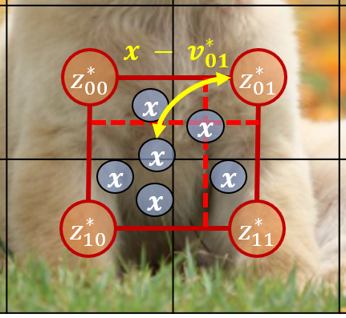
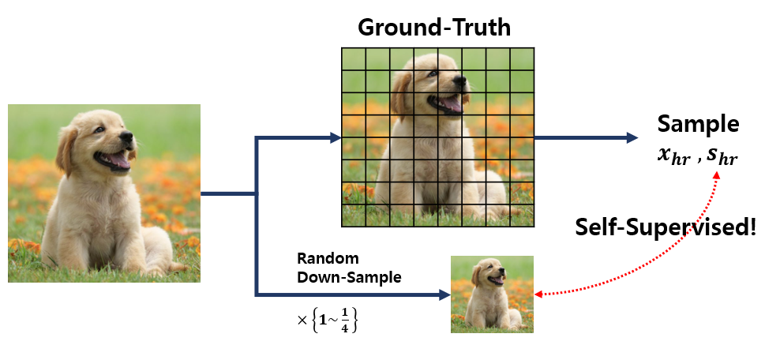
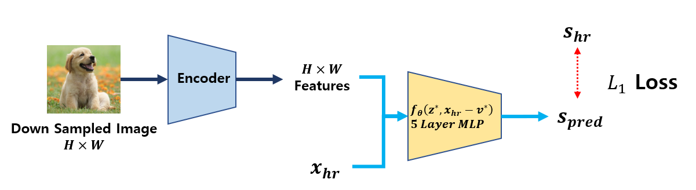
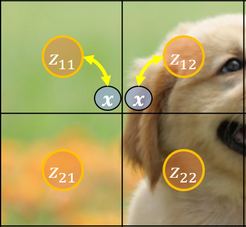
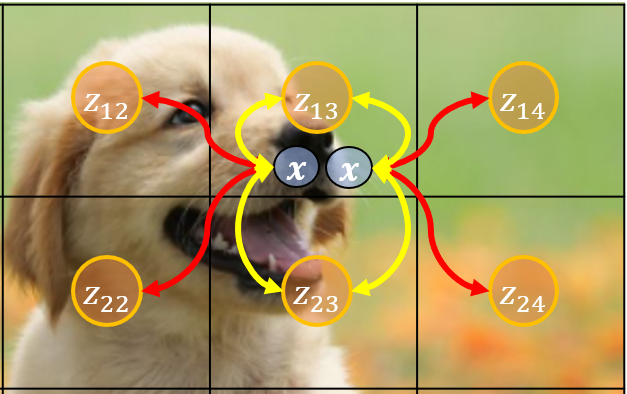
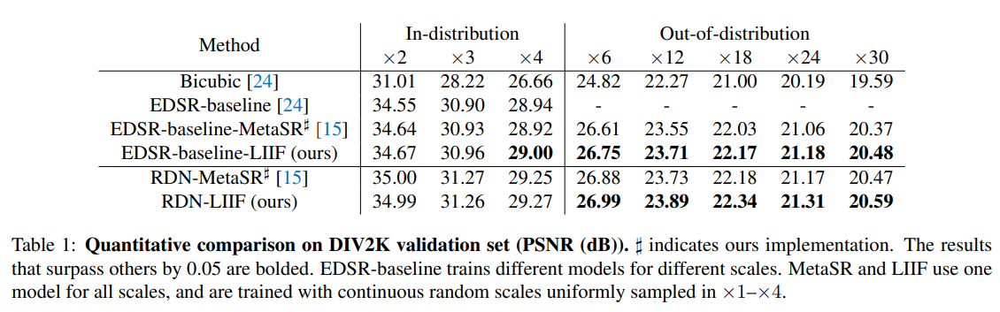

한국어로 쓰인 리뷰를 읽으려면 [여기](cvpr-2021-liif-kor.md)를 누르세요.

## 📑 1. Problem Definition

### Image as a Function

We usually consider image as pixel-RGB pairs. However, there is another view point, **image as a function.** Function is a mapping which takes input and outputs something. $$Y$$ value changes according to $$X$$. There are many easy functions like **Figure 1** such as polynomial, exponential or the function may be very complex like **Figure 2**.

|           Figure 1          |                                  Figure 2                                 |
| :-------------------------: | :-----------------------------------------------------------------------: |
|   |                                                 |
| The form of easy shape function can be estimated easily | When the function outputs vary like image function. It is hard to estimate the implicit functional form of pixel and RGB. |

**Image -> Function :** Image can be considered as a function whose input is $$(x,y)$$ and outputs RGB values. Like **Figure 2**, the image function is complex and finding proper polynomial or trigonometrical function is impossible. Therefore it is not easy to an image function and there are attempts to find the function using neural network. This field is called **Neural Implicit Representation (NIR)**. 

### Why we need NIR??

There are two benefits by knowing the image function 

1. If the number of parameters is less than the size of the image, it is **data compression** 
2. Image is basically discrete (pixel1, pixel2, ...), but we can know the RGB value in between two pixels if we know the **continuous representation** of the image.  (⭐)

In this posting, I will introduce **LIIF paper** which is published in CVPR 2021. THis paper handled the  (⭐) second benefit  (**Continuous Representation**). This posting explains two contributions of the paper.

* Training method of continuous image from discrete image 
* How to get higher resolution from continuous representation

## 📑 2. Local Implicit Image Function (LIIF)

### Definition

A function which predicts RGB value from a given position $$x$$ can be formulated as $$s = f_\theta (x)$$. The model predicts RGB value or Grey scale  value using the pixel position. **The suggested  Local Implicit Image Function (LIIF)**  uses **Latent Codes**  from the Image $$M \in \mathbb{R}^{H\times W \times D}$$ and is trained to learn continuous image $$I$$. The LIIF model considers **not only position information but also latent code of the image.** 



$$s = f_\theta (z,x)$$



* $$s = f_\theta (z,x)$$
* $$s$$ : RGV value at a pixel position
* $$x$$ : Position in Continuous space
* $$z$$ : Latent Code
* $$f, \theta$$ :neural network , neural network's parameters



### Latent Code for continuous position

When there is $$[0,H]\times [0,W]$$ size image, there are  $$H \times W$$  latent codes like the **Figure 3**. When we have a position $$x$$, we choose **the closest latent code** from the position. In **Figure 4**, we choose 4 latent codes instead of 1 (which is called **local ensemble**) for better performance. I will explain it in 4.3.

|                            Figure 3                           |                                  Figure 4                                  |
| :-----------------------------------------------------------: | :------------------------------------------------------------------------: |
|                                          |                                                       |
| There are 4x4 Latent codes in  4x4 pixel image. These coes are distributed equally. | For continuous position $$x$$, $$z^*$$ is the 4 closest latent codes at position $$x$$.  |


🧐 Few remarks on the latent codes

_**Q1.** What is the value of Latent Code?_

**A1.** Feature vector of an image from Pretrained Encoder(EDSR or RDN)

_**Q2.** are latent codes shared when there are several images?_ 

**A2.** (No) There are seperate latent codes because we feed an image to the pretrained model. 

_**Q3.** Do latent code change while LIIF Training?_

**A3.** (Yes), We don't freeze the encoder. 


### Continuous Representation using Latent Code

We compute the RGB value of position $$x$$ in continuous image represenation based on the position of the latent code. The difference between the position of the latent code $$v*$$ and $$x$$ is used for the input of the LIIF model. The continuous representation using latent codes and a relative distance of $$x$$ is 



$$I(x) = \sum_{t \in \{ 00, 01,10,11 \}} \frac{S_t}{S} \cdot f_\theta (z_t^*, x - v_t^*)$$



* $$I(x) = \sum_{t \in \{ 00, 01,10,11 \}} \frac{S_t}{S} \cdot f_\theta (z_t^*, x - v_t^*)$$
* $$s$$ : RGV value at a pixel position
* $$x$$ : Position in Continuous space
* $$z$$ : Latent Code
* $$f, \theta$$ :neural network , neural network's parameters
* $$S_t$$ : the area of the square generated by $$x$$ and $$z_t$$ 
* $$S = \sum_{t \in \{ 00, 01,10,11 \}} S_t$$ 



Because we use the relative distance from the latent code, we can get **continuous image representation** by feeding continous distance. As described in **Figure 5**, we can choose any continous $$x$$ in the image domain and continuous relative position  $$x - v_t^*$$  is computed. 

## 📑 3. Pipeline

In the above section, we have the meaning of  **Latent Code** and  **LIIF Function**.  The author suggest the **Self-Supervised Learning** training scheme to train the LIIF model. Now, we will see how to prepare data and train the model.

1. ✔️ Data Preparation 
2. ✔️ Training 

### Data Preparation

In data preparation, we prepare **Down-sampling** image (reduced number of pixel) and original position $$x_{hr}$$  and RGV value  $$s_{hr}$$. As described in **Figure 6**, we predict the RGB value of the original image from the down-samppling image. Note that, we just have same image with low resolution. Therefore, it's purpose is high resolution. 

### Training

In training, we feed the down-sampling image ($$48\times48$$) to the pretrained encoder and have a feature vector. This vector is used for the latent code of the iamge and pretrained model keeps the size of the image. In **Figure 7**, **we predict the RGB value $$s_{hr}$$ from the  $$x_{hr}$$ and latent codes by the LIIF model. The author used $$L1$$ Loss.**


🚨 The role of the encoder is generating separate latent code for each image. Therefore, we don't have to train the model for separate images. It is different from the NIR which trained the model with a single image. 





> 🧐 How can we can 224 x 224 size image from 48 x 48?




🧐 How can we can 224 x 224 size image from 48 x 48?

Even the the pixel size is different, 48x48 and 224x224 represents a same image. Therefore we can just normalize the image by pixel size and gets \[0,1]x\[0,1] image representation which is independent of the pixel size. 

Therefore, the ground truth image in data preparation step is \[0,1] range, not \[0,224]




## 📑 4. Additional Engineering

We can boost the performance using additional engineering with LIIF model. The author proposed three methods  and we get the best performance when we have all the methods.  

1. ✔️ Featuer Unfolding : Concatenation of the latent code with 3x3 neighboor latent codes
2. ✔️ Local Ensemble : Choosing 4 latent codes for continuous position $$x$$, instead of 1 
3. ✔️ Cell Decoding : additional cell size input when decoding

### Feature Unfolding

We get feature vector from the encoder. In feature unfolding, we concatentate 3x3 features so that we have better represenation of the input image. However, the input size becomes x9. 

$$\hat{M}_{jk} = Concat(\{ M_{j+l, k+m} \}_{l,m \in \{-1,0,1\}})$$

### Local Ensemble

There is a problem when using distances based latent code selection. As described in **Figure 8**, two latent codes are different even though the positions for each latent code is close. Therefore, there is sudden change of the latent code. To fix this problem, we choose 4 latent codes in local ensemble and only half changes as described in **Figure 9**.

|                                Figure 8                                |                       Figure 9                      |
| :--------------------------------------------------------------------: | :-------------------------------------------------: |
|                                                 |                              |
| If we choose just a single latent code, there is sudden change fo the latent code| Wehn we choose 4 latent codes for the quadrant, only half of them change. For the left $$x$$, we choose the closest 4 latent codes  $$z_{12}, z_{13}, z_{22}, z_{23}$$  |

### Cell Decoding

LIIF model has latent code and position information. However, there is no guide for the degree of target resolution. For example, when we improve the resolution from $$48\times 48$$ to $$224 \times 224$$ , we give coordinates and latent codes but there is no information that we want to up-scaling x4. Therefore, in cell decoding, we use cell size information for the cell decoding. 



$$s = f_{cell} (z, [x,c])$$



* $$s = f_{cell} (z, [x,c])$$
* $$c = [c_h, c_w]$$



## 📑 5. Experiments

### High Resolution Benchmark

**Figure 10**  shows performance of LIIF on **High Resolution Benchmark인 DIV2K** dataset.  
The first row group represents Enhanced Deep Residual Networks for Single Image Super-Resolution (EDSR) encoder and the second row group represents Residual Dense Network (RDN) encoder. 

* When we have EDSR encoder, it outperforms other method with the same encoder. Also, LIIF model shows better performance for out-of-distribution tasks which requries higher resolution such as x6 and x30 when the the model is only trained with x1~x4 resolution. The LIIF model shows better performance because it is based ont eh distance from the latent codes and the information of the latent code is usefull. 
.
* RDN encoder shows similar performance on in-distirbution tasks and outperforms out-of-distribution  tasks. 

**💡  As a result, we conclude that the LIIF model outperforms other method when it requires higher resolution.**

### Continuous Representation

If the model is well trained continuous representation, we must have continuous image when the image is zoomed in. the image generated by the LIIF model shows cleaner and smooth patterns compared to other NIR methods.  Other models have blur effect while LIIF model has very smooth image. 

## 📑 6. Conclusion

In this paper,  **Local Implicit Image Function**($$f(z, x-v)$$) is suggestd for continuous image representation. The target position is considered by the location of the latent codes which makes the continuous image representation possible. Also, the pretrained model is used and the model is trainined for all the images together. 

Image has different RGB value at each pixel adn compressing it while guarantting the high resolution is hard task. However,  by using the LIIF we can compress the image in the neural network. If this property generalize well, we can transfer neural network instead of the image in the future. 

## Take Home Message 

Implicit Neural Represenation usually learns from a raw data and we should train a separate model for new data. 
By using deeplearning, we can extract features efficiently, we can train a generalized model using the representation. 
Also, continuous domain as a distance from the features is a good approach. 
 

## 📑 Author / Reviewer information

### Author 

1. 박범진 (Bumjin Park): KAIST / bumjin@kaist.ac.kr 

### Reviewer 

* None

## 📰 Related Sites

* [LIIF official Github](https://github.com/yinboc/liif)

* [Enhanced Deep Residual Networks for Single Image Super-Resolution (EDSR)](https://arxiv.org/abs/1707.02921)
* [Residual Dense Network (RDN)](https://github.com/yulunzhang/RDN)

