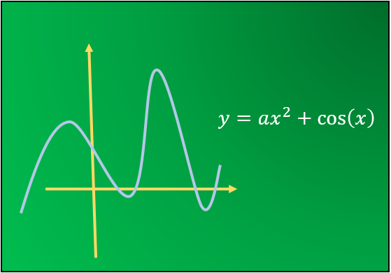
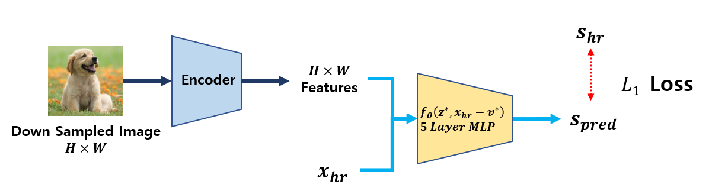
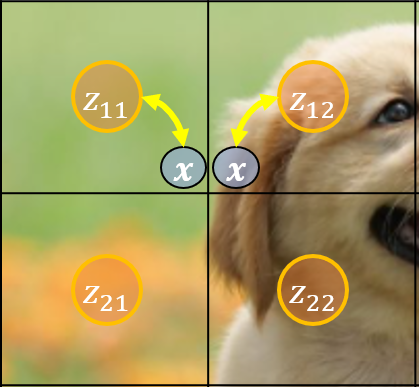
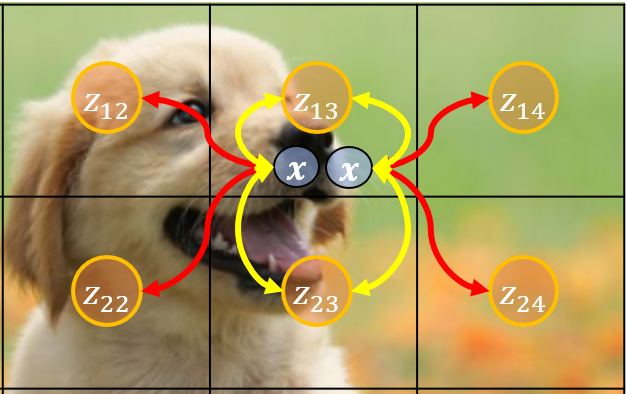
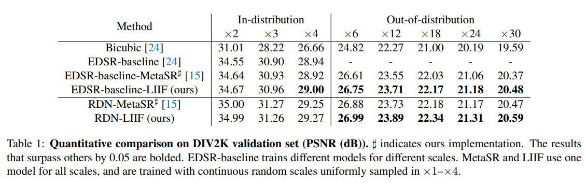

# Learning Continuous Image Representation with Local Implicit Image Function [Kor]

[English version](cvpr-2021-liif-eng.md) of this article is available.

## 📑 1. Problem Definition

### Image as a Function

Image Representation에 대한 기초는 이미지를 함수로 나타내는데서 시작합니다. 함수는 입력을 넣으면 무언가 값을 반환해주는 거죠. $$X$$에 따라서 $$Y$$의 값이 바뀌는데, **Figure 1**의 다항함수, 지수함수, 삼각함수처럼 쉬울 수도 있고, 아니면 **Figure 2** 처럼 무지 복잡할 수도 있습니다.

|           Figure 1          |                                  Figure 2                                 |
| :-------------------------: | :-----------------------------------------------------------------------: |
|   |                                                 |
| 단순한 형태의 함수는 함수식을 유추하기 쉽습니다. | 이미지처럼 각 픽섹 위치에 대해서 RGB값이 다양한 경우, 위치가 주어졌을 때, R,G,B를 맵핑하는 함수를 찾는 것은 어려습니다. |

**Image -> Function :** 이미지는 픽셀 $$(x,y)$$ 좌표에 대해서 RGB 값을 반환하는 함수로 생각할 수 있습니다. **Figure 2** 처럼 이미지 함수는 한눈에 봐도 굉장히 복잡하고, 여기에 맞는 다항함수나 $$Sine, Cosise$$ 함수를 찾는 것은 불가능에 가깝습니다. 그러므로 이미지의 값을 대응시키는 함수를 찾는 것은 결코 쉬운 게 아니고, 이를 인공신경망으로 학습하려는 시도가 있었습니다. 이 분야를 **Neural Implicit Represenation (NIR)** 이라고 합니다.

### Why we need NIR??

굳이 이미지를 함수로 학습시키는 목적은 다음과 같이 2가지가 있습니다.

1. Neural Network의 파라미터 수가 이미지 데이터 사이즈보다 작다면 **데이터 압축효과**가 있습니다.
2.  이미지는 기본적으로 Discrete (Pixel 1, Pixel 2, ...) 인데, **연속적인 함수**로 나타냄으로써 픽셀 사이의 위치에 대한 RGB를 알 수 있습니다. (⭐)

포스팅에서 소개하는 논문도 CVPR 2021에 출판된 NIR 관련 논문으로 (⭐) 두 번째 목적 (**Continuous Representation**)을 다뤘습니다.본 포스팅은 논문의 두 가지 contribution을 설명합니다.

* Discrete Image를 Continuous 한 이미지 표현으로 학습시키는 방법
* Continuous Representation을 통해 더 높은 Resolution을 만드는 방법

## 📑 2. Local Implicit Image Function (LIIF)

### Definition

픽셀 $$x$$ 에 대해서 RGB 값을 유추하는 함수는 $$s = f_\theta (x)$$ 로 나타낼 수 있습니다. 모델은 픽셀 위치 정보를 기반으로 RGB값(혹은 Grey scale)을 유추합니다. **제안한 모델인 Local Implicit Image Function(LIIF)** 는 Latent Code를 이용하여 Image 에 대한 정보 $$M \in \mathbb{R}^{H\times W \times D}$$ 가 있을 때, 이를 Continuous image $$I$$ 로 학습시키는 것을 목적으로 합니다. **위치 정보 **$$x$$** 뿐만 아니라, Latent Code에도 의존시킨** LIIF의 모델은 다음과 같습니다.



$$s = f_\theta (z,x)$$



* $$s = f_\theta (z,x)$$
* $$s$$ : 하나의 픽셀에 대한 RGB 값
* $$x$$ : Continuous space에서 위치
* $$z$$ : Latent Code
* $$f, \theta$$ :neural network , neural network의 파라미터



### Latent Code for continuous position

Latent Code는 $$[0,H]\times [0,W]$$ 이미지가 있을 때, 각 픽셀마다 Latent Code가 있습니다. 따라서 전체 $$ H \times W $$ 개의 Latent Code가 있습니다. **이름이 Latent Code인 이유는,** $$H\times W$$ **가 Low Resolution 이미지에 대한 크기이기 때문에, 원래 이미지보다 픽셀 수가 적기 때문입니다.** 이로부터 원하는 continuous 위치 $$x$$ 가 있을 때, 가까운 Latent code를 선택해주면 됩니다. Figure 4에서는 $$x$$ 위치에 대해서 1개가 아닌 **4 개의 Latent Code**를 선택하였는데, 이를 논문에서는 **Local ensemble**이라고 부릅니다. 이를 사용하는 이유는 4.3 에서 다루겠습니다.

|                            Figure 3                           |                                  Figure 4                                  |
| :-----------------------------------------------------------: | :------------------------------------------------------------------------: |
|                                          |                                                       |
| 전체 4x4 Pixel이 있을 때, Latent Code는 4x4 개가 각 위치별로 고르게 분포되어 있습니다. | continuous 한 위치 $$x$$ 에 대해서 $$z^*$$ 는 $$x$$ 에서 가까운 4개의 Latent Code로 정해집니다. |


🧐 Latent code값에 대한 몇 가지 의문점을 집고 넘어가겠습니다.

_**Q1.** Latent Code값(혹은 초기값)은 무엇인가?_

**A1.** Pretrained Encoder(EDSR 혹은 RDN)로 이미지를 인코딩 후 얻은 Feature Vector

_**Q2.** 여러 이미지가 있을 때, Latent Code는 공유되는가?_ 

**A2.** (No) Pretrained Model로부터 이미지를 인코딩하기 때문에 이미지마다 Latent Code가 생긴다.

_**Q3.** LIIF Training 시 Latent Code는 변하는가?_

**A3.** (Yes), Freezing 하지 않는다.


### Continuous Representation using Latent Code

이미지에 대한 Latent Code가 고정되어 있으므로 이를 기반으로 Continuous Image의 $$x$$ 좌표에 대한 RGB 값은 Latent Code의 위치 $$v*$$ 와 $$x$$의 차이를 입력으로 넣어서 계산됩니다. Latent code와 상대위치를 넣는 continous representation은 다음과 같습니다.



$$I(x) = \sum_{t \in \{ 00, 01,10,11 \}} \frac{S_t}{S} \cdot f_\theta (z_t^*, x - v_t^*)$$



* $$I(x) = \sum_{t \in \{ 00, 01,10,11 \}} \frac{S_t}{S} \cdot f_\theta (z_t^*, x - v_t^*)$$
* $$s$$ : 하나의 픽셀에 대한 RGB 값
* $$x$$ : Continuous space에서 위치
* $$z$$ : Latent Code
* $$f, \theta$$ :neural network , neural network의 파라미터
* $$S_t$$ : $$x$$와  $$z_t$$에 의해서 생기는 사각형의 넓이
* $$S = \sum_{t \in \{ 00, 01,10,11 \}} S_t$$ 



입력으로 Latent Code와의 거리 차이가 주어지기 때문에, continuous 한 거리 차이를 입력으로 넣게 된다면, 이미지에 대한 **continuous representation** 을 얻게 됩니다. Figure 5 에서 나타나듯이, 연속적인 $$x$$들을 다양하게 선택할 수 있고, continous한 상대위치 $$x - v_t^*$$ 값이 계산됩니다.

## 📑 3. Pipeline

위에서 **Latent Code**와 **LIIF 함수**의 의미를 살펴봤습니다. 주어진 데이터에 대해서 해당 모델을 학습시키기 위해서 저자는 **Self-Supervised Learning** 방법을 제안하였습니다. 데이터와 학습 방법에 대해서 알아보겠습니다.

1. ✔️ Data Preparation 단계
2. ✔️ Training 단계

### Data Preparation

Data Preparation에서는 **Down-sampling된 이미지**(이미지의 픽셀 수 감소)와 예측할 pixel 위치 $$x_{hr}$$ 와 RGB 값 $$s_{hr}$$ 을 준비합니다. **Figure 6** 에 나타나있듯이, 주어진 이미지를 Down-sampling하여 크기를 줄이고 이 정보로부터 사이즈가 큰 원래 이미지의 픽셀에 대한 RGB를 예측합니다. 즉, Higer resolution을 타겟팅하여 학습하고자 합니다. 픽셀에 대한 내용은 밑에서 조금 더 자세히 설명하겠습니다.

### Training

학습할 때는 Down-sampling된 이미지($$48\times48$$)를 pretrained encoder에 넣어서 feature vector를 뽑아줍니다. 이 값이 Latent Code 역할을 하며, pretrained encoder는 이미지의 사이즈를 그대로 유지해줍니다. **Figure 7** 처럼 **Data Preparation 단계에서 얻은 $$x_{hr}$$ 과 Latent Code들을 LIIF model에 넣어줌으로써, 원하는 RGB값 $$s_{hr}$$을 예측합니다.** 
이후 실제 값과 $$L1$$ Loss로 계산해주면 학습이 됩니다.


🚨 인코더의 역할은 이미지 개별에 대한 Latent Code를 뽑아내는 것 입니다. 따라서 다양한 이미지 샘플에 대한 학습이 가능합니다. 기존에 NIR이 이미지 하나에 대해서 Fitting 하는 것과 차이가 있습니다.





> 🧐 input의 크기는 48x48 인데, 224x224 를 얻는 방법은 무엇일까?




🧐 input의 크기는 48x48 인데, 224x224 를 얻는 방법은 무엇일까?

이미지의 size가 48x48 이나 224x224로 Resolution이 다를지라도, 두 이미지는 동일한 이미지를 나타내고 있습니다. 따라서 두 이미지를 모두 \[0,1]x\[0,1] 로 normalize 한다면, 픽셀 크기에 상관없는 이미지를 얻을 수 있습니다.

그래서 Data Preparation 단계에서는 Ground Truth 이미지로부터 샘플된 위치가 \[0,224]의 범위가 아닌 \[0,1] 범위입니다.



## 📑 4. Additional Engineering

LIIF 방법에 추가적인 방법들을 통해서 성능을 올릴 수 있습니다. 여기서는 총 3개의 방법이 제안되며, 셋다 사용했을 때, 가장 좋은 성능을 보입니다.

1. ✔️ Featuer Unfolding : Latent Code를 주변 3x3 Latent Code 와 Concatenation
2. ✔️ Local Ensemble : continuous position $$x$$에 대해서 4개의 Latetn Code 선택
3. ✔️ Cell Decoding : RGB를 Prediction할 때, 원하는 cell size 추가.

### Feature Unfolding

Encoder로부터 나온 Feature (Latent Code)에 대해서, 주변 3x3에 대한 concatenation을 함으로써, 위치에 대한 표현력을 높입니다. 이 경우, input의 dimesion에 대한 size는 9배 증가하게 됩니다. 

$$\hat{M}_{jk} = Concat(\{ M_{j+l, k+m} \}_{l,m \in \{-1,0,1\}})$$

### Local Ensemble

거리 기반으로 Latent Code를 선택하는데 한 가지 문제점이 있습니다. 거리 기반으로 선택하게 된다면 **Figure 8** 처럼 다음 Latent Code로 넘어가게 되는 시점에서 두 $$x$$ 사이의 거리가 굉장히 가까울지라도 Latent Code가 다를 수 있다는 것 입니다. 이를 해결하기 위해서 **Figure 9**처럼 주변 4개의 Latent Codes를 선택하는 방법입니다. 

|                                Figure 8                                |                       Figure 9                      |
| :--------------------------------------------------------------------: | :-------------------------------------------------: |
|                                                 |                              |
| 만일 가장 가까운 Latent Code 하나만 고른다면, 범위를 넘어가면서 Latent Code가 급변하는 현상이 나타납니다. | 사분면에 대해서 가까운 4개를 고른다면 선택에 대한 범위를 넘어갈 때 절반만 바뀌게 됩니다. 왼쪽 $$x$$ 에 대해서는 가까운 위치에 있는 $$z_{12}, z_{13}, z_{22}, z_{23}$$ Latent Code가 선택되며, 오른쪽 x에 대해서는 가까운 위치에 있는 $$z_{13}, z_{14}, z_{23}, z_{24}$$가 선택됩니다.  |

### Cell Decoding

LIIF 모델은 위치에 대한 정보와 근처 Latent Code의 정보를 줍니다. 하지만 우리가 어느 정도의 Resolution을 목표로 하는지 알려주지 못합니다. 예를 들어서, $$48\times 48$$ 에서 $$224 \times 224$$ 로 해상도를 높일 때, 좌표에 대한 정보는 주지만, 우리가 목표로 하는 Decoding Cell의 사이즈를 주지 못합니다. 예시에서는 해당 위치로부터 $$2\times2$$의 크기를 원한다는 것을 알려줘야 합니다. Cell Decoding을 포함한 LIIF 는 다음과 같습니다. 기존 Pixcel값에 Cell 크기를 추가적으로 붙여서 입력으로 넣어줍니다.



$$s = f_{cell} (z, [x,c])$$



* $$s = f_{cell} (z, [x,c])$$
* $$c = [c_h, c_w]$$



## 📑 5. Experiments

### High Resolution Benchmark

**Figure 10** 은 **High Resolution Benchmark인 DIV2K** 데이터셋에 대해서 성능을 보여줍니다. 첫 번째 Row Group은 EDSR 인코더를, 두 번째 Row Group은 RDN 인코더를 사용한 경우를 나타냅니다.

* EDSR 을 사용한 경우, 다른 High Resolution 방식들보다 더 높은 성능을 보입니다. 또한 Out-of-distribution에 대해서는 제안된 모델이 더욱 높은 성능을 보입니다. 이는 x1\~x4배로 high resolution을 만들도록 학습한 모델에 더 높은 resoltuion을 요구한 경우입니다. LIIF모델이 더 높은 성능을 보이는 것은 Latent code의 상대 위치를 기반으로 예측하기 때문으로 추측합니다.
* RDN 인코더를 사용한 경우는, in-distribution에 대해서 비슷한 성능을 보이지만 마찬가지로 out-of-distribution에 대해서 높은 성능을 보입니다.

**💡 결과적으로 LIIF 모델은 더 높은 resolution을 요구하는 경우, 다른 모델에 비해서 월등한 성능을 보인다는 것을 확인할 수 있습니다.**


🧐 Difference between RDN and EDSR 

RDN은 Residual Deep Network를 나타내며 EDSR은 Enhanced Deep Residual Networks으로 RDN 이후 개발된 모델입니다. 둘 다 Low Resolution으로부터 High Resolution을 타겟팅하는 CNN + Upsampling 구조인 것은 동일지히만, EDSR은 Batch-Normalizaiton을 사용하지 않으며, 파라미터 수가 RDN보다 적으면서 더 좋은 성능을 내는 모델입니다. High Resolution을 위해, 이미지를 인코딩하는 대표적인 모델입니다. 



### Continuous Representation

Continuous Representation을 잘 학습했다면 **이미지를 확대했을 때도 끊기지 않고 제대로 보여야 합니다.** 
다른 NIR이나 High resolution 모델들과 비교했을 때, LIIF의 이미지는 더욱 연속적인 형태로 나타나게 됩니다. 다른 모델들이 약간의 끊기는 현상이나, Blur 효과가 있는 반면, LIIF 모델은 생성된 이미지가 굉장히 부드러운 것을 확인할 수 있습니다.

## 📑 6. Conclusion

이 논문에서는 연속적인 이미지 표현을 위한 **Local Implicit Image Function**($$f(z, x-v)$$)을 제안하였습니다. Latent code의 위치에서 특정 위치까지 떨어진 점의 RGB 값을 유추함으로써 continuous image representation을 가능하게 만들었습니다. 또한 이미지 개별이 아닌, 이미지를 pre-trained encoder를 사용하여 이미지에 대한 feature vector를 latent code의 기반으로 사용함으로써, 다양한 이미지에 대해 적용가능한 Training 기법을 제안하였습니다. 

이미지는 픽셀 위치에 대해서 RGB 값을 가지기 떄문에, 너무 큰 이미지는 데이터의 용량에 대한 이슈로 저장하기 어려운 점이 있습니다. 만일 NIR이 더욱 발달하여, 훨씬 적은 모델로 이미지를 외울 수 있는 모델이 있다면, 데이터 전송 시, 이미지를 보내는 것이 아니라, Neural Network를 보내는 것도 향후에는 가능할 것 같습니다. 

## Take Home Message 

보통 Implicit Neural Represenation은 주어진 데이터로부터 바로 함수를 학습시키는 것을 목표로 합니다. 그래서 데이터가 있을 때마다 함수를 새로 학습해야 하죠. 
딥러닝을 이용하면, 이미지로부터 Feature Vector를 뽑을 수 있기에, Feature Vector를 input으로 일반화시켜서 학습시키는 것이 가능한 것을 이 논문에서 확인할 수 있었습니다. 
또한 Continuous Domain을 Feature로부터 거리로 해석한 것도 좋은 접근법입니다. 

## 📑 Author / Reviewer information

### Author 

1. 박범진 (Bumjin Park): KAIST / bumjin@kaist.ac.kr 

### Reviewer 

* None

## 📰 References & Additional materials

* [LIIF official Github](https://github.com/yinboc/liif)

* [Enhanced Deep Residual Networks for Single Image Super-Resolution (EDSR)](https://arxiv.org/abs/1707.02921)
* [Residual Dense Network (RDN)](https://github.com/yulunzhang/RDN)

