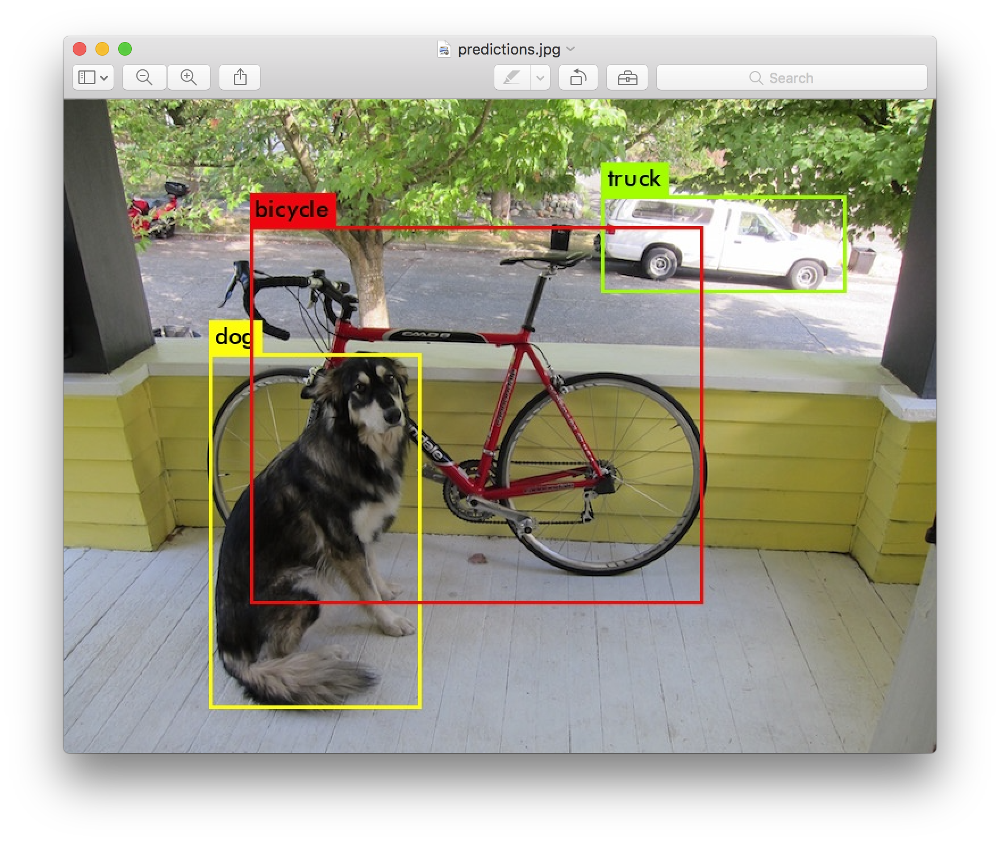
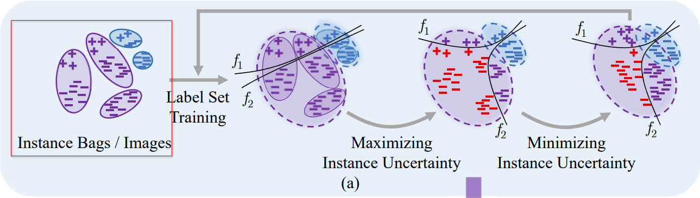

# Multiple Instance Active Learning for Object Detection \[Kor\]

**English version** of this article is available [**here**](cvpr-2021-miaod-eng.md).

## **1. Problem definition**
이 논문의 제목을 보시면 저자들이 ***Object Detection***을 위해서 ***Multiple Instance Active Learning*** 하고 싶은 것을 알 수 있습니다. 근데 **Active Learning**과 **Instance**라는 것은 뭘까요? 개념들을 제대로 한번 정해봅시다.

### **Active Learning**
**Active Learning**에 대해 인터넷에서 한번 찾아보시면 결과가 많이 나왔죠? 그들은 두 카테고리 (사람의 Active Learning과 AI Active Learning)로 나뉠 수 있습니다. 먼저 사람의 Active Learning라는 방법을 간단히 설명드리자면 학습자가 자기의 학습 과정을 적극적으로 스스로 이끄는 것입니다. 한국어에는 자기주도학습이랍니다 [\[humanactivelearn\]][humanactive1]. 예를들어 수업을 들면 그냥 듣기만 하는 게 아니고 그룹 프로젝트, 토론, 발표 등 같은 활동도 포함됩디다.

인공지능 환경에서도 마찬가지입니다. 모델들에게 데이터를 많이 주고 오랫동안 학습시키는 것은 좋지 않은 경우도 있습니다. 예를 들면 데이터 품질은 좋지 않으면 그냥 시간 낭비뿐만 아니라 모델 정확도가 줄어질 수도 있습니다. 반면에 모델이 학습 데이터를 스스로 고르는 게 어떨까요? 만약에 그거 진짜 가능하냐고 궁금하신 불들이 계시면 '네. 가능죠. 가능할 뿐만 아니라 모델 성능도 향상시킬 수도 있습니다.'라는 답변 드리죠. 자세한 학습 방법에 대해 바로 알려드리고 싶지만 지금은 개념 설명이 좀 더 있습니다.

### **Multiple Instance Learning**
Object Detection에서 input는 보통 이미지나 동영상 프레임이며 그 이미지나 프레임 속에는 인간, 동물, 자동차, 오토바이크 등등 같은 다양한 물체가 나타나는 겁니다. Object Detection model은 그 물체들 위치를 찾은 후 bounding box 그리고 물체류를 추즉해야 합니다. 명확성을 위해서 본 글에서 two-stage detector에 대해서만 말하겠습니다.

<figure>
    

        
        

  

    Figure 1: An example of Object Detection [source: https://pjreddie.com/darknet/yolo/]

</figure>

RetinaNet [\[lin2017\]][lin2017] 같은 two-stage detectors 작동 과정에서 첫 번째 머쥴은 이미지 속에 물체가 있는 가능성이 높은 수많은 구역들을 추천하고 이 구역들은 anchor box이나 (이 논문에서는) instance라고 합니다. background만 포함하는 instance는 ***negative instance***라고 반면에 실제로 물제가 있는 instance는 positive instance라고 저의됩니다. 또한 이미지는 속에 많은 instance가 생길 수도 있기 때문에 instance bag이라고요.

<figure>
    

        
        

  

    <figcaption>Figure 2: Example of instance bags [source: MI-AOD's Figure 2]</figcaption>

</figure>

사진을 보시면 많은 instances 중에 빨간섹인 플러스과 마이너스 기호가 몇 개가 있죠. 그 것들이 학습 과정에 유익한 instance이기 때문에 이 논문의 최고의 목적은 그 것들을 찾는 겁니다.

### **Formal Definition**

우리는 여기까지 배웠던 가장 중요한 단어를 이제 수학적으로 한번 다시 정의해봅시다. 

기계학습과 인공지능에서 잘 label된 데이터는 최고입니다. 하지만 데이터 labeling 작업은 시간과 비용을 너무 많이 걸립니다. 따라서 이 논문의 제안된 방식은 unlabel된 데이터 중에 유익한 sample들을 고르고 그들로 모델 training하려고 합니다. 또한 제안된 방식은 효과를 명확히 보여주기 위해 label된 데이터세트 ![][x-y-0-l]는 unlabel의 세트 ![][y-0-l]에 비하면 너무 적다는 가정을 합니다. 

이미지 ![][x-in-x-0-l], 아니면  ![][x-in-x-0-u], bag of instances ![][x-set]로 보일 수 있습니다. Label 세트 ![][y-0-l]는 bounding box의 좌표 세트 ![][y-loc-x]과 물체류 ![][y-cls-x] 세트로 구성됩니다. 이 논문에서, 저자들은 먼저 detection 모델 (예: RetinaNet [\[lin2017\]][lin2017])을 양이 적은 label된 데이터세트 ![][x-y-0-l]로 training한 후, 그 모델로 unlabel된 세트에서 ![][k] 가지의 가장 좋은 sample 를 샌택해서 선택된 sample들를 label된 이지미 세트 ![][x-0-l]에 추가합니다. 

## **2. Motivation**

### **Uncertainty**

1. Uncertainty의 두 가지의 종류.

[\[humanactivelearn\]][humanactive1] “자기주도학습의 정의” https://slc.gangdong.go.kr:9443/front/intropage/intropageShow.do?page_id=f637a1b9b0ec443bbcd15ec58ca3bb97. (accessed Oct. 23, 2021).

[humanactive1]: https://www.queensu.ca/teachingandlearning/modules/active

[\[mitlecture\]][mitlecture] 
A. Amini, “MIT 6.S191: Evidential Deep Learning and Uncertainty.” https://www.youtube.com/watch?v=toTcf7tZK8c&t=2061s (accessed Oct. 23, 2021).

[mitlecture]: https://www.youtube.com/watch?v=toTcf7tZK8c&t=2061s

[\[ulkumen-uncertainty\]][ulkumen-uncertainty] C. R. Fox and G. Ulkumen, “Distinguishing Two Dimensions of Uncertainty,” SSRN Electron. J., 2021, doi: 10.2139/ssrn.3695311.

[ulkumen-uncertainty]: https://papers.ssrn.com/sol3/papers.cfm?abstract_id=3695311

[\[lewis1994a\]][lewis1994a] D. D. Lewis and J. Catlett, “Heterogeneous Uncertainty Sampling for Supervised Learning,” Mach. Learn. Proc. 1994, pp. 148–156, 1994, doi: 10.1016/b978-1-55860-335-6.50026-x.

[lewis1994a]: http://www.cs.cornell.edu/courses/cs6740/2010fa/papers/lewis-catlett-uncertainty-sampling.pdf

[\[lewis1994b\]][lewis1994b] D. D. Lewis and W. A. Gale, “A sequential algorithm for training text classifiers,” Proc. 17th Annu. Int. ACM SIGIR Conf. Res. Dev. Inf. Retrieval, SIGIR 1994, pp. 3–12, 1994, doi: 10.1007/978-1-4471-2099-5_1.

[lewis1994b]: https://arxiv.org/pdf/cmp-lg/9407020.pdf

[\[roth2006\]][roth2006] D. Roth and K. Small, “Margin-based active learning for structured output spaces,” Lect. Notes Comput. Sci. (including Subser. Lect. Notes Artif. Intell. Lect. Notes Bioinformatics), vol. 4212 LNAI, pp. 413–424, 2006, doi: 10.1007/11871842_40.

[roth2006]: https://doi.org/10.1007/11871842_40

[\[joshi2010\]][joshi2010] A. J. Joshi, F. Porikli, and N. Papanikolopoulos, “Multi-class active learning for image classification,” 2009 IEEE Conf. Comput. Vis. Pattern Recognit., pp. 2372–2379, 2010, doi: 10.1109/cvpr.2009.5206627.

[joshi2010]: https://doi.org/10.1109/cvpr.2009.5206627

[\[lou2013\]][lou2013] W. Luo, A. G. Schwing, and R. Urtasun, “Latent structured active learning,” Adv. Neural Inf. Process. Syst., pp. 1–9, 2013.

[lou2013]: https://papers.nips.cc/paper/2013/hash/b6f0479ae87d244975439c6124592772-Abstract.html

[\[settles2008\]][settles2008] B. Settles and M. Craven, “An analysis of active learning strategies for sequence labeling tasks,” EMNLP 2008 - 2008 Conf. Empir. Methods Nat. Lang. Process. Proc. Conf. A Meet. SIGDAT, a Spec. Interes. Gr. ACL, pp. 1070–1079, 2008, doi: 10.3115/1613715.1613855.

[settles2008]: https://www.biostat.wisc.edu/~craven/papers/settles.emnlp08.pdf

[\[settles2007\]][settles2007] B. Settles, M. Craven, and S. Ray, “Multiple-instance Active Learning,” in NIPS, 2007, pp. 1289–1296.

[settles2007]: https://dl.acm.org/doi/10.5555/2981562.2981724%0A%0A.

[\[roy2007\]][roy2007] N. Roy, A. Mccallum, and M. W. Com, “Toward optimal active learning through monte carlo estimation of error reduction.,” Proc. Int. Conf. Mach. Learn., pp. 441–448, 2001.

[roy2007]: https://dl.acm.org/doi/10.5555/645530.655646

[\[carbonneau2017\]][carbonneau2017] M. Carbonneau, E. Granger, and G. Gagnon, “Bag-Level Aggregation for Multiple Instance Active Learning in Instance Classification Problems,” arXiv, 2017.

[carbonneau2017]: https://arxiv.org/abs/1710.02584

[\[wang2017\]][wang2017] R. Wang, X. Z. Wang, S. Kwong, and C. Xu, “Incorporating Diversity and Informativeness in Multiple-Instance Active Learning,” IEEE Trans. Fuzzy Syst., vol. 25, no. 6, pp. 1460–1475, 2017, doi: 10.1109/TFUZZ.2017.2717803.

[wang2017]: https://ieeexplore.ieee.org/document/7953641

[\[hwang2017\]][hwang2017] S. Huang, N. Gao, and S. Chen, “Multi-Instance Multi-Label Active Learning,” in International Joint Conference on Artificial Intelligence, 2017, pp. 1886–1892.

[hwang2017]: https://www.ijcai.org/proceedings/2017/0262.pdf

[\[sener2018\]][sener2018] O. Sener and S. Savarese, “Active Learning for Convolutional Neural Networks: A Core-Set Approach,” in ICLR, 2018, pp. 1–13.

[sener2018]: https://arxiv.org/abs/1708.00489

[\[lin2017\]][lin2017] T.-Y. Lin, P. Goyal, R. Girshick, K. He, and P. Dollár, “Focal Loss for Dense Object Detection,” arXiv, Aug. 2017, [Online]. Available: http://arxiv.org/abs/1708.02002.

[lin2017]: https://arxiv.org/abs/1708.02002

[\[voc2007\]][voc2007] E. M., V.-G. L., W. C. K. I., W. J., and Z. A., “The Pascal Visual Object Classes (VOC) Challenge,” Int. J. Comput. Vis., vol. 88, no. 2, pp. 303–338, 2010.

[voc2007]: http://host.robots.ox.ac.uk/pascal/VOC/voc2007/

[\[coco2015\]][coco2015] T. Lin et al., “Microsoft COCO: Common Objects in Context,” arXiv, pp. 1–15, May 2015.

[coco2015]: http://arxiv.org/abs/1405.0312

[\[he2015\]][he2015] K. He, X. Zhang, S. Ren, and J. Sun, “Deep Residual Learning for Image Recognition,” in CVPR, 2016, pp. 770–778, doi: 10.1002/chin.200650130.

[he2015]: https://openaccess.thecvf.com/content_cvpr_2016/html/He_Deep_Residual_Learning_CVPR_2016_paper.html

[\[simonyan2015\]][simonyan2015] K. Simonyan and A. Zisserman, “Very deep convolutional networks for large-scale image recognition,” in 3rd International Conference on Learning Representations, ICLR 2015 - Conference Track Proceedings, 2015, pp. 1–14.

[simonyan2015]: https://arxiv.org/pdf/1409.1556.pdf

[\[liu2016\]][liu2016] W. Liu et al., “SSD: Single Shot MultiBox Detector,” in ECCV, 2016, vol. 9905, pp. 21–37, doi: 10.1007/978-3-319-46448-0.

[liu2016]: https://link.springer.com/chapter/10.1007/978-3-319-46448-0_2

[iur]: /.gitbook/assets/11/iur.png

[g]: /.gitbook/assets/11/equations/g.png
[i]: /.gitbook/assets/11/equations/i.png
[yhat-f1]: /.gitbook/assets/11/equations/yhat-f1.png
[yhat-f2]: /.gitbook/assets/11/equations/yhat-f2.png
[yhat-fr]: /.gitbook/assets/11/equations/yhat-fr.png
[equation1]:/.gitbook/assets/11/equations/equation1.png
[equation2]:/.gitbook/assets/11/equations/equation2.png
[equation3]:/.gitbook/assets/11/equations/equation3.png
[equation4]: /.gitbook/assets/11/equations/equation4.png
[equation5]: /.gitbook/assets/11/equations/equation5.png
[equation6]: /.gitbook/assets/11/equations/equation6.png
[equation7]: /.gitbook/assets/11/equations/equation7.png
[equation8]: /.gitbook/assets/11/equations/equation8.png
[equation9]: /.gitbook/assets/11/equations/equation9.png
[equation10]: /.gitbook/assets/11/equations/equation10.png
[theta-g]: /.gitbook/assets/11/equations/theta-g.png
[f1]: /.gitbook/assets/11/equations/f1.png
[f2]: /.gitbook/assets/11/equations/f2.png
[fr]: /.gitbook/assets/11/equations/f2.png
[theta-set]: /.gitbook/assets/11/equations/theta-set.png
[theta-f1]: /.gitbook/assets/11/equations/theta-f1.png
[theta-f2]: /.gitbook/assets/11/equations/theta-f2.png
[yhat-ic]: /.gitbook/assets/11/equations/yhat-ic.png
[f-mil]: /.gitbook/assets/11/equations/f-mil.png
[x-0-u]: /.gitbook/assets/11/equations/x-0-u.png
[x-0-l]: /.gitbook/assets/11/equations/x-0-l.png
[x-y-0-l]: /.gitbook/assets/11/equations/x-y-0-l.png
[x-in-x-0-l]: /.gitbook/assets/11/equations/x-in-x-0-l.png
[x-in-x-0-u]: /.gitbook/assets/11/equations/x-in-x-0-u.png
[x-set]: /.gitbook/assets/11/equations/x-set.png
[y-loc-x]: /.gitbook/assets/11/equations/y-loc-x.png
[y-cls-x]: /.gitbook/assets/11/equations/y-cls-x.png
[y-0-l]: /.gitbook/assets/11/equations/y-0-l.png
[k]: /.gitbook/assets/11/equations/k.png

[yhat-i-cls]: /.gitbook/assets/11/equations/yhat-i-cls.png
[tilde-l-dis]: /.gitbook/assets/11/equations/tilde-l-dis.png
[table1]: /.gitbook/assets/11/table1.png
[table2]: /.gitbook/assets/11/table2.png
[table3]: /.gitbook/assets/11/table3.png
[table4]: /.gitbook/assets/11/table4.png
[table5]: /.gitbook/assets/11/table5.png