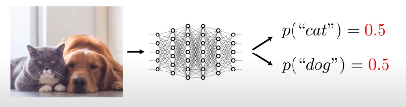
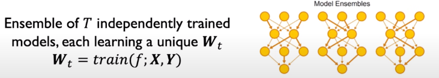
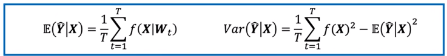
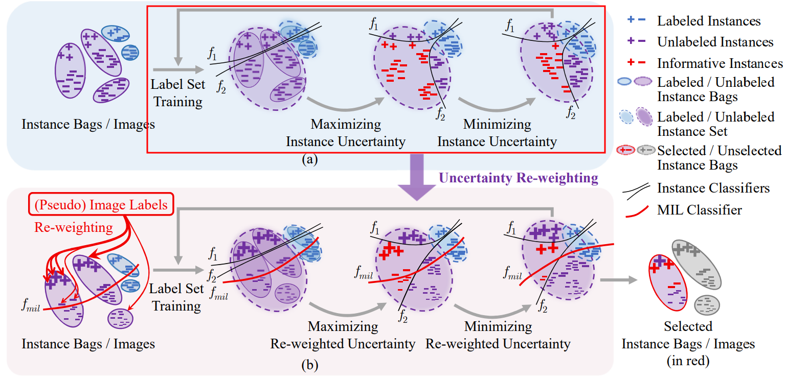
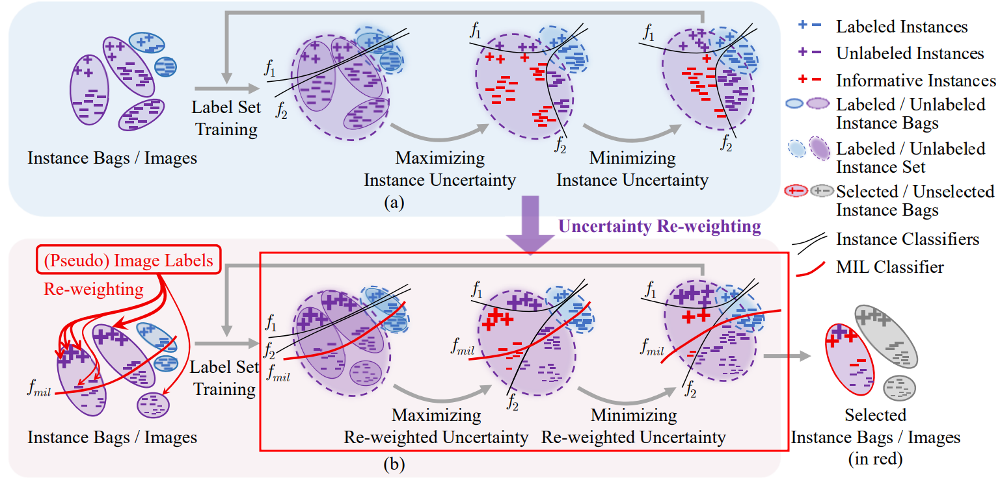
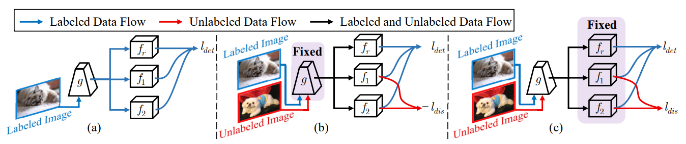

# Multiple Instance Active Learning for Object Detection \[Kor\]

**English version** of this article is available [**here**](cvpr-2021-miaod-eng.md).

## **1. Problem definition**
이 논문의 제목을 보시면 저자들이 ***Object Detection***을 위해서 ***Multiple Instance Active Learning*** 하고 싶은 것을 알 수 있습니다. 근데 **Active Learning**과 **Instance**라는 것은 뭘까요? 개념들을 제대로 한번 정해봅시다.

### **Active Learning**
**Active Learning**에 대해 인터넷에서 한번 검색해보시면 결과가 많이 나왔죠? 그들은 두 카테고리 (사람의 Active Learning과 AI Active Learning)로 나뉠 수 있습니다. 먼저 사람의 Active Learning라는 방법을 간단히 설명드리자면 학습자가 자기의 학습 과정을 적극적으로 스스로 이끄는 것입니다. 한국어에는 자기주도학습이랍니다 [\[humanactivelearn\]][humanactive1]. 예를들어 수업을 들면 그냥 듣기만 하는 게 아니고 그룹 프로젝트, 토론, 발표 등 같은 활동도 포함됩디다.

인공지능 환경에서도 마찬가지입니다. 모델들에게 데이터를 많이 주고 오랫동안 학습시키는 것은 좋지 않은 경우도 있습니다. 예를 들면 데이터 품질은 좋지 않으면 그냥 시간 낭비뿐만 아니라 모델 정확도가 줄어질 수도 있습니다. 반면에 모델이 학습 데이터를 스스로 고르는 게 어떨까요? 만약에 그거 진짜 가능하냐고 궁금하신 불들이 계시면 '네. 가능죠. 가능할 뿐만 아니라 모델 성능도 향상시킬 수도 있습니다.'라는 답변 드리죠. 자세한 학습 방법에 대해 바로 알려드리고 싶지만 지금은 개념 설명이 좀 더 있습니다.

### **Multiple Instance Learning**
Object Detection에서 input는 보통 이미지나 동영상 프레임이며 그 이미지나 프레임 속에는 인간, 동물, 자동차, 오토바이크 등등 같은 다양한 물체가 나타나는 겁니다. Object Detection model은 그 물체들 위치를 찾은 후 bounding box 그리고 물체류를 추즉해야 합니다. 명확성을 위해서 본 글에서 two-stage detector에 대해서만 말하겠습니다.

<figure>
    

        
        

  

    Figure 1: An example of Object Detection [source: https://pjreddie.com/darknet/yolo/]

</figure>

RetinaNet [\[lin2017\]][lin2017] 같은 two-stage detectors 작동 과정에서 첫 번째 머쥴은 이미지 속에 물체가 있는 가능성이 높은 수많은 구역들을 추천하고 이 구역들은 anchor box이나 (이 논문에서는) instance라고 합니다. background만 포함하는 instance는 ***negative instance***라고 반면에 실제로 물제가 있는 instance는 positive instance라고 저의됩니다. 또한 이미지는 속에 많은 instance가 생길 수도 있기 때문에 instance bag이라고요.

<figure>
    

        
        

  

    <figcaption>Figure 2: Example of instance bags [source: MI-AOD's Figure 2]</figcaption>

</figure>

사진을 보시면 많은 instances 중에 빨간섹인 플러스과 마이너스 기호가 몇 개가 있죠. 그 것들이 학습 과정에 유익한 instance이기 때문에 이 논문의 최고의 목적은 그 것들을 찾는 겁니다.

### **Formal Definition**

우리는 여기까지 배웠던 가장 중요한 단어를 이제 수학적으로 한번 다시 정의해봅시다. 

기계학습과 인공지능에서 잘 레이블링된 데이터는 최고입니다. 하지만 데이터 레이블링 작업은 시간과 비용을 너무 많이 걸립니다. 따라서 이 논문의 제안된 방식은 레이블링되지 않은 데이터 중에 유익한 샘플들을 고르고 그들로 모델 training하려고 합니다. 또한 제안된 방식은 효과를 명확히 보여주기 위해 레이블링된 데이터세트 ![][x-y-0-l]는 레이블링되지 않은 세트 ![][y-0-l]에 비하면 너무 적다는 가정을 합니다. 

이미지 ![][x-in-x-0-l], 아니면  ![][x-in-x-0-u], bag of instances ![][x-set]로 보일 수 있습니다. 레이블링된 세트 ![][y-0-l]는 bounding box의 좌표 세트 ![][y-loc-x]과 물체류 ![][y-cls-x] 세트로 구성됩니다. 이 논문에서, 저자들은 먼저 detection 모델 (예: RetinaNet [\[lin2017\]][lin2017])을 양이 적은 레이블링된 데이터세트 ![][x-y-0-l]로 training한 후, 그 모델로 레이블링되지 않은 세트에서 ![][k] 가지의 가장 좋은 샘플를 샌택해서 선택된 샘플들를 레이블링된 이지미 세트 ![][x-0-l]에 추가합니다. 

## **2. Motivation**

### **Uncertainty**

1. Uncertainty의 두 가지의 종류.
   
   인공지능 모델은 Active Learning하려면 자기가 얼마나 모르는지 항상 궁금해야 됩니다. 하지만 그 것을 그냥 softmax 함수로 측정하면 안 됩니다. 외냐하면 softmax 함수 결과들의 합계는 항상 1이죠.

   <figure>
    

        
        

        

        <figcaption>Figure 3: A cat-dog classifier [source: https://www.youtube.com/watch?v=toTcf7tZK8c&t=2061s]</figcaption>
        

    </figure>

    예를 들어 강아지 이미지와 고양이 이미지만으로 training 된 위에 있는 모델에 강아지와 고양이 둘 다 있는 이미지가 들어가면 나오는 확률은 고양이 0.5, 강아지 0.5겠죠. 그 다음에 모델은 고양이와 강아지 중에 하나를 선택합니다. 하지만 그 것은 맞습니까? 아니죠?

    또 다른 예시를 봅시다. 우리가 객관식 유형의 시험에 볼 때 각 문제마다 A, B, C, D 선택이 있어서 다 A를 선택하면 나오는 점수는 25/100점 이겠습니다. 항상 그렇고 바꿀 수는 없습니다. 왜냐하면 데이터 배포는 원래 그렇기 때문입니다. 이 현상는 ***Aleatoric Uncertainty***나 ***uncertainty of data***라고 합니다. [\[ulkumen-uncertainty\]][ulkumen-uncertainty]. 

    하지만 종은 학생들은 25점을 받는 것이 안 돼서 더 열심히 공부하고 싶겠죠. 그래서 각 문제마다 조심히 살펴보고 문제에 대해 얼마나 아는지 모르는지 알게 됩니다. 이 것은 **Epistemic Uncertainty*** 또 ***uncertainty of prediction***이라고 합니다 [\[ulkumen-uncertainty\]][ulkumen-uncertainty].

2.  Epistemic Uncertainty를 측정하는 법

    * Test 때의 dropout
    
      * 보통 Dropout라는 기법은 regularization을 위해서 training 때만 쓰이지만 test 때 stochastic sampling 목적으로 쓰여도 됩니다.
        <figure>
            

                
                

            

                <figcaption>Figure 4: Dropout Sampling to measure uncertainty [source: https://www.youtube.com/watch?v=toTcf7tZK8c&t=2061s]</figcaption>
            

        </figure> 

    * Model Ensemble
    
       * 독같은 모델와 독같은 데이터이라도 training 후 나오는 결과들의 사이에 차이가 생길 수도 있습니다. 따라서 독립하게 training 된 모델들을 모아서 같은 test sample에 쓰는 것은 결과의 배포을 측정하기 위한 sampling으로 보일  수 있습니다.

           

                
                

                

                <figcaption>Figure 5: Model Ensembling to measure uncertainty [source: https://www.youtube.com/watch?v=toTcf7tZK8c&t=2061s] </figcaption>
                

            </figure>
    * 마지막에 수많은 수집된 sample 결과들로 모델 output의 기대값 (Expected Value)와 분산 (Variance)을 계산할 수 있습니다. Variance 값이 클수록 Uncertainty 도가 더 큽니다.

    <figure>
        

            
            

        

            <figcaption>Figure 7: Calculating Expectation and Variance for a model's output [source: https://www.youtube.com/watch?v=toTcf7tZK8c&t=2061s] </figcaption>
        

    </figure>

### **관련연구**
1. Uncertainty 기반 Active Learning
    
    이 글을 쓰는 지금까지 Active Learning을 주제로 제안된 방법의 수가 적지 않습니다. 
    * Lewis와 Catlett [\[lewis1994a\]][lewis1994a]는 데이터 incremental하게 선택하기 위해 heterogeneous uncertainty 샘플링 기법을 제안했습니다. 이 기법은 소요 시간 및 착오율 면에서는 인간 레이블링보다 성능이 더 좋았습니다. 
    * Lewis [\[lewis1994b\]][lewis1994b]는 다른 uncertainty 샘플링 기법으로 text classifiers를 training 했습니다. 
    * [\[roth2006\]][roth2006][\[joshi2010\]][joshi2010]은 성능을 향상시키기 위해서 classifier들의 decision boundary의 margin를 기법을 제안했습니다. [\[lou2013\]][lou2013][\[settles2008\]][settles2008]은 entropy를 측정함으로써 uncertainty를 계산했습니다.
    * [\[carbonneau2017\]][carbonneau2017][\[wang2017\]][wang2017][\[hwang2017\]][hwang2017]은 본 논문같이 multiple instnace learning 기술을 사용했지만 사진 분류에만 가능합니다.

## **제안된 기법**

이 논문에서 Object Detection을 위한 Multiple Instance Active Learning 기법 (MI-AOD)가 제안됐습니다. 위에 말씀드렸던 대로 최고의 목표는 가장 유익한 레이블링되지 않은 이미지를 선택하고 레이블링된 세트에 추가하는 겁니다. 또한 uncertainty도를 측정하기 위해 dropout나 model ensemble를 써야 하죠. 하지만 그런 방법을 사용하면 시간을 많이 걸리고 자원이 너무 많이 필요합니다. 따라서 본 논문에서 저자들은 Instance Uncertainty Learning (IUL)을 위해 classifier head 두 가지가 있는 모델을 head들의 예측 불일치을 최대화 하도록 training을 합니다. 

<figure>
    

        
        

    

        <figcaption>Figure 8: Multiple Instance Uncertainty Learning [source: MI-AOD's Figure 2]</figcaption>
    

</figure>

최대화 후 다시 최적화라니? 사진을 보신 후 좀 당황스럽죠. 저도 그랬습니다. 실은 이 둘은 차이가 좀 있습니다. 첫 번째의 것은 아까 전에 말씀드렸습니다. Classifier head들 (![][f1]과 ![][f2])의 예측 불일치 최대화를 한다는 거죠. 그 다음에 레이블링된 세트과 레이블링되지 않은 세트의 bias 차이를 최적화해야 합니다.

그럼 이제 모델은 유익한 이미지를 선택할 수 있는건가요? 아니오. training은 아직 좀 더 해야 합니다.

<figure>
    

        
        

    

        <figcaption>Figure 9: Multiple Instance Uncertainty Reweighting [source: MI-AOD's Figure 2]</figcaption>
    

</figure>

예를 들어 우리가 강아지를 더 잘 인식하기 위해 훈련하고 있고, 두 개의 사진이 있다고 상상해 보세요. 하나는 강아지로 가득하고 다른 하나는 다른 많은 대표적인 물건들 중 오직 한 개의 강아지만 가지고 있으면, 두 중에 어떤 것이 더 좋을까요? 두 사진에 모두 강아지가 있기 때문에 '강아지'라는 레이블이 붙을 수 있지만 당연히 강아지들로 가득 찬 것이은우리 모델에 더 유용할 것이라는 것은 명백합니다. 여기서 Instance Uncertainty과 Image Uncertainty을 구별해야 합니다. 따라서 MI-AOD는 Multiple Instance Learning (MIL) 모듈을 사용하여 Instance Uncertainty Learning (IUL)를 수행하여 이미지 간에 외관 일관성을 강제합니다. 그래야 레이블링되지 않은 데이터 세트에서 유용한 사진를 찾을 수 있습니다.

IUL과 IUR의 학습 절차는 거의 동일합니다. 유일한 차이점은 IUR은 Instance 레이블과 이미지 레이블 간의 일관성을 확인하려고 한다는 것입니다. 자세한 내용을 살펴보기 전에 training 절차를 간략히 살펴봅시다. 각 training 주기는 IUL과 IUR의 두 단계로 구성됩니다. 각각은 다르지만 주요 3단계로 이루어져 있다고 할 수 있습니다.

* 레이블링된 세트로 training
* 두 classifier 사이의 Instance Uncertainty을 최대화하기 위한 training
* 레이블링된 세트와 레이블링되지 않은 세트로 사이의 Instance Uncertainty을 최소화하기 위한 training.

### ***Instace Uncertainty Learning (IUL)***

<figure>
    

        
        

    

        <figcaption>Figure 10: IUL training process [source: MI-AOD's Figure 3]</figcaption>
    

</figure>

[\[humanactivelearn\]][humanactive1] “자기주도학습의 정의” https://slc.gangdong.go.kr:9443/front/intropage/intropageShow.do?page_id=f637a1b9b0ec443bbcd15ec58ca3bb97. (accessed Oct. 23, 2021).

[humanactive1]: https://www.queensu.ca/teachingandlearning/modules/active

[\[mitlecture\]][mitlecture] 
A. Amini, “MIT 6.S191: Evidential Deep Learning and Uncertainty.” https://www.youtube.com/watch?v=toTcf7tZK8c&t=2061s (accessed Oct. 23, 2021).

[mitlecture]: https://www.youtube.com/watch?v=toTcf7tZK8c&t=2061s

[\[ulkumen-uncertainty\]][ulkumen-uncertainty] C. R. Fox and G. Ulkumen, “Distinguishing Two Dimensions of Uncertainty,” SSRN Electron. J., 2021, doi: 10.2139/ssrn.3695311.

[ulkumen-uncertainty]: https://papers.ssrn.com/sol3/papers.cfm?abstract_id=3695311

[\[lewis1994a\]][lewis1994a] D. D. Lewis and J. Catlett, “Heterogeneous Uncertainty Sampling for Supervised Learning,” Mach. Learn. Proc. 1994, pp. 148–156, 1994, doi: 10.1016/b978-1-55860-335-6.50026-x.

[lewis1994a]: http://www.cs.cornell.edu/courses/cs6740/2010fa/papers/lewis-catlett-uncertainty-sampling.pdf

[\[lewis1994b\]][lewis1994b] D. D. Lewis and W. A. Gale, “A sequential algorithm for training text classifiers,” Proc. 17th Annu. Int. ACM SIGIR Conf. Res. Dev. Inf. Retrieval, SIGIR 1994, pp. 3–12, 1994, doi: 10.1007/978-1-4471-2099-5_1.

[lewis1994b]: https://arxiv.org/pdf/cmp-lg/9407020.pdf

[\[roth2006\]][roth2006] D. Roth and K. Small, “Margin-based active learning for structured output spaces,” Lect. Notes Comput. Sci. (including Subser. Lect. Notes Artif. Intell. Lect. Notes Bioinformatics), vol. 4212 LNAI, pp. 413–424, 2006, doi: 10.1007/11871842_40.

[roth2006]: https://doi.org/10.1007/11871842_40

[\[joshi2010\]][joshi2010] A. J. Joshi, F. Porikli, and N. Papanikolopoulos, “Multi-class active learning for image classification,” 2009 IEEE Conf. Comput. Vis. Pattern Recognit., pp. 2372–2379, 2010, doi: 10.1109/cvpr.2009.5206627.

[joshi2010]: https://doi.org/10.1109/cvpr.2009.5206627

[\[lou2013\]][lou2013] W. Luo, A. G. Schwing, and R. Urtasun, “Latent structured active learning,” Adv. Neural Inf. Process. Syst., pp. 1–9, 2013.

[lou2013]: https://papers.nips.cc/paper/2013/hash/b6f0479ae87d244975439c6124592772-Abstract.html

[\[settles2008\]][settles2008] B. Settles and M. Craven, “An analysis of active learning strategies for sequence labeling tasks,” EMNLP 2008 - 2008 Conf. Empir. Methods Nat. Lang. Process. Proc. Conf. A Meet. SIGDAT, a Spec. Interes. Gr. ACL, pp. 1070–1079, 2008, doi: 10.3115/1613715.1613855.

[settles2008]: https://www.biostat.wisc.edu/~craven/papers/settles.emnlp08.pdf

[\[settles2007\]][settles2007] B. Settles, M. Craven, and S. Ray, “Multiple-instance Active Learning,” in NIPS, 2007, pp. 1289–1296.

[settles2007]: https://dl.acm.org/doi/10.5555/2981562.2981724%0A%0A.

[\[roy2007\]][roy2007] N. Roy, A. Mccallum, and M. W. Com, “Toward optimal active learning through monte carlo estimation of error reduction.,” Proc. Int. Conf. Mach. Learn., pp. 441–448, 2001.

[roy2007]: https://dl.acm.org/doi/10.5555/645530.655646

[\[carbonneau2017\]][carbonneau2017] M. Carbonneau, E. Granger, and G. Gagnon, “Bag-Level Aggregation for Multiple Instance Active Learning in Instance Classification Problems,” arXiv, 2017.

[carbonneau2017]: https://arxiv.org/abs/1710.02584

[\[wang2017\]][wang2017] R. Wang, X. Z. Wang, S. Kwong, and C. Xu, “Incorporating Diversity and Informativeness in Multiple-Instance Active Learning,” IEEE Trans. Fuzzy Syst., vol. 25, no. 6, pp. 1460–1475, 2017, doi: 10.1109/TFUZZ.2017.2717803.

[wang2017]: https://ieeexplore.ieee.org/document/7953641

[\[hwang2017\]][hwang2017] S. Huang, N. Gao, and S. Chen, “Multi-Instance Multi-Label Active Learning,” in International Joint Conference on Artificial Intelligence, 2017, pp. 1886–1892.

[hwang2017]: https://www.ijcai.org/proceedings/2017/0262.pdf

[\[sener2018\]][sener2018] O. Sener and S. Savarese, “Active Learning for Convolutional Neural Networks: A Core-Set Approach,” in ICLR, 2018, pp. 1–13.

[sener2018]: https://arxiv.org/abs/1708.00489

[\[lin2017\]][lin2017] T.-Y. Lin, P. Goyal, R. Girshick, K. He, and P. Dollár, “Focal Loss for Dense Object Detection,” arXiv, Aug. 2017, [Online]. Available: http://arxiv.org/abs/1708.02002.

[lin2017]: https://arxiv.org/abs/1708.02002

[\[voc2007\]][voc2007] E. M., V.-G. L., W. C. K. I., W. J., and Z. A., “The Pascal Visual Object Classes (VOC) Challenge,” Int. J. Comput. Vis., vol. 88, no. 2, pp. 303–338, 2010.

[voc2007]: http://host.robots.ox.ac.uk/pascal/VOC/voc2007/

[\[coco2015\]][coco2015] T. Lin et al., “Microsoft COCO: Common Objects in Context,” arXiv, pp. 1–15, May 2015.

[coco2015]: http://arxiv.org/abs/1405.0312

[\[he2015\]][he2015] K. He, X. Zhang, S. Ren, and J. Sun, “Deep Residual Learning for Image Recognition,” in CVPR, 2016, pp. 770–778, doi: 10.1002/chin.200650130.

[he2015]: https://openaccess.thecvf.com/content_cvpr_2016/html/He_Deep_Residual_Learning_CVPR_2016_paper.html

[\[simonyan2015\]][simonyan2015] K. Simonyan and A. Zisserman, “Very deep convolutional networks for large-scale image recognition,” in 3rd International Conference on Learning Representations, ICLR 2015 - Conference Track Proceedings, 2015, pp. 1–14.

[simonyan2015]: https://arxiv.org/pdf/1409.1556.pdf

[\[liu2016\]][liu2016] W. Liu et al., “SSD: Single Shot MultiBox Detector,” in ECCV, 2016, vol. 9905, pp. 21–37, doi: 10.1007/978-3-319-46448-0.

[liu2016]: https://link.springer.com/chapter/10.1007/978-3-319-46448-0_2

[iur]: /.gitbook/assets/11/iur.png

[g]: /.gitbook/assets/11/equations/g.png
[i]: /.gitbook/assets/11/equations/i.png
[yhat-f1]: /.gitbook/assets/11/equations/yhat-f1.png
[yhat-f2]: /.gitbook/assets/11/equations/yhat-f2.png
[yhat-fr]: /.gitbook/assets/11/equations/yhat-fr.png
[equation1]:/.gitbook/assets/11/equations/equation1.png
[equation2]:/.gitbook/assets/11/equations/equation2.png
[equation3]:/.gitbook/assets/11/equations/equation3.png
[equation4]: /.gitbook/assets/11/equations/equation4.png
[equation5]: /.gitbook/assets/11/equations/equation5.png
[equation6]: /.gitbook/assets/11/equations/equation6.png
[equation7]: /.gitbook/assets/11/equations/equation7.png
[equation8]: /.gitbook/assets/11/equations/equation8.png
[equation9]: /.gitbook/assets/11/equations/equation9.png
[equation10]: /.gitbook/assets/11/equations/equation10.png
[theta-g]: /.gitbook/assets/11/equations/theta-g.png
[f1]: /.gitbook/assets/11/equations/f1.png
[f2]: /.gitbook/assets/11/equations/f2.png
[fr]: /.gitbook/assets/11/equations/f2.png
[theta-set]: /.gitbook/assets/11/equations/theta-set.png
[theta-f1]: /.gitbook/assets/11/equations/theta-f1.png
[theta-f2]: /.gitbook/assets/11/equations/theta-f2.png
[yhat-ic]: /.gitbook/assets/11/equations/yhat-ic.png
[f-mil]: /.gitbook/assets/11/equations/f-mil.png
[x-0-u]: /.gitbook/assets/11/equations/x-0-u.png
[x-0-l]: /.gitbook/assets/11/equations/x-0-l.png
[x-y-0-l]: /.gitbook/assets/11/equations/x-y-0-l.png
[x-in-x-0-l]: /.gitbook/assets/11/equations/x-in-x-0-l.png
[x-in-x-0-u]: /.gitbook/assets/11/equations/x-in-x-0-u.png
[x-set]: /.gitbook/assets/11/equations/x-set.png
[y-loc-x]: /.gitbook/assets/11/equations/y-loc-x.png
[y-cls-x]: /.gitbook/assets/11/equations/y-cls-x.png
[y-0-l]: /.gitbook/assets/11/equations/y-0-l.png
[k]: /.gitbook/assets/11/equations/k.png

[yhat-i-cls]: /.gitbook/assets/11/equations/yhat-i-cls.png
[tilde-l-dis]: /.gitbook/assets/11/equations/tilde-l-dis.png
[table1]: /.gitbook/assets/11/table1.png
[table2]: /.gitbook/assets/11/table2.png
[table3]: /.gitbook/assets/11/table3.png
[table4]: /.gitbook/assets/11/table4.png
[table5]: /.gitbook/assets/11/table5.png