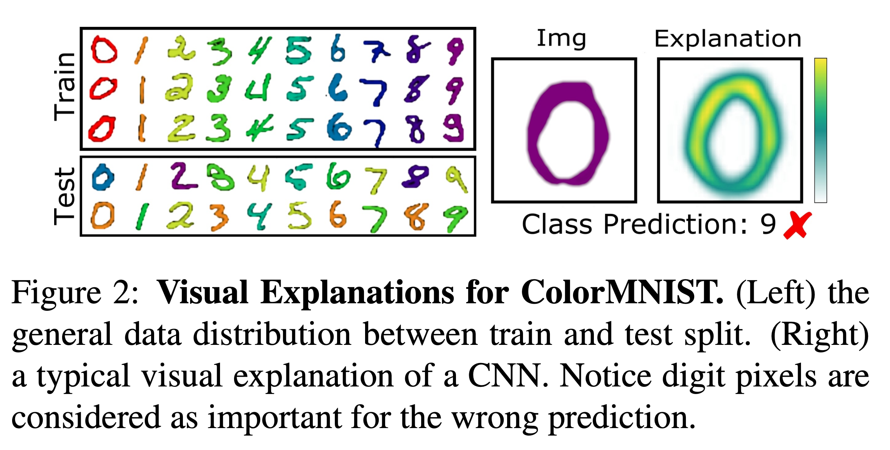
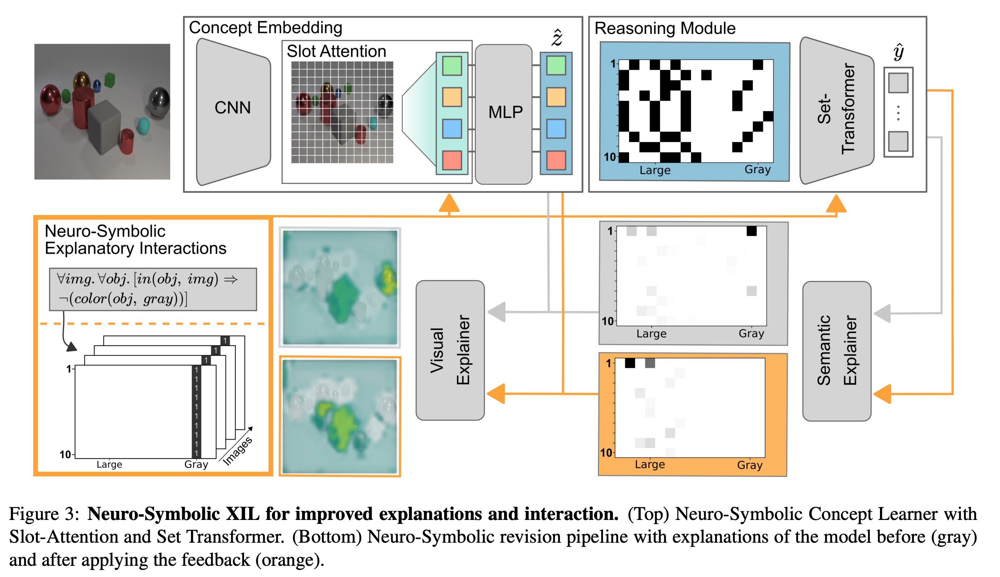
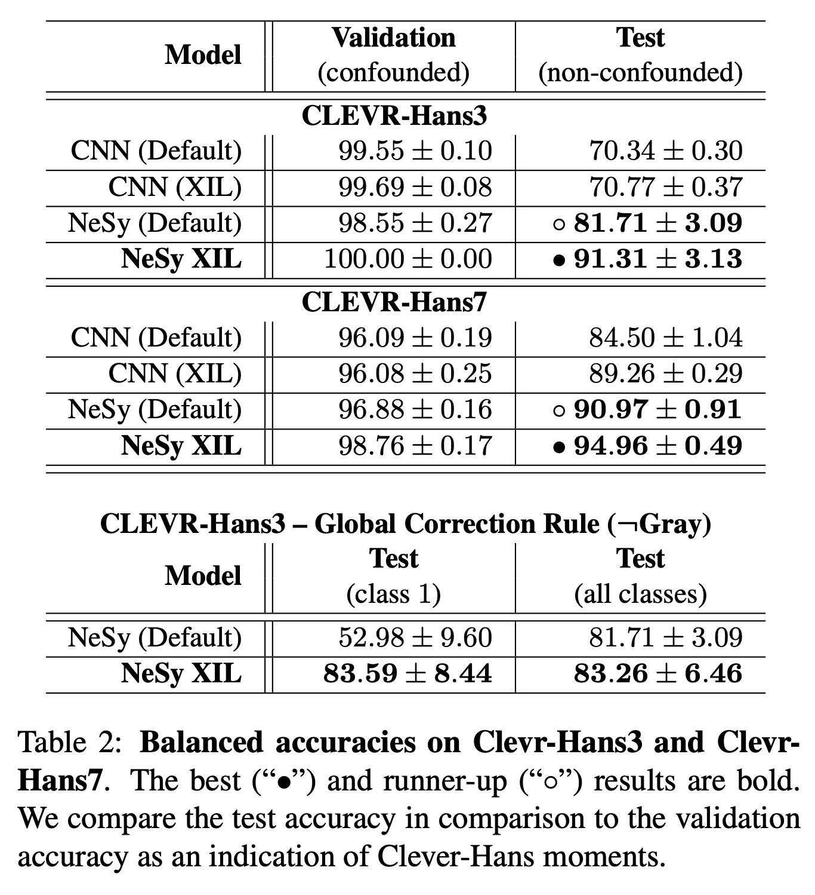
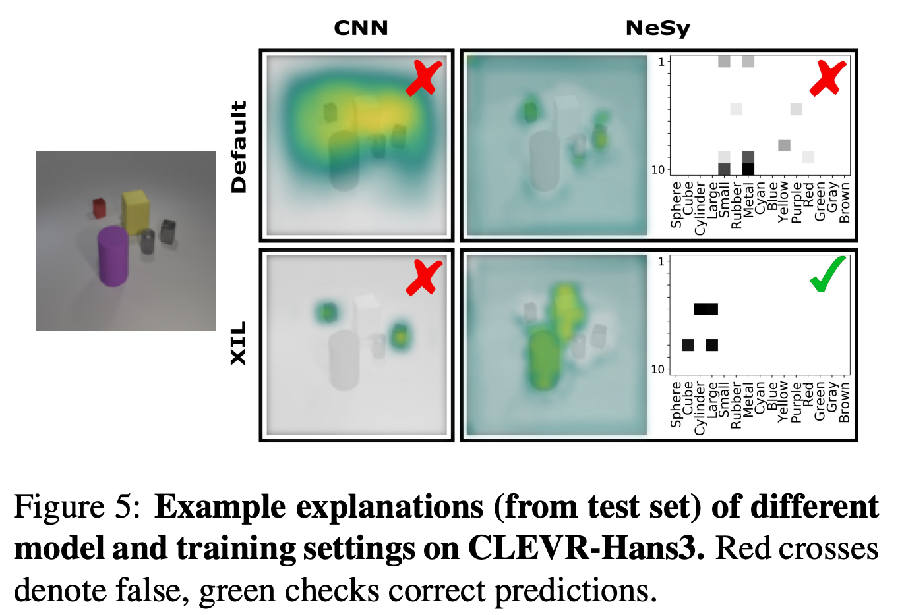

# Right for the Right Concept: Revising Neuro-Symbolic Concepts by Interacting with their Explanations [Eng]

한국어로 쓰인 리뷰를 읽으려면 [**Korea version**](cvpr-2021-nesyxil-kor.md)를 누르세요.

##  1. Problem definition 

- Most explanation methods in deep learning map importance estimates for a model's prediction back to the original input space.
- These "visual" explanations do not provide semantic explanations of how the model determines.
- When a model learns wrong decisions, such as CLEVER-Hans, it is difficult to intervene in the model's behavior through semantic explanations.
- Therefore, there is a need for a methodology that can intervene on the model's behavior via "semantic" feedbacks, not by giving feedbacks using "visual" explanations such as Grad-CAM.

### CLEVER-Hans
- https://simple.wikipedia.org/wiki/Clever_Hans
- MotivationMachine learning models may show Clever-Hans like moments when solving a task by learning the “wrong” thing, e.g.making use of confounding factors within a data set.

### Related work

- **Explainable AI (XAI)**
  - In general, explainable artificial intelligence (XAI) approaches represent the description of the model in a way that humans can understand, and are used to verify the reason for the decision of the model (in the form of a black box).
  - There are various XAI approaches, but most of the explanations utilize visual explanations at the input space level.
    - \[52, 2\]: backpropagation-based approaches
    - \[28\]: prototype-based approaches
  - Several studies have investigated methods that produce explanations other than these visual explanations. None of the aforementioned studies, however, investigate using the explanations as a means of intervening on the model.

- **Explanatory interactive learning (XIL)**
  - XIL = XAI + Active Learning
  - XIL incorporates XAI in the learning process by involving the human user in the training loop, interacting with the explanations.
  - The human user can query the model for explanations of individual predictions and respond by correcting the model if necessary, providing slightly improved feedback on the explanations.

- **Neuro-Symbolic architectures**
  - This field of research has received increasing interest in recent years as a means of solving issues of individual subsystems by combining the advantages of symbolic and sub-symbolic models.
  - Neuro-symbolic architecture has the following characteristics.
    - data-driven
    - Sub-symbolic representation
    - Symbolic based reasoning system

### Motivating Example: Color-MNIST

- To motivate the problem setting, authors first revert to a well known confounded toy data set. ColorMNIST consists of colored MNIST digits. Within the training set, each number is confounded with a specific color, whereas in the test set, the color association is shuffled or inverted.
- A simple CNN model can reach 100% accuracy on the training set, but only 23% on the test set, indicating that the model has learned to largely focus on the color for accurate prediction rather than the digits themselves.
- Figure 2 depicts the visual explanation (here created using GradCAM) of a zero that is predicted as a nine. From the visual explanation it becomes clear that the model is focusing on the correct object, however why the model is predicting the wrong digit label does not become clear without an understanding of the underlying training data distribution.
- Importantly, although the model is wrong for the right reason, it is a non-trivial problem of interacting with the model to revise its decision using XIL solely based on these explanations.

### Idea

- As shown in the above Color-MNIST example, it is difficult to interpret and further intervene in model decisions only with visual-level explanations such as Grad-CAM.
- Therefore, authors propose a Neuro-Symbolic methodology that can fix the model at the semantic level.
- This method enables feedback in the form of “never focus on the color to make your decision” as it would eliminate the confounding factor. 

## 3. Method

- Neuro-Symbolic Architecture (The top part of Figure 3)
  - The architecture consisting of two modules, a concept embedding and a reasoning module.
  - In the case of the concept module, it plays a role in mapping into symbolic expressions that humans can understand.
    - Given an input image  $$x_i \in X$$, concept module encodes it into a symbolic representation, $$h(x_i) = \hat{z}_i$$.
    - $$\hat{z}_i \in [0,1]^{N\times D}$$ : the symoblic representation
  - Reasoning module makes predictions based on this symbolic representation.
    - Given an input $$\hat{z}_i$$, reasoning module produces the prediction output, $$g(\hat{z}_i)=\hat{y}_i$$.
    - $$\hat{y}_i \in [0,1]^{N\times N_c}$$ : the prediction output given the symbolic representation
  - $$X := [x_1, \dots, x_N] \in \mathbb{R}^{N\times M}$$, with $$X$$ being divided into subsets of $$N_c$$ classes.
- Retrieving Neuro-Symbolic Explanations (depicted by the gray arrows of Figure 3.)
  - Given these two modules, we can extract explanations for the separate tasks,
  - We write an explanation function in a general notation as $$E(m(\cdot), o, s)$$, which retrieves the explanation of a specific module, $$m(\cdot)$$, given the module’s input $$s$$, and the module’s output if it is the final module or the explanation of the following module if it is not, both summarized as $$o$$ here.
  - For reasoning module, we can consider its explanations as $$E^g(g(\cdot), \hat{y}_i, z_i) = : \hat{e}^g_i$$.
    - $$\hat{e}^g_i$$ represents the explanation of the reasoning module given the final predicted output $$\hat{y}_i$$.
  - For concept module, we can consider its explanations as $$E^h(h(\cdot), \hat{e}^g_i, x_i) = : \hat{e}^h_i$$.
  - $$\hat{e}^h_i$$ presents the explanation of the concept module given the explanation of the reasoning module $$\hat{e}^g_i$$

- Neuro-Symbolic Concepts
  - explanatory loss term
    - $$L_{expl} = \lambda \sum_{i=1}^N r(A_i^v, \hat{e}^h_i) + (1-\lambda) \sum_{i=1}^N r(A_i^s, \hat{e}^g_i) $$
    - $$r(\cdot, \cdot)$$: regularization function (e.g. RRR, HINT)
    - $$A^v_i$$: visual feedback, in the form of binary image masks
    - $$A^s_i$$: semantic feedback, in the form of binary mask for symbolic space
- Reasoning Module
  - As the output of the  concept embedding module represents an unordered set.
  - Therefore, we require our reasoning module to handle such an input structure by using Set Transformer.
  - To generate the explanations of the Set Transformer given the symbolic representation, we make use of the gradient-based Integrated Gradients explanation method.
- (Slot) Attention is All You Need (for object-based explanations)
  - By using the Slot Attention module, we can botain the attention maps $$B_i$$ for a sample $$x_i$$.
  - By using $$B_i$$ and  $$\hat{e}^g_i$$,  we can represent the exaplanation $$E^h(h(\cdot), \hat{e}^g_i, x_i)$$.

*(Here, we do not deal with Gradient-based Integrated Gradients explanation, Set Transformer, and Slot Attention in details.)*

## 4. Experiment & Result

### Dataset: CLEVER-Hans
- Dataset
  - CLEVER-Hans3
    - CLEVR-Hans3 contains three classes, of which two are confounded.
    - Images of the first class contain a large cube and large cylinder. The large cube has the color gray in every image of the train and validation set. Within the test set, the color of the large cube is shuffled randomly. Images of the second class contain a small sphere and small metal cube. The small sphere is made of metal in all training and validation set images, however, can be made of either rubber or metal in the test set. Images of the third class contain a large blue sphere and a small yellow sphere in all images of the data set. This class is not confounded. 
  - CLEVER-Hans7
    - CLEVR-Hans7 contains seven classes, of which four are confounded.

### Experimental setting

- Dataset
  - CLEVER-Hans3
  - CLEVER-Hans7
- Baselines
  - CNN (Default): ResNet-based CNN
  - CNN (XIL): ResNet-based CNN + XIL
    - For visual explanations, use GradCAM
  - NeSy (Default): Neuro Symbolic Architecture
  - NeSy (XIL): Neuro Symbolic Architecture + XIL
    - Note that this proposed method utilizes both visual and semantic explanations.
- Training setup
  - Default: A standard classification setting using the crossentropy loss
  - XIL: Using additional explanatory loss, we intervenes on the model's behavior.
- Evaluation metric
  - Classification accuracy

### Result

#### Table 2: Experimental results on Clevr-Hans3 and ClevrHans7.

- Observation 1: CNN produces Clever-Hans moment.
  - Evidence: As Table 2 indicates, the default CNN reaches near perfect classification accuracies in the confounded validation sets but much lower accuracy in the non-confounded test sets.
- Observation 2: Visual Explanations also produce Clever-Hans moment.
  - Evidence: As Table 2 indicates, the CNN (XIL) also reaches near perfect classification accuracies in the confounded validation sets but much lower accuracy in the non-confounded test sets.
- Observation 3: Compared to the standard CNN settings, we can observe an increased test accuracy for NeSy model.
  - Evidence: As Table 2 indicates, the test performance of the NeSy model shows better than CNN model.
- Observation 4: Neuro-Symbolic model is not resilient against confounding factors.
  - Evidence: As Table 2 indicates, even with a higher test accuracy than the CNN model could achieve, this accuracy is still considerably below the again near perfect validation accuracy. 
- Observation 5: Neuro-Symbolic XIL to the Rescue!
  - Evidence: The XIL revised NeuroSymbolic model produces test accuracies much higher than was previously possible in all other settings, including the XIL revised CNN. 
  - => The proposed method is effective.
  - => In other words, semantic explanations are effective in moments like CLEVER-Hans.

#### Figure 5: Qualitative results of different model and training settings on CLEVER-Hans3

- Figure 5 shows how the explanations change for two different models using default setting (Default) and human intervention (XIL) setting.
- We can observe that CNN(Default), CNN(XIL), and NeSY(Default) all do not predict correctly, and only NeSY(XIL) predicts correctly.
- In the case of CNN models, it is difficult to semantically interpret model's decisions.
- In the case of the NeSY models, we can semantically interpret model's decisions.

## 5. Conclusion

- The authors propose a methodology for intervening in the neuro-symbolic scene representation space, which allows modification of the model at the semantic level.
- To prove the effectiveness, they constructed new confounded visual scene datasets, CLEVER-Hans3 and CLEVER-Hans7.
- The results of experiments on CLEVER-Hans demonstrate that "semantic" explanations can identify confounders that are not identifiable using "visual" expalantions only.
- As a result, feedback on this semantic level makes it possible to revise the model from focusing on these factors.

### Take home message

> Through the motivated example of Color-MNIST, this paper shows why it is important to use symbolic expressions when intervening in a model.
>
> Authors first proposed the Neural Symbolic Architecture to XIL, showing through experimental results that it is more effective to intervene in the model than visual descriptions such as Grad-CAM.
>
> If we can make good use of symbolic expressions as well as non-symbolic expressions in deep learning, it will be of great help in utilizing human's cognitive ability.

## Author / Reviewer information

### Author

**Seongsu Bae** 

* KAIST AI
* contact: seongsu@kaist.ac.kr

### Reviewer

1. Korean name \(English name\): Affiliation / Contact information
2. Korean name \(English name\): Affiliation / Contact information
3. ...

## Reference & Additional materials

* [Right for the Right Concept: Revising Neuro-Symbolic Concepts by Interacting with their Explanations](https://arxiv.org/pdf/2011.12854.pdf)
