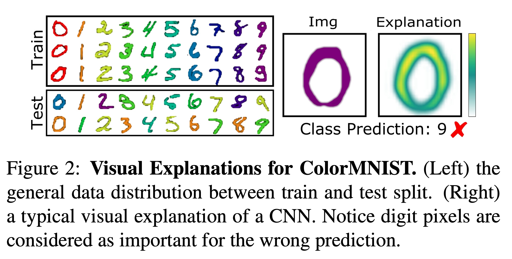
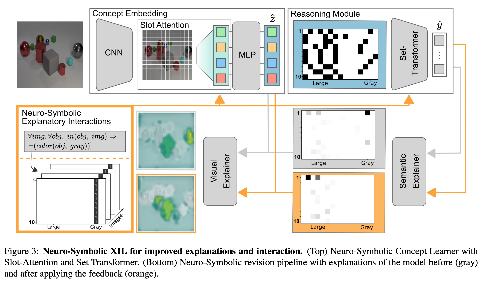

# Right for the Right Concept: Revising Neuro-Symbolic Concepts by Interacting with their Explanations [Kor]

[**English version**](cvpr-2021-nesyxil-eng.md) of this article is available.

##  1. Problem definition 

- 딥러닝 분야의 설명 방법은 대부분 원래 입력 공간에 대한 모델의 예측에 대한 중요도를 추정하는 방식입니다.
- 이러한 "시각적" 설명은 모델이 어떻게 결정하고 있는지에 대한 의미론적인 설명을 하지 않고 있습니다.
- CLEVER-Hans와 같이 모델이 잘못된 결정을 배울 때, 의미론적인 설명을 통해 모델의 행동에 개입하는 것이 어렵습니다.
- Grad-CAM과 같은 "시각적" 설명을 활용해 피드백을 주는 방식이 아니라 "의미론적인" 피드백을 통해 모델에 개입을 할 수 있는 방법론이 필요합니다.

### CLEVER-Hans
- https://simple.wikipedia.org/wiki/Clever_Hans
- ML 모델들은 특정 태스크를 풀기 위해 잘못된 feature를 학습하지만 성능은 좋은 경우가 있습니다. 이같은 순간들을 Clever-Hans Moment라고 위 논문에서는 지칭하고 있습니다.

## 2. Motivation

### Related work

- **설명 가능한 인공지능 (Explainable AI, XAI)**
  - 일반적으로 설명 가능한 인공지능 (XAI) 방법론은 모델의 설명을 사람이 이해할 수 있는 방식으로 나타내어, (블랙박스 형태) 모델의 결정에 대한 이유를 검증하는 데 사용됩니다.
  - 다양한 XAI 방법론이 있지만, 대부분 설명하는 방식이 입력 공간 레벨에서 이루어지는 설명을 시각화하는 형태로 이루어집니다.
    - \[52, 2\]: 역전파를 활용하여 입력 공간에 대해 시각적으로 표현합니다.
    - \[28\]: 모델의 결정에 대한 설명을 prototype 형태로 표현합니다.
  - 그러나 시각적으로 설명하는 방법들과는 다른 방법으로 설명을 만들어내는 연구들도 있지만, 어떤 연구도 모델의 개입을 위한 수단으로써 설명을 활용하는 연구는 없었습니다.

- **설명을 통한 대화형 학습 (Explanatory interactive learning, XIL)**
  - XIL = XAI + Active Learning
  - 학습 과정에서 모델이 결정한 설명들과 교류하면서 사용자와 XAI가 협력하는 형태로 볼 수 있습니다.
  - 사용자는 XIL을 통해 모델이 결정한 이유를 물어볼 수 있고, 필요한 경우 모델을 수정할 수도 있고, 설명에 대해 개선된 피드백을 제공할 수 있습니다.

- **뉴로-심볼릭 아키텍처 (Neuro-Symbolic architectures)**
  - 뉴로-심볼릭 분야는 기호적 (symbolic) 모델과 비기호적 (sub-symbolic) 모델의 장점을 결합하여 개별 하위 시스템의 문제를 해결하는 방법으로 최근 몇 년 동안 점점 더 관심을 받고 있는 분야입니다.
  - 뉴로-심볼릭 아키텍처는 크게 다음과 같은 특징을 갖고 있습니다.
    - 데이터 중심 (data-driven)
    - 비기호적인 표현 (sub-symbolic representation)
    - 기호적 추론 시스템 (symbolic based reasoning system)

### Motivating Example: Color-MNIST

- 이 연구에서 다루고 있는 핵심을 전달하기 위해, 저자들은 잘 알려진 Color-MNIST 데이터셋을 통해 설명합니다. ColorMNIST는 기존 MNIST 데이터셋에 색상이 추가된 토이 데이터셋입니다. 이 데이터셋 내 학습 셋에서, 각 숫자는 특정 색상으로 칠해져 있는 반면에, 테스트 셋에서는 색상이라는 속성은 섞이거나 반전됩니다.
- ColorMNIST 데이터셋에 대해, 간단한 CNN 모델은 훈련 셋에서는 100% 정확도에 도달할 수 있지만 테스트 세트에서는 23%에 불과합니다. 이는 모델이 숫자 자체보다 정확한 예측을 위해 색상에 크게 집중하는 법을 배웠음을 알 수 있습니다.
- Figure 2는 9로 예측되는 0에 대한 Grad-CAM 결과를 시각화한 그림입니다. 즉, 모델은 왜 0이라는 숫자를 9로 예측했는가에 "시각적 설명"을 보여주고 있습니다. 이 때, 0이라는 형태를 모델이 집중해서 보고 있는 것을 볼 수 있지만, 어떤 의미론적인 근거에 의해 9로 예측했는지 알 수 없습니다.
- 따라서, 시각적 설명을 통해 모델이 올바른 물체에 초점을 맞추고 있다는 것은 분명하지만, 모델이 잘못된 숫자를 예측하는 이유는 기본 학습 데이터 분포에 대한 이해 없이는 명확하지 않을 것입니다.
- 중요한 것은 모델이 틀리더라도, 이러한 시각적인 설명만을 바탕으로 XIL을 사용해 모델의 결정을 수정하는 것은 꽤 심각한 문제로 볼 수 있습니다.

### Idea

- Color-MNIST 예시에서 볼 수 있듯이, 저자들은 기존의 Grad-CAM과 같은 시각적인 수준의 설명만으로 모델의 결정을 해석하고 더 나아가 개입하는 것은 힘들다고 생각했습니다. 
- 따라서, 의미론적 (semantic) 수준에서 모델을 수정할 수 있는 뉴로-심볼릭 (Neuro-Symbolic) 방법론을 제안했습니다. 
- 이 방법을 통해 모델에게 "결정을 내릴 때는 색상을 절대 보고 결정하지 말라."라는 등의 개입이 가능해집니다.

## 3. Method

- Neuro-Symbolic Architecture (Figure 3의 상단 부분)
  - 크게 concept embedding module과 reasoning module 2가지 모듈로 구성되어 있습니다.
  - concept module의 경우, 사람이 이해할 수 있는 기호적인 표현으로 매핑하는 역할을 하고 있습니다.
    - 하나의 입력 이미지  $$x_i \in X$$ 에 대해 concept module을 통해 $$h(x_i) = \hat{z}_i$$ 로 매핑됩니다.
    - 이 때, $$\hat{z}_i \in [0,1]^{N\times D}$$ 는 하나의 기호적인 표현을 의미합니다.
  - 이렇게 매핑된 기호적인 표현에 기반하여 모델을 예측하게 하는 것이 reasoning module의 역할입니다.
    - 하나의 입력 $$\hat{z}_i$$에 대해 reasoning module을 통해 $$g(\hat{z}_i)=\hat{y}_i$$ 로 매핑됩니다.
    - 이 때 $$\hat{y}_i \in [0,1]^{N\times N_c}$$ 는 예측 결과값을 의미합니다.
  - 여기서 $$X := [x_1, \dots, x_N] \in \mathbb{R}^{N\times M}$$ 이고, $$X$$ 는 $$N_c$$ 개의 클래스들의 부분집합으로 나뉘어집니다.
- Retrieving Neuro-Symbolic Explanations (Figure 3의 회색 화살표)
  - concept embedding module과 reasoning module이 주어졌을 때, 각각에 맞는 설명들을 추출할 수 있습니다.
  - 모듈 $$m(\cdot)$$, 그 모듈의 입력 값으로 $$s$$가 주어지고, 그리고 모델의 출력 값으로 $$o$$ 가 주어진다고 했을 때, 설명 함수는 $$E(m(\cdot), o, s)$$ 라고 표현할 수 있습니다.
  - reasoning module의 경우, $$E^g(g(\cdot), \hat{y}_i, z_i) = : \hat{e}^g_i$$ 라고 볼 수 있습니다.
    - 여기서, $$\hat{e}^g_i$$ 의 경우, 최종으로 예측한 값인 $$\hat{y}_i$$ 가 주어졌을 때, reasoning module의 설명이라고 볼 수 있습니다.
    - Figure 3에서, Semantic Explanier를 통해 나온 회색 값으로 해석할 수 있습니다.
  - concept embedding module의 경우, $$E^h(h(\cdot), \hat{e}^g_i, x_i) = : \hat{e}^h_i$$ 라고 볼 수 있습니다.
    - 여기서, $$\hat{e}^h_i$$ 의 경우, reasoning module의 설명인 $$\hat{e}^g_i$$ 가 주어졌을 때, concept embedding module의 설명이라고 볼 수 있습니다.
    - Figure 3에서, Visual Explanier를 통해 나온 회색 값으로 해석할 수 있습니다.

- Neuro-Symbolic Concepts
  - explanatory loss term
    - $$ L_{expl} = \lambda \sum_{i=1}^N r(A_i^v, \hat{e}^h_i) + (1-\lambda) \sum_{i=1}^N r(A_i^s, \hat{e}^g_i) $$ 
    - $$ r(\cdot, \cdot) $$: regularization function (e.g. RRR, HINT)
    - $$ A^v_i $$: "visual feeback"을 의미하고, 입력 공간에 대한 binary image mask라고 할 수 있습니다.
    - $$ A^s_i $$: "semantic feed back"을 의미하고, symbolic space에 대한 binary mask라고 할 수 있습니다.
- Reasoning Module
  - 이미지가 concep embedding module을 지나면, 나오는 출력값은 순서가 없는 집합입니다.
  - 따라서 이에 맞는 입력을 다루기 위해, Set Transformer를 활용하여 결과 값을 예측합니다.
  - 반대로, reasoning module에 대한 설명을 추출하기 위해서는 주어진 symoblic representation에 대해 Set Transformer의 설명을 만들어야 합니다.
  - 이를 위해 gradient-based Integrated Gradients exaplanation 방법을 사용합니다.
- (Slot) Attention is All You Need (for object-based explanations)
  - Slot Attention module을 이용해, 입력 이미지 $$x_i$$ 에 대한 attention $$B_i$$ 를 구할 수 있습니다.
  - $$B_i$$ 값과 $$\hat{e}^g_i$$ 를 통해 $$E^h(h(\cdot), \hat{e}^g_i, x_i)$$ 를 표현할 수 있게 됩니다.

*(Gradient-based Integrated Gradients explanation, Set Transformer, Slot Attention에 대해 자세하게 다루지는 않았습니다.)*

## 4. Dataset & Experiment & Result

### Dataset: CLEVER-Hans
- Dataset
  - CLEVER-Hans3
    - 아래와 같은 3개의 클래스 규칙을 포함하고 있고, 그 중 2개 클래스 규칙은 confounder로 작용합니다.
    - class rule 1: large (gray) cube and large cylinder (training/validation set에서는 괄호의 속성(gray)에 해당하는 이미지가 포함되어 있지만, test set에서는 괄호의 속성이 아닌 이미지도 포함하게 됩니다.)
    - class rule 2: small metal cube and small (metal) sphere (training/validation set에서는 괄호의 속성(metal)에 해당하는 이미지가 포함되어 있지만, test set에서는 괄호의 속성이 아닌 이미지도 포함하게 됩니다.)
    - class rule 3: large blue sphere and small yellow sphere (training/validation/test set 모두 동일합니다.)
  - CLEVER-Hans7
    - CLEVER-Hans3과 비슷하게 7개의 클래스 규칙을 포함하고 있고, 그 중 4개 클래스 규칙은 confounder로 작용합니다.

### Experimental setting

- Dataset
  - CLEVER-Hans3
  - CLEVER-Hans7
- Baselines
  - CNN (Default): ResNet-based CNN 사용
  - CNN (XIL): ResNet-based CNN에 XIL 적용
    - 이 때 사용된 CNN의 설명방법론은 (논문에서 말하는 시각적 설명의 예시로) Grad-CAM을 사용하였습니다.
  - NeSy (Default): Neuro Symbolic Architecture 사용
  - NeSy (XIL): Neuro Symbolic Architecture에 XIL 적용
    - 이 때 사용된 NeSy의 설명방법론은 논문에서 제안한 방식이며, 이는 시각적과 의미론적 설명을 둘 다 사용합니다.
- Training setup
  - Default: Cross Entropy Loss를 사용한 일반적인 이미지 분류 문제를 푸는 세팅
  - XIL: Explanatory Loss를 추가적으로 사용하여 모델의 학습에 개입을 하는 세팅
- Evaluation metric
  - Classification accuracy

### Result

#### Table 2: CLEVER-Hans3 데이터셋과 CLEVER-Hans7 데이터셋에서 실험 결과

- 관찰 1: CNN 모델은 Clever-Hans와 같은 순간을 겪고 있는 것을 보여줍니다.
  - 근거: Table2에서 CNN(Default)의 validation 성능은 거의 완벽에 가깝지만, 그에 비해 test 성능이 낮음
- 관찰 2: 시각적인 설명을 활용하는 XIL은 CLEVER-Hans 데이터셋에 대해 실패한 모습을 보여줍니다.
  - 근거: Table2에서 CNN(XIL)의 validation 성능은 거의 완벽에 가깝지만, 그에 비해 test 성능이 (XIL을 적용했음에도) 여전히 낮음
- 관찰 3: Neuro-Symbolic 모델은 CNN 모델에 비해 test accuracy가 높습니다.
  - 근거: Table2에서 NeSy(Default)의 test 성능이 CNN(Default)의 test 성능보다 꽤 높은 것을 확인할 수 있음
- 관찰 4: XIL로 개입하기 이전에, Neuro-Symbolic 모델 역시 Clever-Hans와 같은 순간을 겪고 있는 것을 보여줍니다.
  - 근거: Table2에서 NeSy(Default)의 test 성능이 완벽에 가까운 validation 성능에 많이 못 미치고 있는 모습을 확인할 수 있음
- 관찰 5: Neuro-Symbolic 모델을 통해 의미론적인 설명까지 활용하는 XIL의 경우 Clever-Hans 데이터셋과 같은 문제를 많이 해결했음을 보여줍니다.
  - 근거: Table2에서 NeSy(XIL)의 test 성능이 validation 성능 근처로 가장 가깝게 온 것을 확인할 수 있음
  - => 저자들의 제안한 방법이 효과적임
  - => 다른 의미로, 의미론적인 설명이 CLEVER-Hans와 같은 순간에 효과적임

#### Figure 5: CLEVER-Hans3에서 학습된 모델들의 서로 다른 정성적 결과

- Figure 5에서는 서로 다른 2가지 모델이 일반적으로 학습한 경우 (Default), 사람이 개입한 경우 (XIL)에 대해서 어떻게 해당 설명들이 바뀌고 있는지 보여주고 있는 그림입니다.
- CNN(Default), CNN(XIL), NeSY(Default) 모두 올바르게 예측하지 못한 모습을 볼 수 있고, NeSY(XIL) 경우만 올바르게 예측한 모습을 볼 수 있습니다.
- CNN 모델의 경우, 어떤 이유로 인해 모델이 결정했는지 의미론적으로 해석할 수 없습니다.
- NeSY 모델의 경우, 의미론적으로 모델이 어떤 예측을 하고 있는지 확인할 수 있습니다.

## 5. Conclusion

- 저자들은 의미론적 (semantic) 수준에서 모델을 수정할 수 있게 하는, 뉴로-심볼릭 (Neuro-Symbolic) 장면 표현 (scene representaiton) 공간에 개입하는 방법론을 제안합니다. 
- 모델의 효과를 입증하기 위해, 새로운 교란된 데이터셋인 CLEVER-Hans3과 CLEVER-Hans7을 구축했습니다.
- "시각적" 설명만으로 식별할 수 없는 교란요인을 "의미론적" 설명을 통해 식별할 수 있음을 보여주었습니다.
- 결과적으로, 이 의미론적 수준에 대한 피드백을 통해 해당 의미에 초점을 맞추어 모델을 수정할 수 있게 되었습니다.

### Take home message \(오늘의 교훈\)

> 이 논문은 Color-MNIST라는 motivated example에 걸쳐, 모델에 개입할 때 왜 기호적인 표현을 이용하는 것이 중요한지 보여준 논문입니다.
>
> 처음으로 XIL에 Neural Symbolic Architecture를 제안하여, Grad-CAM같은 시각적 설명들보다도 효과적으로 모델에 개입이 가능함을 실험 결과를 통해 보여주었습니다.
>
> 이처럼 딥러닝에서 비기호적인 표현뿐만 아니라 기호적인 표현을 잘 활용할 수 있다면, 사람이 지각하고 인지하는 능력을 활용하는데 큰 도움이 될 수 있을 것 같습니다.

## Author / Reviewer information

### Author

**배성수** 

* KAIST AI
* contact: seongsu@kaist.ac.kr

### Reviewer

1. Korean name \(English name\): Affiliation / Contact information
2. Korean name \(English name\): Affiliation / Contact information
3. ...

## Reference & Additional materials

* [Right for the Right Concept: Revising Neuro-Symbolic Concepts by Interacting with their Explanations](https://arxiv.org/pdf/2011.12854.pdf)
