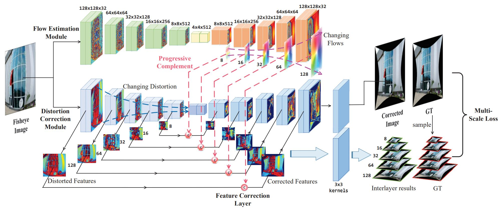

---
Yang et al. / Progressively Complementary Network for Fisheye Image Rectification Using Appearance Flow / 2021 CVPR Oral
---

# Progressively Complementary Network for Fisheye Image Rectification Using Appearance Flow [Kor]

##  1. Problem definition

시야각이 넓은 광각렌즈 또는 초광각 렌즈를 사용하여 이미지를 촬영하면 넓은 범위를 볼 수 있지만, 아래 그림처럼 상대적으로 이미지 가장자리의 왜곡이 심해지는 문제가 발생합니다.


이러한 왜곡을 어안 왜곡(fisheye distortion)이라고 부르는데요. 이러한 영상 왜곡은 심미적인 문제 외에도, 영상을 분석하여 좌표 추정등의 정확한 수치계산이 필요할 때 큰 문제가 될 수 있습니다. 따라서 이러한 왜곡을 보정하는 문제는 여러 컴퓨터 비전 기술들을 적용하기 위해서 해결해야 할 부분이라고 볼 수 있습니다.

기존의 영상처리 분야에서는 이러한 어안 렌즈 왜곡 문제를 camera calibration을 활용하여 보정하였습니다. 하지만 이러한 방식은 이미지에서 3D 좌표를 추정할 수 있도록 이미지내에 chessboard가 함께 촬영되어야 하는 등의 추가적인 노력이 필요한 경우가 많습니다. 따라서 주어진 이미지만을 가지고 보정을 수행할 수 있는 automatic correction 방법 또한 여러 개가 개발되었지만, 카메라 내 왜곡을 측정하기 위해 여러 특징들을 추출하는 과정이 불완전하여 왜곡 보정이 잘 안되는 경우가 종종 발생하고는 합니다.

딥러닝의 발전에 힘입어, 최근에는 이러한 이미지의 어안 왜곡 문제를 딥러닝으로 해결하려는 시도가 늘고 있으며 여러 논문들이 발표가 되고 있습니다. 이번 글에서는 그 중 최근 CVPR'21에서 발표된 [Progressively Complementary Network for Fisheye Image Rectification Using Appearance Flow](https://openaccess.thecvf.com/content/CVPR2021/papers/Yang_Progressively_Complementary_Network_for_Fisheye_Image_Rectification_Using_Appearance_Flow_CVPR_2021_paper.pdf)라는 논문을 소개해볼까 합니다.

## 2. Motivation

### Related work

전통적인 영상처리 분야에서 제안된 왜곡 보정 방식들의 단점을 보완하고자, 딥러닝 기반의 왜곡 보정 방식이 많이 발표되었습니다. 이러한 딥러닝 기반 접근 방법들은 크게 pixel을 옮기고자 하는 목표 좌표를 추정하는 regression-based 방식과, 아예 왜곡이 보정된 이미지를 생성하는 생성 모델 기반의 generation-based 방식으로 나눌 수 있습니다.

#### Regression-Based Method

Regression-Based Method는 Non-linear한 예측을 수행할 수 있는 CNN의 능력을 활용하여 pixel단위의 image-to-image translation map을 추정하는 방법입니다.

16년에 발표된 [[1](##Reference & Additional materials)]은 CNN을 활용하여 어안 렌즈 왜곡 문제를 푼 선구자적인 논문입니다. 하지만 단순한 설계로 인해 복잡한 왜곡이미지는 제대로 보정을 하지 못하는 한계를 보였습니다.

ECCV'18에서 발표된 [[2](##Reference & Additional materials)]는 3개의 CNN 모델을 조합, 여러 semantic feature를 추출하여 보정에 사용하는 모델을 제안하였습니다. 하지만 이렇게 추출된 semantic feature들을 활용하려다보니 입력되는 이미지의 차원수가 늘어났고, 이는 이미지를 보정하는데 제약이 될 수밖에 없었습니다. 

CVPR'19에서 발표된 [[3](##Reference & Additional materials)]은 딥러닝 모델에 geometry constraints을 부과하는 보조 module을 설계하여, 곡선 형태의 왜곡이 좀 더 직선형태로 보정 될 수 있도록 하는 모델을 제안하였습니다. 이 모델은 기존의 두 모델보다 더 나은 성능을 보였지만, 학습을 위해서는 기 제안된 방법들에 비해 상당한 양의 정답 데이터(e.g. edge labels, distortion parameter labels, normal images)를 필요로 하는 단점이 존재하며, 보조 module은 미리 학습(pre-trained)되어야 할 필요가 있어 학습 또한 기존 모델에 비해 복잡한 단점 또한 존재합니다.

#### Generation-Based Method

Generation-Based Method는 생성모델, 그 중에도 GAN을 활용하여 왜곡이 보정된 이미지를 직접 생성하는 방법입니다.

19년에 발표된 [[4](##Reference & Additional materials)]는 DR-GAN이라는 이름이 모델을 제안했는데, 이는 adversarial framework를 사용하여 왜곡을 보정하는 첫 번째 논문이였습니다. 따라서 모델이 왜곡된 이미지와 정상 이미지의 이미지 분포 패턴을 직접 학습하게 됩니다. 또한 정상 이미지 외에는 추가 label이 필요가 없는 점 또한 장점으로 볼 수 있습니다. 하지만, 이 모델은 이미지의 구조(structure)와 이미지의 내용(content)를 동시에 재생성해내야 하기 때문에, 모델에 부담이 커지는 구조로 설게되어 있습니다. 그로 인해, 재생성된 이미지가 뿌옇게 보이는(blurred) 경우가 존재하고, 왜곡이 보정되는 정도 또한 만족스럽지 못한 경우가 있습니다.

DR-GAN을 발표한 연구팀은 20년에 발표된 [[5](##Reference & Additional materials)]를 발표하는데, 해당 논문은 어안 왜곡뿐만 아니라 다양한 렌즈왜곡을 처리할 수 있는 왜곡 보정 프레임워크(a model-free distortion rectification framework)를 제안하는 논문입니다. 이는 기존의 방식에 비해 좀더 구조적인 왜곡을 잘 보정하였지만, 이미지의 디테일한 부분을 잘 재현하지 못하였고, 논문에서 도입한 skip-connection으로 인해 왜곡이 퍼지는 현상(distortion diffusion)이 나타났습니다.

### Idea

앞서 살펴본 Generation 기반 방법들은 크게 2가지 문제가 관찰되었는데, **1. skip-connection으로 인해 왜곡 정보를 가진 이미지의 feature들이 곧바로 전파되는 문제**, **2. 이미지를 재현하는 decoder가 구조적인 왜곡에 대한 보정과 컨이미지 내용에 대한 재현을 동시에 수행함으로써 성능이 떨어지는 문제**가 그것입니다.  본 논문에서 **PCN(Progressively Complementary Network)**이라는 모델을 제안하여 기존의 GAN 기반의 방식에서 나타난 이 2가지 단점들을 보완하고자 하였습니다.

본 논문에서 제안하는 문제의 해결책은 다음과 같습니다.

1. Feature correction layer를 skip-connection에 삽입함으로써, decoder가 좀 더 그럴듯한 결과를 만들어낼 수 있도록 합니다.
2. 이미지의 왜곡된 구조 측정을 전담하는 flow estimation module을 추가하였습니다. 이를 통해 decoder의 부담을 줄여 최종 결과의 성능을 높였습니다.
3. 저자들은 또한 이미지의 왜곡이 Encoder의 레이어를 통과할때마다, 왜곡이 조금씩 줄어드는 현상을 발견했다고 합니다. 본 논문에서는 gradual generation characteristic이라고 명명된 이 특성을 적극 활용할 수 있도록 모델 구조를 설계하였습니다.

## 3. Method

해당 모델을 학습하기 위한 합성 데이터를 생성하는 방법을 먼저 소개하고, 이후 모델 설계 구조와 학습 방법에 대해 설명하도록 하겠습니다.

### Fisheye Models for Synthetic Data

```
해당 파트는 카메라 투영 모델에 대한 지식이 없다면 이해가 힘들 수 있습니다. 모델과 직접적인 연관은 없으니 뛰어넘으셔도 무방합니다!
```

어안 왜곡 이미지 데이터를 실제로 수집하기에는 많은 cost가 소요됨으로 현실적이지 않습니다. 다행히 어안렌즈 왜곡을 인위적으로 생성할 수 있는 수학적 모델이 이미 개발되어 있습니다. 정상이미지를 통해 어안 렌즈 왜곡이미지를 생성하는 방식은 일반적으로 division model과 polynomial model, 이 2가지 방법이 가장 많이 사용됩니다.

이미지 좌표계에서, 임의의 점 $P_u(x,y)$와 이미지의 중심점 $P_0(x_0,y_0)$ 의 유클리디언 거리를 $r_u$라고 정의합니다. 또한 $P_u(x,y)$는 왜곡된 이미지에서 $P_d(x_d,y_d)$의 위치에 존재한다고 가정합니다. 그리고 왜곡된 이미지에서, 점 $P_d$와 왜곡된 이미지의 중심점과의 유클리디언 거리를 $r_d$라고 정의합시다.

Division model은 $r_u$와 $r_d$사이의 관계를 다음과 같이 정의합니다.
$$
r_u = \frac{r_d}{1+\sum_{i=1}^{n}{k_i r_d^{2i-1}}}
$$

이 때, $k_i$는 distortion parameter입니다. 이 값을 조절함으로써 어안 왜곡의 정도를 조절할 수 있습니다. 또한 $n$은 parameter의 수를 나타냅니다. $n$이 커질수록, 복잡한 왜곡 상태를 표현할 수 있게 됩니다.

Polynomial model은 입사광선의 각도를 수식에 포함시킨 모델입니다. 다음과 같이 표현됩니다.
$$
\theta_u = \sum_{i=1}^{n}{k_i \theta_d^{2i-1}}
$$
$\theta_u$는 입사광선의 입사각을 의미하며, $\theta_d$는 렌즈를 통과한 빛의 각도입니다. 일반적으로 $r_d$와 $\theta_d$는 $r_d=f\theta_d$(이 때, $f$는 어안 렌즈 카메라의 focal length)가 성립하는데, 이를 등거리 투영관계(the equidistant projection relation)를 만족한다고 표현합니다. 이는 초광각 렌즈(=어안 렌즈)의 카메라 투영모델이기도 합니다. 가장 기본적인 카메라 모델(Pinhole 카메라 모델)에서는, $r_u=f\tan\theta_u$의 투영모델을 사용합니다.

간략화를 위해 $\theta_u=\arctan(\frac{r_u}{f})\approx\frac{r_u}{f}$ 라고 가정합니다. 그러면, polynomial model에서 $r_u$와 $r_d$사이의 관계를 다음과 같이 계산할 수 있습니다.
$$
r_u = f\sum_{i=1}^{n}{k_i r_d^{2i-1}}
$$
$k_i$와 $f$ 둘 다 사용자가 설정해야 하는 값이므로, 이 둘을 합치면 최종적으로 다음의 수식을 얻을 수 있습니다.
$$
r_u = \sum_{i=1}^{n}{k_i r_d^{2i-1}}
$$
본 논문에서는 polynomial model을 활용하여 fisheye iamge를 합성합니다.

### Network Architecture

앞서 기존의 generation 기반 방식들의 모델이 하나의 decoder에서 이미지의 구조적인 왜곡 보정과 이미지의 컨텐츠 재생성을 동시에 수행하려고 하다 보니 성능이 떨어진다는 점을 지적하였는데요. 본 논문에서는 이를 해결하기 위해, 왜곡된 구조 보정(structure correction)과 이미지의 컨텐츠 재생성(content reconstruction)을 담당하는 모듈을 나누어 설계하여 해당 역할을 나누고자 하였습니다.



입력으로는 256 x 256 크기의 이미지를 사용하는데, 해당 이미지를 동시에 2개의 모듈에 입력합니다. 그림의 위에 위치하는 Flow Estimation 모듈은 왜곡된 정도를 측정하고, 왜곡을 보정하기 위해서 pixel들이 어디로 이동해야 하는지를 나타내는 appearance map을 출력합니다. 밑에 위치한 Distortion Correction Module은 실질적으로 이미지를 재생성해내는 모듈입니다. 위에서 출력되는 appearance flow map을 활용하여 구조적인 왜곡 보정의 도움을 받아 보정된 이미지를 재생성하게 됩니다.

#### Appearance Flow Estimation Module

Appearance Flow Estimation Module은 전형적인 U-net 스타일의 encoder-decoder 구조로 설계되어 있는데, 각각이 3x3의 convolution kernel을 사용하는 5개의 레이어로 이루어져 있습니다. 해당 모듈이 일반적인 모델과 다른 점은, decoder 부분에서 각 레이어는 2개의 각기 다른 출력(output)을 낸다는 것입니다. 하나는 다음 레이어로 넘어가는 일반적인 output, 또 다른 하나는 pixel이 어디로 움직여야 하는지를 나타내는 2 채널의 appearance flow map입니다. 이 map은 이후 설명할 Distortion Correction Module의 또 다른 입력으로 활용하게 됩니다.

결과적으로 appearance flow estimation module은 각각 가로세로 넓이가 128, 64, 32, 16, 8의 크기를 가지는 5개의 appearance flow map을 생성하게 됩니다.

#### Feature Correction Layer

논문에서 지적한 또 하나의 문제는, encoder와 decoder를 direct하게 이어주는 skip-connection의 존재로 인해, encoder에서 추출된 왜곡 정보가 보정되지 않고 그대로 decoder로 넘어간다는 점입니다. 저자들은 이를 skip-connection 부분에 Feature Correction Layer를 삽입함으로써 문제를 해결하고자 하였습니다.

저자들은 이를 layer로 표현하였지만, 사실 학습 parameter를 가지는 layer는 아닙니다. 위에서 얻은 appearance flow map을 활용하여 layer의 입력 pixel을 재배열해주고(appearance map의 값에 따라 pixel의 좌표를 이동), 이를 입력에 concatenation 시켜주는 부분입니다. 따라서 distortion correction module의 decoder에 있는 각 레이어는 appearance flow map으로 인해 왜곡이 어느정도 보정된 입력을 추가로 받게 됩니다.

#### Progressively Complementary Mechanism

저자가 말하는 재밌는 발견 중에 하나는, 왜곡된 이미지가 encoder를 통과할수록 해당 왜곡이 어느정도 줄어드는 현상이 관찰된다는 점입니다. 본 논문에서는 이를 gradual generation characteristic이라고 지칭하는데요. 저자들은 이를 활용하는 Progressively Complementary Mechanism을 제안합니다.


위의 그림의 첫 번째 행은 encoder의 레이어를 통과한 중간 feature map을 나열한 것입니다. 레이어를 통과할수록  feature map의 사이즈가 줄어들면서, 왜곡이 자연스럽게 줄어드는 모습을 볼 수가 있습니다.

두 번째 행은 Appearance Flow Estimation Module이 출력하는 appearance flow map을 나열한 것입니다. 뒤로 갈 수록 appearance flow map의 형태가 뭉게지는 것을 볼 수가 있는데, 이러한 점이 의미하는 바는 뒤에서 생성된 flow map일수록 pixel을 옮기는 정도가 커진다는 것입니다. 즉 왜곡을 보정하고자 하는 강도가 뒤로 갈수로 커진다는 것이지요. 이는 encoder의 앞쪽 레이어가 decoder의 뒤쪽 레이어와 skip-connection으로 이어지는 구조를 가지는 U-net 형태의 network 때문입니다. 앞서 살펴본 gradual generation characteristic으로 인해 encoder의 layer를 많이 통과하지 못하고 생성된 앞쪽 feature map은 필연적으로 왜곡된 정도가 더 큰 feature map을 만들 수 밖에 없는데요. 이러한 feature가 후위 레이어에 그대로 전파되기 때문에 뒤로 갈수록 이를 보정하기 위해 flow estimation map의 강도가 커지는 것입니다.

저자들은 이를 해결하기 위해, encoder에서 나오는 각가의 출력을 대응되는 appearance flow map을 활용하여 보정한 뒤 다시 입력으로 사용하고자 합니다. 이러한 역할을 수행하는 것이 바로 위에서 설명한 feature correction layer입니다. 위의 세 번째 행을 보면, 실제로 각 appearance flow map이 적절한 수준으로 각 encoder의 feature map의 왜곡을 보정하는 것을 볼 수가 있습니다.

#### Distortion Correction Module

마지막으로 소개하는 모듈은 실질적으로 보정된 이미지를 만들어내는 Distortion Correction Module입니다. Appearance Flow Estimation Module과 비슷하게 U-net 스타일의 구조를 가지고 있습니다. distortion correction module에서는 encoder 출력과 위에서 설명한 corrected feature를 concatenation한 입력을 활용하여 최종적으로 이미지를 생성하게 됩니다.

해당 모듈에서 살펴봐야할 또 다른 부분은, 최종 output image에 더불어 5개의 scale을 가지는 이미지를 함께 생성해낸다는 것입니다. 이른바 multi-scale 개념을 도입한 것인데요. Feature Correction Layer를 통과하여 어느정도 보정된 feature map을 활용하여 8, 16, 32, 64, 128의 크기를 가지는 5개의 생성이미지를 추가로 만들게 됩니다. 그리고 이를 활용하여 뒤에 설명한 multi-scale loss를 도입하게 되는데요. 저자는 이를 통해 모델이 더 나은 학습을 할 수 있다고 이야기합니다.

#### Discriminator

논문에서는 설명이 생략되어 있지만, Discriminator 또한 PCN을 학습하는데 필요합니다. 저자의 깃허브에서는 5개의 conv 레이어로 설계되어 있습니다.

### Training strategy

앞서 살펴본대로, PCN은 2개의 큰 모듈 - Appearance Flow Estimation Module과 Distortion Correction Module로 이루어져 있습니다. 따라서 이를 학습해야 하는데요. 저자는 여러가지 손실 함수(loss function)을 도입함으로써 두 모듈을 동시에 학습하였습니다.

#### Reconstruction Loss

GAN에서 많이 사용되는 reconstruction loss 입니다. 픽셀끼리의 L1 norm으로 정의됩니다.
$$
\mathcal{L}_r = ||I_out-I_gt||_1
$$


#### Adversarial Loss

GAN의 가장 기본이 되는 adversarial loss입니다. 다음과 같이 정의됩니다.
$$
\mathcal{L}_{adv} = \min_{G_c} \max_{D}(E[logD(I_{gt})]+E[log(1-D(G_c(I_{in})))])
$$
$G_c$가 generator $D$가 discriminator를 의미한다는 것은 다들 아시리라 생각합니다.

#### Enhanced Loss

texture의 detail을 살리기 위한 loss입니다. [[6](##Reference & Additional materials)]에서 제안된 content loss 와 style loss를 사용합니다.

Content loss는 다음과 같이 정의됩니다.
$$
\mathcal{L}^j_c=\frac{1}{C_jH_jW_j}|| \phi_j(I_{out}-\phi_j(I_{gt})) ||^2_2
$$
$\phi_j(x)$는 $(C_j,H_j,W_j)$의 크기를 가지는, VGG16 모델의 j번째 레이어의 feature map을 의미합니다.

Style loss는 다음과 같이 계산됩니다.
$$
\mathcal{L}^j_s=||G^\phi_j(I_{out})-G^\phi_j(I_{gt})||^2_F
$$
$G^\phi_j(x)$는 $(C_j , C_j)$의 크기를 가지는 gram matrix를 의미하며, 이  gram matrix의 각 원소는 다음과 같이 계산될 수 있습니다.
$$
G^\phi_j(x)_{c,c'}=\frac{1}{C_jH_jW_j}\sum_{h=1}^{H_j}\sum_{w=1}^{W_j}\phi_j(x)_{h,w,c}\phi_j(x)_{h,w,c'}
$$
최종적으로 Enhanced Loss는 다음과 같이 구성됩니다.
$$
\mathcal{L}_e=\mathcal{L}_c+\lambda_s\mathcal{L}_s
$$

#### Multi-scale Loss

앞서 Distortion Correction Module에서 각각 다른 scale을 가지는 5개의 추가 이미지를 생성한다고 하였습니다. 이를 활용하여 모델이 더 좋은 학습을 할 수 있도록 저자는 Multi-scale Loss 라고 하는 추가적인 loss를 고안하였습니다.

Multi-scale Loss는 다음과 같이 정의합니다.
$$
\mathcal{L}_m=\sum_{i=1}^{L-1}||S(I_{gt},i)-C(I_c^i\oplus I_d^i)||_1
$$
$L$은 convolution block의 번호, $S$는 down sampling 연산을 의미합니다. 결국 $ S(x, n)$는 입력이미지 $x$를 $1/2^n$배만큼 줄이라는 의미와 같습니다.

$I_d^i$와 $I_c^i$는 각각 decoder의 원 입력 feature map, Feature Correction Layer를 통과한 보정된 입력을 의미합니다. $\oplus$는 concatenation연산을 의미합니다. $C$는 $3\times3$ kernel을 사용하는 convolution layer로, 3개의 RGB 채널을 가지는 output을 생성합니다. 저자는 이러한 multi-scale loss를 통해, decoder에서 사용되는 각각의 feature map들이 더 잘 학습될 수 있다고 이야기합니다.

#### Overall Loss Function

최종적으로 사용되는 loss는 다음과 같습니다.
$$
L = λ_rL_r + L_ad_v + λ_mL_m + L
$$
여기서 $λ_r, λ_m$은 각각의 loss의 scale을 조절할 수 있는 하이퍼파라미터입니다.


## 4. Experiment & Result

This section should cover experimental setup and results.  
Please focus on how the authors of paper demonstrated the superiority / effectiveness of the proposed method.

Note that you can attach tables and images, but you don't need to deliver all materials included in the original paper.

### Experimental setup

This section should contain:

* Dataset
* Baselines
* Training setup
* Evaluation metric
* ...

### Result

Please summarize and interpret the experimental result in this subsection.

## 5. Conclusion

In conclusion, please sum up this article.  
You can summarize the contribution of the paper, list-up strength and limitation, or freely tell your opinion about the paper.

### Take home message \(오늘의 교훈\)

Please provide one-line \(or 2~3 lines\) message, which we can learn from this paper.

> All men are mortal.
>
> Socrates is a man.
>
> Therefore, Socrates is mortal.

## Author / Reviewer information

### Author

**진영화 \(Jin YeongHwa\)** 

* Affiliation \(KAIST AI / NAVER\)
* Machine Learning Engineer @ NAVER Papago team
* https://www.linkedin.com/in/yeonghwa-jin-66b241106/

### Reviewer

1. Korean name \(English name\): Affiliation / Contact information
2. Korean name \(English name\): Affiliation / Contact information
3. ...

## Reference & Additional materials

1. [J. Rong, S. Huang, Z. Shang, and X. Ying. Radial lens distortion correction using convolutional neural networks trained with synthesized images. In ACCV, 2016](https://link.springer.com/chapter/10.1007/978-3-319-54187-7_3)
2. [X.Yin, X. Wang, J. Yu, M. Zhang, P. Fua, and D. Tao. Fisheyerecnet: A multi-context collaborative deep network for fisheye image rectification. In ECCV, pages 475–490, 2018.](https://openaccess.thecvf.com/content_ECCV_2018/papers/Xiaoqing_Yin_FishEyeRecNet_A_Multi-Context_ECCV_2018_paper.pdf)
3. [Z. Xue, N., G. Xia, and W. Shen. Learning to calibrate straight lines for fisheye image rectification. CVPR, pages 1643–1651, 2019.](https://openaccess.thecvf.com/content_CVPR_2019/papers/Xue_Learning_to_Calibrate_Straight_Lines_for_Fisheye_Image_Rectification_CVPR_2019_paper.pdf)
4. [K. Liao, C. Lin, Y. Zhao, and M. Gabbouj. DR-GAN: Automatic radial distortion rectification using conditional GAN in real-time. IEEE Transactions on Circuits and Systems for Video Technology, 2019](https://ieeexplore.ieee.org/stamp/stamp.jsp?tp=&arnumber=8636975)
5. [K. Liao, C. Lin, Y. Zhao, and M. Xu. Model-free distortion rectification framework bridged by distortion distribution map. IEEE Transactions on Image Processing, 29:3707– 3718, 2020. 1, 2, 3, 6, 7](https://ieeexplore.ieee.org/stamp/stamp.jsp?tp=&arnumber=8962122)
6. J. Johnson, A. Alahi, and F. Li. Perceptual losses for real-time style transfer and super-resolution. In ECCV, pages 694–711, 2016.
7. Official \(unofficial\) GitHub repository
8. Citation of related work
9. Other useful materials
10. https://m.blog.naver.com/PostView.naver?isHttpsRedirect=true&blogId=sinachoco&logNo=221103182738
11. https://blog.daum.net/kim1951a/1155
12. https://darkpgmr.tistory.com/31
