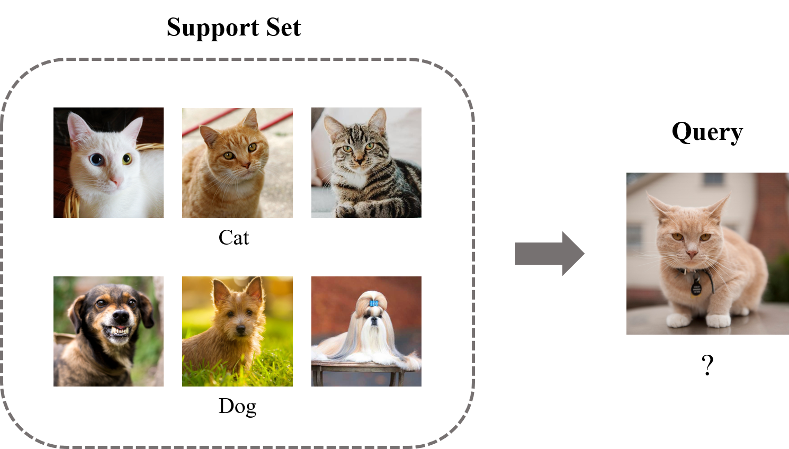
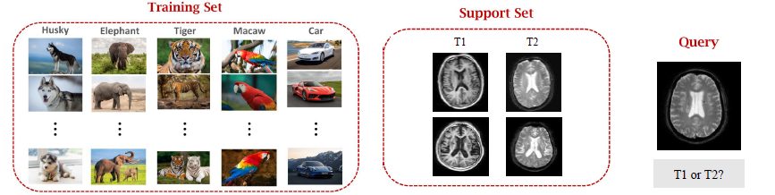
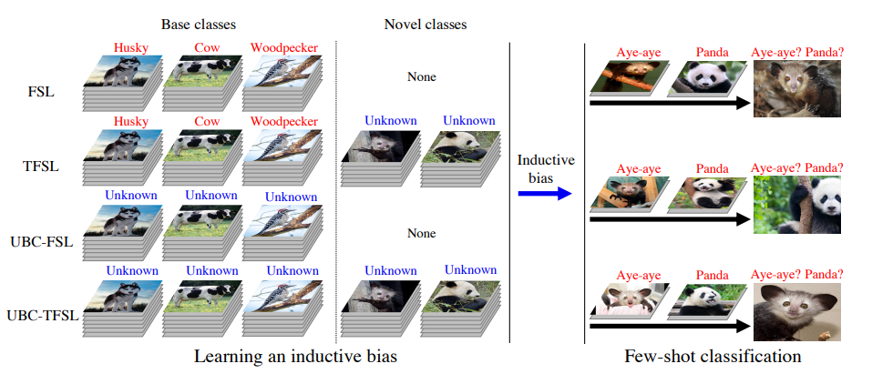
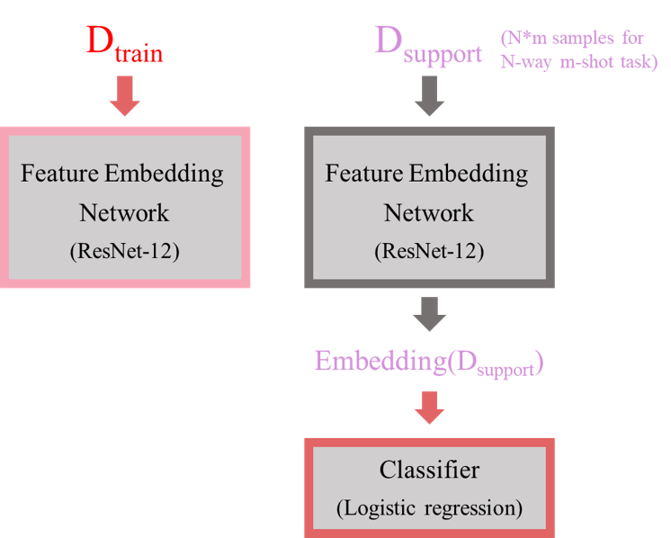
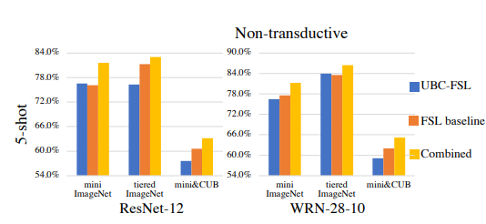
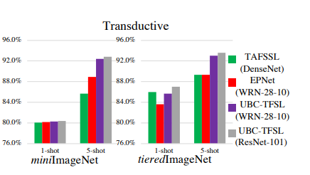
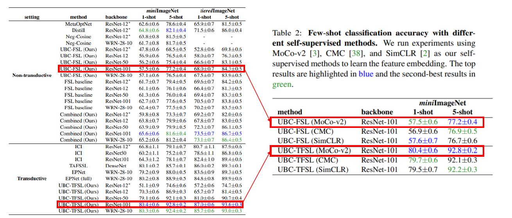
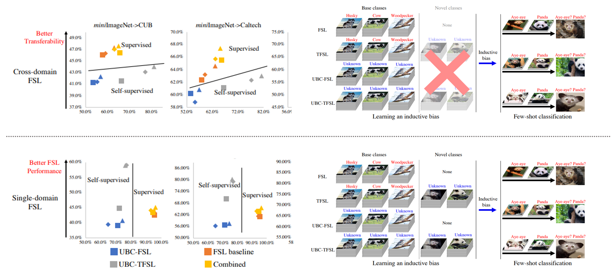

# Shot in the Dark: Few-Shot Learning with No Base-Class Labels \[Kor\]

##  1. Problem definition

본 논문에서는 **Few-Shot Learning (FSL)** 문제를 **Self-Supervised Learning (SSL)** 로 해결했습니다. SSL에 관한 자세한 내용은 **2.Motivation [Related Work]** 에서 다루기로 하고, 이 섹션에서는 **FSL**에 대해 알아보겠습니다.

보통 딥러닝은 아주 많은 수의 데이터를 필요로 합니다. 이미지 분류 문제의 대표적인 데이터셋인 ImageNet의 경우 천만 개가 넘는 데이터가 존재합니다.
반면 FSL은 말 그대로, 아주 적은 수의 데이터를 이용해 학습하는 문제입니다. 예를 들어, 고양이와 강아지 사진을 각각 3장씩만 보여준 후, 새로운 사진을 보여주고 해당 사진이 고양이인지, 강아지인지 분류하게 하는 문제가 있을 수 있습니다. (Figure1) 이 때, 모델에게 사전에 주어지는 적은 수의 데이터를 **Support Set** 이라 하고, 문제로 주어지는, 답을 모르는 새로운 데이터를 **Query** 라고 합니다. 꼭 classification 문제에만 국한되는 것이 아니라, segmentation이나 detection, 혹은 그 외의 문제가 될 수도 있습니다.

 

 

주어진 데이터셋의 class의 개수(**K**)와, 각 class에 속하는 샘플 수(**N**)에 따라 **K-way N-shot** 문제라고 불립니다. 예를 들어, Figure1의 경우 2-way 3-shot이라고 할 수 있습니다. 보통 성능 평가를 위해 주로 사용되는 task는 5-way 5-shot, 5-way 1shot입니다.

이렇게 극단적으로 적은 수의 데이터만을 가지고 딥러닝 모델을 학습시키는 것은 거의 불가능합니다. 따라서 FSL 문제를 풀기 위해서는 **Meta-learning** 을 이용합니다. Meta-data가 "데이터에 대한 데이터"인 것처럼, Meta-learning은 **"학습하는 법을 학습"** 하는 방법을 의미합니다.

 

![Figure2: FSL example [3]](../../.gitbook/assets/1/metalearning.PNG)

 

Figure2는 Armadillo와 Pangolin의 사진을 각각 두 장씩 보여주고, 주어진 Query 사진이 Armadillo인지, Pangolin인지 맞추게 하는 2-way 2-shot 문제입니다. 이것을 사람의 입장에서 생각해보면, 우리는 이 두 동물에 대한 사전지식이 없더라도 문제를 맞출 수 있습니다. 네 장의 사진을 자세히 보면, Armadillo는 귀가 뾰족하고 몸통에 가로 줄무늬가 있는 반면, Pangolin은 비늘 같은 무늬가 있는 것을 알 수 있습니다. 우리가 이렇게 제한적인 정보만 가지고 두 동물을 구별할 수 있는 것은, 우리는 이미 그동안의 경험을 통해 **"특징을 추출하는 방법"** 을 익혀왔기 때문입니다.

 

![Figure3: Training set, Support set, Query [3]](../../.gitbook/assets/1/trainingset.PNG)

 

Meta-learning은 이와 유사하게, 모델에게 "특징을 추출하는 능력"을 사전에 학습시키는 방식입니다. **Training Set** 이라는 새로운 대량의 데이터가 등장합니다. 이를 통해 특징 추출 능력을 배우고, 이 지식을 이용해 Support Set의 아주 적은 수의 샘플들만을 가지고 Query의 문제를 풉니다. 물론, Training set의 class와 Support set의 class는 서로 달라야 합니다. Training set은 모델을 충분히 학습시킬 수 있을 만큼 큰 데이터셋이고, support set의 class가 여기에 속해 있으면 few-shot learning의 의미가 없어지기 때문입니다. 이 때 Training set의 class들을 Base class, Support set의 class들을 Novel class 라고 합니다. FSL에 대한 보다 자세한 설명과 관련 연구들을 알고 싶으신 분들은 \[3\], \[4\], \[5\] 등을 읽어보시는 것을 추천드립니다.

## 2. Motivation

본 논문에서는 FSL 중 하나의 종류인 **Transductive Few-Shot Learning (TFSL)** 문제에 초점을 맞추고 있습니다. 앞에서 설명한 대로, FSL은 대량의 Training set 에서 학습한 사전 지식에 크게 의존하는데, 만약 **Training set과 Support set의 차이가 매우 크다면** 문제가 생깁니다. 예를 들어, Figure3의 경우처럼 Training set이 ImageNet, Support set이 Armadillo/Pangolin 이미지라면 두 데이터셋의 class들이 크게 다르지 않아서 괜찮지만, 만약 Figure4처럼 Support set이 T1/T2 MRI라면 두 데이터셋이 매우 달라 Training set에서 학습한 지식을 제대로 활용할 수 없을 수도 있습니다. 

 

 

TFSL은 Training set과 Support set에 더해, **Query set의 unlabeled 샘플들을 추가로 활용**하는 방법입니다. Label이 있지만 수가 매우 적은 Support set에 비해, Query set은 label이 없지만 상대적으로 얻기가 쉽습니다. 여기서 얻을 수 있는 novel class의 distribution에 대한 추가적인 정보를 활용할 수 있을 것이라는 아이디어입니다. 따라서 TFSL은, Base class에 속하는 대량의 labeled 샘플 (Training set)에 추가로 Novel class에 속하는 대량의 Unlabeled 샘플을 활용할 수 있다고 가정하는 문제입니다. FSL의 unsupervised 버전이라고 생각하시면 될 것 같습니다.

TFSL에 대한 기존 연구들은, 높은 신뢰도로 분류된 Unlabeled novel 샘플들을 활용하거나\[6\], Unlabeled novel 샘플들을 사전 학습된 모델의 fine-tuning 단계에서의 regularizer로써 활용하는 등\[7\], **base class의 샘플들을 이용한 supervised learning으로부터 얻은 inductive bias를 개선시키는 데에만 머물러 있었습니다.** 본 논문에서는, **Self-Supervised Learning (SSL)을 이용해 Labeled sample들을 전혀 이용하지 않고, unlabeled sample들만을 이용하여 모델을 scratch부터 학습시킬 수 있는 방법을 제시합니다.**

### Related work

앞서 설명한 듯이 본 논문에서는 **Self-Supervised Learning (SSL)** 을 이용합니다. 이 섹션에서는 SSL에 대해 간략히 설명하겠습니다. 보다 자세한 설명과 관련 연구들에 대한 설명은 \[8\], \[9\] 등을 추천드립니다.

SSL은 데이터-Label 쌍을 이용해 모델을 학습시키는 Supervised learning과 달리, Label 없이 데이터 자체만을 이용해 모델을 학습시키는 방법입니다. Label annotation은 많은 노력이 들어가기 때문에, 많은 분야에서 활용 가능성이 높은 기법입니다.

 

![Figure5: Overall process of SSL [9]](../../.gitbook/assets/1/ssl.png)

 

다양한 방법이 있지만, 공통적인 흐름은 다음과 같습니다. 우선, 연구자가 직접 정의한 **Pretext task** 를 이용하여 label 없이 데이터만으로 모델을 학습시킵니다. Pretext task를 이용해 학습시킨 모델의 weight를 이용해 수행할 downstream task에 대한 transfer learning + fine tuning 과정을 거칩니다. 간단한 Pretext task의 예로는 denoising, colorization, zigsaw, context prediction 등이 있을 수 있습니다. 예를 들어, 이미지를 여러 개의 patch로 나눈 뒤, 각 patch가 어떤 위치에서 왔는지를 맞추는 Context prediction task를 설정할 수 있습니다. (Figure6) \[10\] 이 과정에서 모델이 이미지에서 특징을 추출하는 방법을 학습합니다. 각 task에 대한 자세한 설명은 앞에서 소개한 링크들에 잘 소개되어 있습니다.

 

![Figure6: Pretext task example - Context prediction [10]](../../.gitbook/assets/1/context_prediction.PNG)

 

본 논문에서 사용한 SSL 기법은 최근 가장 좋은 성능을 보이고 있는 **MoCo-v2** \[11\]입니다. MoCo-v2는 Kaiming He가 제안한 MoCo의 업그레이드 된 버전으로, 전체적인 동작 방식은 다음과 같습니다. 입력 이미지에 대해 random augmentation을 적용하고, 이를 입력 이미지에 대한 positive pair로 이용합니다. 입력 이미지가 아닌 다른 샘플들은 negative pair로 이용하여, positive pair 간의 similarity를 극대화하고, negative pair 간의 simimlarity는 최소화하는 방법입니다. Loss function은 다음과 같습니다. 여기에서 $$q_i$$ 는 입력 이미지에 대한 embedding vector을 의미하고, $$_i$$ , $$k_j (j \neq i)$$ 는 각각 positive pair, negative pair의 embedding vector입니다. 전체 수식은 positive pair 간의 similarity와 negative pair 간의 dissimilarity에 대한 Cross entropy loss라고 생각하시면 됩니다. MoCo에 대한 상세한 설명은 \[12\]의 게시물을 참고하시면 될 것 같습니다.

$$
L_{q_i} = -log(\frac{exp(q_i^Tk_i/\tau)}{exp(q_i^Tk_i/\tau)+\sum_{j\neq i}exp(q_i^Tk_j/\tau)})
$$

### Idea

본 논문은 MoCo-v2를 통해 Unlabeled 샘플들을 이용하여 모델을 학습시키는 방법을 이용했습니다. 이를 통해 모델은 보다 일반화된 representation을 학습할 수 있고, Labeled 샘플이 전혀 없는 제한된 상황에서도 기존 방식과 비슷하거나 더 높은 성능을 낼 수 있었다고 주장하고 있습니다.

## 3. Method

### Dataset setting

본 논문에서는 총 4가지의 데이터셋 setting을 활용합니다. (Figure7) 이 중 **FSL** , **TFSL** 은 기존의 연구들에서 진행한 방법이고, **UBC-FSL** 과 **UBC-TFSL** 이 본 논문에서 새롭게 진행한 setting입니다.

 

 

Training set으로 다음의 데이터들이 주어집니다.

- **FSL**: Base class에 대한 Labeled 데이터
- **TFSL**: Base class에 대한 Labeled 데이터 + Novel class에 대한 Unlabeled 데이터
- **UBC-FSL**: Base class에 대한 Unlabeled 데이터
- **UBC-TFSL**: Base class에 대한 Unlabeled 데이터 + Novel class에 대한 Unlabeled 데이터

Support set과 Query set은 일반적인 FSL setting과 동일합니다. Novel class에 대한 Labeled 데이터를 아주 적은 개수만큼 제공하고(Support set), 새로운 이미지를 보여 주며 Label을 맞추게 하는 Classification task입니다. 물론, Query set에 속하는 데이터는 TFSL과 UBC-TFSL에서 사용되는 "Novel class에 대한 Unlabeled 데이터"와는 겹치지 않아야 합니다.

### Training process

전체적인 모델의 학습 방법은 다음과 같습니다. 우선, Training set을 이용해 **Feature embedding network** 를 이용했습니다. Feature embedding network는 ResNet과 WRN 등, 다양한 깊이의 모델을 이용하였습니다. 이후, 학습된 Feature embedding network를 이용해 Support set의 embedding을 얻고, 이를 이용해 **Classifier** 를 학습시켰습니다. Classifier로는 Logistic regression을 이용하였습니다. Support set을 이용해 Feature embedding network를 fine-tuning 시키거나, classifier의 종류를 바꾸는 등의 방법으로 성능을 높일 수 있으나 본 논문은 성능을 높이는 것이 목적이 아닌, 기존 방법들과의 비교가 목적이었기 때문에 이러한 구조를 이용했다고 합니다.

 

 

각 데이터셋 setting에 따라 Feature embedding network를 학습하는 방법만 달라지고, Support set을 이용해 Classifier을 학습하는 방법은 동일합니다. FSL의 경우 MetaOptNet, Distill, Neg-Cosine, TFSL의 경우 ICI, TAFSSL, EPNet 등을 비교 대상으로 사용했습니다. 본 논문에서 새롭게 제시한 방법인 UBC-FSL, UBC-TFSL은 MoCo-v2를 이용해 Feature embedding network를 학습시킵니다. 

## 4. Experiment & Result

### Experimental setup

- **Dataset**으로는 *miniImageNet*과 *tieredImageNet*, *Caltech-256*을 이용했습니다. miniImageNet과 tieredImageNet은 ImageNet에서 일부 class만 분리해 FSL 용 데이터셋으로 가공한 것으로, 각각 100개와 608개의 class를 포함합니다. Caltech-256 역시 FSL을 위해 분리된 데이터셋으로, 총 256개의 class를 포함하고 있습니다. 추가로, Base class와 Novel class가 같은 데이터셋에서 분리되어 두 class들 간 distribution이 유사한 single-domain 실험 뿐 아니라, 서로 다른 데이터셋에서 Base class와 Novel class를 추출한 cross-domain 실험 역시 수행하였는데, 이를 위해 CUB-200-2011 데이터셋을 이용했습니다. 예를 들어, *miniImageNet&CUB* 데이터셋은 miniImageNet에서 64개의 Base class를 추출하고, CUB에서 100개의 Novel class를 추출했습니다.
- **비교대상**으로는 FSL은 MetaOptNet, Distill, Net-Cosine을 이용하였고, TFSL 모델로는 ICI, TAFSSL, EPNet을 사용하였습니다.
- **Feature embedding network** 구조로는 ResNet-12*, ResNet-12, ResNet-50, ResNet-101, WRN-28-10 등 다양한 크기와 깊이의 모델을 사용하였고, **Classifier**로는 Logistic regression을 사용했습니다. 
- 결과 비교를 위한 **성능지표**로는 Accuracy를 이용했습니다.

### Result

논문에서 다양한 실험과 Ablation study를 진행했는데, 그 중 몇 가지를 소개해 드리겠습니다.

> Experiment 1

우선, 가장 단순하게 Unlabeled Novel class 샘플을 이용하지 않은 **Non-transductive setting**으로, **UBC-FSL**과 **FSL baseline**, **combine method** 세 가지를 비교했습니다. UBC-FSL은 앞서 설명한대로 MoCo-v2과 Unlabeled Base class 데이터만을 이용해 훈련시킨 모델이고, FSL baseline은 Labeled Base class 데이터를 이용해 단순한 supervised learning으로 훈련시킨 모델, combined는 앞선 두 모델에서 나온 embedding을 concatenate 하여 실험한 것입니다. 해당 실험에서 두 가지 결론을 얻었는데, <u>첫 번째</u>는 UBC-FSL의 가능성을 보았다는 것입니다 (**UBC-FSL shows some potential**). UBC-FSL은 FSL baseline과 비교했을 때 Label 데이터가 없기 때문에 훨씬 열악한 환경임에도 불구하고, UBC-FSL의 성능이 FSL baseline과 큰 차이가 나지 않거나 오히려 더 높은 경우도 있었습니다. 이를 통해 <u>UBC-FSL을 사용했을 때 성능 향상의 가능성</u>을 보았다고 합니다. <u>두 번째</u>는, supervised feature과 unsupervised feature을 단순히 concatenate만 했음에도 불구하고, UBC-FSL과 FSL baseline보다 더 좋은 성능을 보였습니다. 이를 통해 <u>supervised feature과 self-supervised feature이 서로 상호보완적인 역할</u>을 할 수 있다는 것을 보였습니다 (**A great complementary among supervised features and self-supervised features**).

 

  

> Experiment 2

다음으로는 Unlabeled Novel class 샘플을 추가적으로 사용하는 **Transductive setting**에 대해서도 실험을 진행했는데, 이번에는 기존의 SOTA 모델들과의 비교를 진행했습니다. **TAFSSL**, **EPNet**과 본 논문에서 제안한 **UBC-TFSL**을 비교했을 때, **UBC-TFSL**이 항상 가장 높은 성능을 보였습니다. 다른 모델들과 달리 <u>Base class 샘플들의 Label을 활용할 수 없는 경우임에도 불구하고 더 높은 성능을 보였다</u>는 점에서 놀라운 결과입니다. 또한, 그래프에는 나타나 있지 않지만 cross-domain problem에 대해서도 더 견고함을 보였다고 합니다.

 

  

> Experiment 3

본 논문에서는 SOTA SSL 기법인 MoCo-v2를 주로 이용하였지만, **다른 SSL 기법을 이용한 결과**도 보였습니다. 이는 MoCo-v2 뿐만 아니라 다른 SSL 기법들 역시 본 논문에서 주장하는 효과를 보일 수 있음을 의미합니다. **CMC**, **SimCLR** 등에 대한 실험을 추가로 진행하였으며, 모든 경우 성능이 향상되었음을 확인할 수 있습니다.

 

  

> Experiment 4

마지막 실험은 UBC-TFSL이 실제로 Unlabeled Novel class 샘플들로부터 Novel class에 대한 distribution을 학습한다는 것을 증명하는 실험입니다. 해당 실험에서는, **Cross domain setting**에서 TFSL과 UBC-TFSL의 Training set에 **Unlabeled Novel class의 샘플들이 아닌, 다른 class에 속하는 Unlabeled 샘플들**을 추가로 제공했습니다. 즉, 모델에게 주어진 Training 데이터의 개수는 같지만 Unlabeled Novel class의 샘플들을 제공하지 않은 것입니다. Figure12의 위 부분이 해당 경우를 나타내고, 아래 부분은 원래대로 Unlabeled Novel class 샘플들을 제공한 경우입니다. 위 부분의 x축은 source dataset, y축은 target dataset에 대한 1-shot test accuracy를 의미하며, 아래 부분의 x축은 base class, y축은 novel class에 대한 1-shot accuracy를 의미합니다. 전자는 Supervised feature이 더 높은 성능을 보였고, 후자는 UBC-TFSL이 더 높은 성능을 보였습니다. 이러한 실험 결과는 UBC-TFSL의 높은 성능이 단순히 추가적인 Unlabeled 샘플을 활용할 수 있어서가 아니라, 실제로 Novel class에 대한 distribution을 학습하기 때문임을 입증합니다.

 

  

소개한 4가지의 실험 외에도 모델 깊이에 따른 성능 분석 등 몇 가지의 실험이 더 있으나, 여기에서는 중요하거나 흥미있는 실험 일부만 소개했습니다. 더 다양한 실험과 자세한 설명은 원본 논문 \[1\]을 참고하시길 바랍니다.

## 5. Conclusion

Few-Shot Learning 전반에 대해 알아보고, "Shot in the dark: Few-shot learning with no base-class labels."에서 제안한 아이디어와 실험 결과에 대해 알아보았습니다. Self-Supervised Learning을 이용함으로써, Transductive Few-Shot Learning task를 수행할 때 단순히 Supervised learning을 통해 학습한 모델을 개선시키는 것에서 벗어나 Unlabeled 데이터만을 이용해 모델을 scratch에서부터 학습하고, Novel class에 대한 일반화 성능을 향상시킬 수 있음을 보였습니다.

### Take home message \(오늘의 교훈\)

> Self-Supervised Learning을 이용하여 Supervised Learning보다 더 좋은 representation을 학습 할 수 있는 경우가 있다.
>
> Self-Supervised Learning은 활용가능성이 무궁무진하다.

## Author / Reviewer information

### Author

**김보민 \(Bomin Kim\)** 

* M.S. student, Bio and Brain Engineerint, KAIST (Advisor: Sung-Hong Park)
* Contact: bo10000@kaist.ac.kr
* Interests: Medical image analysis, Deep learning, Computer vision
* Personal web page: [https://bo-10000.tistory.com/](https://bo-10000.tistory.com/)

### Reviewer

1. Korean name \(English name\): Affiliation / Contact information
2. Korean name \(English name\): Affiliation / Contact information
3. ...

## Reference & Additional materials

1. **\[Original paper\]** Chen, Zitian, Subhransu Maji, and Erik Learned-Miller. "Shot in the dark: Few-shot learning with no base-class labels." Proceedings of the IEEE/CVF Conference on Computer Vision and Pattern Recognition. 2021.
2. **\[Autho's presentation video\]** https://www.youtube.com/watch?v=RqVPS9e3b9o
3. **\[FSL introduction\]** (Eng) Wang, S. (2020, August 21). Few-Shot Learning (1/3): Basic Concepts \[Video\]. YouTube. https://www.youtube.com/watch?v=hE7eGew4eeg
4. **\[FSL introduction\]** (Kor) 1.퓨샷 러닝(few-shot learning) 연구 동향을 소개합니다. (2019, November 6). Kakaobrain. https://www.kakaobrain.com/blog/106
5. **\[FSL introduction\]** (Kor) Few-shot Learning Survey. (2020, November 25). https://velog.io/@tobigs-gm1/Few-shot-Learning-Survey
6. **\[TFSL paper\]** Zitian Chen, Yanwei Fu, Kaiyu Chen, and Yu-Gang Jiang. Image block augmentation for one-shot learning. In Association for the Advancement of Artificial Intelligence (AAAI), volume 33, pages 3379–3386, 2019.
7. **\[TFSL paper\]** Guneet Singh Dhillon, Pratik Chaudhari, Avinash Ravichandran, and Stefano Soatto. A baseline for few-shot image classification. In Proceedings of the International Conference on Learning Representations (ICLR), 2019.
8. **\[SSL introduction\]** (Kor) Self-Supervised Learning(자기지도 학습 설명). (2020, November 01). https://greeksharifa.github.io/self-supervised%20learning/2020/11/01/Self-Supervised-Learning/
9. **\[SSL introduction\]** (Kor) Self-Supervised Learning. (2020, November 18). https://velog.io/@tobigs-gm1/Self-Supervised-Learning
10. **\[SSL paper\]** Doersch, Carl, Abhinav Gupta, and Alexei A. Efros. "Unsupervised visual representation learning by context prediction." Proceedings of the IEEE international conference on computer vision. 2015.
11. **\[MOCOv2 paper\]** Chen, Xinlei, et al. "Improved baselines with momentum contrastive learning." arXiv preprint arXiv:2003.04297 (2020).
12. **\[MoCo introduction\]** (Kor) Self-Supervised Learning - MoCO (1). (2021, April 15). https://hongl.tistory.com/122
