# UPFlow: Upsampling Pyramid for Unsupervised Optical Flow Learning \[Eng\]

##  1. Problem definition

The unsupervised optical flow model H with parameters &theta; estimates the velocity vector $$V_{f}$$ of each pixel in the image at time t based on the current image $$I_{t}$$ and its next image $$I_{t+1}$$

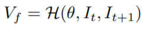
 *Optical Flow Formula*

The estimated optical flow is visualized in **Figure 2**. The magnitude is mapped to saturation and the direction is mapped to color. For instance, bright red indicates the rightward movement of the pixel and dark green indicates lower left movement of the pixel. The white color indicates the stationary pixel without movement.

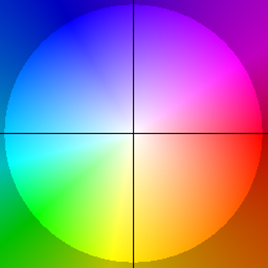
 *Optical Flow Colormap*

Supervised optical flow methods take the additional input, which is the ground truth optical flow and are superior to unsupervised optical flow methods in terms of their accuracy. But it is very difficult to acquire manually labeled optical flow datasets. Therefore, this paper improves upon previous unsupervised optical flow methods to achieve similar accuracy to supervised optical flow methods without manually labeled datasets. 

Upsampling is the operation that increases the resolution of the input image to higher resolution.
Previously, bilinear interpolation was used which was simple but produced blurry estimated optical flow near the boundary of the objects.
One of the main contribution of this paper is the sophisticated upsampling module which produces clearer optical flow even at the boundary of the objects.

## 2. Motivation

### Related work

Optical flow estimation of a frame in MPI Sintel by various methods is shown in **Figure 3**. Among previous methods, UPFlow (indicated by Ours) method estimates the optical flow with the cleanest optical flow boundary along the edge.

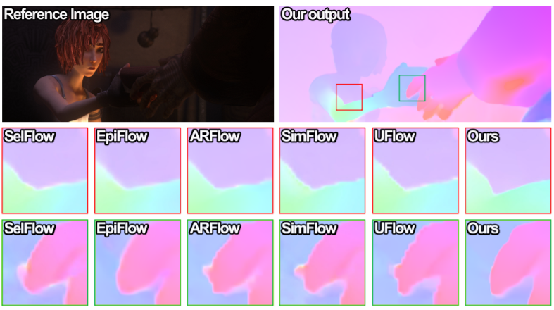
 *An example from Sintel Final benchmark*

Here are some of the weaknesses and strengths of previous works

Strengths:

- PWC-Net [2]

  - Pyramid network structure comprised of multiple levels that sequentially encodes the image to smaller resolution and decodes the feature map to larger resolution.

- UFlow [3] decoder 

  - based on the network structure of PWC-Net
  - warps the features from the second image by the estimated optical flow
  - computes the 4D cost volume matrix from 2D feature maps from the first and the second image
  - Uses the 4D cost volume to estimate the optical flow.

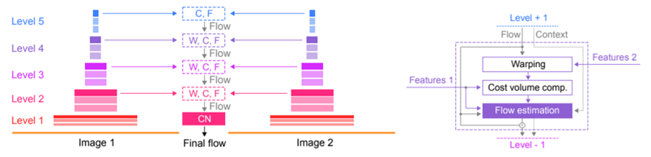
 *UFlow Architecture*

- UnFlow [4]

  - Calculate the occlusion by forward backward occlusion checking. The occlusion checking uses the fact that without any occlusion, the optical flow of the first image should be the same as the the inverse of optical flow of the second image. Then, the occluded regions are ignored when computing the loss in optical flow estimation to consider pixels with good corresponding matches in two images. 

 *How UnFlow works*

Weaknesses:

- Bilinear interpolation is used to upsample the estimated optical flow between pyramid levels. As a result, the optical flow along the edge of the objects are blurred.
- The loss is calculated only from the optical flow estimation in the final layer of the pyramid network. Without supervision on optical flow estimation in intermediate layers, errors in coarser levels can accumulate. 

This paper uses the strength of previous work while improving upon the weaknesses stated above.

### Idea

Two weaknesses described above can be thought of as bottom-up and the top-down problems and each problem has the following solution, which will be described in detail in the next section.

- Bottom-up problem refers to the bilinear interpolation
  - Solution: Self-guided upsample module
- Top-down problem refers to the lack of supervision on intermediate pyramid levels
  - Solution: Pyramid distillation loss

## 3. Method

As shown in **Figure 6**, the current image $$I_{t}$$ and the next image $$I_{t+1}$$ are encoded by the convolutional layers to smaller resolutions sequentially. 
The encoded feature maps form the pyramid of encoded layers, starting from $$F_{t}^{4}$$, to the smallest resolution feature map, $$F_{t}^{0}$$.
Then, the estimated optical flow from a lower pyramidal level, $$V_{f}^{i}$$, is upsampled and the feature maps at a higher level, $$F_{t}^{i+1}$$ and $$F_{t+1}^{i+1}$$, are used to estimate the optical flow at a higher pyramidal level, $$V_{f}^{i+1}$$. 
In this way, the optical flow, $$V_{f}$$, is estimated at each pyramidal level, i. 

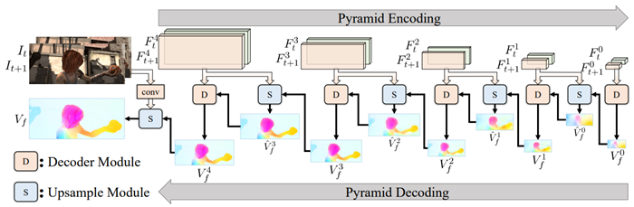
 *pipeline of UPFlow*

As shown in **Figure 7**, Upsampling by bilinear interpolation can incorrectly estimate the optical flow of the pixel in the red region by mixing the optical flow of both red and blue regions. 
Here, the red region indicates where the interpolated sample should belong, and the blue region indicates the region containing neighboring pixels that hinder the correct interpolation. 
To remedy this situation, upsampling by interpolation flow is introduced.
It interpolates a point with neighboring points in the red region and bring the interpolated point to the target place with the learned interpolation flow.
It can be thought of as the weighted combination of bilinear upsampled flow and the warped upsampled flow with the interpolation flow.
The interpolation flow $$U_{f}$$ is shown in **Figure 8**.

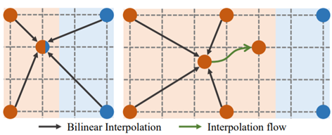
 *bilinear upsampling (left) and the self-guided upsampling (right)*

Self-guided upsample module (SGU) in **Figure 8** takes the optical flow estimated from the lower pyramid level and two encoded feature maps from two images at adjacent time points, t and t+1. 
SGU first upsamples the optical flow from the lower pyramid level and uses the upsampled optical flow to warp the feature at time t. 
The warped feature at time t and the feature at time t+1 are concatenated and go through the dense block. 
The dense block is comprised of 5 convolutional layers, with the kernel number 32, 32, 32, 16, and 8 respectively. 
The dense block outputs the interpolation Flow $$U_{f}$$ and the interpolation map $$B_{f}$$. 
The interpolation map is the attention map that forces the model to only learn interpolation flow in the boundary regions.

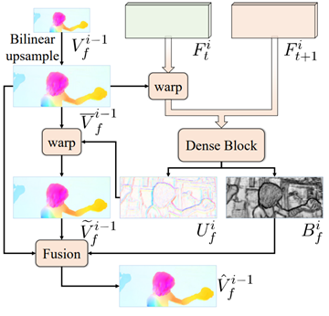
 *self-guided upsample module*

The interpolation flow $$U_{f}$$ warps the upsampled optical flow such that the optical flow vectors along the boundary are estimated accurately. 
According to **Figure 9**, interpolation map $$B_{f}$$ has zero values along the edge so that interpolation flow, $$U_{f}$$, only warps the optical flow along the edge while simple bilinear upsampled optical flow is used in other regions.  

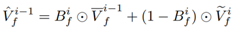
 *self-guided upsample formula*

For training the model, photometric Loss similar to UFlow [3] and the authors' pyramid distillation loss were added together with loss weights as hyper-parameters.
In this way, the model can be trained to estimate the optical flow with only input images without any ground truth optical flow.
In this review, we will focus on Pyramid Distillation Loss $$L_{d}$$ shown in **Figure 10**.

Pyramid Distillation Loss $$L_{d}$$ uses the final output optical flow $$V_{f}$$ as pseudo label for optical flow at intermediate layers by downsampling it to match the resolution of the intermediate estimated optical flows. 
In this way, it can calculate the supervised loss between the pseudo optical flow and the estimated optical flow at each intermediate layers. 
In **Figure 10**, $$S_{⭣}$$ represents the downsampling function, and $$s_{i}$$ is the scale magnification of pyramid level i. 
Together, they represent that downsampling the resolution of the input to $$i^{th}$$ pyramidal level.
Occlusion mask $$M_{t}$$ is also downsampled to exclude occlusion regions from calculating $$L_{d}$$. &Psi; is the robust penalty function (**Figure 11**) to reduce the effect of outliers, where q=0.4 and &epsilon;=0.01. p is the pixel coordinate and N is the total number of pyramid layers, 4.  

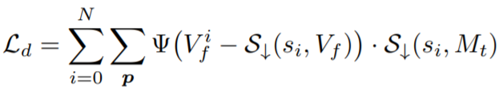
 *pyramid distillation loss*

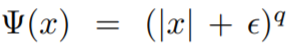
 *robust penalty function*

## 4. Experiment & Result

### Experimental setup

* Dataset

  * MPI Sintel
  * KITTI 2012
  * KITTI 2015

* Baseline

  * UFlow [3]

* Training setup

  * UPFlow is Implemented in PyTorch. For training on MPI Sintel dataset, all the training images from both 'Clean' and 'Final' are used. For training on KITTI 2012 and 2015 datasets, pretrain on 28058 image pairs from the KITTI raw dataset and then finetune on the multi-view extension dataset. The flow ground-truth is only used for validation. UPFlow is trained in 1000k iterations with batch size of 4. 
  * The total number of parameters is 3.49M and the self-guided upsample module has 0.14M trainable parameters. The running time is 0.05 seconds for a MPI Sintel image pair with resolution 436 × 1024.

* Evaluation metric

  * End-to-end point error (EPE) is the euclidean distance between the estimated optical flow $$V_{est}$$ and the ground truth optical flow $$V_{gt}$$. Lower is better

    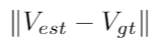

  * percentage of erroneous pixels (F1). Lower is better

    

### Result

In the **table 1** comparing average EPE or F1, the best unsupervised results are marked in red and the second best results are marked in blue. Compared to the previous unsupervised optical flow methods such as UnFlow or UFlow, UPFlow estimates optical flow the most accurately in all three datasets. Since UFlow and UPFlow have similar network structures and occlusion handling method, superior performance of UPFlow verifies the importance of SGU and pyramidal distillation loss. UPFlow is not as accurate as the state-of-the-art supervised optical flow method, RAFT [5] but it surpasses other supervised methods such as FlowNetS [6] and SpyNet [7].

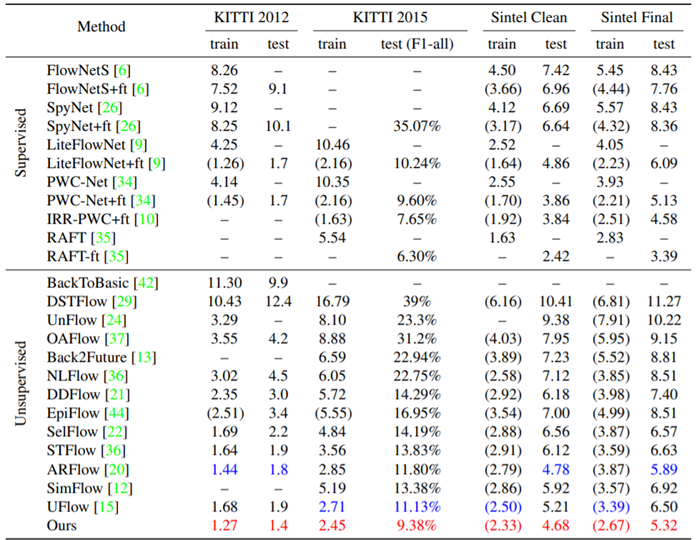
 *Comparison with previous methods*

**Figure 13** compares the estimated optical flow by UPFlow and UFlow side by side on KITTI 2012 (first two rows) and KITTI 2015 (last two rows). The yellow rectangular boxes indicate the regions where UPFlow significantly produces the better optical flow estiomation. The overall optical flow estimation from UPFlow and UFlow seem similar but the major improvement occurs along the boundary of the objects where the optical flow can change abruptly.

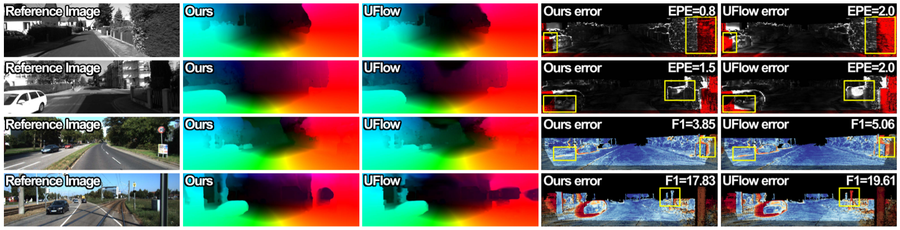
 *Visual comparison on KITTI 2012 (first two rows) and KITTI 2015 (last two rows)*

## 5. Conclusion

UPFlow retains the strengths of previous unsupervised optical flow methods such as pyramidal structure, 4D Cost Volume computation, and occlusion handling while improving upon bilinear upsampling method by SGU module and providing more supervision by guiding intermediate optical flow estimation with pyramidal distillation loss. 

It's interesting to see that the pyramidal network with encoder and decoder consistently shows good performance across various computer vision tasks. Also, pyramidal distillation loss reminds me of GoogLeNet which provided additional supervision for the intermediate layers. So it seems like a good research strategy to simply try what worked well previously before inventing new methods.

### Take home message

> Perform the bilinear upsampling with learnable upsampling
>
> Guide the outputs of the intermediate layers by the pyramidal distillation loss
>
> Unsupervised optical flow method can surpass some previous supervised optical flow methods

## Author / Reviewer information

### Author

**장준봉 \(Junbong Jang\)** 

* KAIST AI
* junbongjang@kaist.ac.kr
* Personal Website: https://junbongjang.github.io/

### Reviewer

None

## Reference & Additional materials

[1] Luo, K., et al. (2021). UPFlow: Upsampling Pyramid for Unsupervised Optical Flow Learning. Proceedings of the IEEE conference on computer vision and pattern recognition.

[2] Sun, D., Yang, X., Liu, M., and Kautz, J. (2018). PWC-Net: CNNs for Optical Flow Using Pyramid, Warping, and Cost Volume. Proceedings of the IEEE conference on computer vision and pattern recognition.

[3] Jonschkowski, R., et al. (2020) What Matters in Unsupervised Optical Flow. In: Vedaldi A., Bischof H., Brox T., Frahm JM. (eds) Computer Vision – ECCV 2020. ECCV 2020. Lecture Notes in Computer Science, vol 12347. Springer, Cham.

[4] Meister, S., Hur, J., Roth, S. (2018). UnFlow: Unsupervised Learning of Optical Flow with a Bidirectional Census Loss. Proceedings of the Thirty-Second AAAI Conference on Artificial Intelligence.

[5] Teed, Z. and Deng, J. (2020). RAFT: Recurrent All-Pairs Field Transforms for Optical Flow. ECCV 2020.

[6] Fischer, P., et al. (2015). FlowNet: Learning Optical Flow with Convolutional Networks. Proceedings of the IEEE conference on computer vision and pattern recognition.

[7] Ranjan, A. and Black, M. (2017). Optical Flow Estimation using a Spatial Pyramid Network. Proceedings of the IEEE conference on computer vision and pattern recognition.

Video explaining UPFlow: https://www.youtube.com/watch?v=voD3tA8q-lk

Official GitHub repository: https://github.com/coolbeam/UPFlow_pytorch
