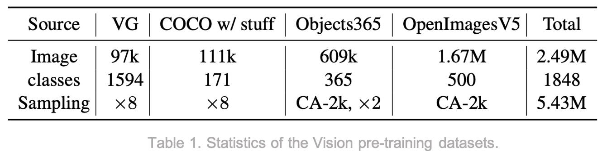

# VinVL:  Revisiting Visual Representations in Vision-Language Models [Eng]

한국어로 쓰인 리뷰를 읽으려면 [**여기**](./cvpr-2021-vinvl-kor.md)를 누르세요.

## 1. Problem definition

Vision language pre-training (VLP) is typically modeled as a two-stage framework:

1. *an image encoder* for extracting visual representations from images, and
2. *a cross-modal fusion model* for blending text and visual features.

An image encoder module $$\textbf{Vision}$$ and a cross-modal fusion module $$\textbf{VL}$$ can be formulated as
$$
(\textbf{q},\textbf{v}) = \textbf{Vision}(Img) \\
y = \textbf{VL}(\textbf{w}, \textbf{q}, \textbf{v})
$$
where $$Img$$ and $$\textbf{w}$$ are the inputs of vision and language modalities, respectively. $$\textbf{q}$$ is the semantic representation of the image (e.g., image tags or detected objects), while $$\textbf{v}$$ is the distributional representation of the image (e.g., the box or region features).

$$\textbf{w}$$ and $$y$$ of the $$\textbf{VL}$$ module differs on a VL task:

1. In VQA, $$\textbf{w}$$ is a question and $$y$$ is an answer to be predicted.
2. In text-image retrieval, $$\textbf{w}$$ is a sentence and $$y$$ is the matching score of a sentence-image pair.
3. In image captioning, $$\textbf{w}$$ is not given and $$y$$ is a caption to be generated.

## 2. Motivation

Existing VLP research mainly focuses on improving the vision-language model while leaving the object detection (OD) model untouched, despite much progress on object detection.

### Related work

ViLBERT[3] is one of the first VLP models that performed pre-training both vision and language models for learning task-agnostic visiolinguistic representations. The model extends the BERT[4] architecture to a multimodal two-stream model for processing vision and language modalities separately and blends them with a co-attentional transformer layers.

LXMERT[5] is a large-scale Transformer model consisting of three encoders: an object relationship encoder, a language encoder, and a cross-modality encoder. To pre-train the model, five pre-training tasks are performed: masked language modeling, masked object prediction (feature regression and label classification), cross-modality matching, and image question answering.

Contrast to a two-stream design in ViLBERT and LXMERT, VL-BERT[6], VisualBERT[7], and Unicoder-VL[8] are all single-stream models, demonstrating their superiority over two-stream models. The main difference between each of them is the pre-training corpus and pre-training tasks.

Oscar[9] is the previous work of the authors of VinVL, and the highlight of Oscar is utilizing image object tags as a semantic attribute.

The downside of all previous work is that they employ a rather simple object detection model to extract features, which is used in the 2017 VQA Challenge[10].

### Idea

In this work, the authors develop **an improved object detection model** and demonstrate that visual features matter significantly in VL models.

The main contributions of this work are

1. *a comprehensive empirical study* on visual features in VL models,
2. *a new object detection model* that can produce better visual features, and
3. *a detailed ablation study* of the proposed object detection model.

## 3. Method

### 3.1 Object Detection Pre-training

Contrast to a widely-used object detection model trained on just the Visual Genome (VG) dataset, the authors utilize **four public object detection datasets**, including COCO[11], OpenImagesV5[12], Objects365V1[13], and Visual Genome[14]. However, because image attributes (i.e., the semantic representation $$\textbf{q}$$) are not annotated in most datasets, they first pre-train an OD model on four datasets, followed by fine-tuning with an additional attribute branch on Visual Genome.

The authors realize that the datasets are extremely unbalanced in terms of data size, object vocabulary, and the number of annotations in each class. Therefore, the authors take the following steps to unify the corpus:

1. To enhance visual concepts of tail classes, perform class-aware sampling for OpenImages and Objects365 to get at least 2,000 instances per class.
2. To balance the contribution of each dataset, merge 4 datasets with 8 copies of COCO, 8 copies of VG, 2 copies of class-aware sampled Objects365, and 1 copy of class-aware sampled OpenImages.
3. To unify object vocabularies, use VG vocabulary as the base vocabulary, merge a class from the other three datasets on match, and add a new class if not.
4. Lastly, keep VG classes that contain at least 30 instances, resulting in a total of 1,848 classes.

For model architecture, the authors select a C4 (4th Conv Layer) model over the FPN (Feature Pyramid Network) model for the following reasons:

1. All layers in the C4 model used for region feature extraction are pre-trained on ImageNet, while the multi-layer perceptron (MLP) head of the FPN model are not.
2. The convolution head used in C4 has a better inductive bias for encoding visual information than the MLP head of FPN.

For model pre-training, they freeze the first convolution layer, the first residual block, and all the batch-norm layers, following the common practice in OD training. They also use several data augmentation methods, including horizontal flipping and multi-scale training, and initialize the model backbone from an ImageNet-5K checkpoint.

After pre-training, the authors proceed to a fine-tuning step on VG dataset in order to add attributes to the model (i.e., the semantic information such as tags). For example, most existing VL models only consider bounding boxes of the image as visual features, but by injecting attribute information, the model now knows whether the bounding box is a *surfboard*, a *boy*, etc. This is inspired by the success of their previous work Oscar.

### 3.2 Oscar+ Pre-training

Now that the image encoder module is trained, the next step is to train a vision-language fusion model. For this part, the authors simply extend their previous work and propose an improved version of the model called Oscar+.

First, the authors build their pre-training corpus on three types of vision and VL datasets:

1. Image captioning datasets (i.e., COCO[11], Conceptual Captions[15], SBU captions[16], and flicker30k[17])
2. VQA datasets (i.e., GQA[18], VQA[19], VG_QAs)
3. Image tagging datasets (i.e., a subset of OpenImages)

In total, the corpus contains 5.65 million images and 8.85 million text-tag-image triples.

The main difference between Oscar and Oscar+ comes from the pre-training loss, which is defined as

$$
L_{Pre-training} = L_{MTL} + L_{CL3}.
$$
$$L_{MTL}$$ is the Masked Token Loss, similar in BERT and following closely in Oscar, and $$L_{CL3}$$ is a 3-way Contrastive Loss, which is improved from the binary contrastive loss used in Oscar. $$L_{CL3}$$ takes two types of training samples $$\textbf{x}$$: {caption, image-tags, image-features} triplets and {question, answer, image-features} triplets. To compute contrastive losses, two types of negative triplets are constructed for two types of training samples, respectively: the polluted "captions" $$(\textbf{w'}, \textbf{q}, \textbf{v})$$ and the polluted "answers" $$(\textbf{w}, \textbf{q'}, \textbf{v})$$.

Then, a 3-way classifier $$f(.)$$ is used to predict whether the triplet is matched $$(c = 0)$$, contains a polluted $$\textbf{w}$$ $$(c = 1)$$, or contains a polluted $$\textbf{q}$$ $$(c = 2)$$. The 3-way contrastive loss is defined as

$$
L_{CL3} = - \mathop{{}\mathbb{E}}_{(\textbf{w},\textbf{q},\textbf{v};c)\sim \widetilde{D}} \log{p(c|f(\textbf{w},\textbf{q},\textbf{v}))},
$$
where the dataset $$(\textbf{w},\textbf{q},\textbf{v};c) \in \widetilde{D}$$ contains 50% matched triples, 25% w-polluted triples, and 25% q-polluted triples. 

## 4. Experiment & Result

### Experimental Setting

- 4 datasets for pre-training OD model: COCO, OpenImagesV5, Objects365V1, and Visual Genome
- 8 datasets for pre-training Oscar+: COCO, Conceptual Captions, SBU captions, flicker30k, GQA, VQA, VG_QAs, and a subset of OpenImages
- OD pre-training: Initialized with ImageNet-5K checkpoint, trained for 1.8M iterations with a batch size of 16 images.
- Oscar+B: Initialized with BERT-base model $$(L=12, H=768, A=12)$$, trained for at least 1M steps, with learning rate 1e-4 and batch size 1024. $$L$$ is the number of layers, $$H$$ is the hidden size, and $$A$$ is the number of self-attention heads.
- Oscar+L: Initialized with BERT-large model $$(L=24, H=1024, A=16)$$, trained for at least 1M steps, with learning rate 3e-5 and batch size 1024.

### Main Results

For experiments, the authors perform various VL downstream tasks, such as VQA[19], GQA[18], Image Captioning[11], NoCaps[20], Image Retrieval, Text Retrieval, and NLVR2[21], and demonstrate the superiority of their model. The subscript B refers to a similar size to BERT-base, while the subscript L refers to a similar size to BERT-large.

The table below shows that the 3-way contrastive loss performs better than the binary contrastive loss cases.

There are many other experiments done in the paper, but I will skip the details for brevity. The general idea is that the proposed model Oscar+ w/ VINVL (short for VINVL) outperforms most of the state-of-the-art models across VL tasks.

### Ablation Analysis

By conducting ablation study, the authors show that their design choices contribute to the performance improvement in regards to object categories, visual attribute training, training data scale, model size, and model architecture.

Again, there are many other ablation experiments done in the paper, but the most important idea is that the image encoding model plays a significant role in improving the general performance in VL tasks, as shown in Table 4. I recommend that you look at the paper for the details of other experiments.

## 5. Conclusion

In this paper, the authors illustrate the idea of the importance of visual features in vision-language tasks. By developing an improved version of the object detection model, they were able to uplift the SOTA results on all seven VL tasks across multiple public benchmarks. Personally, I had decided to review this paper for understanding the general feel in the vision-language field, but it was not that interesting to read. The fact that using richer image features improves the performance is an obvious result, but I guess that this kind of empirical study had to be done in order to prove the hypothesis.

### Take home message

> This paper shows that visual features matter in vision language tasks.

## Author / Reviewer information

### Author

**최민석 (Minseok Choi)**

- KAIST AI
- Research interests in NLP and VL
- minseok.choi@kaist.ac.kr

### Reviewer

1. Korean name (English name): Affiliation / Contact information
2. Korean name (English name): Affiliation / Contact information
3. …

## Reference & Additional materials

1. Zhang, P., Li, X., Hu, X., Yang, J., Zhang, L., Wang, L., ... & Gao, J. (2021). Vinvl: Revisiting visual representations in vision-language models. In *Proceedings of the IEEE/CVF Conference on Computer Vision and Pattern Recognition* (pp. 5579-5588).
2. [Official GitHub repository](https://github.com/microsoft/Oscar)
3. Lu, J., Batra, D., Parikh, D., & Lee, S. (2019). Vilbert: Pretraining task-agnostic visiolinguistic representations for vision-and-language tasks. *arXiv preprint arXiv:1908.02265*.
4. Devlin, J., Chang, M. W., Lee, K., & Toutanova, K. (2018). Bert: Pre-training of deep bidirectional transformers for language understanding. *arXiv preprint arXiv:1810.04805*.
5. Tan, H., & Bansal, M. (2019). Lxmert: Learning cross-modality encoder representations from transformers. *arXiv preprint arXiv:1908.07490*.
6. Su, W., Zhu, X., Cao, Y., Li, B., Lu, L., Wei, F., & Dai, J. (2019). Vl-bert: Pre-training of generic visual-linguistic representations. *arXiv preprint arXiv:1908.08530*.
7. Li, L. H., Yatskar, M., Yin, D., Hsieh, C. J., & Chang, K. W. (2019). Visualbert: A simple and performant baseline for vision and language. *arXiv preprint arXiv:1908.03557*.
8. Li, G., Duan, N., Fang, Y., Gong, M., & Jiang, D. (2020, April). Unicoder-vl: A universal encoder for vision and language by cross-modal pre-training. In *Proceedings of the AAAI Conference on Artificial Intelligence* (Vol. 34, No. 07, pp. 11336-11344).
9. Li, X., Yin, X., Li, C., Zhang, P., Hu, X., Zhang, L., ... & Gao, J. (2020, August). Oscar: Object-semantics aligned pre-training for vision-language tasks. In *European Conference on Computer Vision* (pp. 121-137). Springer, Cham.
10. Anderson, P., He, X., Buehler, C., Teney, D., Johnson, M., Gould, S., & Zhang, L. (2018). Bottom-up and top-down attention for image captioning and visual question answering. In *Proceedings of the IEEE conference on computer vision and pattern recognition* (pp. 6077-6086).
11. Lin, T. Y., Maire, M., Belongie, S., Hays, J., Perona, P., Ramanan, D., ... & Zitnick, C. L. (2014, September). Microsoft coco: Common objects in context. In *European conference on computer vision* (pp. 740-755). Springer, Cham.
12. Krylov, I., Nosov, S., & Sovrasov, V. (2021). Open Images V5 Text Annotation and Yet Another Mask Text Spotter. *arXiv preprint arXiv:2106.12326*.
13. Shao, S., Li, Z., Zhang, T., Peng, C., Yu, G., Zhang, X., ... & Sun, J. (2019). Objects365: A large-scale, high-quality dataset for object detection. In *Proceedings of the IEEE/CVF International Conference on Computer Vision* (pp. 8430-8439).
14. Krishna, R., Zhu, Y., Groth, O., Johnson, J., Hata, K., Kravitz, J., ... & Fei-Fei, L. (2017). Visual genome: Connecting language and vision using crowdsourced dense image annotations. *International journal of computer vision*, *123*(1), 32-73.
15. Sharma, P., Ding, N., Goodman, S., & Soricut, R. (2018, July). Conceptual captions: A cleaned, hypernymed, image alt-text dataset for automatic image captioning. In *Proceedings of the 56th Annual Meeting of the Association for Computational Linguistics (Volume 1: Long Papers)* (pp. 2556-2565).
16. Ordonez, V., Kulkarni, G., & Berg, T. (2011). Im2text: Describing images using 1 million captioned photographs. *Advances in neural information processing systems*, *24*, 1143-1151.
17. Plummer, B. A., Wang, L., Cervantes, C. M., Caicedo, J. C., Hockenmaier, J., & Lazebnik, S. (2015). Flickr30k entities: Collecting region-to-phrase correspondences for richer image-to-sentence models. In *Proceedings of the IEEE international conference on computer vision* (pp. 2641-2649).
18. Hudson, D. A., & Manning, C. D. (2019). Gqa: A new dataset for real-world visual reasoning and compositional question answering. In *Proceedings of the IEEE/CVF conference on computer vision and pattern recognition* (pp. 6700-6709).
19. Singh, A., Natarajan, V., Shah, M., Jiang, Y., Chen, X., Batra, D., ... & Rohrbach, M. (2019). Towards vqa models that can read. In *Proceedings of the IEEE/CVF Conference on Computer Vision and Pattern Recognition* (pp. 8317-8326).
20. Agrawal, H., Desai, K., Wang, Y., Chen, X., Jain, R., Johnson, M., ... & Anderson, P. (2019). nocaps: novel object captioning at scale. In *Proceedings of the IEEE/CVF International Conference on Computer Vision* (pp. 8948-8957).
21. Suhr, A., Zhou, S., Zhang, A., Zhang, I., Bai, H., & Artzi, Y. (2018). A corpus for reasoning about natural language grounded in photographs. *arXiv preprint arXiv:1811.00491*.
