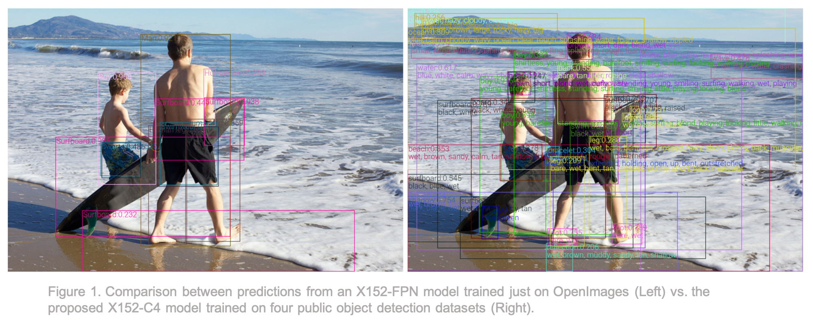
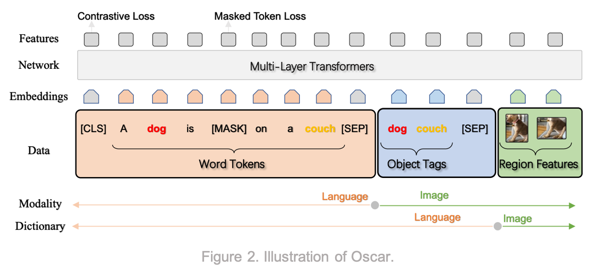
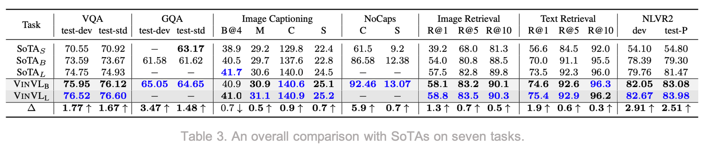
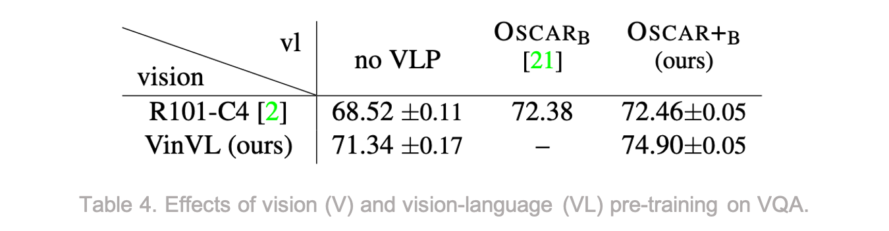

# VinVL:  Revisiting Visual Representations in Vision-Language Models [Kor]

[**English version**](./cvpr-2021-vinvl-eng.md) of this article is available.

## 1. Problem definition

비전 언어 사전 훈련(**V**ision-**L**anguage **P**re-training)은 일반적으로 2단계 프레임워크로 모델링된다.

1. 이미지에서 visual representations를 추출하기 위한 *이미지 인코더*
2. 텍스트 features 와 이미지 features를 융합하는 *크로스-모달 퓨전 모델*

이미지 인코더 모듈인 $$\textbf{Vision}$$ 과 크로스-모달 퓨전 모듈 $$\textbf{VL}$$ 은 다음과 같이 정의된다.
$$
(\textbf{q},\textbf{v}) = \textbf{Vision}(Img)\\
y = \textbf{VL}(\textbf{w}, \textbf{q}, \textbf{v})
$$
여기서 $$Img$$ 와 $$\textbf{w}$$ 는 각각 이미지와 텍스트 입력을 말한다. $$\textbf{q}$$ 는 이미지의 의미를 표현하는 semantic representation (예: 이미지 태그 또는 detected 된 object) 이고, $$\textbf{v}$$ 는 이미지의 분포적 표현을 담는 distributional representation (예: bounding box 또는 region features) 이다.

$$\textbf{VL}$$ 모듈의 $$\textbf{w}$$ 와 $$y$$ 는 비전-언어(VL) 태스크의 따라서 역할이 바뀌게 되는데,

1. 시각적 질의응답(VQA) 에서는 $$\textbf{w}$$ 가 질문이고 $$y$$ 는 예측해야 하는 정답이고,
2. 텍스트-이미지 retrieval 에서는 $$\textbf{w}$$ 가 문장, $$y$$ 는 문장-이미지 쌍의 일치 점수,
3. 이미지 캡셔닝에서는 $$\textbf{w}$$ 가 제공되지 않으며 $$y$$ 는 생성할 캡션이다.

## 2. Motivation

기존 VLP 연구는 객체 감지(**O**bject **D**etection)에 많은 진전이 있었음에도 불구하고 OD 모델은 그대로 두고 비전-언어 모델을 개선하는 데 주로 초점을 맞추고 있다.

### Related work

ViLBERT[3] 는 사전 학습(Pre-training)을 통해 태스크에 구애받지 않는 task-agnostic한 시각적+언어적 표현(visiolinguistic representations)을 추출에 성공시킨 최초의 VLP 모델 중 하나이다. 이 모델은 BERT[4] 아키텍처를 멀티모달 two-stream 모델로 확장하여 이미지 입력과 텍스트 입력을 각각 다른 인코더에 태운 후, 추출된 이미지 features와 텍스트 features를 co-attentional layer로 통해 블렌딩을 하였다.

LXMERT[5] 는 객체 관계 인코더(object relationship encoder), 언어 인코더(language encoder), 크로스-모달 인코더(cross-modality encoder) 등 3개의 인코더로 구성된 대규머 트랜스포머 모델이다. 사전 학습을 하기 위해서는 5가지의 사전 학습 태스크를 진행하게 되는데, masked language modeling, masked object prediction (feature regression 및 label classification), cross-modality matching 및 image question answering 이 수행된다.

Two-stream 디자인을 갖고 있는 ViLBERT 와 LXMERT 와는 다르게, VL-BERT[6], VisualBERT[7] 및 Unicoder-VL[8] 는 모두 single-stream 모델로서 two-stream 모델보다 우수함을 입증했다. 각각의 주요 차이점은 사전 훈련 말뭉치와 사전 훈련 태스크다.

Oscar[9] 는 VinVL 저자들의 previous work로서, Oscar의 주요 contribution 은 이미지 object 태그를 semantic attribute 정보로 활용하여 이미지의 bounding box 혹은 region features 에 의미를 부여하여 성능을 끌어올렸다는 것이다.

모든 이전 연구의 단점은 2017년 VQA 챌린지[10]에 사용된 다소 단순한 object detection model 을 사용한다는 것이다.

### Idea

본 연구에서 저자들은 **향상된 object detection model** 을 개발하고 VL 모델에서 visual features 가 상당히 중요하다는 것을 입증한다.

이 연구의 주요 기여(contributions)는 다음과 같다.

1. VL 모델의 visual features 에 대한 comprehensive empirical study
2. 더 좋은 visual features 를 추출할 수 있는 새로운 object detection model
3. 제안된 object detection model 의 detailed ablation study

## 3. Method

### 3.1 Object Detection Pre-training

널리 사용되는 object detection model 이 Visual Genome (VG) 데이터셋으로만 사전 학습이 된 반면, 본 논문의 저자들은 COCO[11], OpenImagesV5[12], Objects365V1[13] 및 Visual Genome[14] 를 포함한 4가지 데이터셋으로 object detection model 을 사전 학습한다. 하지만 이미지 attributes (즉, semantic representation $$\textbf{q}$$) 는 대부분의 데이터셋에서 라벨링이 되어 있지 않기 때문에, 먼저 4가지 데이터셋에서 OD 모델을 사전 학습한 다음 Visual Genome 데이터셋에 포함되어 있는 attribute 정보로 fine-tuning 하게 된다.

하지만 저자들은 언급한 4가지 데이터셋의 data size, object vocabulary 및 각 클래스의 주석 수 측면에서 매우 불균형한 것을 지적하면서 corpus 를 통일할 때 다음 단계를 밟는다.

1. Tail 클래스의 visual concepts 를 향상 시키기 위해 OpenImages 와 Objects365 에 대해 class-aware sampling 을 수행하여 클래스 당 최소 2,000개의 인스턴스를 가져온다.
2. 각 데이터셋의 기여도를 균형 있게 조정하기 위해 4가지 데이터셋을 병합할 때 COCO 데이터셋에서 8번, VG 데이터셋에서 8번, class-aware 샘플링이 된 Objects365 데이터셋에서 1번, 그리고 class-aware 샘플링이 된 OpenImages 데이터셋에서 1번씩 샘플링을 진행한다.
3. Object vocabularies 를 통합하기 위해 VG 데이터셋 어휘를 기본 어휘로 사용하고, 일치하는 다른 3가지 데이터셋의 클래스를 병합한 다음 그렇지 않은 경우 새 클래스를 추가한다.
4. 마지막으로 30개 이상의 인스턴스가 포함된 VG 클래스만 keep 하게 되면서 총 1,848개의 클래스가 만들어 지게 된다.

저자들은 모델 아키텍처의 경우 FPN (Feature Pyramid Network) 모델보다 C4 (4번째 Conv Layer) 모델을 선택하는 이유를 다음과 같다고 한다.

1. 영역 특징 추출(region feature extraction)에 사용되는 C4 모델의 모든 레이어는 ImageNet 에서 사전 학습되는 반면, FPN 모델의 multi-layer perceptron (MLP) 는 그렇지 않다.
2. C4 에 사용된 convolution head 는 FPN 의 MLP head 보다 시각 정보를 인코딩하는 데 더 좋은 inductive bias를 가지고 있다.

모델 사전 학습의 경우 OD 학습의 일반적인 관행에 따라 first convolution layer, first residual block 및 모든 batch-norm 레이어들을 freeze 한다. 또한 horizontal flipping 및 multi-scale training 을 포함한 몇 가지 data augmentation 기법을 사용하고 ImageNet-5K 체크포인트에서 모델 백본을 initialize 한다.

사전 학습 후, 저자들은 모델에 attributes (즉, 태그와 같은 semantic 정보) 를 추가하기 위해 VG 데이터셋으로 fine-tuning 단계를 진행한다. 예를 들어, 대부분의 기존 VL 모델은 이미지의 bounding box 만 visual features 로 간주하지만, attribute 정보를 주입함으로써 이제 모델은 bounding box 가 *서핑보드* 인지, *사람* 인지 여부를 알 수 있다. 이건 저자들의 전 논문인 Oscar 에서 쓰였던 방법을 그대로 적용한 것이다.

### 3.2 Oscar+ Pre-training

이제 이미지 인코더 모듈이 학습되었으므로 다음 단계는 비전-언어 융합 모델을 학습하는 것이다. 이 부분에서 저자들은 단순히 Oscar 를 확장하여 Oscar+라고 불리는 모델의 개선된 버전을 제안한다.

먼저 저자들은 세 가지 유형의 비전 및 VL 데이터셋을 기반으로 사전 학습 말뭉치를 구축한다.

1. 이미지 캡셔닝 데이터셋 (i.e., COCO[11], Conceptual Captions[15], SBU captions[16], and flicker30k[17])
2. VQA 데이터셋 (i.e., GQA[18], VQA[19], VG_QAs)
3. 이미지 태깅 데이터셋 (i.e., a subset of OpenImages)

말뭉치는 총 565만 개의 이미지와 885만 개의 텍스트-태그-이미지 트리플로 구성된다.

Oscar 와 Oscar+ 의 주요 차이점은 pre-training loss 에서 비롯되는 데 수식은 다음과 같다.

$$
L_{Pre-training} = L_{MTL} + L_{CL3}
$$

$$L_{MTL}$$ 은 BERT 모델과 Oscar 모델에서 나온 Masked Token Loss 이고, $$L_{CL3}$$ 는 Oscar 에서 사용된 binary contrastive loss 에서 개선된 3-way Contrastive Loss 이다. $$L_{CL3}$$ 는 두 가지 유형의 training 샘플 $$\textbf{x}$$ 를 취하는데, {caption, image-tags, image-features} 트리플과 {question, answer, image-features} 트리플이다. Contrastive losses 를 계산하기 위해 두 가지 유형의 training 샘플들에 대해 각각 두 가지 유형의 negative 트리플을 구성하는데, 오염된 캡션(polluted captions) $$(\textbf{w'}, \textbf{q}, \textbf{v})$$ 와 오염된 정답(polluted answers) $$(\textbf{w}, \textbf{q'}, \textbf{v})$$ 이다.

그런 다음, 3-way classifier $$f(.)$$ 로 현재 트리플이 일치하는지 $$(c = 0)$$, 오염된 $$\textbf{w}$$ $$(c = 1)$$ 를 포함하는지, 아니면 오염된 $$\textbf{q}$$ $$(c = 2)$$ 를 포함하는지 예측하는데 사용된다. 3-way contrastive loss 는 다음과 같이 정의 된다.
$$
L_{CL3} = - \mathop{{}\mathbb{E}}_{(\textbf{w},\textbf{q},\textbf{v};c)\sim \widetilde{D}} \log{p(c|f(\textbf{w},\textbf{q},\textbf{v}))}
$$
여기서 데이터셋 $$(\textbf{w},\textbf{q},\textbf{v};c) \in \widetilde{D}$$ 은 50% 일치하는 트리플, 25% 오염된 $$\textbf{w}$$ 트리플 및 25% 오염된 $$\textbf{q}$$ 트리플을 포함한다.

## 4. Experiment & Result

### Experimental Setting

- OD 모델 사전 학습에 사용된 4가지 데이터셋: COCO, OpenImagesV5, Objects365V1, and Visual Genome
- Oscar+ 모델 사전 학습에 사용된 8가지 데이터셋: COCO, Conceptual Captions, SBU captions, flicker30k, GQA, VQA, VG_QAs, and a subset of OpenImages
- OD 사전 학습: ImageNet-5K 체크포인트에서 180만 스텝, 16 batch size 로 학습
- Oscar+B: BERT-base 모델$$(L=12, H=768, A=12)$$로 100만 스텝 이상, learning rate 1e-4, 1024 batch size 로 학습. $$L$$ 은 layer 수, $$H$$ 는 hidden size, $$A$$ 는 self-attention head 의 수다.
- Oscar+L: BERT-large 모델$$(L=24, H=1024, A=16)$$로 100만 스텝 이상, learning rate 3e-5, 1024 batch size 로 학습

### Main Results

실험을 위해 저자들은 VQA[19], GQA[18], Image Captioning[11], NoCaps[20], Image Retrieval, Text Retrieval 및 NLVR2[21]와 같은 다양한 VL 다운스트림 태스크를 수행하고 모델의 우수성을 입증한다. 첨자 B는 BERT base 모델과 비슷한 크기를 나타내는 반면, L은 BERT large 모델과 비슷한 크기를 나타낸다.

아래 표는 3-way contrastive loss가 binary contrastive loss 사례보다 더 좋은 성능이 나오는 것을 보여준다.

논문에는 다른 많은 실험들이 있지만, 리뷰의 간결함을 위해 자세한 내용은 생략하겠다. 실험 결과들을 통해서 결국 우리가 알고 가야할 것은 제안된 모델 Oscar+ w/ VINVL (a.k.a. VINVL)이 VL 태스크에서 대부분의 state-of-the-art 모델들을 능가한다는 것이다.

### Ablation Analysis

Ablation study를 수행함으로써, 저자들은 자신들의 design choice가 object categories, visual attribute training, training data scale, model size 및 model architecture 와 관련하여 성능 향상에 기여한다는 것을 증명하였다.

다시 말하지만, 논문에서 수행된 많은 ablation 실험들이 있지만, 가장 중요한 포인트는 표 4에서 보여지듯이 이미지 인코딩 모델이 VL 태스크에서 일반적인 성능을 향상시키는 데 중요한 역할을 한다는 것이다. 다른 실험의 자세한 내용은 논문을 참고하길 권한다.

## 5. Conclusion

이 논문에서 저자들은 비전-언어 태스크에서 visual features 의 중요성을 보여주었다. Object detection model을 개선함으로써, 그들은 여러 공개 벤치마크에서 7가지 VL 태스크 모두에 대한 SOTA 결과를 높일 수 있었다. 개인적으로 비전-언어 분야의 전반적인 느낌을 이해하기 위해 이 논문을 리뷰했지만 그다지 흥미롭진 않았다. 더 rich 한 image features 를 사용하면 성능이 향상된다는 사실은 명백한 결과였지만, 가설을 입증하기 위해서는 이런 empirical study 형태의 연구가 어떻게든 이뤄줘야 했음으로 생각된다.

### Take home message

> 이 논문은 비전-언어 태스크에서 visual features 가 중요하다는 것을 보여준다.

## Author / Reviewer information

### Author

**최민석 (Minseok Choi)**

- KAIST AI
- Research interests in NLP and VL
- minseok.choi@kaist.ac.kr

### Reviewer

1. Korean name (English name): Affiliation / Contact information
2. Korean name (English name): Affiliation / Contact information
3. …

## Reference & Additional materials

1. Zhang, P., Li, X., Hu, X., Yang, J., Zhang, L., Wang, L., ... & Gao, J. (2021). Vinvl: Revisiting visual representations in vision-language models. In *Proceedings of the IEEE/CVF Conference on Computer Vision and Pattern Recognition* (pp. 5579-5588).
2. [Official GitHub repository](https://github.com/microsoft/Oscar)
3. Lu, J., Batra, D., Parikh, D., & Lee, S. (2019). Vilbert: Pretraining task-agnostic visiolinguistic representations for vision-and-language tasks. *arXiv preprint arXiv:1908.02265*.
4. Devlin, J., Chang, M. W., Lee, K., & Toutanova, K. (2018). Bert: Pre-training of deep bidirectional transformers for language understanding. *arXiv preprint arXiv:1810.04805*.
5. Tan, H., & Bansal, M. (2019). Lxmert: Learning cross-modality encoder representations from transformers. *arXiv preprint arXiv:1908.07490*.
6. Su, W., Zhu, X., Cao, Y., Li, B., Lu, L., Wei, F., & Dai, J. (2019). Vl-bert: Pre-training of generic visual-linguistic representations. *arXiv preprint arXiv:1908.08530*.
7. Li, L. H., Yatskar, M., Yin, D., Hsieh, C. J., & Chang, K. W. (2019). Visualbert: A simple and performant baseline for vision and language. *arXiv preprint arXiv:1908.03557*.
8. Li, G., Duan, N., Fang, Y., Gong, M., & Jiang, D. (2020, April). Unicoder-vl: A universal encoder for vision and language by cross-modal pre-training. In *Proceedings of the AAAI Conference on Artificial Intelligence* (Vol. 34, No. 07, pp. 11336-11344).
9. Li, X., Yin, X., Li, C., Zhang, P., Hu, X., Zhang, L., ... & Gao, J. (2020, August). Oscar: Object-semantics aligned pre-training for vision-language tasks. In *European Conference on Computer Vision* (pp. 121-137). Springer, Cham.
10. Anderson, P., He, X., Buehler, C., Teney, D., Johnson, M., Gould, S., & Zhang, L. (2018). Bottom-up and top-down attention for image captioning and visual question answering. In *Proceedings of the IEEE conference on computer vision and pattern recognition* (pp. 6077-6086).
11. Lin, T. Y., Maire, M., Belongie, S., Hays, J., Perona, P., Ramanan, D., ... & Zitnick, C. L. (2014, September). Microsoft coco: Common objects in context. In *European conference on computer vision* (pp. 740-755). Springer, Cham.
12. Krylov, I., Nosov, S., & Sovrasov, V. (2021). Open Images V5 Text Annotation and Yet Another Mask Text Spotter. *arXiv preprint arXiv:2106.12326*.
13. Shao, S., Li, Z., Zhang, T., Peng, C., Yu, G., Zhang, X., ... & Sun, J. (2019). Objects365: A large-scale, high-quality dataset for object detection. In *Proceedings of the IEEE/CVF International Conference on Computer Vision* (pp. 8430-8439).
14. Krishna, R., Zhu, Y., Groth, O., Johnson, J., Hata, K., Kravitz, J., ... & Fei-Fei, L. (2017). Visual genome: Connecting language and vision using crowdsourced dense image annotations. *International journal of computer vision*, *123*(1), 32-73.
15. Sharma, P., Ding, N., Goodman, S., & Soricut, R. (2018, July). Conceptual captions: A cleaned, hypernymed, image alt-text dataset for automatic image captioning. In *Proceedings of the 56th Annual Meeting of the Association for Computational Linguistics (Volume 1: Long Papers)* (pp. 2556-2565).
16. Ordonez, V., Kulkarni, G., & Berg, T. (2011). Im2text: Describing images using 1 million captioned photographs. *Advances in neural information processing systems*, *24*, 1143-1151.
17. Plummer, B. A., Wang, L., Cervantes, C. M., Caicedo, J. C., Hockenmaier, J., & Lazebnik, S. (2015). Flickr30k entities: Collecting region-to-phrase correspondences for richer image-to-sentence models. In *Proceedings of the IEEE international conference on computer vision* (pp. 2641-2649).
18. Hudson, D. A., & Manning, C. D. (2019). Gqa: A new dataset for real-world visual reasoning and compositional question answering. In *Proceedings of the IEEE/CVF conference on computer vision and pattern recognition* (pp. 6700-6709).
19. Singh, A., Natarajan, V., Shah, M., Jiang, Y., Chen, X., Batra, D., ... & Rohrbach, M. (2019). Towards vqa models that can read. In *Proceedings of the IEEE/CVF Conference on Computer Vision and Pattern Recognition* (pp. 8317-8326).
20. Agrawal, H., Desai, K., Wang, Y., Chen, X., Jain, R., Johnson, M., ... & Anderson, P. (2019). nocaps: novel object captioning at scale. In *Proceedings of the IEEE/CVF International Conference on Computer Vision* (pp. 8948-8957).
21. Suhr, A., Zhou, S., Zhang, A., Zhang, I., Bai, H., & Artzi, Y. (2018). A corpus for reasoning about natural language grounded in photographs. *arXiv preprint arXiv:1811.00491*.
