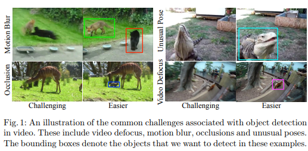
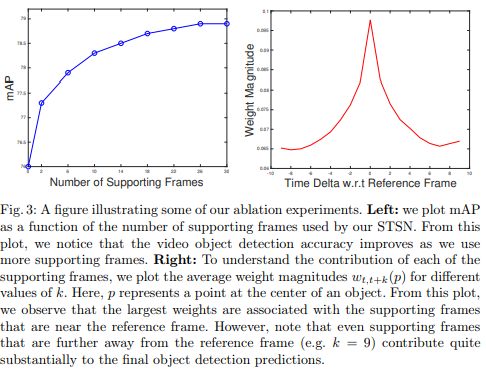
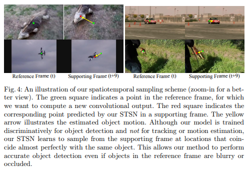
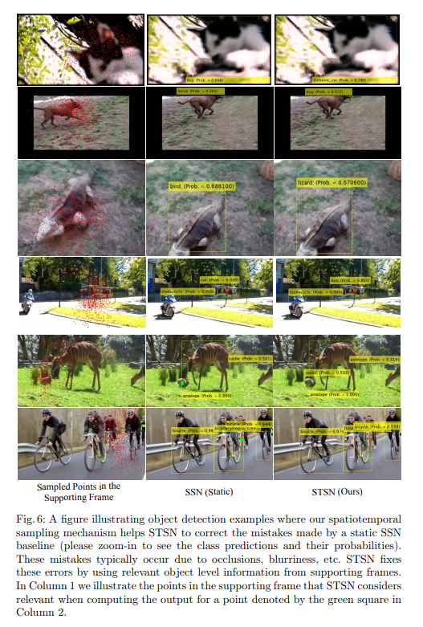

# Object Detection in Video with Spatiotemporal Sampling Networks \[Eng]

한국어로 쓰인 리뷰를 읽으려면 [**여기**](ECCV-2018-STSN-kor.md)를 누르세요.

1. ##  1. Problem definition

   In this paper, the study deals with the object detection method using video. In recent years, deep convolutional networks have made great strides in the field of detecting objects in images. However, in the field of video, there were many difficulties in detecting an object due to motion blur, out of focus of the video image, deformation of the object's shape, or being obscured by something.

   However, video information can be used more powerfully than detecting objects in images because there is a lot of information that is basically missing from image information. In order to detect objects in video information, it is important to design a model that can effectively utilize the time-varying information contained in the video.

   In previous studies, we used a method to make object detections coherent across time and utilize this temporal information in the video, but this method did not allow End-to-End Learning to process with one neural network. A recent study introduced a flow-based aggregation network to enable End-to-End Learning, which utilizes Optical Flow to find temporal correspondences and then aggregates features over temporal correspondences to detect objects in adjacent frames. But It also has the disadvantage of having to predict motion in addition to performing object detection.

   The disadvantages that may be encountered in designing the models revealed through these prior studies are summarized below.

   1. Designing an effective network architecture is not that simple.
   2. Training a model requires a large amount of flow data, which can be difficult and expensive to obtain.
   3. Modeling a Flow network and a Detection network respectively can entail difficult tasks such as different loss functions, different training procedures for different networks, etc.

   

   ## 2. Motivation

   ### Related work

   #### 2.1 Object Detection in Images

   Object detection using images has been mainly developed utilizing deep CNNs.

   * One of the first deep CNN object detection systems included a two-stage pipeline that first extracts objects with R-CNN and then uses CNN to classify each object. To reduce the computational burden, other studies have utilized ROI pooling to induce more efficient learning. In addition, in order to integrate the object detection pipeline, Faster R-CNN study replaced the various domain proposal methods with other networks so that the whole system can be end-to-end learning.

   * In another study, we conducted a study that allowed Faster R-CNN to run in real-time with a slight decrease in performance. In addition, a recent study introduced position-sensing ROI pooling, which significantly improved the detection efficiency compared to previous object detection systems.

   * Finally, two recent methods, Mask R-CNN and Deformable CNN, have further improved the object detection results and show the latest performance in the field of object detection. Mask-RCNN uses additional branches to predict a mask for each region of interest, whereas Deformable CNN uses deformable convolutions to allow the network to differentially adjust the receptive field for its input and more robustly model the deformation of the object.

     

     

   #### 2.2  Object Detection in Videos

   There were no large-scale benchmarks for video object detection until the ImageNet VID challenge was introduced. Therefore, there have been few previous studies comparable to STSN.

   * T-CNN[1, 2] uses a video object detection pipeline that involves first estimating the Optical Flow, then propagating image-level predictions along with the flow, and finally using a tracking algorithm to select temporally consistent high-confidence detections.

   * Seq-NMS[3] constructs a temporal graph from overlapping bounding box detections over adjacent frames and then uses dynamic programming to select the bounding box sequence with the highest overall detection score. The method proposed by Lee treats the video object detection task as a multi-object tracking problem.

   * Finally, the method proposed by Feichtenhofer[4] proposes a ConvNet architecture that jointly solves the detection and tracking problem and then applies the Viterbi algorithm to link the detections over time.

   The approach most similar to our work is Zhu's research[5]. Zhu's work proposed an end-to-end learning network that jointly estimates Optical Flow and also detects objects in video. This is done by using predicted optical flow to align features in adjacent frames. The aggregated function serves as input to the detection network.

   

   ### Idea

   In this paper, we introduce a simple but effective Spatiotemporal Sampling Network (STSN) that utilizes temporal information for object detection in video using convolutions that are deformable across space and time. STSN learns to spatially sample useful feature points from surrounding video frames to maximize object detection accuracy in a given video frame. To do this, we conduct STSN End to End learning on a large set of video frames labeled with bounding boxes. It was shown that this leads to better accuracy compared to the state-of-the-art when compared to the ImageNet VID dataset without complex Flow network design or training on large amounts of Flow data.

   STSN has the following advantages over methods using Optical Flow CNNs such as the one proposed by Zhu.

   1) Pre-trained Optical Flow CNNs do not always generalize to new data sets, which can interfere with video object detection performance. In contrast, STSN does not suffer from this problem as it has a learnable spatiotemporal sampling module and learns by discriminating object detection labels.

   2. STSN is capable of end-to-end learning processing with one neural network for video object detection. In comparison, methods that rely on Optical Flow require additional steps to train the Optical Flow CNN, making the training procedure more complex and lengthy.

   

   ## 3. Method

   Network architecture for STSN was designed that integrates temporal information to detect objects in videos. In this model, object information from the adjacent frame $I_{t+k}$ in the reference frame $I_t$ at the video reference time t is used for detection, so that the object can be detected more efficiently.
$$
{I_{t-K}, I_{t-(K-1)}, . . . , I_{t−1}, I_{t+1}, . . . , I_{t+(K−1)}, I_{t+K}}
$$

As shown in Figure 1, if an frame contains an object in an unusual pose or there is occlusion, and if a frame adjacent to that image frame contains the same object that is relatively clearly visible and a relatively standard pose, an adjacent frame can be utilized as information from nearby frames for detection. In this paper, to improve object detection, we use a 2K support frame that can refer to K preceding frames and K subsequent frames.

   The processing steps of the STSN network architecture can be summarized into four steps.

   1. **Backbone Architecture.** The backbone convolutional network computes object-level features for each video frame individually.

   2. **Spatiotemporal Feature Sampling. **The spatiotemporal sampling mechanism is responsible for seamlessly integrating temporal information in a given video. This sampling mechanism is implemented using 4 deformable convolutional layers that take the prediction offset, the supporting tensor as input, and output the newly sampled feature tensor. A detailed illustration is presented in Figure 2. (Only 2 are shown in Figure 2)

   3. **Feature Aggregation.** Features sampled from each video frame are aggregated temporally into a single feature tensor for the reference frame using per-pixel weighted summation.

   4. **Object Detection. **Feature tensors are provided as input to the detection network to produce final object detection results for a given frame of reference.

   Our framework for Object Detection provides end-to-end learning by integrating these four conceptually distinct steps into a single architecture.

​    

   #### 3.1 Implementation Details

   In this study, MXNet library was used to implement the architecture. Below we provide details regarding the STSN architecture, training, and inference procedures.

   * **Architecture.** For backbone network, we adopted Deformable CNN based on ResNet-101 architecture. The spatiotemporal sampling block consists of four 3 × 3 transformable convolutional layers, each with 1024 output channels. There are also 4 3x3 convolutional layers that predict (x,y) offsets. To implement a subnetwork S(x) that predicts feature aggregate weights, we use 1 × 1, 3 × 3, and 1 × 1 convolutional layer sequences with 512, 512, and 2048 output channels, respectively. The detection network is implemented based on a deformable R-FCN design, using pooling of deformable position detection ROIs into 7 × 7 groups.

   * **Training.** STSN can be completely differentiated and allowing end-to-end learning, because the STSN model used a Deformable CNN model based on the ResNet-101 architecture as the backbone network. For training, randomly sample one support frame before the reference frame and one support frame after the reference frame. We observed that using more support frames in Training did not lead to higher accuracy. The rest of the training trains the model in two steps. First, we pre-train the full model on the Imagenet DET dataset using annotations from 30 object classes overlapping the Imagenet VID dataset. Since the Imagenet DET dataset contains only images, we cannot sample meaningful support frames in this case. So for images, we use the reference frame as the supporting frame. The full model is then trained 120,000 iterations on 4 Tesla K40 GPUs, each with a single mini-batch. The learning rate is set to 0.001 and 0.0001 for the first 80K and last 40K iterations, respectively. We then fine-tune the entire model on the Imagenet VID dataset for 60K iterations with learning rates of 0.001 and 0.0001 for the first 40K and last 20K iterations, respectively. In the second step of training, we randomly sample the support frame within a specific neighborhood of the reference frame.

   * **Inference.** T = 27 was used during inference. That is, we consider K = 13 support frames before and after reference frames. To avoid GPU memory issues, we first individually extract features from each image's backbone network and then cache these features in memory. Then we put all these functions into a spatiotemporal sampling block. Finally, standard NMS with a threshold of 0.3 is applied to refine the detection. Pad the start of the video with K copies of the first frame to handle the two boundary cases where adjacent frames need to be sampled beyond the start and end of the video to process the first and last K = 13 frames of the video.

   

   ## 4. Experiment & Result

   ### Experimental setup

   The experiment evaluated the performance for video object detection with the ImageNet VID dataset with 3,862 and 555 training and test video clips. Each video is displayed with a Bounding Box, and each video's frames are extracted at 25 - 30 fps. The dataset contains 30 object categories, a subset of the 200 categories in the ImageNet DET dataset.

   ### Result

   #### Quantitative Results

   To evaluate the effectiveness of STSN, we compared performance with two modern methods, FGFA and D&T. For effective comparison, we applied a model for prediction using only reference frames (SSN) and spatiotemporal sampling mechanism to each architecture, and temporal post-processing was applied to the output for video object detection comparison. In Table 1, D&T and STSN show the case of using CNN output, while D&T+ and STSN+ show the case of applying temporal post-processing (Seq NMS, object-tube linking, etc.) to the CNN output.

   And we present the results in Table 1, which evaluates each method according to several criteria.

   * The first row of Table 1 lists whether a given method should incorporate a separate flow network into the Training/Prediction pipeline. Ideally, it would be advantageous to eliminate this step as we would have to design a very complex flow network architecture for optical flow prediction.
   * Also lists whether pre-training for external Optical Flow data is required. This forces more computation to the entire training pipeline.

   * Lists whether a given method uses an external temporal post-processing step. It is advantageous to remove these steps as they usually make the Training/Prediction pipeline more complex.

   * Evaluate each method against standard average mean precision (mAP) metrics at an intersection over union (IoU) threshold of 0.5.

   Based on the results in Table 1, the following conclusions can be drawn.

   * STSN showed better quantitative results than the latest FGFA method (78.9 vs 78.8). Although the improvement in accuracy is not numerically significantly higher compared to FGFA, we confirmed that, unlike FGFA, STSN outperformed FGFA by learning temporal correspondence without direct light flow supervision. These results demonstrate the benefits of end-to-end learning in video object detection.

   * For D&T, STSN shows that STSN outperforms D&T baseline significantly in settings where temporal post-processing (eg Seq-NMS, object-tube linking, etc.) is not used. (78.9 vs 75.8). These results indicate that STSNs can learn robust spatiotemporal features and produce robust video object detection results without the need for temporal post-processing algorithms that link bounding box detection over time.
   * We also show that incorporating the temporal post-processing algorithm Seq-NMS further improves the results of STSN. This approach allows it to outperform D&T+, which uses a similar Viterbi-based ad hoc post-processing approach. (80.4 vs 79.8)

   

   #### Ablation Studies

   **Optimal Number of Supporting Frames**. The graph on the left in Figure 3 shows how the number of supported frames affects video object detection accuracy. Adding support frames keeps improving performance and stagnates at T=27.

   **Increasing the Temporal Stride**. We investigated how the time stride k sampling the support frame affects the performance of the STSN. We found that temporal strides of k = 2 and k = 4 yielded mAP scores of 79.0 and 77.9, respectively. Therefore, at k = 2, the result was slightly improved over the original 78.9 mAP score. However, the accuracy tends to decrease as k is increased to larger values.

   **Feature Aggregation Weight Analysis**. To analyze how much each support frame contributes to the final object detection, we visualized the average weight magnitude $w_{t,t+k}(p)$ for various k values. This is shown in the graph on the right in Figure 3. In this case, the weight magnitude corresponds to the point p at the center of the object. From this, it can be concluded that the greatest influence on the final object detection prediction comes from the support frame close to the reference frame (k = −1, 0, 1). However, even supporting frames further away from the reference frame (eg k = -9, 9) have non-zero weights and significantly affect the final object detection prediction.

   

   #### Qualitative Results

   To understand how STSN utilizes the temporal information of a given video, we visualized the mean offset predicted by the STSN sampling block in Figure 4. These offsets are used by the STSN to determine the object level information in the supporting frame that should be used to detect objects in the reference frame. The green squares in the reference frame indicate the pixels for which you want to compute the convolutional output. The red squares in the support frame represent the average offset, which is used to determine which feature points in the support frame should be sampled. The yellow arrow indicates the movement of the object between the reference frame and the supporting frame. Despite the relatively large movement between the reference frame and the support frame, STSN samples features from the support frame around the center of the object exactly where we want it to be. This spatiotemporal sampling allows objects to be detected even if they appear to be obscured or occluded in the frame of reference.

   Also, based on the results in Figure 4, we can observe that the STSN learns how to accurately capture the motion of an object without explicit optical flow supervision.

   Figure 5 shows some examples of using STSN to track objects in a given video. In Figure 5, we observed that the STSN accurately samples features around the object in all supporting frames, despite the relatively large motion in each sequence.

   Figure 6 also shows the object detection of the static SSN baseline and the object detection of the full STSN model. In all of these cases, incorporating time information helps the STSN correct mistakes made in the static baseline. For example, in the third row of Figure 6, the static SSN baseline incorrectly assigns a new object in the reference frame. This is caused by the lizard's head being obscured. However, STSN corrects this mistake by looking at the support frame and sampling around the gecko body and head (see row 3, column 1 of Figure 6). Similar results occur for Occlusion and Motion Blur.

   

   ## 5. Conclusion

   In this paper, we proposed a new architecture for object detection using video information, Spatiotemporal Sampling Network (STSN). The contribution of this study is to:

   * Simplified model design with convolutions that can be deformed over space and time.

   * Training data according to Optical Flow is not required.

   * Higher video object detection performance compared to previous studies.

   In conclusion, as a result of this study, it is easier to do end-to-end learning of object detection models using video information. Future work will involve experimenting with more complex spatiotemporal sampling blocks.

   

   ### Take home message \(오늘의 교훈\)

   > In general, object detection using video information has many limitations and requires complex steps such as optical flow analysis when designing a model.
   >
   > By utilizing convolutions that are deformable across space and time, we can get better-performing models for end-to-end learning while overcoming constraints.

   

   ## Author / Reviewer information

   ### Author

   **Han Jungmin (한정민)**

   * Affiliation: Ph.D. student, Robotics Program, KAIST (Advisor: Dong-Soo Kwon)
   * Research Interest: Flexible Endoscopic Surgery Robot System, Surgical Navigation
   * Contact information 
     * Personal E-mail: hanjungmin@kaist.ac.kr
     * Related Website Link
       * Telerobotics and Control Laboratory, KAIST: http://robot.kaist.ac.kr/
       * EasyEndo Surgical Inc.: https://www.easyendosurgical.com/

   ### Reviewer

   1. Korean name \(English name\): Affiliation / Contact information
   2. Korean name \(English name\): Affiliation / Contact information
   3. ...

## Reference & Additional materials

1. Citation of this paper
   1. Bertasius, Gedas, Lorenzo Torresani, and Jianbo Shi. "Object detection in video with spatiotemporal sampling networks." *Proceedings of the European Conference on Computer Vision (ECCV)*. 2018.
2. Official \(unofficial\) GitHub repository
   1. None
3. Citation of related work
   1. Kang, K., Li, H., Yan, J., Zeng, X., Yang, B., Xiao, T., Zhang, C., Wang, Z., Wang, R., Wang, X., Ouyang, W.: T-CNN: tubelets with convolutional neural networks for object detection from videos. IEEE TCSVT 2017 (2017)
   2. Kang, K., Ouyang, W., Li, H., Wang, X.: Object detection from video tubelets with convolutional neural networks. CoRR abs/1604.04053 (2016)
   3. Han, W., Khorrami, P., Paine, T.L., Ramachandran, P., Babaeizadeh, M., Shi, H., Li, J., Yan, S., Huang, T.S.: Seq-nms for video object detection. CoRR abs/1602.08465 (2016)
   4. Feichtenhofer, C., Pinz, A., Zisserman, A.: Detect to track and track to detect. In: International Conference on Computer Vision (ICCV). (2017)
   5. Zhu, X., Wang, Y., Dai, J., Yuan, L., Wei, Y.: Flow-guided feature aggregation for video object detection. In: International Conference on Computer Vision (ICCV). (2017)
4. Other useful materials
   1. Presentation Video Clip: https://www.youtube.com/watch?v=EZg3LT1OSi4
   2. Author Information (Gedas Bertasius) : https://scholar.google.co.kr/citations?hl=ko&user=8FWkjw8AAAAJ&view_op=list_works&sortby=pubdate
