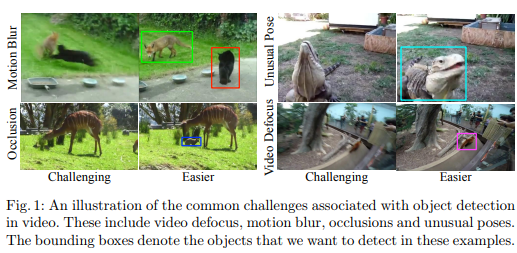
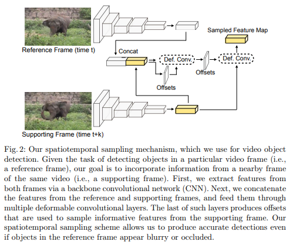
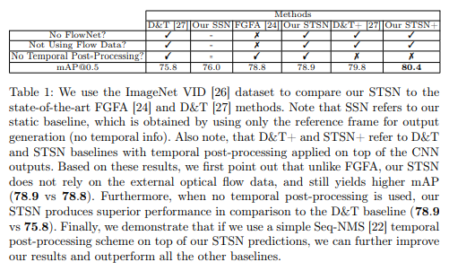
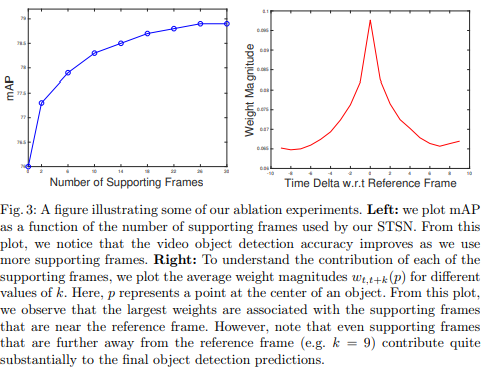
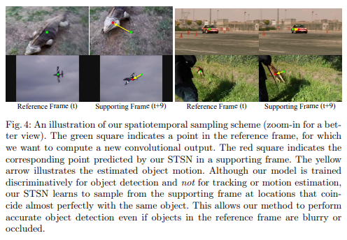
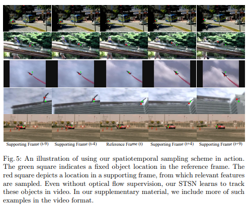
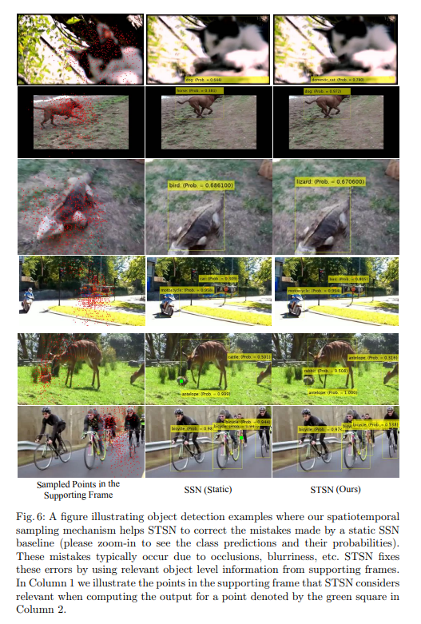

# Object Detection in Video with Spatiotemporal Sampling Networks \[Kor]

[**English version**](ECCV-2018-STSN-eng.md) of this article is available.

##  1. Problem definition

본 논문의 연구에서는 비디오를 이용한 물체 감지 방법에 대해서 다룹니다. 최근 몇 년 동안 딥 컨볼루션 네트워크는 이미지에서 객체를 감지하는 분야에서는 많은 발전을 이루어 왔습니다. 하지만 비디오를 이용한 분야에서는 모션 블러가 발생하거나, 비디오 영상의 포커스가 맞지 않거나, 물체의 형상에 변형이 있거나, 어딘가에 의해 가려지게 되는 상황 때문에 객체를 감지하는 데 많은 어려움을 가지고 있었습니다. 

하지만 비디오 정보는 기본적으로 이미지 정보에는 없는 많은 정보가 있기 때문에 이미지에서 객체를 감지하는 것보다 더 강력하게 활용될 수 있습니다. 비디오 정보 내 객체를 감지하기 위해서는 비디오에 포함되어 있는 시간에 따라 변화되는 정보를 효과적으로 활용할 수 있는 모델을 설계하는 것이 중요합니다.

이전 연구에서는 시간에 따라 일관된 객체 탐지를 하는 단계를 만들고 비디오에서 이러한 시간 정보를 활용하는 방법을 사용 하였으나, 이러한 방법은 하나의 신경망으로 처리하는 End to End Learning이 불가능 했습니다. 최근 연구에서는 End to End Learning이 가능하도록 flow-based aggregation 네트워크를 도입했는데, 이 방법은 Optical Flow을 활용하여 시간에 따른 대응 관계를 찾은 다음 시간 대응 관계에 걸쳐 특징을 집계하여 인접 프레임에서의 객체 감지를 가능하게 하지만 물체 감지를 수행하는 것 외에도 움직임을 예측해야 한다는 단점이 있습니다. 

이러한 사전 연구들을 통해 밝혀진 모델을 설계하는데 있어 맞닥뜨릴 수 있는 불리한 상황을 정리해보면 다음과 같습니다.

1. 효과적인 네트워크 아키텍처를 설계하는 것이 그렇게 간단하지 않습니다. 
2. 모델을 Training하는 데 많은 양의 Flow Data가 필요하며, 얻기도 어렵고 비용이 많이 들 수 있습니다. 
3. Flow 네트워크 및 Detection 네트워크를 각각 모델로 만드는 것은 서로 다른 손실 함수, 네트워크마다 다른 Training 절차 등과 같은 어려운 작업을 수반할 수 있습니다.

## 2. Motivation

### Related work

#### 2.1 이미지를 이용한 Object Detection

이미지를 이용한 객체 감지는 주로 심층 CNN을 활용하여 개발되었습니다.

* 최초의 심층 CNN 객체 감지 시스템 중 하나는 R-CNN으로 먼저 객체를 추출한 다음 CNN을 사용하여 각 객체를 분류하는 2단계 파이프라인을 포함했습니다. 계산 부담을 줄이기 위해 다른 연구에서는 ROI 풀링을 활용하여 보다 효율적인 학습을 유도했습니다. 또한, 객체 감지 파이프라인을 통합하기 위해 Faster R-CNN 연구에서는 전체 시스템이 End to End 학습이 가능하도록 다양한 영역 제안 방법을 다른 네트워크로 대체했습니다.

* 이어진 또 다른 연구에서는 Faster R-CNN을 성능은 약간 감소하지만 실시간으로 실행될 수 있도록 하는 연구를 진행 했습니다. 또한 최근 연구에서 위치 감지 ROI 풀링을 도입하여 이전의 물체 감지 시스템에 비해 감지 효율성을 크게 향상시켰습니다. 

* 마지막으로 최근 두 가지 방법인 Mask R-CNN과 Deformable CNN은 객체 감지 결과를 더욱 개선했으며 객체 감지 분야에서의 최신의 성능을 보여주고 있습니다. Mask-RCNN은 각 관심 영역에 대한 마스크를 예측하는 추가 분기를 사용하는 반면 Deformable CNN은 변형 가능한 컨볼루션을 사용하여 네트워크가 입력에 대한 수용 필드를 차별적으로 조절하고 객체의 변형을 보다 강력하게 모델링할 수 있습니다. 

#### 2.2  비디오를 이용한 Object Detection

ImageNet VID 챌린지가 도입될 때까지 비디오 객체 감지에 대한 대규모 벤치마크가 없었습니다. 따라서 STSN과 비교할 수 있는 이전 연구는 거의 없었습니다. 

* T-CNN[1, 2]은 먼저 Optical Flow을 예측한 다음 흐름에 따라 이미지 레벨 예측을 전파하고 마지막으로 추적 알고리즘을 사용하여 시간적으로 일관된 높은 신뢰도 탐지를 선택하는 것과 관련된 비디오 객체 탐지 파이프라인을 사용합니다. 

* Seq-NMS[3]는 인접한 프레임에 걸쳐 경계 상자 감지 중첩에서 시간 그래프를 구성한 다음 동적 프로그래밍을 사용하여 전체 감지 점수가 가장 높은 경계 상자 시퀀스를 선택합니다. Lee가 제안한 방법은 비디오 객체 감지 작업을 다중 객체 추적 문제로 취급합니다. 

* 마지막으로 Feichtenhofer가 제안한 방법[4]은 탐지 및 추적 문제를 공동으로 해결한 다음 Viterbi 알고리즘을 적용하여 시간에 따라 탐지를 연결하는 ConvNet 아키텍처를 제안합니다. 

우리 작업과 가장 유사한 접근 방식은 Zhu[5]의 연구입니다. Zhu의 연구에서는 Optical Flow를 공동으로 추정하고 비디오에서 물체도 감지하는 End to End learning 네트워크를 제안했습니다. 이는 예측된 Optical Flow을 사용하여 인접 프레임의 기능을 정렬함으로써 수행됩니다. 집계된 기능은 탐지 네트워크에 대한 입력으로 제공됩니다.

### Idea

 본 논문에서는 공간과 시간에 걸쳐 변형 가능한 컨볼루션을 사용하여 비디오에서 물체 감지를 위한 시간 정보를 활용하는 간단하지만 효과적인 STSN(Spatiotemporal Sampling Network)을 소개합니다. STSN은 주어진 비디오 프레임에서 객체 감지 정확도가 최대화되도록 주변 비디오 프레임에서 유용한 특징점을 공간적으로 샘플링하는 방법을 학습합니다. 이를 위해 우리는  bounding box로 레이블이 지정된 대규모 비디오 프레임 세트에 대해 STSN End to End learning을 실시합니다. 이를 통해 복잡한 Flow 네트워크 설계나 대량의 Flow 데이터에 대한 Training 없이 ImageNet VID 데이터 세트로 비교했을 때 최신 기술에 비해 더 나은 정확도로 이어진다는 것을 보였습니다.

STSN은 Zhu가 제안한 방법과 같은 Optical Flow CNN을 사용하는 방법보다 다음과 같이 유리합니다. 

1) 사전 Training된 Optical Flow CNN이 항상 새로운 데이터 세트로 일반화되는 것은 아니므로 비디오 객체 감지 성능을 방해할 수 있습니다. 이에 반해 STSN은 학습 가능한 시공간 샘플링 모듈을 가지고 있어 물체 감지 레이블을 구별하여 학습하므로 이 문제를 겪지 않습니다. 

2. STSN은 비디오 개체 감지를 위해 하나의 신경망으로 처리하는 End to End Learning을 할 수 있습니다. 이에 비해 Optical Flow에 의존하는 방법은 Optical Flow CNN을 Training하기 위해 추가 단계가 필요하므로 Training 절차가 더 복잡하고 길어집니다. 

## 3. Method

STSN에서 비디오에서 물체를 감지하기 위해 시간 정보를 통합하는 네트워크 아키텍처가 설계 되었습니다. 이 모델에서는 비디오 기준 시간 t에서의 기준 프레임 $I_t$에서 인근 프레임 $I_{t+k}$의 객체 정보를 감지에 활용함으로써 더 효율적으로 객체를 탐지할 수 있도록 하였습니다. 
$$
{I_{t-K}, I_{t-(K-1)}, . . . , I_{t−1}, I_{t+1}, . . . , I_{t+(K−1)}, I_{t+K}}
$$

그림 1과 같이 이미지에 비정상적인 포즈의 개체가 포함되어 있거나  Occlusion이 있는 경우, 해당 이미지 프레임과 시간상으로 인접해있는 프레임에 비교적 명확하게 보이는 동일한 개체가 비교적 표준적인 포즈로 포함되어 있다면, 개체를 더 잘 감지할 수 있도록 가까운 프레임의 정보를 활용할 수 있습니다. 본 논문에서는 객체 감지를 향상시키기 위해 K개의 선행 프레임과 K개의 후속 프레임을 참조 할수 있는 2K 지원 프레임을 사용합니다. 

STSN 네트워크 아키텍처의 프로세싱 단계는 크게 4단계로 요약할 수 있습니다.

1. **Backbone Architecture.** 백본 컨볼루션 네트워크는 각 비디오 프레임에 대한 객체 수준 기능을 개별적으로 계산합니다. 

2. **Spatiotemporal Feature Sampling.** 시공간 샘플링 메커니즘은 주어진 비디오에서 시간 정보를 매끄럽게 통합하는 역할을 합니다. 이 샘플링 메커니즘은 Predicted Offsets, Supporting Tensor를 입력으로 사용하고 새로 샘플링된 피쳐 텐서를 출력하는 변형 가능한 4개의 컨볼루션 레이어를 사용하여 구현됩니다. 자세한 설명은 그림 2에 나와 있습니다. (그림 2에는 2개만 표시됨)

3. **Feature Aggregation.** 각 비디오 프레임에서 샘플링된 특징은 픽셀당 가중치 합산을 사용하여 참조 프레임에 대한 단일 특징 텐서로 시간적으로 집계됩니다. 

4. **Object Detection.**특징 텐서는 주어진 참조 프레임에 대한 최종 객체 탐지 결과를 생성하기 위해 탐지 네트워크에 대한 입력으로 제공됩니다. 

우리의 Object Detection 을 위한 프레임워크는 개념적으로 구별되는 이러한 4단계를 단일 아키텍처로 통합하여 End to End learning을 제공합니다.

 

#### 3.1 Implementation Details

아키텍쳐 구현을 위해 MXNet 라이브러리를 사용했습니다. 아래에서는 STSN 아키텍처, Training 및 추론 절차와 관련된 세부 정보를 제공합니다.

* **Architecture.** 백본 네트워크의 경우 ResNet-101 아키텍처를 기반으로 하는 Deformable CNN을 채택했습니다. 시공간 샘플링 블록은 각각 1024개의 출력 채널을 가진 4개의 3 × 3 변형 가능한 컨볼루션 레이어로 구성됩니다. 또한 (x, y) 오프셋을 예측하는 4개의 3x3 컨볼루션 레이어도 있습니다. 특성 집계 가중치를 예측하는 서브네트워크 S(x)를 구현하기 위해 각각 512, 512 및 2048개의 출력 채널이 있는 1 × 1, 3 × 3 및 1 × 1 컨볼루션 레이어 시퀀스를 사용합니다. Detection 네트워크는 변형 가능한 R-FCN 설계를 기반으로 구현되며, 7 × 7 그룹으로 변형 가능한 위치 감지 ROI 풀링을 사용합니다.

* **Training.** STSN 모델은 백본 네트워크로 ResNet-101 아키텍처를 기반으로 하는 Deformable CNN 모델을 사용하였기 때문에 완전히 미분될 수 있으므로 End to End learning이 가능합니다. Training을 위해 기준 프레임 이전에 하나의 지원 프레임과 참조 프레임 이후에 하나의 지원 프레임을 무작위로 샘플링합니다. 우리는 Training에서 더 많은 지원 프레임을 사용한다고 해서 더 높은 정확도로 이어지지 않는다는 것을 관찰했습니다. 나머지 Training 에서는 두 단계로 모델을 Training합니다. 먼저 Imagenet VID 데이터 세트와 겹치는 30개 객체 클래스의 주석을 사용하여 Imagenet DET 데이터 세트에 대한 전체 모델을 사전 학습합니다. Imagenet DET 데이터 세트에는 이미지만 포함되어 있으므로 이 경우 의미 있는 지원 프레임을 샘플링할 수 없습니다. 따라서 이미지의 경우 참조 프레임을 지원 프레임으로 사용합니다. 그 후 전체 모델은 4개의 Tesla K40 GPU에서 120,000번 반복 학습되며 각 GPU는 단일 미니 배치를 보유합니다. 학습률은 처음 80K 및 마지막 40K 반복에 대해 각각 0.001 및 0.0001로 설정됩니다. 그런 다음 처음 40K 및 마지막 20K 반복에 대해 각각 0.001 및 0.0001의 학습률로 60K 반복에 대해 Imagenet VID 데이터 세트의 전체 모델을 미세 조정합니다. Training의 두 번째 단계에서 우리는 참조 프레임의 특정 이웃 내에서 지원 프레임을 무작위로 샘플링합니다

* **Inference.** 추론하는 동안 T = 27을 사용합니다. 즉, 참조 프레임 전후에 K = 13개의 지원 프레임을 고려합니다. GPU 메모리 문제를 피하기 위해 먼저 각 이미지의 백본 네트워크에서 기능을 개별적으로 추출한 다음 이러한 기능을 메모리에 캐시합니다. 그런 다음 이 모든 기능을 시공간 샘플링 블록에 입력합니다. 마지막으로 임계값이 0.3인 표준 NMS를 적용하여 탐지를 세분화합니다. 비디오의 첫 번째 및 마지막 K = 13개 프레임을 처리하기 위해 비디오 시작과 끝을 넘어 인접 프레임을 샘플링해야 하는 두 가지 경계 경우를 처리하기 위해 비디오의 시작을 첫 번째 프레임의 K 복사본으로 채웁니다. 

## 4. Experiment & Result

### Experimental setup

실험에는 3,862 및 555개의 교육 및 테스트 비디오 클립이 있는 ImageNet VID 데이터 세트를 가지고 비디오 객체 감지에 대한 성능을 평가하였습니다. 각 비디오에는 Bounding Box가 표시되며, 각 비디오의 프레임은 25 - 30fps로 추출됩니다. 데이터 세트에는 ImageNet DET 데이터 세트에 있는 200개 범주의 하위 집합인 30개 개체 범주가 포함되어 있습니다.

### Result

#### Quantitative Results

STSN의 효과를 평가하기 위해 우리는 두 가지 최신 방법인 FGFA와 D&T와 성능 비교하였습니다. 효과적인 비교를 위해 각 아키텍처에 참조 프레임만 사용하여 예측하는 모델(SSN)과 시공간 샘플 메커니즘을 적용했고, 비디오 객체 감지 비교를 위해 시간적 후처리가 출력에 적용되었습니다. 표 1에서 D&T 및 STSN은 CNN 출력을 사용한 경우를 나타내는 반면 D&T+ 및 STSN+는 시간적 후처리(Seq NMS,  object-tube linking 등)를 CNN 출력에 적용한 경우를 나타냅니다. 

그리고 우리는 몇 가지 기준에 따라 각 방법을 평가하는 표 1에 결과를 제시 하였습니다. 

* 표 1의 첫 번째 행에는 주어진 방법이 별도의 흐름 네트워크를 Training/Prediction 파이프라인에 통합해야 하는지 여부를 나열합니다. 이상적으로는 Optical Flow 예측을 위해 매우 복잡한 흐름 네트워크 아키텍처를 설계해야 하기 때문에 이 단계를 제거하는 것이 유리합니다. 

* 외부 Optical Flow 데이터에 대한 Pre-training이 필요한지 여부도 나열합니다. 이는 전체 Training 파이프라인에 더 많은 연산을 하도록 만듭니다. 

* 주어진 방법이 외부 시간 사후 처리 단계를 사용하는지 여부를 나열합니다. 이러한 단계는 일반적으로 Training/Prediction 파이프라인을 더 복잡하게 만들기 때문에 제거하는 것이 유리합니다. 

* IoU(Intersection Over Union) 임계값 0.5에서 표준 mAP(평균 평균 정밀도) 메트릭에 따라 각 방법을 평가합니다.

표 1의 결과를 바탕으로 다음과 같은 결론을 내릴 수 있습니다. 

* STSN이 최신 FGFA 방법(78.9 대 78.8)보다 더 나은 정량적 결과를 보였습니다. FGFA와 비교하여 정확도 향상이 수치적으로 크게 높지는 않으나, FGFA와 달리 STSN이 직접적인 Optical Flow Supervision 없이 시간적 대응을 학습하여 FGFA를 능가한점을 확인했습니다. 이러한 결과는 비디오 Object Detection에서의 End to End learning의 이점을 보여줍니다.

* STSN을 D&T의 경우에는 시간적 후처리(예: Seq-NMS, object-tube linking 등)가 사용되지 않는 설정에서 STSN이 D&T 기준선보다 상당한 성능을 발휘함을 보여줍니다. (78.9 대 75.8). 이러한 결과는 STSN이 강력한 시공간 기능을 학습할 수 있고 시간 경과에 따라 경계 상자 감지를 연결하는 시간적 후처리 알고리즘 없이도 견고한 비디오 객체 감지 결과를 생성할 수 있음을 나타냅니다. 
* 또한 시간적 후처리 알고리즘 Seq-NMS 를 통합하면 STSN의 결과가 더욱 향상됨을 보여줍니다. 이러한 방식을 통해 유사한 Viterbi 기반 임시 후처리 방식을 사용하는 D&T+를 능가할 수 있습니다. (80.4 대 79.8)

 #### Ablation Studies

**Optimal Number of Supporting Frames**. 그림 3의 왼쪽 그래프는 지원 프레임 수가 비디오 객체 감지 정확도에 어떤 영향을 미치는지 보여줍니다. 지원 프레임을 추가하면 성능이 계속 향상되고 T = 27에서 정체됩니다. 

**Increasing the Temporal Stride**. 지원 프레임을 샘플링하는 시간 보폭 k가 STSN의 성능에 어떤 영향을 미치는지 조사 하였습니다. 우리는 k = 2 및 k = 4의 시간적 보폭이 각각 79.0 및 77.9의 mAP 점수를 산출하는 것을 확인하였습니다. 따라서 k = 2에서는 원래의 78.9mAP 점수보다 약간 향상된 결과를 보였습니다. 그러나 k를 더 큰 값으로 증가시키면 정확도가 감소하는 경향을 보였습니다. 

**Feature Aggregation Weight Analysis**. 각 지지 프레임이 최종 물체 감지에 얼마나 기여하는지 분석하기 위해 다양한 k 값에 대한 평균 무게 크기 $w_{t,t+k}(p)$를 시각화하였습니다. 이는 그림 3의 오른쪽 그래프에 나와 있습니다. 이 경우 가중치 크기는 개체의 중심에 있는 점 p에 해당합니다. 이를 통해 최종 객체 감지 예측에 가장 큰 영향은 기준 프레임(k = −1, 0, 1)에 가까운 지원 프레임에서 비롯된다는 결론을 내릴 수 있습니다. 그러나 참조 프레임에서 더 멀리 떨어져 있는 지원 프레임(예: k = -9, 9)조차도 0이 아닌 가중치를 가지며 최종 객체 감지 예측에 상당히 영향을 줍니다.

#### Qualitative Results

STSN이 주어진 비디오의 시간 정보를 어떻게 활용하는지 이해하기 위해 그림 4에서 STSN 샘플링 블록에 의해 예측된 평균 오프셋을 시각화 하였습니다. 이러한 오프셋은 STSN이 참조 프레임에서 개체를 감지하는 데 사용되어야 하는 지원 프레임의 개체 수준 정보를 결정하는 데 사용됩니다. 참조 프레임의 녹색 사각형은 합성곱 출력을 계산하려는 픽셀을 나타냅니다. 지지 프레임의 빨간색 사각형은 평균 오프셋을 나타내며, 이는 지지 프레임에서 샘플링해야 하는 특징점을 결정하는 데 사용됩니다. 노란색 화살표는 기준 좌표계와 지지 좌표계 사이의 물체의 움직임을 나타냅니다. 참조 프레임과 지원 프레임 사이의 상대적으로 큰 움직임에도 불구하고 STSN은 정확히 우리가 원하는 객체 중심 주변의 지원 프레임에서 특징을 샘플링합니다. 이러한 시공간 샘플링을 통해 객체가 참조 프레임에서 흐리거나 가려진 것처럼 보이더라도 객체를 감지할 수 있습니다.

또한 그림 4의 결과를 기반으로 명시적 Optical Flow 감독 없이도 STSN이 객체의 움직임을 정확하게 캡처하는 방법을 학습하는 것을 관찰할 수 있습니다.  

그림 5에서는 STSN을 사용하여 주어진 비디오에서 개체를 추적하는 몇 가지 예를 보여줍니다. 그림 5에서 우리는 각 시퀀스에서 상대적으로 큰 움직임에도 불구하고 STSN이 모든 지원 프레임에서 객체 주변의 특징을 정확하게 샘플링한다는 것을 관찰했습니다. 

그림 6에서는 정적 SSN 기준선의 개체 탐지와 전체 STSN 모델의 개체 탐지도 보여줍니다. 이 모든 경우에 시간 정보를 통합하면 STSN이 정적 기준선에서 발생한 실수를 수정하는 데 도움이 됩니다. 예를 들어, 그림 6의 세 번째 행에서 정적 SSN 기준선은 참조 프레임의 개체를 새로 잘못 지정합니다. 이는 도마뱀의 머리가 가려져 발생합니다. 그러나 STSN은 지지 프레임을 보고 도마뱀 몸체와 머리 주위를 샘플링하여 이 실수를 수정합니다(그림 6의 3행, 1열 참조). Occlusion 및 Motion Blur의 경우에도 유사한 결과가 발생합니다.

## 5. Conclusion

본 논문에서는 비디오 정보를 이용해 Object Detection를 하는 새로운 아키텍처인 STSN(Spatiotemporal Sampling Network)을 제안했습니다. 본 연구가 기여하는 사항은 다음과 같습니다.

* 공간과 시간에 걸쳐 변형 가능한 컨볼루션를 이용해 모델 설계를 더 간단하게 한 점

* Optical Flow에 따른 Training 데이터가 필요하지 않은 점

* 기존 연구에 비해 더 높은 비디오 객체 감지 성능 획득한 점 

결론적으로, 본 연구 결과로 비디오 정보를 이용한 Object Detection 모델의 End to End Learning을 더 쉽게 할 수있게 되었습니다. 추후 진행될 연구에서는 더 복잡한 시공간 샘플링 블록을 실험하는 내용이 담길 예정입니다.

### 오늘의 교훈 (Take home message)

> 일반적으로 비디오 정보를 이용해 Object Detection을 진행하는 것은 많은 제약 사항이 있으며, 모델을 설계할 때 Optical Flow를 해석해야 하는 등의 복잡한 단계를 요구합니다.
>
> 공간과 시간에 걸쳐 변형 가능한 컨볼루션을 활용하면 제약 사항을 극복하면서도 End to End Learning을 할 수 있는 더 나은 성능의 모델을 얻을 수 있습니다. 
>

## Author / Reviewer information

### Author

**한정민 \(Han Jungmin\)** 

* Affiliation : Ph.D. student, Robotics Program, KAIST (Advisor: Dong-Soo Kwon)
* Research Interest : Flexible Endoscopic Surgery Robot System, Surgical Navigation
* Contact information 
  * Personal E-mail : hanjungmin@kaist.ac.kr
  * Related Website Link
    * Telerobotics and Control Laboratory, KAIST : http://robot.kaist.ac.kr/
    * EasyEndo Surgical Inc. : https://www.easyendosurgical.com/

### Reviewer

1. Korean name \(English name\): Affiliation / Contact information
2. Korean name \(English name\): Affiliation / Contact information
3. ...

## Reference & Additional materials

1. Citation of this paper
   1. Bertasius, Gedas, Lorenzo Torresani, and Jianbo Shi. "Object detection in video with spatiotemporal sampling networks." *Proceedings of the European Conference on Computer Vision (ECCV)*. 2018.
2. Official \(unofficial\) GitHub repository
   1. None
3. Citation of related work
   1. Kang, K., Li, H., Yan, J., Zeng, X., Yang, B., Xiao, T., Zhang, C., Wang, Z., Wang, R., Wang, X., Ouyang, W.: T-CNN: tubelets with convolutional neural networks for object detection from videos. IEEE TCSVT 2017 (2017)
   2. Kang, K., Ouyang, W., Li, H., Wang, X.: Object detection from video tubelets with convolutional neural networks. CoRR abs/1604.04053 (2016)
   3. Han, W., Khorrami, P., Paine, T.L., Ramachandran, P., Babaeizadeh, M., Shi, H., Li, J., Yan, S., Huang, T.S.: Seq-nms for video object detection. CoRR abs/1602.08465 (2016)
   4. Feichtenhofer, C., Pinz, A., Zisserman, A.: Detect to track and track to detect. In: International Conference on Computer Vision (ICCV). (2017)
   5. Zhu, X., Wang, Y., Dai, J., Yuan, L., Wei, Y.: Flow-guided feature aggregation for video object detection. In: International Conference on Computer Vision (ICCV). (2017)
4. Other useful materials
   1. Presentation Video Clip: https://www.youtube.com/watch?v=EZg3LT1OSi4
   2. Author Information (Gedas Bertasius) : https://scholar.google.co.kr/citations?hl=ko&user=8FWkjw8AAAAJ&view_op=list_works&sortby=pubdate

