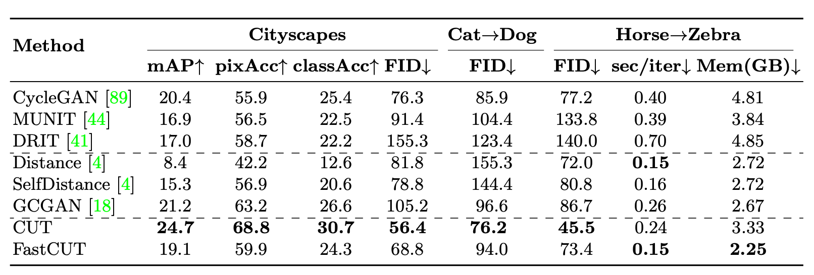

# Contrastive Learning for Unpaired Image-to-Image Translation [Kor]

## 1. Problem definition

image-to-image translation task는

source domain A에 있는 input image $$x_A$$를 target domain B로 변환시키는데, 이때 source content는 유지하면서 target style로 바꿔야 합니다.

따라서, 우리는 mapping function $$G_{A\mapsto B}$$를 학습해야 하고, 이 함수는 target domain image $$x_B \in B$$와 구분하기 힘든 $$x_{AB} \in B$$를 생성합니다.

Image-to-image translation task를 수식으로 나타내면 아래와 같습니다:

$$x_A \in domain A, x_B \in domain B$$

도메인 A의 임의의 이미지 $$x_A$$ 와, 도메인 B의 임의의 이미지 $$x_B$$ 가 있을때,

$$x_{AB} \in B : x_{AB} = G_{A\mapsto B}(x_A)$$

Generator $$G_{A\mapsto B}$$ 에 $$x_A$$ 를 넣은 아웃풋 $$x_{AB}$$ 는 도메인 B의 원소여야합니다.

## 2. Motivation

### Related work

#### Image translation

Image-to-Image translation이란, A 도메인에 있는 이미지를 B 도메인의 이미지로 맵핑하는 것을 말합니다.  쉽게 말하자면, 갈색 말(A 도메인)을 얼룩말(B 도메인)로 바꾸려는 것, 흑백사진(A 도메인)을 컬러사진(B 도메인)으로 바꾸려는 것이 image translation입니다. 그러나 이때, 갈색 말의 몸통이나 형태는 그대로 유지하되, 말의 털색만 바꿔야 됩니다. 흑백사진 또한 건물이나 배경은 변하지 않으면서 그것들의 색깔만 변해야 됩니다. 따라서 형태는 유지하면서 어떤 색깔이나 특징만 변하도록 해야되므로 한 이미지로부터 그 두가지를 분리하여 진행하는 것이 challenge입니다. 이것을 'disentanglement problem'이라고 하고, img-to-img translation task에서 가장 중요한 문제중에 하나입니다. 그리고 우리는 앞으로 말의 몸통/형태를 'content', 말의 털색을 'style'이라고 부를 것 입니다.

- Pix2Pix

  

  

  **Pix2Pix**는 paired dataset을 사용하는 대표적인 img-to-img translation모델입니다.

  여기서 Paired dataset이란, 두 도메인에 해당하는 이미지가 반드시 "한 쌍"으로 존재하는 데이터셋입니다. 예를 들면, 위 그림과 같이 (스케치, 신발사진), (레이블, 건물사진) 형태로 반드시 모델의 인풋으로 한 쌍의 이미지가 필요하게 됩니다. 

  Pix2Pix는 기존 GAN이 너무나 제약없이 이미지를 생성하는 한계를 극복하기 위해, L1 loss를 추가하였습니다.  즉, 생성된 이미지와 원본 이미지간의 차이를 줄여나가는 방향으로 학습하도록 하였습니다.

  그러나 Pix2Pix의 단점은, 

  1. Paired dataset은 쉽게 얻을 수 있는 데이터셋이 아닙니다. 그것을 만드는 것도 쉽지 않습니다.
	2. L1 loss에 너무 의존적입니다. 어떤 데이터셋에서는 L1 loss만 사용하였을 때 더 좋은 성능이 보이기도 하였습니다.
  
  따라서 이러한 단점을 보완하기 위해 제안된 논문이 'CycleGAN'입니다.

- CycleGAN

  **CycleGAN**은 더이상 paired dataset이 필요하지 않습니다. 그냥 각 도메인에 해당하는 이미지 데이터셋이 존재하면 됩니다. 이러한 세팅을 'Unpaired Dataset'이라고 합니다. 예를 들면, 말 사진 1000장과 얼룩말 사진 800장과 같이 이미지간의 쌍을 이루지 않아도 됩니다. 

  

  CycleGAN구조는 위 사진을 보면서 예시를 들어 설명하겠습니다.

  먼저 $$X$$는 말 이미지, $$Y$$는 얼룩말 이미지라고 합시다.

  말 이미지 $$X$$를 $$G$$라는 generator에 넣어주면, 이 generator는 얼룩말 이미지 $$G(X)$$를 만들어줍니다. 그리고 우리가 가진 진짜 얼룩말 이미지 Y와 비교하면서 이것이 진짜같은지, 가짜같은지를 판별해봅니다. 이것은 $$D_Y$$가 하는 일 입니다.

  그 후, 생성된 가짜 얼룩말 이미지 $$G(X)$$를 $$F$$라는 generator에 넣어줍니다. $$F$$는 다시 말 이미지 $$F(G(X))$$를 만들어줍니다. 그러면, $$D_X$$는 우리가 처음에 넣어주었던 말 이미지 $$X$$와, 두 generator를 거치고 돌아온 가짜 말 이미지 $$F(G(X))$$의 real/fake여부를 판별합니다.

  이 과정을 반대의 상황에서도 반복해줍니다. 즉 얼룩말 이미지 $$Y$$를 넣어 cycle을 돌고오는 가짜 얼룩말 이미지 $$G(F(Y))$$를 만드는 것이죠.

  이렇게 구하는 loss를 'cycle consistency loss'라고 부릅니다. 이것을 pix2pix의 L1 loss를 대신해서 사용하게 됩니다.

  그럼 최종 아웃풋 이미지는 진짜 얼룩말 같으면서도(style), 말 이미지의 고유의 형태(content)는 유지할 수 있게 됩니다. 

  다만 이 구조에도 문제가 있습니다.

  1. 역방향 함수가 필요합니다. 즉 $$G$$의 inverse인 $$F$$가 추가적으로 필요합니다. 모델을 두개나 사용하고 있으니 용량이 많이 들고 속도가 느릴 수 있습니다.

  2. 반드시 두 도메인 간의 관계가 일대일 대응이어야합니다. 이것은 너무 제약적입니다.

     

     

     이 이야기에 대해서 좀 더 자세히 얘기해보겠습니다.

     만약 어떤 갈색 말을 얼룩말 도메인으로 변환한다고 합시다. 그럼 기존 갈색 말의 털색 정보는 없애면서 그것의 형태만 유지를 하되, 얼룩무늬를 입히려고 할 것입니다. 따라서, 다시 얼룩말→말로 돌아갈 때에, 사실 그 형태가 중요하지 원래 말이 갈색이었는지, 흰색이었는지, 점박이였는지 그리 중요한 요소가 되지 않아 그 정보가 손실됩니다. 

     cycleGAN은 말→얼룩말 task는 잘 되지만, 얼룩말→말은 잘 되지 않습니다. 얼룩말은 말에 비해서 상대적으로 다양하지 않은 style(그냥 흑백 줄무늬를 가지고있으면 됨)을 가지고 있기 때문에 더 쉬웠던 것입니다. 그러나 반대로 얼룩말을 갈색, 점박이, 흰색 말로 만드는 것은 쉽지않은 task가 됩니다. 즉, cycleGAN은 diversity가 비교적 낮아 제약적인 면이 있습니다.

  

### Idea

본 논문에서는 cycleGAN의 이러한 한계점을 해결하기 위해서 새로운 모델인 "CUT(Contrastive learning for Unpaired image-to-image Translation)"을 제시합니다. (이 논문의 저자가 바로 cycleGAN의 저자입니다.)

말 이미지와 얼룩말 이미지를 패치 단위로 잘라서 살펴보았을 때, 말 머리는 얼룩말 머리끼리, 말 다리는 얼룩말 다리끼리, 그리고 배경은 배경끼리 연관관계를 유지할 수 있도록 하면, 좀더 직관적으로 이미지를 translate할 수 있지 않을까 생각한 겁니다. 이것은 contrastive loss를 통해서 구현됩니다.

contrastive loss는 인코더가 다음과 같은 임베딩을 학습할 수 있게 합니다.

1. 몸의 형태나 구조와 같은 공통되는 부분은 유지하면서(invariant)
2. 말의 털색처럼 다른 부분에 대해서는 유연하게 바뀌도록 합니다.(sensitive)

(contrastive loss는 아래 method부분에서 더 자세히 설명하겠습니다.)

그리고 CUT은 cycleGAN과 달리 inverse network가 필요하지 않아 더 간단하면서 학습시간도 단축되었다는 장점이 있습니다.

## 3. Method

#### InfoNCE Loss

먼저 위에서 말한 contrastive loss를 설명하기 위해 간단한 정보이론 개념을 설명하겠습니다.

**mutual information**이란, source vector c와 target vector x가 있을때 그 두 벡터의 상호의존정보량, 즉 **두 벡터가 공유하는 정보량** 정도라고 생각하시면 됩니다.

그것은 위와 같은 수식으로 구할 수 있고, 그것을 간단하게 $$\frac{p(x|c)}{p(c)}$$ 와 비례하는 $$f(x_t, c_t)$$ 라는 함수를 mutual information라고 합시다.(여기서 k는 가볍게 무시하도록 합시다. 저희가 이야기할 내용과는 상관없는 것입니다.)

그렇다면 두 벡터 사이의 mutual information을 최대화시킬 수 있는 loss, 즉 <u>두 벡터간의 상호의존정보량을 최대로 만드는 loss</u>는 어떻게 정의할 수 있을까요?

"Representation learning with contrastive predictive coding(2018)"이라는 논문에서는 **InfoNCE**라는 loss를 제안하게 됩니다.

InfoNCE loss는 위와 같습니다.

Vector space에서 target vector x 외의 vector를 랜덤하게 샘플링합니다. 이것을 negative sampling이라고 하고, 그 샘플들을 **negative sample**이라고 합니다.

N개의 negative sample과 1개의 target vector(=**positive sample**), 즉 N+1개의 vector 중, positive sample을 뽑을 확률을 나타낸 것입니다.

이 확률을 최대화하는 것은, 분자값은 높이고 분모값은 감소하는 것과 같습니다. 즉 target vector와의 mutual information은 최대화시키면서 나머지 negative sample과의 mutual info는 줄이는 것입니다. 따라서 이것은 loss를 최소화하는것과도 같습니다(마이너스가 붙어서).

본 논문에서는 InfoNCE loss를 다음과 같이 사용하고 있습니다.

1. Query v(혹은 source v) : output 이미지에서 온 패치의 feature

2. Positive v+ : input 이미지에서 온 패치의 feature. 단 query v와 같은 위치에 있는 패치임.

3. Negative v- : input 이미지에서 positive v+의 패치를 제외한 나머지 패치들의 feature.

그리고 이 feature들의 mutual information는 cosine similarity로 표현되어 두 feature간의 유사도를 구합니다.

> 즉, 이 loss를 최소화(min)하는 것은, query와 positive의 유사도는 최대화(max)하는 것이고, query와 negative의 유사도는 최소화(min)하는 것입니다.

여기서 ''패치의 feature'라는 이야기를 하고 있는데, 이 논문에서는 이것을 **Patchwise Contrastive Loss**라고 정의하고 있습니다.

자세한 내용은 밑에서 이어서 다루겠습니다.

#### Multilayer, patchwise contrastive learning

아까의 내용을 위 그림과 연관시키자면, 다음과 같습니다.

- 얼룩말 그림에서의 남색 패치 = Query v
- 말 그림에서의 파란색 패치 = Positive v+
- 말 그림에서의 노란색 패치 = Negative v-

Motivation에서 말했던 것처럼, 본 논문에서는 이미지 전체 뿐만 아니라, 그것을 패치단위로 뜯어서 살펴보았을 때에도 연관관계를 유지할 수 있기를 원했습니다. 

즉, output으로 생성된 얼룩말의 머리는, input 말의 다리보다는 input 말의 머리와 더 연관이 있어야 됩니다.

또한, 그 개념이 pixel level로 내려갔을때도 마찬가지입니다. 얼룩말의 몸의 색깔은 말의 몸 색깔과 더 연관이 있어야 하고, 배경인 초원(?)과는 연관성이 떨어져야 합니다.

여기서는 input이 encoder G에 들어가게 되면 다양한 크기의 feature map이 형성되는데, 논문에서는 이것을 loss를 구하는데에 활용하였습니다.

encoder의 $$l$$번째 layer에서 나온 feature map을 MLP network $$H_l$$에 넣어 임베딩 공간으로 매핑시켜줍니다.

그리고 매핑된 feature에서 $$S_l$$개의 패치를 뽑아 그 패치들로 contrastive loss를 계산합니다. 

이것을 L개의 layer에 대해서 반복시켜줍니다. 다양한 크기의 feature map에 대해서 반복하게 되면 이미지의 global한 특성부터 detail한 특성까지 고루고루 살펴볼 수 있게 됩니다.

저자들은 이 loss에게 **PatchNCE loss**라는 이름을 붙혀주었습니다.

수식을 살펴보면, 다음과 같습니다.

1. $$S_l$$개의 패치들 중에 돌아가면서 query patch를 지정한 뒤 contrastive loss를 구하고 이를 반복하고 모두 더함.

2. 그것을 L개의 layer에 대해서 다시 반복하고 모두 더함.

※ 참고: MLP network H는 [SimCLR(2020)](https://arxiv.org/abs/2002.05709) 논문에서 사용된 구조입니다. 이 network는 2개의 linear layer + ReLU non-linear layer로 이루어져있습니다. 왜 이 구조를 사용했는지는 해당 논문에서 실험을 통해 증명했으니 참고하시면 좋을 것 같습니다.

그런데, 이렇게 생각해볼 수도 있습니다.

여기서는 negative sample을 input 이미지 내(**internal patches**)에서 샘플링을 했는데, 아예 다른 이미지에서 negative sample을 가져올 수 있진 않을까요(**external patches**)?

그것에 대한 실험을 진행하였는데, 결국 <u>이미지 내에서 샘플링을 했을때가 더 좋은 결과가 나왔다고 합니다</u>.

실험 결과는 [Section 4. Experiment, Ablation Study](###Ablation study) 결과에 자세히 나와있습니다.

저자들은 그 이유를 다음과 같이 유추해보았습니다.

1. 인코더는 internal patch를 썼을 때, intra-class variation에 대해서 모델링하지 않아도 됩니다. 즉, 패치가 하얀말의 패치인지, 갈색말의 패치인지는 얼룩말을 만드는데에 중요하지 않기 때문에, 그것을 고려하지 않아도 됩니다.
2. External patch는 구분하기가 너무 쉽고, false positive가 될 수도 있습니다. 위의 그림을 보시면 아주 우연히도, 다른 말 이미지에서 샘플링을 했는데 query 패치와 연관이 있는 말의 머리부분이 negative sample로 뽑힐 수도 있습니다. 이렇게 되면 negative sample로써의 역할을 해주지 못합니다. 이것을 false positive라고 합니다.
3. 이미 internal patch를 쓰는 방법론은 texture synthesis나 super resolution 분야에서 성능입증이 되었기 때문입니다.

### Final loss

최종 loss는 다음과 같이 표현됩니다.

기본 GAN loss, PatchNCE loss, 그리고 identity loss로 이루어져 있습니다.

identity loss는 PatchNCE loss를 Y 도메인에 대해서 동일하게 적용한 것입니다. 이것은 generator가 이미지를 불필요하게 변화시키는 것을 막기 위해 사용되었다고 합니다. 이는 CycleGAN에서 사용한 identity loss의 역할과 거의 유사합니다. 즉, G_Y에게 X가 아닌, Y를 넣었을때 다른 이미지가 아닌 Y로 맵핑되도록 하는 로스입니다. 

기본 CUT 모델은 $$\lambda_X = 1, \lambda_Y = 1$$을 사용하였고,

좀 더  light한 모델인 일명 Fast CUT은 $$\lambda_X = 10, \lambda_Y = 0$$ 을 사용하였다고 합니다. 즉, identity loss를 사용하지 않아서 좀 더 가벼운 버전입니다.

## 4. Experiment & Result

### Experimental Setup

- Dataset: 
  - Cat→Dog contains 5,000 training and 500 val images from AFHQ Dataset
  - Horse→Zebra contains 2,403 training and 260 zebra images from ImageNet
  - Cityscapes contains street scenes from German cities, with 2,975 training
    and 500 validation images. 
- Baselines
  - CycleGAN
  - MUNIT
  - DRIT
  - Distance
  - SelfDistance
  - GCGAN
- Evaluation Metric
  - FID(Fr ́echet Inception Distance) : real 이미지의 분포와 생성된 이미지의 분포간의 divergence를 구하는 metric. 낮을수록 성능이 좋음.
  - Cityscape 데이터셋은 ground-truth label이 존재하여 segmentation 지표인 mAP, pixel-wise accuracy, average class accuracy가 사용됨.
  - sec/iter, Mem(GB) : 속도와 용량 측정 지표
- Training details:
  - Generator 구조 : Resnet-based generator
  - Discriminator 구조: PatchGAN discriminator
  - GAN Loss는 LSGAN loss를 사용함.
  - Encoder는 Generator의 절반만 사용함.
  - Feature는 encoder의 0, 4, 8, 12, 16번째 레이어에서 뽑음.

### Results

정성적 결과입니다. Light 버전인 FastCUT이 다른 baseline들보다도 좋은 결과를 보이는 경우가 있습니다.

특히 horse-to-zebra의 task에서는 CUT이 다른 모델들, 특히 cycleGAN보다도 더 좋은 결과를 보여주고 있습니다.

다만 마지막 2개의 행을 보면 실패한 케이스를 볼 수 있는데요. 익숙하지 않은 말의 포즈가 나오면 배경에 줄무늬를 입혀버린거나, 고양이에서 개를 만들 때 있지도 않은 혀를 만들어 버렸습니다.

다음은 정량적 결과입니다. FID도 가장 낮지만, 속도와 용량이 다른 모델에 비해서 매우 경제적입니다.

### Ablation study

Ablation study는 다양한 옵션을 두고 진행했습니다. 

1. Identity loss를 썼는지
2. Negative sample의 개수
3. Multi-layer learning인지, 오직 encoder의 last layer만 썼는지
4. Internal patches vs. External patches

(우측 좌표를 봤을 때, 오른쪽 위로 올라갈 수록 성능이 좋고, 좌측 하단으로 갈수록 성능이 좋지않는 것이라고 생각하시면 됩니다.)

먼저  external patch를 사용하면 성능이 좋지 못하다는 것을 볼 수 있고, last layer만 썼을때도 성능이 썩 좋지 못합니다.

그러나 identity loss가 없을때는 성능이 비교적 좌표 좌측 하단에 몰려있습니다.

좌측 표를 보면, Horse-to-zebra에서는 오히려 FID가 낮아졌지만(성능↑), Cityscapes에서는 FID가 올라갔습니다(성능↓).

저자들은 이렇게 다른 양상을 띄는게 이상하다고 생각하여 training시의 loss 추이를 살펴보았습니다.

그랬더니 Cityscape에서는 identity loss를 쓰지않았을 때, 굉장히 불안정하게 학습을 하고 있는 현상이 나타났습니다.

따라서 <u>identity loss를 쓰지않으면 최종 FID는 잘 나올 수 있어도, 학습이 불안정할 수 있습니다</u>. 즉 identity loss는 보다 안정적으로 학습을 할 수 있게 도와주고 있습니다.

### Visualizing the learned similarity by encoder

마지막으로, 저자들은 encoder network가 어떻게 학습을 하고있는지를 확인하기 위해 visualization을 진행하였습니다.

위의 사진(a)에서 파란점 부분이 query patch이고, 이에 해당하는 파란 사각형의 이미지들(c)이 output 얼룩말의 query patch와 input 말의 patch들간의 similarity를 계산하고 시각화한 결과입니다. (빨간점도 동일합니다.) 즉, similarity 결과 이미지에서 하얀 부분일수록 유사하고, 까만 부분일수록 유사하지 않은 것입니다.

파란점, 얼룩말의 몸 부분은 말의 몸 부분과 유사하고 나머지 배경부분과는 유사하지 않습니다.

마찬가지로 빨간점, 뒷배경 나뭇잎 부분은 input이미지의 초원배경과 유사하고 말의 몸과는 유사하지 않습니다.

그리고 우측 그림들은 패치들의 feature를 가지고 PCA를 진행하여 주성분을 추출한 결과입니다. 유사한 색깔이 피쳐스페이스에서 유사한 위치에서 온다고 해석하면 됩니다.

결국 얼룩말과 말의 몸 부분끼리는 연관성이 있고, 그외의 배경부분끼리 연관성이 있음을 보여주고 있습니다.

## 5. Conclusion

CUT의 주요 contribution을 정리하자면 다음과 같습니다.

1. 기존 cycleGAN의 한계를 극복하고 보다 straightforward한 방법으로 image translation task를 다루고 있음.
2. 특히 image synthesis task에서는 최초로(저자가 주장하길,) contrastive loss를 사용하였음.
3. perceptual loss와 같이 imagenet에 제약된 predefined similarity function이 아닌 cross-domain similarity function을 학습함.
4. 더이상 inverse network가 필요없고, cycle-consistency에 의존하지 않음.

그러나 이 논문에도 limitation이 존재합니다.

이 논문은 특정 도메인에만 잘한다는 단점이 있습니다. 위에 실험에서도 보았듯이, 특히 horse-to-zebra에는 유독 잘하는 경향을 띄고 있지만, cityscape나 cat-to-dog같은 경우에는 그리 눈에 띄는 결과를 보이고 있다고하기 힘듭니다. 어쩌면 domain간의 gap을 모델이 잘 캐치해내지 못하는 것일 수도 있겠죠.

최근에 나온 [Dual Contrastive Learning for Unsupervised Image-to-Image Translation(CVPRW, 2021)](https://arxiv.org/abs/2104.07689) 에서는 바로 이 점을 지적하며, CUT에서는 두 도메인이 오직 하나의 인코더만 사용하기 때문이라고 주장합니다. 따라서 이 논문에서는 임베딩을 여러 개를 사용하여 그 한계점을 해결하였다고 하니 뒷 내용이 궁금하신 분들은 해당 논문을 읽어보시면 좋을 것 같습니다.

저는 무엇보다 이 논문을 읽으면서 사실 cycleGAN이라는 유명 논문을 쓴 저자가 부러운 마음이 제일 컸습니다..그러나 저자들은 유명세에 그치지 않고 최근에 나온 방법론인 contrastive learning을 자신의 기존연구에 적용하여 다음연구로 발전을 시켰네요. 그러한 자세를 연구자로써 배워야겠다고 느꼈습니다.

### Take home message
1. Contrastive learning은 feature간의 embedding을 배우기에 매우 적합한 방법이다.
2. CycleGAN의 cycle consistency는 다양한 이미지를 생성하지 못하고 다소 제약적이다.
3. Contrastive representation은 single image만 있어도 표현할 수 있기 때문에, single image만으로 학습할 때 사용할 수 있다.

지금까지 긴 포스팅을 읽어주셔서 감사합니다. 😊 

## Author / Reviewer information

### Author

박여정 (Yeojeong Park)

- M.S. Candidate in KAIST AI
- [github](https://github.com/indigopyj) 
- [blog](https://indigopyj.github.io/)
- E-mail: indigopyj@gmail.com; indigopyj@kaist.ac.kr

## References & Additional materials
- [Contrastive Learning for Unpaired Image-to-Image Translation - arXiv](https://arxiv.org/abs/2007.15651)
- [CUT: Contrastive Learning for Unpaired Image-to-Image Translation - Youtube](https://www.youtube.com/watch?v=jSGOzjmN8q0)
- [Contrastive Learning for Unpaired Image-to-Image Translation - Youtube](https://www.youtube.com/watch?v=i7U646IiQOw)
- [A Simple Framework for Contrastive Learning of Visual Representations - arXiv](https://arxiv.org/abs/2002.05709)
- [Dual Contrastive Learning for Unsupervised Image-to-Image Translation - arXiv](https://arxiv.org/abs/2104.07689)

