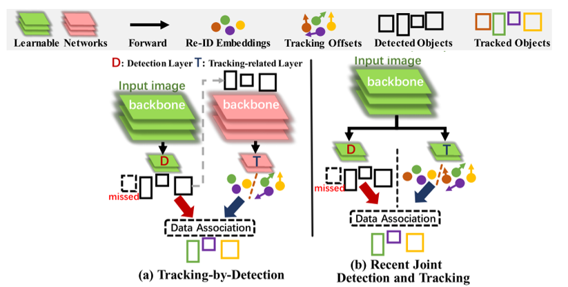
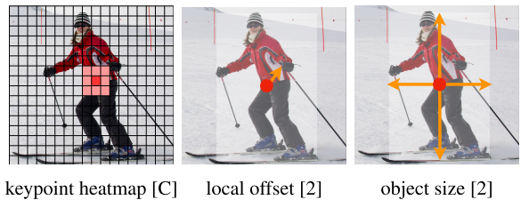
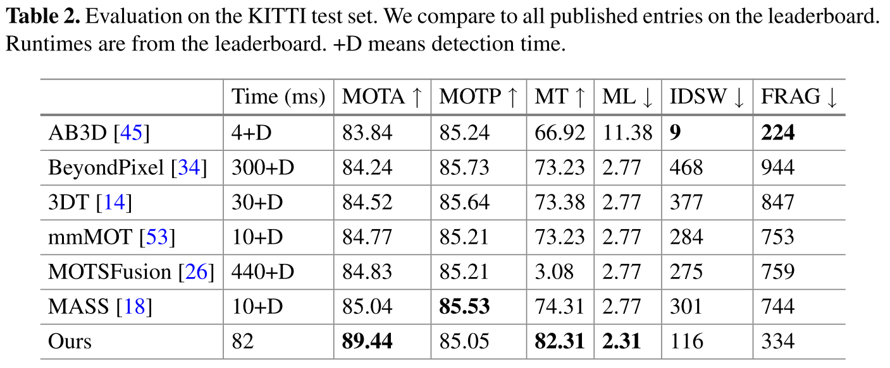
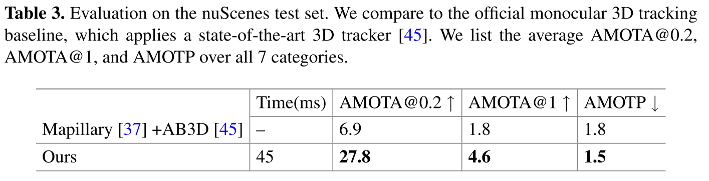
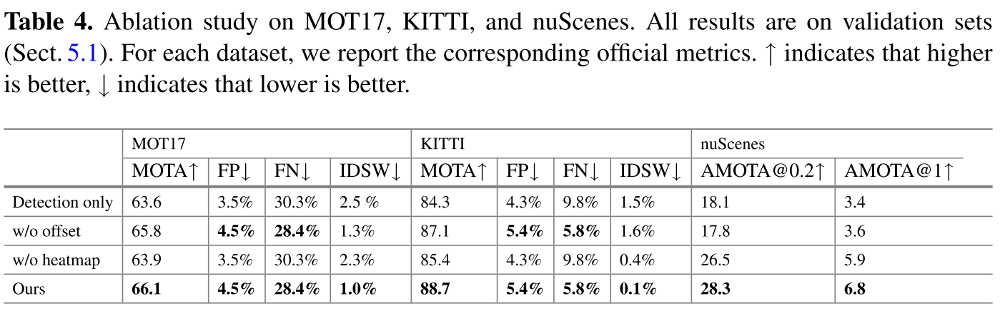

# Tracking Objects as Points \[Eng]

한국어로 쓰인 리뷰를 읽으려면 [**여기**](eccv-2020-CenterTrack-kor.md)를 누르세요.

## 0. Introduction

CenterTrack is an image-based Multio-Object Tracking(MOT) model. Therefore, it is necessary to understand what MOT is for to figure out CenterTrack entirely.

MOT is the task of detecting objects in consecutive frames and tracking the detected objects. Here, continuous frames can be point clouds or images, etc. The reason for tracking detected objects is to understand the motion of each object. The trajectory or path of the object generated by tracking can be utilized in various fields such as action recognition and trajectory prediction.

Taking the video clip below as an example, MOT finds the location of objects in a series of images (represented as bounding boxes) and assigns the same id (described as the color of boxes) to the same object simultaneously.

![Example of MOT(multi-object tracking) 출처:GNN3DMOT[1]](../../.gitbook/assets/43/figure_mot2.gif)

##  1. Problem definition

The image-based multi-object tracking problem can be generally defined as follow.

The images from the camera at time $$t$$ and the previous frame $$t-1$$ are defined as $$I^{(t)} \in \mathbb{R}^{W \times H \times 3}$$ , $$I^{(t-1)} \in \mathbb{R}^{W \times H \times 3}$$ respectively, and detected and tracked objects' tracklets in $$t-1$$ are described as $$T^{(t-1)}=\{b_0^{(t-1)}, b_1^{(t-1)},\ldots\}$$. The purpose of the image-based MOT is to find tracklet $$T^{ (t)}=\{b_0^{(t)}, b_1^{(t)},\ldots\}$$ using $$I^{(t)}, I^{(t-1)}$$ and $$T^{(t-1)}$$ as inputs. In the tracklet of objects $$b=\{\textbf{p},\textbf{s},w,id\}$$, $$\textbf{p} \in \mathbb{R}^{2}$$ is the center point of the object location, $$\textbf{s}\in \mathbb{R}^{2}$$ is the object size, $$w \in [0,1]$$ is confidence score, and $$id \in \mathbb{L}$$ corresponds to unique identification.

## 2. Motivation

### Related work

**Tracking-by-Detection.** Previous studies for object tracking have followed the framework called Tracking-by-Detection. Methods that belong to this framework detect objects using some off-the-shelf detector and then track detected objects with a separated matching algorithm. The detection and tracking are performed in a cascade manner, which makes the detection phase not affected by the tracking phase. SORT[2], DeepSORT[3], and BeyondPixel[4] are belongs to the Tracking-by-Detection framework.

Tracking-by-Detection is a case that properly leverages well-developed detection models for multi-object tracking. However, it tends to have a slow running time and a complicated network since a complex association algorithm is necessary. Furthermore, it also has the disadvantage that object detection cannot utilize the clues of object tracking.

**Joint Detection and Tracking.** In order to tackle the limitations of Tracking-by-Detection, Joint Detection and Tracking, which performs object detection and tracking simultaneously, is being researched recently. Unlike Tracking-by-Detection, Joint Detection and Tracking extracts features for object detection and tracking through the same network. Thereby, the detection network can leverage features for tracking. Moreover, these methods effectively reduce model complexity because the association is relatively simple, and CenterTrack also falls under this method. 

### Idea

The main idea of CenterTrack is simple but powerful. It is that the association can be easily handled by representing the objects as points rather than bounding boxes. CenterTrack shows outstanding performance with only a simple greedy matching, whereas previous works leverage complex motion modeling or a separate association network to track detected objects in consecutive frames.

## 3. Method

### Preliminaries

CenterTrack is built on top of the object detector called CenterNet[5]. Therefore, I would like to briefly explain CenterNet here.

CenterNet is a monocular image-based object detection network. In contrast to existing methods that predicts object based on anchors, which is predefined bounding box templates, CenterNet is one of the anchor-free model and instead, it predicts objects as points. In detail, CenterNet takes the monocular image $$I \in \mathbb{R}^{W \times H \times 3}$$ as input and predicts a heatmap $$\hat{Y} \in [0,1]^{\frac{W}{R} \times \frac{H}{R} \times C}$$ representing the center point of the object and a size map $$\hat{S} \in \mathbb{R}^{\frac{W}{R} \times \frac{H}{R} \times C}$$. (where $$R$$ is the downsampling factor, and $$R=4$$ is used in the paper) The local maximum $$\hat{\textbf{p}} \in \mathbb{R}^2$$ in the heatmap $$\hat{Y}$$ is called the peak, and this $$\hat {\textbf{p}}$$ is predicted as the center point of the object. In the network, for each $$\hat{\textbf{p}}$$, confidence $$\hat{w} = \hat{Y}_{\hat{\textbf{p}}}$$ and size $$\hat{\textbf{s}} = \hat{S}_{\hat{\textbf{p}}}$$ is also predicted.

CenterTrack relies heavily on CenterNet, so please read the original paper if you need more detailed information on CenterNet.

### Tracking-Conditioned Detection

As explained, the object detection model used in CenterTrack is the same as CenterNet, but with additional inputs. While CenterNet uses only the current frame $$I^{(t)}$$ as input, CenterTrack additionally uses the image $$I^{(t-1)}$$ from the previous frame as input. In addition, CenterTrack also takes the location (center point) of objects detected in the previous frame $$\{\hat{\textbf{p}}_{0}^{(t-1)}, \hat{\textbf{p}} _{1}^{(t-1)},\ldots\}$$ as additional input. Instead of directly using center points of objects $$\{\hat{\textbf{p}}_{0}^{(t-1)}, \hat{\textbf{p}} _{1}^{(t-1)},\ldots\}$$, class-agnostic single-channel heatmap $$H^{(t-1)} = \mathcal{R}(\{\hat{\textbf{p}}_ {0}^{(t-1)}, \hat{\textbf{p}}_{1}^{(t-1)},\ldots\})$$ is used as input. Here, the class-agnostic single-channel heatmap means that the heatmap is not generated for each class and there is only one heatmap that represents center points whatever the class of it is. In this way, CenterTrack's Tracking-Conditioned Detection makes it possible to detect objects that are invisible in the current image, such as occluded objects.

### Association Through Offsets

In CenterTrack, the two-dimensional displacement (offset) is also predicted in addition to the object's location and size. Compared with the Kalman Filter, it can be interpreted that the detection of the object location corresponds to the measurement, and the two-dimensional displacement corresponds to the prediction. This two-dimensional displacement or offset $$\hat{D}_{\textbf{p}_{i}^{(t)}} \in \mathbb{R}^{\frac{W}{R} \times \frac{H}{R} \times 2}$$ represents the distance the object moves between the current frame and the previous frame. To learn this displacement, $$L_{off}$$ is added to the loss function.

$$
L_{off} = \frac{1}{N} \sum_{i=1}^{N} |\hat{D}_{\textbf{p}_{i}^{(t)}} - (\textbf{p}_{i}^{(t-1)} - \textbf{p}_{i}^{(t)})|
$$

It is the main contribution of CenterTrack that a simple greedy matching without complicated association process is sufficient to track objects if the offset is predicted correctly since the objects are presented as points.

### Training on Video Data

CenterTrack copies all weights related to the CenterNet pipeline and uses the same training objective with the addition of offset regression $$L_{off}$$. However, there is a problem in training CenterTrack, which is that errors such as missing tracklets, wrongly localized objects, or false positives occur in inference time and degrade the model's performance. Since the model leverages the ground truth of detection as the previous frame's detection results in training, the network is vulnerable to such errors that are not happening in the training process.

To handle this problem, authors intentionally simulate test-time errors during training. Specifically, three types of error are simulated to make the model robust. (1) locally jittering each tracklet by adding Gaussian noise, (2) random false positive, and (3) random false negative. Furthermore, in order to prevent overfitting in temporal characteristics, the random time difference between two frames is (up to 3 frames).

## 4. Experiment & Result

### Experimental setup

**Datasets**

In CenterTrack, MOT17 and KITTI tracking benchmarks are used for 2D MOT and nuScenes for 3D MOT.

**Evaluation Metrics**

In multi-object tracking (MOT), the two evaluation metrics, MOTA and MOTP, are widely employed.

**MOTA (multi-object tracking accuracy)** MOTA is a metric that measures the accuracy of MOT by counting errors of false positive(FP), false negative(FN), and ID switching(IDSW).

$$
MOTA = 1-\frac{\sum_t (FP_t + FN_t + IDSW_t)}{\sum_t GT_t}
$$

**MOTP (multi-object tracking precision)** Since MOTA does not measure the error of localization, the MOTP is evaluated together. MOTP is the average of the scores $$S$$ for objects detected as true positives. For the score $$S$$,  IOU (Intersection of Union) or distance error is widely employed.

$$
MOTP = \frac{1}{|TP|}\sum_{TP}S
$$

In addition, **MT** (Mostly Tracked): the proportion of objects tracked over 80% of the total trajectory, **ML** (Mostly Lost): the proportion of objects tracked less than 20% of the total trajectory are evaluated.

### Result

First, table 2 shows the 2D MOT results in the KITTI dataset, and MOTA is improved more than 4% compared to other methods.

From the results from the nuScenes dataset, which corresponds to 3D MOT, there is an outstanding performance improvement compared to the conventional method.

Here is the ablation study result. The comparison baselines used in the ablation study are as follows.

**Detection only**: Detecting objects in each frame independently using CenterNet and matching them based on 2D distance

**w/o offset**: Matching based on distance without prediction of offset or two-dimensional displacement

**w/o heatmap**: Object detection and tracking without using heatmap $$H^{(t-1)}$$ as input

There is a notable difference in performance in 2D and 3D. In particular, in MOT17 and KITTI, which correspond to 2D, when comparing "Ours" and "w/o offset," the performance difference is insignificant. In contrast, in the result of nuScenes, which corresponds to 3D, "Ours" shows a remarkably improved result than "w/o offset". The reason for this difference can be found in the sampling period of datasets. In MOT17 and KITTI, the datasets are sampled with 25FPS and 10FPS, respectively, whereas nuScenes has a much longer sampling period of 2FPS. Since a long sampling period means that the moving distance of an object is large between consecutive frames, it is difficult to accurately track an object with simple association without offset prediction.

## 5. Conclusion

CenterTrack is an MOT model based on a point-based object detector CenterNet. It simultaneously detects and tracks multiple objects in the current frame leveraging the two images in consecutive frames and object location information of previous frames. By detecting and tracking objects in the form of points, simplifies the complicated process required for association and shows remarkable performance. However, since the model is proposed by changing the input and output of CenterNet, the contribution also relies on CenterNet. Furthermore, although the point-based object location representation is efficient, the simplest method, greedy matching, is employed. I think there are many more things that could be improved.

### Take home message

> Object tracking, as well as object detection, also can benefit from point-based representation.

## Author / Reviewer information

### Author

**Sanmin Kim**
* Ph.D. candidate / KAIST GSGT [VDCLab](http://vdclab.kaist.ac.kr/)
* Research Area: Autonomous Driving
* sanmin.kim@kaist.ac.kr

### Reviewer

1. Korean name \(English name\): Affiliation / Contact information
2. Korean name \(English name\): Affiliation / Contact information
3. ...

## Reference & Additional materials

[[1]](https://openaccess.thecvf.com/content_CVPR_2020/html/Weng_GNN3DMOT_Graph_Neural_Network_for_3D_Multi-Object_Tracking_With_2D-3D_CVPR_2020_paper.html) GNN3DMOT: Graph Neural Network for 3D Multi-Object Tracking with Multi-Feature Learning

[[2]](https://ieeexplore.ieee.org/abstract/document/7533003/) Simple Online and Realtime Tracking

[[3]](https://ieeexplore.ieee.org/abstract/document/8296962) Simple Online and Realtime Tracking with a Deep Association Metric

[[4]](https://ieeexplore.ieee.org/abstract/document/8461018) Beyond Pixels: Leveraging Geometry and Shape Cues for Online Multi-Object Tracking

[[5]](https://arxiv.org/abs/1904.07850) Objects as Points
