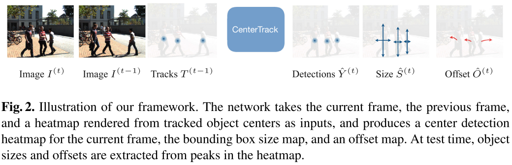
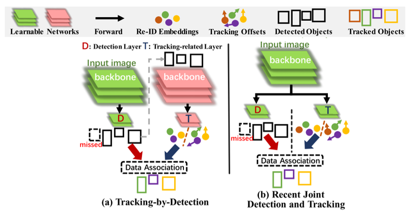
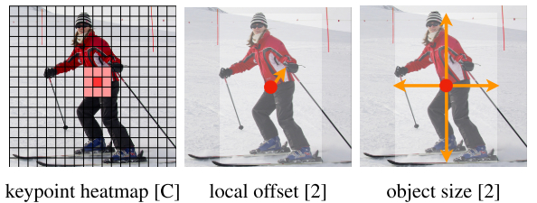
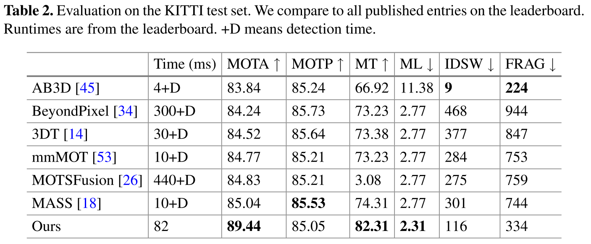
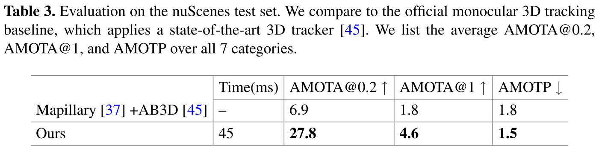
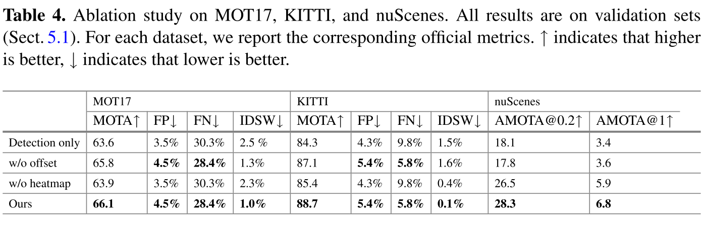

# Tracking Objects as Points \[Kor]

[**English version**](eccv-2020-CenterTrack-eng.md) of this article is available.

## 0. Introduction

논문에서 제안하는 CenterTrack은 이미지 기반의 Multi-Object Tracking(MOT)을 위한 모델입니다. 따라서 CenterTrack을 잘 이해하기 위해서는 MOT가 어떤 task인지를 이해할 필요가 있습니다.

MOT는 연속적인 프레임에서 객체를 검출하고, 검출된 객체를 추적하는 task입니다. 여기서 연속적인 프레임은 LiDAR의 point cloud 또는 이미지 등이 될 수 있습니다. 이렇게 검출된 객체를 추척하는 이유는 각 객체의 이동 경로를 파악하기위해서 입니다. 이렇게 추적되어 생성된 객체의 궤적 또는 경로는 action recognition, trajectory prediction 등 다양한 분야에서 활용될 수 있습니다.

아래 영상을 예로 들면 MOT는 연속된 이미지에서 객체의 위치를 찾는 것(bounding box)과 동시에 같은 객체에 같은 id를 부여하는 것(color of box)입니다.

![MOT(multi-object tracking) 예시 출처:GNN3DMOT[1]](../../.gitbook/assets/43/figure_mot2.gif)

##  1. Problem definition

이미지 기반의 다중 객체 추적 문제는 일반적으로 다음과 같이 정의할 수 있습니다.

시간 $$t$$ 와 이전 프레임 $$t-1$$에서 카메라를 통해 들어온 이미지를 각각 $$I^{(t)} \in \mathbb{R}^{W \times H \times 3}$$ , $$I^{(t-1)} \in \mathbb{R}^{W \times H \times 3}$$라고 정의하고 $$t-1$$에서 검출되고 추적된 객체 정보를 $$T^{(t-1)}=\{b_0^{(t-1)}, b_1^{(t-1)},\ldots\}$$라고 했을 때 이미지 기반 MOT의 목적은 $$I^{(t)}, I^{(t-1)}$$ 그리고 $$T^{(t-1)}$$를 입력으로 사용하여 $$t$$에 존재하는 객체들의 정보에 해당하는 $$T^{(t)}=\{b_0^{(t)}, b_1^{(t)},\ldots\}$$를 찾고 두 시계열 이미지에서 검출된 같은 객체에 대해 같은 $$id$$를 부여하는 것 입니다. 객체 정보 $$b=\{\textbf{p},\textbf{s},w,id\}$$에서 $$\textbf{p} \in \mathbb{R}^{2}$$ 는 객체의 중심점의 위치, $$\textbf{s}\in \mathbb{R}^{2}$$ 사이즈, $$w \in [0,1]$$ 는 confidence, 그리고 $$id \in \mathbb{L}$$은 unique identification 에 해당합니다.

## 2. Motivation

### Related work

**Tracking-by-Detection.** 기존의 객체 추적 연구는 Tracking-by-Detection의 프레임워크를 많이 따랐습니다. 이는 각각의 프레임에서 객체 검출 모델을 활용하여 객체를 검출하고, 검출된 객체를 별도의 알고리즘을 통해 매칭하여 추적하는 방법입니다. 즉, 객체 검출과 객체 추적이 별도로 이루어지며 객체 검출 단계는 객체 추적 단계의 영향을 받지 않습니다. SORT\[2], DeepSORT\[3], BeyondPixel\[4] 등이 이 방법에 해당합니다.

Tracking-by-Detection은 딥러닝을 활용하여 엄청난 속도로 발전한 객체 검출 모델의 결과를 객체 추적에 잘 활용한 방법이라고 할 수 있습니다. 하지만 tracking-by-detection 방법의 경우 복잡한 association, 즉 복잡한 매칭 전략이 필요하기 때문에 네트워크가 전체적으로 느려지고 복잡해지는 경향이 있습니다. 또한 객체 검출이 객체 추적의 단서들을 활용할 수 없다는 단점도 가지고 있습니다.

**Joint Detection and Tracking.** Tracking-by-Detection의 문제를 해결하기 위해 최근들어 객체 검출과 추적을 함께 진행하는 Joint Detection and Tracking의 프레임워크에 대한 연구가 많이 진행되고 있습니다. Tracking-by-Detection과는 다르게 객체 검출과 객체 추적을 위한 feature를 같은 네트워크를 통해 추출함으로써 네트워크가 두 task 모두를 위한 네크워크로 학습이 됩니다. 이 방법은 비교적 association이 간단하게 진행되기 때문에 모델의 complexity를 줄이는데 효과적이며 CenterTrack 또한 이 방법에 해당됩니다.

### Idea

CenterTrack의 핵심 아이디어는 간단합니다. 바로 객체를 bounding box가 아닌 point로 표현하여 사용함으로써 association을 매우 간단하게 처리할 수 있다는 것입니다. 기존 방법들이 연속된 프레임에서 검출된 객체를 추적하기위해 복잡한 motion modeling을 사용하거나 appearance cue를 활용한 별도의 네트워크를 통해 객체 추적을 진행하였다면, CenterTrack은 매우 간단한 방법을 통한 tracking 만으로도 충분한 성능을 보여준다는 점입니다.

## 3. Method

### Preliminaries

CenterTrack은 CenterNet[5]이라고 하는 객체 검출기를 기반으로 만들어졌습니다. 따라서 여기서는 CenterNet에 대해서 간단하게 설명하고자 합니다.

CenterNet은 monocular 이미지에서 객체를 검출하는 네트워크로 객체를 anchor 기반으로 바운딩 박스를 예측하는 기존의 방법들과 달리 anchor 없이 객체의 중심점 $$\textbf{p}$$와 사이즈 $$\textbf{s}$$를 예측하는 것이 특징입니다. 조금 더 자세하게 설명하자면, CenterNet은 이미지 $$I \in \mathbb{R}^{W \times H \times 3}$$를 입력으로 받아 객체의 중심점을 나타내는 heatmap $$\hat{Y} \in [0,1]^{\frac{W}{R} \times \frac{H}{R} \times C}$$와 size map $$\hat{S} \in \mathbb{R}^{\frac{W}{R} \times \frac{H}{R} \times C}$$ 을 출력합니다.(여기서 $$R$$은 downsampling factor로 논문에서는 $$R=4$$를 사용하였습니다.) 그리고 heatmap $$\hat{Y}$$에서의 local maximum $$\hat{\textbf{p}} \in \mathbb{R}^2$$를 peak라고 부르며, 이 $$\hat{\textbf{p}}$$이 객체의 중심점으로 예측됩니다. 네크워크에서는 각 $$\hat{\textbf{p}}$$에 따라 confidence $$\hat{w} = \hat{Y}_{\hat{\textbf{p}}}$$와 사이즈 $$\hat{\textbf{s}} = \hat{S}_{\hat{\textbf{p}}}$$ 도 함께 출력합니다.

CenterTrack은 많은 부분을 CenterNet에 의존하기때문에 CenterTrack을 더 잘 이해하고 싶으신 분들은 CenterNet 논문도 한번 읽어보시기 바랍니다.

### Tracking-Conditioned Detection

앞서 설명드렸듯이 CenterTrack에 사용된 객체 검출 모델은 CenterNet과 똑같지만 입력이 추가된 모델입니다. CenterNet에서 현재 프레임 $$I^{(t)}$$만 입력으로 사용한 반면 CenterTrack에서는 이에 추가적으로 이전 프레임에서의 이미지 $$I^{(t-1)}$$까지 입력으로 사용하게됩니다. 뿐만 아니라 CenterTrack에서는 이전 프레임에서 검출된 객체들의 위치(중심점) $$\{\hat{\textbf{p}}_{0}^{(t-1)}, \hat{\textbf{p}}_{1}^{(t-1)},\ldots\}$$ 함께 입력으로 사용합니다. 여기서 객체들의 중심점을 바로 사용하는 것이 아니라 이를 Gaussian render function을 이용하여 class-agnostic single-channel heatmap $$H^{(t-1)} = R(\{\hat{\textbf{p}}_{0}^{(t-1)}, \hat{\textbf{p}}_{1}^{(t-1)},\ldots\})$$ 의 형태, 즉 class와 무관한 하나의 heatmap을 입력으로 사용합니다. 이러한 방식을 통해 CenterTrack의 Tracking-Conditioned Detection은 한 time step의 이미지만을 사용했을 때보다 occlusion과 같이 현재 이미지에서 볼 수 없는 객체들에 대한 검출도 가능해지게 됩니다.

### Association Through Offsets

CenterTrack에서는 객체 추적을 위해 detection 결과에 해당하는 객체 위치(중심점 또는 heatmap)과 사이즈 이외에 2차원 변위를 추가적으로 예측하게됩니다. Kalman Filter와 비교해보면 객체 위치에 대한 detection이 measurement, 그리고 2차원 변위가 prediction에 해당한다고 볼 수 있습니다. 이 2차원 변위 $$\hat{D}_{\textbf{p}_{i}^{(t)}} \in \mathbb{R}^{\frac{W}{R} \times \frac{H}{R} \times 2}$$는 현재 프레임과 이전 프레임에서의 물체의 이동 거리를 나타냅니다. 이 변위를 학습하기 위해서 다음과 같이 $$L_{off}$$ 가 손실 함수에 추가됩니다.

$$
L_{off} = \frac{1}{N} \sum_{i=1}^{N} |\hat{D}_{\textbf{p}_{i}^{(t)}} - (\textbf{p}_{i}^{(t-1)} - \textbf{p}_{i}^{(t)})|
$$

이 변위 또는 offset 예측이 잘 된다면 복잡한 association 과정 없이 단순한 greedy matching으로도 충분히 객체 추적이 잘 된다는 것이 CenterTrack의 아이디어이자 장점입니다.

### Training on Video Data

CenterTrack은 CenterNet의 weights를 그대로 가져와 학습하였으며, $$L_{off}$$ 이외에 다른 손실함수 또한 동일합니다. 하지만 CenterTrack을 학습하는데 있어서 한 가지 문제점이 있었는데, 바로 추론 단계에서 발생하는 미검출, 오검출, localization 오차 등이 모델의 성능을 많이 하락시킨다는 점입니다. 이는 학습 단계에서는 이전 프레임의 검출 결과 입력으로 사용할 때 ground truth를 사용하였기 때문입니다. 즉, 학습 단계에서는 이전 프레임의 검출 결과 대신 ground truth를 사용하였기 때문에 네트워크가 실제 validation 및 test 단계에서 발생할 수 있는 객체 검출의 대한 대처가 어려워 성능 하락을 가져왔다는 뜻입니다. 이를 해결하기 위해 학습 단계에서 일종의 data agumentation을 추가합니다. 객체의 중심점에 Gaussian noise를 추가하거나, 임의적으로 오검출(false positives) 또는 미검출(false negatives)을 추가하는 방식으로 네트워크가 강인하게 작동할 수 있도록 하였습니다. 또한 temporal 특성에서의 overfitting을 방지하기 위해서 연속된 두 프레임 ($$t, t-1$$)만 사용하는 것이 아니라 두 프레임 사이의 시간차이를 랜덤(최대 3프레임)하게 사용하였습니다.

## 4. Experiment & Result

### Experimental setup

**Datasets**

CenterTrack에서는 2D MOT를 위해서 MOT17과 KITTI tracking benchmarks를 사용하였으며 3D MOT에서는 nuScenes를 사용하여 학습 및 평가하였습니다.

**Evaluation Metrics**

MOT(multi-object tracking)에서는 MOTA, MOTP 이 두가지의 평가지표를 가장 많이 사용합니다.

**MOTA (multi-object tracking accuracy)** MOTA는 오검출(False Positive, FP), 미검출(False Negative, FN), ID 스위칭 (IDSW)의 에러를 카운트하여 MOT의 정확도를 측정하는 지표입니다.

$$
MOTA = 1-\frac{\sum_t (FP_t + FN_t + IDSW_t)}{\sum_t GT_t}
$$

**MOTP (multi-object tracking precision)** MOTA가 localization의 오차를 측정하지 않기 때문에 이를 위해 MOTP를 함께 평가합니다. MOTP는 True Positive로 검출된 객체들에 대한 스코어 $$S$$의 평균값입니다. 여기서 스코어 $$S$$는 주로 IOU(Intersection of Union) 또는 distance error 등을 사용하게 됩니다.

$$
MOTP = \frac{1}{|TP|}\sum_{TP}S
$$

그 밖에도 **MT**(Mostly Tracked): 전체 궤적 중 80% 이상 추적된 물체의 비율, **ML**(Mostly Lost): 전체 궤적중 20% 미만 추적된 물체의 비율 등이 MOT의 평가지표로 사용됩니다.

### Result

먼저 KITTI 데이터셋에서의 2D MOT 결과를 보시면 기존 방법들에 비해 MOTA는 4% 이상 향상된 성능을 보였습니다.

3D MOT에 해당하는 nuScenes 데이터셋에서의 결과를 보면 기존의 방법과 비교했을 때 큰 성능 차를 보였습니다. 

다음으로 ablation study 결과입니다. ablation study에 사용된 비교 대상들은 다음과 같습니다.

**Detection only**: CenterNet을 이용해 각 프레임에서 객체를 검출하고 2차원 거리를 기준으로 매칭

**w/o offset**: offset 또는 2차원 변위에 대한 예측 없이 단순히 거리를 기준으로 매칭

**w/o heatmap**: 입력으로 heatmap $$H^{(t-1)}$$을 사용하지 않고 객체 검출 및 추적

여기서는 2D와 3D에서의 성능 차이가 두드러지는 점을 확인할 수 있습니다. 특히 2D에 해당하는 MOT17와 KITTI에서는 "Ours"와 "w/o offset"을 비교했을 때 성능차이가 미미한 것을 확인할 수 있는데, 이는 다른 말로 offset 예측이 성능 향상에 큰 도움이 되지 않는다고 해석할 수 있습니다. 반면 3D에 해당하는 nuScenes의 결과에서는 "w/o offset"에 비해 "Ours"가 훨씬 향상된 결과를 보여주는 것을 확인할 수 있습니다. 이러한 차이의 원인은 바로 데이터셋의 샘플링 주기에서 찾을 수 있습니다. MOT17과 KITTI에서는 데이터셋이 각각 25FPS와 10FPS이며 이에 반해 nuScenes은 2FPS로 샘플링 주기가 훨씬 깁니다. 긴 샘플링 주기는 연속된 프레임 사이에서 객체의 이동거리가 길다는 뜻이되므로 offset 예측 없이 단순한 association으로는 정확한 객체 추적이 어렵습니다. 이러한 원인으로 2D와 3D에서 이와 같은 차이가 발생한다고 볼 수 있습니다. 

## 5. Conclusion

CenterTrack은 point-based detector인 CenterNet에 기반하여 Tracking을 추가한 모델로 연속된 프레임의 이미지와 이전 프레임의 객체 위치 정보를 입력으로 받아서 현재 프레임에서 객체를 검출하고 추적합니다. 포인트 형태로 객체를 검출하고 추적함으로써 association에 필요한 복잡한 과정을 줄일 수 있었으며 준수한 성능을 보여주었습니다. 다만 CenterNet에 입출력을 변경하는 방식으로 모델을 제안하였기떄문에 CenterNet의 contribution을 그대로 가져와서 설명하는점과 비록 포인트 기반의 객체 위치 표현이 효율적이라도 greedy matching이라는 가장 간단한 방식의 매칭을 사용했다는 점에서 앞으로 개선할 수 있는 점이 더 많다고 생각합니다.

### Take home message

> 객체 검출뿐만 아니라 객체 추적 또한 point-based representation의 이점을 활용할 수 있다.

## Author / Reviewer information

### Author

**김산민 (Sanmin Kim)**
* Ph.D. candidate / KAIST 조천식녹색교통대학원 [VDCLab](http://vdclab.kaist.ac.kr/)
* Research Area: Autonomous Driving
* sanmin.kim@kaist.ac.kr

### Reviewer

1. Korean name \(English name\): Affiliation / Contact information
2. Korean name \(English name\): Affiliation / Contact information
3. ...

## Reference & Additional materials

[[1]](https://openaccess.thecvf.com/content_CVPR_2020/html/Weng_GNN3DMOT_Graph_Neural_Network_for_3D_Multi-Object_Tracking_With_2D-3D_CVPR_2020_paper.html) GNN3DMOT: Graph Neural Network for 3D Multi-Object Tracking with Multi-Feature Learning

[[2]](https://ieeexplore.ieee.org/abstract/document/7533003/) Simple Online and Realtime Tracking

[[3]](https://ieeexplore.ieee.org/abstract/document/8296962) Simple Online and Realtime Tracking with a Deep Association Metric

[[4]](https://ieeexplore.ieee.org/abstract/document/8461018) Beyond Pixels: Leveraging Geometry and Shape Cues for Online Multi-Object Tracking

[[5]](https://arxiv.org/abs/1904.07850) Objects as Points
