# CSRNet \[Kor\]

##  1. Problem definition

밝기(brightness), 대비(contrast), 포화도(saturation) 등을 이용한 사진 보정이라는 작업은 전문성이 없는 일반인들에게 굉장히 어려운 작업이다. 
사진 보정에 숙련된 전문가도 이미지에 따라서 심지어 이미지가 고정되더라도 어떤 조합의 사진 보정을 사용할지는 굉장히 다양하기 때문에 어려운 작업이다. 
이처럼 일반 사람 뿐만 아니라 전문가를 위해서 사진 보정을 자동화해주는 작업이 문제로 대두되었다. 
본 연구를 위해서 사용한 MIT-Adobe FiveK 데이터셋은 사진 보정의 작업을 raw 입력과 다섯 명의 expert가 이미지 별로 짝을 이루어 보정한 데이터셋이기 때문에 supervised learning으로 진행할 수 있다. 

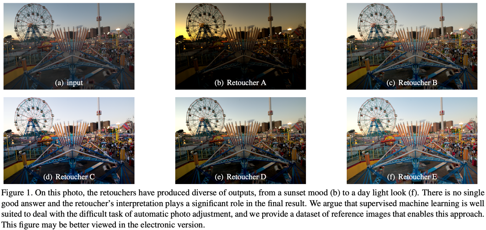

## 2. Motivation

본 논문에서는 사진 보정이라는 작업을 MIT-Adobe FiveK 데이터셋을 만들 때 사용한 방식처럼 global operation(e.g., brightness, contrast 변화 등 adobe lightroom 내장 함수를 이용하여 이미지 내 모든 픽셀에 영향을 주는 operations)을 이용하여 이미지를 보정하였다.
사진을 보정하기 위해 사용할 수 있는 global operation들의 예시로는 white balancing, brightness change, contrast adjustment, tone mapping등이 있다. 각 operation에 대한 구체적인 설명은 다음을 참고하면 좋다. ([Sec.3.1 retouching operations](#analysis-of-retouching-operations-fig-2-a))

이에 따라서 global operation을 수행할 수 있는 네트워크를 구성하였는데, 본 논문에서는 pixel-wise 1x1 convolution과 Global Feature Modulation(GFM)을 이용하여 동일한 동작을 할 수 있도록 네트워크를 설계하였다. ([Sec.3 Method](#3-method))
그 결과 아주 작은 convolutional neural network로 사진 보정 작업을 할 수 있게 되어서 굉장히 가볍고 빠르고 성능(PSNR)이 높은 네트워크 구조가 만들어졌다.

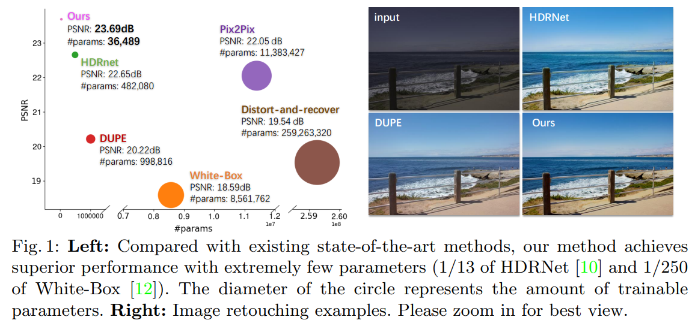

### Related work

- 전통적인 알고리즘
  - Histogram equalization
  - Aubry et al., Fast local laplacian filters: Theory and applications.
  - Durand et al., Fast bilateral filtering for the display of high-dynamic-range images. 

MIT-Adobe FiveK 데이터셋을 비롯한 여러 입력-전문가 쌍이 존재하지 않았기 때문에 인간의 직관 위주로 단순한 동작들만 수행하는 알고리즘이다. 딥러닝을 이용한 방식들처럼 학습시키는 비용은 없지만 inference 때의 시간이 긴 것도 있고 전반적으로 성능이 굉장히 낮기 때문에 특정 상황을 제외하고는 잘 사용하지 않는다.

- CNN을 이용한 image-to-image translation으로 접근한 모델들
  - Gharbi et al., Deep bilateral learning for real-time image enhancement.
  - Chen et al., Deep photo enhancer: Unpaired learning for image enhancement from photographs with gans.
  - Isola et al., Image-to-image translation with conditional adversarial networks. 

사진 보정이라는 작업은 특정 위치에만 작용하는 것이 아니라 이미지 전체에 작용하는데, 위처럼 CNN을 이용하여 image-to-image translation처럼 문제를 접근한다면 함수를 필요 이상으로 복잡하게 만드는 것이다. 즉 불필요한 capacity 낭비를 하고 있는 것이다. On device에서 작동해야 하는 사진 보정 작업에서 이러한 capacity의 낭비는 더욱 심각한 문제가 될 수 있다.

- CNN 중 특히 illumination map을 예측하여 마치 residual처럼 원래의 raw input에 연산해주는 방식
  - Fu et al., A weighted variational model for simultaneous reflectance and illumination estimation.
  - Wang et al., Underexposed photo enhancement using deep illumination estimation.

Pix2Pix처럼 image 전체를 바로 생성하는 것보다 주로 underexposed 설정에서 모든 픽셀의 값들을 증폭시켜줄텐데 얼마나 증폭시켜줄지 결정하는 계수인 illumination map이라는 개념을 이용하여 raw input에 곱해주는 방식을 사용한다. 이 때 illumination map을 smoothing 해주는 등으로 원하지 않는 local artifact를 줄이려고 노력하지만 qualitative 결과를 보면 global operation만 사용한 CSRNet에 비해 artifact를 확인할 수 있다.

- Global operation들을 각각 action으로 보고 강화학습으로 접근한 모델들
  - Park et al., Distort-and-recover: Color enhancement using deep reinforcement learning.
  - Mnih et al., Human-level control through deep reinforcement learning.

먼저 강화학습에 사용된 함수들이 너무 단순하기 때문에 최종적으로 함수들을 조합했을 때 전문가가 보정한 방식의 결과물을 얻기가 어려워 성능이 낮고 강화학습의 특성 상 모델의 크기가 굉장히 크고 느린 것을 확인할 수 있다. (fig. 1 참고)

### Idea

위에서 언급한 구조들과 반대로 global operation이라는 점에 초점을 맞춰 부수적인 작동을 할 여지가 있는 구조들을 덜어내고 1x1 conv, GFM을 이용하여 MIT-Adobe FiveK 데이터셋에 최적인 구조를 설계하였다. 이를 통해 Fig. 1에서 보여준 것과 같이 압도적으로 적은 파라미터 수를 가지고 state-of-the-art 성능을 이끌어 낼 수 있었다.

## 3. Method

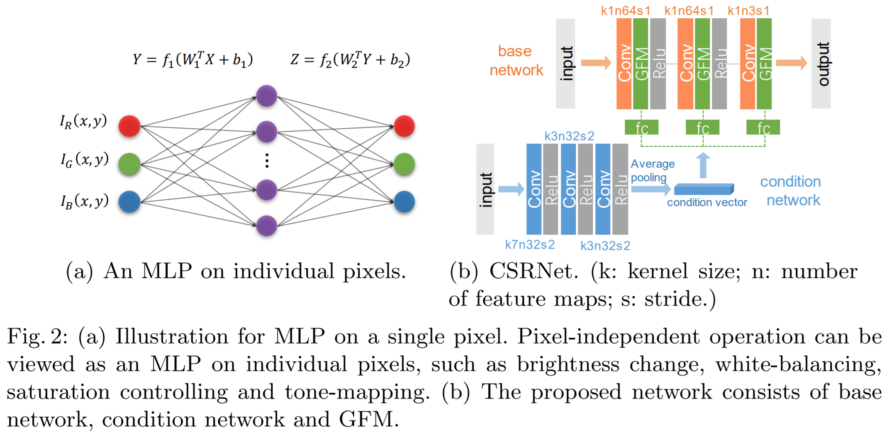

### Analysis of Retouching Operations (Fig. 2 (a))

모델 구조를 설명하기에 앞서서 1x1 convolution과 GFM을 이용하면 보편적으로 사용하는 보정 함수와 동등한 capacity를 갖는다는 것을 보이도록 하겠다. 

- Global brightness change

밝기라는 luminance map은 (R, G, B) 세 개의 차원에서 Y라는 하나의 차원으로 바뀌어 표현할 수 있다. I.e., $$I_Y = 0.299 * I_R + 0.587 * I_G + 0.114 * I_B$$ 로 표현된다. Gray scale과 또 조금 다르게 1/3 이 아닌 것은 사전에 이론적으로 정의된 밝기라는 것의 정의라고 생각하면 된다. 밝기를 global하게 올리거나 내린다는 것은 다음과 같이 표현할 수 있다.

$$ I'_Y (x, y) = \alpha I_Y (x, y) $$

이는 RGB 채널 각각에 $$\times \alpha$$ 를 해주는 것과 동일하다. 즉 채널별 각각의 곱이므로 3차원 - 3차원 1x1 convolution으로 생각해보면 각 필터의 파라미터가 R, G, B 돌아가면서 $$\alpha$$ 이고 나머지의 값은 0인 kernel 필터를 생각해보면 동일하게 만들 수 있다.

- Contrast adjustment

대비를 조정하는 방법에는 여러 방법이 존재하지만 그 중 대표적으로 제일 많이 사용되는 것은 다음 수식과 같다.

$$ I' (x, y) = \alpha I(x, y) + (1-\alpha) \bar{I} $$

이 때 $$\bar{I} = \frac{1}{M\times N} \sum_{x=0}^{M-1}\sum_{y=0}^{N-1} I(x,y)$$ 으로 모든 픽셀 간 평균이다. 이번에도 모든 픽셀에 동등하게 $$\times \alpha$$를 해주고 또 동등하게 $$(1-\alpha) \bar{I}$$를 더해주는 것을 확인할 수 있는데 global brightness change에서 해주었던 것과 같이 1x1 convolution에 bias로 $$(1-\alpha) \bar{I}$$를 더해주는 것으로 생각하면 된다. (단, 이 때 전체 픽셀값의 평균을 구해서 bias로 넣어주어야 하는데 이 과정은 1x1 convolution만으로는 해결되지 않는다. 하지만 여전히 모든 픽셀에 동등한 operation을 해주는 것이므로 이 특성을 이용하여 GFM을 진행해준다. GFM에 대해서는 이후 모델의 구조에서 자세히 다루도록 하겠다. 간단하게 먼저 말하자면 AdaIN의 변형이다.)

- White-balancing

White-balancing은 global brightness change의 연장선으로 R, G, B 값을 동등하게 올리거나 내려주는 것이 아닌 서로 다르게 올려주거나 내려주는 작업이다. 이 작업은 보통 이미지 전체적으로 외부적, 내부적인 요인으로 붉은 빛이 도는 상황에서 전체적으로 R, G, B의 혼합 비율을 변경해주어 진짜 흰 색을 사진에서도 흰 색으로 보이도록 하는 작업이다. 이를 수식으로 나타내면 다음과 같다.

$$ I'_{RGB} = [I_R; I_G; I_B] \circ [\alpha_R; \alpha_G; \alpha_B] $$

이 역시도 global brightness change와 마찬가지로 1x1 conv로 나타낼 수 있다.

- Saturation controlling

Contrast adjustment가 이미지 평균 밝기에서 얼마나 멀리 또는 가까이 할 것인지 각각 외분, 내분 했던 것과 비슷하게 이번에는 이미지 R, G, B의 평균에서 얼마나 가까운지 먼지를 생각해 볼 수 있다. R, G, B의 평균이란 $$\bar{I}_{RGB} = \frac{1}{3}(I_R + I_G + I_B)$$로 다시 3차원으로 broadcasting 해보면 검은색부터 흰색으로 변화해가는 회색 중 한 값임을 확인할 수 있다. 이 회색 축에 각 점을 projection하면 위와 같은 평균인 $$\bar{I}_{RGB}$$가 나오는데 이 값에서 멀리 떨어지면 색감이 화려해지고 가까워지면 회색이 많이 낀 칙칙한 색감이 나오게 된다. 이를 조절해주는 식은 다음과 같다.

$$ I' (x, y) = \alpha I(x, y) + (1-\alpha) \bar{I}_{RGB} (x, y) $$

이 작업 역시 완벽하게 1x1 conv로 나타낼 수 있는데 R, G, B 3차원에서 이번에는 2-layer 1x1 conv를 상상해보자 4차원으로 한 번 hidden layer를 지난 후에 다시 3차원 final layer를 지나는 것이다. 첫 hidden layer로 가는 weight를 첫 세 노드는 각각 그대로 진행되도록 Identity mapping을 진행하고 새로운 하나의 노드는 가지고 있는 R, G, B 값의 평균을 구하도록 1/3, 1/3, 1/3의 파라미터를 갖도록 설정해보자. 그리고 이후에 각각 세 노드에서 Identity * $$\alpha$$, 평균으로부터 $$(1-\alpha)$$를 갖도록 설정하면 위에 정의된 수식과 정확히 동일한 작업을 한다는 것을 확인할 수 있다.

- Tone-mapping

마지막으로 tone-mapping은 일반인에게는 가장 어려운 함수이며 전문가에게는 가장 중요한 함수이다. 픽셀 값의 각 구간별로 어떤 값을 갖도록 할지를 결정하는 일종의 lookup table이며 이를 그림으로 나타내면 다음과 같다. 아래 그림에서 가로축이 원래 가지고 있었던 R, G, B의 intensity이고 세로축이 mapping할 intensity이다. 아래 그림과 같이 piecewise linear function으로 나타낼 수도 있고 Adobe lightroom에서처럼 연속적인 어떤 곡선으로 나타낼 수도 있는데 piecewise linear function으로 근사한 함수는 1x1 conv로 나타낼 수 있다.

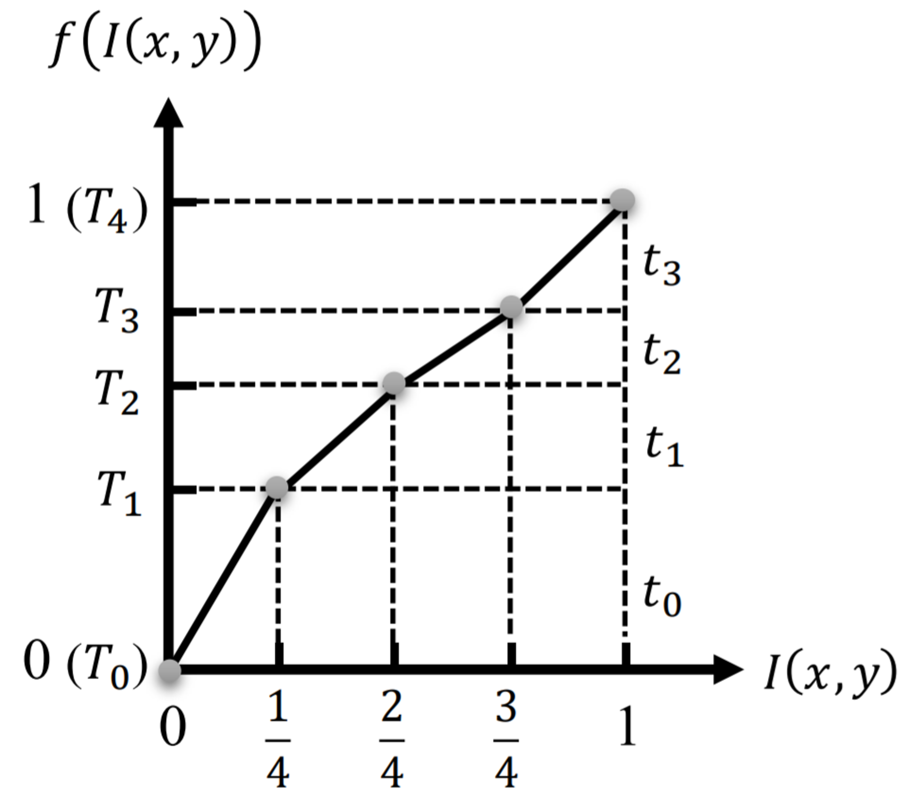

위 그림에 그려져있는 것과 같이 $$L$$등분 되어있고 각 구간별 $$y$$축의 차이가 $$t_0, t_1, t_2, t_3$$로 되어있는 함수를 수식적으로 나타내면 다음과 같다. 

$$ f(I(x, y)) = \sum_{i=0}^{L-1} clip(L * I(x, y) - i, 0, 1) * t_i $$

함수 $$clip(x, min, max)$$는 $$x$$의 값을 최소 $$min$$, 최대 $$max$$로 맞춰주기 위해서 clipping을 진행해 준 것이다. 이해를 돕기 위해 예시로 input으로 $$7/8$$을 들어보자면 4등분이 되어있기 때문에 4를 곱해주고 총 4개의 node에서 각각 $$0, 1, 2, 3$$을 빼준다. 그러면 한 node를 제외한 나머지는 clip이 되는데 이 경우에서는 $$1, 1, 1, 1/2$$가 나오게 된다. 이를 통해 활성화되는 구간을 찾을 수 있고 각각 $$t_0, t_1, t_2, t_3$$를 곱해서 더해주면 원하는 값인 $$t_0 + t_1 + t_2 + \frac{1}{2} t_3$$이 도출된다. 이를 1x1 conv로 그대로 해석할 수 있으므로 tone-mapping 역시 1x1 conv만으로 구현할 수 있다.

### Conditional Sequential Retouching Network (Fig. 2 (b))

- Base network: 위에서 언급한대로 base network는 1x1 conv network로만 구성되어 있어도 충분한 capacity를 갖기 때문에 1x1 conv로만 구성되어 있다.
- Condition network: input을 또 다른 곳에서 입력으로 받는 네트워크이다. 다른 related work과 다르게 본 구조에서는 decoder가 존재하지 않기 때문에 이미지의 전체적인 특징을 받아서 하나의 condition vector를 만들어 내는 것을 목적으로 한다.
- Global Feature Modulation: Condition network에서 나온 condition vector를 받아서 base network에 부족한 부분을 채워주는 modulation이다. Instance Normalization(IN) 또는 AdaIN과 굉장히 유사한 구조로, 수식으로 나타내면 다음과 같다. AdaIN과의 차이는 기존 feature map을 normalization하지 않는다는 것으로 이 때문에 contrast adjustment와 같은 작업에서 IN보다 더 적합하다고 할 수 있다.

$$ GFM(x_i) = \gamma * x_i + \beta $$

### Illustration

결과적으로는 학습가능한 파라미터들을 이용하여 위 retouching operation을 수행하겠다는 것이기에 직접적으로 retouching operation을 사용하지는 않는다. 함수 내부에서 어떻게 수행하는지 간단하게 나타내보면 다음과 같다.

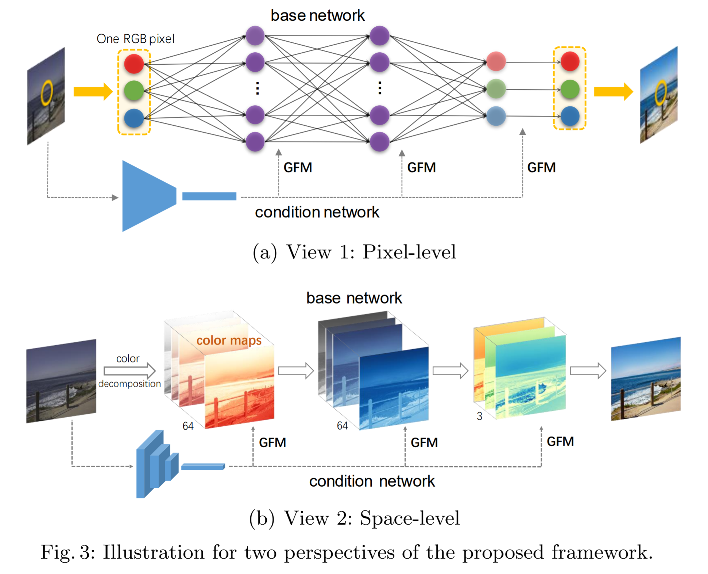

이 두 그림은 1x1 convolution으로만 이루어진 네트워크가 어떻게 global operation을 만들어내는지 이해를 돕기 위한 pixel, space view이다.
새로운 것을 보여준다기보다 retouching operation을 implicit하게 64 차원에서 어떻게 작동하는지 정성적으로만 보여주는 그림이다. 
이는 그림으로 확인하기보다 성능과 결과 사진으로부터 확인하는 것이 더 좋다.

## 4. Experiment & Result

### Experimental setup

- Dataset: MIT-Adobe FiveK, 총 5000장의 input, expert A, B, C, D, E가 존재한다.
- Baselines: White-box, Distort-and-Recover, HDRNet, DUPE, Pix2Pix
- Training setup: 4500장을 train set으로 사용하고 single expert에 대한 실험만 가능한 구조이기 때문에 supervised setting에서 기존 실험들처럼 expert C를 기준으로 실험하였다. (Table에 보면 두 row로 나뉘는데 DUPE와 DPE의 input 사진이 설정이 조금 다르다.)
- Evaluation metric: Expert C와의 PSNR을 정량적으로 잰 후에 prediction한 결과를 qualitative하게도 보여준다.

### Result

- Quantitative result

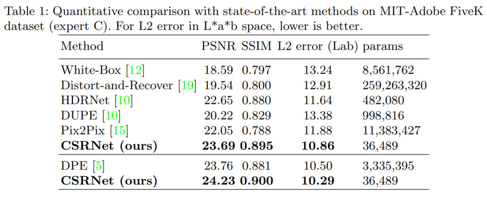

타 모델들에 비해 파라미터 수도 압도적으로 적고 성능을 나타내는 PSNR 역시 가장 높은 것을 알 수 있다.

- Qualitative result

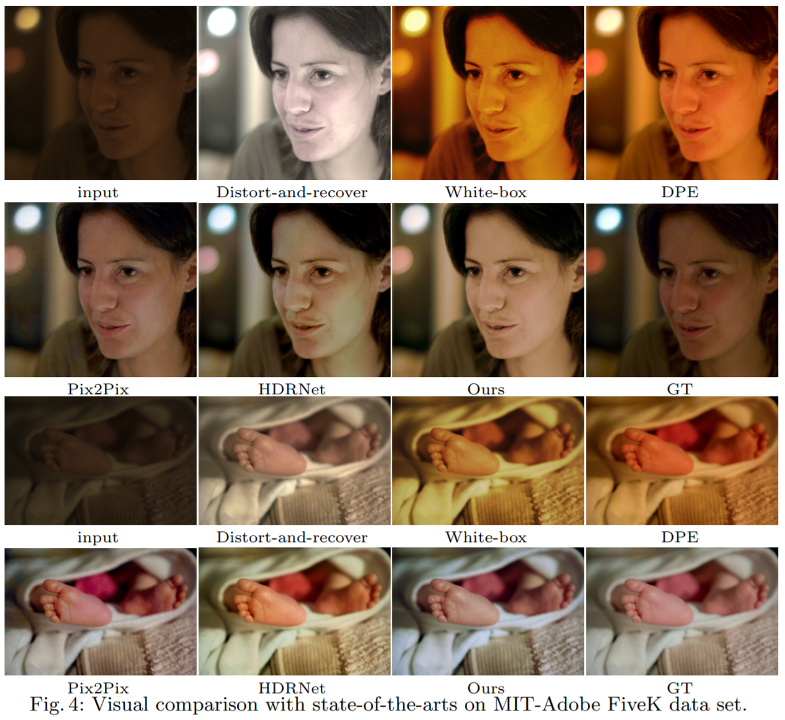

Qualitative하게 보면 Distort-and-recover, White-box, DPE에서는 입력 사진으로부터 거의 새로운 출력 사진을 만들어내야 하기 때문에 모든 사진들에 대해서 비슷하게 이미지 전체에 붉은 기가 도는 global artifact를 볼 수 있고, 실제로 이미지를 생성해내기 때문에 input 사진에는 없던 여자의 볼 쪽 초록색 local artifact가 생기는 HDRNet를 확인할 수 있다. pix2pix 또한 아기의 발 사진을 보면 영역별로 색감이 두드러지도록 enhancing 하였는데 ground-truth에는 존재하지 않는 local artifact로 볼 수 있다. 이에 반해 모델 자체가 global operation만 진행하기 때문에 그 안에서 capacity를 최대한 활용하는 것을 확인할 수 있었다.

- User Study

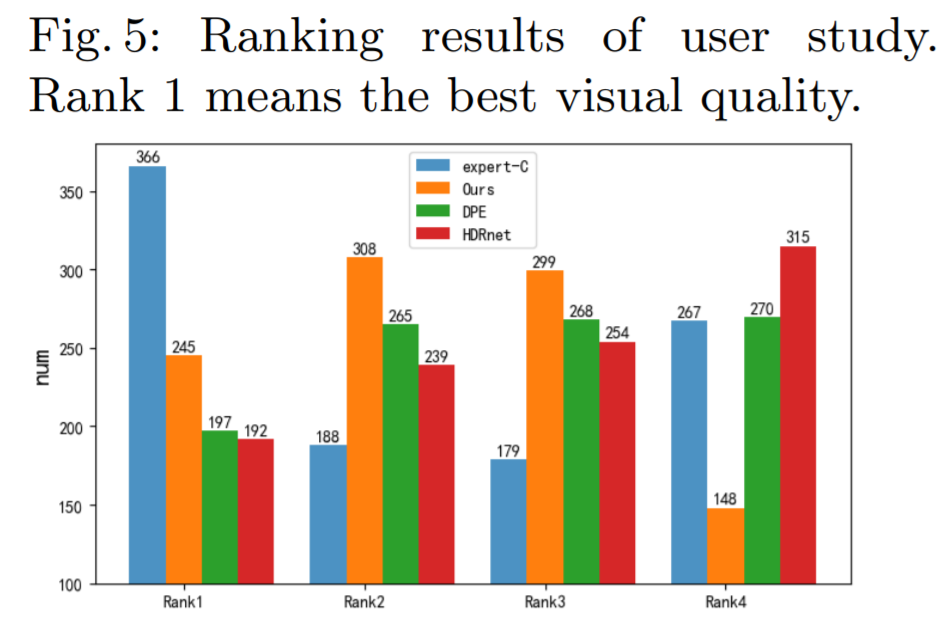

### Multiple Styles and Strength Control

기본적으로 intro.에서 언급한 것 처럼 전문가들 조차 하나의 사진을 보정하는 방식이 다양하게 존재한다. 그렇기 때문에 이 작업을 multi-expert에 대해서 작동할 수 있도록, 또는 다양한 답을 낼 수 있도록 하는 고민이 필수적으로 들어간다. 본 논문에서는 이 문제를 조금 특별한 방법을 통해서 해결하려고 노력하였다. 아래 테이블을 보면 각각의 expert에 대해서 본 모델을 scratch부터 학습한 결과와 finetune 한 결과가 놓여져있다. 이 때 finetune이란 전체 모델을 expert C로 학습한 다음 전체 모델을 finetune 한다는 것이 아니라 base network는 condition network에서 시키는대로 retouching을 한다는 생각 아래에서 condition network만 finetuning하고 base network는 freeze해서 좀 더 flexible하게 multi-expert를 해결하려고 시도하였다. 그 결과 역시 아래 표와 같이 비슷하거나 더 좋은 결과를 보여준다는 것을 확인할 수 있다.

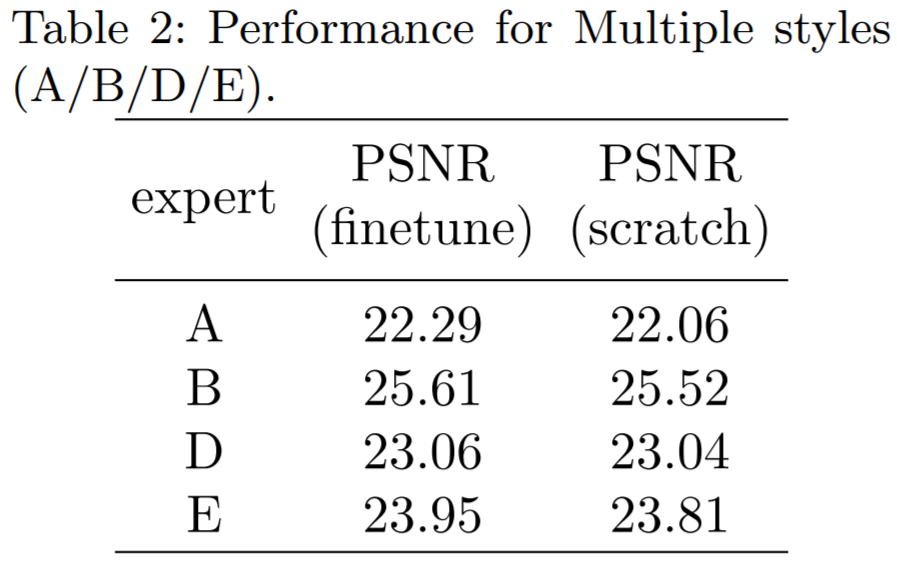

### Ablation Study

본 모델의 구조에서 다른 모든 retouching operation을 학습시킬 때 condition network의 효용을 확인할 수 있다. Supplementary에서 확인할 수 있었던 것은 실제로 밝기, 대비, tone-mapping에 대해서 변화를 준 것을 fitting 시키려고 할 때 condition network가 없어도 다른 모든 operation은 학습할 수 있는데 contrast만 학습하지 못하는 것을 확인할 수 있다.

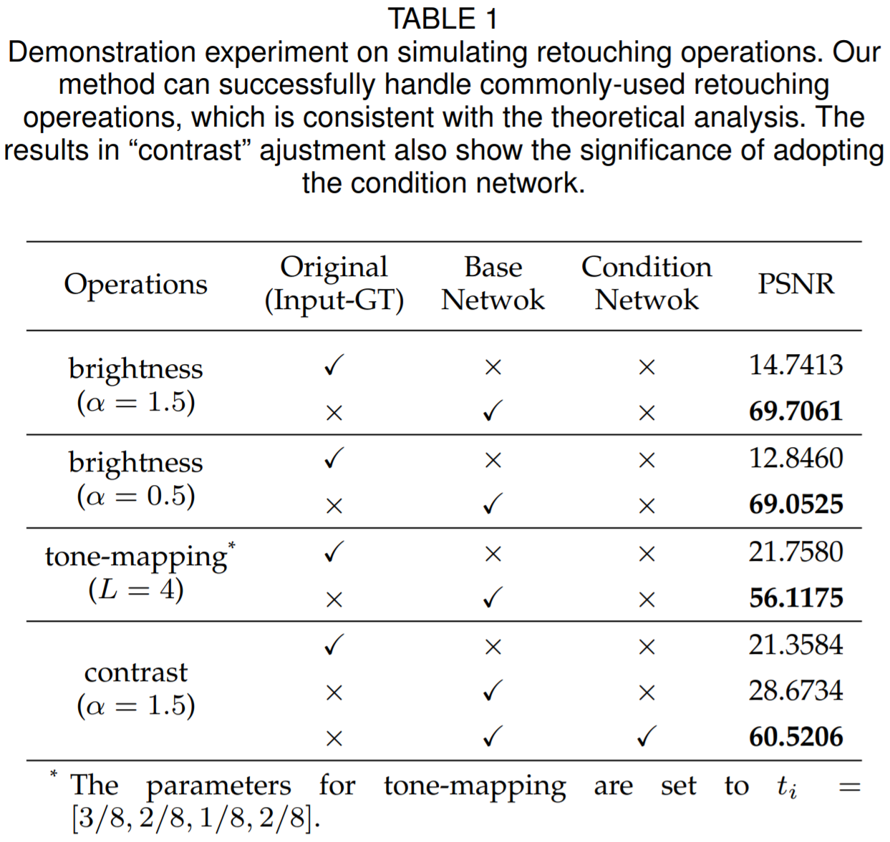

이에 따라서 실제 실험에서 진행한 ablation을 보면 condition network가 빠지면 contrast adjustment등의 작동을 하지 못하기 때문에 전체적인 성능이 떨어지는 것을 확인할 수 있다.

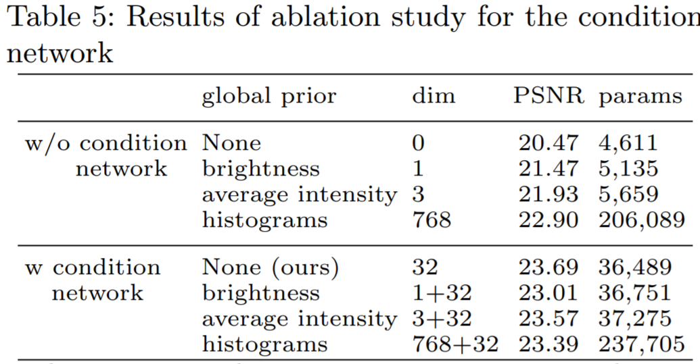

## 5. Conclusion

결론적으로 본 모델에서는 사진 보정에 대한 여러 함수의 깊이있는 이해를 바탕으로 단순히 CNN을 사용하는 것이 아니라 CNN의 파라미터가 정말 필요한지를 생각해보아 3x3 conv가 항상 옳지는 않다는 것을 보였으며, instance normalization과 비슷한 GFM이라는 방식을 통해 이미지 전체에 대한 정보를 주입하는 것을 효과적으로 이루었다. 그 결과 가장 적은 파라미터를 이용하여 state-of-the-art의 성능을 얻었다.

### Take home message \(오늘의 교훈\)

> 훌륭한 engineering을 위해서는 task에 대한 깊이있는 이해가 필요하다.

## Author / Reviewer information

### Author

**박민호 \(Minho Park\)** 

* KAIST AI
* email: m.park@kaist.ac.kr

<!-- ### Reviewer

1. Korean name \(English name\): Affiliation / Contact information
2. Korean name \(English name\): Affiliation / Contact information
3. ... -->

## Reference & Additional materials

1. He, Jingwen, et al. "Conditional sequential modulation for efficient global image retouching." European Conference on Computer Vision. Springer, Cham, 2020.
2. Official GitHub repository: https://github.com/hejingwenhejingwen/CSRNet
3. Chen, Y.S., Wang, Y.C., Kao, M.H., Chuang, Y.Y.: Deep photo enhancer: Unpaired learning for image enhancement from photographs with gans. In: Proceedings of the IEEE Conference on Computer Vision and Pattern Recognition. pp. 6306–6314 (2018)
4. Gharbi, M., Chen, J., Barron, J.T., Hasinoff, S.W., Durand, F.: Deep bilateral learning for real-time image enhancement. ACM Transactions on Graphics (TOG) 36(4), 1–12 (2017)
5. Isola, P., Zhu, J.Y., Zhou, T., Efros, A.A.: Image-to-image translation with conditional adversarial networks. In: Computer Vision and Pattern Recognition (CVPR), 2017 IEEE Conference on (2017)
6. Hu, Y., He, H., Xu, C., Wang, B., Lin, S.: Exposure: A white-box photo postprocessing framework. ACM Transactions on Graphics (TOG) 37(2), 1–17 (2018)
7. Park, J., Lee, J.Y., Yoo, D., So Kweon, I.: Distort-and-recover: Color enhancement using deep reinforcement learning. In: Proceedings of the IEEE Conference on Computer Vision and Pattern Recognition. pp. 5928–5936 (2018)
8. Wang, R., Zhang, Q., Fu, C.W., Shen, X., Zheng, W.S., Jia, J.: Underexposed photo enhancement using deep illumination estimation. In: Proceedings of the IEEE Conference on Computer Vision and Pattern Recognition. pp. 6849–6857 (2019)
9. Liu, Yihao, et al. "Very lightweight photo retouching network with conditional sequential modulation." arXiv preprint arXiv:2104.06279 (2021).