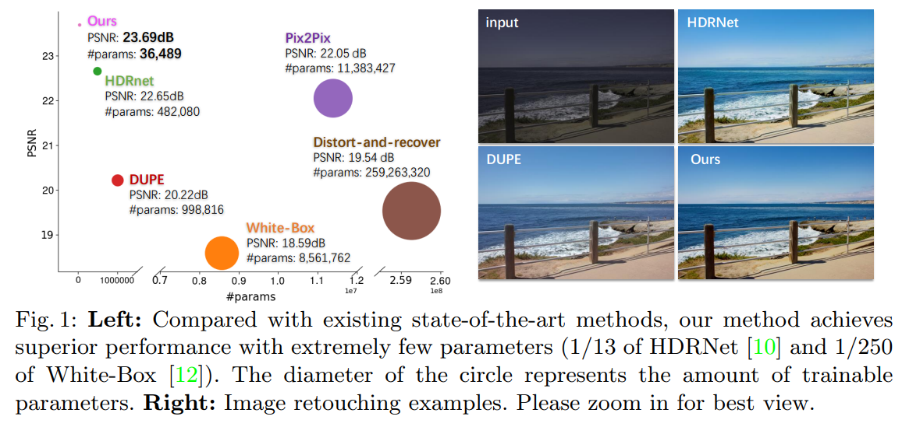

# Conditional Sequential Modulation for Efficient Global Image Retouching \[Kor\]

##  1. Problem definition

밝기(brightness), 대비(contrast), 포화도(saturation) 등을 이용한 사진 보정이라는 작업은 전문성이 없는 일반인들에게 굉장히 어려운 작업이다. 사진 보정에 숙련된 전문가도 이미지에 따라서 심지어 이미지가 고정되더라도 어떤 조합의 사진 보정을 사용할지는 굉장히 다양하기 때문에 어려운 작업이다. 이처럼 일반 사람 뿐만 아니라 전문가를 위해서 사진 보정을 자동화해주는 작업이 문제로 대두되었다. 본 연구를 위해서 사용한 MIT-Adobe FiveK 데이터셋은 사진 보정의 작업을 raw 입력과 다섯 명의 expert가 이미지 별로 짝을 이루어 보정한 데이터셋이기 때문에 supervised learning으로 진행할 수 있다. 

## 2. Motivation

본 논문에서는 사진 보정이라는 작업을 MIT-Adobe FiveK 데이터셋을 만들 때 사용한 방식처럼 global operation에 주목하였다. 사진 보정에 주로 사용되는 함수들을 이미지의 픽셀 별 1x1 convolution과 이미지 전체에 동일하게 영향을 주는 Global Feature Modulation(GFM)을 이용하여 동치임을 보였다. 즉 네트워크의 구조를 1x1 convolution과 condition network에서부터 나오는 GFM으로만 이루어진 네트워크를 설계하고 implicit하게 사진 보정 함수들이 만들어질 수 있도록 학습하였다. 그 결과 굉장히 가볍고 빠르고 성능(PSNR)이 높은 네트워크 구조가 만들어졌다.

### Related work

- 전통적인 알고리즘
  - Histogram equalization
  - Aubry et al., Fast local laplacian filters: Theory and applications.
  - Durand et al., Fast bilateral filtering for the display of high-dynamic-range images. 

MIT-Adobe FiveK 데이터셋을 비롯한 여러 입력-전문가 쌍이 존재하지 않았기 때문에 인간의 직관 위주로 단순한 동작들만 수행하는 알고리즘이다. 딥러닝을 이용한 방식들처럼 학습시키는 비용은 없지만 inference 때의 시간이 긴 것도 있고 전반적으로 성능이 굉장히 낮기 때문에 특정 상황을 제외하고는 잘 사용하지 않는다.

- CNN을 이용한 image-to-image translation으로 접근한 모델들
  - Gharbi et al., Deep bilateral learning for real-time image enhancement.
  - Chen et al., Deep photo enhancer: Unpaired learning for image enhancement from photographs with gans.
  - Isola et al., Image-to-image translation with conditional adversarial networks. 

사진 보정이라는 작업은 특정 위치에만 작용하는 것이 아니라 이미지 전체에 작용하는데, 위처럼 CNN을 이용하여 image-to-image translation처럼 문제를 접근한다면 함수를 필요 이상으로 복잡하게 만드는 것이다. 즉 불필요한 capacity 낭비를 하고 있는 것이다. On device에서 작동해야 하는 사진 보정 작업에서 이러한 capacity의 낭비는 더욱 심각한 문제가 될 수 있다.

- CNN 중 특히 illumination map을 예측하여 마치 residual처럼 원래의 raw input에 연산해주는 방식
  - Fu et al., A weighted variational model for simultaneous reflectance and illumination estimation.
  - Wang et al., Underexposed photo enhancement using deep illumination estimation.

Pix2Pix처럼 image 전체를 바로 생성하는 것보다 주로 underexposed 설정에서 모든 픽셀의 값들을 증폭시켜줄텐데 얼마나 증폭시켜줄지 결정하는 계수인 illumination map이라는 개념을 이용하여 raw input에 곱해주는 방식을 사용한다. 이 때 illumination map을 smoothing 해주는 등으로 원하지 않는 local artifact를 줄이려고 노력하지만 qualitative 결과를 보면 global operation만 사용한 CSRNet에 비해 artifact를 확인할 수 있다.

- Global operation들을 각각 action으로 보고 강화학습으로 접근한 모델들
  - Park et al., Distort-and-recover: Color enhancement using deep reinforcement learning.
  - Mnih et al., Human-level control through deep reinforcement learning.

먼저 강화학습에 사용된 함수들이 너무 단순하기 때문에 최종적으로 함수들을 조합했을 때 전문가가 보정한 방식의 결과물을 얻기가 어려워 성능이 낮고 강화학습의 특성 상 모델의 크기가 굉장히 크고 느린 것을 확인할 수 있다. (fig. 1 참고)

### Idea

After you introduce related work, please illustrate the main idea of the paper. It would be great if you describe the idea by comparing or analyzing the drawbacks of the previous work.

## 3. Method


If you are writing **Author's note**, please share your know-how \(e.g., implementation details\)


The proposed method of the paper will be depicted in this section.

Please note that you can attach image files \(see Figure 1\).  
When you upload image files, please read [How to contribute?](../../how-to-contribute.md#image-file-upload) section.

We strongly recommend you to provide us a working example that describes how the proposed method works.  
Watch the professor's [lecture videos](https://www.youtube.com/playlist?list=PLODUp92zx-j8z76RaVka54d3cjTx00q2N) and see how the professor explains.

## 4. Experiment & Result


If you are writing **Author's note**, please share your know-how \(e.g., implementation details\)


This section should cover experimental setup and results.  
Please focus on how the authors of paper demonstrated the superiority / effectiveness of the proposed method.

Note that you can attach tables and images, but you don't need to deliver all materials included in the original paper.

### Experimental setup

This section should contain:

* Dataset
* Baselines
* Training setup
* Evaluation metric
* ...

### Result

Please summarize and interpret the experimental result in this subsection.

## 5. Conclusion

In conclusion, please sum up this article.  
You can summarize the contribution of the paper, list-up strength and limitation, or freely tell your opinion about the paper.

### Take home message \(오늘의 교훈\)

Please provide one-line \(or 2~3 lines\) message, which we can learn from this paper.

> All men are mortal.
>
> Socrates is a man.
>
> Therefore, Socrates is mortal.

## Author / Reviewer information


You don't need to provide the reviewer information at the draft submission stage.


### Author

**Korean Name \(English name\)** 

* Affiliation \(KAIST AI / NAVER\)
* \(optional\) 1~2 line self-introduction
* Contact information \(Personal webpage, GitHub, LinkedIn, ...\)
* **...**

### Reviewer

1. Korean name \(English name\): Affiliation / Contact information
2. Korean name \(English name\): Affiliation / Contact information
3. ...

## Reference & Additional materials

1. Citation of this paper
2. Official \(unofficial\) GitHub repository
3. Citation of related work
4. Other useful materials
5. ...

