# End-to-End Object Detection with Transformers [Eng]

This article will walk you through a detailed explanation of the paper titled "End-to-End Object Detection with Transformers". Moreover, illustrative examples will be added, to better understand some of the concepts that were not explicitly explained by the authors of the paper.

# I- Problem Definition:

To begin with, let's first understand the main goal of this paper. As the title suggests, this paper presents a model that was mainly designed to solve two problems:

1. Perform **object detection** tasks on a given image, as shown in Fig. 1. And the model is said to be successful in detecting objects, if it can provide two main pieces of information:
    - Bound each object of interest by a ***bounding box***.
    - Predict the ***Label/class*** of each bounded object.
2. Make **it end-to-end:** This is achieved by removing the manual post-processing steps. These steps were usually added by the designers of the previous object detection models. But DETR (**DE**tection with **TR**ansforms) aims to replace these post-processing steps with neural network blocks. This is done so that the model does not rely heavily on prior knowledge of the task in hand, but rather learn it by itself!

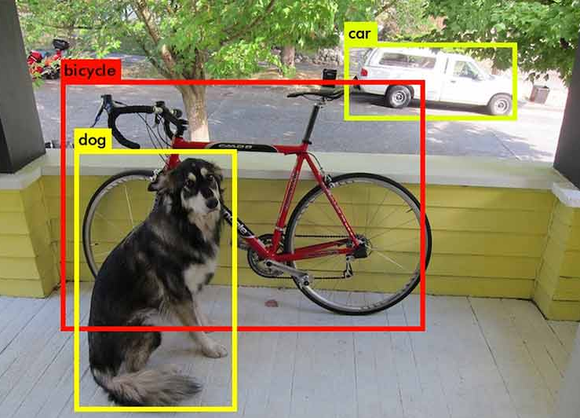

Object detection itself was, and still is, a very challenging task in computer vision. There are dozens of methods that try to approach this problem in different ways. But each method has its own limitations. And what the authors of DETR tried to achieve with their model, is to reduce the limitations of the previously published methods as it will be explained in details in the following sections.

# II- Motivation & Idea:

As mentioned before, the work that was published before this paper relied a lot on some manually designed post-processing steps. And one of this paper's goals, is to eliminate all of these post-processing steps; hence, the name "End-to-end object detection".

Let's now discuss what are these post-processing steps and why they were important in the previous models.

### 2.1 Non-maximum Suppression (NMS):

**Brief goal of NMS: To remove duplicate bounding boxes that refer to the same object.**

Researchers have created many models that can detect objects in an image, and then predict the bounding box that encapsulates these objects. These models output, is of a tuple type, as in  $$y_i=(c_i, b_i)$$, where  $$c_i$$ is the predicted class for object $$(i)$$ in the image, and $$b_i$$ is the box that bounds that object. 

Nonetheless, due to the fact that many objects can be found in one image, and that there is no limit to the number of objects, the models were sometimes confused by bounding the same object more than one time! That is because the models are not perfect, and that they are still learning. Take a look at Fig. 2, to visualize this phenomenon. In this figure, we can find that the same dog was predict around 5 times with different bounding boxes. This is because the model thinks that each time its finding a new object (dog) in the scene. In order to solve this problem, researchers have used the famous NMS method. This method is used to "**suppress**" certain features that do not provide maximum score in a given function.

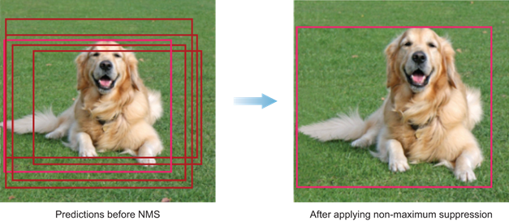

So, in order to use the NMS, we need to define a function that takes these bounding boxes as input, and spits out the scores of each bounding box. Without going deep into the details of this function, it basically searches for the prediction with the most confidence (highest label probability) in the list of all predicted objects $$y=[y_1, y_2, ..., y_n]$$. The algorithm then assumes that the bounding box that corresponds to this prediction, is indeed a true bounding box for an object in that image. So by now it starts investigating the other bounding boxes to find if these bounding boxes are actually referring to the same object, which in this case means that they are duplicates for the same object. So what it does, is that it computes a score that is going to be close to 1, if the bounding boxes almost cover the same area, and that will be 0 if the bounding boxes do not coincide with each other. This score is given by a function that is called **Intersection-over-Union** or **IoU** for short. So, this function will be fed with two bounding boxes, and it will compute the area of intersection between the two bounding boxes over the area of the Union of the two bounding boxes, as seen in Fig. 3.

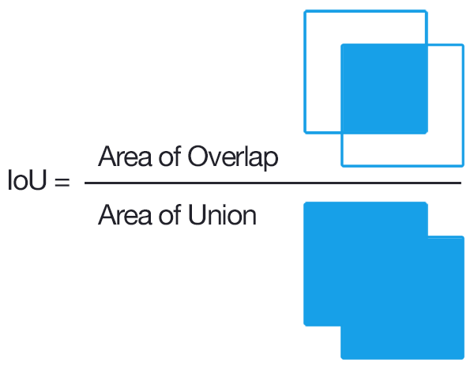

By giving two bounding boxes (bb1, bb2) to IoU function, we can see that if they are identically the same, then their intersection will be the same as their union, which will result in $$IoU(bb_1, bb_2)=1$$. On the other hand, if they didn't intersect at all, then $$IoU(bb_1, bb_2)$$ will be zero. So these two cases are the extreme cases, and for the values inbetween 0 and 1, as the IoU gets closer to 1, it will indicate that the boxes may refer to the same object, and as the IoU's value get's closer to 0, this will give the intuition that these two bounding boxes refers to different objects in the image.

So what the researchers did, in models prior to DETR, is to predict a set of bounding boxes along with a set of labels for each bounding box, and then do the following steps (performing **NMS**):

- **Find the bounding box with the highest class prediction:** As an example, consider an image that includes 5 different objects. And now consider that all of them were detected and that the model had the following output:
    
    $$[(dog 92\%, bb_1), (cat 80\%, bb_2), (dog 99\%, bb_3), (dog 97\%, bb_4), (cat 84\%, bb_5)]$$
    
    In this case, this step will choose $$bb_3$$, because it has the highest prediction probability/confidence.
    
- **Compute IoU** **between the bounding box found in the previous step** (in this case $$bb_3$$) **and all the other boxes.**
- **Remove the bounding boxes that will result in IoU lower than a certain threshold**, most probably the threshold is set to be 0.7.

By following these steps, researchers have managed to remove duplicated predictions in their object detection pipelines. However, as it can be seen, this method is not optimal, as it depends on many assumptions that are not usually valid assumptions. Not to mention that it makes the prediction process, reliant on the designers prior knowledge of the task in hand. This is also bad, since it is better to make the model learn everything by itself, without enforcing our knowledge in such a way.

### 2.2 Region Proposals:

Images used in object detection tasks, usually have higher resolution than those used in other deep learning tasks. The problem with this, is that images with high resolution contain tons of different possible bounding boxes. So which bounding boxes should the model consider?! Luckily, this problem was solved (prior to DETR) by using what is known as **region proposals**.

Region proposals are a set of fixed number (fixed by the model's designer) of bounding boxes that are believed to contain objects within them. Most probably these region proposals are found based on heuristics (e.g. finding regions that contains blobs). So, they are based on hand made algorithms like selective search for example.

So the same disadvantages that were discussed in NMS, are also applied here as well. Which is that, these region proposals rely heavily on the designer, and that they are hand-designed and not learned by the model.

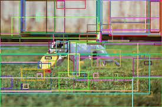

### 2.3 Related Work:

DETR's authors took advantage of many papers, but there work was directly influenced by three main ideas:

1. **Bipartite matching loss**
2. **Transformers**
3. **Object Detection**

So let's see them in details.

- **Bipartite matching loss:** in short, this is a scenario when you have **N** objects on one side and you want to match them with **N** objects ****on the other side, while keeping a cost function minimized. So each possible matching has its own computed loss, and we are searching for the matching that has the minimum loss. And this loss or cost function is to be defined by the user as $$\mathcal{L}_{match}(\hat{y},y)$$. See Fig. 5 as an example. As shown in that example, each object on the left, got connected with one and only one object on the right and vice versa. This can be achieved using the Hungarian algorithm.

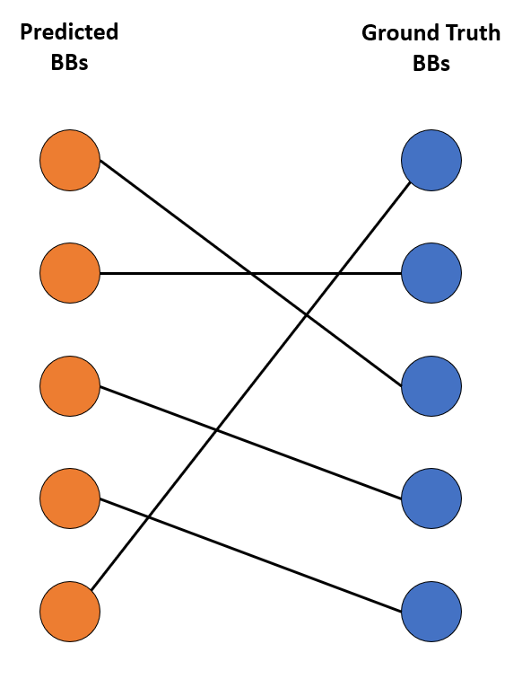

- **Transformers:** Transformers are unique and powerful types of layers that can be added to neural network models. They were initially used with language processing tasks as speech recognition, language translation, and some tasks that require the model to predict the next word in a series of words, etc. They are mainly powerful because they can be given a sequence of input of any size and they can also output another sequence with arbitrary size as well. They also have a powerful feature that inspired the authors of DETR to use them. The reason behind this powerful feature is the attention block, which is a block in the transformer module. The attention blocks are capable of finding relationships between different elements in a given sequence, no matter how long it is. Thus they are capable of having long memory like capabilities. Figure 6. shows the initial structure of a transformer block.

- **Object Detection:** This is obviously the core of the DETR model, thus this paper was compared to previous object detection architectures. In addition, the authors of DETR, mentioned the weaknesses in object detection models. Then they proved that DETR can handle most of these weakness in a smart way. So, prior to DETR, the state-of-the-art models were mainly R-CNN (region based CNNs), Fast R-CNN and Faster R-CNN, while Faster R-CNN being the top at that time in terms of speed and accuracy. But as mentioned before all of these variants of R-CNN relied on some post-processing steps such as NMS or they relied in intermediate steps where they generate region proposals. Fig. 7, shows the architecture of Faster R-CNN, which was directly compared with DETR by the authors.

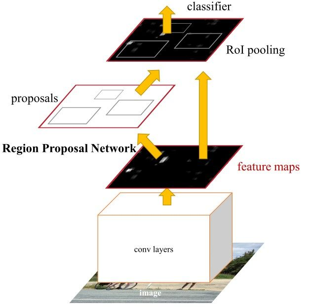

### 2.4 Idea:

The main idea and intuition that the authors had, was that the **transformers** that were usually used to work for language processing tasks, can actually be of high benefits here, in object detection tasks. Owing to the fact that they have these attention blocks that can relate each element of a sequence with the other elements in that sequence. In case of images, we can replace the sequence of words with a sequence of features or pixels, and by doing so, **the transformer will then be able to match pixels of the same object together because they share a common relation, which is that they all belong to the same object.** 

On the other hand, the authors had an amazing idea that could solve the duplication problem. Which is to **match each of the predicted bounding boxes with the true bounding boxes using the bipartite matching loss**. And by doing so, the model will now learn how to choose the proposed bounding boxes to not be duplicates of the same object.

# III. Method:

### 3.1 DETR Overall Architecture:

As it can be seen from Fig. 8, the architecture of DETR is quite simple compared to other state-of-the-art models.

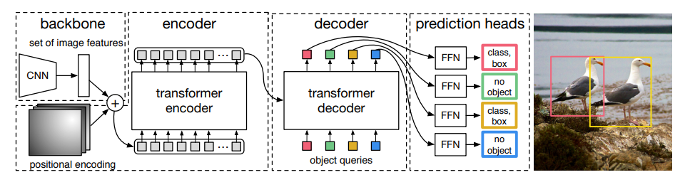

### 3.2 Backbone:

**The backbone in this architecture is simply a CNN that is used mainly to extract features from the image**. Any type of CNN will work, but the authors used ResNet, and ResNet-101 as their backbone models as they are really good at extracting features from images. Because this model uses a transform, this transformer needs to be fed with a sequence of data. Thus, the image features that were output from the CNN model, will then be flattened and concatenated with positional encodings and then fed to the transformer as an input. The positional encoding is used so that the position information of each pixel is not lost and so that it can be taken into consideration while training the transformer. In an intuitive manner, the position is important, because pixels that belong to the same object will have a relationship between each other in terms of their position.

<aside>
💡 **Without positional encoding the position information will be lost. Because transformers are permutation invariant, which means that they don't care about the order of the elements fed to them.**

</aside>

### 3.3 Transformer Encoder-Decoder:

The transformer takes the input and tries to encode its information using the encoder block. Which mainly outputs **Keys** and **Values** that are then used with the **Queries** in the decoder block. So basically what all of this means, is that the encoder, gives every flattened feature a value and a key to that value. And then we can think of the query as a certain random region in the image that asks the decoder if there is an object in it or not. And through the training process these regions are then optimized so that each query gives a unique and enlightening information about a region in the image, while ensuring that other queries covers the rest of the regions in the image. This is ensured, because the queries can communicate together through the attention blocks that are inside the transformer. 

After this communication between the the Values, Keys and Queries, the decoder then spits **N** learned positional embeddings. This number of embeddings is fixed as said earlier and is large enough to ensure that all the objects will be detected.

### 3.4 Feed-forward Networks (FFNs):

Each output embedding from the decoder block is then fed to a feed-forward network that consists of 3-layer perceptron with $$d$$ neurons, a ReLU activation function and a linear projection layer. The output of each feed-forward network will then be a prediction, which consists of a class label and a normalized bounding box. And of course since there will always be **N predictions,** then most of these predictions will just be garbage. Thus, the classes to be predicted are $$C+1$$, where $$C$$ is the number of classes of interest, and the added class represents the "no-object class ($$\emptyset$$)".

### 3.5 Training Loss:

The loss that is used during training is a combination of a negative-likelihood with a bounding box. And the formula for that loss is as follow:

$$\mathcal{L}_{Hungarian}(y,\hat{y})=\sum_{i=1}^{N}{[-log\hat{p}_{\hat{\sigma}(i)}(c_i)+\mathbb{1}_{c_i\neq\emptyset}\mathcal{L}_{box}(b_i, \hat{b}_{\sigma}(i))]}$$

The authors also reduced the weight of the log-likelihood probability of the "no-object" class by a factor of 10 to count for the class imbalance.

# IV. Experiment & Results:

The authors have tested different variants of DETR on the COCO dataset. Then they compared these variants with different types of Faster R-CNN models. And the results were as follow:

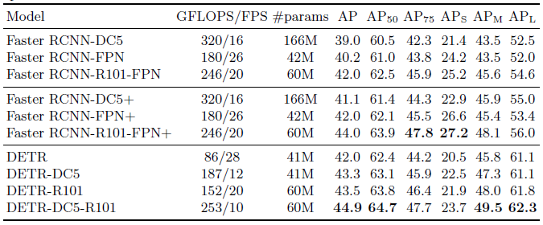

This shows that such a simple model, is not just capable of competing with complex models, but also it outperformed them in some metrics.

Also the authors tried to give intuition on how exactly the model works, by adding examples that illustrate the power of the transformers used in DETR. Fig. 9, shows that the encoder is capable of separating instances in the image, when it is given a reference point of that instance using the self-attention that is embedded in the transformer.

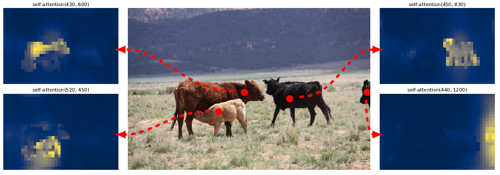

And the following image shows that the model can detect many objects in one image without having any trouble to do so.

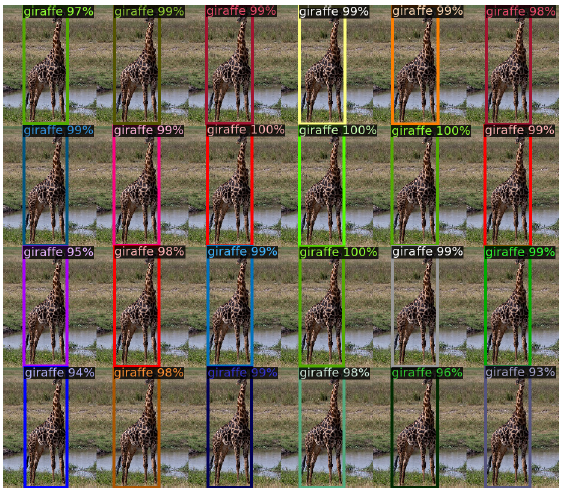

And the most astonishing result of them all, is the one that shows how the decoder learns to give importance to the edges of the same object. That's because these edges are the most important pixels that will contribute to creating the box that bounds that object.

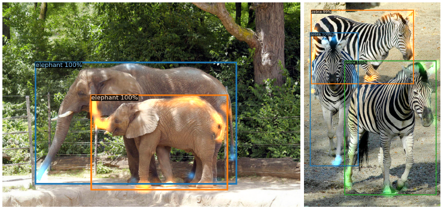

It is important to notice that the decoder successfully detected the foot of the elephant behind although it's occluded by the small elephant. And the same happens with the zebras.  

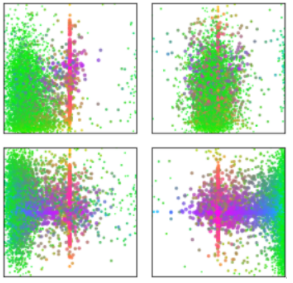

The figure above shows that each of the N inputs in the decoder learned to focus on one region in the image and to be specialized in it. It is similar to asking many people about what do they see in the image. But giving each one of them one region to focus on and specialize with.

At the end, the authors showed that the DETR model can be extended easily to cover other tasks, and that this is just the start for that model. They showed this by tweaking the DETR model so that it can adopt to the panoptic segmentation tasks, as shown below.

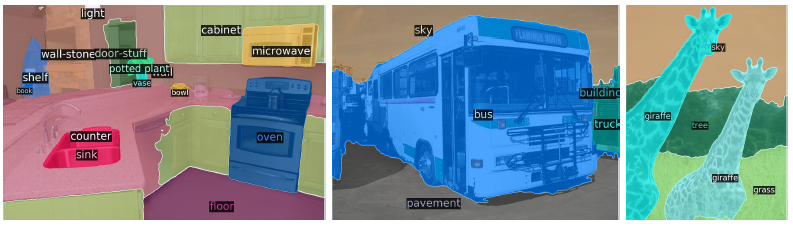

As seen from the figure above, panoptic segmentation is similar to semantic segmentation. However, the main difference is that panoptic segmentation does not only deal with countable objects (things), but it also detects noncountable objects (stuff) as skies, roads, floor, etc. In addition, panoptic segmentation is capable of differentiating different instances of the same object in an image by assigning different pixel values to each instance of them.

The authors also compared their results with state-of-the-art methods to proof, that it can compete with them just by a simple adjustment.

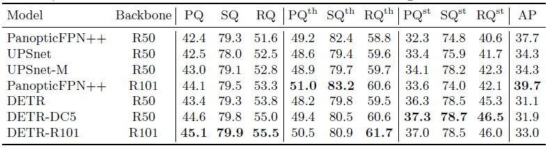

It is also important to mention that unlike previous models, DETR can global reason about the final set of predicted bounding boxes. Which means that DETR can look on different regions before giving the final prediction. For example, it can predict an object based on relationship or correlation between other objects in the image. So if DETR predicts a person standing on the beach, then it knows that a partially occluded object is more likely to be a surf board. On the other hand, other object detection models predict each object in isolation.

# V. Conclusion:

The paper showed a good solution to problems that were encountered by the previous state-of-the-art methods, such as the use of post-processing steps that were hand-crafted by the designer, and replaced them with powerful tools that can be learned autonomously. DETR, managed to solve replace NMS and region proposals by using the transformers and the bipartite matching loss. Which resulted in this powerful model named DETR. In addition, DETR was also capable of not solving the semantic segmentation tasks, but also it can extend to other tasks as well, as panoptic segmentation for example.

# Take Home Message:

> DETR has opened the way for transformers to be explored further more in tasks that are different from language processing. Which inspires many researchers around the world to come up with new and creative ideas for using transformers abilities in their favor.
> 

# Author / Reviewer information

## Author

**Ahmed Magd**

- contact: a.magd@kaist.ac.kr
- MS student, Robotics, KAIST
- Research Interest: computer vision with robotics

## reviewer

1. Korean name (English name): Affiliation / Contact information
2. Korean name (English name): Affiliation / Contact information
3. ...

# Reference & Additional materials

1. Carion, Nicolas, et al. "End-to-end object detection with transformers." *European Conference on Computer Vision*. Springer, Cham, 2020.
2. Vaswani, Ashish, et al. "Attention is all you need." *Advances in neural information processing systems*. 2017.
3. Ren, Shaoqing, et al. "Faster r-cnn: Towards real-time object detection with region proposal networks." *Advances in neural information processing systems* 28 (2015): 91-99.
4. Girshick, Ross. "Fast r-cnn." *Proceedings of the IEEE international conference on computer vision*. 2015.
5. Cai, Z., Vasconcelos, N.: Cascade R-CNN: High quality object detection and instance
segmentation. PAMI (2019)
6. Professor Justin Johnson's lectures-12-13-15: [https://www.youtube.com/playlist?list=PL5-TkQAfAZFbzxjBHtzdVCWE0Zbhomg7r](https://www.youtube.com/playlist?list=PL5-TkQAfAZFbzxjBHtzdVCWE0Zbhomg7r)
7. Analysis on DETR by Yannic Kilcher: [https://www.youtube.com/watch?v=T35ba_VXkMY](https://www.youtube.com/watch?v=T35ba_VXkMY)
