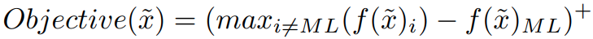

# FDA: Feature Disruptive Attack \[Kor\]

##  1. Problem definition
Deep neural network (DNN)는 이미지 분류, 물체 검출 등 다양한 컴퓨터 비전 분야에서 훌륭한 성능을 보입니다. 하지만 DNN은 이미지에 인간의 눈에 잘 인식되지 않는 작은 노이즈를 추가하여 만든 적대적 예제에 취약합니다. 이런 적대적 예제를 만드는 방법을 적대적 공격이라 합니다. 적대적 공격과 이를 막기 위한 방어 기법들이 제안되는 과정에서 네트워크의 취약성에 대한 연구가 이루어지고 이는 네트워크의 성능과 robustness를 향상시킬 수 있습니다. 따라서, 적대적 예제를 만드는 방법을 연구하는 것은 네트워크에 대한 이해와 성능 향상에 도움을 줍니다. 이미지 분류에서의 적대적 공격은 네트워크가 원본 이미지의 class로 인식하지 못하도록 이미지에 노이즈를 추가한 적대적 예제를 만드는 것을 말합니다. 기존의 적대적 공격들은 DNN의 마지막 부분에 해당하는 softmax 혹은 pre-softmax를 사용하여 적대적 예제를 생성합니다. 본 논문에서는 이렇게 생성한 적대적 예제는 두 가지 문제점이 있다고 말하고 있습니다. 첫 번째는 적대적 예제의 deep feature가 원본 이미지의 정보를 여전히 포함하고 있다는 점이고 두 번째는 network가 적대적 예제를 원본 이미지와 유사한 class로 인식하거나 원본 이미지로 예측하는 확률이 여전히 높다는 점입니다. 

## 2. Motivation

### Related work
1. FGSM  
    
원본 이미지를 $$x$$, 원본 이미지의 class를 $$y_{GT}$$, 네트워크의 cross entropy loss function J라고 했을 때 이미지 $$x$$에 대한 loss function의 gradient 부호를 이용하여 $$y_{GT}$$에 대한 loss function이 증가하는 방향으로 이미지를 업데이트합니다. 이 과정을 통해 네트워크가 원본 이미지의 class로 인식하지 못하도록 적대적 예제를 생성하는 방법이 FGSM (Fast Gradient Sign Method)이라고 합니다.
2. PGD  
FGSM 과정을 여러 번 반복한 공격 방법을 PGD 또는 I-FGSM (Iterative-FGSM)이라고 합니다.
이때 $$y_{GT}$$ 대신 가장 높은 확률로 예상되는 class인 $$y_{ML}$$을 사용하면 most-likely attack, PGD-ML이라고 합니다. $$y_{GT}$$ 대신 가장 낮은 확률로 예상되는 class인 $$y_{LL}$$을 사용하고 loss가 감소하는 방향으로 적대적 예제를 생성하는 것은 least likely attack, PGD-LL이라고 합니다.
3. CW attack  
    
여기서 $$f$$는 logit (pre-softmax 값)을 의미하며 두 번째로 높은 값을 가지는 logit에서 제일 높은 값을 가지는 logit 값을 뺀 값을 loss로 사용하고 이와 더불어 원본 이미지와 적대적 예제의 거리도 loss로 함께 사용합니다. 그래서 loss가 감소하는 방향으로 적대적 예제를 생성합니다. 
이 방법은 공격 성공률을 조절하는 첫 번째 loss와 원본 이미지와의 차이를 조절하는 두 번째 loss의 가중치를 적당하게 조절할 수 있다는 장점이 있습니다.
이러한 공격 방법을 CW attack (Carlini Wargner attack)라고 하며 여러 번 반복하며 적대적 예제를 업데이트하기 때문에 PGD-CW이라고도 합니다.
4. MI-FGSM  
FGSM의 최적화 과정에서 모멘텀을 사용하여 local optima로 수렴하는 것을 방지하고 최적화를 더 안정적으로 진행할 수 있도록 하는 방법을 MI-FGSM (Momentum Iterative FGSM)이라고 합니다.

### Idea
위의 방법들처럼 기존 적대적 공격 방법들은 softmax 혹은 pre-softmax를 사용하여 적대적 예제를 생성했다. 하지만 이 방법으로 생성한 적대적 예제는 네트워크가 원본 class로 제대로 분류하지 못하는 건 맞지만 원본 class와 비슷한 class로 분류하거나 각 layer의 feature에 원본 이미지의 고유한 정보가 남아있다는 문제점이 있어서 본 논문에서는 feature를 이용하여 적대적 예제를 생성하는 방법을 제시했습니다. 그리고 적대적 예제에 대한 새로운 평가 지표인 NLOR과 OLNR을 제시했습니다. 

## 3. Method
1. Proposed evaluation metrics  
PGD-ML은 공격 전에 가장 높은 확률로 예측되었던 class로 인식되지 않아야 하므로 원본 이미지와 비슷한 class로 인식되도록 적대적 예제가 생성될 수 있습니다. 반면 PGD-LL은 공격 전에 가장 낮은 확률로 예측되었던 class로 인식되어야 하므로 원본 이미지와 완전히 다른 class로 인식되도록 생성된다고 볼 수 있습니다. 네트워크가 적대적 예제를 원본 class로 예측하지 않았는지 나타내는 Fooling rate만으로 이런 공격 방법들의 전체적인 성능을 비교하기 어렵습니다. 따라서 본 논문에서는 New Label Old Rank (NLOR)과 Old Label New Rank (OLNR)를 제안했습니다. 
NLOR은 공격 후에 제일 높은 확률로 예측되는 class (new label)가 공격 전에 몇 번째로 높은 확률로 예측되었는지를 나타내는 것이고 OLNR은 공격 전에 제일 높은 확률로 예측되던 class(old label)가 공격 후에 몇 번째로 높은 확률로 예측되는지를 나태는 것입니다.

2. Proposed attack  
<!--[Figure 3](../../.gitbook/assets/29/attack_figure.png)  -->
  
본 논문에서는 Cross entropy loss를 사용하여 단순히 네트워크가 예측하는 label만 바꾸는 방식의 공격이 아닌 feature를 변경하여 공격하는 Feature Disruptive Attack (FDA)를 제안했습니다. 구체적으로는 평균보다 높은 값을 가지는 feature는 현재의 예측을 지지하는 feature라고 판단하여 해당 feature의 거리는 감소시키고 평균보다 낮은 값을 가지는 feature는 현재의 예측을 지지하지 않는 feature라고 판단하여 해당 feature의 거리는 증가시키는 방향으로 적대적 예제를 생성합니다. 여기서 거리 함수는 L2-norm을 사용하였고 평균은 특정 layer에서 뽑은 feature의 크기가 h x w x c라면 channel에 대해 평균을 계산한 것으로 h x w의 크기를 가지며 이를 $$C_{i}(h,w)$$로 표시합니다.  
  
  
최적화 과정을 요약하면 아래와 같으며 여기서 ε는 원본 이미지와 생성하는 적대적 예제의 차이를 제한하는 parameter입니다.

## 4. Experiment & Result

### Experimental setup
* Dataset : NIPS 2017 adversarial competition에서 사용되었던 ImageNet-compatible dataset 1000장 사용
* Baselines : PGD-ML, PGD-CW, PGD-LL
* Evaluation metric : Fooling Rate, NLOR, ONLR

### Result
<!--  -->
  
Table 2는 다양한 네트워크에 대한 여러 공격 방법들의 성능을 비교한 표입니다.
적대적 이미지를 입력했을 때 네트워크가 원본 이미지의 class로 인식하지 못한 비율인 Fooling rate는 논문에서 제시한 방법이 대부분의 경우에 제일 높은 값을 가집니다. 또한 본 논문에서 제시한 새로운 평가 지표인 NLOR에 대해서도 대부분 높은 값을 가지며 OLNR은 전부 제일 높은 값을 가집니다. 이를 통해 논문에서 제시한 방법을 사용하면 공격 전에 제일 높은 확률로 예측되던 class가 공격 후에는 확률 값이 많이 낮아지고 그와 동시에 공격 후에 제일 높은 확률로 예측되는 class가 공격 전에는 많이 낮은 확률로 예측되던 class였음을 알 수 있습니다. 이를 통해 기존 공격 방법들의 문제점으로 제기되었던 적대적 예제가 비슷한 class로 예측되거나 기존 class로 예측하는 확률 값이 여전히 높다는 점을 해결했음을 확인할 수 있습니다.  

<!--  -->
  
왼쪽부터 원본 이미지, PGD로 생성한 적대적 예제, FDA로 생성한 적대적 예제를 파도 그림으로 style transfer 한 결과입니다. PGD로 생성한 적대적 예제의 style transfer 결과는 원본 이미지의 형태를 알아볼 수 있지만 FDA로 생성한 적대적 예제의 style transfer 결과는 원본 이미지의 형태를 알아보기 어렵습니다. cross entropy loss를 사용하여 네트워크가 예측하는 label만 달라지게 적대적 예제를 생성하기 때문에 원본 이미지의 고유한 정보가 남아있는 PGD와 달리 FDA는 feature 값을 변경하여 원본 이미지의 고유한 정보를 제거되었다는 것을 확인할 수 있습니다.

## 5. Conclusion

1. 적대적 예제에 대한 새로운 평가 지표인 OLNR, NLOR을 통해 기존 적대적 공격의 한계를 확인하였습니다.
2. 네트워크의 softamx 또는 pre-softmax를 사용하는 기존 적대적 공격 방법들보다 본 논문에서 제안한 feature를 이용하는 공격 방법인 FDA의 공격 성능이 우수하다는 것을 실험을 통해 입증하였습니다.

### Take home message \(오늘의 교훈\)

> 적대적 예제를 생성하는 과정에 fature를 이용하여 적대적 공격의 성능을 향상시킵니다.

## Author / Reviewer information

### Author

**김윤지 (Kim Yoonji)** 

* KAIST EE
* yoonjikim@kaist.ac.kr
* https://github.com/yoonjii

### Reviewer

1. Korean name \(English name\): Affiliation / Contact information
2. Korean name \(English name\): Affiliation / Contact information
