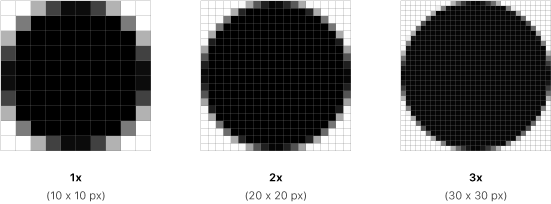
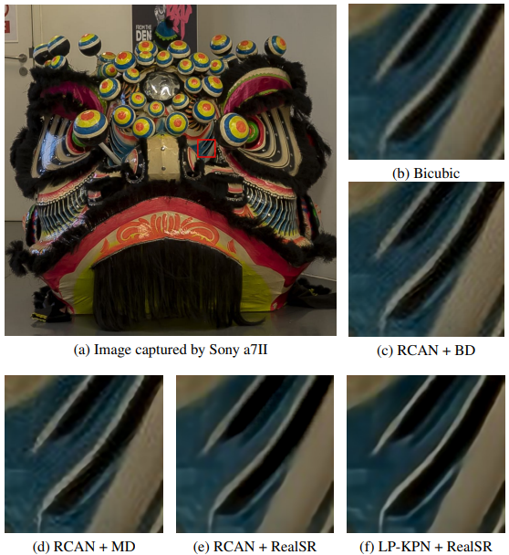

# Toward Real-World Single Image Super-Resolution: A New Benchmark and A New Model \[Kor\]

##  1. Problem definition

 Single image super-resolution (SISR)의 정의는 한 장의 저해상도 이미지로부터 고해상도 이미지를 복원하는 task이다. 여기서 해상도란 이미지가 나타낼 수 있는 섬세함 정도를 의미하고, 따라서 해상도가 낮을 수록 섬세한, 즉, 작거나 edge와 같은 부분을 잘 표현하지 못한다는 의미가 된다.

 우리가 흔히 핸드폰이나 카메라로 찍어서 볼 수 있는 이미지는 이미징 하고자 하는 대상으로부터 반사된 빛들이 렌즈를 통과하여 이미지 센서에 의해 기록된 정보이다. 이미지가 기록되는 과정에서 많은 빛의 정보를 잃게 되는데, 특히 렌즈가 빛을 잘 모으지 못하거나 이미지 센서의 픽셀 사이즈가 충분히 작지 못할 경우 문제가 발생한다. 예를 들어, 아래 그림을 보자. 
 
 

 
 

같은 원에 대한 이미지여도, 왼쪽 이미지는 원의 형태가 뭉개져 마름모처럼 보이지만 우측으로 갈 수록 제대로 된 원의 형태를 볼 수 있다. 섬세하게 원을 표현하지 못한 첫 번째 이미지가 저해상도 이미지가 되고, 섬세하게 원을 잘 표현한 오른쪽 이미지가 고해상도 이미지가 된다. 즉, SISR은 왼쪽 이미지 한 장에서 오른쪽 이미지로 변환해주는 task이다. 

 이를 좀 더 분석해보면, $$3 \times N \times N$$ 저해상도 이미지를 $$3 \times M \times M$$ 고해상도 이미지로 복원하려면 $\frac{3 \times M \times M}{3 \times N \times N} = \frac{M^2}{N^2}$ 만큼의 정보를 정보를 저해상도 이미지로부터 유추해내야 한다. 따라서, SISR은 ill-posed problem에 속하며 이를 해결하기 위한 많은 연구들이 있었다.

## 2. Motivation

 SISR에 딥러닝을 적용하는 연구는 2014년 [“Image Super-Resolution Using Deep Convolutional Networks, 2014 ECCV”](https://arxiv.org/pdf/1501.00092.pdf)[1] 이라는 연구에서 처음으로 Convolution neural network를 적용하면서 시작되었다. 이후에 다른 컴퓨전 비전 분야와 마찬가지로 GAN[2], Residual Dense Network[3] 등 새로운 framework를 적용해가며 고해상도 이미지 복에 대한 성능이 꾸준히 향상되었다. SISR에 대한 state-of-the-art를 기록한 논문들은 다음 사이트를 참고하기 바란다([SISR SOTA](https://paperswithcode.com/task/image-super-resolution)).
 
 하지만 이전 연구들에서는 단순한 이미지 degradation을 가정한 simulation 데이터셋만을 활용하여 모델을 train하고 evaluate했다는 공통적인 한계가 존재한다. 아래 그림은 현재 SISR에서 state-of-the-art를 기록하고 있는 RCAN이라는 모델을 활용하여 (1) bicubic degradation(BD), (2) multiple degradataion(MD) (3)  real-world super-resolution
(RealSR) dataset (저자들이 모은 데이터)에 대해 train 및 test를 한 결과를 보여준다.

 

 
 

 (a)는 실제 카메라로 찍은 이미지를 나타내며, (a)에 빨간 박스 쳐진 부분에 BD가 적용된 이미지 (b) 그리고 (1-3)번의 모델을 통해 복원된 이미지(c-e)이다. 확실히 (b, c)는 simulation에 의해 만들어진 데이터를 기반으로 학습되었기 때문에, real-world data를 적용하여 복원했을 때 이미지에 왜곡도 많고 edge부분이 깔끔하지 않다. 반면에 RealSR로 학습된 (e)는 훨씬 매끄럽고 섬세한 이미지가 복원된 것을 확인할 수 있다. 

하지만, RealSR 데이터 셋을 모으더라도 다가 아니다. RealSR data는 simulation으로 degrade된 이미지와 다르게 훨씬 복잡하다. 특히, 실제 이미지에서는 하나의 장면안에 얼마나 깊은 정보(카메라 렌즈로부터 대상들 가지의 거리)가 담겨있냐에 따라 이미지가 degrade되는 방식이 달라진다. 이는 한 장면 안에서도 나타날 수 있기 때문에, spatially variant한 blur kernel이 존재하다고 말한다. 본 논문에서는 크게 이 두가지 문제점을 지적했다.
 
### Related work

 RealSR d

### Idea

After you introduce related work, please illustrate the main idea of the paper. It would be great if you describe the idea by comparing or analyzing the drawbacks of the previous work.

## 3. Method


If you are writing **Author's note**, please share your know-how \(e.g., implementation details\)


The proposed method of the paper will be depicted in this section.

Please note that you can attach image files \(see Figure 1\).  
When you upload image files, please read [How to contribute?](../../how-to-contribute.md#image-file-upload) section.

We strongly recommend you to provide us a working example that describes how the proposed method works.  
Watch the professor's [lecture videos](https://www.youtube.com/playlist?list=PLODUp92zx-j8z76RaVka54d3cjTx00q2N) and see how the professor explains.

## 4. Experiment & Result


If you are writing **Author's note**, please share your know-how \(e.g., implementation details\)


This section should cover experimental setup and results.  
Please focus on how the authors of paper demonstrated the superiority / effectiveness of the proposed method.

Note that you can attach tables and images, but you don't need to deliver all materials included in the original paper.

### Experimental setup

This section should contain:

* Dataset
* Baselines
* Training setup
* Evaluation metric
* ...

### Result

Please summarize and interpret the experimental result in this subsection.

## 5. Conclusion

In conclusion, please sum up this article.  
You can summarize the contribution of the paper, list-up strength and limitation, or freely tell your opinion about the paper.

### Take home message \(오늘의 교훈\)

Please provide one-line \(or 2~3 lines\) message, which we can learn from this paper.

> All men are mortal.
>
> Socrates is a man.
>
> Therefore, Socrates is mortal.

## Author / Reviewer information


You don't need to provide the reviewer information at the draft submission stage.


### Author

**Korean Name \(English name\)** 

* Affiliation \(KAIST AI / NAVER\)
* \(optional\) 1~2 line self-introduction
* Contact information \(Personal webpage, GitHub, LinkedIn, ...\)
* **...**

### Reviewer

1. Korean name \(English name\): Affiliation / Contact information
2. Korean name \(English name\): Affiliation / Contact information
3. ...

## Reference & Additional materials
###Reference
[1] Dong, Chao, et al. "Image super-resolution using deep convolutional networks." IEEE transactions on pattern analysis and machine intelligence 38.2 (2015): 295-307.
[2] Ledig, Christian, et al. "Photo-realistic single image super-resolution using a generative adversarial network." Proceedings of the IEEE conference on computer vision and pattern recognition. 2017.
[3] Lim, Bee, et al. "Enhanced deep residual networks for single image super-resolution." Proceedings of the IEEE conference on computer vision and pattern recognition workshops. 2017.

1. Citation of this paper
2. Official \(unofficial\) GitHub repository
3. Citation of related work
4. Other useful materials
5. ...

