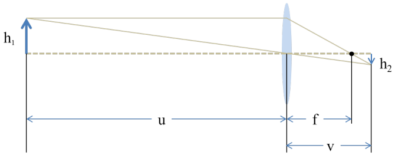
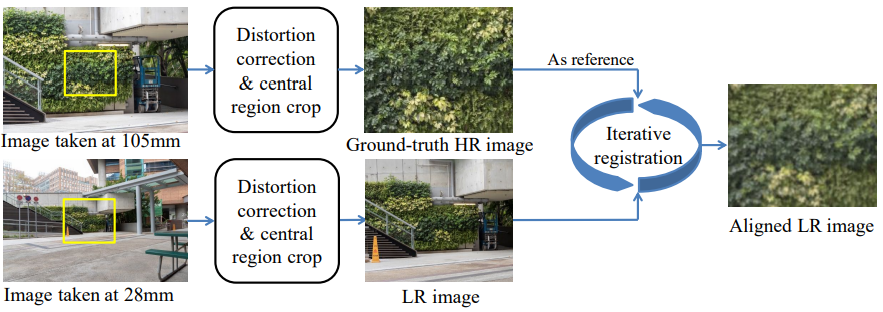
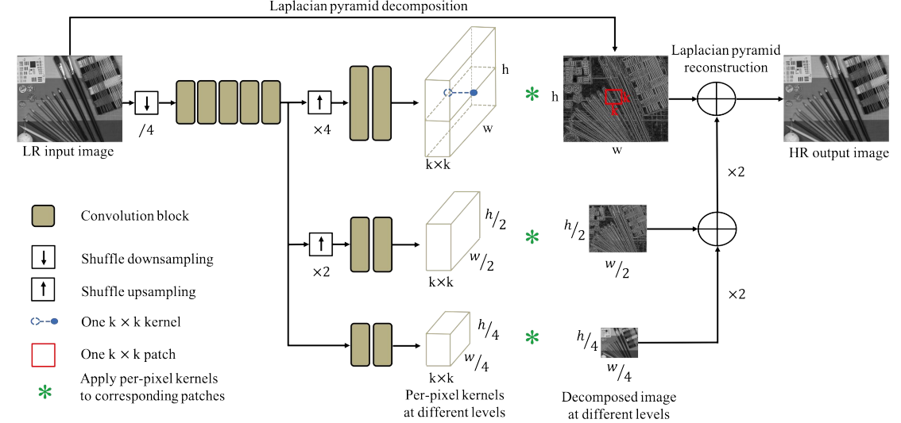

# Toward Real-World Single Image Super-Resolution: A New Benchmark and A New Model \[Kor\]

##  1. Problem definition

 Single image super-resolution (SISR)의 정의는 한 장의 저해상도 이미지로부터 고해상도 이미지를 복원하는 task이다. 여기서 해상도란 이미지가 나타낼 수 있는 섬세함 정도를 의미하고, 따라서 해상도가 낮을 수록 섬세한, 즉, 작거나 edge와 같은 부분을 잘 표현하지 못한다는 의미가 된다.

 우리가 흔히 핸드폰이나 카메라로 찍어서 볼 수 있는 이미지는 이미징 하고자 하는 대상으로부터 반사된 빛들이 렌즈를 통과하여 이미지 센서에 의해 기록된 정보이다. 이미지가 기록되는 과정에서 많은 빛의 정보를 잃게 되는데, 특히 렌즈가 빛을 잘 모으지 못하거나 이미지 센서의 픽셀 사이즈가 충분히 작지 못할 경우 문제가 발생한다. 예를 들어, 아래 그림을 보자. 
 
 

 
 

같은 원에 대한 이미지여도, 왼쪽 이미지는 원의 형태가 뭉개져 마름모처럼 보이지만 우측으로 갈 수록 제대로 된 원의 형태를 볼 수 있다. 섬세하게 원을 표현하지 못한 첫 번째 이미지가 저해상도 이미지가 되고, 섬세하게 원을 잘 표현한 오른쪽 이미지가 고해상도 이미지가 된다. 즉, SISR은 왼쪽 이미지 한 장에서 오른쪽 이미지로 변환해주는 task이다. 

 이를 좀 더 분석해보면, $$3 \times N \times N$$ 저해상도 이미지를 $$3 \times M \times M$$ 고해상도 이미지로 복원하려면 $\frac{3 \times M \times M}{3 \times N \times N} = \frac{M^2}{N^2}$ 만큼의 정보를 정보를 저해상도 이미지로부터 유추해내야 한다. 따라서, SISR은 ill-posed problem에 속하며 이를 해결하기 위한 많은 연구들이 있었다.

## 2. Motivation

 SISR에 딥러닝을 적용하는 연구는 2014년 [“Image Super-Resolution Using Deep Convolutional Networks, 2014 ECCV”](https://arxiv.org/pdf/1501.00092.pdf)[1] 이라는 연구에서 처음으로 Convolution neural network를 적용하면서 시작되었다. 이후에 다른 컴퓨전 비전 분야와 마찬가지로 GAN[2], Residual Dense Network[3] 등 새로운 framework를 적용해가며 고해상도 이미지 복에 대한 성능이 꾸준히 향상되었다. SISR에 대한 state-of-the-art를 기록한 논문들은 다음 사이트를 참고하기 바란다([SISR SOTA](https://paperswithcode.com/task/image-super-resolution)).
 
 하지만 이전 연구들에서는 단순한 이미지 degradation을 가정한 simulation 데이터셋만을 활용하여 모델을 train하고 evaluate했다는 공통적인 한계가 존재한다. 아래 그림은 현재 SISR에서 state-of-the-art를 기록하고 있는 RCAN이라는 모델을 활용하여 (1) bicubic degradation(BD), (2) multiple degradataion(MD) (3)  real-world super-resolution
(RealSR) dataset (저자들이 모은 데이터)에 대해 train 및 test를 한 결과를 보여준다.

 

 
 

 (a)는 실제 카메라로 찍은 이미지를 나타내며, (a)에 빨간 박스 쳐진 부분에 BD가 적용된 이미지 (b) 그리고 (1-3)번의 모델을 통해 복원된 이미지(c-e)이다. 확실히 (b, c)는 simulation에 의해 만들어진 데이터를 기반으로 학습되었기 때문에, real-world data를 적용하여 복원했을 때 이미지에 왜곡도 많고 edge부분이 깔끔하지 않다. 반면에 RealSR로 학습된 (e)는 훨씬 매끄럽고 섬세한 이미지가 복원된 것을 확인할 수 있다. 

하지만, RealSR 데이터 셋을 모으더라도 다가 아니다. RealSR data는 simulation으로 degrade된 이미지와 다르게 훨씬 복잡하다. 특히, 실제 이미지에서는 하나의 장면안에 얼마나 깊은 정보(카메라 렌즈로부터 대상들 가지의 거리)가 담겨있냐에 따라 이미지가 degrade되는 방식이 달라진다. 이는 한 장면 안에서도 나타날 수 있기 때문에, spatially variant한 blur kernel이 존재하다고 말한다. 본 논문에서는 크게 이 두가지 문제점을 해결하기 위해 RealSR dataset 구축 및 kernel prediction network기반의 super-resolution이미지를 복원하는 네트워크를 제안했다.
 
### Related work

 #### 1. RealSR dataset 구축

 여태까지의 SISR에 주로 사용된 데이터 셋으로는 Set5, Set14, BSD300 등이 있었지만, 해당 데이터 셋에 대응하는 저해상도 이미지는 bicubic downsampling 이나 gaussian blurring과 같은 단순한 방식으로 얻어졌다. 이후에 Generalization capacity를 늘리기 위한 연구로 좀 더 복잡한 image degradation을 적용하였으나 simulation보다 훨씬 복잡하게 표현되는 실제 image degradation에 적용되기에는 여전히 거리가 멀었다. 
 
 또 다른 시도로는 고해상도-저해상도 이미지 pair를 얻으려는 노력도 있었다. 논문에서는 두개의 선행 연구를 소개했는데, (1) 이미징 시스템을 구축한 뒤 beam splitter(빛 을 두방향으로 갈라주는 optical component)와 두개의 카메라를 활용해 face image에 대한 고해상도-저해상도 이미지 pair를 얻는 방법 (2) 하드웨어(카메라)를 통해 저해상도 이미지를 얻은 다음 이미지 후 처리를 통한 여러 버전의 저해상도 이미지를 얻는 방법들이 있었다. 하지만 두 경우 모두 laboratory(실험실) 안에서만 진행되어 실제 세상에 적용되기에는 데이터 셋의 다양성이 매우 부족했다.
 
#### 2. kernel prediction network(KPN)

RealSR dataset은 일반적으로 하나의 이미지 안에서도 locally 다른 degradation(spatially variant)이 존재하기 때문에, 이를 해결하기 위한 노력 또한 필요하다. KPN은 Monte Carlo noise를 제거하기 위한 연구에서 처음 적용이 되었으며, 훨씬 안정적이고 빠른 convergence 가져다 주며 denoising 부문에앙서 state-of-the-art를 기록했다. 또한, KPN은 dynamic blurring이나 video interpolation의 convolution kernel에서의 blur kernel을 estimation하는 연구에 적용되기도 하였다.

### Idea

앞서 말했듯이, 본 논문에서는 simulation 기반의 SISR 연구에 대한 실용성에 문제점을 제기하고, 해당 문제를 해결하기 위해 RealSR dataset을 구축하게 된다. 또한, RealSR dataset의 spatially variant한 image degradation을 해결하기 위해 KPN을 도입하여 LP-KPN모델을 제시한다.

## 3. Method

### 1. Real-world SISR Dataset
 
본 논문에서는 dataset을 모으는 것 또한 method에 해당한다. 카메라 센서, 렌즈를 어떤 것을 사용하느냐에 따라 scaling factor, 해상도 등을 고려해야하기 때문에, 해당 과정에 대해서 자세한 방법을 기술하였다.

#### lens에 의한 이미지 형성 과정

일반적으로 lens의 초점 거리 f, 렌즈부터 물체까지의 거리 u, 렌즈부터 이미지 센서까지의 거리 v가 있을 때, 그 관계는 다음과 같이 기술되고 이를 thin lens equation이라고 한다.

$frac{1}{f} = frac{1}{u}+frac{1}{v}$

이때, u>>f 이고, h1의 크기를 같는 물체는 이미지 센서에 h2의 크기로 맺힌다고 할때, h1과 h2의 관계는 닮음비로부터 쉽게 구할 수 있다(아래 그림 참고 + thin lens equation). 
$h2 = frac{v}{u}h1 = frac{f}{u}h1$

 

 
 

#### Data collection

데이터를 얻는 과정에서 카메라 활용은 다음과 같다.
- DSLR cameras (Canon 5D3 and Nikon D810) 사용
- Canon 5D3와 Nikon D810의 픽셀 사이즈는 각각 $$5760 \times 3840$$, $$7360 \times 4912
- 양한 해상도의 이미지를 얻기 위해서 각각의 카메라에 105mm, 50mm, 35mm, and 28mm의 초점 거리를 갖는 렌즈를 사용하였고, 105mm는 고해상도 이미지, 나머지 세개의 렌즈는 저해상도 이미지를 얻는데 사용
- Generality에 대한 보장을 얻기위해 실내, 실외 환경에서 이미지 촬영
- 두개의 카메라로 총 234장의 scene을 촬영하였고, Canon 5D3와 Nikon D810이 동일한 scene에 대해 촬영을 하지 않았다.

#### Image pair registration

lens의 이미지 형성 과정과 data collection을 보면 고해상도 이미지와 저해상도 이미지 간의 pair 데이터를 만들기 위해서는 post processing이 필요함을 유추할 수 있다. 특히 해상도에 물체의 scaling factor가 다르기 때문에(focal length에 따라 h1과 h2의 관계가 변한다, 위 식 참고), 이를 보정하는 과정이 필요하다. 본 논문에서는 다음 그림과 같은 과정을 통해서 image registration을 하였다.

 

 
 

우선, Photoshop을 활용하여 lens distortion correction을 한 뒤 center region crop을 한다(distortion correction이 가운데 부분을 제외하고는 완벽히 correct해주지 않기 때문에). 105mm 초점거리를 갖는 렌즈로부터 촬영된 이미지에서 center region crop된 부분이 고해상도 이미지 데이터로 사용되고, 나머지 세 초점거리 (50mm, 35mm, 28mm)를 갖는 렌즈로부터 촬영된 이미지에서 center region crop된 부분이 저해상도 이미지 데이터로 사용된다.

여기서 추가적으로, 본 논문에서 개발한 image regsitration 과정은 다음과 같다.
서로 다른 초점거리를 갖는 렌즈로 촬영된 이미지들은 luminance 다르기 때문에, 이를 보정하며 pair데이터를 만들어주는 과정이 필요하고 위 그림에서 iterative registration과정에 해당한다. 본 논문에서 제시한 저해상도-고해상도 이미지의 luminance 보정 및 image registration은 다음 식을 minimize하는 것으로 해결할 수 있다.

$$ min_\tau ||\alpha C(**\tau**◦**I_L**) + \beta - **I_H**||^p_p $$

$$\tau$$는 affine transformation matrix, C는 $$I_L$$을 $$I_H$$와 동일한 크기로 crop 해주는 operation, $$\alpha, \beta$$는 luminance보정 파라미터에 해당한다. 

위 식은 locally linear approximation을 적용한 뒤 iteratively reweighted least square problem (IRLS) 기법을 적용하면 다음과 같이 식이 정리된다.

$$ min_(\delta \tau) ||**w**  (A \delta \tau - b||^2_2 $$  where, $$ \delta \tau = (**A^'** diag(**w**)^2 **A**)^-1 **A^'**  diag(**w**)^2 **b** $$
에서 최종적으로 iterative하게  $$ \tau = \tau + \delta \tau $$ 업데이트한다.

### 2. Laplacian Pyramid based Kernel Prediction Network(LP-KPN)

앞서 설명했듯이, 본 논문에서는 kernel prediction network를 사용했고, 좀 더 구체적으로는 Lplacian pyramid기반으로 다음과 같이 설계되었다.

 

 
 

## 4. Experiment & Result

### Experimental setup

### Result

Please summarize and interpret the experimental result in this subsection.

## 5. Conclusion

In conclusion, please sum up this article.  
You can summarize the contribution of the paper, list-up strength and limitation, or freely tell your opinion about the paper.

### Take home message \(오늘의 교훈\)

- 

## Author / Reviewer information

**이찬석 \(Chanseok Lee\)** 

* Affiliation \(KAIST Bio and Brain Engineering)
* mail: cslee@kaist.ac.kr 

### Reviewer

## Reference & Additional materials
###Reference
[1] Dong, Chao, et al. "Image super-resolution using deep convolutional networks." IEEE transactions on pattern analysis and machine intelligence 38.2 (2015): 295-307.
[2] Ledig, Christian, et al. "Photo-realistic single image super-resolution using a generative adversarial network." Proceedings of the IEEE conference on computer vision and pattern recognition. 2017.
[3] Lim, Bee, et al. "Enhanced deep residual networks for single image super-resolution." Proceedings of the IEEE conference on computer vision and pattern recognition workshops. 2017.
