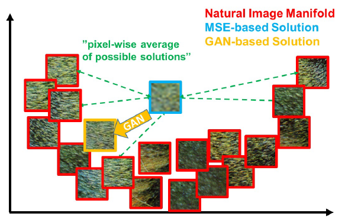
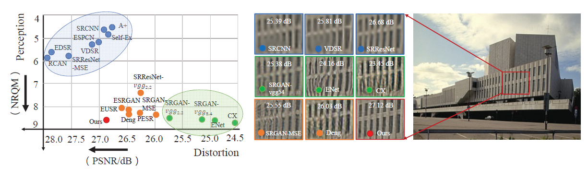
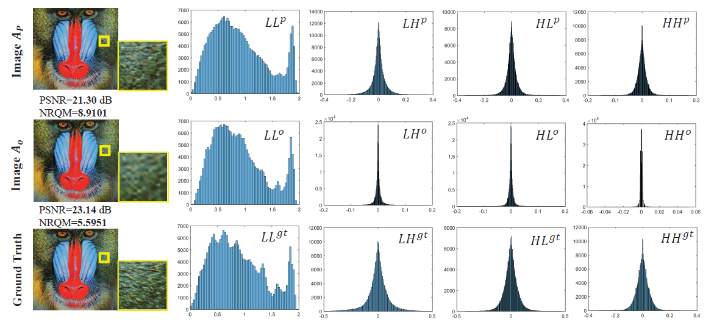
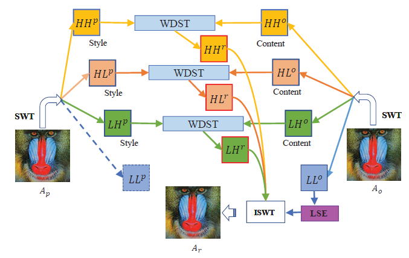

# Wavelet Domain Style Transfer for an Effective Perception-distortion Tradeoff in Single Image Super-Resolution \[Kor\]

##  1. Problem definition

Single Image Super-resolution(SISR)은 저화질(low-resolution) 이미지로부터 고화질(high-resolution) 이미지를 얻어내는 문제입니다. 보통 low-resolution 이미지는 high-resolution 이미지에 blurring과 downsampling을 적용하여 얻어진다고 가정합니다. 이 과정을 수학적으로는 아래의 식과 같이 표현할 수 있습니다.

$$
y = (x \bigotimes k) \downarrow _{s} + n
$$
$$k$$는 이미지에 적용하는 blur kernel, $$\downarrow_{s}$$는 downsampling operation을 나타내며, $$n$$은 앞의 값들과 독립인 noise 항입니다.  SISR은 하나의 $$y$$에 대해 여러 개의 $$x$$가 가능하기 때문에, ill-posed problem이라는 특징을 가지고 있습니다.

## 2. Motivation

### Related work

SRCNN을 시작으로 SISR 문제에 딥러닝 기반 방법론을 적용한 논문들이 많이 등장했습니다. 이러한 논문들 대부분은, 네트워크 구조의 차이는 있지만, 아래의 그림과 비슷한 방식을 사용합니다. Input low-resolution 이미지를 여러 층의 convolutional layer에 통과시킨 다음, transposed convolution 혹은 pixelshuffle 등의 upscaling layer를 통과하여 high-resolution 이미지를 출력하는 간단한 방식입니다. 이렇게 나온 output과 ground truth HR 이미지 사이의 L1 혹은 L2 loss를 사용하여 네트워크를 학습시키게 됩니다.


SRGAN 논문에서 지적되었듯이, 이러한 방식들의 문제점은 질감이나 이미지의 작은 디테일을 잘 복원하지 못한다는 것입니다. 이를 해결하기 위해, SRGAN은 GAN의 구조를 사용해 Generator Network와 Discriminator Network를 adversarial loss를 통해 학습시켰습니다.  또한, pixelwise한 L1 혹은 L2 loss 대신 VGG network의 layer에서의 activation 값으로부터 구한 loss를 사용하여 perceptual quality를 매우 높일 수 있었습니다.



### Idea



Super-resolution 결과물의 성능을 측정하는 metric은 크게 두 그룹으로 나눌 수 있습니다. 하나는 output SR image와 ground truth HR image가 얼마나 유사한지, 즉 distortion이 얼마나 적은지를 측정하는 metric들이고, 다른 하나는 output SR image를 실제로 눈으로 봤을 때 얼마나 좋은 perceptual quality를 가지는지를 측정하는 metric들입니다. Distortion을 측정하는 metric의 예로는 PSNR(Peak signal to noise ratio)가 있습니다. PSNR은 아래 식처럼 계산되며, 아래 식의 $$MAX$$는 이미지가 가질 수 있는 최댓값, $$MSE$$는 두 이미지간의 mean square error를 뜻합니다. 이미지가 GT HR image와 유사할수록 높은 PSNR 값을 가집니다. Perceptual quality를 측정하는 metric의 예로는 NRQM(No reference quality metric)이 있습니다. NRQM은 reference 이미지 없이 output SR image에 DCT, Wavelet decomposition, PCA 등의 다양한 기법을 적용하여 regression을 통해 quality score를 얻어냅니다.
$$
PSNR=10 \cdot log_{10}{\frac{MAX_{I}^{2}}{MSE}}
$$
Pixelwise loss를 사용하는 네트워크들은 distortion이 낮은(PSNR 값이 높다) 반면 이미지의 디테일을 복원하지 못하고, adversarial loss를 사용하여 perceptual quality를 높인 네트워크들은 낮은 PSNR값을 가지는 trade-off가 존재합니다. 이러한 trade-off에서 최적의 균형을 찾기 위해 몇 가지 방법들이 제안되었습니다. SRGAN-MSE는 MSE와 adversarial loss를 같이 사용하였지만, adversarial loss를 줄이는 방향이 결과적으로 MSE loss를 증가시키게 되기 때문에 학습 과정이 매우 불안정하다는 단점이 존재합니다. ESRGAN에서는 이를 PSNR을 줄이도록 학습한 네트워크와 adversarial loss를 줄이도록 학습한 네트워크의 interpolation을 사용하여 접근하였습니다.  하지만 네트워크 interpolation은 두 네트워크가 정확히 동일한 구조를 가지고 있어야 한다는 한계가 존재합니다.

이 논문에서는, 이 trade-off 상에서 더 나은 값을 얻기 위해, 이미지의 perceptual quality에 영향을 주는 요소와 distortion에 영향을 주는 요소를 wavelet transform을 이용하여 분리합니다. 다음으로, wavelet domain에서의 style transfer를 사용하여 해당 요소들을 변형시켜 기존의 방법론들 중 distortion이 낮은 방법과 perceptual quality가 높은 방법 사이에서 최고의 perception-distortion trade-off를 가지는 이미지를 생성합니다. 

## 3. Method

### 2D Stationary wavelet transform 


Wavelet transform은 multi-resolution analysis의 한 방법으로, 신호를 다양한 frequency resolution과 spatial resolution으로 분리시킵니다. 위의 그림에서처럼, 2D Stationary wavelet transform의 경우 입력 이미지에 각각 행 방향과 열 방향으로 low-pass filter와 high-pass filter가 적용되어 이미지가 $$LL_{1}$$, $$LH_{1}$$, $$HL_{1}$$, $$HH_{1}$$ 의 네 가지 sub-band로 분리되게 됩니다.  수식으로는 아래의 식처럼 표현할 수 있습니다.


저자들은, 이렇게 Wavelet transform을 진행한 각 sub-band들 중, LL sub-band는 이미지의 distortion, 혹은 objective quality와, 그리고 LH, HL, HH sub-band는 이미지의 visual quality와 밀접한 연관이 있다고 주장합니다. 이를 입증하기 위해, 아래 그림과 같이 세 개의 이미지의 wavelet transform을 확인하였습니다. 첫 번째 줄의 이미지 Ap는 perceptual quality가 높은 method로 reconstruct된 HR 이미지, 두 번째 줄의 Ao는 objective quality, 즉 PSNR 값이 높은 method로 생성한 HR 이미지입니다. 세 번째 줄은 ground truth HR 이미지입니다. 각각의 wavelet transform을 비교하면, Ao는 ground truth와 LL sub-band에서 유사한 분포를 가지고 있고, Ap는 LL sub-band에서는 유사성이 떨어지지만 그 외의 sub-band에서 상대적으로 더 유사한 분포를 가지고 있음을 확인할 수 있습니다.



이를 조금 더 자세히 확인하기 위해, Ap의 나머지 sub-band는 유지한 채 LL sub-band를 Ao의 LL sub-band로 교체한 이미지 $$tilde{A_{p}}$$와 Ao의 나머지 sub-band는 유지한 채 LL sub-band를 Ap의 sub-band로 교체한 이미지 $$tilde{A_{o}}$$의 PSNR과 NRQM(perceptual quality measure 중 하나) 값을 비교하면, 아래 표와 같이 Ap와 $$tilde{A_{p}}$$, Ao와 $$tilde{A_{o}}$$가 PSNR 값에는 큰 차이가 있지만, NRQM 값에는 큰 변화가 없음을 볼 수 있습니다. 


따라서, 이미지의 LL sub-band는 높은 objective quality를 가지도록 하고, 그 외의 LH, HL, HH sub-band는 높은 perceptual quality를 가지도록 한다면 더 좋은 perception-distortion trade-off를 가지는 이미지를 만들어 낼 수 있을 거라 예측할 수 있습니다.

### Framework



논문에서 제시한 방법론을 나타낸 그림입니다. 앞에서처럼 높은 perceptual quality를 가지는 방법으로 생성된 HR 이미지 Ap와 높은 objective quality를 가지는 방법으로 생성된 HR 이미지 Ao에 대해, 각각에 wavelet transform을 적용합니다. 이렇게 생성된 각 sub-band들에 대해, LH, HL, HH sub-band는 Ao의 sub-band들을 content, Ap의 sub-band들을 style로 가지도록 style transfer를 적용하고, 높은 objective quality를 가지는 Ao의 LL sub-band는 enhancement network를 통과시킵니다. 이렇게 각각 style transfer와 enhancement network를 통과한 sub-band들인 $$HH^{r}$$, $$HL^{r}$$, $$LH^{r}$$, $$LL^{r}$$에 대해 inverse wavelet transform을 적용하여 최종적으로 이미지 $$A_{r}$$을 얻게 됩니다.

## 4. Experiment & Result

### Experimental setup

논문에서는 bior2.2를 wavelet filter로 사용했으며, wavelet transform을 2번 적용하였습니다. LSE network는 learning rate 0.01, momentum 0.9의 SGD를 사용하여 optimize하였고 batch size로는 64를 사용하였습니다. Ao를 출력해주는 objective quality가 높은 방법으로는 EDSR을 사용하였고, Ap를 만드는 perceptual quality가 높은 방법으로는 CX를 사용하였습니다. Set5, Set14, BSD100, Urban100, PIRM dataset에서, 각 네트워크들의 PSNR, SSIM, 그리고 NRQM 값을 측정하였습니다.

### Result


각 dataset에서 측정된 PSNR, SSIM, NRQM 값입니다. 우측의 6개 방법은 모두 perception과 distortion 모두를 향상시키기 위한 방법들입니다. 논문에서 제시한 방법이 대부분의 dataset에서 PSNR, SSIM, 그리고 NRQM 모두 가장 높은 값을 보여주었습니다.


실제 output image를 살펴보아도, objective quality가 높은 방식인 SRCNN보다 뚜렷하며 perceptual quality가 높은 방식인 SRGAN, ENet, CX등의 방법보다 더 정확한 image를 출력하는 것을 확인할 수 있습니다. 


Perception-distortion trade-off를 곡선상에 나타내 비교한 결과입니다. 그림 왼쪽 위의 RCAN, EDSR, SRResNet-MSE는 모두 pixelwise loss function으로 학습되어 높은 PSNR 값을 가지는 네트워크들이며, 오른쪽 아래의 SRGAN-VGG54, CX는 높은 perceptual quality를 가지는 네트워크들입니다. 두 점 사이를 잇는 곡선은 두 네트워크의 출력 이미지를 직접 pixel 단계에서 interpolation한 결과를 의미합니다. 논문에서 제안한 방법을 적용했을 때, 제안 방법들이 곡선들보다 왼쪽 아래에 존재함을 확인할 수 있습니다. 이는 제안 방법이 더 나은 perception-distortion trade-off를 얻는다는 것을 의미합니다.

## 5. Conclusion

이 논문에서는 Wavelet domain에서의 style transfer를 사용하여, SISR 문제에 대해 최적의 perception-distortion trade-off를 얻을 수 있는 방법을 제시하였습니다. 다른 SISR 논문들과는 다르게, 새로운 네트워크를 사용하는 것이 아니라 기존의 네트워크들에서 만들어진 output image들을 fusion하여 perception과 distortion 두 마리 토끼를 다 잡는다는 것이 흥미로운 논문이었습니다. 

### Take home message \(오늘의 교훈\)

> 이미지를 다른 domain에서 관찰하였을 때 유의미한 특징을 찾게 될 수도 있다.
>
> 오래된 이미지 처리 기법도 유용하게 쓸 수 있다.

## Author / Reviewer information


### Author

**고강욱 \(Kangwook Ko\)** 

* KAIST EE
* kokangook623@kaist.ac.kr

### Reviewer

1. 

## Reference & Additional materials

1. ```
   @inproceedings{deng2019wavelet,
     title={Wavelet domain style transfer for an effective perception-distortion tradeoff in single image super-resolution},
     author={Deng, Xin and Yang, Ren and Xu, Mai and Dragotti, Pier Luigi},
     booktitle={Proceedings of the IEEE/CVF International Conference on Computer Vision},
     pages={3076--3085},
     year={2019}
   }
   ```

2. [Official Github Repository](https://github.com/cindydeng1991/Wavelet-Domain-Style-Transfer-for-an-Effective-Perception-distortion-Tradeoff-in-Single-Image-Super-) 
