---
Aishwarya Kamath et al. / MDETR - Modulated Detection for End-to-End Multi-Modal Understanding / ICCV2021
---

# MDETR  \[Eng\]

[Kamath et al., "MDETR: Modulated Detection for End-to-End Multi-Modal Understanding", International Conference on Computer Vision, ICCV 2021](https://openaccess.thecvf.com/content/ICCV2021/html/Kamath_MDETR_-_Modulated_Detection_for_End-to-End_Multi-Modal_Understanding_ICCV_2021_paper.html)

한국어로 쓰인 리뷰를 읽으려면 [여기](./iccv-2021-mdetr-kor.md)를 클릭하세요.

##  1. Problem definition

Vision-language model (also called visual-linguistic  model, visio-linguistic model) grounds language understanding in corresponding visual inputs. For example, in case of VQA (visual question answering) problem, an instance of problem may suggest a photo of people sitting on a sofa, and ask 'how many people are in the photo?'. Since there are 2 modalities, vision-language model is multi-modal model.

Existing methods for vision-language learning (e.g. VisualBert3, Vilbert5, LXMERT4, UNITER1) typically utilize a sort of black-box object detector to extract visual feature, and plug that feature to neural network, such as transformer.

Downsides of these methods are 1) black-box detector's performance won't be improved and stay the same, because it won't be trained further, 2) the number of classes a vision-language model can distinguish is limited by the number of possible detections the detector can perceive, and 3) only features from bounding box of detected objects are fed into a vision-language model, not the feature of whole image, as most object detectors do extract features from regions suggested by region proposal phase.

As result, when a pair of image and caption which describes the image in free-form text is given, typical multi-modal(vision-language) models that use black-box detector have difficulty in capturing novel expressions, which can be possibly in the caption. This is because the training-terminated black-box detector cannot capture expressions that it did not encounter at its pretraining phase.

This paper suggests a model called MDETR, short for Modulated DEtection TRansformer, which is trained in end-to-end fashion including feature extraction phase, while intertwining image and text features from very early phase of the network, solving the problems of using frozen black-box detector.

MDETR shows overwhelming or on par with performance to state-of-the-art models on multimodal reasoning tasks, such as phrase grounding and referring expression comprehension. 

## 2. Motivation

### Related work

In many recent multi-modal works, model is pretrained with a lot of image-text aligned data, then fine-tuned to downstream tasks. Transformer is popular choice for such models.

Multi-modal models can be categorized into 1) single-stream architecture (both visual and language features are fed into one common transformer), and 2) two-stream architecture (visual and language features are seperately fed into two transformers, accompanied by cross-attention between those transformers). UNITER1, OSCAR2, VisualBert3 are single-stream, and LXMERT4, Vilbert5 are two-stream.

These multi-modal models use frozen black-box object detector, which sometimes brings  noisy, oversampled, and ambiguous image regions. OSCAR tries to solve this problem by explicitly using object tag, enhancing the alignment between the two modalities. VinVL6, tries to solve the problem that black-box is only able to detect predefined classes, by using a detector which was trained on bigger set of classes to cover diverse set of possible detection categories.

Besides this, there are many multi-modal related works, such as applying adversarial training on existing vision-language model to enhance performance, or utilizing scene graph to learn better multi-modal representations.

### Idea

MDETR feeds feature of whole image and corresponding text(caption) feature to encoder of a common transformer. Then decoder part of the transformer predicts the class and bounding box(bbox) for each of referred objects in text. This structure enables learning representation of whole image, without black-box detector.

The paper claims says that MDETR solves the problems pretrained black-box detector intrigues, and knits image and text features from early part of the model, so that the model can learn better multi-modal representation.

## 3. Method

MDETR is extension of  [DETR](https://arxiv.org/abs/2005.12872)7. Therefore it is prerequisite to understand DETR first.

#### DETR

DETR is a model which shows competitive detection performance with end-to-end fashion learning, without using hand-crafted methods such as anchor, FPN, NMS that conventional image detection model uses. DETR and MDETR are very similar, such that if you extend DETR with language related parts, you will get MDETR.

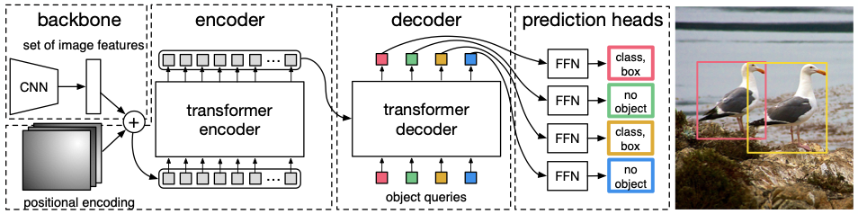

I will explain DETR from input feeding part. First an input image is fed to a vision backbone model (authors use ResNet8 as backbone), and get the activation map output. Then flatten the output, and adds 2D positional encoding to the flattened activation map, then this is fed as input to encoder part of the transformer. Inside the transformer encoder, image and text are knit together by self-attention mechanism, turning into a joint representation of two modalities. this joint representation (encoder output) is attended to decoder part of the transformer.

At decoder part, vectors called 'object query'(implemented as PyTorch's nn.Embedding) are fed as input to the decoder. You can think of object query as a slot that the model has to fill in with corresponding object information. As DETR is trained, each object query is updated to the representation of each detected object.

Decoder output of each object query is followed by weight-sharing Feed-Forward Network(FFN), and this FFN predicts class and bbox of ground truth object. Here, number of object queries should be larger than number of objects seen at the scene, to prevent number of possible detections(=number of object queries) is less than actual number of objects. For leftover object queries which doesn't correspond to any object at the scene, the FFN should predict the class of the queries as 'no object' class ($$\emptyset$$).

Note that there is no given order of queries, meaning that it is not known from the beginning which query corresponds to which objects. So, DETR finds out the optimal matching between objects and queries. Then it learns to predict the class and bbox of each object by optimizing the Hungarian loss between ground truth object and object query.

In detail, we can get the optimal matching between objects and queries by computing permutation $$\hat{\sigma}$$.

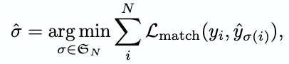

 $$\mathcal{\sigma}_N$$ is set of all possible permutations, and $$y_i$$ is tuple of $$y_i = (c_i, b_i)$$, where $$c_i$$ and $$b_i$$ are class and bounding box of $$i$$-th object. 

$$L_{match}$$ here is $$-\mathbb{1}_{c_i \neq \emptyset}\hat{p}_{\sigma(i)}(c_i) + \mathbb{1}_{c_i \neq \emptyset}\mathcal{L}_{\text{box}}(b_i, \hat{b}_{\sigma(i)})$$, where $$\hat{p}_{\sigma(i)}(c_i)$$ is probability that $$\sigma(i)$$-th object's class is $$c_i$$.

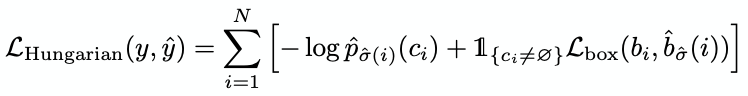

Then, minimize Hungarian loss for each object - query pair found by the optimal matching above. Here $$\mathcal{L}_{\text{box}}$$ is addition of L1 distance and IOU loss between normalized ground-truth bbox coordinates and normalized predicted bbox coordinates.

#### MDETR 

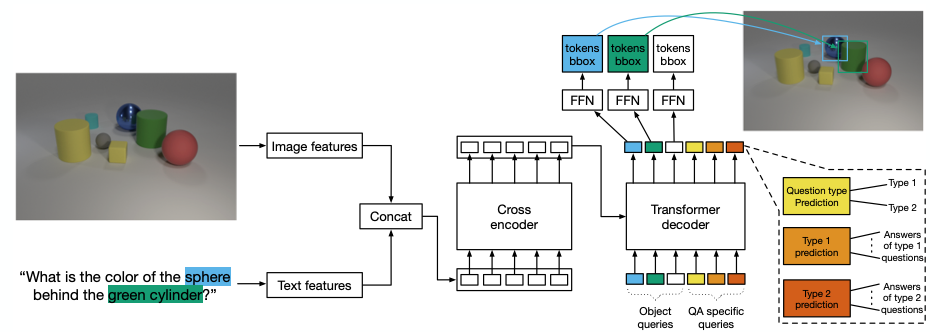

MDETR extracts visual feature from backbone network (authors use Resnet or EfficienetNet9 as backbone). MDETR also extracts text feature using pretrained Roberta10 model.

Then, image and text features are concatenated along the sequence dimension, then fed to encoder part of the transformer.

Like DETR, MDETR also feeds object query as input to the decoder part of the transformer, and predicts class and bbox of each object using Feed-Forward Network (FFN).

MDETR also has QA specific quries, besides object queries, for QA(question answering) tasks. First QA query predicts question type. For example, in the above figure the caption is asking statement, 'What is the color of the sphere behind the green cylinder?'. Then the first QA query has to predict question type is about predicting 'color', and QA query which is related to color has to predict 'blue'.

MDETR has two auxiliary losses other than Hungarian loss, soft token prediction loss and contrastive alignment loss. These 2 losses is about better alignment between image representation and corresponding text representation.

**Soft token prediction** is non-parametric loss. For each predicted bbox that is matched to a ground truth box by optimal matching, the model is trained to predict a uniform distribution over all token positions that corresopnd to the object. Figure below shows how soft toekn prediction works.
In detail, MDETR outputs a logit that contains what tokens each query relates to (size of BS x (num_queries) x (num_tokens)). After applying log_softmax on this logit, then perform Hadamard product with a ground-truth label matrix which is same size as the logit matrix. Soft token prediction loss is the minus(-) of that Hadamard product result.

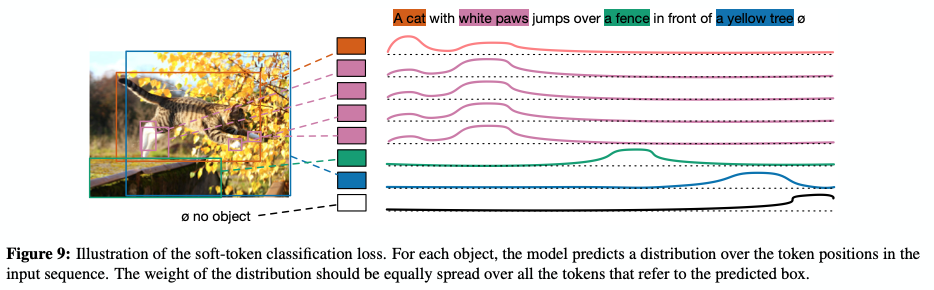

**Contrastive alignment** enforces alignment between the embedded representations of the object at the output of the decoder, and the text representation at the output of the encoder. This constraint is stronger than the soft token prediction loss as it directly operates on the representations. 
The loss equation is as below.

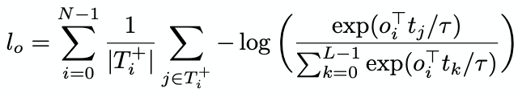

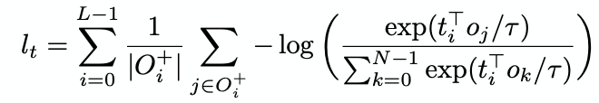

L and N are the maximum number of tokens and the maximum number of objects. $$T^+_i$$ is the set of tokens to be aligned with a given object $$o_i$$, and $$O^+_i$$ is the set of objects to be aligned with a given token $$t_i$$ $$\tau$$ is a temperature parameter that is set to 0.07 here. Average of $$l_o$$ and $$l_t$$ is set to be contrastive alignment loss.

## 4. Experiment & Result

### Experimental setup

Authors conduct experiment with 1) systhetic image dataset and 2) natural image dataset.

#### Synthetic image data: CLEVR11

##### Dataset 

CLEVR dataset is to benchmark performance of multi-modal models. The question is about arrangement or statement of the arranged synthetic objects such as sphere, cone, and cylinder. Although detecting each object is trivial, comprehending question can be challenging, as a number of logical steps may be needed, at most 20 steps in some cases. Authors show that MDETR performs well on CLVER dataset, even without inductive bias for the reasoning task.

One thing to note is that original CLEVR dataset lacks some information MDETR needs for its training; 1) bounding box annotation and 2) bounding box - text token pair matching. Authors use scene graph to create bounding box annotation, and use functional program which is included in CLEVR to get bounding box - text token alignment.

##### Model

ResNet-18 is used for vision backbone, and pretrained DistilRoberta of HuggingFace is used for text encoder. The transformer has 6 encoder and 6 decoder layers, and 8 attention heads for each layer.

##### Baselines

Experiment was done using MAttNet, MGA-Net, LiLM, MAC, NS-VQA, OCCAM models as baseline. NS-VQA, which shows the best performace among the baselines use external supervision signal, but MDETR does not need such signal for achieving competitive results.

##### Training setup

Authors define a subset of entire CLEVR dataset named CLEVR-Medium, which only contains data where the object that the question asks about is referred only once. CLEVR-Medium is 15% smaller then entire CLEVR.

Authors use curriculum learning, where in first 30 epochs the model is trained with CLEVR-Medium, then in the next 30 epochs the model is trained with entire CLEVR dataset. They observed performance drop when curriculum learning is not used.

QA specific heads used in CLEVR benchmark are numerical, binary, attributes head

##### Evaluation metric

Accuracy.

##### Note

CLEVR-Humans: dataset consists of human made questions, for zero-shot setting experiments.

CLEVR-REF+: dataset for referring expression comprehension task (whether each object query corresponds to an object that is referred to or not). Binary head is added to FFN.

##### Result

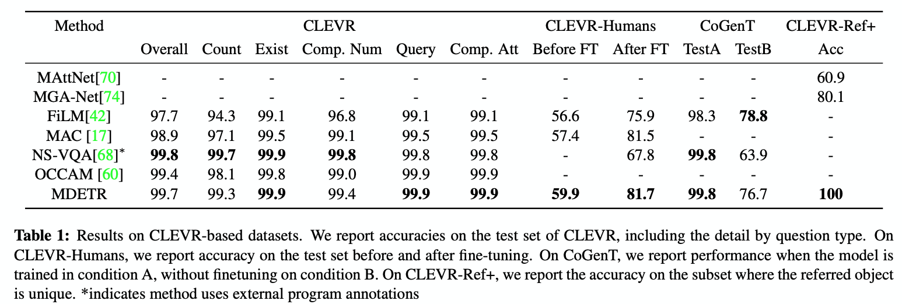

MDETR achieves state-of-the-art performace without 1) external supervision signal and 2) specific inductive bias for CLEVR task, which are used by other baseline models.

#### Natural image data: Combined dataset

With natural image dataset, authors conducted experiments on **phrase grounding**(given phrases, finding bounding boxes pertaining to those phrases. For example, if a picture is given with its corresponding caption 'two people are playing with a ball', the model should predict 3 bounding boxes for the two people and one ball), **referring expression comprehension**(find bounding box of referred object. For example, if a picture is given with its corresponding caption 'The woman playing Nintendo Wii', the model should predict a bounding box for the woman. Usually there are only one or two corresponding objects for one caption. This is not a problem that predicts bounding box for every phrase in a sentence), **referring expression segmentation**(perform pixel-level segmentation for referred object. This is similar to referring expression comprehension, except that referring expression segmentation is to predict pixel-level segmentation mask, not bounding box), **VQA**(produce correct answer for question, based on picture. For example, an instance of VQA problem may suggest a photo of people sitting on a sofa, and ask 'how many people are in the photo?')

##### Pretraining & Dataset

Pretraining scheme is to correctly detect all the objects referred in the text which is aligned with corresponding image.

Dataset for pretraining was made by combining a number of open source datasets. Flickr30k12, MS COCO13, Visual Genome14 were used for image sources, and referring expressions datasets, VG regions, Flickr entities, GQA train balanced set were used for annotation.

##### Model

Pretrained RoBERTa-base from HuggingFace was used for text encoder, and ResNet-101 or EfficientNet was used for vision backbone. 

##### Baselines

Single stream VL models or two stream VL models (VisualBert, ViLBERT, VL-BERT15, UNITER, VILLA16, OSCAR, VinVL) were used for downstream tasks.

##### Metric

Accuracy, precision, Mean IOU, R@k were used, for different downstream tasks.

##### Result

###### Phrase grounding: 

If model was trained with both pretraining and fine-tuning, it surpassed existing SOTA performance by 12.1point, whereas when no pretraining was used it surpassed existing SOTA performance by 8.5point

###### Referring expressions comprehension: 

Other previous works including UNITER with [Buttom up Top down detector](https://github.com/peteanderson80/bottom-up-attention)17 experienced 'test set leak' (the detector was pretrained on valid and test split, so there is cheating at detector side). Although MDETR does not experience 'test set leak' since it does not use any external detector, MDETR achived SOTA performance.

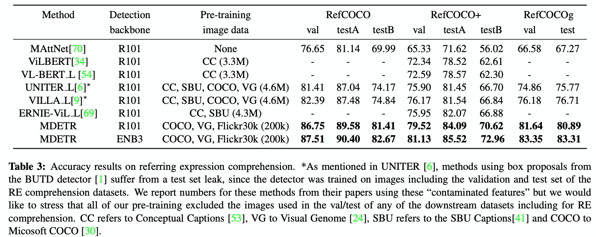

###### Referring expressions segmentation:

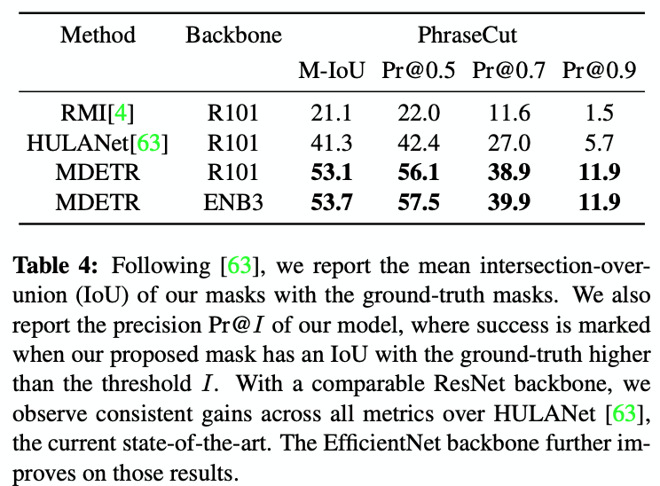

###### Visual Question Answering:

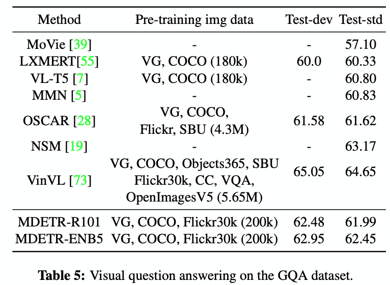

## 5. Conclusion

MDETR is wholly end-to-end multi-modal object detector, solving the caveats of using external pretrained detector. Furthermore, even though MDETR was not trained on external dataset and does not have explicit inductive bias, MDETR achived SOTA level performance on multiple tasks, proving that MDETR is extensible to many vision-language tasks.

### Take home message \(오늘의 교훈\)

Fully end-to-end fashion is usually preferrable.

## Author / Reviewer information

### Reviewer

1. 이해주(Haeju Lee) / KAIST / lhg912@kaist.ac.kr

## Reference & Additional materials

1. Chen et al., "UNITER: UNiversal Image-TExt Representation Learning", European Conference on Computer Vision (ECCV) 2020.
2. Li et al., "OSCAR: Object-Semantics Aligned Pre-training for Vision-and-Language Tasks", arXiv preprint arXiv:2004.06165, 2020.
3. Li et al., "VisualBERT: A Simple and Performant Baseline for Vision and Language", arXiv preprint arXiv:1908.03557, 2019.
4. Tan et al., "LXMERT: Learning Cross-Modality Encoder Representations from Transformers", Empirical Methods in Natural Language Processing(EMNLP) 2019.
5. Lu et al., "ViLBERT: Pretraining Task-Agnostic Visiolinguistic Representations for Vision-and-Language Tasks", Conference on Neural Information Processing Systems (NeurIPS) 2019.
6. Zhang et al., "VinVL: Revisiting Visual Representations in Vision-Language Models", Conference on Computer Vision and Pattern Recognition(CVPR) 2021.
7. Carion et al., "End-to-End Object Detection with Transformers", European Conference on Computer Vision(ECCV) 2020.
8. He et al., "Deep Residual Learning for Image Recognition", Conference on Computer Vision and Pattern Recognition(CVPR) 2016.
9. Tan et al., "EfficientNet: Rethinking Model Scaling for Convolutional Neural Networks", International Conference on Machine Learning(ICML) 2019.
10. Liu et al., "RoBERTa: A Robustly Optimized BERT Pretraining Approach", arXiv preprint arXiv:1907.11692, 2019.
11. Johnson et al., "CLEVR: A Diagnostic Dataset for Compositional Language and Elementary Visual Reasoning", Conference on Computer Vision and Pattern Recognition(CVPR) 2017.
12. Plummer et al., "Flickr30k Entities: Collecting Region-to-Phrase Correspondences for Richer Image-to-Sentence Models",  International Conference on Computer Vision(ICCV) 2015.
13. Lin et al., "Microsoft COCO: Common Objects in Context", European Conference on Computer Vision(ECCV) 2014.
14. Krishna et al., "Visual Genome: Connecting Language and Vision Using Crowdsourced Dense Image Annotations", International Journal of Computer Vision(IJCV) 2017.
15. Su et al., "VL-BERT: Pre-training of Generic Visual-Linguistic Representations", International Conference on Learning Representations (ICLR) 2020.
16. Gan et al., "Large-Scale Adversarial Training for Vision-and-Language Representation Learning", Conference on Neural Information Processing Systems (NeurIPS) 2020.
17. Anderson et al., "Bottom-Up and Top-Down Attention for Image Captioning and Visual Question Answering", Conference on Computer Vision and Pattern Recognition(CVPR) 2016.