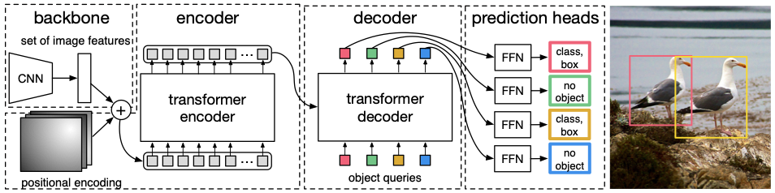
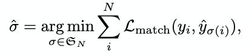
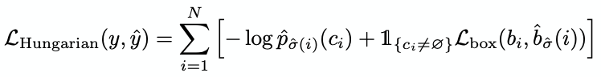
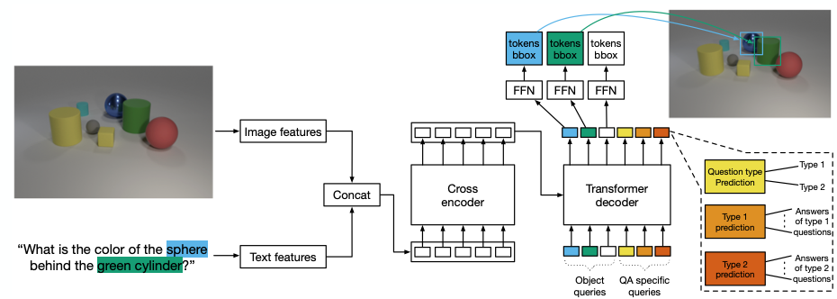
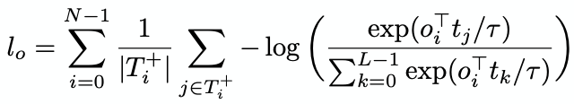
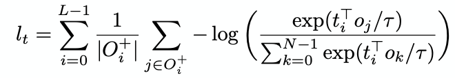
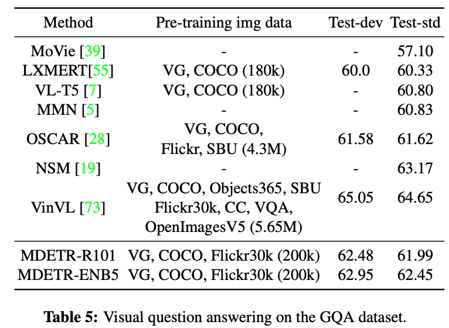

---
Aishwarya Kamath et al. / MDETR - Modulated Detection for End-to-End Multi-Modal Understanding / ICCV2021
---

# MDETR  \[Kor\]

[Kamath et al., "MDETR: Modulated Detection for End-to-End Multi-Modal Understanding", International Conference on Computer Vision, ICCV 2021](https://openaccess.thecvf.com/content/ICCV2021/html/Kamath_MDETR_-_Modulated_Detection_for_End-to-End_Multi-Modal_Understanding_ICCV_2021_paper.html)

Click [here](./iccv-2021-mdetr-eng.md) to read English version of this review.

##  1. Problem definition

Visual-linguistic model (혹은 vision-language model, visio-linguistic model로도 불린다) 은 이미지와 텍스트 둘 다가 주어졌을때, 이 둘을 활용해 주어진 문제를 푸는 모델을 말한다. 예를들어 VQA(visual question answering) 문제의 경우, 쇼파에 앉아있는 사람들의 사진이 주어지고, '사진에 사람은 몇 명입니까?' 라는 질문이 텍스트 형식으로 주어졌을 때 모델은 사진과 텍스트를 입력으로 받은 후 알맞은 답을 도출해야 한다. Vision과 language, 두 개의 모달리티에 대한 모델이기 때문에 visual-linguistic multi-modal system 이라고 지칭하기도 한다.

기존의 visual-linguistic multi-modal system 에서는 (e.g. VisualBert3, Vilbert5, LXMERT4, UNITER1), black box형태의 object detector에서 추출한 visual feature를 language와 함께, main neural nework (eg. transformer) 에 집어넣는 형태가 주를 이루었다. 

하지만 이러한 black box object detector를 사용하면 몇 가지 문제점이 발생하는데, 1) object detector는 더 이상 main neural network와 같이 학습되지 않으므로, 현재의 학습에 맞추어 detection performance가 개선될 여지가 없고, 2) 모델이 구별할 수 있는 물체의 종류는, object detector가 학습된 물체의 종류까지만으로 제한을 받는다. 또한 3) 통상적인 object detector는 detected bounding box안의 image feature들만을 추출하지, image의 전체적인 feature는 추출하지 않는다.

이렇게, black box object detector를 쓰는 통상적인 visual-linguistic model는, 어떤 이미지와 함께 이 이미지를 설명하는 free-form 형태의 text로 설명글이 주어졌을 때, 이 설명글에 포함되어 있을 수 있는 novel(참신)한 표현을 제대로 캡쳐하지 못하는 문제가 있다. 왜냐하면 이미 학습이 끝난 detection module의 입장에서 이제껏 본 적이 없는(detection module의 학습 시에 본 적이 없는) 표현에 대해선 제대로 detect 할 수 없기 때문이다.

하지만 이 논문이 제시하는 모델인 MDETR은 blackbox object detector가 필요없이, 전체적인 image feature와 text의 embedding을 네트워크 초기부터 엮어주어 end-to-end 방식으로 학습을 시키기 때문에, black box 형태의 detection module을 쓰는 것에서 기인하는 문제점들을 해결하였다. 

또한 더 나아가 phrase grounding과 referring expression comprehension등의 여러 multimodal reasoning task에도 효과적임을 보였다.

## 2. Motivation

### Related work

최근의 멀티모달 연구에 있어서는, 엄청나게 많은 image-text aligned data에 모델을 학습시켜서 전반적인 멀티모달 representation을 사전학습하고 (pretrain) 난 다음, downstream task들에 관해 학습 (fine-tuning) 시키는 방향으로 진행되고 있다. 모델은 통상적으로 transformer 구조를 사용한다.

이러한 연구들은 single-stream (하나의 transformer에 visual feature, language feature 둘 다를 주입) 과 two-stream (visual feature, language feature를 각각 다른 두개의 transformer에 주입한 후 두 transformer사이 cross-attention를 적용) 으로 나뉘는데, single-stream의 예로는 UNITER1, OSCAR2, VisualBert3 등이 있고, two-stream의 예로는 LXMERT4, Vilbert5 등이 있다.

대부분의 멀티모달 연구에서 visual feature는 앞서 언급했던 사전학습된 blackbox object detector로부터 추출되는데, 이 과정에서 생성된 image region들은 가끔 noisy하고, oversampled되거나 ambiguous하다는 문제가 있다. OSCAR는 object tag를 직접적으로 사용하여 이러한 문제를 해결하고자 했다. 또한 blackbox object detector로부터 야기되는 문제 중 이미 정해진 어휘집합 안에서만 detection이 이루어진다는 점이 있는데, 이를 해결하기 위해 VinVL6에서는 object detector가 훨씬 다양한 어휘집합에 대해서 학습이 된다.

그 외에도, 기존 Vision-Language 모델에 adversarial training을 적용하여 성능을 향상시킨 방법, scene graph를 사전학습때에 활용해 더 나은 representation을 배우는 방법 등 다양한 멀티모달 연구들이 있다.

### Idea

MDETR은 전체 image에 대한 image feature와, 해당 image에 대응되는 text(caption) feature를 공통의 transformer encoder에 입력으로 넣고, 그 후 transformer decoder에서는 text에서 언급이 된 물체들의 class와 bbox를 예측하는 구조를 가진다. 따라서 external blackbox detector없이도 전체 image의 feature를 학습하는 모델이 그려진다.

이를 통해, 기존 연구에서의 pretrained blackbox object detector를 사용함으로써 발생하는 문제를 해결하고, 기존의 연구에서보다 더 일찍 image와 text feature간 상호작용이 발생되어 더 촘촘한 멀티모달 representation을 학습할 수 있다고 논문에서는 주장한다.

## 3. Method

MDETR은 [DETR](https://arxiv.org/abs/2005.12872)7을 확장한 모델이다. 따라서 DETR을 먼저 이해하고 넘어갈 필요가 있다.

#### DETR

DETR은 기존 image detection 모델에서 사용되었던 anchor, FPN, NMS 와 같은 hand-crafted 방법 없이도 end-to-end 방식으로 detection을 잘 해낼수 있음을 보인 논문이다. 모델의 구조는 MDETR과 매우 비슷한데, MDETR에서 language 와 연관된 부분을 제외하면 DETR의 모델 구조가 나온다고 생각할 수 있다. 

ResNet8을 backbone으로 하는 DETR 모델은, 먼저 원본 이미지를 Resnet에 통과시킨 activation map을 flatten시키고 난 후 2D positional emcoding을 더해준 다음, 이를 transformer encoder의 입력으로 넣어준다. transformer encoder안에서 image와 text feature은 self attention을 통해 두 modality간의 joint representation으로 거듭난다. 이렇게 만들어진 Encoder의 output은 transformer decoder로 가서 attend 된다. 

Decoder의 input으로는 object query 라고 하는 임베딩이 들어가는데(torch의 nn.Embedding 으로 구현 되어있다), DETR모델이 학습되면서 점차 각각의 query를, detect된 object의 representation으로 업데이트해 나간다. 

DETR모델은 Object query의 decoder output에 weight를 공유하는 Feed-Forward Network (FFN) 을 달아서 각 object의 class와 bbox를 맞추도록 학습시킨다. 이 때 object query의 개수는 scene에 있을 object 개수보다 많이 두어서, query 개수가 부족해 object를 못 맞추는 일이 발생하지 않도록 한다. 또한 아무 object에도 해당이 안 되는 query는 'no object' class ($$\emptyset$$)로 예측하도록 한다.

Query 사이에는 순서가 없다. 다시 말하면 어떤 query가 어떤 object에 해당되는 것인지 뚜렸하게 정해져 있지않다. 따라서 DETR에서는 object들과 query들 사이의 최적의 matching을 찾아낸 후, 찾아낸 (ground truth)object - query쌍에 대해서 Hungarian loss를 구해 이에 대해 최적화한다.

구체적으로는, object 와 query 간 matching은 다음 permutation $$\hat{\sigma}$$을 찾음으로써 구해진다. 

여기서 $$\mathcal{\sigma}_N$$ 은 전체 permutation의 집합이고, $$y_i = (c_i, b_i)$$인데 $$c_i$$ 는 class, $$b_i$$ 는 bounding box를 의미한다. 

$$L_{match}$$ 는 $$-\mathbb{1}_{c_i \neq \emptyset}\hat{p}_{\sigma(i)}(c_i) + \mathbb{1}_{c_i \neq \emptyset}\mathcal{L}_{\text{box}}(b_i, \hat{b}_{\sigma(i)})$$ 인데, 여기서 $$\hat{p}_{\sigma(i)}(c_i)$$ 는 $$\sigma(i)$$ 번째에 해당하는 object의 class 가 $$c_i​$$ 일 확률이다.

그 다음, 이렇게 찾아낸 object - query 쌍에 대해 Hungarian loss를 최소화 함으로써 DETR의 학습이 이루어진다. 여기서 $$\mathcal{L}_{\text{box}}$$는 L1 distance와 IOU loss 를 더한 값이다.

#### MDETR 

MDETR은 DETR과 마찬가지로 backbone network 로부터 image feature를 추출한다 (backbone으로는 Resnet과 EfficientNet9을 쓴다). 여기에 추가적으로 text feature를 추출해야 하는데, 여기엔 사전학습된 Roberta10를 이용한다. 

이렇게 추출된 image feature와 text feature를 sequence demension을 따라 concatenate한 후 MDETR의 transformer encoder의 입력으로 넣어준다. 

transformer decoder에서는 DETR과 마찬가지로 object query를 입력으로 넣어주고, query의 decoder output에 FFN을 달아서, text에 나타나는 object들에 대한 class와 bbox를 예측하도록 한다. 

MDETR에서는 object query말고도, 앞으로 언급할 QA (question answering) task를 위한 QA specific query 들도 존재한다. 첫번째 QA query는 question type을 예측한다. 예를 들어 위의 사진과 같이 'What is the color of the sphere bebind the green cylinder?' 라고 물어보는 text가 있다면, 이것은 '색'을 알아맞춰야 하는 question임을 예측하고, 색을 예측하는 head에서는 해당 색깔이 'blue'임을 맞추어야 한다.

MDETR에서는 DETR의 Hungarian loss와 더불어 두 가지 추가적인 loss인, soft token prediction loss와 contrastive alignment loss에 대해서도 최적화한다. 두 loss는 image와 text representation 사이의 alignment를 위한 것이다.

**Soft token prediction**은 non parametric loss로서, matching이 끝난 한 query의 bounding box가, text의 어떤 부분과 관련이 있는지 예측하도록 한다. Soft token prediction은 같은 지칭사와 관련있는 복수개의 object들을 성공적으로 구별할 수 있도록 한다.
자세한 설명으로는, MDETR모델은 각 query(모델이 예측한 bbox라고 봐도 무방) 마다 관련이 있는 토큰들을 표시하는, logit을 출력하는데, 이 logit에 log_softmax를 취하면 BS x (num_queries) x (num_tokens) 행렬이 나온다. 이 행렬과, 이 행렬과 같은 사이즈의 실제 gt레이블의 행렬과의 Hadamard product 가 loss인 것이 바로 soft token prediction이다.

**Contrastive alignment**는 decoder의 output인 object의 representation과, encoder의 output인 object에 해당하는 text의 representation 사이의 간격을 좁혀, soft token prediction보다는 더욱 직접적인 alignment를 학습하도록 한다. 구체적인 식은 다음과 같다.

여기서 $$L​$$ 과 $$N​$$ 은 각각 text token의 최대 개수와 object의 최대 개수이다. $$T^+_i​$$ 는 object $$o_i​$$ 에 해당하는 text token들의 집합이고,  $$O^+_i​$$ 는 text token $$t_i​$$ 에 해당하는 object들의 집합이다. $$\tau​$$ 는 temperature parameter이며 여기서는 0.07로 맞추었다. 

MDETR에서는 $$l_o$$ 와 $$l_t$$ 의 평균을 contrastive alignment loss로 정한다.

## 4. Experiment & Result

### Experimental setup

저자는 1) Synthetic image, 2) Natural image에 대해 각각 실험을 진행하였다.

#### Synthetic image data: CLEVR11

##### Dataset 

CLEVR은 멀티모달 모델의 성능을 측정하기 위한 데이터셋으로서, 원뿔, 구, 원기둥 등의 합성된 물체들이 나열되어 있고, 이 나열된 상태에 대한 질문이 수반된다. 나열된 물체를 detect하는것은 쉽도록 되어 있지만, 질문을 이해하는 것이 상당히 어려울 수 있는데, 최대 20개의 논리적 단계를 완성해야만 풀 수 있는 질문들도 있기 때문이다. 저자는 MDETR에는 이러한 복잡한 reasoning task를 위한 inductive bias가 없음에도 CLEVR 데이터셋 벤치마크에서 좋은 성능을 보임을 실험적으로 증명한다.

한가지 알아둘 점은, 오리지널 CLEVR데이터셋에서는 MDETR의 학습에 필요한 1) bounding box annotation과, 2) bounding box - text token 간의 alignment 정보가 없기 때문에 저자는 scene graph를 이용해 bounding box annotation을 만들고, CLEVR가 포함하는 functional program이용해 bounding box - text token alignment를 만든다고 한다.

##### Model

Vision backbone으로는 ResNet-18, text-encoder로는 HuggingFace의 pretrained DistilRoberta를 이용했다. 메인 transformer의 구조는 6 encoder layer + 6 decoder layer, 그리고 8 attention heads 를 이용한다. 

##### Baselines

MAttNet, MGA-Net, LiLM, MAC, NS-VQA, OCCAM 모델들을 baseline으로 삼고 실험을 진행했다. 그 중 가장 성능이 좋은 NS-VQA는 ground truth annotation을 이용한 외부적인 지도학습 시그널을 이용하지만, MDETR은 그러한 시그널이 없이도 좋은 성능을 보여줌을 실험으로 보였다.

##### Training setup

전체 CLEVR데이터셋 중 질문의 대상이 되는 object를 한번만 언급하는 데이터들을 모은 것을 CLEVR-Medium이라고 하고, 이것은 전체 CLEVR데이터셋에 비해 15%더 적다.

저자는 커리큘럼 러닝 방식을 사용했는데, 처음 30epoch동안은 CLEVR-Medium 에 대해서만 학습시키고, 그 다음 30epoch는 전체 CLEVR에 대해서 학습시킨다. 커리큘럼 러닝을 사용하지 않았을 때는 성능상 손해를 봄을 실험적으로 확인하였다고 한다. 

CLEVR에서의 QA specific head로는 numerical, binary, attributes head를 이용한다고 한다.

##### Evaluation metric

정확도(accuracy)를 메트릭으로 사용하였다. 여기서 accuracy는 모델이 예측한 결과와 ground-truth label의 일치율이다.

##### Note

CLEVR-Humans: 모델을 zero-shot setting에서 실험하기 위한, 사람이 만든 질문으로 이루어진 CLEVR데이터셋 

CLEVR-REF+ - referring expression comprehension task를 위한 데이터셋. 각 object query가 언급되고 있는 object에 해당하는지 / 아닌지를 예측하는 task. FFN에 binary head를 추가한다.

##### Result

다른 모델들이 이용한 1) external supervision signal, 2) specific inductive bias for CLEVR task 이 없이도 최고 수준의 성능을 보임을 입증한다.

#### Natural image data: Combined dataset

Natural image dataset으로는 **phrase grounding** (문장에서의 구(phrase) 들을 주었을 때, 각 구에 해당하는 bounding box를 예측. 예를들어 '두 사람이 공놀이를 하고 있다'라는 문장이 있으면, 이에 해당하는 사진 안에서 사람 두명과, 공 하나에 대해 총 3개의 bounding box를 예측해야 한다.), **referring expression comprehension**(언급되는 object의 bounding box 예측. 예를들어 '닌텐도 wii를 하고있는 여성'이라는 문장과 이에 해당하는 사진이 있으면, 해당하는 여성의 bounding box를 예측해야 한다. 주어진 문장안의 언급되는 object는 보통 하나이다. 구(phrase)마다 boudning box를 예측하는 문제는 아니다.), **referring expression segmentation**(언급되는 object를 pixel level로 segmentation 예측. 앞서 말한 referrring expression comprehension에서 bounding box대신 pixel level segmentation을 한다고 생각하면 된다.), **VQA**(사진에 대한 질문에 옳바른 답을 예측. 예를 들어 쇼파에 앉아있는 사람들의 사진이 주어지고, '사진에 사람은 몇 명입니까?' 라는 질문이 텍스트 형식으로 주어졌을 때 모델은 사진과 텍스트를 입력으로 받은 후 알맞은 답을 도출해야 한다) task들을 수행하였다.

##### Pretraining & Dataset

Pretraining으로는, image에 align된 text안에서 언급되는 모든 object들을 detect하는 task에 대해서 학습을 진행했다.

pretraining에 쓰이는 데이터셋으로는 여러 open source 데이터셋을 혼합하여 만들었는데, Flickr30k12, MS COCO13, Visual Genome14 데이터셋의 이미지를 활용하였고, annotation은 referring expressions datasets, VG regions, Flickr entities, GQA train balanced set을 이용해 만들었다고 한다.

##### Model

Text encoder로는 HuggingFace의 pretrained RoBERTa-base를, vision backbone으로는 1) ResNet-101, 2) EfficientNet 을 사용하였다.

##### Baselines

Single stream 이나 two stream VL model (VisualBert, ViLBERT, VL-BERT15, UNITER, VILLA16, OSCAR, VinVL)을 각 downstream task에 사용하였다.

##### Metric

Downstream task에 따라 accuracy, precision, Mean IOU, R@k 등이 사용된다. 여기서 accuracy는 모델이 예측한 결과와 ground-truth label의 일치율이다.

##### Result

Phrase grounding: 위에서 언급한 pretraining 후에 fine-tuning을 할 경우 기존 SOTA(VisualBert)에 비해 12.1point 성능향상을 보였다. pretraining이 없는 경우에도 SOTA에 비해 8.5point 성능향상을 보였다.

Referring expressions comprehension: UNITER를 비롯하여, [Buttom up Top down detector](https://github.com/peteanderson80/bottom-up-attention)17 를 이용한 다른 기존 연구에서는 detector가 valid 및 test set에 대한 데이터에도 학습이 된 소위 'test set leak' 가 있는데에 반해, MDETR은 그렇지 않음에도 SOTA 성능에 도달했다.

Referring expressions segmentation:

Visual Question Answering:

## 5. Conclusion

MDETR은 완전한 end-to-end 방식의 multimodal object detector로서, 기존의 external pretrained detector를 차용하는 모델들의 단점을 극복하였다. 또한 각각의 downstream task에 대해서 external dataset이나 explicit inductive bias가 없이도 다수의 task에서 SOTA 수준의 성능을 입증해, 여러 task에 대해 성공적으로 확장 가능함을 보여준다.

### Take home message \(오늘의 교훈\)

Fully end-to-end fashion is preferrable.

## Author / Reviewer information

### Reviewer

1. 이해주(Haeju Lee) / KAIST / lhg912@kaist.ac.kr

## Reference & Additional materials

1. Chen et al., "UNITER: UNiversal Image-TExt Representation Learning", European Conference on Computer Vision (ECCV) 2020.
2. Li et al., "OSCAR: Object-Semantics Aligned Pre-training for Vision-and-Language Tasks", arXiv preprint arXiv:2004.06165, 2020.
3. Li et al., "VisualBERT: A Simple and Performant Baseline for Vision and Language", arXiv preprint arXiv:1908.03557, 2019.
4. Tan et al., "LXMERT: Learning Cross-Modality Encoder Representations from Transformers", Empirical Methods in Natural Language Processing(EMNLP) 2019.
5. Lu et al., "ViLBERT: Pretraining Task-Agnostic Visiolinguistic Representations for Vision-and-Language Tasks", Conference on Neural Information Processing Systems (NeurIPS) 2019.
6. Zhang et al., "VinVL: Revisiting Visual Representations in Vision-Language Models", Conference on Computer Vision and Pattern Recognition(CVPR) 2021.
7. Carion et al., "End-to-End Object Detection with Transformers", European Conference on Computer Vision(ECCV) 2020.
8. He et al., "Deep Residual Learning for Image Recognition", Conference on Computer Vision and Pattern Recognition(CVPR) 2016.
9. Tan et al., "EfficientNet: Rethinking Model Scaling for Convolutional Neural Networks", International Conference on Machine Learning(ICML) 2019.
10. Liu et al., "RoBERTa: A Robustly Optimized BERT Pretraining Approach", arXiv preprint arXiv:1907.11692, 2019.
11. Johnson et al., "CLEVR: A Diagnostic Dataset for Compositional Language and Elementary Visual Reasoning", Conference on Computer Vision and Pattern Recognition(CVPR) 2017.
12. Plummer et al., "Flickr30k Entities: Collecting Region-to-Phrase Correspondences for Richer Image-to-Sentence Models",  International Conference on Computer Vision(ICCV) 2015.
13. Lin et al., "Microsoft COCO: Common Objects in Context", European Conference on Computer Vision(ECCV) 2014.
14. Krishna et al., "Visual Genome: Connecting Language and Vision Using Crowdsourced Dense Image Annotations", International Journal of Computer Vision(IJCV) 2017.
15. Su et al., "VL-BERT: Pre-training of Generic Visual-Linguistic Representations", International Conference on Learning Representations (ICLR) 2020.
16. Gan et al., "Large-Scale Adversarial Training for Vision-and-Language Representation Learning", Conference on Neural Information Processing Systems (NeurIPS) 2020.
17. Anderson et al., "Bottom-Up and Top-Down Attention for Image Captioning and Visual Question Answering", Conference on Computer Vision and Pattern Recognition(CVPR) 2016.